# Comparing Alignment Methods

## Introduction

fdars provides four approaches to curve alignment, each with different
trade-offs in terms of automation, smoothness, interpretability, and
speed. This article compares them side-by-side on the same data, and
provides guidance on when to use each method.

The four methods are:

1.  **Elastic alignment** (`elastic.align`, `karcher.mean`) – global
    optimization via dynamic programming in SRSF space. See
    `vignette("elastic-alignment", package = "fdars")` for full details.
2.  **Landmark registration** (`landmark.register`) – feature-based
    piecewise-linear warping. See
    `vignette("landmark-registration", package = "fdars")` for full
    details.
3.  **Constrained elastic alignment** (`elastic.align.constrained`) –
    elastic alignment with landmark pass-through constraints
4.  **TSRVF** (`tsrvf.transform`) – not an alignment method per se, but
    a linearization of elastic alignment for downstream analysis. See
    `vignette("tsrvf", package = "fdars")` for full details.

``` r
library(fdars)
#> 
#> Attaching package: 'fdars'
#> The following objects are masked from 'package:stats':
#> 
#>     cov, decompose, deriv, median, sd, var
#> The following object is masked from 'package:base':
#> 
#>     norm
library(ggplot2)
library(patchwork)
theme_set(theme_minimal())
```

## Test Data

We use two datasets that highlight different alignment challenges.

### Dataset 1: Smooth Phase Shifts

Curves with smooth, global timing differences – the classic alignment
scenario:

``` r
set.seed(42)
argvals <- seq(0, 1, length.out = 200)
n <- 15

data_smooth <- matrix(0, n, 200)
for (i in 1:n) {
  shift <- runif(1, -0.1, 0.1)
  amp <- rnorm(1, 1, 0.15)
  data_smooth[i, ] <- amp * sin(2 * pi * (argvals - shift)) +
                       0.4 * amp * sin(4 * pi * (argvals - shift * 0.7))
}
fd_smooth <- fdata(data_smooth, argvals = argvals)
```

### Dataset 2: Distinct Feature Shifts

Curves with clearly identifiable peaks that shift independently – where
domain knowledge matters:

``` r
data_feat <- matrix(0, n, 200)
for (i in 1:n) {
  pk1 <- runif(1, 0.15, 0.35)
  pk2 <- runif(1, 0.55, 0.75)
  w1 <- rnorm(1, 1, 0.2)
  w2 <- rnorm(1, 0.8, 0.15)
  data_feat[i, ] <- w1 * exp(-200 * (argvals - pk1)^2) +
                     w2 * exp(-200 * (argvals - pk2)^2) +
                     0.05 * rnorm(200)
}
fd_feat <- fdata(data_feat, argvals = argvals)
```

``` r
p1 <- plot(fd_smooth) + labs(title = "Dataset 1: Smooth Phase Shifts")
p2 <- plot(fd_feat) + labs(title = "Dataset 2: Distinct Features")
p1 + p2
```

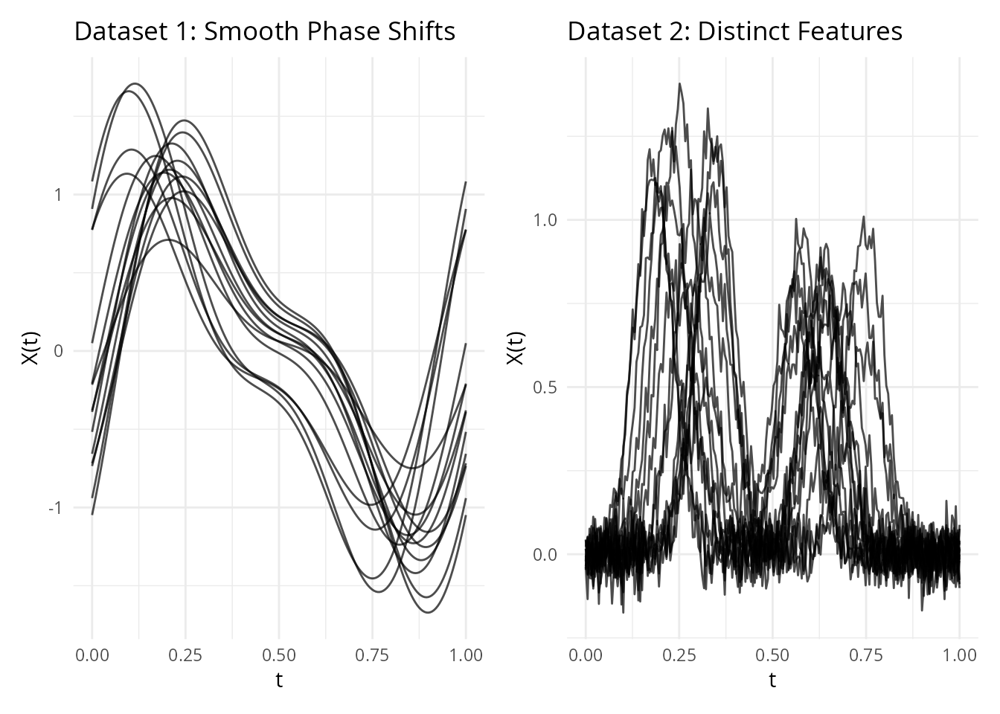

## Method 1: Elastic Alignment

Elastic alignment finds the globally optimal warping function by
minimizing the $L^{2}$ distance between SRSFs via dynamic programming.
It requires no feature detection and produces smooth, diffeomorphic
warping functions.

**Mathematical basis**: minimize
$\parallel \, q_{1} - \left( q_{2} \circ \gamma \right)\sqrt{\dot{\gamma}}\, \parallel_{L^{2}}^{2}$
over the warping group $\Gamma$, where $q_{i}$ is the SRSF of $f_{i}$.

``` r
ea_smooth <- elastic.align(fd_smooth)
ea_feat <- elastic.align(fd_feat)
```

``` r
p1 <- plot(ea_smooth, type = "aligned") + labs(title = "Elastic (smooth data)")
p2 <- plot(ea_feat, type = "aligned") + labs(title = "Elastic (feature data)")
p1 + p2
```

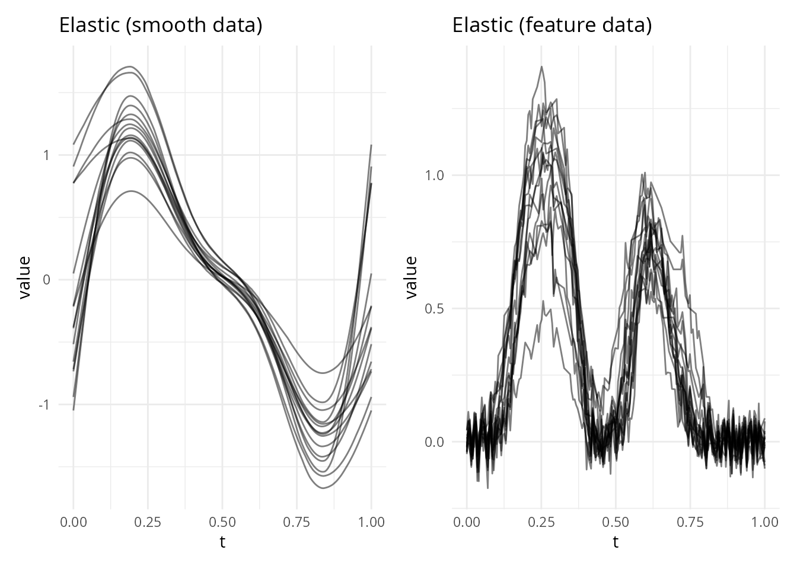

## Method 2: Landmark Registration

Landmark registration detects features (peaks, valleys, etc.) and warps
curves so that corresponding features align to common target positions.
The warping is piecewise-linear between anchor points.

**Mathematical basis**: For landmarks $\tau_{i,j}$ and targets
$\tau_{j}^{*}$, construct $\gamma_{i}$ as a piecewise-linear function
satisfying $\gamma_{i}\left( \tau_{j}^{*} \right) = \tau_{i,j}$.

``` r
lr_smooth <- landmark.register(fd_smooth, kind = "peak", min.prominence = 0.3,
                                expected.count = 1)
lr_feat <- landmark.register(fd_feat, kind = "peak", min.prominence = 0.2,
                              expected.count = 2)
```

``` r
p1 <- plot(lr_smooth, type = "registered") +
  labs(title = "Landmark (smooth data)")
p2 <- plot(lr_feat, type = "registered") +
  labs(title = "Landmark (feature data)")
p1 + p2
```

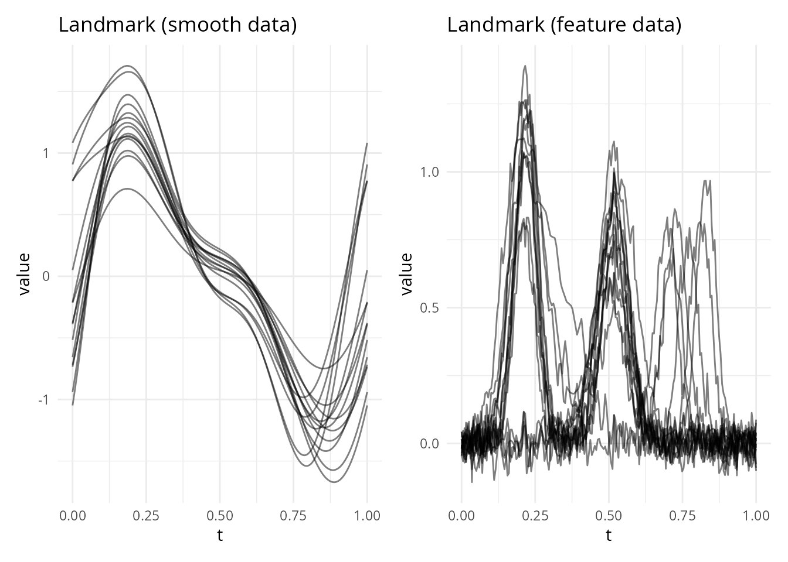

## Method 3: Constrained Elastic Alignment

Constrained elastic alignment combines the smooth, globally optimal
warping of elastic alignment with landmark pass-through constraints. The
warping is computed by segmented dynamic programming between landmark
anchor points.

**Mathematical basis**: minimize
$\parallel q_{1} - \left( q_{2} \circ \gamma \right)\sqrt{\dot{\gamma}} \parallel_{L^{2}}^{2}$
subject to $\gamma\left( \tau_{j}^{*} \right) = \tau_{i,j}$ for each
landmark pair.

``` r
ec_smooth <- elastic.align.constrained(fd_smooth, kind = "peak",
                                        min.prominence = 0.3,
                                        expected.count = 1)
ec_feat <- elastic.align.constrained(fd_feat, kind = "peak",
                                      min.prominence = 0.2,
                                      expected.count = 2)
```

``` r
p1 <- plot(ec_smooth, type = "aligned") +
  labs(title = "Constrained (smooth data)")
p2 <- plot(ec_feat, type = "aligned") +
  labs(title = "Constrained (feature data)")
p1 + p2
```

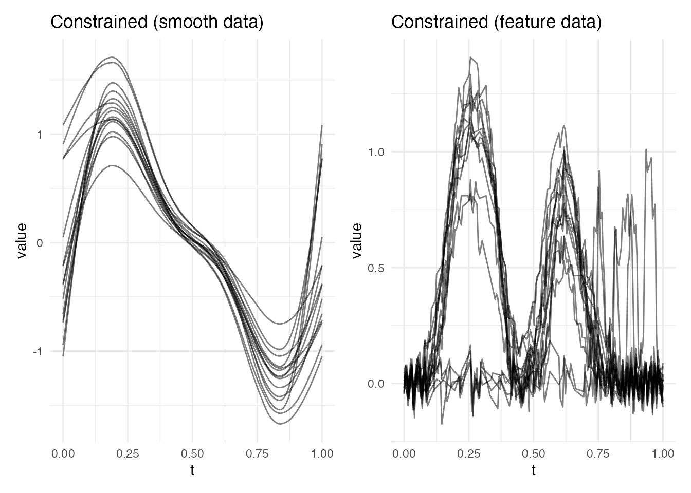

## Warping Function Comparison

The warping functions reveal the fundamental difference between methods.
Elastic produces smooth warps, landmark produces piecewise-linear warps,
and constrained is smooth but passes through landmark anchor points:

``` r
p1 <- plot(ea_feat, type = "warps") + labs(title = "Elastic Warps")
p2 <- plot(lr_feat, type = "warps") + labs(title = "Landmark Warps")
p3 <- plot(ec_feat, type = "warps") + labs(title = "Constrained Warps")
p1 + p2 + p3
```

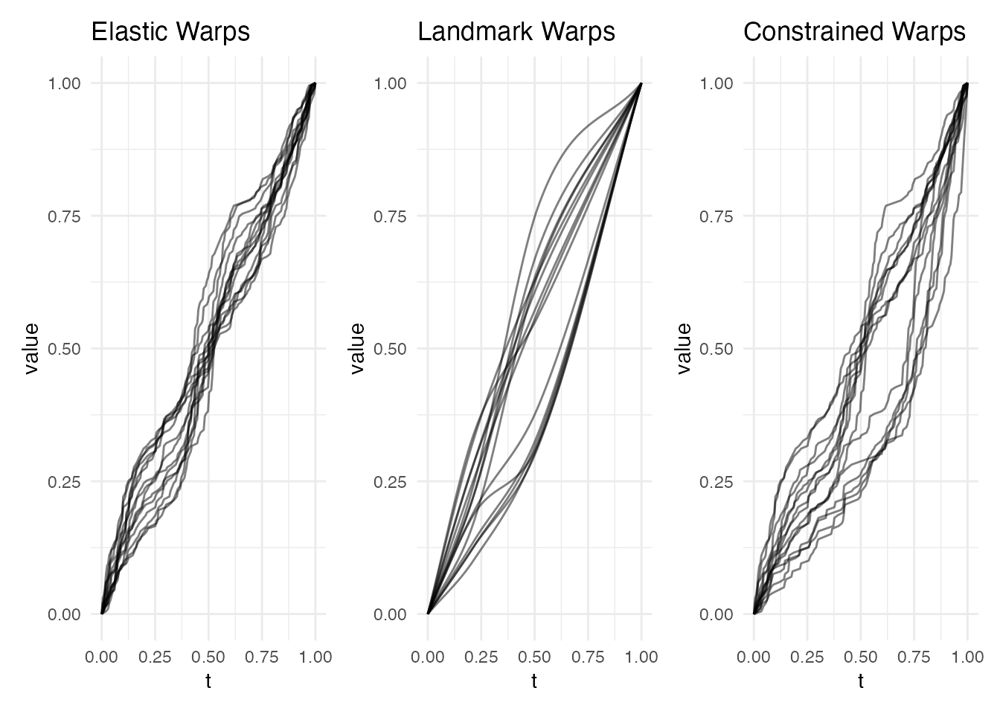

## Quantitative Comparison

### Variance Reduction

Variance reduction (VR) measures how much pointwise variance is removed
by alignment. Higher VR means more phase variability was captured:

$$\text{VR} = 1 - \frac{\text{mean pointwise variance (aligned)}}{\text{mean pointwise variance (original)}}$$

``` r
vr <- function(original, aligned) {
  var_orig <- mean(apply(original$data, 2, var))
  var_aligned <- mean(apply(aligned$data, 2, var))
  1 - var_aligned / var_orig
}

results <- data.frame(
  Dataset = rep(c("Smooth shifts", "Distinct features"), each = 3),
  Method = rep(c("Elastic", "Landmark", "Constrained"), 2),
  VR = c(
    vr(fd_smooth, ea_smooth$aligned),
    vr(fd_smooth, lr_smooth$registered),
    vr(fd_smooth, ec_smooth$aligned),
    vr(fd_feat, ea_feat$aligned),
    vr(fd_feat, lr_feat$registered),
    vr(fd_feat, ec_feat$aligned)
  )
)

results$VR <- round(results$VR, 3)
print(results)
#>             Dataset      Method    VR
#> 1     Smooth shifts     Elastic 0.527
#> 2     Smooth shifts    Landmark 0.380
#> 3     Smooth shifts Constrained 0.527
#> 4 Distinct features     Elastic 0.718
#> 5 Distinct features    Landmark 0.248
#> 6 Distinct features Constrained 0.054
```

``` r
ggplot(results, aes(x = Method, y = VR, fill = Dataset)) +
  geom_col(position = "dodge") +
  labs(title = "Variance Reduction by Method",
       y = "Variance Reduction (higher = better)") +
  scale_fill_manual(values = c("Smooth shifts" = "steelblue",
                                "Distinct features" = "coral")) +
  ylim(0, 1)
```

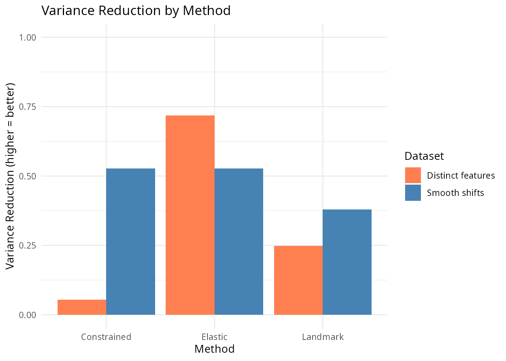

### Alignment Quality Diagnostics

For the Karcher mean (elastic), we can compute detailed diagnostics:

``` r
km_smooth <- karcher.mean(fd_smooth, max.iter = 15)
aq_smooth <- alignment.quality(fd_smooth, km_smooth)
print(aq_smooth)
#> Alignment Quality Diagnostics
#>   Mean warp complexity: 0.1576 
#>   Mean warp smoothness: 125.5327 
#>   Total variance:      0.1426 
#>   Amplitude variance:  0.0669 
#>   Phase variance:      0.0758 
#>   Phase/Total ratio:   0.5312 
#>   Mean VR:             0.4606
```

### Amplitude-Phase Decomposition

Elastic alignment uniquely provides a principled decomposition of total
variability into amplitude and phase components:

``` r
plot(aq_smooth, type = "variance")
```

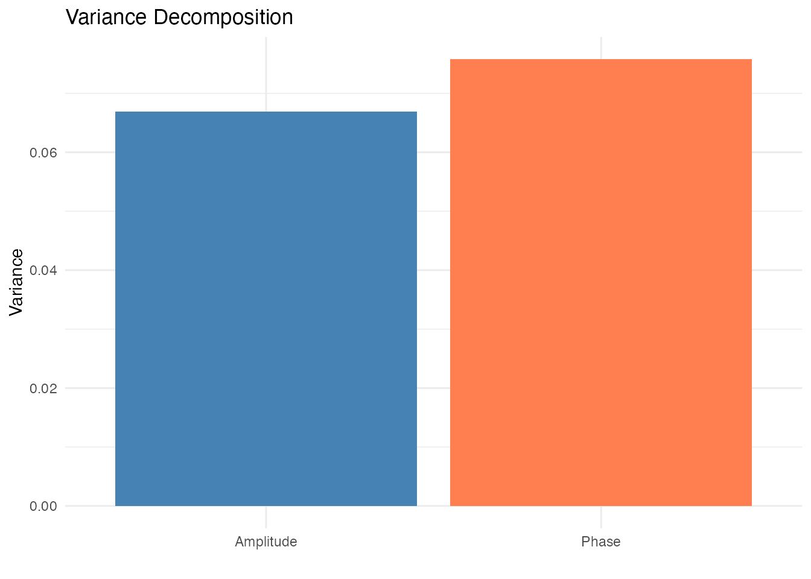

## When Methods Succeed and Fail

The examples above use well-behaved data. Real data is messier. This
section shows targeted scenarios where each method shines and where it
breaks down, so you can match the method to your data.

### Scenario 1: Elastic Excels — Smooth Global Warping

When curves differ only by smooth, continuous timing changes with no
distinct features, elastic alignment is ideal. It finds the optimal
warping without needing any manual tuning:

``` r
set.seed(101)
argvals <- seq(0, 1, length.out = 200)
n <- 12

# Smooth curves with continuous phase variation
data_global <- matrix(0, n, 200)
for (i in 1:n) {
  # Smooth nonlinear warp of the time axis
  warp_strength <- runif(1, -0.15, 0.15)
  t_warped <- argvals + warp_strength * sin(pi * argvals)
  t_warped <- (t_warped - min(t_warped)) / (max(t_warped) - min(t_warped))
  amp <- rnorm(1, 1, 0.1)
  data_global[i, ] <- amp * (sin(2 * pi * t_warped) + 0.3 * cos(6 * pi * t_warped))
}
fd_global <- fdata(data_global, argvals = argvals)

ea_global <- elastic.align(fd_global)

# Landmark registration struggles: no clear isolated peaks
lr_global <- tryCatch(
  landmark.register(fd_global, kind = "peak", min.prominence = 0.3, expected.count = 1),
  error = function(e) NULL
)

p1 <- plot(fd_global) + labs(title = "Original: Smooth Warping")
p2 <- plot(ea_global, type = "aligned") + labs(title = "Elastic: Clean alignment")
if (!is.null(lr_global)) {
  p3 <- plot(lr_global, type = "registered") + labs(title = "Landmark: Misses subtlety")
  p1 + p2 + p3 + plot_layout(ncol = 3)
} else {
  p3 <- ggplot() + annotate("text", x = 0.5, y = 0.5,
    label = "Landmark failed:\nno consistent features found",
    size = 4, hjust = 0.5) + theme_void() + labs(title = "Landmark: Failed")
  p1 + p2 + p3 + plot_layout(ncol = 3)
}
```

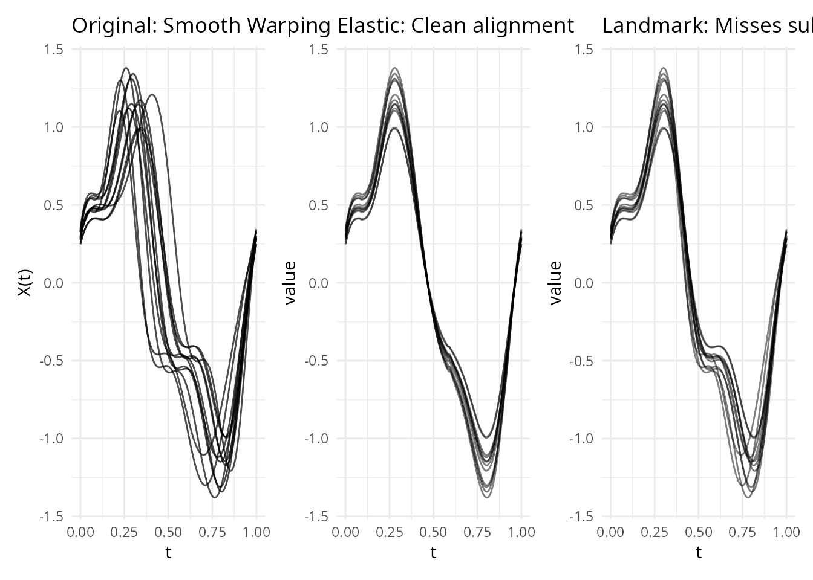

**Why elastic wins**: The Fisher-Rao metric captures continuous phase
variation naturally. Landmark registration needs identifiable features,
and these smooth curves have overlapping, broad oscillations with no
clear anchor points.

### Scenario 2: Landmark Excels — Identifiable Features Shifting Independently

When curves have clearly defined peaks or valleys that shift to
different positions, landmark registration directly targets what
matters:

``` r
# Two-peak curves where peaks shift independently
data_peaks <- matrix(0, n, 200)
for (i in 1:n) {
  pk1_pos <- runif(1, 0.15, 0.35)
  pk2_pos <- runif(1, 0.6, 0.8)
  h1 <- rnorm(1, 1.5, 0.2)
  h2 <- rnorm(1, 1.0, 0.15)
  data_peaks[i, ] <- h1 * exp(-300 * (argvals - pk1_pos)^2) +
                      h2 * exp(-300 * (argvals - pk2_pos)^2)
}
fd_peaks <- fdata(data_peaks, argvals = argvals)

lr_peaks <- landmark.register(fd_peaks, kind = "peak", min.prominence = 0.3,
                               expected.count = 2)
ea_peaks <- elastic.align(fd_peaks)

p1 <- plot(fd_peaks) + labs(title = "Original: Two Shifting Peaks")
p2 <- plot(lr_peaks, type = "registered") + labs(title = "Landmark: Peaks aligned")
p3 <- plot(ea_peaks, type = "aligned") + labs(title = "Elastic: May swap features")
p1 + p2 + p3 + plot_layout(ncol = 3)
```

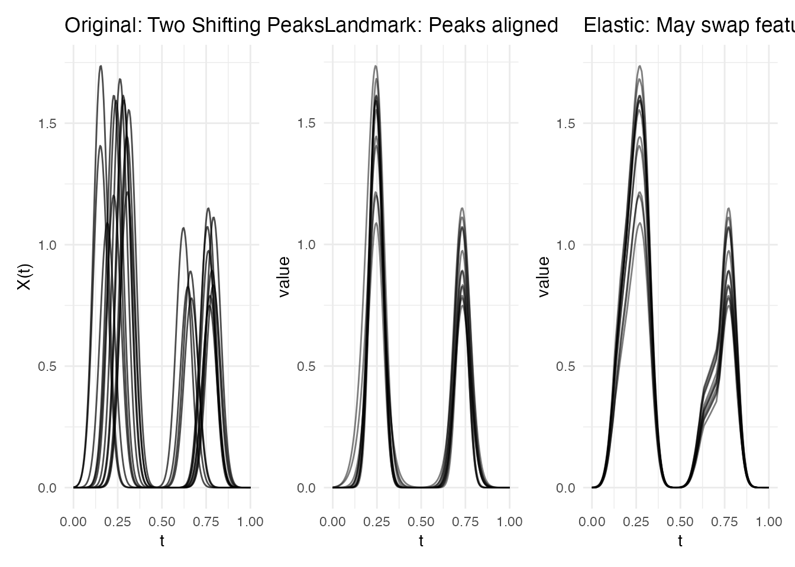

**Why landmark wins**: It guarantees that peak 1 aligns to peak 1 and
peak 2 to peak 2. Elastic alignment has no feature awareness — it
minimizes overall distance, which can sometimes swap or merge features
when they are far apart.

### Scenario 3: Elastic Struggles — Noisy Data

When curves are noisy, elastic alignment’s dynamic programming can
over-warp, matching noise spikes rather than underlying signal. The
solution: smooth first, then align:

``` r
# Clean signal + heavy noise
data_noisy <- matrix(0, n, 200)
for (i in 1:n) {
  shift <- runif(1, -0.08, 0.08)
  signal <- sin(2 * pi * (argvals - shift))
  data_noisy[i, ] <- signal + rnorm(200, 0, 0.4)
}
fd_noisy <- fdata(data_noisy, argvals = argvals)

# Direct alignment on noisy data: over-warping
ea_noisy_raw <- elastic.align(fd_noisy)

# Better approach: smooth first, then align
fd_smooth_noisy <- fdata(t(apply(fd_noisy$data, 1, function(y) {
  stats::smooth.spline(argvals, y, spar = 0.6)$y
})), argvals = argvals)
ea_noisy_smooth <- elastic.align(fd_smooth_noisy)

p1 <- plot(fd_noisy) + labs(title = "Original: Noisy Curves")
p2 <- plot(ea_noisy_raw, type = "aligned") +
  labs(title = "Elastic on raw: Over-warps")
p3 <- plot(ea_noisy_smooth, type = "aligned") +
  labs(title = "Smooth then align: Controlled")
p1 + p2 + p3 + plot_layout(ncol = 3)
```

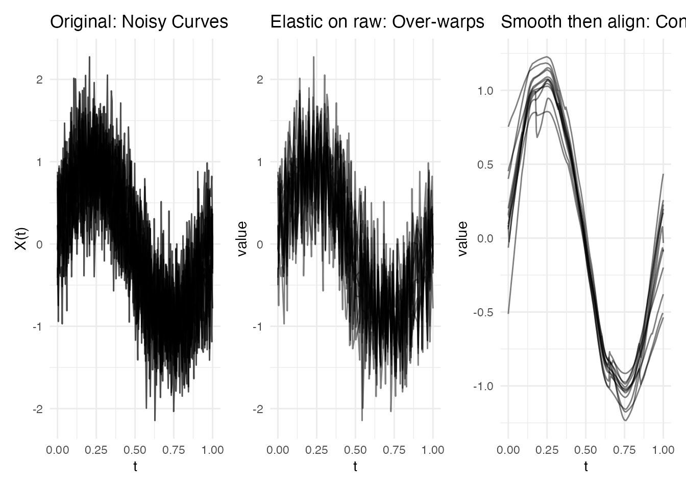

``` r
p4 <- plot(ea_noisy_raw, type = "warps") +
  labs(title = "Warps (raw): Overly complex")
p5 <- plot(ea_noisy_smooth, type = "warps") +
  labs(title = "Warps (smoothed): Reasonable")
p4 + p5
```

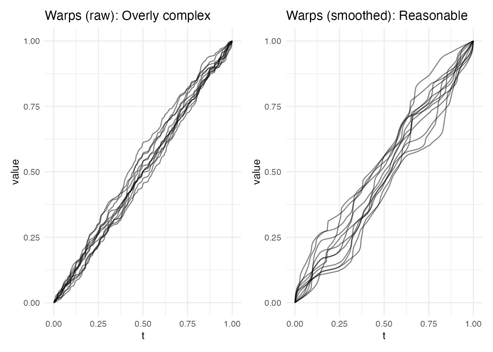

**Lesson**: Always smooth noisy data before elastic alignment. The SRSF
transform amplifies noise (it involves a derivative), causing the
dynamic programming to match noise spikes. Pre-smoothing with splines or
a kernel smoother prevents over-warping. Alternatively, use
[`karcher.mean()`](https://sipemu.github.io/fdars-r/reference/karcher.mean.md)
with its `lambda` parameter to penalize warp complexity.

### Scenario 4: Landmark Struggles — Variable Number of Features

When curves have different numbers of features, landmark registration
with a fixed `expected.count` forces all curves into the same template.
This can produce artifacts:

``` r
data_var <- matrix(0, n, 200)
for (i in 1:n) {
  # Some curves have 1 peak, others have 2
  if (i <= n/2) {
    pk1 <- runif(1, 0.3, 0.5)
    data_var[i, ] <- 1.5 * exp(-300 * (argvals - pk1)^2)
  } else {
    pk1 <- runif(1, 0.2, 0.35)
    pk2 <- runif(1, 0.6, 0.75)
    data_var[i, ] <- exp(-300 * (argvals - pk1)^2) + exp(-300 * (argvals - pk2)^2)
  }
  data_var[i, ] <- data_var[i, ] + 0.02 * rnorm(200)
}
fd_var <- fdata(data_var, argvals = argvals)

# Landmark fails gracefully but results are unreliable
lr_var <- tryCatch(
  landmark.register(fd_var, kind = "peak", min.prominence = 0.2, expected.count = 2),
  error = function(e) NULL
)
ea_var <- elastic.align(fd_var)

p1 <- plot(fd_var) + labs(title = "Original: Mixed 1-peak & 2-peak")
p2 <- plot(ea_var, type = "aligned") + labs(title = "Elastic: Handles gracefully")
if (!is.null(lr_var)) {
  p3 <- plot(lr_var, type = "registered") +
    labs(title = "Landmark: Forced 2-peak template")
} else {
  p3 <- ggplot() + annotate("text", x = 0.5, y = 0.5,
    label = "Landmark failed:\ncannot find 2 peaks in all curves",
    size = 4, hjust = 0.5) + theme_void() + labs(title = "Landmark: Failed")
}
p1 + p2 + p3 + plot_layout(ncol = 3)
```

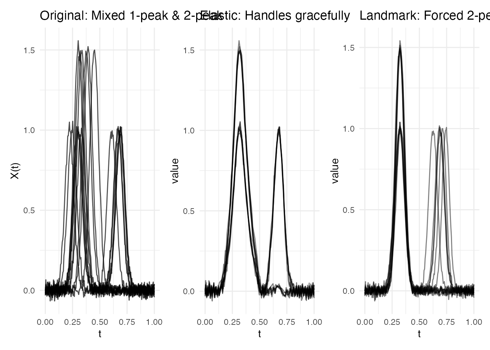

**Why elastic wins here**: It makes no assumptions about features. When
curves have genuinely different shapes, elastic alignment finds the best
continuous warping for each pair. Landmark registration requires a
consistent feature template across all curves.

### Scenario 5: Constrained Excels — Best of Both Worlds

When you have identifiable features AND want smooth warping between
them, constrained elastic alignment is the best choice:

``` r
# ECG-like data: sharp features + smooth variation between them
data_ecg <- matrix(0, n, 200)
for (i in 1:n) {
  r_pos <- runif(1, 0.3, 0.45)
  t_pos <- runif(1, 0.55, 0.7)
  # R-wave (tall sharp peak)
  r_wave <- 2.0 * exp(-800 * (argvals - r_pos)^2)
  # T-wave (broader, shorter)
  t_wave <- 0.6 * exp(-100 * (argvals - t_pos)^2)
  # Baseline wander
  baseline <- 0.15 * sin(2 * pi * argvals + runif(1, 0, 2*pi))
  data_ecg[i, ] <- r_wave + t_wave + baseline + 0.03 * rnorm(200)
}
fd_ecg <- fdata(data_ecg, argvals = argvals)

ea_ecg <- elastic.align(fd_ecg)
lr_ecg <- landmark.register(fd_ecg, kind = "peak", min.prominence = 0.3,
                             expected.count = 2)
ec_ecg <- elastic.align.constrained(fd_ecg, kind = "peak",
                                     min.prominence = 0.3,
                                     expected.count = 2)

p1 <- plot(fd_ecg) + labs(title = "Original: ECG-like")
p2 <- plot(ea_ecg, type = "aligned") + labs(title = "Elastic: Good overall")
p3 <- plot(lr_ecg, type = "registered") +
  labs(title = "Landmark: Peaks aligned, warps angular")
p4 <- plot(ec_ecg, type = "aligned") +
  labs(title = "Constrained: Peaks aligned + smooth warps")
(p1 + p2) / (p3 + p4)
```

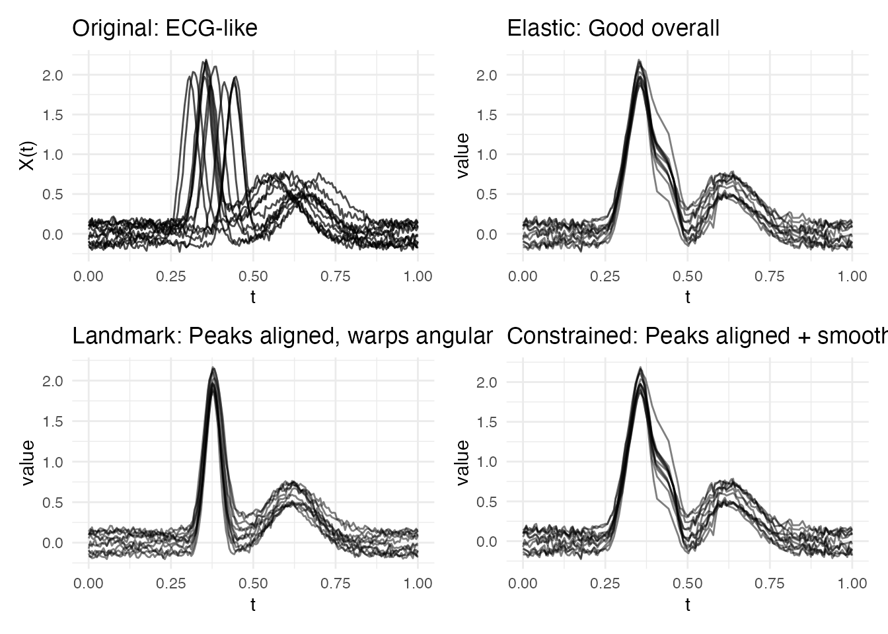

``` r
p5 <- plot(ea_ecg, type = "warps") + labs(title = "Elastic warps")
p6 <- plot(lr_ecg, type = "warps") + labs(title = "Landmark warps (piecewise-linear)")
p7 <- plot(ec_ecg, type = "warps") + labs(title = "Constrained warps (smooth + anchored)")
p5 + p6 + p7 + plot_layout(ncol = 3)
```

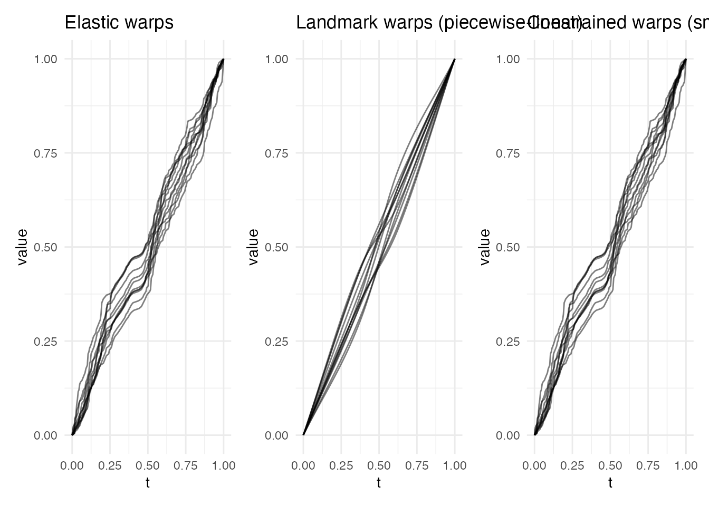

**Why constrained wins**: The R-wave and T-wave are clinically
meaningful features that must correspond correctly (landmark guarantee).
But between these features, elastic optimization produces smoother warps
than the piecewise-linear interpolation of pure landmark registration.

### Scenario Summary

| Scenario                    | Best method           | Why                                                          |
|:----------------------------|:----------------------|:-------------------------------------------------------------|
| Smooth global warping       | Elastic               | No features to anchor; elastic finds optimal continuous warp |
| Independent feature shifts  | Landmark              | Guarantees feature correspondence                            |
| Noisy data                  | Elastic (with lambda) | Lambda penalty controls over-warping                         |
| Variable number of features | Elastic               | No feature template required                                 |
| Features + smooth variation | Constrained           | Combines feature anchoring with smooth optimization          |

## Decision Guide

### Summary Table

| Method          | Warping               | Automation         | Speed                          | Smoothness                 | Feature control |
|-----------------|-----------------------|--------------------|--------------------------------|----------------------------|-----------------|
| **Elastic**     | Smooth diffeomorphism | Fully automatic    | $O\left( nm^{2} \right)$       | High                       | None            |
| **Landmark**    | Piecewise-linear      | Needs feature type | $O(nm + nk)$                   | Low (corners at landmarks) | Full            |
| **Constrained** | Smooth with anchors   | Needs feature type | $O\left( nm^{2}/k \right)$     | High (between landmarks)   | Partial         |
| **TSRVF**       | (uses elastic)        | Fully automatic    | $O\left( nm^{2} \right)$ + PCA | High                       | None            |

### When to Use Each Method

**Use elastic alignment when:**

- You have no prior knowledge about which features should correspond
- Curves have smooth, continuous timing differences
- You want a principled metric space structure (Fisher-Rao distance)
- You need amplitude-phase decomposition or TSRVF for downstream
  analysis

**Use landmark registration when:**

- Features are well-defined and domain-meaningful (ECG waves, spectral
  peaks)
- You need guaranteed feature correspondence
- Speed is critical (linear in grid size per landmark)
- Curves have complex warping that confuses global DP (e.g., features
  moving in opposite directions)

**Use constrained elastic alignment when:**

- You want both smooth warps and feature correspondence
- Some features must align exactly, but the warping between them should
  be optimized
- You are comparing elastic and landmark results and want a middle
  ground

**Use TSRVF when:**

- You need to perform PCA, regression, or classification on aligned data
- You want a Euclidean representation of curve shapes
- You have already computed a Karcher mean and want to extract tangent
  vectors

### Pitfalls

| Method          | Common pitfall                               | Mitigation                                      |
|-----------------|----------------------------------------------|-------------------------------------------------|
| **Elastic**     | Over-warping (pinching) on noisy data        | Increase `lambda` penalty                       |
| **Landmark**    | Mismatched landmark correspondence           | Use `expected.count`, increase `min.prominence` |
| **Constrained** | Too few landmarks = barely constrained       | Detect multiple landmark types                  |
| **TSRVF**       | Linearization error for curves far from mean | Check reconstruction quality                    |

## Workflow Example

A typical analysis workflow combining multiple methods:

``` r
# 1. Explore data
plot(fd_feat) + labs(title = "Step 1: Explore")
```

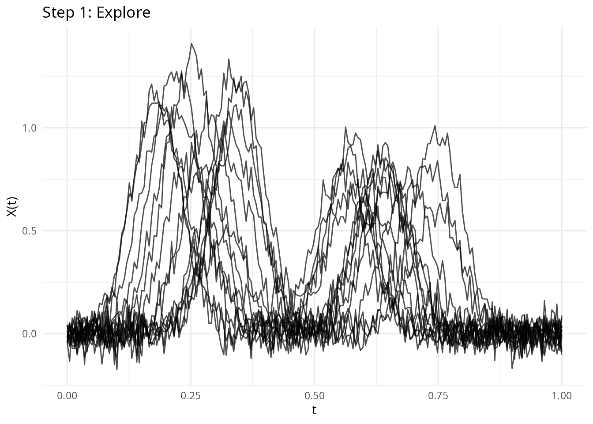

``` r
# 2. Detect features to understand structure
lms <- detect.landmarks(fd_feat, kind = "peak", min.prominence = 0.2)
cat("Landmarks per curve:",
    paste(sapply(lms, nrow), collapse = ", "), "\n")
#> Landmarks per curve: 3, 2, 3, 5, 2, 2, 3, 2, 4, 2, 4, 2, 2, 3, 3
```

``` r
# 3. Align (choose method based on data)
lr <- landmark.register(fd_feat, kind = "peak", min.prominence = 0.2,
                         expected.count = 2)
```

``` r
# 4. For downstream analysis, compute Karcher mean + TSRVF
km <- karcher.mean(lr$registered, max.iter = 10)
tv <- tsrvf.from.alignment(km)

# 5. Standard PCA on tangent vectors
pca <- prcomp(tv$tangent_vectors$data)
var_exp <- cumsum(pca$sdev^2 / sum(pca$sdev^2))
cat("Variance explained (first 3 PCs):",
    round(var_exp[1:3] * 100, 1), "%\n")
#> Variance explained (first 3 PCs): 20.5 38.1 51.5 %
```

## See Also

- `vignette("elastic-alignment", package = "fdars")` – elastic alignment
  framework, quality diagnostics, amplitude-phase decomposition
- `vignette("landmark-registration", package = "fdars")` – landmark
  detection, prominence filtering, registration workflow
- `vignette("tsrvf", package = "fdars")` – TSRVF for linearized elastic
  analysis, elastic FPCA
- `vignette("distance-metrics", package = "fdars")` – Soft-DTW, elastic,
  amplitude, and phase distances
