# Andrews Transformation: From Tables to Curves

## Introduction

Many potential fdars users have multivariate (tabular) data rather than
functional data. The **Andrews transformation** (Andrews, 1972) provides
a mathematically rigorous bridge: it maps each $p$-dimensional
observation to a curve on $\lbrack - \pi,\pi\rbrack$ using a Fourier
expansion where the data values serve as coefficients.

The key property is that the $L^{2}$ distance between Andrews curves
equals $\sqrt{\pi}$ times the Euclidean distance between the original
observations — so all distance-based FDA methods produce results that
are directly interpretable in the original multivariate space.


This article demonstrates the full fdars pipeline — depth, outlier
detection, clustering, and FPCA — applied to Andrews-transformed iris
data.

## Mathematical Background

Given a $p$-dimensional observation
$\mathbf{x} = \left( x_{1},x_{2},\ldots,x_{p} \right)$, the Andrews
function is defined as:

$$f_{\mathbf{x}}(t) = \frac{x_{1}}{\sqrt{2}} + x_{2}\sin(t) + x_{3}\cos(t) + x_{4}\sin(2t) + x_{5}\cos(2t) + \cdots$$

for $t \in \lbrack - \pi,\pi\rbrack$. The pattern is: the first
coefficient is scaled by $1/\sqrt{2}$, then subsequent coefficients
multiply alternating $\sin(kt)$ and $\cos(kt)$ terms.

**Distance preservation theorem.** For any two observations $\mathbf{x}$
and $\mathbf{y}$:

$$\parallel f_{\mathbf{x}} - f_{\mathbf{y}} \parallel_{L^{2}} = \sqrt{\pi} \cdot \parallel \mathbf{x} - \mathbf{y} \parallel_{2}$$

This means Euclidean distances are preserved (up to a constant factor)
when moving to the functional domain. Every distance-based FDA method —
depth, clustering, outlier detection — produces results equivalent to
applying the same method with Euclidean distance in the original space.

**Variable ordering.** Because the first Fourier terms carry the most
visual weight, ordering variables by importance (e.g., by ANOVA
F-statistic or variance) makes the plots more informative. However, the
distance preservation property holds regardless of ordering, so
analytical results are invariant.

## The `andrews_transform()` Function

The package provides
[`andrews_transform()`](https://sipemu.github.io/fdars-r/reference/andrews_transform.md),
which builds the Fourier basis matrix and returns an `fdata` object. The
basis matrix and variable names are stored as attributes so that
[`andrews_loadings()`](https://sipemu.github.io/fdars-r/reference/andrews_loadings.md)
can later project FPCA eigenfunctions back to the original variable
space.

## Iris Dataset and Visualization

The iris dataset has 150 observations with 4 numeric variables. We
standardize before transforming so that no single variable dominates due
to scale:

``` r
X_raw <- as.matrix(iris[, 1:4])
X <- scale(X_raw)
species <- iris$Species

fd_iris <- andrews_transform(X)
cat("Andrews curves:", nrow(fd_iris$data), "observations,",
    ncol(fd_iris$data), "grid points\n")
#> Andrews curves: 150 observations, 200 grid points
```

``` r
# Plot Andrews curves colored by species
n <- nrow(fd_iris$data)
m <- ncol(fd_iris$data)
t_grid <- fd_iris$argvals

df_curves <- data.frame(
  t = rep(t_grid, n),
  value = as.vector(t(fd_iris$data)),
  curve = rep(1:n, each = m),
  species = rep(species, each = m)
)

ggplot(df_curves, aes(x = t, y = value, group = curve, color = species)) +
  geom_line(alpha = 0.4, linewidth = 0.4) +
  scale_color_manual(values = c("setosa" = "#E41A1C", "versicolor" = "#377EB8",
                                "virginica" = "#4DAF4A")) +
  labs(title = "Andrews Curves of Iris Data",
       x = expression(t), y = expression(f[x](t)), color = "Species") +
  theme_minimal() +
  theme(legend.position = "bottom")
```

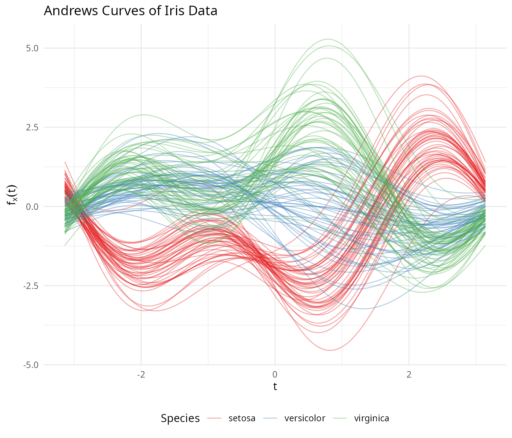

Setosa separates clearly, while versicolor and virginica overlap —
exactly matching what we know about these species in the original space.

### Group Means

``` r
# Compute mean curve per species
species_levels <- levels(species)
df_means <- do.call(rbind, lapply(species_levels, function(sp) {
  idx <- which(species == sp)
  mean_curve <- colMeans(fd_iris$data[idx, ])
  data.frame(t = t_grid, value = mean_curve, species = sp)
}))

ggplot(df_means, aes(x = t, y = value, color = species)) +
  geom_line(linewidth = 1.2) +
  scale_color_manual(values = c("setosa" = "#E41A1C", "versicolor" = "#377EB8",
                                "virginica" = "#4DAF4A")) +
  labs(title = "Mean Andrews Curves by Species",
       x = expression(t), y = expression(bar(f)(t)), color = "Species") +
  theme_minimal() +
  theme(legend.position = "bottom")
```

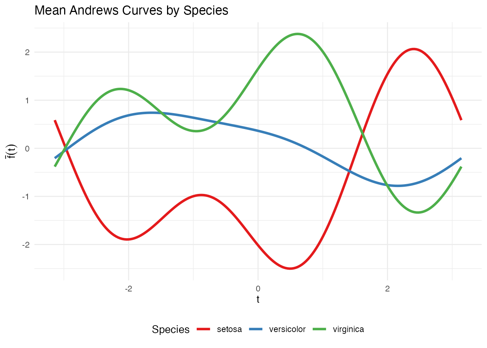

## Depth and Centrality

Functional depth measures how “central” each curve is relative to the
sample. Deeper curves are more typical; shallow curves are potential
outliers.

``` r
# Fraiman-Muniz depth
depth_fm <- depth.FM(fd_iris)

# Modified Band Depth
depth_mbd <- depth.MBD(fd_iris)
```

``` r
df_depth <- data.frame(
  FM = depth_fm,
  MBD = depth_mbd,
  species = species
)

# Boxplot of depth by species
df_depth_long <- data.frame(
  depth = c(depth_fm, depth_mbd),
  method = rep(c("Fraiman-Muniz", "Modified Band Depth"), each = length(species)),
  species = rep(species, 2)
)

ggplot(df_depth_long, aes(x = species, y = depth, fill = species)) +
  geom_boxplot(alpha = 0.7) +
  facet_wrap(~ method, scales = "free_y") +
  scale_fill_manual(values = c("setosa" = "#E41A1C", "versicolor" = "#377EB8",
                               "virginica" = "#4DAF4A")) +
  labs(title = "Functional Depth by Species",
       x = NULL, y = "Depth") +
  theme(legend.position = "none")
```

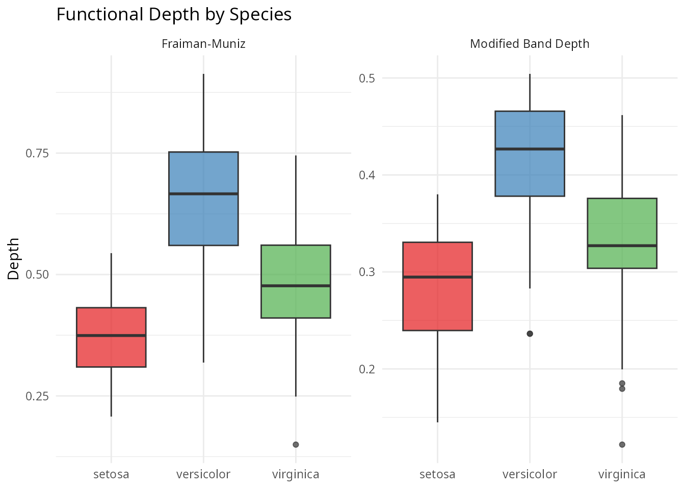

### Functional Median and Trimmed Mean

``` r
# Functional median (deepest curve)
fd_median <- median(fd_iris)

# Trimmed mean (mean of deepest 50%)
fd_trimmed <- trimmed(fd_iris, trim = 0.5)

df_central <- data.frame(
  t = rep(t_grid, 2),
  value = c(fd_median$data[1, ], fd_trimmed$data[1, ]),
  type = rep(c("Median", "Trimmed Mean (50%)"), each = m)
)

ggplot(df_central, aes(x = t, y = value, color = type)) +
  geom_line(linewidth = 1.2) +
  scale_color_manual(values = c("Median" = "darkblue", "Trimmed Mean (50%)" = "darkorange")) +
  labs(title = "Functional Median and Trimmed Mean",
       x = expression(t), y = expression(f(t)), color = NULL) +
  theme(legend.position = "bottom")
```

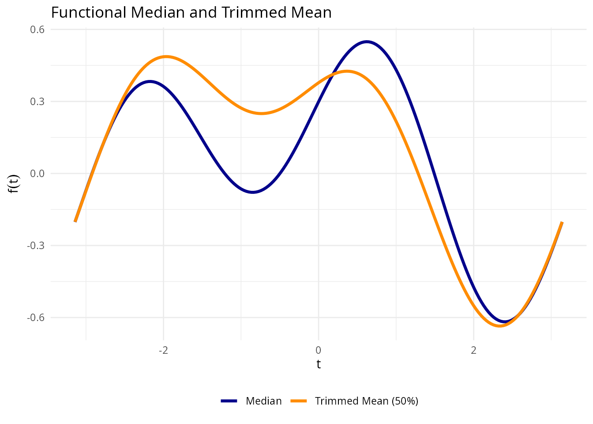

## Outlier Detection

We apply three complementary outlier detection methods.

### Depth-Ponderation

``` r
out_pond <- outliers.depth.pond(fd_iris, nb = 1000, seed = 123)
cat("Depth-ponderation outliers:", out_pond$outliers, "\n")
#> Depth-ponderation outliers: 16 34 42 61 110 118 119 132
cat("Species:", as.character(species[out_pond$outliers]), "\n")
#> Species: setosa setosa setosa versicolor virginica virginica virginica virginica
```

### Outliergram

The outliergram plots Modified Epigraph Index against Modified Band
Depth, flagging curves that fall outside the expected parabolic
relationship:

``` r
og <- outliergram(fd_iris)
plot(og)
```

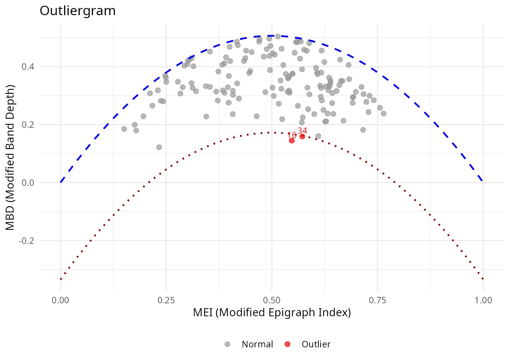

### Magnitude-Shape Plot

The magnitude-shape plot separates outliers into those that differ in
magnitude (shifted up/down) from those that differ in shape (different
pattern):

``` r
ms <- magnitudeshape(fd_iris)
plot(ms)
```

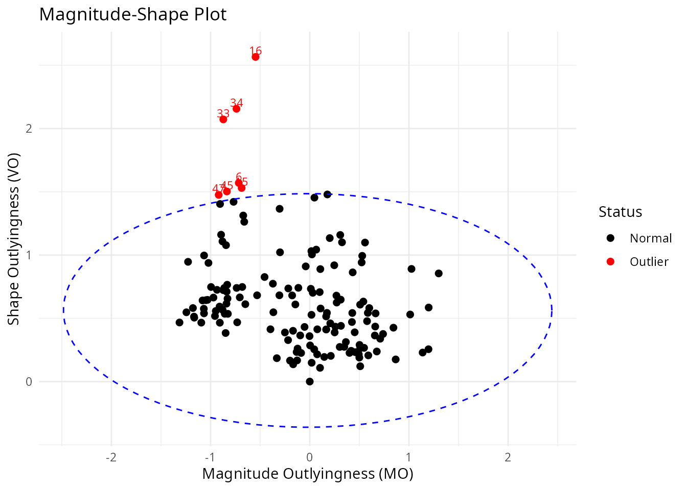

### Cross-Referencing with Original Data

``` r
# Collect all flagged observations
all_outliers <- unique(c(out_pond$outliers, og$outliers, ms$outliers))
cat("All flagged observations:", sort(all_outliers), "\n")
#> All flagged observations: 6 15 16 33 34 42 45 47 61 110 118 119 132

if (length(all_outliers) > 0) {
  cat("\nOriginal iris values for flagged observations:\n")
  print(iris[all_outliers, ])
}
#> 
#> Original iris values for flagged observations:
#>     Sepal.Length Sepal.Width Petal.Length Petal.Width    Species
#> 16           5.7         4.4          1.5         0.4     setosa
#> 34           5.5         4.2          1.4         0.2     setosa
#> 42           4.5         2.3          1.3         0.3     setosa
#> 61           5.0         2.0          3.5         1.0 versicolor
#> 110          7.2         3.6          6.1         2.5  virginica
#> 118          7.7         3.8          6.7         2.2  virginica
#> 119          7.7         2.6          6.9         2.3  virginica
#> 132          7.9         3.8          6.4         2.0  virginica
#> 6            5.4         3.9          1.7         0.4     setosa
#> 15           5.8         4.0          1.2         0.2     setosa
#> 33           5.2         4.1          1.5         0.1     setosa
#> 45           5.1         3.8          1.9         0.4     setosa
#> 47           5.1         3.8          1.6         0.2     setosa
```

## Clustering

### K-Means with k = 3

``` r
km <- cluster.kmeans(fd_iris, ncl = 3, nstart = 20, seed = 123)

# Confusion matrix
conf_matrix <- table(Predicted = km$cluster, True = species)
print(conf_matrix)
#>          True
#> Predicted setosa versicolor virginica
#>         1      0         39        14
#>         2     50          0         0
#>         3      0         11        36

# Accuracy with optimal label matching
max_matches <- 0
for (perm in list(c(1,2,3), c(1,3,2), c(2,1,3), c(2,3,1), c(3,1,2), c(3,2,1))) {
  matched <- sum(km$cluster == perm[as.numeric(species)])
  max_matches <- max(max_matches, matched)
}
cat("Best matching accuracy:", max_matches / length(species), "\n")
#> Best matching accuracy: 0.8333333
```

``` r
df_km <- data.frame(
  t = rep(t_grid, n),
  value = as.vector(t(fd_iris$data)),
  curve = rep(1:n, each = m),
  cluster = factor(rep(km$cluster, each = m))
)

ggplot(df_km, aes(x = t, y = value, group = curve, color = cluster)) +
  geom_line(alpha = 0.3, linewidth = 0.4) +
  scale_color_brewer(palette = "Set1") +
  labs(title = "K-Means Clusters (k = 3)",
       x = expression(t), y = expression(f[x](t)), color = "Cluster") +
  theme(legend.position = "bottom")
```

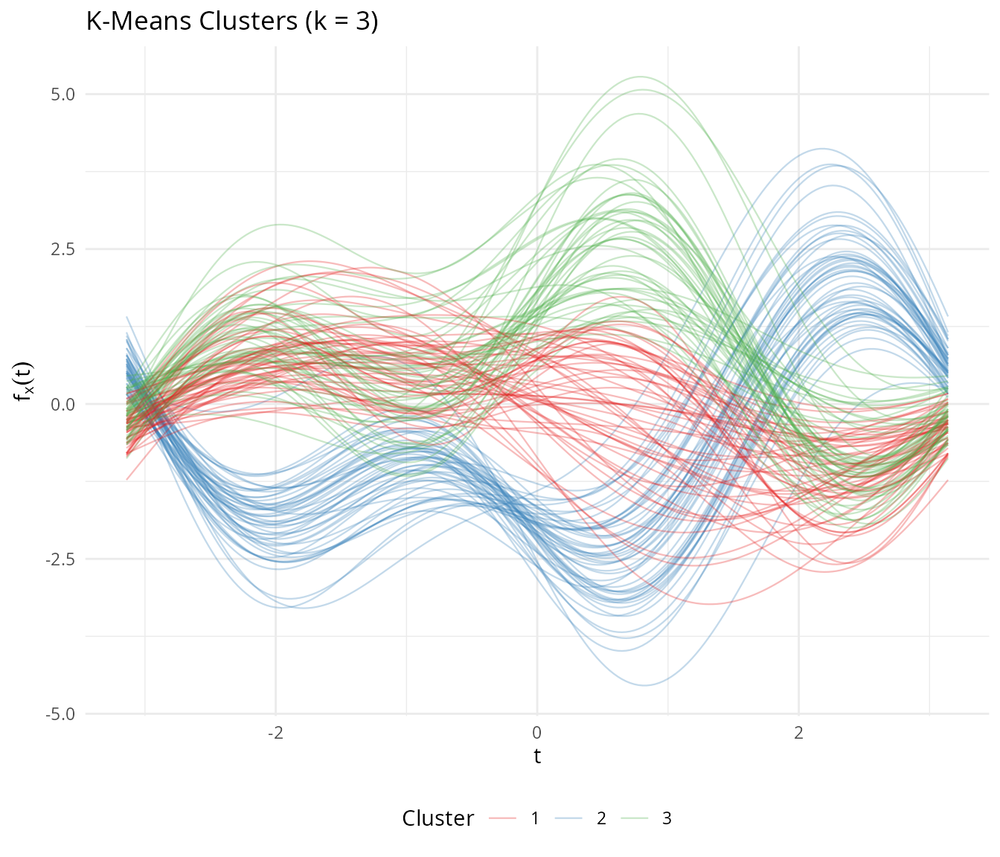

### Automatic Number of Clusters

``` r
opt <- cluster.optim(fd_iris, ncl.range = 2:6, criterion = "silhouette", seed = 123)
cat("Optimal number of clusters (silhouette):", opt$best.model$ncl, "\n")
#> Optimal number of clusters (silhouette):
```

### Fuzzy C-Means

Fuzzy clustering captures the overlap between versicolor and virginica:

``` r
fcm <- cluster.fcm(fd_iris, ncl = 3, seed = 123)

# Find versicolor observations with high membership uncertainty
membership <- fcm$membership
max_membership <- apply(membership, 1, max)

df_fuzzy <- data.frame(
  observation = 1:n,
  max_membership = max_membership,
  species = species
)

ggplot(df_fuzzy, aes(x = species, y = max_membership, fill = species)) +
  geom_boxplot(alpha = 0.7) +
  scale_fill_manual(values = c("setosa" = "#E41A1C", "versicolor" = "#377EB8",
                               "virginica" = "#4DAF4A")) +
  geom_hline(yintercept = 0.5, linetype = "dashed", color = "gray40") +
  labs(title = "Fuzzy C-Means: Maximum Membership by Species",
       subtitle = "Lower values indicate more overlap between clusters",
       x = NULL, y = "Maximum Membership Probability") +
  theme(legend.position = "none")
```

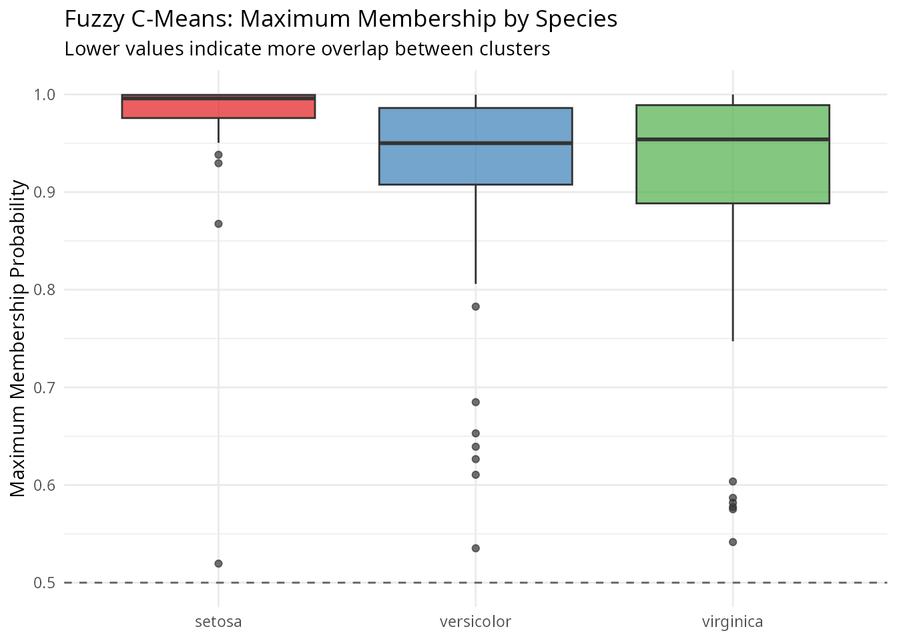

Setosa observations have near-perfect membership, while versicolor and
virginica show much more uncertainty — reflecting the genuine overlap
between these species.

## FPCA

Functional PCA on Andrews curves reveals the dominant modes of
variation:

``` r
fpca <- fdata2pc(fd_iris, ncomp = 4)

# Variance explained
var_explained <- fpca$d^2 / sum(fpca$d^2) * 100
cat("Variance explained by first 4 PCs:\n")
#> Variance explained by first 4 PCs:
for (i in 1:4) {
  cat(sprintf("  PC%d: %.1f%%\n", i, var_explained[i]))
}
#>   PC1: 72.9%
#>   PC2: 22.8%
#>   PC3: 3.7%
#>   PC4: 0.5%
cat(sprintf("  Total: %.1f%%\n", sum(var_explained[1:4])))
#>   Total: 100.0%
```

### Variance Plot

``` r
plot(fpca, type = "variance")
```

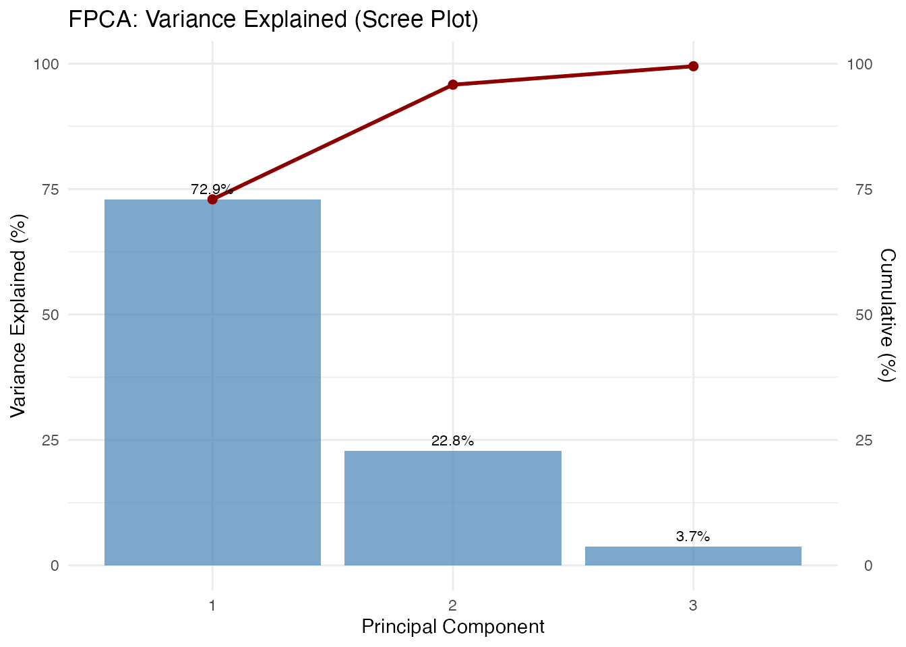

### Score Plot

``` r
df_scores <- data.frame(
  PC1 = fpca$x[, 1],
  PC2 = fpca$x[, 2],
  species = species
)

ggplot(df_scores, aes(x = PC1, y = PC2, color = species)) +
  geom_point(size = 2.5, alpha = 0.8) +
  scale_color_manual(values = c("setosa" = "#E41A1C", "versicolor" = "#377EB8",
                                "virginica" = "#4DAF4A")) +
  labs(title = "FPCA Score Plot (Andrews Curves)",
       x = sprintf("PC1 (%.1f%%)", var_explained[1]),
       y = sprintf("PC2 (%.1f%%)", var_explained[2]),
       color = "Species") +
  theme(legend.position = "bottom")
```

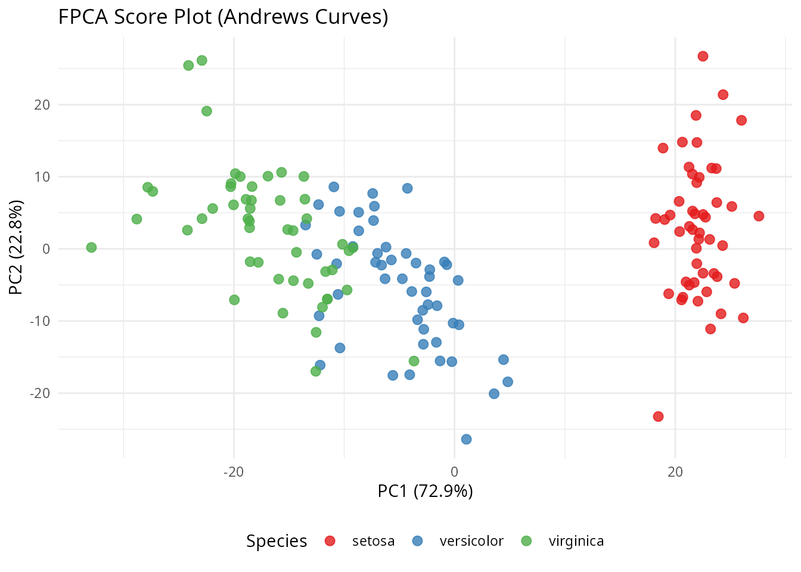

### Component Functions

``` r
df_components <- data.frame(
  t = rep(t_grid, 3),
  loading = c(fpca$rotation$data[1, ], fpca$rotation$data[2, ],
              fpca$rotation$data[3, ]),
  PC = factor(rep(paste0("PC", 1:3), each = m))
)

ggplot(df_components, aes(x = t, y = loading, color = PC)) +
  geom_line(linewidth = 1) +
  geom_hline(yintercept = 0, linetype = "dashed", alpha = 0.5) +
  scale_color_brewer(palette = "Set1") +
  labs(title = "Principal Component Functions",
       x = expression(t), y = "Loading", color = NULL) +
  theme(legend.position = "bottom")
```

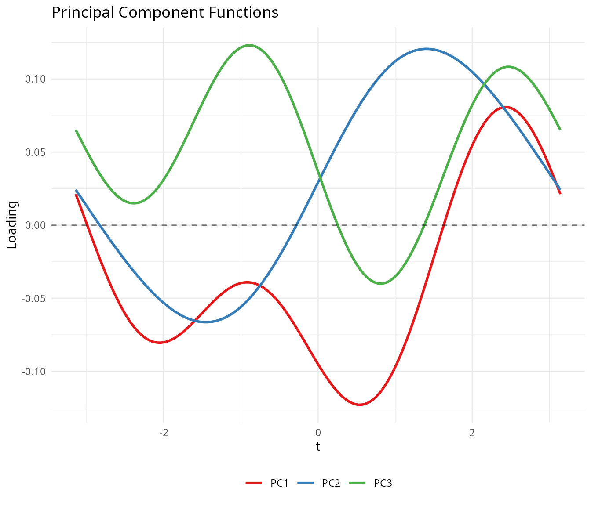

## Variable Ordering

The Andrews transformation maps the first variable to the $1/\sqrt{2}$
term, the second to $\sin(t)$, and so on. Because lower-frequency
Fourier terms dominate visually, placing important variables first
produces more informative plots.

We rank the iris variables by ANOVA F-statistic:

``` r
# Rank variables by ANOVA F-statistic
f_stats <- sapply(1:4, function(j) {
  fit <- aov(X[, j] ~ species)
  summary(fit)[[1]]$`F value`[1]
})
names(f_stats) <- colnames(iris)[1:4]
var_order <- order(f_stats, decreasing = TRUE)

cat("Variables ranked by ANOVA F-statistic:\n")
#> Variables ranked by ANOVA F-statistic:
for (i in var_order) {
  cat(sprintf("  %s: F = %.1f\n", names(f_stats)[i], f_stats[i]))
}
#>   Petal.Length: F = 1180.2
#>   Petal.Width: F = 960.0
#>   Sepal.Length: F = 119.3
#>   Sepal.Width: F = 49.2
```

``` r
# Transform with original and reordered variables
fd_original <- andrews_transform(X)
fd_reordered <- andrews_transform(X[, var_order])

# Plot both
df_orig <- data.frame(
  t = rep(t_grid, n),
  value = as.vector(t(fd_original$data)),
  curve = rep(1:n, each = m),
  species = rep(species, each = m),
  ordering = "Original Order"
)

df_reord <- data.frame(
  t = rep(t_grid, n),
  value = as.vector(t(fd_reordered$data)),
  curve = rep(1:n, each = m),
  species = rep(species, each = m),
  ordering = "Reordered by F-statistic"
)

p1 <- ggplot(df_orig, aes(x = t, y = value, group = curve, color = species)) +
  geom_line(alpha = 0.4, linewidth = 0.4) +
  scale_color_manual(values = c("setosa" = "#E41A1C", "versicolor" = "#377EB8",
                                "virginica" = "#4DAF4A")) +
  labs(title = "Original Variable Order",
       x = expression(t), y = expression(f[x](t)), color = "Species") +
  theme_minimal() +
  theme(legend.position = "bottom")

p2 <- ggplot(df_reord, aes(x = t, y = value, group = curve, color = species)) +
  geom_line(alpha = 0.4, linewidth = 0.4) +
  scale_color_manual(values = c("setosa" = "#E41A1C", "versicolor" = "#377EB8",
                                "virginica" = "#4DAF4A")) +
  labs(title = "Reordered by ANOVA F-statistic",
       x = expression(t), y = expression(f[x](t)), color = "Species") +
  theme_minimal() +
  theme(legend.position = "bottom")

if (requireNamespace("patchwork", quietly = TRUE)) {
  library(patchwork)
  p1 / p2
} else {
  print(p1)
  print(p2)
}
```

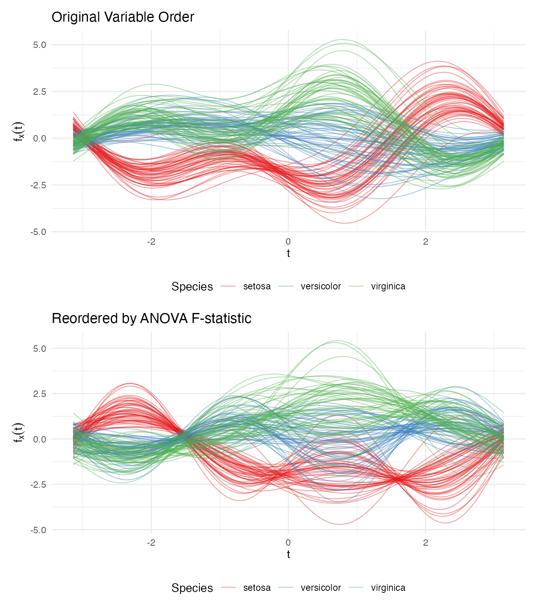

The reordered plot shows clearer species separation because the most
discriminating variable (petal length) now drives the dominant
low-frequency component.

### Clustering is Invariant to Ordering

The distance preservation theorem guarantees that analytical results are
identical regardless of variable ordering:

``` r
km_original <- cluster.kmeans(fd_original, ncl = 3, nstart = 20, seed = 123)
km_reordered <- cluster.kmeans(fd_reordered, ncl = 3, nstart = 20, seed = 123)

# Match cluster labels and compare
best_match <- function(c1, c2) {
  max_matches <- 0
  for (perm in list(c(1,2,3), c(1,3,2), c(2,1,3), c(2,3,1), c(3,1,2), c(3,2,1))) {
    relabeled <- perm[c2]
    max_matches <- max(max_matches, sum(c1 == relabeled))
  }
  max_matches
}

agreement <- best_match(km_original$cluster, km_reordered$cluster)
cat("Cluster agreement:", agreement, "/", n, "(", round(100 * agreement / n, 1), "%)\n")
#> Cluster agreement: 150 / 150 ( 100 %)
```

## Distance Verification

We verify the theoretical result:
$\parallel f_{\mathbf{x}} - f_{\mathbf{y}} \parallel_{L^{2}} = \sqrt{\pi} \cdot \parallel \mathbf{x} - \mathbf{y} \parallel_{2}$.

``` r
# Compute pairwise Andrews (L2) distances
dist_andrews <- metric.lp(fd_iris)

# Compute pairwise Euclidean distances on standardized data
dist_euclid <- as.matrix(dist(X))

# Extract upper triangle
idx_upper <- upper.tri(dist_andrews)
d_a <- dist_andrews[idx_upper]
d_e <- dist_euclid[idx_upper]

# Exclude pairs with zero Euclidean distance (iris has 1 duplicate observation)
nonzero <- d_e > 1e-10
ratio <- d_a[nonzero] / d_e[nonzero]
cat("Distance ratio d_andrews / d_euclidean:\n")
#> Distance ratio d_andrews / d_euclidean:
cat(sprintf("  Mean:   %.4f\n", mean(ratio)))
#>   Mean:   1.7725
cat(sprintf("  Median: %.4f\n", median(ratio)))
#>   Median: 1.7725
cat(sprintf("  SD:     %.2e\n", sd(ratio)))
#>   SD:     3.91e-16
cat(sprintf("  sqrt(pi) = %.4f\n", sqrt(pi)))
#>   sqrt(pi) = 1.7725
```

``` r
df_dist <- data.frame(
  euclidean = d_e[nonzero],
  andrews = d_a[nonzero]
)

ggplot(df_dist, aes(x = euclidean, y = andrews)) +
  geom_point(alpha = 0.1, size = 0.5) +
  geom_abline(slope = sqrt(pi), intercept = 0, color = "red", linewidth = 1) +
  labs(title = "Andrews L2 Distance vs Euclidean Distance",
       subtitle = sprintf("Red line: slope = sqrt(pi) ≈ %.4f", sqrt(pi)),
       x = "Euclidean Distance (standardized data)",
       y = "Andrews L2 Distance") +
  theme_minimal() +
  coord_equal()
```

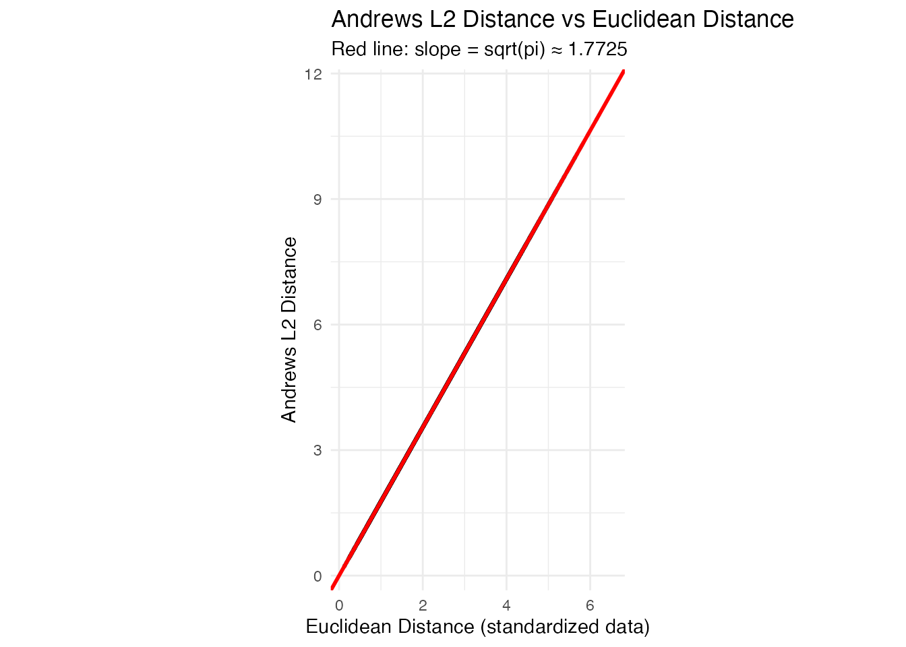

The points fall exactly on the $\sqrt{\pi}$ line, confirming the
distance preservation theorem.

## When Does FDA Add Value?

The Andrews transformation is isometric: $L^{2}$ distances between
curves equal $\sqrt{\pi}$ times Euclidean distances between the original
vectors. This means that for methods whose only input is a distance
matrix — PCA, k-means, basic outlier detection by Mahalanobis distance —
**classical multivariate statistics and FDA on Andrews curves give the
same numerical answers.** FPCA on Andrews curves and
[`prcomp()`](https://rdrr.io/r/stats/prcomp.html) on the raw matrix
produce scores that correlate at $\pm 1$. K-means produces identical
clusters.

So why bother? The value comes not from the transformation itself, but
from what you can do *afterward* in function space:

1.  **Functional tools with no tabular equivalent.** Functional depth
    (Fraiman–Muniz, modified band depth), the functional boxplot, the
    outliergram, and tolerance bands are inherently functional concepts.
    They classify outliers by *type* (magnitude vs shape), provide
    simultaneous monitoring of all variables in a single chart, and
    define nonparametric tolerance regions. There is no direct
    multivariate equivalent of
    [`outliergram()`](https://sipemu.github.io/fdars-r/reference/outliergram.md)
    or
    [`tolerance.band()`](https://sipemu.github.io/fdars-r/reference/tolerance.band.md).

2.  **Smoothing as structured regularization.** When $p$ is large or
    variables are noisy, you can smooth the Andrews curves (e.g., via
    basis expansion or penalized splines) before analysis. This damps
    high-frequency Fourier terms — corresponding to less important
    variables — while preserving low-frequency structure. Standard PCA
    has no natural way to impose this frequency-aware regularization.

3.  **Unified pipeline.** With Andrews curves, depth, outlier detection,
    clustering, FPCA, and the functional boxplot all operate on the same
    `fdata` object with the same distance semantics. In a classical
    workflow, each of these is a separate analysis step with its own
    data format and assumptions.

4.  **Communication.** Eigenfunctions, mean curves, and cluster
    centroids are visual objects. A continuous curve showing the
    dominant mode of variation communicates structure more intuitively
    than a table of 13 signed loadings, especially in reports and
    presentations.

> **Rule of thumb:** If your analysis stops at PCA + k-means on a clean,
> moderate-$p$ matrix, [`prcomp()`](https://rdrr.io/r/stats/prcomp.html)
> and [`kmeans()`](https://rdrr.io/r/stats/kmeans.html) are simpler and
> give you the same answer. Use Andrews curves when you want the full
> functional toolbox — depth-based outlier detection, tolerance bands,
> simultaneous monitoring — or when you’re building a pipeline where
> multiple FDA methods feed into each other.

## Best Practices

1.  **Standardize before transforming.** Variables on different scales
    will dominate the Andrews function. Always center and scale (or use
    robust standardization) before applying the transformation.

2.  **Order variables by importance for visualization.** Place the most
    informative variables first so they correspond to low-frequency
    Fourier terms that are visually dominant. Use ANOVA F-statistics,
    variance, or domain knowledge to rank.

3.  **Use $m \geq 200$ grid points.** Fewer points can introduce
    numerical artifacts in distance computations. The default of 200 is
    sufficient for most applications.

4.  **Works best for small-to-moderate $p$.** With many variables,
    higher-order Fourier terms oscillate rapidly and contribute little
    visual information. For high-dimensional data, consider dimension
    reduction (e.g., PCA) before applying the Andrews transformation.

5.  **Analytical results are ordering-invariant.** While variable
    ordering affects the appearance of plots, all distance-based methods
    (clustering, depth, outlier detection) give identical results
    regardless of ordering.

## Summary

| FDA Method                                                                                                                                        | What It Reveals on Andrews Curves                |
|---------------------------------------------------------------------------------------------------------------------------------------------------|--------------------------------------------------|
| [`depth.FM()`](https://sipemu.github.io/fdars-r/reference/depth.FM.md) / [`depth.MBD()`](https://sipemu.github.io/fdars-r/reference/depth.MBD.md) | Centrality of multivariate observations          |
| [`median()`](https://sipemu.github.io/fdars-r/reference/median.md) / [`trimmed()`](https://sipemu.github.io/fdars-r/reference/trimmed.md)         | Robust center of the multivariate distribution   |
| [`outliers.depth.pond()`](https://sipemu.github.io/fdars-r/reference/outliers.depth.pond.md)                                                      | Observations far from the multivariate center    |
| [`outliergram()`](https://sipemu.github.io/fdars-r/reference/outliergram.md)                                                                      | Shape outliers in the multivariate space         |
| [`magnitudeshape()`](https://sipemu.github.io/fdars-r/reference/magnitudeshape.md)                                                                | Magnitude vs shape decomposition of outlyingness |
| [`cluster.kmeans()`](https://sipemu.github.io/fdars-r/reference/cluster.kmeans.md)                                                                | Euclidean-distance-based partitioning            |
| [`cluster.fcm()`](https://sipemu.github.io/fdars-r/reference/cluster.fcm.md)                                                                      | Soft cluster memberships (overlap detection)     |
| [`fdata2pc()`](https://sipemu.github.io/fdars-r/reference/fdata2pc.md)                                                                            | Dominant directions of multivariate variation    |
| [`metric.lp()`](https://sipemu.github.io/fdars-r/reference/metric.lp.md)                                                                          | $\sqrt{\pi} \times$ Euclidean distance           |

## See Also

- `vignette("depth-functions", package = "fdars")` — functional depth
  measures and ranking
- `vignette("clustering", package = "fdars")` — functional data
  clustering
- `vignette("outlier-detection", package = "fdars")` — functional
  outlier detection methods

## References

- Andrews, D.F. (1972). Plots of high-dimensional data. *Biometrics*,
  28(1), 125–136.
- Ramsay, J.O. and Silverman, B.W. (2005). *Functional Data Analysis*.
  Springer. (Chapter 1: Introduction to FDA)
