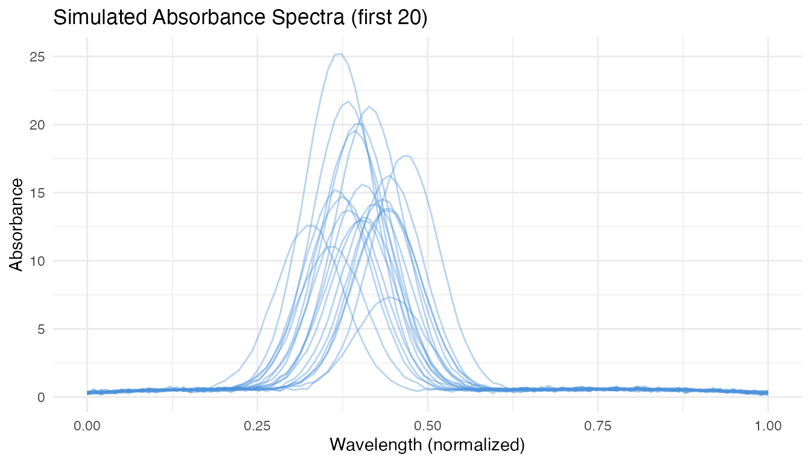
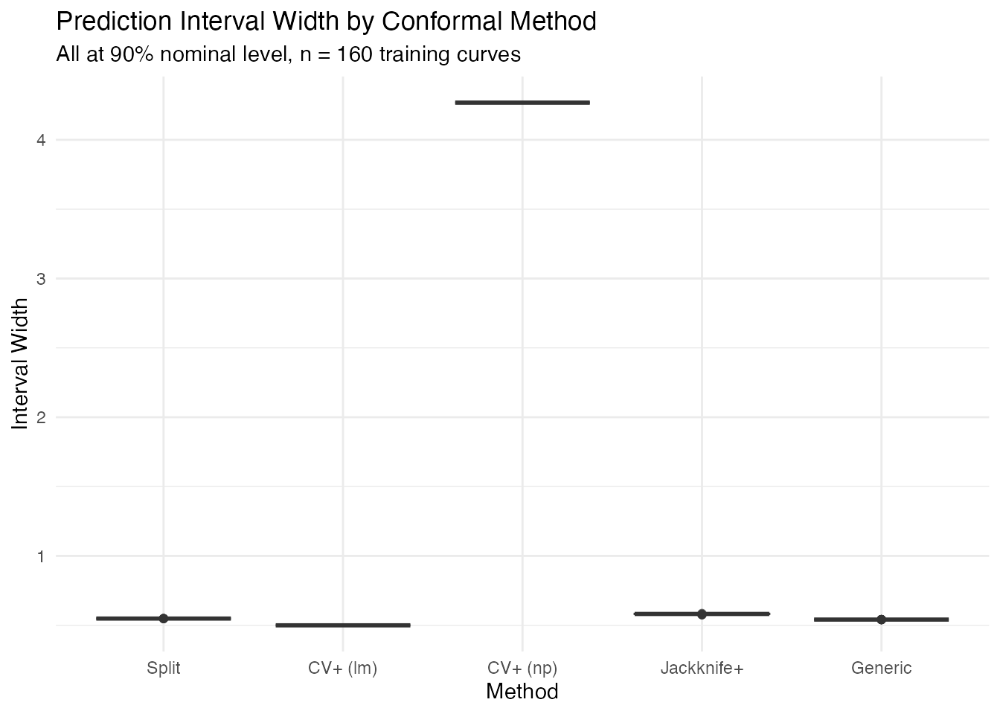
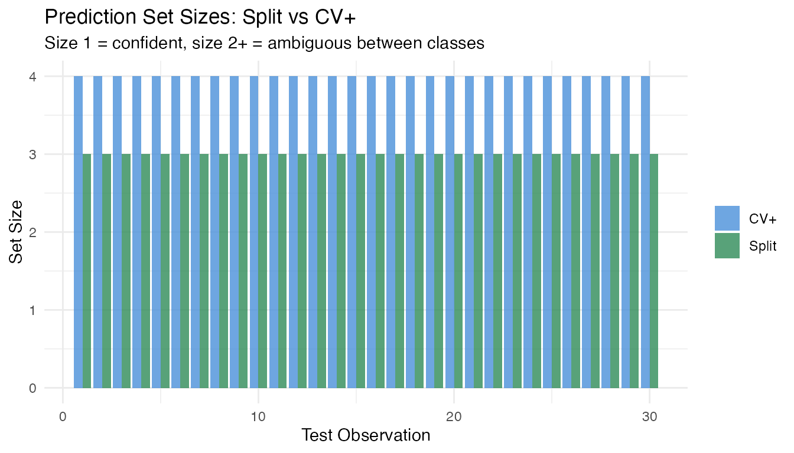

# Conformal Prediction Guide

## Overview

**fdars** provides 14 conformal prediction functions covering
regression, classification, and elastic models. This guide helps you
choose the right function for your problem and summarizes the available
options.

All conformal methods share the same guarantee: for coverage level
$1 - \alpha$,

$$P\left( y_{\text{new}} \in C_{\alpha} \right) \geq 1 - \alpha$$

holds for any data distribution, with no parametric assumptions.

## Decision Flowchart


Choose your conformal method based on three questions:

**1. Regression or classification?**

- **Regression** (predict a number $\widehat{y}$) $\rightarrow$
  prediction *intervals*
- **Classification** (predict a label $\widehat{y} \in \{ 1,\ldots,K\}$)
  $\rightarrow$ prediction *sets*

**2. Which base model?**

| Model              | Regression                                                                                                     | Classification                                                                                             |
|:-------------------|:---------------------------------------------------------------------------------------------------------------|:-----------------------------------------------------------------------------------------------------------|
| `fregre.lm`        | [`conformal.fregre.lm()`](https://sipemu.github.io/fdars-r/reference/conformal.fregre.lm.md)                   | —                                                                                                          |
| `fregre.np`        | [`conformal.fregre.np()`](https://sipemu.github.io/fdars-r/reference/conformal.fregre.np.md)                   | —                                                                                                          |
| Elastic regression | [`conformal.elastic.regression()`](https://sipemu.github.io/fdars-r/reference/conformal.elastic.regression.md) | —                                                                                                          |
| Elastic PCR        | [`conformal.elastic.pcr()`](https://sipemu.github.io/fdars-r/reference/conformal.elastic.pcr.md)               | —                                                                                                          |
| LDA / QDA / kNN    | —                                                                                                              | [`conformal.classif()`](https://sipemu.github.io/fdars-r/reference/conformal.classif.md)                   |
| Logistic           | [`conformal.logistic()`](https://sipemu.github.io/fdars-r/reference/conformal.logistic.md)                     | [`conformal.elastic.logistic()`](https://sipemu.github.io/fdars-r/reference/conformal.elastic.logistic.md) |

**3. How much data can you afford?**

| Variant        | Data use                    | \# fits      | Guarantee                    | Function suffix                                                                    |
|:---------------|:----------------------------|:-------------|:-----------------------------|:-----------------------------------------------------------------------------------|
| **Split**      | Wastes calibration fraction | 1            | $\geq 1 - \alpha$            | model-specific                                                                     |
| **CV+**        | All data used               | $K$ folds    | $\geq 1 - 2\alpha$           | `cv.conformal.*()`                                                                 |
| **Jackknife+** | All data used               | $n$ LOO fits | $\geq 1 - 2\alpha$           | [`jackknife.plus()`](https://sipemu.github.io/fdars-r/reference/jackknife.plus.md) |
| **Generic**    | Pre-fitted model            | 0            | *Heuristic only*$^{\dagger}$ | `conformal.generic.*()`                                                            |

$^{\dagger}$**Caveat:** Generic conformal uses a model trained on ALL
data including the calibration set, so calibration residuals are
in-sample. The coverage guarantee is broken. Use split or CV+ methods
for valid coverage.

## Complete Function Reference

### Split Conformal — Regression


Each function takes training `fdata`, response `y`, test `fdata`, and
returns prediction intervals.

| Function                                                                                                       | Model              | Key parameters          |
|:---------------------------------------------------------------------------------------------------------------|:-------------------|:------------------------|
| [`conformal.fregre.lm()`](https://sipemu.github.io/fdars-r/reference/conformal.fregre.lm.md)                   | FPC linear         | `ncomp`, `cal.fraction` |
| [`conformal.fregre.np()`](https://sipemu.github.io/fdars-r/reference/conformal.fregre.np.md)                   | Nonparametric      | `ncomp`, `cal.fraction` |
| [`conformal.elastic.regression()`](https://sipemu.github.io/fdars-r/reference/conformal.elastic.regression.md) | Elastic regression | `ncomp`, `cal.fraction` |
| [`conformal.elastic.pcr()`](https://sipemu.github.io/fdars-r/reference/conformal.elastic.pcr.md)               | Elastic PCR        | `ncomp`, `cal.fraction` |
| [`conformal.logistic()`](https://sipemu.github.io/fdars-r/reference/conformal.logistic.md)                     | Logistic (binary)  | `ncomp`, `cal.fraction` |

All return: `predictions`, `lower`, `upper`, `residual.quantile`,
`coverage`.

### Split Conformal — Classification


| Function                                                                                                   | Model            | Key parameters               |
|:-----------------------------------------------------------------------------------------------------------|:-----------------|:-----------------------------|
| [`conformal.classif()`](https://sipemu.github.io/fdars-r/reference/conformal.classif.md)                   | LDA, QDA, kNN    | `classifier`, `score.type`   |
| [`conformal.elastic.logistic()`](https://sipemu.github.io/fdars-r/reference/conformal.elastic.logistic.md) | Elastic logistic | `score.type`, `cal.fraction` |

Returns: `predicted_classes`, `set_sizes`, `average_set_size`,
`coverage`, `score_quantile`.

### Cross-Conformal (CV+)


| Function                                                                                                     | Task           | Key parameters                                   |
|:-------------------------------------------------------------------------------------------------------------|:---------------|:-------------------------------------------------|
| [`cv.conformal.regression()`](https://sipemu.github.io/fdars-r/reference/cv.conformal.regression.md)         | Regression     | `method` (“fregre.lm” or “fregre.np”), `n.folds` |
| [`cv.conformal.classification()`](https://sipemu.github.io/fdars-r/reference/cv.conformal.classification.md) | Classification | `classifier`, `score.type`, `n.folds`            |

### Jackknife+

| Function                                                                           | Task       | Key parameters                        |
|:-----------------------------------------------------------------------------------|:-----------|:--------------------------------------|
| [`jackknife.plus()`](https://sipemu.github.io/fdars-r/reference/jackknife.plus.md) | Regression | `method` (“fregre.lm” or “fregre.np”) |

### Generic Conformal (pre-fitted model)

| Function                                                                                                               | Task           | Input model                         |
|:-----------------------------------------------------------------------------------------------------------------------|:---------------|:------------------------------------|
| [`conformal.generic.regression()`](https://sipemu.github.io/fdars-r/reference/conformal.generic.regression.md)         | Regression     | Fitted `fregre.lm` object           |
| [`conformal.generic.classification()`](https://sipemu.github.io/fdars-r/reference/conformal.generic.classification.md) | Classification | Fitted `functional.logistic` object |

## Worked Example: Regression

We simulate a realistic near-infrared spectroscopy scenario: 200
absorbance curves measured at 100 wavelengths, with a scalar response
(e.g., fat content) that depends on a localized spectral region. The
goal is to predict the response for 40 new spectra with valid
uncertainty quantification.

``` r
set.seed(42)
n <- 200
m <- 100
t_grid <- seq(0, 1, length.out = m)

# Simulate spectra with realistic structure:
# - smooth baseline (low-freq Fourier)
# - absorption peak near t = 0.4 that varies across samples
# - measurement noise
X <- matrix(0, n, m)
for (i in 1:n) {
  baseline <- 0.8 * sin(pi * t_grid) + 0.3 * cos(2 * pi * t_grid)
  peak_loc <- 0.4 + rnorm(1, sd = 0.03)
  peak_height <- rnorm(1, mean = 2, sd = 0.6)
  X[i, ] <- baseline + peak_height * dnorm(t_grid, peak_loc, 0.05) +
            rnorm(m, sd = 0.08)
}

# Response depends on the peak region (t ∈ [0.3, 0.5])
beta_true <- dnorm(t_grid, 0.4, 0.06)
beta_true <- beta_true / max(beta_true)
dt <- t_grid[2] - t_grid[1]
y <- numeric(n)
for (i in 1:n) y[i] <- sum(beta_true * X[i, ]) * dt + rnorm(1, sd = 0.15)

# 80/20 train-test split
train_idx <- 1:160
test_idx <- 161:200
fd_train <- fdata(X[train_idx, ], argvals = t_grid)
fd_test <- fdata(X[test_idx, ], argvals = t_grid)
y_train <- y[train_idx]
y_test <- y[test_idx]
```

``` r
df_spectra <- data.frame(
  t = rep(t_grid, 20),
  value = as.vector(t(X[1:20, ])),
  curve = factor(rep(1:20, each = m))
)

ggplot(df_spectra, aes(x = .data$t, y = .data$value,
                       group = .data$curve)) +
  geom_line(alpha = 0.4, color = "#4A90D9") +
  labs(title = "Simulated Absorbance Spectra (first 20)",
       x = "Wavelength (normalized)", y = "Absorbance")
```



### When to Use Split Conformal

**Use split conformal when you have plenty of data** ($n \geq 100$) and
want the strongest guarantee ($\geq 1 - \alpha$). It only fits the model
once, so it’s the fastest option. The trade-off: it “wastes” 25% of
training data on calibration, producing slightly wider intervals.

``` r
split_res <- conformal.fregre.lm(
  fd_train, y_train, fd_test,
  ncomp = 5, cal.fraction = 0.25,
  alpha = 0.10, seed = 42
)

cat("Split conformal:\n")
#> Split conformal:
cat("  Coverage:", round(split_res$coverage * 100, 1), "%\n")
#>   Coverage: 92.5 %
cat("  Mean width:", round(mean(split_res$upper - split_res$lower), 4), "\n")
#>   Mean width: 0.5484
```

### When to Use CV+

**Use CV+ when data is limited** ($n < 100$) or when you want tighter
intervals. All data contributes to both training and calibration through
$K$-fold cross-validation. The theoretical guarantee is weaker
($\geq 1 - 2\alpha$), but empirically coverage is near $1 - \alpha$.
Cost: $K$ model fits instead of 1.

``` r
cv_res <- cv.conformal.regression(
  fd_train, y_train, fd_test,
  method = "fregre.lm", ncomp = 5,
  n.folds = 5, alpha = 0.10, seed = 42
)

cat("CV+ conformal (fregre.lm):\n")
#> CV+ conformal (fregre.lm):
cat("  Coverage:", round(cv_res$coverage * 100, 1), "%\n")
#>   Coverage: 90.6 %
cat("  Mean width:", round(mean(cv_res$upper - cv_res$lower), 4), "\n")
#>   Mean width: 0.4996
```

CV+ also works with nonparametric models — useful when the relationship
between spectra and response is nonlinear:

``` r
cv_np <- cv.conformal.regression(
  fd_train, y_train, fd_test,
  method = "fregre.np", ncomp = 5,
  n.folds = 5, alpha = 0.10, seed = 42
)

cat("CV+ conformal (fregre.np):\n")
#> CV+ conformal (fregre.np):
cat("  Coverage:", round(cv_np$coverage * 100, 1), "%\n")
#>   Coverage: 90.6 %
cat("  Mean width:", round(mean(cv_np$upper - cv_np$lower), 4), "\n")
#>   Mean width: 4.2679
```

### When to Use Jackknife+

**Use jackknife+ when you want maximum data efficiency** and can afford
$n$ model fits. Every observation is left out exactly once, giving the
most precise calibration. Best for small-to-moderate datasets
($n \leq 500$).

``` r
jk_res <- jackknife.plus(
  fd_train, y_train, fd_test,
  method = "fregre.lm", ncomp = 5,
  alpha = 0.10
)

cat("Jackknife+:\n")
#> Jackknife+:
cat("  Coverage:", round(jk_res$coverage * 100, 1), "%\n")
#>   Coverage: 90.6 %
cat("  Mean width:", round(mean(jk_res$upper - jk_res$lower), 4), "\n")
#>   Mean width: 0.5817
```

### When to Use Generic Conformal

**Use generic conformal when the model is already fitted** and you want
a quick heuristic for prediction intervals without re-training.

> **Important:** Generic conformal uses calibration residuals computed
> on data the model was trained on (in-sample). This means intervals are
> typically too narrow and the coverage guarantee
> `P(y in C) >= 1 - alpha` does **not** hold. For valid coverage, prefer
> [`conformal.fregre.lm()`](https://sipemu.github.io/fdars-r/reference/conformal.fregre.lm.md),
> [`cv.conformal.regression()`](https://sipemu.github.io/fdars-r/reference/cv.conformal.regression.md),
> or
> [`jackknife.plus()`](https://sipemu.github.io/fdars-r/reference/jackknife.plus.md).

``` r
model_fitted <- fregre.lm(fd_train, y_train, ncomp = 5)

gen_res <- conformal.generic.regression(
  model_fitted, fd_train, y_train, fd_test,
  cal.fraction = 0.25, alpha = 0.10, seed = 42
)
#> Warning: conformal.generic.regression uses the pre-fitted model without
#> refitting. Calibration residuals are in-sample, so coverage guarantee is
#> broken. Supply calibration.indices (held-out indices) for valid coverage, or
#> use conformal.fregre.lm() / cv.conformal.regression() instead.

cat("Generic conformal (from fitted model):\n")
#> Generic conformal (from fitted model):
cat("  Coverage:", round(gen_res$coverage * 100, 1), "%\n")
#>   Coverage: 92.5 %
cat("  Mean width:", round(mean(gen_res$upper - gen_res$lower), 4), "\n")
#>   Mean width: 0.541
```

### Comparing All Methods

``` r
methods <- c("Split", "CV+ (lm)", "CV+ (np)", "Jackknife+", "Generic")
widths <- list(
  split_res$upper - split_res$lower,
  cv_res$upper - cv_res$lower,
  cv_np$upper - cv_np$lower,
  jk_res$upper - jk_res$lower,
  gen_res$upper - gen_res$lower
)

df_compare <- data.frame(
  Method = rep(methods, each = length(y_test)),
  Width = unlist(widths)
)
df_compare$Method <- factor(df_compare$Method, levels = methods)

ggplot(df_compare, aes(x = .data$Method, y = .data$Width,
                       fill = .data$Method)) +
  geom_boxplot(alpha = 0.7) +
  scale_fill_manual(values = c("Split" = "#2E8B57", "CV+ (lm)" = "#4A90D9",
                                "CV+ (np)" = "#6BAED6", "Jackknife+" = "#D55E00",
                                "Generic" = "#7B2D8E")) +
  labs(title = "Prediction Interval Width by Conformal Method",
       subtitle = "All at 90% nominal level, n = 160 training curves",
       y = "Interval Width") +
  theme(legend.position = "none")
```



``` r
df_summary <- data.frame(
  Method = methods,
  Coverage = sapply(list(split_res, cv_res, cv_np, jk_res, gen_res),
                    function(r) round(r$coverage * 100, 1)),
  Mean_Width = sapply(widths, function(w) round(mean(w), 4)),
  Fits = c("1", "5", "5", "160", "0")
)
knitr::kable(df_summary, col.names = c("Method", "Coverage (%)",
             "Mean Width", "Model Fits"),
             caption = "Conformal method comparison on spectroscopy data")
```

| Method     | Coverage (%) | Mean Width | Model Fits |
|:-----------|-------------:|-----------:|:-----------|
| Split      |         92.5 |     0.5484 | 1          |
| CV+ (lm)   |         90.6 |     0.4996 | 5          |
| CV+ (np)   |         90.6 |     4.2679 | 5          |
| Jackknife+ |         90.6 |     0.5817 | 160        |
| Generic    |         92.5 |     0.5410 | 0          |

Conformal method comparison on spectroscopy data

------------------------------------------------------------------------

## Worked Example: Classification

A three-class functional classification problem with overlapping classes
to demonstrate how prediction sets adapt to ambiguity.

``` r
set.seed(42)
n_per <- 50
n_cl <- 3 * n_per
m_cl <- 80
t_cl <- seq(0, 1, length.out = m_cl)

X_cl <- matrix(0, n_cl, m_cl)
for (i in 1:n_per) {
  # Class 1: sine-dominated
  X_cl[i, ] <- sin(2 * pi * t_cl) + 0.3 * rnorm(1) * cos(4 * pi * t_cl) +
               rnorm(m_cl, sd = 0.15)
  # Class 2: cosine-dominated
  X_cl[n_per + i, ] <- cos(2 * pi * t_cl) +
                        0.3 * rnorm(1) * sin(4 * pi * t_cl) +
                        rnorm(m_cl, sd = 0.15)
  # Class 3: linear trend + noise (hardest to separate)
  X_cl[2 * n_per + i, ] <- 0.6 * (t_cl - 0.5) +
                             0.2 * sin(3 * pi * t_cl) +
                             rnorm(m_cl, sd = 0.15)
}
y_cl <- rep(1:3, each = n_per)

# 80/20 split per class
train_cl <- c(1:40, 51:90, 101:140)
test_cl <- setdiff(1:n_cl, train_cl)
fd_cl_train <- fdata(X_cl[train_cl, ], argvals = t_cl)
fd_cl_test <- fdata(X_cl[test_cl, ], argvals = t_cl)
y_cl_train <- y_cl[train_cl]
y_cl_test <- y_cl[test_cl]
```

### Split vs CV+ Classification

With 120 training curves, split conformal works well. CV+ uses all data
for calibration, so it can produce tighter prediction sets:

``` r
# Split conformal (LDA + LAC scoring)
split_cl <- conformal.classif(
  fd_cl_train, y_cl_train, fd_cl_test,
  ncomp = 5, classifier = "lda",
  score.type = "lac", cal.fraction = 0.25,
  alpha = 0.10, seed = 42
)

# CV+ conformal
cv_cl <- cv.conformal.classification(
  fd_cl_train, y_cl_train, fd_cl_test,
  ncomp = 5, classifier = "lda",
  score.type = "lac", n.folds = 5,
  alpha = 0.10, seed = 42
)

cat("Split conformal classification:\n")
#> Split conformal classification:
cat("  Coverage:", round(split_cl$coverage * 100, 1), "%\n")
#>   Coverage: 100 %
cat("  Average set size:", round(split_cl$average_set_size, 2), "\n\n")
#>   Average set size: 3
cat("CV+ conformal classification:\n")
#> CV+ conformal classification:
cat("  Coverage:", round(cv_cl$coverage * 100, 1), "%\n")
#>   Coverage: 100 %
cat("  Average set size:", round(cv_cl$average_set_size, 2), "\n")
#>   Average set size: 4
```

``` r
df_sets <- data.frame(
  Method = rep(c("Split", "CV+"), each = length(y_cl_test)),
  Set_Size = c(split_cl$set_sizes, cv_cl$set_sizes),
  Observation = rep(seq_along(y_cl_test), 2)
)

ggplot(df_sets, aes(x = .data$Observation, y = .data$Set_Size,
                    fill = .data$Method)) +
  geom_col(position = "dodge", alpha = 0.8) +
  scale_fill_manual(values = c("Split" = "#2E8B57", "CV+" = "#4A90D9")) +
  labs(title = "Prediction Set Sizes: Split vs CV+",
       subtitle = "Size 1 = confident, size 2+ = ambiguous between classes",
       x = "Test Observation", y = "Set Size", fill = NULL)
```



------------------------------------------------------------------------

## Practical Guidance

### Which Method Should I Use?

| Scenario                                       | Recommendation         | Why                                               |
|:-----------------------------------------------|:-----------------------|:--------------------------------------------------|
| Large dataset ($n > 200$), fast results needed | **Split**              | 1 fit, strong guarantee                           |
| Small dataset ($n < 100$)                      | **CV+**                | No data waste, tighter intervals                  |
| Need tightest possible intervals               | **Jackknife+**         | LOO calibration, most precise                     |
| Model already trained (production)             | **Generic**            | 0 re-fits, heuristic only (no coverage guarantee) |
| Nonlinear relationship suspected               | **CV+ with fregre.np** | Distribution-free + flexible model                |
| Classification with few samples                | **CV+ classification** | All data used for calibration                     |

### Sample Size Requirements

- **Split conformal**: rule of thumb: $n_{\text{cal}} \geq 1/\alpha$
  (e.g., $\geq 10$ for $\alpha = 0.10$). With `cal.fraction = 0.25` and
  $n = 100$, you get 25 calibration points — sufficient for most cases.
- **CV+**: effective with $n \geq 30$. All data contributes to both
  training and calibration.
- **Jackknife+**: most data-efficient but requires $n$ model fits.
  Practical for $n \leq 500$.

### Computational Cost

| Method       | Model fits     | Relative cost |
|:-------------|:---------------|:--------------|
| Split        | 1              | Fastest       |
| Generic      | 0 (pre-fitted) | Fastest       |
| CV+ (5-fold) | 5              | Moderate      |
| Jackknife+   | $n$            | Slowest       |

### Common Pitfalls

1.  **Too few calibration points**: split conformal with small $n$ and
    small `cal.fraction` gives noisy intervals. Use CV+ instead.
2.  **Too many FPC components**: overfitting the base model produces
    optimistic residuals, widening conformal intervals. Use
    [`model.selection.ncomp()`](https://sipemu.github.io/fdars-r/reference/model.selection.ncomp.md)
    to choose `ncomp`.
3.  **Confusing coverage guarantees**: split and generic give
    $1 - \alpha$; CV+ and jackknife+ give $1 - 2\alpha$ in theory but
    often achieve near-$1 - \alpha$ empirically.
4.  **Ignoring the base model**: conformal guarantees coverage
    regardless of model quality, but a better base model produces
    tighter intervals. Always tune `ncomp` and consider both `fregre.lm`
    and `fregre.np`.

## See Also

- [`vignette("articles/uncertainty-quantification")`](https://sipemu.github.io/fdars-r/articles/uncertainty-quantification.md)
  — detailed UQ with parametric intervals, LOO-CV, and bootstrap CI
- [`vignette("articles/conformal-classification")`](https://sipemu.github.io/fdars-r/articles/conformal-classification.md)
  — in-depth classification conformal with scoring rules and classifier
  comparison
- [`vignette("articles/scalar-on-function")`](https://sipemu.github.io/fdars-r/articles/scalar-on-function.md)
  — base regression models

## References

- Vovk, V., Gammerman, A. and Shafer, G. (2005). *Algorithmic Learning
  in a Random World*. Springer.

- Barber, R.F., Candes, E.J., Ramdas, A. and Tibshirani, R.J. (2021).
  Predictive inference with the jackknife+. *Annals of Statistics*,
  49(1), 486–507.

- Romano, Y., Patterson, E. and Candes, E. (2019). Conformalized
  quantile regression. *Advances in Neural Information Processing
  Systems*, 32.
