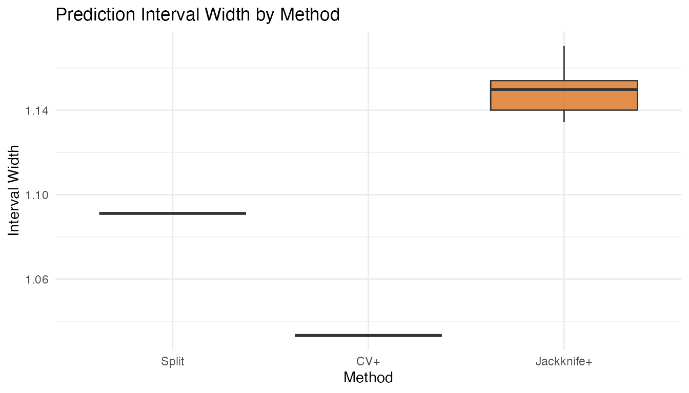

# Conformal Prediction Guide

## Overview

**fdars** provides 14 conformal prediction functions covering
regression, classification, and elastic models. This guide helps you
choose the right function for your problem and summarizes the available
options.

All conformal methods share the same guarantee: for coverage level
$1 - \alpha$,

$$P\left( y_{\text{new}} \in C_{\alpha} \right) \geq 1 - \alpha$$

holds for any data distribution, with no parametric assumptions.

## Decision Flowchart


Choose your conformal method based on three questions:

**1. Regression or classification?**

- **Regression** (predict a number $\widehat{y}$) $\rightarrow$
  prediction *intervals*
- **Classification** (predict a label $\widehat{y} \in \{ 1,\ldots,K\}$)
  $\rightarrow$ prediction *sets*

**2. Which base model?**

| Model              | Regression                                                                                                     | Classification                                                                                             |
|:-------------------|:---------------------------------------------------------------------------------------------------------------|:-----------------------------------------------------------------------------------------------------------|
| `fregre.lm`        | [`conformal.fregre.lm()`](https://sipemu.github.io/fdars-r/reference/conformal.fregre.lm.md)                   | —                                                                                                          |
| `fregre.np`        | [`conformal.fregre.np()`](https://sipemu.github.io/fdars-r/reference/conformal.fregre.np.md)                   | —                                                                                                          |
| Elastic regression | [`conformal.elastic.regression()`](https://sipemu.github.io/fdars-r/reference/conformal.elastic.regression.md) | —                                                                                                          |
| Elastic PCR        | [`conformal.elastic.pcr()`](https://sipemu.github.io/fdars-r/reference/conformal.elastic.pcr.md)               | —                                                                                                          |
| LDA / QDA / kNN    | —                                                                                                              | [`conformal.classif()`](https://sipemu.github.io/fdars-r/reference/conformal.classif.md)                   |
| Logistic           | [`conformal.logistic()`](https://sipemu.github.io/fdars-r/reference/conformal.logistic.md)                     | [`conformal.elastic.logistic()`](https://sipemu.github.io/fdars-r/reference/conformal.elastic.logistic.md) |

**3. How much data can you afford?**

| Variant        | Data use                    | \# fits      | Guarantee          | Function suffix                                                                    |
|:---------------|:----------------------------|:-------------|:-------------------|:-----------------------------------------------------------------------------------|
| **Split**      | Wastes calibration fraction | 1            | $\geq 1 - \alpha$  | model-specific                                                                     |
| **CV+**        | All data used               | $K$ folds    | $\geq 1 - 2\alpha$ | `cv.conformal.*()`                                                                 |
| **Jackknife+** | All data used               | $n$ LOO fits | $\geq 1 - 2\alpha$ | [`jackknife.plus()`](https://sipemu.github.io/fdars-r/reference/jackknife.plus.md) |
| **Generic**    | Pre-fitted model            | 0            | $\geq 1 - \alpha$  | `conformal.generic.*()`                                                            |

## Complete Function Reference

### Split Conformal — Regression


Each function takes training `fdata`, response `y`, test `fdata`, and
returns prediction intervals.

| Function                                                                                                       | Model              | Key parameters          |
|:---------------------------------------------------------------------------------------------------------------|:-------------------|:------------------------|
| [`conformal.fregre.lm()`](https://sipemu.github.io/fdars-r/reference/conformal.fregre.lm.md)                   | FPC linear         | `ncomp`, `cal.fraction` |
| [`conformal.fregre.np()`](https://sipemu.github.io/fdars-r/reference/conformal.fregre.np.md)                   | Nonparametric      | `ncomp`, `cal.fraction` |
| [`conformal.elastic.regression()`](https://sipemu.github.io/fdars-r/reference/conformal.elastic.regression.md) | Elastic regression | `ncomp`, `cal.fraction` |
| [`conformal.elastic.pcr()`](https://sipemu.github.io/fdars-r/reference/conformal.elastic.pcr.md)               | Elastic PCR        | `ncomp`, `cal.fraction` |
| [`conformal.logistic()`](https://sipemu.github.io/fdars-r/reference/conformal.logistic.md)                     | Logistic (binary)  | `ncomp`, `cal.fraction` |

All return: `predictions`, `lower`, `upper`, `residual.quantile`,
`coverage`.

### Split Conformal — Classification


| Function                                                                                                   | Model            | Key parameters               |
|:-----------------------------------------------------------------------------------------------------------|:-----------------|:-----------------------------|
| [`conformal.classif()`](https://sipemu.github.io/fdars-r/reference/conformal.classif.md)                   | LDA, QDA, kNN    | `classifier`, `score.type`   |
| [`conformal.elastic.logistic()`](https://sipemu.github.io/fdars-r/reference/conformal.elastic.logistic.md) | Elastic logistic | `score.type`, `cal.fraction` |

Returns: `predicted_classes`, `set_sizes`, `average_set_size`,
`coverage`, `score_quantile`.

### Cross-Conformal (CV+)


| Function                                                                                                     | Task           | Key parameters                                   |
|:-------------------------------------------------------------------------------------------------------------|:---------------|:-------------------------------------------------|
| [`cv.conformal.regression()`](https://sipemu.github.io/fdars-r/reference/cv.conformal.regression.md)         | Regression     | `method` (“fregre.lm” or “fregre.np”), `n.folds` |
| [`cv.conformal.classification()`](https://sipemu.github.io/fdars-r/reference/cv.conformal.classification.md) | Classification | `classifier`, `score.type`, `n.folds`            |

### Jackknife+

| Function                                                                           | Task       | Key parameters                        |
|:-----------------------------------------------------------------------------------|:-----------|:--------------------------------------|
| [`jackknife.plus()`](https://sipemu.github.io/fdars-r/reference/jackknife.plus.md) | Regression | `method` (“fregre.lm” or “fregre.np”) |

### Generic Conformal (pre-fitted model)

| Function                                                                                                               | Task           | Input model                         |
|:-----------------------------------------------------------------------------------------------------------------------|:---------------|:------------------------------------|
| [`conformal.generic.regression()`](https://sipemu.github.io/fdars-r/reference/conformal.generic.regression.md)         | Regression     | Fitted `fregre.lm` object           |
| [`conformal.generic.classification()`](https://sipemu.github.io/fdars-r/reference/conformal.generic.classification.md) | Classification | Fitted `functional.logistic` object |

## Quick Examples

### Regression: Split vs CV+ vs Jackknife+

``` r
set.seed(42)
n <- 80; m <- 50
t_grid <- seq(0, 1, length.out = m)

X <- matrix(0, n, m)
for (i in 1:n) X[i, ] <- sin(2 * pi * t_grid) + rnorm(m, sd = 0.1)
y <- rowMeans(X) + rnorm(n, sd = 0.3)

fd_train <- fdata(X[1:60, ], argvals = t_grid)
fd_test <- fdata(X[61:80, ], argvals = t_grid)
y_train <- y[1:60]; y_test <- y[61:80]

# Split conformal
split_res <- conformal.fregre.lm(fd_train, y_train, fd_test,
                                  ncomp = 3, alpha = 0.10, seed = 42)

# CV+ conformal
cv_res <- cv.conformal.regression(fd_train, y_train, fd_test,
                                   method = "fregre.lm", ncomp = 3,
                                   n.folds = 5, alpha = 0.10, seed = 42)

# Jackknife+
jk_res <- jackknife.plus(fd_train, y_train, fd_test,
                          method = "fregre.lm", ncomp = 3, alpha = 0.10)

# Compare widths
cat("Split mean width:     ", round(mean(split_res$upper - split_res$lower), 4), "\n")
#> Split mean width:      1.0911
cat("CV+ mean width:       ", round(mean(cv_res$upper - cv_res$lower), 4), "\n")
#> CV+ mean width:        1.0333
cat("Jackknife+ mean width:", round(mean(jk_res$upper - jk_res$lower), 4), "\n")
#> Jackknife+ mean width: 1.1484
```

``` r
df_width <- data.frame(
  Method = rep(c("Split", "CV+", "Jackknife+"), each = 20),
  Width = c(split_res$upper - split_res$lower,
            cv_res$upper - cv_res$lower,
            jk_res$upper - jk_res$lower)
)
df_width$Method <- factor(df_width$Method, levels = c("Split", "CV+", "Jackknife+"))

ggplot(df_width, aes(x = .data$Method, y = .data$Width, fill = .data$Method)) +
  geom_boxplot(alpha = 0.7) +
  scale_fill_manual(values = c("Split" = "#2E8B57", "CV+" = "#4A90D9",
                                "Jackknife+" = "#D55E00")) +
  labs(title = "Prediction Interval Width by Method",
       y = "Interval Width") +
  theme(legend.position = "none")
```



### Classification: Split vs CV+

``` r
set.seed(42)
n_cl <- 60; m_cl <- 50
t_cl <- seq(0, 1, length.out = m_cl)
X_cl <- matrix(0, n_cl, m_cl)
for (i in 1:30) X_cl[i, ] <- sin(2 * pi * t_cl) + rnorm(m_cl, sd = 0.2)
for (i in 31:60) X_cl[i, ] <- cos(2 * pi * t_cl) + rnorm(m_cl, sd = 0.2)
y_cl <- rep(1:2, each = 30)

fd_cl_train <- fdata(X_cl[c(1:25, 31:55), ], argvals = t_cl)
fd_cl_test <- fdata(X_cl[c(26:30, 56:60), ], argvals = t_cl)
y_cl_train <- y_cl[c(1:25, 31:55)]

# Split conformal classification
split_cl <- conformal.classif(fd_cl_train, y_cl_train, fd_cl_test,
                               ncomp = 3, classifier = "lda",
                               score.type = "lac", alpha = 0.10, seed = 42)

# CV+ conformal classification
cv_cl <- cv.conformal.classification(fd_cl_train, y_cl_train, fd_cl_test,
                                      ncomp = 3, classifier = "lda",
                                      score.type = "lac", n.folds = 5,
                                      alpha = 0.10, seed = 42)

cat("Split avg set size:", round(split_cl$average_set_size, 2), "\n")
#> Split avg set size: 2
cat("CV+ avg set size:  ", round(cv_cl$average_set_size, 2), "\n")
#> CV+ avg set size:   3
```

## Practical Guidance

### Sample Size Requirements

- **Split conformal**: needs enough calibration data for a reliable
  quantile. With `cal.fraction = 0.25` and $n = 100$, you have 25
  calibration points. Rule of thumb: $n_{\text{cal}} \geq 1/\alpha$
  (e.g., $\geq 10$ for $\alpha = 0.10$).
- **CV+**: works well with smaller $n$ since all data contributes.
  Effective with $n \geq 30$.
- **Jackknife+**: most data-efficient but requires $n$ model fits.
  Practical for $n \leq 500$.

### Computational Cost

| Method       | Model fits     | Relative cost |
|:-------------|:---------------|:--------------|
| Split        | 1              | Fastest       |
| Generic      | 0 (pre-fitted) | Fastest       |
| CV+ (5-fold) | 5              | Moderate      |
| Jackknife+   | $n$            | Slowest       |

### Common Pitfalls

1.  **Too few calibration points**: split conformal with small $n$ and
    small `cal.fraction` gives noisy intervals. Use CV+ instead.
2.  **Too many FPC components**: overfitting the base model produces
    optimistic residuals, widening conformal intervals. Use
    [`model.selection.ncomp()`](https://sipemu.github.io/fdars-r/reference/model.selection.ncomp.md)
    to choose `ncomp`.
3.  **Confusing coverage guarantees**: split and generic give
    $1 - \alpha$; CV+ and jackknife+ give $1 - 2\alpha$ in theory but
    often achieve near-$1 - \alpha$ empirically.

## See Also

- [`vignette("articles/uncertainty-quantification")`](https://sipemu.github.io/fdars-r/articles/uncertainty-quantification.md)
  — detailed UQ with parametric intervals, LOO-CV, and bootstrap CI
- [`vignette("articles/conformal-classification")`](https://sipemu.github.io/fdars-r/articles/conformal-classification.md)
  — in-depth classification conformal with scoring rules and classifier
  comparison
- [`vignette("articles/scalar-on-function")`](https://sipemu.github.io/fdars-r/articles/scalar-on-function.md)
  — base regression models

## References

- Vovk, V., Gammerman, A. and Shafer, G. (2005). *Algorithmic Learning
  in a Random World*. Springer.

- Barber, R.F., Candes, E.J., Ramdas, A. and Tibshirani, R.J. (2021).
  Predictive inference with the jackknife+. *Annals of Statistics*,
  49(1), 486–507.

- Romano, Y., Patterson, E. and Candes, E. (2019). Conformalized
  quantile regression. *Advances in Neural Information Processing
  Systems*, 32.
