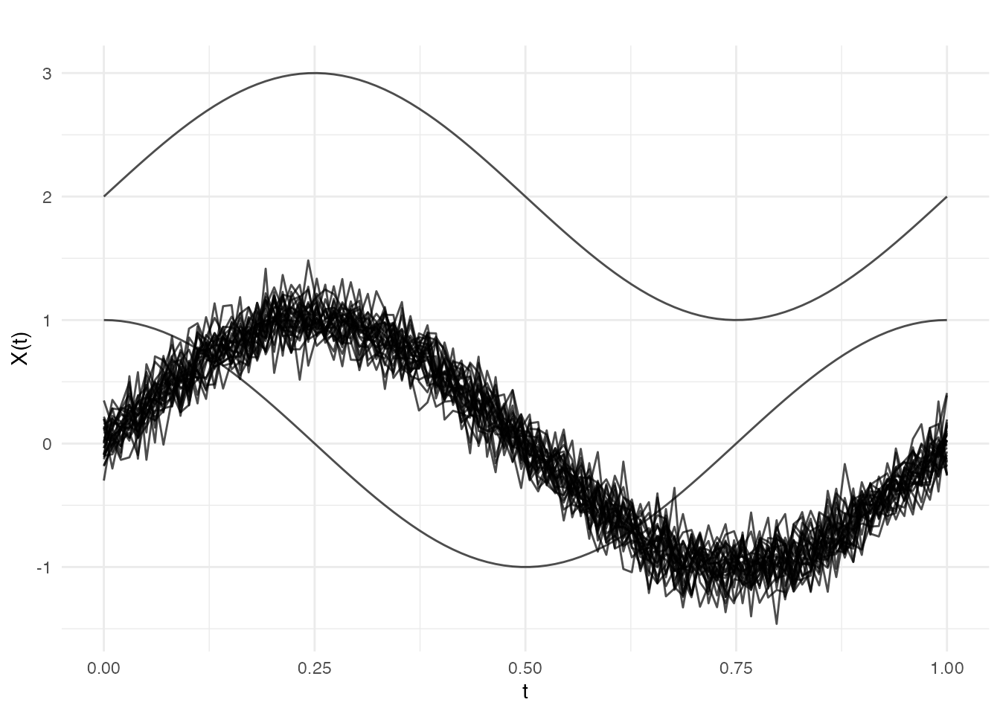
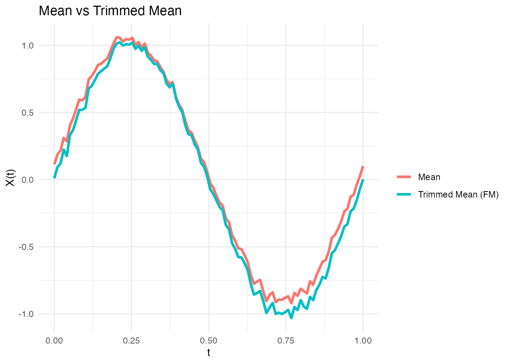

# Functional Depth Functions

## Introduction

Functional depth is a measure of how “central” or “typical” a curve is
within a sample of curves. Curves with high depth are considered
representative of the sample, while curves with low depth are outliers
or extreme observations.

Depth functions extend the concept of statistical depth (like data depth
for multivariate data) to the infinite-dimensional setting of functional
data.

``` r
library(fdars)
#> 
#> Attaching package: 'fdars'
#> The following objects are masked from 'package:stats':
#> 
#>     cov, decompose, deriv, median, sd, var
#> The following object is masked from 'package:base':
#> 
#>     norm
library(ggplot2)
theme_set(theme_minimal())

# Create example data
set.seed(42)
n <- 30
m <- 100
t_grid <- seq(0, 1, length.out = m)

# Main sample: sine curves with noise
X <- matrix(0, n, m)
for (i in 1:n) {
  X[i, ] <- sin(2 * pi * t_grid) + rnorm(m, sd = 0.15)
}

# Add some outliers
X[1, ] <- sin(2 * pi * t_grid) + 2  # Magnitude outlier
X[2, ] <- cos(2 * pi * t_grid)       # Shape outlier

fd <- fdata(X, argvals = t_grid)
plot(fd)
```



## Available Depth Functions

All depth functions are accessed through the unified
[`depth()`](https://sipemu.github.io/fdars-r/reference/depth.md)
function with a `method` parameter.

### Fraiman-Muniz Depth (method = “FM”)

The Fraiman-Muniz depth integrates univariate depths across the domain.
For each time point, it computes the proportion of curves above and
below the given curve, then averages across time.

``` r
depths_fm <- depth(fd, method = "FM")

# Show depths (outliers should have lower depth)
data.frame(
  curve = 1:5,
  depth = round(depths_fm[1:5], 4),
  note = c("magnitude outlier", "shape outlier", rep("normal", 3))
)
#>   curve  depth              note
#> 1     1 0.0000 magnitude outlier
#> 2     2 0.1113     shape outlier
#> 3     3 0.5233            normal
#> 4     4 0.5707            normal
#> 5     5 0.5407            normal
```

**Intuition**: At each time point, FM depth asks: “What proportion of
curves lie above and below this curve?” A curve that is consistently in
the middle of the data cloud at every time point will have high FM
depth.

The FM depth can be scaled to \[0, 1\] using the `scale` parameter:

``` r
depths_fm_scaled <- depth(fd, method = "FM", scale = TRUE)
range(depths_fm_scaled)
#> [1] 0.0000000 0.5813333
```

### Modal Depth (method = “mode”)

Modal depth uses kernel density estimation in function space. Curves in
high-density regions have high depth.

``` r
depths_mode <- depth(fd, method = "mode")
head(depths_mode)
#> [1] 0.03335153 0.09401245 0.83156568 0.84229565 0.83229521 0.82640249
```

**Intuition**: Modal depth estimates local density in function space.
Curves in “crowded” regions (where many similar curves exist) have high
depth. Think of it like finding the mode of a distribution, but for
curves.

### Random Projection Depth (method = “RP”)

Projects curves onto random directions and computes univariate depths of
the projections. More robust to local variations.

``` r
depths_rp <- depth(fd, method = "RP", nproj = 50)
head(depths_rp)
#> [1] 0.0600000 0.1109677 0.2819355 0.2741935 0.2522581 0.2490323
```

**Intuition**: RP depth projects all curves onto random 1D directions
and computes depth there. It’s robust because outliers can’t hide from
all projection angles - if a curve is unusual, some projection will
reveal it.

### Random Tukey Depth (method = “RT”)

Takes the minimum depth across random projections, similar to Tukey’s
halfspace depth. Very robust to outliers.

``` r
depths_rt <- depth(fd, method = "RT", nproj = 50)
head(depths_rt)
#> [1] 0.03225806 0.03225806 0.03225806 0.06451613 0.03225806 0.03225806
```

**Intuition**: RT depth takes the *minimum* depth across all
projections. This is very conservative - a curve is only considered
central if it looks central from *every* angle. This makes RT extremely
robust to outliers.

### Functional Spatial Depth (method = “FSD”)

Based on unit vectors pointing from each curve to all others. Measures
centrality in a geometric sense.

``` r
depths_fsd <- depth(fd, method = "FSD")
head(depths_fsd)
#> [1] 0.03927198 0.06164440 0.34346531 0.39240477 0.33894657 0.32391302
```

**Intuition**: FSD computes unit vectors from each curve to all others.
A central curve has these vectors pointing in all directions (they
cancel out), resulting in high depth. An outlier has most vectors
pointing in one direction (away from the data cloud).

### Kernel Functional Spatial Depth (method = “KFSD”)

Smoothed version of FSD using a Gaussian kernel. The bandwidth `h`
controls the smoothing.

``` r
depths_kfsd <- depth(fd, method = "KFSD", h = 0.15)
head(depths_kfsd)
#> [1] 0.2646598 0.2646598 0.3086986 0.3194105 0.3089607 0.3032314
```

### Random Projection Depth with Derivatives (method = “RPD”)

Incorporates derivative information, making it sensitive to shape
changes in addition to magnitude.

``` r
depths_rpd <- depth(fd, method = "RPD", nproj = 50)
head(depths_rpd)
#> [1] 0.08266667 0.11466667 0.16333333 0.24666667 0.19733333 0.20333333
```

**Intuition**: RPD is like RP, but the projections are based on curve
derivatives. This makes it sensitive to *shape* differences - curves
with unusual wiggliness or local behavior will have low depth even if
their overall level is typical.

## Comparing Depth Functions

Different depth functions have different properties and may rank curves
differently:

``` r
# Compute all depths using unified depth() function
all_depths <- data.frame(
  FM = depth(fd, method = "FM"),
  mode = depth(fd, method = "mode"),
  RP = depth(fd, method = "RP", nproj = 50),
  RT = depth(fd, method = "RT", nproj = 50),
  FSD = depth(fd, method = "FSD")
)

# Correlation between depth functions
round(cor(all_depths), 2)
#>        FM mode   RP   RT  FSD
#> FM   1.00 0.98 0.92 0.09 0.98
#> mode 0.98 1.00 0.92 0.07 0.97
#> RP   0.92 0.92 1.00 0.18 0.94
#> RT   0.09 0.07 0.18 1.00 0.06
#> FSD  0.98 0.97 0.94 0.06 1.00
```

``` r
# Which curves are identified as outliers (lowest depth)?
outlier_ranks <- apply(all_depths, 2, function(d) order(d)[1:3])
outlier_ranks
#>      FM mode RP RT FSD
#> [1,]  1    1  1  1   1
#> [2,]  2    2  2  2   2
#> [3,] 10   10 13  3  10
```

All depth functions correctly identify curves 1 and 2 as having low
depth.

### Visualizing Depth

A powerful way to understand depth is to color curves by their depth
values:

``` r
# Visualize curves colored by their FM depth
df_depth_viz <- data.frame(
  t = rep(t_grid, n),
  value = as.vector(t(X)),
  curve = rep(1:n, each = m),
  depth = rep(depths_fm, each = m)
)

ggplot(df_depth_viz, aes(x = t, y = value, group = curve, color = depth)) +
  geom_line(alpha = 0.8) +
  scale_color_viridis_c(option = "plasma", name = "FM Depth") +
  labs(title = "Curves Colored by Depth",
       subtitle = "Dark = low depth (outlier), Bright = high depth (central)",
       x = "t", y = "X(t)")
```


This visualization immediately reveals which curves are outliers (dark
colors) and which are central (bright colors). The magnitude outlier
(shifted up) and shape outlier (cosine instead of sine) both appear with
low depth values.

## Depth-Based Statistics

### Functional Median

The median is the curve with maximum depth:

``` r
# Using different depth functions via method parameter
med_fm <- median(fd, method = "FM")
med_mode <- median(fd, method = "mode")
med_rp <- median(fd, method = "RP", nproj = 50)

# The median is one of the original curves
which.max(depth(fd, method = "FM"))
#> [1] 13
```

### Trimmed Mean

Remove a proportion of curves with lowest depth, then compute the mean:

``` r
# 10% trimmed mean using different depth methods
trim_fm <- trimmed(fd, trim = 0.1, method = "FM")
trim_mode <- trimmed(fd, trim = 0.1, method = "mode")

# Compare trimmed mean to regular mean
mean_curve <- mean(fd)
```

``` r
# Visualize: trimmed mean is more robust to outliers
df_compare <- data.frame(
  t = rep(t_grid, 2),
  value = c(mean_curve$data[1, ], trim_fm$data[1, ]),
  type = rep(c("Mean", "Trimmed Mean (FM)"), each = m)
)

library(ggplot2)
ggplot(df_compare, aes(x = t, y = value, color = type)) +
  geom_line(linewidth = 1.2) +
  labs(title = "Mean vs Trimmed Mean",
       x = "t", y = "X(t)", color = "") +
  theme_minimal()
```



### Functional Variance and Trimmed Variance

``` r
# Regular variance
var_fd <- var(fd)

# Trimmed variance (more robust)
trimvar_fd <- trimvar(fd, trim = 0.1, method = "FM")
```

## Choosing a Depth Function

| Depth | Strengths                  | Best For                    |
|-------|----------------------------|-----------------------------|
| FM    | Simple, interpretable      | General use                 |
| mode  | Sensitive to local density | Multimodal data             |
| RP    | Robust, fast               | Large datasets              |
| RT    | Very robust                | Heavy outlier contamination |
| FSD   | Geometric interpretation   | Spatial patterns            |
| KFSD  | Smooth, tunable            | When smoothness matters     |
| RPD   | Shape-sensitive            | When derivatives matter     |

## Performance

All depth computations use a parallel Rust backend:

``` r
# Large dataset benchmark
X_large <- matrix(rnorm(500 * 200), 500, 200)
fd_large <- fdata(X_large)

system.time(depth(fd_large, method = "FM"))
#>    user  system elapsed
#>   0.032   0.000   0.032

system.time(depth(fd_large, method = "RP", nproj = 100))
#>    user  system elapsed
#>   0.089   0.000   0.089
```

## References

- Fraiman, R. and Muniz, G. (2001). Trimmed means for functional data.
  *Test*, 10(2), 419-440.
- Cuevas, A., Febrero, M., and Fraiman, R. (2007). Robust estimation and
  classification for functional data via projection-based depth notions.
  *Computational Statistics*, 22(3), 481-496.
- López-Pintado, S. and Romo, J. (2009). On the concept of depth for
  functional data. *Journal of the American Statistical Association*,
  104(486), 718-734.
