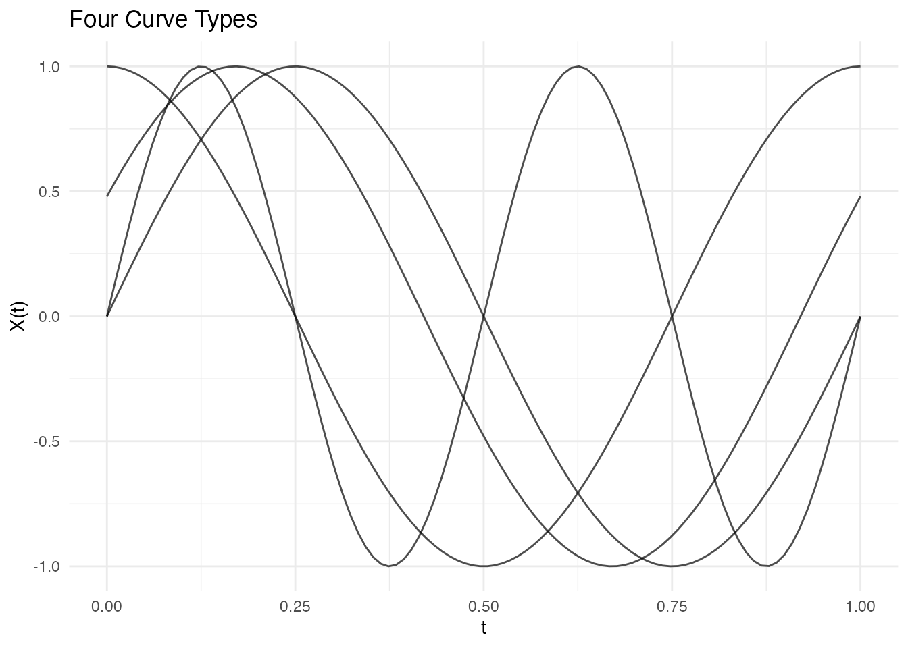
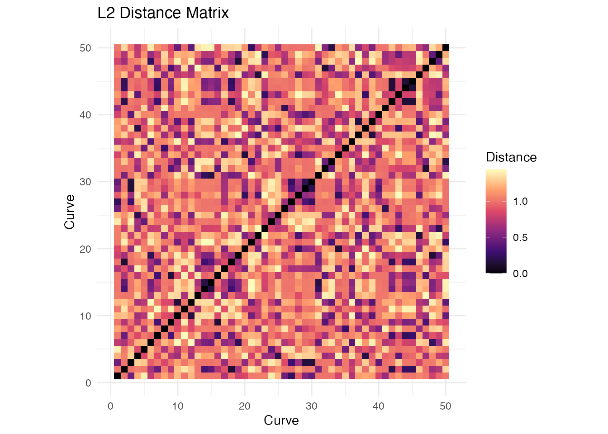

# Distance Metrics and Semimetrics

## Introduction

Distance measures are fundamental to many FDA methods including
clustering, k-nearest neighbors regression, and outlier detection.
**fdars** provides both true metrics (satisfying the triangle
inequality) and semimetrics (which may not).

A **metric** $d$ on a space $\mathcal{X}$ satisfies:

1.  $d(f,g) \geq 0$ (non-negativity)
2.  $\left. d(f,g) = 0\Leftrightarrow f = g \right.$ (identity of
    indiscernibles)
3.  $d(f,g) = d(g,f)$ (symmetry)
4.  $d(f,h) \leq d(f,g) + d(g,h)$ (triangle inequality)

A **semimetric** satisfies only conditions 1-3.

``` r
library(fdars)
#> 
#> Attaching package: 'fdars'
#> The following objects are masked from 'package:stats':
#> 
#>     cov, decompose, deriv, median, sd, var
#> The following object is masked from 'package:base':
#> 
#>     norm
library(ggplot2)
theme_set(theme_minimal())

# Create example data with different curve types
set.seed(42)
m <- 100
t_grid <- seq(0, 1, length.out = m)

# Four types of curves
curve1 <- sin(2 * pi * t_grid)                    # Sine
curve2 <- sin(2 * pi * t_grid + 0.5)              # Phase-shifted sine
curve3 <- cos(2 * pi * t_grid)                    # Cosine
curve4 <- sin(4 * pi * t_grid)                    # Higher frequency

X <- rbind(curve1, curve2, curve3, curve4)
fd <- fdata(X, argvals = t_grid,
            names = list(main = "Four Curve Types"))
plot(fd)
```



## True Metrics

### Lp Distance (metric.lp)

The $L^{p}$ distance is the most common choice for functional data. It
computes the integrated $L^{p}$ norm of the difference between two
functions:

$$d_{p}(f,g) = \left( \int_{\mathcal{T}}\left| f(t) - g(t) \right|^{p}\, dt \right)^{1/p}$$

For discrete observations, this is approximated using numerical
integration (Simpson’s rule):

$$d_{p}(f,g) \approx \left( \sum\limits_{j = 1}^{m}w_{j}\left| f\left( t_{j} \right) - g\left( t_{j} \right) \right|^{p} \right)^{1/p}$$

where $w_{j}$ are quadrature weights.

Special cases:

- **$p = 2$ (L2/Euclidean)**: Most common, corresponds to the standard
  functional norm. Sensitive to vertical differences.
- **$p = 1$ (L1/Manhattan)**: More robust to outliers than L2.
- **$p = \infty$ (L-infinity/Chebyshev)**: Maximum absolute difference,
  $d_{\infty}(f,g) = \max_{t}\left| f(t) - g(t) \right|$.

``` r
# L2 (Euclidean) distance - default
dist_l2 <- metric.lp(fd)
print(round(as.matrix(dist_l2), 3))
#>        curve1 curve2 curve3 curve4
#> curve1   0.00  0.350  1.000      1
#> curve2   0.35  0.000  0.722      1
#> curve3   1.00  0.722  0.000      1
#> curve4   1.00  1.000  1.000      0

# L1 (Manhattan) distance
dist_l1 <- metric.lp(fd, lp = 1)

# L-infinity (maximum) distance
dist_linf <- metric.lp(fd, lp = Inf)
```

### Weighted Lp Distance

Apply different weights to different parts of the domain:

$$d_{p,w}(f,g) = \left( \int_{\mathcal{T}}w(t)\left| f(t) - g(t) \right|^{p}\, dt \right)^{1/p}$$

This is useful when certain parts of the domain are more important than
others.

``` r
# Weight emphasizing the middle of the domain
w <- dnorm(t_grid, mean = 0.5, sd = 0.2)
w <- w / sum(w) * length(w)  # Normalize

dist_weighted <- metric.lp(fd, lp = 2, w = w)
```

### Hausdorff Distance (metric.hausdorff)

The Hausdorff distance treats curves as sets of points
$\left( t,f(t) \right)$ in 2D space and computes the maximum of minimum
distances:

$$d_{H}(f,g) = \max\left\{ \sup\limits_{t \in \mathcal{T}}\inf\limits_{s \in \mathcal{T}} \parallel P_{f}(t) - P_{g}(s) \parallel ,\sup\limits_{s \in \mathcal{T}}\inf\limits_{t \in \mathcal{T}} \parallel P_{f}(t) - P_{g}(s) \parallel \right\}$$

where $P_{f}(t) = \left( t,f(t) \right)$ is the point on the graph of
$f$ at time $t$.

The Hausdorff distance is useful when:

- Curves may cross each other
- The timing of features is less important than their shape
- Comparing curves with different supports

``` r
dist_haus <- metric.hausdorff(fd)
print(round(as.matrix(dist_haus), 3))
#>        curve1 curve2 curve3 curve4
#> curve1  0.000  0.479  0.678  0.328
#> curve2  0.479  0.000  0.521  0.416
#> curve3  0.678  0.521  0.000  0.352
#> curve4  0.328  0.416  0.352  0.000
```

### Dynamic Time Warping (metric.DTW)

DTW allows for non-linear alignment of curves before computing the
distance. It finds the optimal warping path $\pi$ that minimizes:

$$d_{DTW}(f,g) = \min\limits_{\pi}\sqrt{\sum\limits_{{(i,j)} \in \pi}\left| f\left( t_{i} \right) - g\left( t_{j} \right) \right|^{2}}$$

subject to boundary conditions, monotonicity, and continuity
constraints.

The **Sakoe-Chiba band** constraint limits the warping to
$|i - j| \leq w$, preventing excessive distortion:

$$d_{DTW}^{SC}(f,g) = \min\limits_{\pi:{|i - j|} \leq w}\sqrt{\sum\limits_{{(i,j)} \in \pi}\left| f\left( t_{i} \right) - g\left( t_{j} \right) \right|^{2}}$$

DTW is particularly effective for:

- Phase-shifted signals
- Time series with varying speed
- Comparing signals with local time distortions

``` r
dist_dtw <- metric.DTW(fd)
print(round(as.matrix(dist_dtw), 3))
#>        curve1 curve2 curve3 curve4
#> curve1  0.000  1.452 18.185 24.844
#> curve2  1.452  0.000  3.488 25.980
#> curve3 18.185  3.488  0.000 40.825
#> curve4 24.844 25.980 40.825  0.000
```

Notice that DTW gives a smaller distance between the original sine and
phase-shifted sine compared to L2, because it can align them:

``` r
# Compare L2 vs DTW for phase-shifted curves
cat("L2 distance (sine vs phase-shifted):", round(as.matrix(dist_l2)[1, 2], 3), "\n")
#> L2 distance (sine vs phase-shifted): 0.35
cat("DTW distance (sine vs phase-shifted):", round(as.matrix(dist_dtw)[1, 2], 3), "\n")
#> DTW distance (sine vs phase-shifted): 1.452
```

DTW with band constraint:

``` r
# Restrict warping to 10% of the series length
dist_dtw_band <- metric.DTW(fd, w = round(m * 0.1))
```

### Kullback-Leibler Divergence (metric.kl)

The symmetric Kullback-Leibler divergence treats normalized curves as
probability density functions:

$$d_{KL}(f,g) = \frac{1}{2}\left\lbrack \int f(t)\log\frac{f(t)}{g(t)}\, dt + \int g(t)\log\frac{g(t)}{f(t)}\, dt \right\rbrack$$

Before computing, curves are shifted to be non-negative and normalized
to integrate to 1:

$$\widetilde{f}(t) = \frac{f(t) - \min\limits_{s}f(s) + \epsilon}{\int\left\lbrack f(s) - \min\limits_{s}f(s) + \epsilon \right\rbrack\, ds}$$

This metric is useful for:

- Comparing density-like functions
- Distribution comparison
- Information-theoretic analysis

``` r
# Shift curves to be positive for KL
X_pos <- X - min(X) + 0.1
fd_pos <- fdata(X_pos, argvals = t_grid)

dist_kl <- metric.kl(fd_pos)
print(round(as.matrix(dist_kl), 3))
#>        curve1 curve2 curve3 curve4
#> curve1  0.000  0.139  1.208  1.187
#> curve2  0.139  0.000  0.630  1.426
#> curve3  1.208  0.630  0.000  1.156
#> curve4  1.187  1.426  1.156  0.000
```

## Semimetrics

Semimetrics may not satisfy the triangle inequality but can be more
appropriate for certain applications or provide computational
advantages.

### PCA-Based Semimetric (semimetric.pca)

Projects curves onto the first $q$ principal components and computes the
Euclidean distance in the reduced space:

$$d_{PCA}(f,g) = \sqrt{\sum\limits_{k = 1}^{q}\left( \xi_{k}^{f} - \xi_{k}^{g} \right)^{2}}$$

where $\xi_{k}^{f} = \langle f - \bar{f},\phi_{k}\rangle$ is the $k$-th
principal component score of $f$, and $\phi_{k}$ are the eigenfunctions
from functional PCA.

This semimetric is useful for:

- Dimension reduction before distance computation
- Noise reduction (low-rank approximation)
- Computational efficiency with many evaluation points

``` r
# Distance using first 3 PCs
dist_pca <- semimetric.pca(fd, ncomp = 3)
print(round(as.matrix(dist_pca), 3))
#>        [,1]  [,2]   [,3]   [,4]
#> [1,]  0.000 3.514 10.000  9.950
#> [2,]  3.514 0.000  7.198  9.961
#> [3,] 10.000 7.198  0.000 10.000
#> [4,]  9.950 9.961 10.000  0.000
```

### Derivative-Based Semimetric (semimetric.deriv)

Computes the $L^{p}$ distance based on the $r$-th derivative of the
curves:

$$d_{deriv}^{(r)}(f,g) = \left( \int_{\mathcal{T}}\left| f^{(r)}(t) - g^{(r)}(t) \right|^{p}\, dt \right)^{1/p}$$

where $f^{(r)}$ denotes the $r$-th derivative of $f$.

This semimetric focuses on the shape and dynamics of curves rather than
their absolute values. It is particularly useful when:

- Comparing rate of change (first derivative)
- Analyzing curvature (second derivative)
- Functions are measured with different baselines

``` r
# First derivative (velocity)
dist_deriv1 <- semimetric.deriv(fd, nderiv = 1)

# Second derivative (acceleration/curvature)
dist_deriv2 <- semimetric.deriv(fd, nderiv = 2)

cat("First derivative distances:\n")
#> First derivative distances:
print(round(as.matrix(dist_deriv1), 3))
#>       [,1]  [,2]  [,3]  [,4]
#> [1,] 0.000 2.197 6.279 9.912
#> [2,] 2.197 0.000 4.530 9.912
#> [3,] 6.279 4.530 0.000 9.912
#> [4,] 9.912 9.912 9.912 0.000
```

### Basis Semimetric (semimetric.basis)

Projects curves onto a basis (B-spline or Fourier) and computes the
Euclidean distance between the coefficient vectors:

$$d_{basis}(f,g) = \parallel c^{f} - c^{g} \parallel_{2} = \sqrt{\sum\limits_{k = 1}^{K}\left( c_{k}^{f} - c_{k}^{g} \right)^{2}}$$

where $c^{f} = \left( c_{1}^{f},\ldots,c_{K}^{f} \right)$ are the basis
coefficients from $f(t) \approx \sum_{k = 1}^{K}c_{k}^{f}B_{k}(t)$.

For **B-splines**: Local support provides good approximation of local
features.

For **Fourier basis**: Global support captures periodic patterns
efficiently.

``` r
# B-spline basis (local features)
dist_bspline <- semimetric.basis(fd, nbasis = 15, basis = "bspline")

# Fourier basis (periodic patterns)
dist_fourier <- semimetric.basis(fd, nbasis = 11, basis = "fourier")

cat("B-spline basis distances:\n")
#> B-spline basis distances:
print(round(as.matrix(dist_bspline), 3))
#>       [,1]  [,2]  [,3]  [,4]
#> [1,] 0.000 1.509 4.015 3.913
#> [2,] 1.509 0.000 2.771 3.999
#> [3,] 4.015 2.771 0.000 4.289
#> [4,] 3.913 3.999 4.289 0.000
```

### Fourier Semimetric (semimetric.fourier)

Uses the Fast Fourier Transform (FFT) to compute Fourier coefficients
and measures distance based on the first $K$ frequency components:

$$d_{FFT}(f,g) = \sqrt{\sum\limits_{k = 0}^{K}\left| {\widehat{f}}_{k} - {\widehat{g}}_{k} \right|^{2}}$$

where ${\widehat{f}}_{k}$ is the $k$-th Fourier coefficient computed via
FFT.

This is computationally efficient for large datasets and particularly
useful for periodic or frequency-domain analysis.

``` r
dist_fft <- semimetric.fourier(fd, nfreq = 5)
cat("Fourier (FFT) distances:\n")
#> Fourier (FFT) distances:
print(round(as.matrix(dist_fft), 3))
#>        curve1 curve2 curve3 curve4
#> curve1  0.000  0.005  0.012  0.694
#> curve2  0.005  0.000  0.008  0.695
#> curve3  0.012  0.008  0.000  0.700
#> curve4  0.694  0.695  0.700  0.000
```

### Horizontal Shift Semimetric (semimetric.hshift)

Finds the optimal horizontal shift before computing the $L^{2}$
distance:

$$d_{hshift}(f,g) = \min\limits_{{|h|} \leq h_{max}}\left( \int_{\mathcal{T}}\left| f(t) - g(t + h) \right|^{2}\, dt \right)^{1/2}$$

where $h$ is the shift in discrete time units and $h_{max}$ is the
maximum allowed shift.

This semimetric is simpler than DTW (only horizontal shifts, no warping)
but can be very effective for:

- Phase-shifted periodic signals
- ECG or other physiological signals with timing variations
- Comparing curves where horizontal alignment is meaningful

``` r
dist_hshift <- semimetric.hshift(fd)
cat("Horizontal shift distances:\n")
#> Horizontal shift distances:
print(round(as.matrix(dist_hshift), 3))
#>        curve1 curve2 curve3 curve4
#> curve1  0.000  0.005  0.010  0.733
#> curve2  0.005  0.000  0.005  0.629
#> curve3  0.010  0.005  0.000  0.718
#> curve4  0.733  0.629  0.718  0.000
```

## Unified Interface

Use [`metric()`](https://sipemu.github.io/fdars-r/reference/metric.md)
for a unified interface to all distance functions:

``` r
# Different methods via single function
d1 <- metric(fd, method = "lp", lp = 2)
d2 <- metric(fd, method = "dtw")
d3 <- metric(fd, method = "hausdorff")
d4 <- metric(fd, method = "pca", ncomp = 2)
```

## Comparing Distance Measures

Different distance measures capture different aspects of curve
similarity:

``` r
# Create comparison data
dists <- list(
  L2 = as.vector(as.matrix(dist_l2)),
  L1 = as.vector(as.matrix(dist_l1)),
  DTW = as.vector(as.matrix(dist_dtw)),
  Hausdorff = as.vector(as.matrix(dist_haus))
)

# Correlation between distance measures
dist_mat <- do.call(cbind, dists)
cat("Correlation between distance measures:\n")
#> Correlation between distance measures:
print(round(cor(dist_mat), 2))
#>             L2   L1  DTW Hausdorff
#> L2        1.00 1.00 0.82      0.74
#> L1        1.00 1.00 0.82      0.74
#> DTW       0.82 0.82 1.00      0.32
#> Hausdorff 0.74 0.74 0.32      1.00
```

## Distance Matrices for Larger Samples

``` r
# Generate larger sample
set.seed(123)
n <- 50
X_large <- matrix(0, n, m)
for (i in 1:n) {
  phase <- runif(1, 0, 2*pi)
  freq <- sample(1:3, 1)
  X_large[i, ] <- sin(freq * pi * t_grid + phase) + rnorm(m, sd = 0.1)
}
fd_large <- fdata(X_large, argvals = t_grid)

# Compute distance matrix
dist_matrix <- metric.lp(fd_large)

# Visualize as heatmap using ggplot2
dist_df <- expand.grid(Curve1 = 1:n, Curve2 = 1:n)
dist_df$Distance <- as.vector(as.matrix(dist_matrix))

ggplot(dist_df, aes(x = Curve1, y = Curve2, fill = Distance)) +
  geom_tile() +
  scale_fill_viridis_c(option = "magma") +
  coord_equal() +
  labs(x = "Curve", y = "Curve", title = "L2 Distance Matrix") +
  theme_minimal()
```



## Metric Properties Summary

| Distance   | Type       | Triangle Ineq. | Phase Invariant | Computational Cost |
|------------|------------|----------------|-----------------|--------------------|
| Lp         | Metric     | Yes            | No              | O(nm)              |
| Hausdorff  | Metric     | Yes            | Partial         | O(nm²)             |
| DTW        | Metric\*   | Yes\*          | Yes             | O(nm²)             |
| KL         | Semimetric | No             | No              | O(nm)              |
| PCA        | Semimetric | Yes\*\*        | No              | O(nm + nq²)        |
| Derivative | Semimetric | Yes\*\*        | No              | O(nm)              |
| Basis      | Semimetric | Yes\*\*        | No              | O(nmK)             |
| Fourier    | Semimetric | Yes\*\*        | No              | O(nm log m)        |
| H-shift    | Semimetric | No             | Yes             | O(nm·h_max)        |

\* DTW satisfies triangle inequality when using the same warping path
\*\* These satisfy triangle inequality in the reduced/transformed space

## Choosing a Distance Measure

| Scenario              | Recommended Distance            |
|-----------------------|---------------------------------|
| General purpose       | L2 (`metric.lp`)                |
| Heavy-tailed noise    | L1 (`metric.lp`, p=1)           |
| Worst-case analysis   | L-infinity (`metric.lp`, p=Inf) |
| Phase-shifted signals | DTW or H-shift                  |
| Curves that cross     | Hausdorff                       |
| High-dimensional data | PCA-based                       |
| Shape comparison      | Derivative-based                |
| Periodic data         | Fourier-based                   |
| Density-like curves   | Kullback-Leibler                |

## Performance

Distance computations are parallelized in Rust:

``` r
# Benchmark for 500 curves
X_bench <- matrix(rnorm(500 * 200), 500, 200)
fd_bench <- fdata(X_bench)

system.time(metric.lp(fd_bench))
#>    user  system elapsed
#>   0.089   0.000   0.045

system.time(metric.DTW(fd_bench))
#>    user  system elapsed
#>   1.234   0.000   0.312
```

## Using Distances in Other Methods

Distance functions can be passed to clustering and regression:

``` r
# K-means with L1 distance
km_l1 <- cluster.kmeans(fd_large, ncl = 3, metric = "L1", seed = 42)

# K-means with custom metric function
km_dtw <- cluster.kmeans(fd_large, ncl = 3, metric = metric.DTW, seed = 42)

# Nonparametric regression uses distances internally
y <- rnorm(n)
fit_np <- fregre.np(fd_large, y, metric = metric.lp)
```

## References

- Berndt, D.J. and Clifford, J. (1994). Using Dynamic Time Warping to
  Find Patterns in Time Series. *KDD Workshop*, 359-370.
- Ferraty, F. and Vieu, P. (2006). *Nonparametric Functional Data
  Analysis*. Springer.
- Ramsay, J.O. and Silverman, B.W. (2005). *Functional Data Analysis*.
  Springer, 2nd edition.
- Sakoe, H. and Chiba, S. (1978). Dynamic programming algorithm
  optimization for spoken word recognition. *IEEE Transactions on
  Acoustics, Speech, and Signal Processing*, 26(1), 43-49.
