# Elastic Curve Alignment

## Introduction

When comparing functional data, observed curves often exhibit both
**amplitude variability** (differences in height/shape) and **phase
variability** (differences in timing/speed). Standard methods like the
cross-sectional mean or PCA treat all variation as amplitude, which can
produce blurred averages and inflated variance.

**Elastic alignment** separates these two sources of variability by
finding optimal **warping functions** $\gamma$ that retime each curve
before comparison. The mathematical framework uses the **Square-Root
Slope Function (SRSF)** representation, which makes the Fisher-Rao
metric equivalent to the $L^{2}$ metric – enabling efficient dynamic
programming alignment.

``` r
library(fdars)
#> 
#> Attaching package: 'fdars'
#> The following objects are masked from 'package:stats':
#> 
#>     cov, decompose, deriv, median, sd, var
#> The following object is masked from 'package:base':
#> 
#>     norm
library(ggplot2)
library(patchwork)
theme_set(theme_minimal())
```

## Quick Start

``` r
set.seed(42)
argvals <- seq(0, 1, length.out = 100)

# Simulate curves with horizontal shifts
n <- 15
shifts <- runif(n, -0.1, 0.1)
data <- matrix(0, n, 100)
for (i in 1:n) {
  data[i, ] <- sin(2 * pi * (argvals - shifts[i]))
}
fd <- fdata(data, argvals = argvals)

# Align to cross-sectional mean (default)
res <- elastic.align(fd)
print(res)
#> Elastic Alignment
#>   Curves: 15 x 100 grid points
#>   Mean elastic distance: 0.2025
```

``` r
plot(res, type = "both")
```

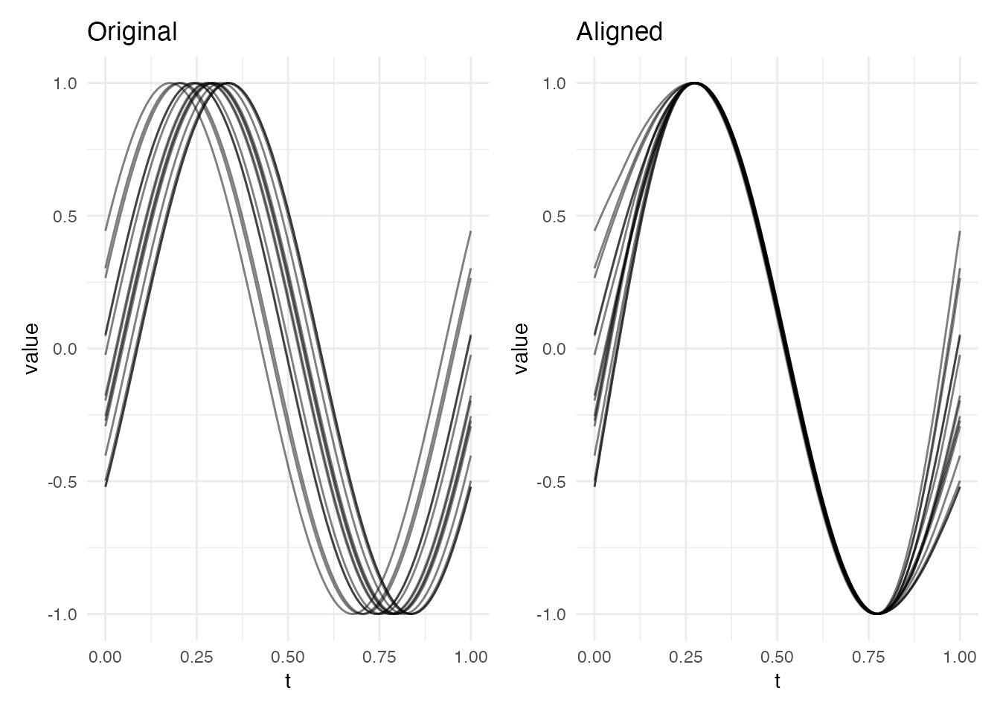

You can also supply a custom target – as a numeric vector or an `fdata`
object:

``` r
# Use the deepest (most central) curve as target
depths <- depth(fd, method = "FM")
res_deep <- elastic.align(fd, target = fd[which.max(depths)])
```

### Inspecting Warping Functions

The warping functions $\gamma_{i}$ are the key output of elastic
alignment. Each $\gamma_{i}(t)$ is a monotonically increasing function
from $\lbrack 0,1\rbrack$ to $\lbrack 0,1\rbrack$ that maps the
**reference time axis** to the **original curve’s time axis**. The
aligned curve is then $f_{i}\left( \gamma_{i}(t) \right)$ – time is
reparameterised so that features line up with the target.

``` r
plot(res, type = "warps")
```

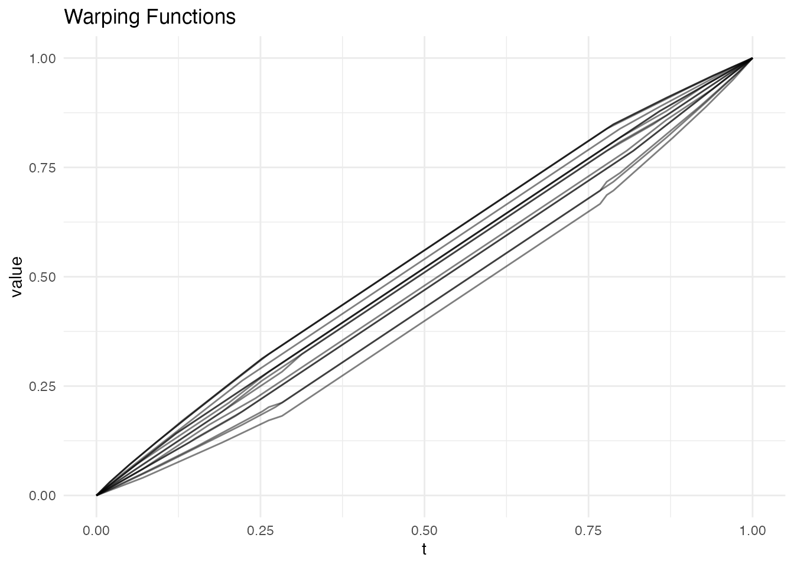

#### How to Read a Warping Function

The **diagonal** ($\gamma(t) = t$) represents the identity warp – no
time change needed. Deviations from the diagonal tell you how the
curve’s timing differs from the reference:

- $\gamma_{i}(t) < t$ (below diagonal): at reference time $t$, the
  corresponding feature in curve $i$ occurs at an **earlier** time. The
  alignment must look backward to find the matching feature.
- $\gamma_{i}(t) > t$ (above diagonal): the feature occurs **later** in
  curve $i$. The alignment must look forward.

The **slope** of $\gamma_{i}$ encodes local speed:

- ${\dot{\gamma}}_{i}(t) > 1$ (steeper than diagonal): this region of
  the original curve is **stretched** – the alignment slows it down to
  spread features over more reference time.
- ${\dot{\gamma}}_{i}(t) < 1$ (shallower): this region is **compressed**
  – the alignment speeds it up.

Let’s visualise this for a single curve to make the interpretation
concrete:

``` r
# Pick the curve with the largest shift
i_max <- which.max(abs(shifts))
gamma_i <- as.numeric(res$gammas$data[i_max, ])

# Panel 1: the warping function with annotations
df_warp <- data.frame(t = argvals, gamma = gamma_i)
df_diag <- data.frame(t = c(0, 1), gamma = c(0, 1))

p_warp <- ggplot(df_warp, aes(x = t, y = gamma)) +
  geom_line(data = df_diag, linetype = "dashed", color = "grey60") +
  geom_line(color = "steelblue", linewidth = 1) +
  geom_ribbon(aes(ymin = pmin(gamma, t), ymax = pmax(gamma, t)),
              fill = "steelblue", alpha = 0.15) +
  labs(title = paste0("Warping function for curve ", i_max,
                      " (shift = ", round(shifts[i_max], 3), ")"),
       x = "Reference time t", y = expression(gamma(t))) +
  coord_equal()

# Panel 2: original curve, aligned curve, and target
f_orig <- as.numeric(fd$data[i_max, ])
f_aligned <- as.numeric(res$aligned$data[i_max, ])
f_target <- as.numeric(res$target)

df_curves <- data.frame(
  t = rep(argvals, 3),
  value = c(f_orig, f_aligned, f_target),
  curve = rep(c("Original", "Aligned", "Target"), each = length(argvals))
)

p_curves <- ggplot(df_curves, aes(x = t, y = value, color = curve,
                                  linetype = curve)) +
  geom_line(linewidth = 0.9) +
  scale_color_manual(values = c(Original = "coral", Aligned = "steelblue",
                                Target = "grey30")) +
  scale_linetype_manual(values = c(Original = "solid", Aligned = "solid",
                                   Target = "dashed")) +
  labs(title = "Effect of warping on the curve",
       x = "t", y = "value", color = NULL, linetype = NULL) +
  theme(legend.position = "top")

# Panel 3: local speed via deriv()
warp_speed <- deriv(res$gammas)
speed_i <- as.numeric(warp_speed$data[i_max, ])
df_speed <- data.frame(t = warp_speed$argvals, speed = speed_i)

p_speed <- ggplot(df_speed, aes(x = t, y = speed)) +
  geom_hline(yintercept = 1, linetype = "dashed", color = "grey60") +
  geom_line(color = "steelblue", linewidth = 0.8) +
  geom_ribbon(aes(ymin = 1, ymax = speed), fill = "steelblue", alpha = 0.15) +
  labs(title = "Local warping speed: deriv(res$gammas)",
       x = "t",
       y = expression(dot(gamma)(t))) +
  annotate("text", x = 0.05, y = max(speed_i) * 0.95, label = "stretched",
           hjust = 0, size = 3, color = "grey40") +
  annotate("text", x = 0.05, y = min(speed_i) * 1.05, label = "compressed",
           hjust = 0, size = 3, color = "grey40")

p_warp / p_curves / p_speed
```

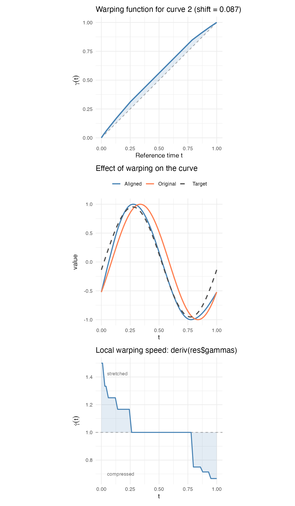

The three panels show the full picture for a single curve:

1.  **Top**: the warping function $\gamma_{i}(t)$ – the shaded area
    shows deviation from the identity. This curve had a positive shift,
    so $\gamma_{i}(t) > t$ over most of the domain (the alignment needs
    to look forward to find matching features).
2.  **Middle**: the original curve (coral), the target (dashed), and the
    aligned result $f_{i}\left( \gamma_{i}(t) \right)$ (blue). After
    warping, the aligned curve matches the target closely.
3.  **Bottom**: the local warping speed ${\dot{\gamma}}_{i}(t)$,
    computed via `deriv(res$gammas)`. Since the warping functions are
    `fdata` objects,
    [`deriv()`](https://sipemu.github.io/fdars-r/reference/deriv.md)
    returns an `fdata` of derivatives. Where $\dot{\gamma} > 1$, time is
    being stretched; where $\dot{\gamma} < 1$, time is compressed. The
    regions of fastest change correspond to where the original curve’s
    features were most offset from the target.

## How It Works (Intuition)

Imagine you record the heartbeat signal of several patients. Each
heartbeat has the same features – a P wave, a QRS complex, a T wave –
but the timing differs from patient to patient. If you simply average
the raw signals, the peaks blur out because they don’t line up.

Elastic alignment fixes this by **stretching and compressing the time
axis** of each curve until corresponding features line up. The key
insight is to work with the **Square-Root Slope Function (SRSF)** – a
transformed version of the curve that makes the math tractable. In SRSF
space, finding the best alignment reduces to a standard dynamic
programming problem that can be solved efficiently.

After alignment, variability splits cleanly into two parts:

- **Amplitude variability**: genuine differences in curve shape (how
  tall the peaks are, how deep the valleys)
- **Phase variability**: differences in timing (when the peaks occur)

The **Karcher mean** is the average curve shape, computed after
alignment. Unlike the ordinary mean, it preserves sharp features because
the peaks are aligned before averaging.

## Mathematical Framework

### The Space of Warping Functions

Let $\mathcal{F}$ denote the space of absolutely continuous functions
$\left. f:\lbrack 0,1\rbrack\rightarrow{\mathbb{R}} \right.$. The
**warping group** is the set of orientation-preserving diffeomorphisms
of $\lbrack 0,1\rbrack$:

$$\left. \Gamma = \{\gamma:\lbrack 0,1\rbrack\rightarrow\lbrack 0,1\rbrack \mid \gamma(0) = 0,\;\gamma(1) = 1,\;\dot{\gamma} > 0\} \right.$$

$\Gamma$ acts on $\mathcal{F}$ by composition: for $f \in \mathcal{F}$
and $\gamma \in \Gamma$, the warped function is
$(f \circ \gamma)(t) = f\left( \gamma(t) \right)$. This group action
reparameterizes the curve without changing its shape – only the speed at
which the curve is traversed changes.

### The Fisher-Rao Metric

The **Fisher-Rao metric** on $\mathcal{F}$ is the unique Riemannian
metric (up to scaling) that is invariant under the action of $\Gamma$.
For two tangent vectors
$\delta f_{1},\delta f_{2} \in T_{f}\mathcal{F}$, it is defined as:

$$\langle\delta f_{1},\delta f_{2}\rangle_{FR} = \int_{0}^{1}\frac{\delta f_{1}\prime(t)\,\delta f_{2}\prime(t)}{\left| f\prime(t) \right|}\, dt$$

This metric is difficult to compute directly because it depends on the
derivative of $f$ in the denominator. The SRSF transform resolves this
by isometrically mapping the Fisher-Rao geometry to a flat $L^{2}$
space.

### SRSF Transform

The **Square-Root Slope Function** of $f$ is defined as:

$$q(t) = \text{sign}\left( f\prime(t) \right)\sqrt{\left| f\prime(t) \right|}$$

This transform has three key properties:

1.  **Isometry**: The Fisher-Rao distance between $f_{1}$ and $f_{2}$
    equals the $L^{2}$ distance between their SRSFs $q_{1}$ and $q_{2}$
    (after optimal alignment)
2.  **Equivariance**: Under the warping action
    $\left. f\mapsto f \circ \gamma \right.$, the SRSF transforms as
    $\left. q\mapsto(q \circ \gamma)\sqrt{\dot{\gamma}} \right.$. This
    is simply the standard action of $\Gamma$ on $L^{2}$
3.  **Invertibility**: Given $q$ and an initial value $f_{0} = f(0)$,
    the original function is recovered by:

$$f(t) = f_{0} + \int_{0}^{t}q(s)\left| q(s) \right|\, ds$$

``` r
q <- srsf.transform(fd)
```

``` r
p1 <- plot(fd) + labs(title = "Original Curves")
p2 <- plot(q) + labs(title = "SRSF Representation")
p1 + p2
```

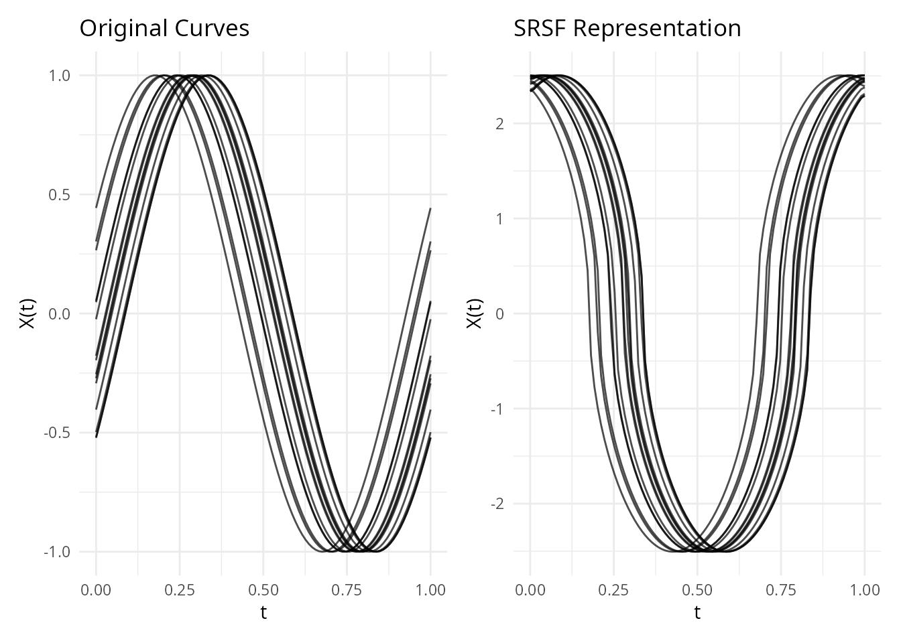

``` r
f_original <- fd$data[1, ]
q_values <- q$data[1, ]
f_reconstructed <- srsf.inverse(q_values, argvals, f_original[1])

max_error <- max(abs(f_original - f_reconstructed))
cat("Round-trip max error:", format(max_error, digits = 4), "\n")
#> Round-trip max error: 0.0006717
```

### Alignment as Optimization

Given two functions $f_{1},f_{2} \in \mathcal{F}$ with SRSFs
$q_{1},q_{2}$, the **optimal alignment** finds:

$$\gamma^{*} = \arg\min\limits_{\gamma \in \Gamma} \parallel q_{1} - \left( q_{2} \circ \gamma \right)\sqrt{\dot{\gamma}} \parallel_{L^{2}}$$

This is solved via dynamic programming in $O\left( m^{2} \right)$ time,
where $m$ is the number of grid points. The aligned function is
$f_{2} \circ \gamma^{*}$, and the **elastic distance** between $f_{1}$
and $f_{2}$ is:

$$d_{e}\left( f_{1},f_{2} \right) = \parallel q_{1} - \left( q_{2} \circ \gamma^{*} \right)\sqrt{{\dot{\gamma}}^{*}} \parallel_{L^{2}}$$

This distance satisfies all metric axioms (non-negativity, symmetry,
triangle inequality) and is invariant to reparameterization:
$d_{e}\left( f_{1},f_{2} \right) = d_{e}\left( f_{1} \circ \gamma,f_{2} \circ \gamma \right)$
for any $\gamma \in \Gamma$.

### Amplitude-Phase Decomposition

Elastic alignment provides a principled decomposition of total
variability. For a sample $f_{1},\ldots,f_{n}$ with aligned versions
${\widetilde{f}}_{i} = f_{i} \circ \gamma_{i}^{*}$:

- **Amplitude variability**: The residual variance in
  ${\widetilde{f}}_{1},\ldots,{\widetilde{f}}_{n}$ after alignment. This
  captures genuine differences in curve shape (height, depth of
  features)
- **Phase variability**: The variability in the warping functions
  $\gamma_{1}^{*},\ldots,\gamma_{n}^{*}$ themselves. This captures
  differences in timing (when features occur)

The **variance reduction** (VR) quantifies the proportion of total
variance attributable to phase:

$$\text{VR} = 1 - \frac{\text{Var}\left( {\widetilde{f}}_{1},\ldots,{\widetilde{f}}_{n} \right)}{\text{Var}\left( f_{1},\ldots,f_{n} \right)}$$

where $\text{Var}$ denotes the mean pointwise variance
$\frac{1}{T}\sum_{t}\text{Var}_{i}\left( f_{i}(t) \right)$. A VR close
to 1 indicates that most variability was phase (and has been removed); a
VR near 0 indicates the variability is primarily amplitude.

### Karcher Mean

The **Karcher mean** (Frechet mean in the elastic metric) is the
function $\mu^{*}$ that minimizes the sum of squared elastic distances:

$$\mu^{*} = \arg\min\limits_{\mu \in \mathcal{F}}\sum\limits_{i = 1}^{n}d_{e}\left( \mu,f_{i} \right)^{2}$$

Since $d_{e}$ accounts for reparameterization, $\mu^{*}$ is a
**shape-preserving average**: it recovers the common shape without
blurring from phase variability. The algorithm iterates:

1.  Initialize $\widehat{\mu} = \bar{f}$ (cross-sectional mean)
2.  Align all curves to $\widehat{\mu}$:
    ${\widetilde{f}}_{i} = f_{i} \circ \gamma_{i}^{*}$
3.  Update
    $\left. \widehat{\mu}\leftarrow\frac{1}{n}\sum_{i = 1}^{n}{\widetilde{f}}_{i} \right.$
4.  Repeat until convergence
    ($\parallel {\widehat{\mu}}^{(k + 1)} - {\widehat{\mu}}^{(k)} \parallel_{L^{2}} < \varepsilon$)

In practice, convergence is guaranteed to a local minimum and typically
occurs in 5–20 iterations.

## Core Functions

### Karcher Mean

``` r
km <- karcher.mean(fd, max.iter = 20, tol = 1e-4)
print(km)
#> Karcher Mean (Elastic)
#>   Curves: 15 x 100 grid points
#>   Iterations: 18 
#>   Converged: TRUE
```

``` r
cross_mean <- as.numeric(mean(fd)$data)
karcher <- as.numeric(km$mean$data)

df_means <- data.frame(
  t = rep(argvals, 2),
  value = c(cross_mean, karcher),
  type = rep(c("Cross-sectional mean", "Karcher mean"), each = 100)
)

ggplot(df_means, aes(x = t, y = value, color = type)) +
  geom_line(linewidth = 1.2) +
  scale_color_manual(values = c("Cross-sectional mean" = "steelblue",
                                "Karcher mean" = "firebrick")) +
  labs(title = "Cross-Sectional vs Karcher Mean",
       x = "t", y = "f(t)", color = NULL)
```

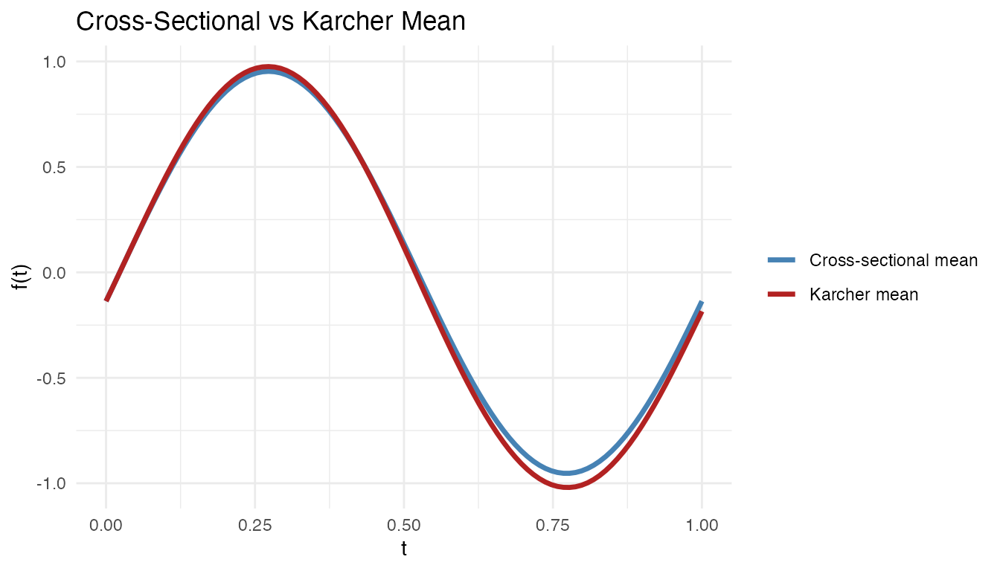

The cross-sectional mean is attenuated by the phase shifts, while the
Karcher mean recovers the true amplitude.

For complex data, increase `max.iter` and check convergence:

``` r
set.seed(42)
n <- 20
dm <- matrix(0, n, 100)
for (i in 1:n) {
  shift <- runif(1, -0.1, 0.1)
  dm[i, ] <- exp(-25 * (argvals - 0.5 - shift)^2)
}
fd_bumps <- fdata(dm, argvals = argvals)

km <- karcher.mean(fd_bumps, max.iter = 30, tol = 1e-4)
cat("Converged:", km$converged, "\n")
#> Converged: TRUE
cat("Iterations:", km$n.iter, "\n")
#> Iterations: 20
```

``` r
plot(km, type = "mean")
```

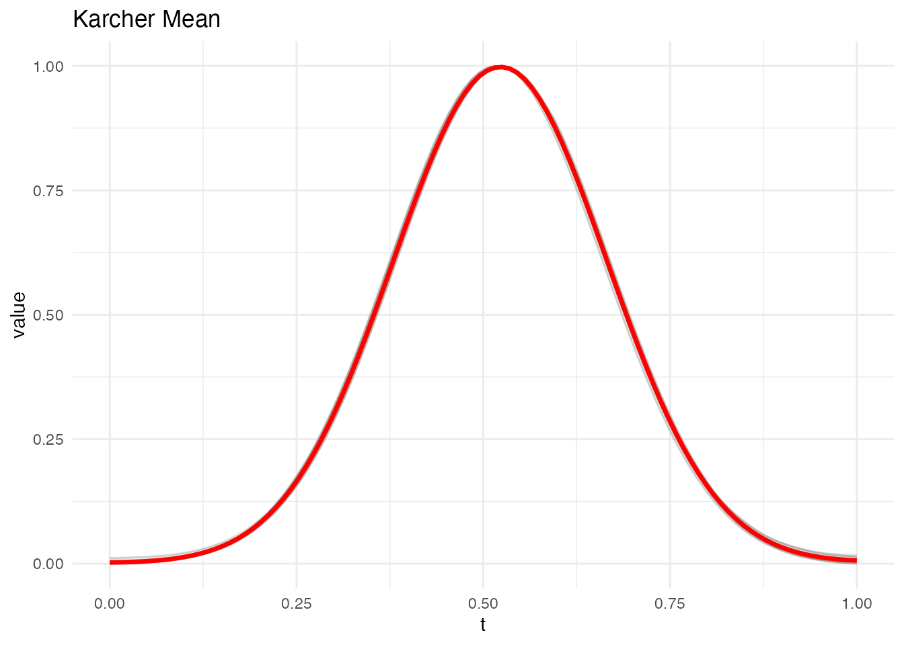

### Elastic Distance Matrix

The elastic distance $d_{e}$ provides a reparameterization-invariant
metric for clustering, MDS, and other distance-based methods:

``` r
D <- elastic.distance(fd)

# Metric properties
cat("Symmetric:             ", max(abs(D - t(D))) < 1e-10, "\n")
#> Symmetric:              TRUE
cat("Non-negative:          ", all(D >= -1e-10), "\n")
#> Non-negative:           TRUE
cat("Zero diagonal:         ", all(abs(diag(D)) < 1e-10), "\n")
#> Zero diagonal:          TRUE
```

``` r
mds <- cmdscale(D, k = 2)
plot(mds, pch = 19, xlab = "MDS 1", ylab = "MDS 2",
     main = "MDS of Elastic Distances", col = "steelblue", cex = 1.3)
```

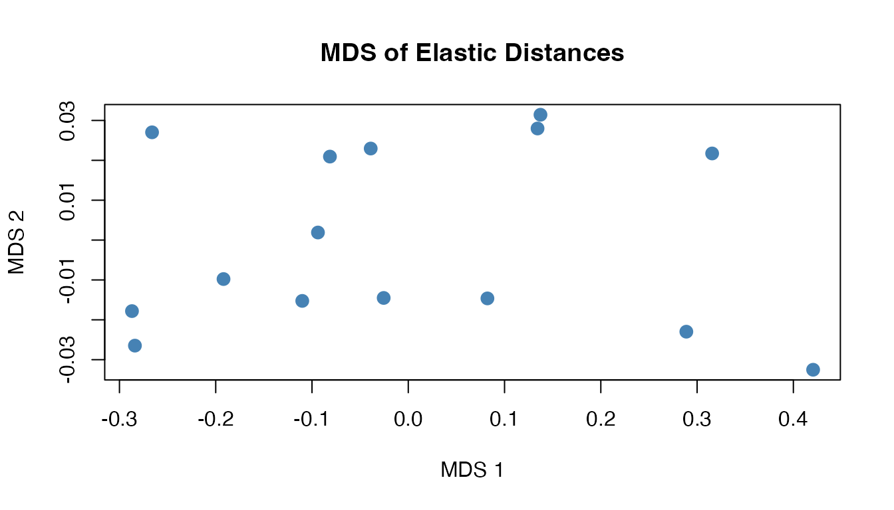

The elastic distance is also available through the
[`metric()`](https://sipemu.github.io/fdars-r/reference/metric.md)
dispatcher:

``` r
D2 <- metric(fd, method = "elastic")
all.equal(D, D2)
#> [1] TRUE
```

### Amplitude and Phase Distances

The elastic framework uniquely decomposes the total distance between two
curves into **amplitude** (shape) and **phase** (timing) components:

``` r
D_amp <- amplitude.distance(fd, lambda = 0)
D_phase <- phase.distance(fd, lambda = 0)

cat("Amplitude distance (curves 1-2):", round(as.matrix(D_amp)[1, 2], 3), "\n")
#> Amplitude distance (curves 1-2): 0.061
cat("Phase distance (curves 1-2):    ", round(as.matrix(D_phase)[1, 2], 3), "\n")
#> Phase distance (curves 1-2):     0.051
cat("Elastic distance (curves 1-2):  ", round(D[1, 2], 3), "\n")
#> Elastic distance (curves 1-2):   0.061
```

For these phase-shifted sine curves, most of the distance comes from
phase (timing differences), with very little amplitude distance (the
shapes are similar after alignment).

## Alignment Quality Diagnostics

After alignment, we can quantify exactly what changed. First, compute
the Karcher mean and alignment quality:

``` r
km_diag <- karcher.mean(fd, max.iter = 20, tol = 1e-4)
aq <- alignment.quality(fd, km_diag)
print(aq)
#> Alignment Quality Diagnostics
#>   Mean warp complexity: 0.0669 
#>   Mean warp smoothness: 20.6504 
#>   Total variance:      0.0457 
#>   Amplitude variance:  0.0104 
#>   Phase variance:      0.0353 
#>   Phase/Total ratio:   0.7733 
#>   Mean VR:             0.1479
```

### Before vs After: What Changed?

To see the effect of alignment concretely, we compare key metrics
computed on the original and aligned curves:

``` r
# Pairwise L2 distances
D_before <- as.matrix(metric.lp(fd))
D_after <- as.matrix(metric.lp(km_diag$aligned))
mean_d_before <- mean(D_before[upper.tri(D_before)])
mean_d_after <- mean(D_after[upper.tri(D_after)])

# Pointwise variance
var_before <- apply(fd$data, 2, var)
var_after <- apply(km_diag$aligned$data, 2, var)
mean_var_before <- mean(var_before)
mean_var_after <- mean(var_after)

# Format as table
pct <- function(b, a) paste0(round((b - a) / b * 100, 1), "%")
tab <- data.frame(
  Metric = c("Mean pairwise L\u00b2 distance",
             "Mean pointwise variance",
             "Mean cross-sectional SD"),
  Before = round(c(mean_d_before, mean_var_before, mean(sqrt(var_before))), 4),
  After = round(c(mean_d_after, mean_var_after, mean(sqrt(var_after))), 4),
  Reduction = c(pct(mean_d_before, mean_d_after),
                pct(mean_var_before, mean_var_after),
                pct(mean(sqrt(var_before)), mean(sqrt(var_after))))
)
knitr::kable(tab, align = "lrrr")
```

| Metric                    | Before |  After | Reduction |
|:--------------------------|-------:|-------:|----------:|
| Mean pairwise L² distance | 0.2603 | 0.1243 |     52.3% |
| Mean pointwise variance   | 0.0494 | 0.0120 |     75.8% |
| Mean cross-sectional SD   | 0.2043 | 0.0652 |     68.1% |

### Pointwise Variance: Where Did Alignment Help?

The pointwise variance at each time point shows *where* alignment had
the greatest effect. The shaded region highlights the variance removed:

``` r
df_var <- data.frame(
  t = rep(argvals, 2),
  variance = c(var_before, var_after),
  stage = rep(c("Before", "After"), each = length(argvals))
)

ggplot() +
  geom_ribbon(
    data = data.frame(t = argvals, ymin = var_after, ymax = var_before),
    aes(x = t, ymin = ymin, ymax = ymax),
    fill = "steelblue", alpha = 0.2
  ) +
  geom_line(data = df_var,
            aes(x = t, y = variance, color = stage, linetype = stage),
            linewidth = 0.8) +
  scale_color_manual(values = c(Before = "grey40", After = "steelblue")) +
  scale_linetype_manual(values = c(Before = "dashed", After = "solid")) +
  labs(title = "Pointwise Variance: Before vs After Alignment",
       x = "t", y = "Variance", color = NULL, linetype = NULL) +
  theme(legend.position = "top")
```

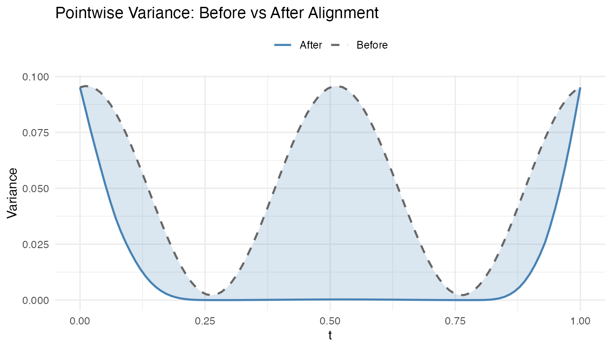

### Mean Curve: How Does the Average Sharpen?

The cross-sectional mean of the original curves is blurred by timing
differences. The Karcher mean, computed after alignment, recovers a
sharper representative shape:

``` r
n <- nrow(fd$data)
m <- ncol(fd$data)

# Original curves + cross-sectional mean
df_orig <- data.frame(
  t = rep(argvals, n), value = as.vector(t(fd$data)),
  curve = rep(seq_len(n), each = m)
)
cross_mean <- as.numeric(mean(fd)$data)
df_cmean <- data.frame(t = argvals, value = cross_mean)

p1 <- ggplot() +
  geom_line(data = df_orig, aes(x = t, y = value, group = curve),
            alpha = 0.15, color = "grey50") +
  geom_line(data = df_cmean, aes(x = t, y = value),
            color = "coral", linewidth = 1.2) +
  labs(title = "Before: Cross-Sectional Mean", x = "t", y = "value")

# Aligned curves + Karcher mean
df_aln <- data.frame(
  t = rep(argvals, n), value = as.vector(t(km_diag$aligned$data)),
  curve = rep(seq_len(n), each = m)
)
df_kmean <- data.frame(t = argvals, value = as.numeric(km_diag$mean$data[1, ]))

p2 <- ggplot() +
  geom_line(data = df_aln, aes(x = t, y = value, group = curve),
            alpha = 0.15, color = "grey50") +
  geom_line(data = df_kmean, aes(x = t, y = value),
            color = "steelblue", linewidth = 1.2) +
  labs(title = "After: Karcher Mean", x = "t", y = "value")

p1 + p2
```

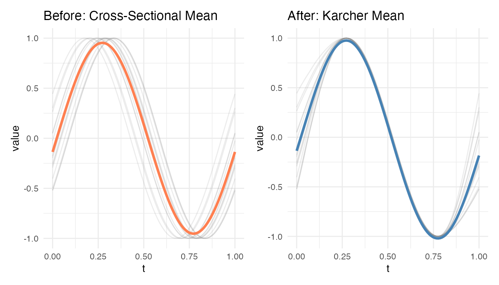

### Variance Decomposition

The
[`alignment.quality()`](https://sipemu.github.io/fdars-r/reference/alignment.quality.md)
result decomposes total variance into amplitude (shape) and phase
(timing) components:

- **Variance reduction**: fraction of total pointwise variance removed
  by alignment
- **Phase-amplitude ratio**: how much of the total variability was due
  to phase
- **Warp complexity**: average deviation of warping functions from the
  identity (higher = more warping needed)
- **Warp smoothness**: measures the regularity of the warping functions

``` r
plot(aq, type = "variance")
```

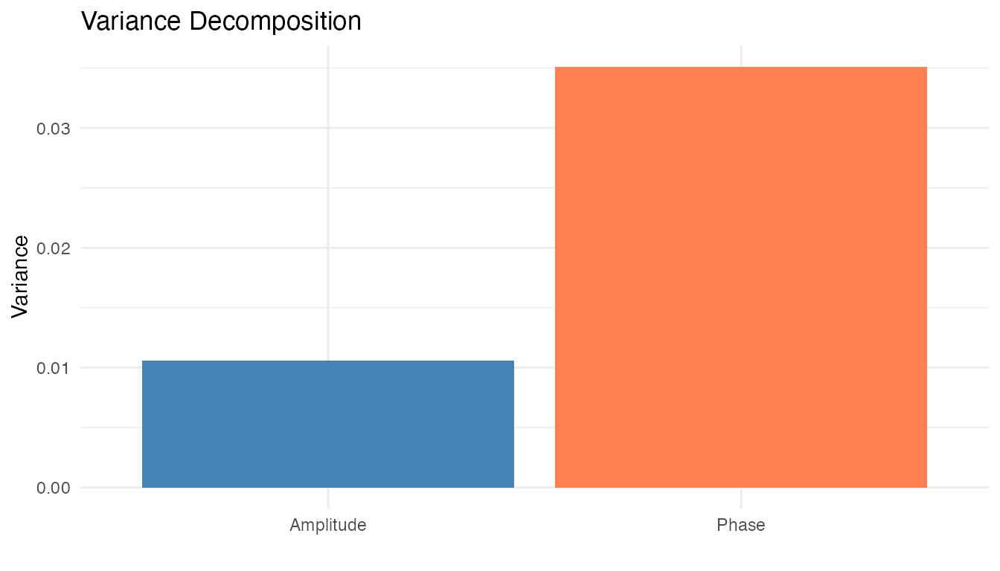

### Pairwise Consistency

The
[`alignment.pairwise.consistency()`](https://sipemu.github.io/fdars-r/reference/alignment.pairwise.consistency.md)
function checks whether pairwise alignments are consistent – i.e.,
whether aligning A to C directly gives the same result as aligning A to
B then B to C. A value near 1 indicates high consistency:

``` r
pc <- alignment.pairwise.consistency(fd, lambda = 0, max.triplets = 100)
cat("Pairwise consistency:", round(pc, 3), "\n")
#> Pairwise consistency: 0.004
```

Low consistency can indicate that the data contains subgroups with
different shapes, or that the alignment is sensitive to the choice of
target.

## Amplitude-Phase Decomposition

For individual curve pairs,
[`elastic.decomposition()`](https://sipemu.github.io/fdars-r/reference/elastic.decomposition.md)
provides the full decomposition of the elastic distance into amplitude
and phase components:

``` r
f1 <- fd[1]
f2 <- fd[5]

decomp <- elastic.decomposition(f1, f2, lambda = 0)
cat("Amplitude distance:", round(decomp$d_amplitude, 4), "\n")
#> Amplitude distance: 0.2483
cat("Phase distance:    ", round(decomp$d_phase, 4), "\n")
#> Phase distance:     0.0789
```

``` r
# Visualize the aligned pair
f1_data <- as.numeric(f1$data)
f2_aligned <- decomp$f_aligned
df_pair <- data.frame(
  t = rep(argvals, 2),
  value = c(f1_data, f2_aligned),
  curve = rep(c("f1 (target)", "f2 (aligned)"), each = length(argvals))
)
ggplot(df_pair, aes(x = t, y = value, color = curve)) +
  geom_line(linewidth = 1) +
  scale_color_manual(values = c("f1 (target)" = "steelblue", "f2 (aligned)" = "firebrick")) +
  labs(title = sprintf("Amplitude dist = %.3f, Phase dist = %.3f",
                        decomp$d_amplitude, decomp$d_phase),
       x = "t", y = "f(t)", color = NULL)
```

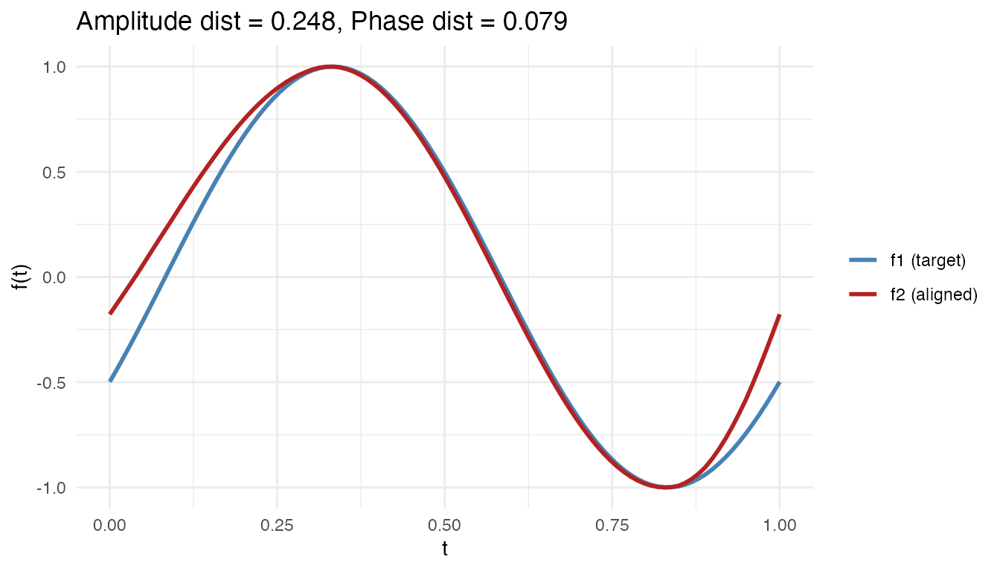

This decomposition is useful for understanding *why* two curves differ:
is it because they have different shapes (amplitude) or different timing
(phase)?

## Constrained Alignment

When curves have identifiable features (peaks, valleys), you can
constrain the elastic alignment to pass through specific landmark
positions. This combines the smoothness of elastic warping with
guaranteed feature correspondence:

``` r
# Detect peaks and constrain alignment to pass through them
ec <- elastic.align.constrained(fd, kind = "peak", min.prominence = 0.3,
                                 expected.count = 1)
```

``` r
p1 <- plot(res, type = "warps") + labs(title = "Elastic Warps")
p2 <- plot(ec, type = "warps") + labs(title = "Constrained Warps")
p1 + p2
```

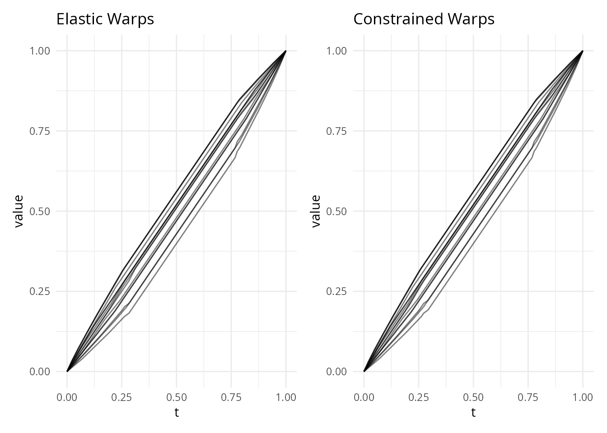

The constrained warps are smooth between landmarks (like elastic) but
anchored at the peak positions (like landmark registration). For a
detailed comparison of all alignment methods, see
`vignette("alignment-comparison", package = "fdars")`.

## When to Use Elastic Alignment

Elastic alignment works best when curves share the **same shape** but
differ in **timing**. The table below summarizes where it excels and
where it does not.

### Works Well

| Scenario                      | Typical VR | Notes                                                |
|:------------------------------|:----------:|:-----------------------------------------------------|
| Shifted peaks / bumps         |  98-100%   | Best case: localized features with horizontal shifts |
| ECG-like sharp peaks          |  98-100%   | Localized timing differences in multi-peak curves    |
| Spectral data (shifted peaks) |   95-98%   | Multiple peaks with coherent timing shifts           |
| Phase-shifted smooth curves   |   90-93%   | Sinusoidal, polynomial, sigmoid curves with shifts   |
| Non-periodic curves           |  95-100%   | Works well when boundary values are similar          |

### Where It Degrades

| Scenario                | Typical VR | Explanation                                                                     |
|:------------------------|:----------:|:--------------------------------------------------------------------------------|
| Mixed amplitude + phase |   40-65%   | Phase correction is partial when amplitude dominates                            |
| Noisy data (raw)        |   0-30%    | Noise in derivatives overwhelms SRSF; smooth first                              |
| Large boundary mismatch |   70-85%   | Fixed boundary ($\gamma(0) = 0$, $\gamma(1) = 1$) can’t correct endpoint values |
| Coarse grids (m \< 50)  |   70-75%   | DP resolution limits alignment accuracy                                         |

### Where It Should NOT Be Used

| Scenario                     | What happens                     | Recommendation                                                                                                                                                              |
|:-----------------------------|:---------------------------------|:----------------------------------------------------------------------------------------------------------------------------------------------------------------------------|
| Pure amplitude differences   | Identity warp (no harm, no help) | Use standard methods                                                                                                                                                        |
| Rate-varying monotone curves | Spurious warping, VR \< 0        | These are amplitude/shape differences, not phase                                                                                                                            |
| Genuinely different shapes   | Forced warping, VR \< 0          | Use depth or distance methods instead                                                                                                                                       |
| Very noisy data (unsmoothed) | Noise-driven warping, VR \< 0    | Pre-smooth with [`fdata2basis()`](https://sipemu.github.io/fdars-r/reference/fdata2basis.md) + [`basis2fdata()`](https://sipemu.github.io/fdars-r/reference/basis2fdata.md) |

## Scenario Gallery

The following examples illustrate alignment behavior across different
data scenarios. Each shows the **original** curves (left) and
**aligned** curves (right) with variance reduction (VR) reported.

### ECG-like Multi-Peak Curves

Sharp, localized features with timing differences are the ideal use
case:

``` r
set.seed(42)
n <- 20
dm <- matrix(0, n, 100)
for (i in 1:n) {
  shift <- runif(1, -0.05, 0.05)
  t_shifted <- argvals - shift
  # P wave, QRS complex, T wave
  dm[i, ] <- 0.2 * exp(-200 * (t_shifted - 0.2)^2) -
             0.6 * exp(-500 * (t_shifted - 0.4)^2) +
             1.0 * exp(-800 * (t_shifted - 0.43)^2) -
             0.2 * exp(-500 * (t_shifted - 0.46)^2) +
             0.3 * exp(-150 * (t_shifted - 0.65)^2)
}
fd_ecg <- fdata(dm, argvals = argvals)
res_ecg <- elastic.align(fd_ecg)
vr <- 1 - mean(apply(res_ecg$aligned$data, 2, var)) /
          mean(apply(fd_ecg$data, 2, var))
cat("ECG alignment VR:", round(vr * 100, 1), "%\n")
#> ECG alignment VR: 99.5 %
```

``` r
plot(res_ecg, type = "both")
```

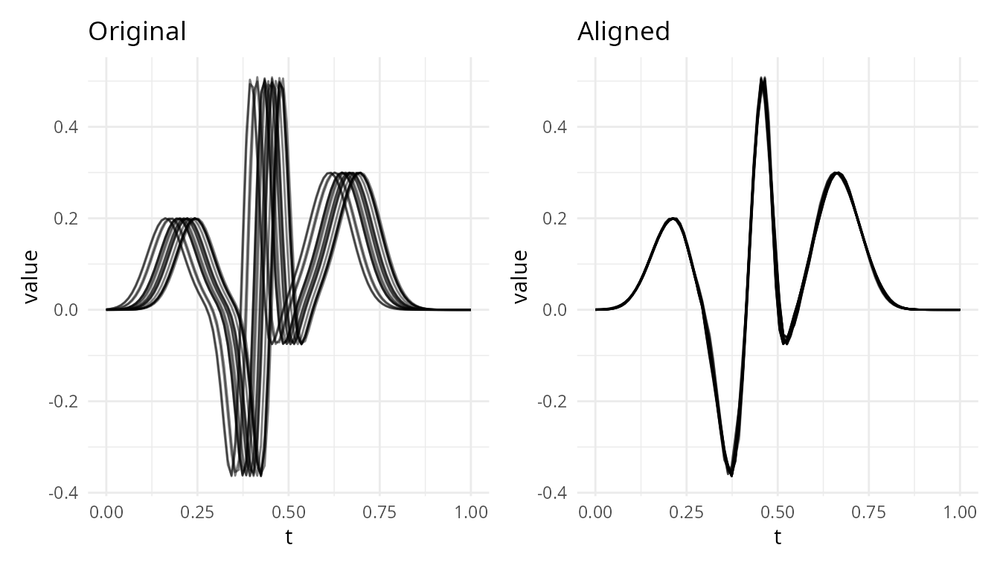

### Spectral Peaks

Multiple peaks at varying positions, common in spectroscopy and
chromatography:

``` r
set.seed(42)
n <- 20
dm <- matrix(0, n, 100)
for (i in 1:n) {
  shift <- runif(1, -0.04, 0.04)
  dm[i, ] <- 0.8 * exp(-300 * (argvals - 0.25 - shift)^2) +
             1.0 * exp(-500 * (argvals - 0.50 - shift * 1.2)^2) +
             0.5 * exp(-300 * (argvals - 0.75 - shift * 0.8)^2)
}
fd_spec <- fdata(dm, argvals = argvals)
res_spec <- elastic.align(fd_spec)
vr <- 1 - mean(apply(res_spec$aligned$data, 2, var)) /
          mean(apply(fd_spec$data, 2, var))
cat("Spectral alignment VR:", round(vr * 100, 1), "%\n")
#> Spectral alignment VR: 99.4 %
```

``` r
plot(res_spec, type = "both")
```

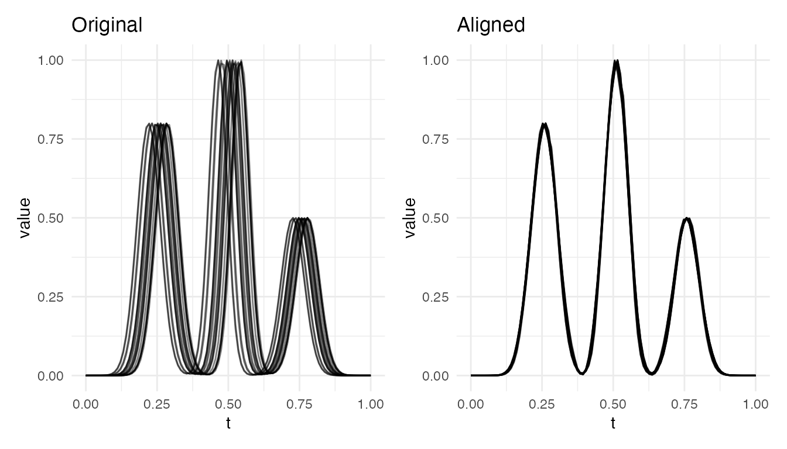

### Growth-like Sigmoid Curves

Monotone S-shaped curves with timing shifts (e.g., growth curves with
differing onset times):

``` r
set.seed(42)
n <- 20
dm <- matrix(0, n, 100)
for (i in 1:n) {
  shift <- runif(1, -0.1, 0.1)
  dm[i, ] <- 1 / (1 + exp(-20 * (argvals - 0.5 - shift)))
}
fd_sig <- fdata(dm, argvals = argvals)
res_sig <- elastic.align(fd_sig)
vr <- 1 - mean(apply(res_sig$aligned$data, 2, var)) /
          mean(apply(fd_sig$data, 2, var))
cat("Sigmoid alignment VR:", round(vr * 100, 1), "%\n")
#> Sigmoid alignment VR: 100 %
```

``` r
plot(res_sig, type = "both")
```

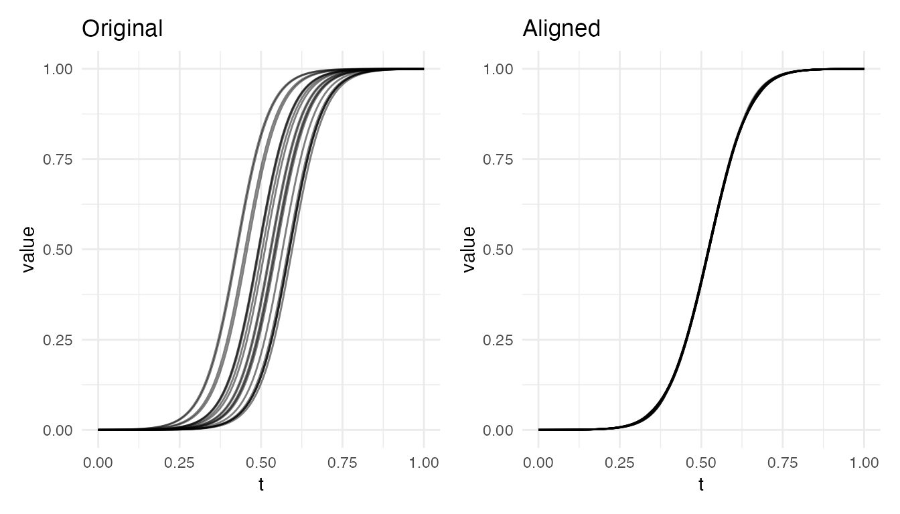

### Mixed Amplitude and Phase Variability

When curves differ in both height *and* timing, alignment corrects the
phase component but leaves amplitude variability untouched:

``` r
set.seed(42)
n <- 20
dm <- matrix(0, n, 100)
for (i in 1:n) {
  amp <- runif(1, 0.5, 1.5)
  shift <- runif(1, -0.1, 0.1)
  dm[i, ] <- amp * sin(2 * pi * (argvals - shift))
}
fd_mix <- fdata(dm, argvals = argvals)
res_mix <- elastic.align(fd_mix)
vr <- 1 - mean(apply(res_mix$aligned$data, 2, var)) /
          mean(apply(fd_mix$data, 2, var))
cat("Mixed amplitude+phase VR:", round(vr * 100, 1), "%\n")
#> Mixed amplitude+phase VR: 44.4 %
```

``` r
plot(res_mix, type = "both")
```

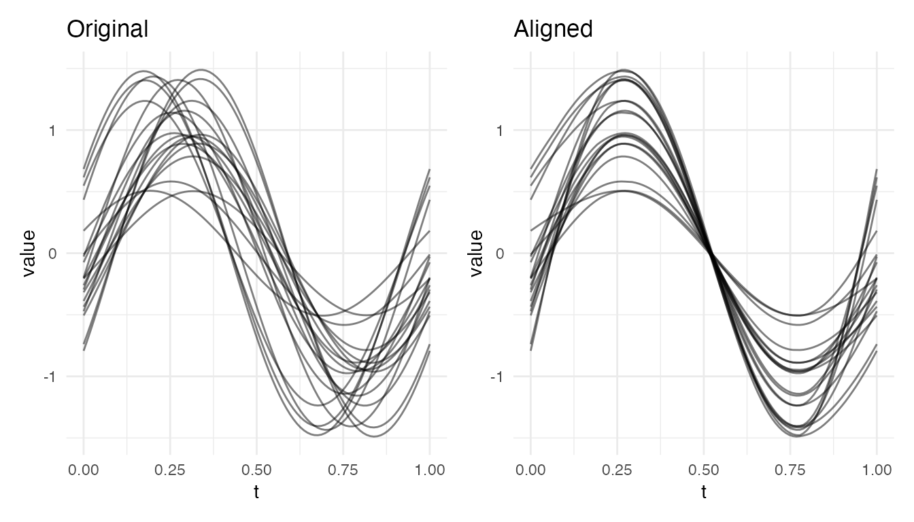

After alignment, curves still differ in amplitude (vertical spread) but
peaks and valleys are now synchronized. The residual variance is real
amplitude variability, not a failure of alignment.

### Noisy Data: Raw vs Smoothed

Noise in derivatives overwhelms the SRSF. Pre-smoothing recovers
alignment:

``` r
set.seed(42)
n <- 20
dm_clean <- matrix(0, n, 100)
shifts <- runif(n, -0.1, 0.1)
for (i in 1:n) dm_clean[i, ] <- sin(2 * pi * (argvals - shifts[i]))
dm_noisy <- dm_clean + matrix(rnorm(n * 100, sd = 0.3), n, 100)
fd_noisy <- fdata(dm_noisy, argvals = argvals)

# Align raw noisy data
res_noisy <- elastic.align(fd_noisy)
vr_raw <- 1 - mean(apply(res_noisy$aligned$data, 2, var)) /
              mean(apply(fd_noisy$data, 2, var))

# Smooth first, then align
coefs <- fdata2basis(fd_noisy, nbasis = 15, type = "bspline")
fd_sm <- basis2fdata(coefs, argvals)
res_sm <- elastic.align(fd_sm)
vr_sm <- 1 - mean(apply(res_sm$aligned$data, 2, var)) /
             mean(apply(fd_sm$data, 2, var))

cat("Raw VR:     ", round(vr_raw * 100, 1), "%\n")
#> Raw VR:      22.3 %
cat("Smoothed VR:", round(vr_sm * 100, 1), "%\n")
#> Smoothed VR: 66.3 %
```

``` r
plot(res_noisy, type = "both")
```

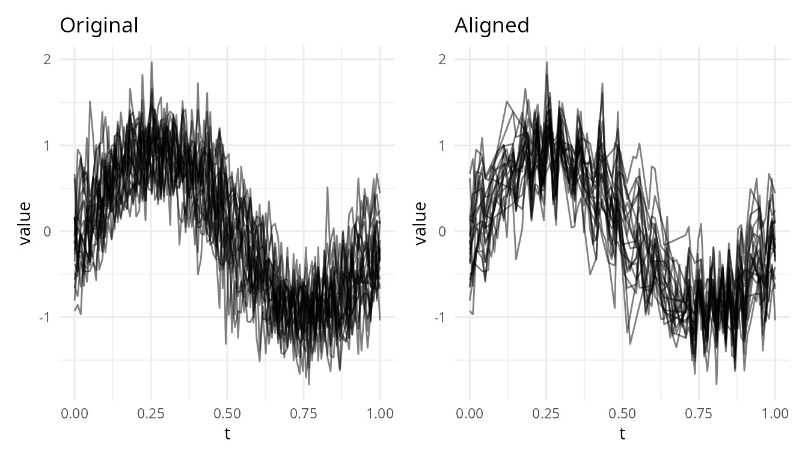

``` r
plot(res_sm, type = "both")
```

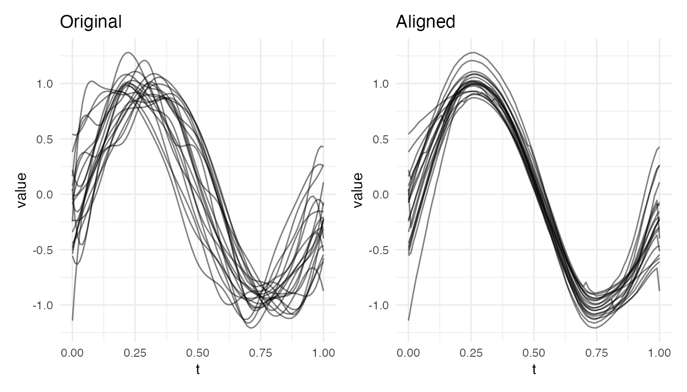

### Boundary Mismatch

When shifted curves have different values at the domain boundaries,
alignment is excellent in the interior but constrained at the edges:

``` r
set.seed(42)
n <- 15
dm <- matrix(0, n, 100)
shifts <- runif(n, -0.15, 0.15)
for (i in 1:n) dm[i, ] <- sin(2 * pi * (argvals - shifts[i]))
fd_bnd <- fdata(dm, argvals = argvals)
res_bnd <- elastic.align(fd_bnd)
vr <- 1 - mean(apply(res_bnd$aligned$data, 2, var)) /
          mean(apply(fd_bnd$data, 2, var))
cat("Boundary mismatch VR:", round(vr * 100, 1), "% — note residual spread at boundaries\n")
#> Boundary mismatch VR: 77 % — note residual spread at boundaries
```

``` r
plot(res_bnd, type = "both")
```

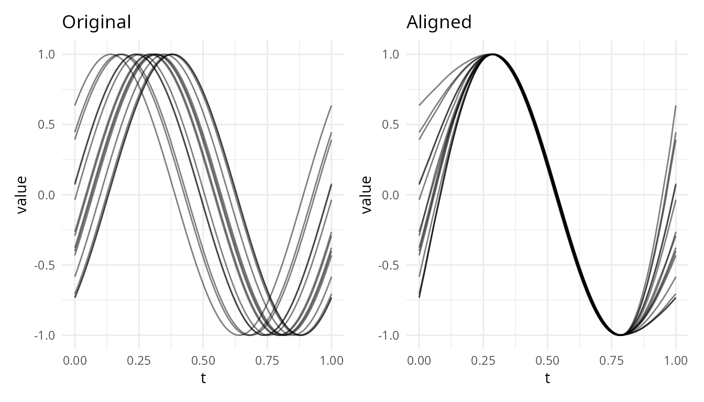

### Pure Amplitude Differences

When curves differ only in height (no phase variability), alignment
correctly produces identity warps – no benefit, but no harm:

``` r
set.seed(42)
n <- 15
dm <- matrix(0, n, 100)
for (i in 1:n) {
  amp <- runif(1, 0.5, 2.0)
  dm[i, ] <- amp * sin(2 * pi * argvals)
}
fd_amp <- fdata(dm, argvals = argvals)
res_amp <- elastic.align(fd_amp)
vr <- 1 - mean(apply(res_amp$aligned$data, 2, var)) /
          mean(apply(fd_amp$data, 2, var))
cat("Pure amplitude VR:", round(vr * 100, 1), "% — identity warps applied\n")
#> Pure amplitude VR: 0 % — identity warps applied
```

``` r
plot(res_amp, type = "both")
```

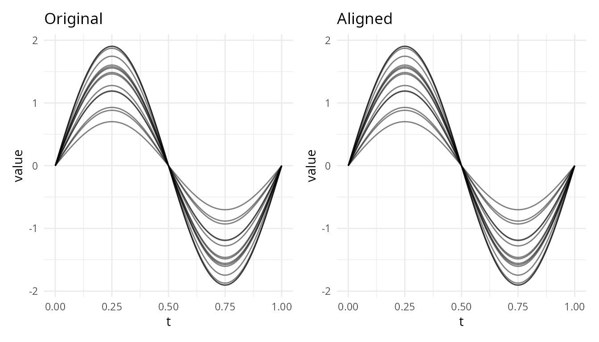

### Genuinely Different Shapes

Alignment should **not** be used when curves have fundamentally
different shapes. Forced warping produces meaningless results:

``` r
set.seed(42)
n <- 15
dm <- matrix(0, n, 100)
for (i in 1:n) {
  if (i %% 5 == 1) dm[i, ] <- sin(2 * pi * argvals)
  else if (i %% 5 == 2) dm[i, ] <- cos(6 * pi * argvals)
  else if (i %% 5 == 3) dm[i, ] <- argvals^3
  else if (i %% 5 == 4) dm[i, ] <- sin(10 * pi * argvals) * exp(-3 * argvals)
  else dm[i, ] <- dnorm(argvals, 0.5, 0.05) / dnorm(0.5, 0.5, 0.05)
}
fd_diff <- fdata(dm, argvals = argvals)
res_diff <- elastic.align(fd_diff)
vr <- 1 - mean(apply(res_diff$aligned$data, 2, var)) /
          mean(apply(fd_diff$data, 2, var))
cat("Different shapes VR:", round(vr * 100, 1), "% — forced warping of unrelated shapes\n")
#> Different shapes VR: 40.7 % — forced warping of unrelated shapes
```

``` r
plot(res_diff, type = "both")
```

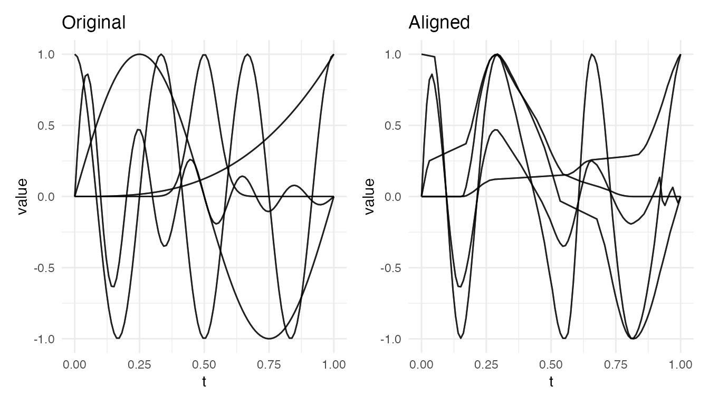

When VR is very low or negative, it indicates the data is not suitable
for elastic alignment. Use depth or distance methods instead.

## Multi-Bump Scaling

Real-world functional data often contains multiple peaks or features
that vary independently. This section explores how elastic alignment
handles curves with **varying inter-bump distance** (peaks shift
independently) and **varying bump width** (peaks broaden or narrow) as
the number of bumps increases.

### Two Bumps

With two bumps, the warping function has enough freedom to independently
adjust each peak’s position and width:

``` r
set.seed(42)
m <- 200
argvals_mb <- seq(0, 1, length.out = m)
n <- 20

# Varying inter-bump distance
data_pos <- matrix(0, n, m)
for (i in 1:n) {
  p1 <- 0.3
  p2 <- 0.7 + runif(1, -0.12, 0.12)
  data_pos[i, ] <- exp(-300 * (argvals_mb - p1)^2) +
                   exp(-300 * (argvals_mb - p2)^2)
}
fd_pos <- fdata(data_pos, argvals = argvals_mb)
res_pos <- elastic.align(fd_pos)
vr_pos <- 1 - mean(apply(res_pos$aligned$data, 2, var)) /
              mean(apply(fd_pos$data, 2, var))

# Varying bump width
data_w <- matrix(0, n, m)
for (i in 1:n) {
  w1 <- runif(1, 200, 500)
  w2 <- runif(1, 200, 500)
  data_w[i, ] <- exp(-w1 * (argvals_mb - 0.3)^2) +
                 exp(-w2 * (argvals_mb - 0.7)^2)
}
fd_w <- fdata(data_w, argvals = argvals_mb)
res_w <- elastic.align(fd_w)
vr_w <- 1 - mean(apply(res_w$aligned$data, 2, var)) /
             mean(apply(fd_w$data, 2, var))

cat("2 bumps — varying position: VR =", round(vr_pos * 100, 1), "%\n")
#> 2 bumps — varying position: VR = 100 %
cat("2 bumps — varying width:    VR =", round(vr_w * 100, 1), "%\n")
#> 2 bumps — varying width:    VR = 98.2 %
```

``` r
plot(res_pos, type = "both")
```

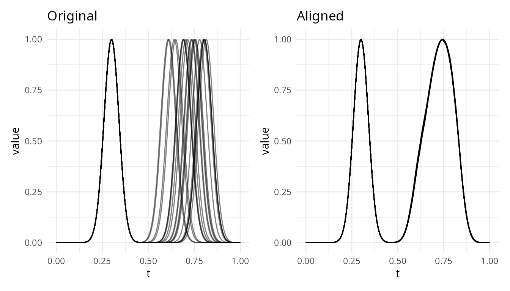

``` r
plot(res_w, type = "both")
```

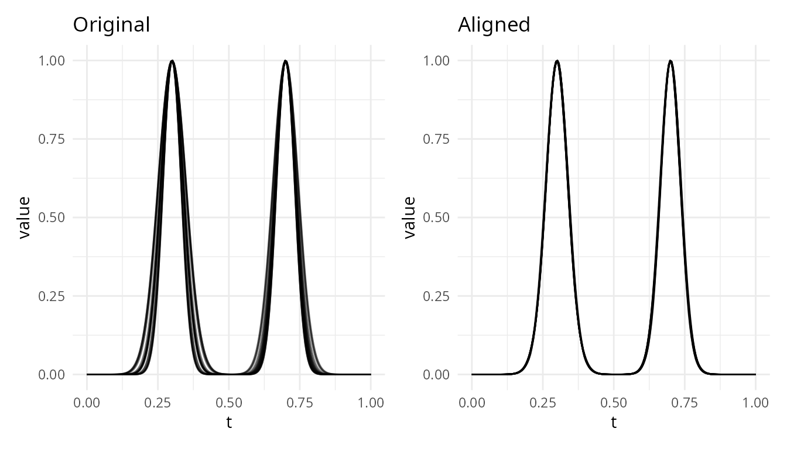

Both cases achieve near-perfect alignment. The warping function locally
stretches/compresses the region around each bump to bring peaks into
correspondence.

### Scaling to More Bumps

As the number of bumps increases, alignment becomes progressively
harder. A monotone warping function that stretches one region must
compress another, so with many tightly packed bumps the degrees of
freedom become insufficient to independently correct each peak.

``` r
set.seed(42)
results <- data.frame(
  bumps = integer(), scenario = character(), VR = numeric(),
  stringsAsFactors = FALSE
)

for (nb in c(2, 4, 5, 7)) {
  positions_base <- seq(0.1, 0.9, length.out = nb)

  # Varying positions
  data_pos <- matrix(0, n, m)
  for (i in 1:n) {
    for (j in 1:nb) {
      p <- positions_base[j] + runif(1, -0.04, 0.04)
      data_pos[i, ] <- data_pos[i, ] + exp(-300 * (argvals_mb - p)^2)
    }
  }
  fd_pos <- fdata(data_pos, argvals = argvals_mb)
  res_pos <- elastic.align(fd_pos)
  vr_pos <- 1 - mean(apply(res_pos$aligned$data, 2, var)) /
                mean(apply(fd_pos$data, 2, var))

  # Varying widths
  data_w <- matrix(0, n, m)
  for (i in 1:n) {
    for (j in 1:nb) {
      w <- runif(1, 200, 600)
      data_w[i, ] <- data_w[i, ] + exp(-w * (argvals_mb - positions_base[j])^2)
    }
  }
  fd_w <- fdata(data_w, argvals = argvals_mb)
  res_w <- elastic.align(fd_w)
  vr_w <- 1 - mean(apply(res_w$aligned$data, 2, var)) /
               mean(apply(fd_w$data, 2, var))

  # Both varying
  data_both <- matrix(0, n, m)
  for (i in 1:n) {
    for (j in 1:nb) {
      p <- positions_base[j] + runif(1, -0.04, 0.04)
      w <- runif(1, 200, 600)
      data_both[i, ] <- data_both[i, ] + exp(-w * (argvals_mb - p)^2)
    }
  }
  fd_both <- fdata(data_both, argvals = argvals_mb)
  res_both <- elastic.align(fd_both)
  vr_both <- 1 - mean(apply(res_both$aligned$data, 2, var)) /
                  mean(apply(fd_both$data, 2, var))

  results <- rbind(results, data.frame(
    bumps = rep(nb, 3),
    scenario = c("Position", "Width", "Both"),
    VR = c(vr_pos, vr_w, vr_both) * 100
  ))
}
```

``` r
# Display as a table
df_wide <- reshape(results, idvar = "bumps", timevar = "scenario",
                   direction = "wide")
names(df_wide) <- gsub("VR\\.", "", names(df_wide))
for (col in c("Position", "Width", "Both")) {
  df_wide[[col]] <- paste0(round(df_wide[[col]], 1), "%")
}
knitr::kable(df_wide, col.names = c("Bumps", "Varying Position",
             "Varying Width", "Both Varying"),
             align = "cccc",
             caption = "Variance reduction by number of bumps and variability type")
```

|     | Bumps | Varying Position | Varying Width | Both Varying |
|:----|:-----:|:----------------:|:-------------:|:------------:|
| 1   |   2   |      96.1%       |      93%      |    96.9%     |
| 4   |   4   |      97.9%       |     94.9%     |    97.4%     |
| 7   |   5   |      86.9%       |     83.7%     |    91.5%     |
| 10  |   7   |      63.5%       |     23.9%     |    61.1%     |

Variance reduction by number of bumps and variability type

### Visual Comparison: 4 vs 7 Bumps

``` r
set.seed(42)

# 4 bumps — both varying
pos4 <- seq(0.1, 0.9, length.out = 4)
data4 <- matrix(0, n, m)
for (i in 1:n) {
  for (j in 1:4) {
    p <- pos4[j] + runif(1, -0.04, 0.04)
    w <- runif(1, 200, 600)
    data4[i, ] <- data4[i, ] + exp(-w * (argvals_mb - p)^2)
  }
}
fd4 <- fdata(data4, argvals = argvals_mb)
res4 <- elastic.align(fd4)
vr4 <- 1 - mean(apply(res4$aligned$data, 2, var)) /
            mean(apply(fd4$data, 2, var))

# 7 bumps — both varying
pos7 <- seq(0.1, 0.9, length.out = 7)
data7 <- matrix(0, n, m)
for (i in 1:n) {
  for (j in 1:7) {
    p <- pos7[j] + runif(1, -0.04, 0.04)
    w <- runif(1, 200, 600)
    data7[i, ] <- data7[i, ] + exp(-w * (argvals_mb - p)^2)
  }
}
fd7 <- fdata(data7, argvals = argvals_mb)
res7 <- elastic.align(fd7)
vr7 <- 1 - mean(apply(res7$aligned$data, 2, var)) /
            mean(apply(fd7$data, 2, var))

cat("4 bumps (both varying) — VR =", round(vr4 * 100, 1), "%\n")
#> 4 bumps (both varying) — VR = 98.9 %
cat("7 bumps (both varying) — VR =", round(vr7 * 100, 1), "%\n")
#> 7 bumps (both varying) — VR = 62.1 %
```

``` r
plot(res4, type = "both")
```

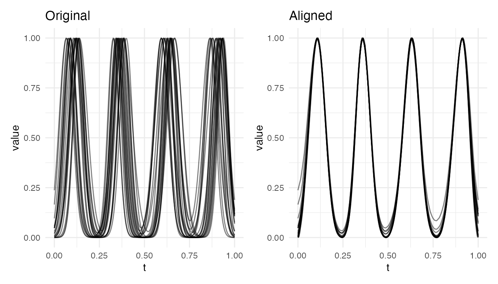

``` r
plot(res7, type = "both")
```

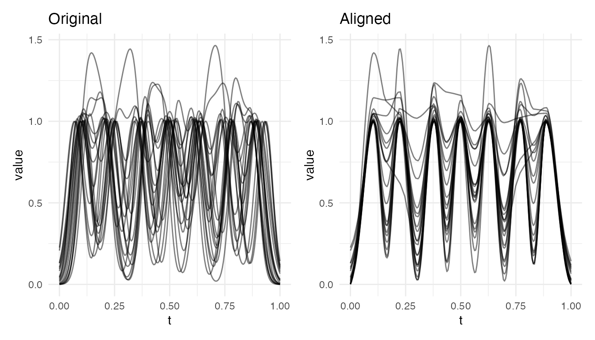

With 4 bumps, alignment still captures most of the variability. With 7
tightly packed bumps, the monotonicity constraint on the warping
function limits independent correction of each peak – stretching one
inter-peak region forces compression elsewhere. This is a fundamental
limitation of elastic alignment, not a numerical issue: a single
monotone time-warping cannot independently retime many closely spaced
features.

## Comparison with DTW and Shift Registration

Three alignment strategies are available in **fdars**:

|                     | Elastic (SRSF)                                                                   | DTW                                                                        | Shift Registration                                                           |
|:--------------------|:---------------------------------------------------------------------------------|:---------------------------------------------------------------------------|:-----------------------------------------------------------------------------|
| **Function**        | [`elastic.align()`](https://sipemu.github.io/fdars-r/reference/elastic.align.md) | [`metric.DTW()`](https://sipemu.github.io/fdars-r/reference/metric.DTW.md) | [`register.fd()`](https://sipemu.github.io/fdars-r/reference/register.fd.md) |
| **Warping**         | Smooth, monotone diffeomorphism                                                  | Piecewise constant, allows repeated indices                                | Global translation only                                                      |
| **Metric**          | Proper metric (triangle inequality holds)                                        | Not a metric                                                               | Not applicable (no warping)                                                  |
| **Amplitude/Phase** | Cleanly separates the two                                                        | Mixes them — can absorb amplitude differences into warping                 | Pure phase (shift), amplitude untouched                                      |
| **Degeneracy**      | No “pinching” — SRSF penalizes compression                                       | Can collapse entire regions to a single point                              | No degeneracy, but very limited                                              |
| **Mean**            | Karcher mean is well-defined                                                     | No principled mean                                                         | Shift-corrected cross-sectional mean                                         |
| **Complexity**      | $O\left( m^{2} \right)$ per pair (DP)                                            | $O\left( m^{2} \right)$ per pair (DP)                                      | $O(m)$ per curve (cross-correlation)                                         |

### Why Elastic Alignment Avoids Degeneracy

A key advantage of the SRSF framework is that the elastic distance
penalizes “pinching” — collapsing a region of the curve to a single
point. The SRSF of a warped function is
$(q \circ \gamma)\sqrt{\dot{\gamma}}$, so when
$\left. \dot{\gamma}\rightarrow 0 \right.$ (extreme compression), the
SRSF contribution vanishes rather than concentrating. This acts as a
natural regularizer. In contrast, DTW allows repeated indices that
effectively collapse entire regions to a single point, which can produce
degenerate alignments.

### Head-to-Head: Shifted Bumps

The clearest way to see the differences is on data with localized
features:

``` r
set.seed(42)
m_cmp <- 200
argvals_cmp <- seq(0, 1, length.out = m_cmp)
n_cmp <- 15

# Two bumps with varying positions
data_cmp <- matrix(0, n_cmp, m_cmp)
for (i in 1:n_cmp) {
  p1 <- 0.3 + runif(1, -0.06, 0.06)
  p2 <- 0.7 + runif(1, -0.06, 0.06)
  data_cmp[i, ] <- exp(-300 * (argvals_cmp - p1)^2) +
                   exp(-300 * (argvals_cmp - p2)^2)
}
fd_cmp <- fdata(data_cmp, argvals = argvals_cmp)
var_orig_cmp <- mean(apply(fd_cmp$data, 2, var))
```

**Elastic alignment** finds smooth, local warping for each bump
independently:

``` r
res_elastic <- elastic.align(fd_cmp)
vr_elastic <- 1 - mean(apply(res_elastic$aligned$data, 2, var)) / var_orig_cmp
cat("Elastic VR:", round(vr_elastic * 100, 1), "%\n")
#> Elastic VR: 100 %
```

**Shift registration** applies a single global shift – it can center one
bump but not both when they move independently:

``` r
res_shift <- register.fd(fd_cmp)
vr_shift <- 1 - mean(apply(res_shift$registered$data, 2, var)) / var_orig_cmp
cat("Shift registration VR:", round(vr_shift * 100, 1), "%\n")
#> Shift registration VR: -55.1 %
```

``` r
plot_curves <- function(data, argvals, title) {
  n <- nrow(data)
  m <- length(argvals)
  df <- data.frame(
    curve_id = rep(seq_len(n), each = m),
    argval = rep(argvals, n),
    value = as.vector(t(data))
  )
  ggplot(df, aes(x = argval, y = value, group = curve_id)) +
    geom_line(alpha = 0.5) +
    labs(title = title, x = "t", y = "value") +
    theme_minimal()
}

p1 <- plot_curves(fd_cmp$data, argvals_cmp, "Original")
p2 <- plot_curves(res_elastic$aligned$data, argvals_cmp,
        paste0("Elastic (VR = ", round(vr_elastic * 100, 1), "%)"))
p3 <- plot_curves(res_shift$registered$data, argvals_cmp,
        paste0("Shift Registration (VR = ", round(vr_shift * 100, 1), "%)"))

p1 / p2 / p3
```

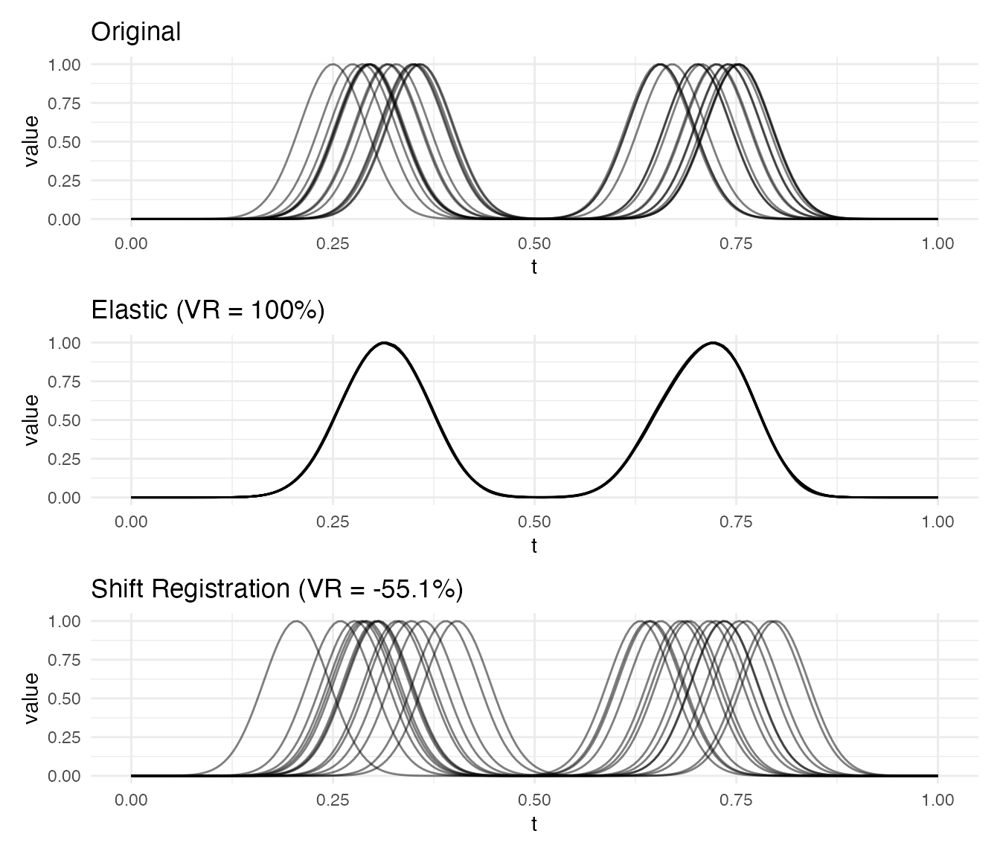

Elastic alignment resolves the independent shifts of both bumps. Shift
registration can only correct a single global offset, leaving residual
phase variability when features move independently.

### DTW Distance vs Elastic Distance

DTW and elastic distances rank curves differently because DTW can absorb
amplitude differences into warping while elastic alignment separates
them:

``` r
# Compute both distance matrices
D_elastic <- elastic.distance(fd_cmp)
D_dtw <- metric.DTW(fd_cmp)

# Compare: correlation of off-diagonal entries
idx <- upper.tri(D_elastic)
cat("Correlation between elastic and DTW distances:",
    round(cor(D_elastic[idx], D_dtw[idx]), 3), "\n")
#> Correlation between elastic and DTW distances: 0.895
```

``` r
df_ed <- data.frame(elastic = D_elastic[idx], dtw = D_dtw[idx])
ggplot(df_ed, aes(x = elastic, y = dtw)) +
  geom_point(color = "steelblue", size = 1, alpha = 0.7) +
  geom_smooth(method = "lm", se = FALSE, color = "red", linewidth = 1.5) +
  labs(title = "Elastic vs DTW Pairwise Distances",
       x = "Elastic distance", y = "DTW distance") +
  theme_minimal()
#> `geom_smooth()` using formula = 'y ~ x'
```

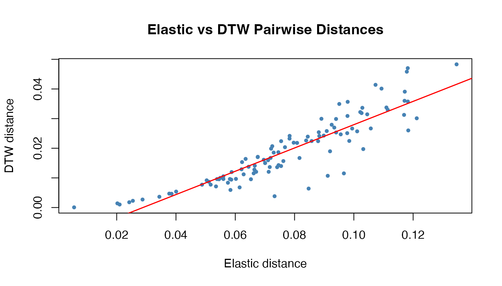

The distances are correlated but not identical. The key difference
emerges when amplitude variability is present:

``` r
set.seed(42)
# Curves with BOTH amplitude and phase variability
data_amp <- matrix(0, n_cmp, m_cmp)
for (i in 1:n_cmp) {
  amp <- runif(1, 0.5, 1.5)
  shift <- runif(1, -0.06, 0.06)
  data_amp[i, ] <- amp * exp(-200 * (argvals_cmp - 0.5 - shift)^2)
}
fd_amp <- fdata(data_amp, argvals = argvals_cmp)

D_elastic_amp <- elastic.distance(fd_amp)
D_dtw_amp <- metric.DTW(fd_amp)
idx_amp <- upper.tri(D_elastic_amp)

cat("Correlation (amplitude+phase):",
    round(cor(D_elastic_amp[idx_amp], D_dtw_amp[idx_amp]), 3), "\n")
#> Correlation (amplitude+phase): 0.929
```

With mixed amplitude and phase, DTW distances are less correlated with
elastic distances because DTW warping partially absorbs amplitude
differences. Elastic distances preserve the amplitude/phase separation,
making them more suitable for downstream analysis (clustering, MDS) when
both sources of variability carry distinct meaning.

### When to Use Each Method

| Scenario                                          | Recommended                                                                                        |
|:--------------------------------------------------|:---------------------------------------------------------------------------------------------------|
| Localized features with independent timing shifts | Elastic alignment                                                                                  |
| Simple global time shift or delay                 | Shift registration (`register.fd`) — fast and sufficient                                           |
| Distance computation for clustering/MDS           | Elastic distance (proper metric) or DTW (if metric property not needed)                            |
| Noisy signals, speech-like data                   | DTW (more robust to noise without pre-smoothing)                                                   |
| Periodic/circular data                            | `elastic.align(periodic = TRUE)`                                                                   |
| Need principled mean shape                        | [`karcher.mean()`](https://sipemu.github.io/fdars-r/reference/karcher.mean.md) (no DTW equivalent) |

## Periodic Functional Data

### The Problem

Elastic alignment uses fixed boundary constraints $\gamma(0) = 0$,
$\gamma(1) = 1$. This prevents the warping function from performing
circular shifts, which means periodic data (e.g., curves on
$\lbrack 0,2\pi\rbrack$ where $f(0) = f(2\pi)$) with large phase offsets
cannot be properly aligned.

For example, two copies of $\sin(t)$ shifted by half a period have
identical shape but the boundary constraints force alignment to fail:

``` r
set.seed(42)
m <- 100
argvals_p <- seq(0, 2 * pi, length.out = m)
n <- 15
data_p <- matrix(0, n, m)
for (i in 1:n) {
  shift <- sample(0:(m - 1), 1)
  idx <- ((seq_len(m) - 1L + shift) %% m) + 1L
  data_p[i, ] <- sin(argvals_p[idx])
}
fd_p <- fdata(data_p, argvals = argvals_p)

# Standard alignment struggles with circular shifts
res_std <- elastic.align(fd_p)
var_orig <- mean(apply(fd_p$data, 2, var))
vr_std <- 1 - mean(apply(res_std$aligned$data, 2, var)) / var_orig
cat("Standard alignment on periodic data — VR:", round(vr_std * 100, 1), "%\n")
#> Standard alignment on periodic data — VR: 66.6 %
```

``` r
plot(res_std, type = "both")
```

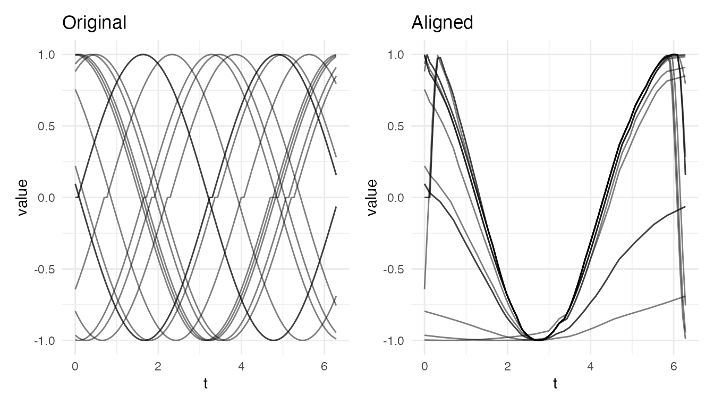

### The Solution

Setting `periodic = TRUE` applies a two-stage approach:

1.  **Circular rotation**: For each curve, find the position of the
    global maximum. Circularly shift the curve so that this maximum
    lands at a fixed canonical grid position (by default, one quarter of
    the domain). The shift for curve $i$ is simply
    `which.max(f_i) - target_pos`. This is a deterministic, fast
    heuristic – no optimisation is involved.
2.  **Elastic alignment**: Standard boundary-constrained alignment on
    the rotated data, correcting any remaining timing differences.

**Caveat**: The rotation heuristic relies on a single dominant peak. If
curves have multiple peaks of similar height, `which.max` may select
different peaks for different curves, producing inconsistent rotations.
In such cases, you may need to supply a custom `target.pos` to
[`periodic.rotate()`](https://sipemu.github.io/fdars-r/reference/periodic.rotate.md),
or pre-process the data to ensure a consistent landmark is the global
maximum.

``` r
res_per <- elastic.align(fd_p, periodic = TRUE)
vr_per <- 1 - mean(apply(res_per$aligned$data, 2, var)) / var_orig
cat("Periodic alignment — VR:", round(vr_per * 100, 1), "%\n")
#> Periodic alignment — VR: 100 %
```

``` r
plot(res_per, type = "both")
```

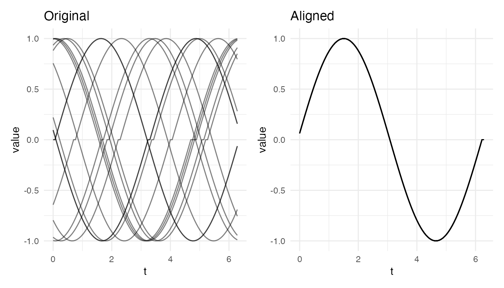

The rotation step removes large circular shifts that the
boundary-constrained warping cannot handle, and the elastic step
corrects any remaining timing differences.

### What Happens to the Warping Functions?

Comparing the warping functions from standard vs periodic alignment
reveals why the standard approach fails. Let’s look at the warping
functions side by side, and inspect the warping speed:

``` r
p_warp_std <- plot(res_std, type = "warps") +
  labs(title = "Standard: warping functions")
p_warp_per <- plot(res_per, type = "warps") +
  labs(title = "Periodic: warping functions")
p_warp_std + p_warp_per
```

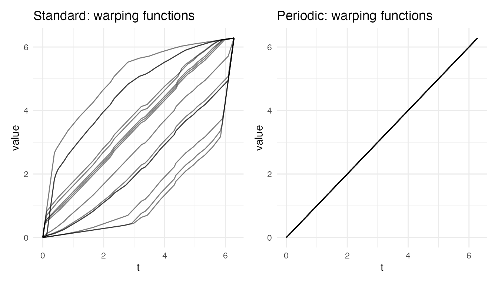

The standard warps are forced through $(0,0)$ and $(2\pi,2\pi)$. When
the true offset is a large circular shift, the warp must bend
drastically to compensate, producing extreme stretching in some regions
and compression in others. The periodic warps are much closer to the
identity because the circular rotation has already removed most of the
phase offset.

We can quantify this by looking at the warping speed $\dot{\gamma}(t)$
via [`deriv()`](https://sipemu.github.io/fdars-r/reference/deriv.md):

``` r
speed_std <- deriv(res_std$gammas)
speed_per <- deriv(res_per$gammas)

cat("Standard alignment — warping speed range:",
    round(min(speed_std$data), 2), "to", round(max(speed_std$data), 2), "\n")
#> Standard alignment — warping speed range: 0.14 to 7
cat("Periodic alignment — warping speed range:",
    round(min(speed_per$data), 2), "to", round(max(speed_per$data), 2), "\n")
#> Periodic alignment — warping speed range: 1 to 1
```

``` r
n_std <- nrow(speed_std$data)
m_std <- ncol(speed_std$data)
df_speed_std <- data.frame(
  t = rep(speed_std$argvals, n_std),
  speed = as.vector(t(speed_std$data)),
  curve = rep(seq_len(n_std), each = m_std)
)
n_per <- nrow(speed_per$data)
m_per <- ncol(speed_per$data)
df_speed_per <- data.frame(
  t = rep(speed_per$argvals, n_per),
  speed = as.vector(t(speed_per$data)),
  curve = rep(seq_len(n_per), each = m_per)
)

p_sp_std <- ggplot(df_speed_std, aes(x = t, y = speed, group = curve)) +
  geom_hline(yintercept = 1, linetype = "dashed", color = "grey60") +
  geom_line(alpha = 0.3, color = "coral") +
  labs(title = "Standard: warping speed", x = "t",
       y = expression(dot(gamma)(t)))

p_sp_per <- ggplot(df_speed_per, aes(x = t, y = speed, group = curve)) +
  geom_hline(yintercept = 1, linetype = "dashed", color = "grey60") +
  geom_line(alpha = 0.3, color = "steelblue") +
  coord_cartesian(ylim = range(df_speed_std$speed)) +
  labs(title = "Periodic: warping speed", x = "t",
       y = expression(dot(gamma)(t)))

p_sp_std + p_sp_per
```

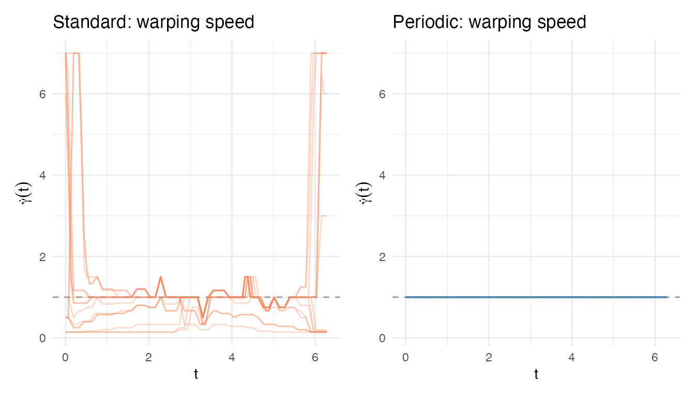

The standard warping speeds swing wildly (extreme stretching and
compression), while the periodic warping speeds stay close to 1 (the
identity). This illustrates the benefit of the two-stage periodic
approach: the rotation handles the gross circular shift, leaving only
minor residual timing differences for the elastic alignment to correct.

Let’s examine one curve in detail to see the full decomposition – the
circular rotation followed by the residual elastic warp:

``` r
# Pick the curve with the largest rotation shift
rot <- periodic.rotate(fd_p)
i_max <- which.max(abs(rot$shifts))
shift_amount <- rot$shifts[i_max]

# Three stages: original, after rotation, after alignment
f_orig <- as.numeric(fd_p$data[i_max, ])
f_rotated <- as.numeric(rot$fdataobj$data[i_max, ])
f_aligned <- as.numeric(res_per$aligned$data[i_max, ])
f_target <- as.numeric(res_per$target)

# Panel 1: the three curve stages
df_stages <- data.frame(
  t = rep(argvals_p, 4),
  value = c(f_orig, f_rotated, f_aligned, f_target),
  stage = rep(c("1. Original", "2. After rotation", "3. After alignment",
                "Target"), each = m)
)

p1 <- ggplot(df_stages, aes(x = t, y = value, color = stage,
                             linetype = stage)) +
  geom_line(linewidth = 0.9) +
  scale_color_manual(values = c("1. Original" = "coral",
                                "2. After rotation" = "goldenrod",
                                "3. After alignment" = "steelblue",
                                "Target" = "grey30")) +
  scale_linetype_manual(values = c("1. Original" = "solid",
                                   "2. After rotation" = "solid",
                                   "3. After alignment" = "solid",
                                   "Target" = "dashed")) +
  labs(title = paste0("Curve ", i_max, ": two-stage periodic alignment",
                      " (rotation = ", shift_amount, " grid points)"),
       x = "t", y = "value", color = NULL, linetype = NULL) +
  theme(legend.position = "top")

# Panel 2: warping function (standard vs periodic)
gamma_std <- as.numeric(res_std$gammas$data[i_max, ])
gamma_per <- as.numeric(res_per$gammas$data[i_max, ])
df_warps <- data.frame(
  t = rep(argvals_p, 2),
  gamma = c(gamma_std, gamma_per),
  method = rep(c("Standard", "Periodic"), each = m)
)

p2 <- ggplot(df_warps, aes(x = t, y = gamma, color = method)) +
  geom_abline(slope = 1, intercept = 0, linetype = "dashed", color = "grey60") +
  geom_line(linewidth = 1) +
  scale_color_manual(values = c(Standard = "coral", Periodic = "steelblue")) +
  labs(title = "Warping function: standard vs periodic",
       x = "t", y = expression(gamma(t)), color = NULL) +
  theme(legend.position = "top")

# Panel 3: warping speed comparison
speed_std_i <- as.numeric(deriv(res_std$gammas)$data[i_max, ])
speed_per_i <- as.numeric(deriv(res_per$gammas)$data[i_max, ])
df_sp <- data.frame(
  t = rep(deriv(res_per$gammas)$argvals, 2),
  speed = c(speed_std_i, speed_per_i),
  method = rep(c("Standard", "Periodic"), each = length(speed_per_i))
)

p3 <- ggplot(df_sp, aes(x = t, y = speed, color = method)) +
  geom_hline(yintercept = 1, linetype = "dashed", color = "grey60") +
  geom_line(linewidth = 0.8) +
  scale_color_manual(values = c(Standard = "coral", Periodic = "steelblue")) +
  labs(title = "Local warping speed: deriv(gammas)",
       x = "t", y = expression(dot(gamma)(t)), color = NULL) +
  theme(legend.position = "top")

p1 / p2 / p3
```

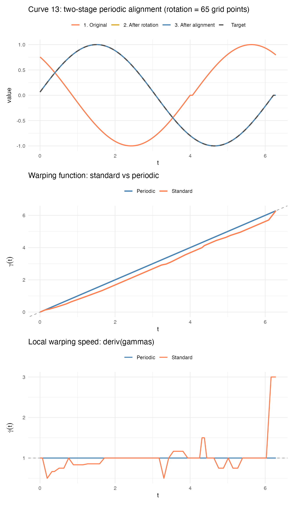

The three panels show the full story for this curve:

1.  **Top**: The original curve (coral) is circularly shifted far from
    the target. Rotation (gold) brings it close; the residual elastic
    warp (blue) finishes the job.
2.  **Middle**: The standard warping function (coral) deviates wildly
    from the diagonal because it must encode a large circular shift as a
    boundary- constrained warp. The periodic warping function (blue)
    stays near the identity.
3.  **Bottom**: The standard warp speed swings between extreme
    compression and stretching. The periodic warp speed is nearly
    constant at 1.

### Where Did the Shift Go?

Notice that the periodic warping function is nearly the identity – it
does **not** show the large circular shift visible in the original data.
This is because the shift was already removed by
[`periodic.rotate()`](https://sipemu.github.io/fdars-r/reference/periodic.rotate.md)
*before* the elastic alignment runs. The total phase correction in the
periodic approach is decomposed into two pieces:

1.  **Circular rotation** (stored in `res_per$rotations`) – the gross
    shift, measured in grid points
2.  **Elastic warp** (stored in `res_per$gammas`) – the residual
    fine-tuning

You can inspect both:

``` r
cat("Curve", i_max, "phase decomposition:\n")
#> Curve 13 phase decomposition:
cat("  Circular rotation:", res_per$rotations[i_max], "grid points (",
    round(res_per$rotations[i_max] / m * 2 * pi, 2), "radians)\n")
#>   Circular rotation: 65 grid points ( 4.08 radians)
warp_deviation <- as.numeric(res_per$gammas$data[i_max, ]) - argvals_p
cat("  Residual warp: mean |gamma(t) - t| =",
    round(mean(abs(warp_deviation)), 4), "\n")
#>   Residual warp: mean |gamma(t) - t| = 0
```

This decomposition is the key difference from the non-periodic case. In
the Quick Start example, the warping function had to absorb the *entire*
shift, producing a visible deviation from the diagonal. Here, the
rotation absorbs the gross shift, and the warping function only encodes
what’s left.

### Alternative Rotation Methods

The default `"peak"` rotation uses `which.max` to locate each curve’s
global maximum and shift it to a canonical position. This is fast but
fragile when curves have **multiple peaks of similar height** –
`which.max` may pick different peaks for different curves, producing
inconsistent rotations.

Three additional methods are available via the `method` argument to
[`periodic.rotate()`](https://sipemu.github.io/fdars-r/reference/periodic.rotate.md)
(and via `rotate.method` in
[`elastic.align()`](https://sipemu.github.io/fdars-r/reference/elastic.align.md)
and
[`karcher.mean()`](https://sipemu.github.io/fdars-r/reference/karcher.mean.md)):

#### Cross-correlation (`method = "xcorr"`)

Cross-correlation finds the circular shift that best aligns each curve
to a reference, using all features simultaneously rather than a single
landmark. This is robust to multi-peak shapes:

``` r
# Multi-peak curves where peak method fails
set.seed(42)
base_multi <- sin(argvals_p) + 0.95 * sin(2 * argvals_p + 0.3)
n_multi <- 12
data_multi <- matrix(0, n_multi, m)
for (i in 1:n_multi) {
  shift <- sample(0:(m - 1), 1)
  idx <- ((seq_len(m) - 1L + shift) %% m) + 1L
  data_multi[i, ] <- base_multi[idx]
}
fd_multi <- fdata(data_multi, argvals = argvals_p)

rot_peak <- periodic.rotate(fd_multi, method = "peak")
rot_xcorr <- periodic.rotate(fd_multi, method = "xcorr")

# Compare variance reduction
var_orig <- mean(apply(fd_multi$data, 2, var))
vr_peak <- 1 - mean(apply(rot_peak$fdataobj$data, 2, var)) / var_orig
vr_xcorr <- 1 - mean(apply(rot_xcorr$fdataobj$data, 2, var)) / var_orig
cat("Multi-peak rotation VR — peak:", round(vr_peak * 100, 1), "%,",
    "xcorr:", round(vr_xcorr * 100, 1), "%\n")
#> Multi-peak rotation VR — peak: 100 %, xcorr: 100 %
```

``` r
p_peak <- plot(rot_peak$fdataobj) + labs(title = "Peak rotation")
p_xcorr <- plot(rot_xcorr$fdataobj) + labs(title = "Cross-correlation rotation")
p_peak + p_xcorr
```

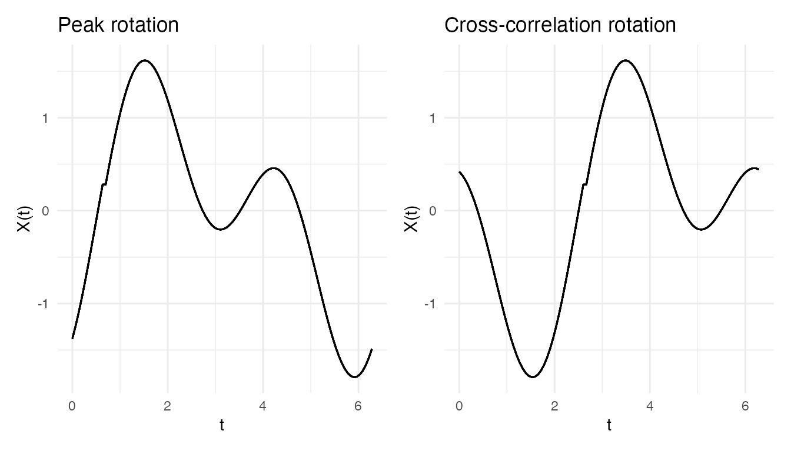

The cross-correlation method aligns curves coherently because it matches
the **entire shape** rather than a single point. You can supply a custom
reference via the `reference` argument; by default it uses the
cross-sectional mean.

#### Landmark-based (`method = "landmark"`)

The landmark method generalises the peak approach: instead of
`which.max`, you supply any function that locates a feature of interest.
For example, a “steepest rise” function finds the point of maximum first
derivative:

``` r
steepest_rise <- function(curve) {
  diffs <- diff(curve)
  which.max(diffs)
}

rot_lm <- periodic.rotate(fd_p, method = "landmark",
                           landmark.func = steepest_rise)
cat("Landmark shifts:", rot_lm$shifts, "\n")
#> Landmark shifts: 28 12 52 3 -23 59 28 30 53 6 -23 -12 40 57 51
```

This is useful when the relevant feature isn’t the peak but some other
characteristic point – a zero crossing, the start of a rise, etc.

#### Iterative (`method = "iterative"`)

The iterative method alternates between cross-correlation rotation and
elastic alignment. This handles cases where the optimal rotation depends
on the alignment and vice versa:

``` r
rot_iter <- periodic.rotate(fd_p, method = "iterative", max.iter = 5)
cat("Iterative shifts:", rot_iter$shifts, "\n")
#> Iterative shifts: 82 66 6 57 31 13 82 84 7 60 31 42 94 11 5
```

The iterative approach converges when no further shifts are needed (all
lags become zero). It is the most expensive method but can improve
results when curves have complex shapes.

#### When to Use Each Method

| Method        | Best for                                             | Cost                 |
|---------------|------------------------------------------------------|----------------------|
| `"peak"`      | Single dominant peak, fast pre-screening             | O(m) per curve       |
| `"xcorr"`     | Multi-peak curves, noisy data                        | O(m log m) per curve |
| `"landmark"`  | Domain-specific features (zero crossing, onset)      | O(m) per curve       |
| `"iterative"` | Complex shapes where rotation and alignment interact | O(m log m) × iters   |

You can pass the rotation method through to
[`elastic.align()`](https://sipemu.github.io/fdars-r/reference/elastic.align.md)
and
[`karcher.mean()`](https://sipemu.github.io/fdars-r/reference/karcher.mean.md)
via the `rotate.method` parameter:

``` r
res_xcorr <- elastic.align(fd_multi, periodic = TRUE, rotate.method = "xcorr")
print(res_xcorr)
#> Elastic Alignment
#>   Curves: 12 x 100 grid points
#>   Mean elastic distance: 0 
#>   Periodic: TRUE (method: xcorr )
```

You can also apply the rotation step manually using
[`periodic.rotate()`](https://sipemu.github.io/fdars-r/reference/periodic.rotate.md):

``` r
rot <- periodic.rotate(fd_p)
cat("Shifts applied:", rot$shifts, "\n")
#> Shifts applied: 53 37 -23 28 2 -16 53 55 -22 31 2 13 65 -18 -24
```

The
[`karcher.mean()`](https://sipemu.github.io/fdars-r/reference/karcher.mean.md)
function also accepts `periodic = TRUE`:

``` r
km_per <- karcher.mean(fd_p, max.iter = 15, periodic = TRUE)
print(km_per)
#> Karcher Mean (Elastic)
#>   Curves: 15 x 100 grid points
#>   Iterations: 1 
#>   Converged: TRUE 
#>   Periodic: TRUE (method: peak )
```

## Real Data: Berkeley Growth Velocity

For a full worked example applying elastic alignment, Karcher mean,
FPCA, and equivalence testing to the Berkeley Growth Study data, see
[`vignette("articles/example-berkeley-growth")`](https://sipemu.github.io/fdars-r/articles/example-berkeley-growth.md).

## Practical Tips

### Pre-smooth Noisy Data

The SRSF transform involves derivatives, so noise gets amplified. Always
smooth noisy data before alignment:

``` r
set.seed(42)
noisy <- matrix(0, 15, 100)
shifts <- runif(15, -0.1, 0.1)
for (i in 1:15) {
  noisy[i, ] <- sin(2 * pi * (argvals - shifts[i])) + rnorm(100, sd = 0.15)
}
fd_noisy <- fdata(noisy, argvals = argvals)

# Smooth with B-spline basis
coefs <- fdata2basis(fd_noisy, nbasis = 15, type = "bspline")
fd_smooth <- basis2fdata(coefs, argvals)

var_before <- mean(apply(fd_noisy$data, 2, var))

# Align raw vs smoothed
res_raw <- elastic.align(fd_noisy)
res_smooth <- elastic.align(fd_smooth)

vr_raw <- 1 - mean(apply(res_raw$aligned$data, 2, var)) / var_before
vr_smooth <- 1 - mean(apply(res_smooth$aligned$data, 2, var)) / var_before
cat("VR (raw):     ", round(vr_raw * 100, 1), "%\n")
#> VR (raw):      47.5 %
cat("VR (smoothed):", round(vr_smooth * 100, 1), "%\n")
#> VR (smoothed): 81.7 %
```

### Use Sufficient Grid Resolution

The dynamic programming alignment operates on the evaluation grid. Finer
grids yield more accurate warping:

``` r
set.seed(42)
for (m in c(20, 50, 100, 200)) {
  av <- seq(0, 1, length.out = m)
  shifts <- runif(15, -0.1, 0.1)
  dm <- matrix(0, 15, m)
  for (i in 1:15) dm[i, ] <- sin(2 * pi * (av - shifts[i]))
  fd_m <- fdata(dm, argvals = av)
  ea <- elastic.align(fd_m)
  var_red <- 1 - mean(apply(ea$aligned$data, 2, var)) /
                  mean(apply(fd_m$data, 2, var))
  cat(sprintf("  m = %3d: VR = %5.1f%%\n", m, var_red * 100))
}
#>   m =  20: VR =  62.7%
#>   m =  50: VR =  73.9%
#>   m = 100: VR =  76.4%
#>   m = 200: VR =  77.2%
```

A minimum of 50-100 grid points is recommended.

### Choose an Appropriate Target

The target curve affects alignment quality. Three options:

| Target                         | When to use                              |
|:-------------------------------|:-----------------------------------------|
| Cross-sectional mean (default) | General-purpose; robust with many curves |
| Deepest curve                  | When outliers may distort the mean       |
| Known reference                | When aligning to a standard template     |

``` r
set.seed(42)
shifts <- runif(15, -0.1, 0.1)
dm <- matrix(0, 15, 100)
for (i in 1:15) dm[i, ] <- sin(2 * pi * (argvals - shifts[i]))
fd <- fdata(dm, argvals = argvals)
var_before <- mean(apply(fd$data, 2, var))

# Default (cross-sectional mean)
vr1 <- 1 - mean(apply(elastic.align(fd)$aligned$data, 2, var)) / var_before

# Deepest curve
depths <- depth(fd, method = "FM")
vr2 <- 1 - mean(apply(elastic.align(fd, target = fd[which.max(depths)])$aligned$data, 2, var)) / var_before

cat("Cross-sectional mean: VR =", round(vr1 * 100, 1), "%\n")
#> Cross-sectional mean: VR = 75.9 %
cat("Deepest curve:        VR =", round(vr2 * 100, 1), "%\n")
#> Deepest curve:        VR = 75.7 %
```

### Alignment + FPCA

Alignment before FPCA concentrates variance into the first principal
component by removing phase variability that would otherwise spread
across components:

``` r
set.seed(42)
shifts <- runif(15, -0.1, 0.1)
dm <- matrix(0, 15, 100)
for (i in 1:15) dm[i, ] <- sin(2 * pi * (argvals - shifts[i]))
fd <- fdata(dm, argvals = argvals)

# FPCA before and after alignment
pc_before <- fdata2pc(fd, ncomp = 3)
ea <- elastic.align(fd)
pc_after <- fdata2pc(ea$aligned, ncomp = 3)

pve_before <- round(pc_before$d^2 / sum(pc_before$d^2) * 100, 1)
pve_after <- round(pc_after$d^2 / sum(pc_after$d^2) * 100, 1)

cat("Before alignment: PC1 =", pve_before[1], "%, PC2 =", pve_before[2], "%\n")
#> Before alignment: PC1 = 97.8 %, PC2 = 2.2 %
cat("After alignment:  PC1 =", pve_after[1], "%, PC2 =", pve_after[2], "%\n")
#> After alignment:  PC1 = 99.1 %, PC2 = 0.7 %
```

## Limitations

### Fixed Boundary Conditions

Warping functions are constrained to $\gamma(0) = 0$ and
$\gamma(1) = 1$. This means the alignment cannot correct mismatches at
the domain boundaries. For shifted curves, the residual at the boundary
equals the value difference:

``` r
f1 <- sin(2 * pi * argvals)
f2 <- sin(2 * pi * (argvals - 0.1))

fd2 <- fdata(rbind(f1, f2), argvals = argvals)
ea <- elastic.align(fd2)

# Boundary residual = |sin(0) - sin(-0.2*pi)| = 0.588
cat("Boundary gap:          ", round(abs(f2[1] - f1[1]), 3), "\n")
#> Boundary gap:           0.588
cat("Max aligned difference:", round(max(abs(ea$aligned$data[1, ] - ea$aligned$data[2, ])), 3), "\n")
#> Max aligned difference: 0.588
cat("Interior max diff:     ", round(max(abs(ea$aligned$data[1, 10:90] - ea$aligned$data[2, 10:90])), 3), "\n")
#> Interior max diff:      0.339
```

The interior alignment is excellent even when boundaries cannot be
corrected.

### Amplitude-Only Differences

When curves differ only in amplitude (e.g., $f$ vs $2f$), alignment
correctly produces identity warping – no spurious time distortion:

``` r
f1 <- sin(2 * pi * argvals)
f2 <- 2 * sin(2 * pi * argvals)
fd_amp <- fdata(rbind(f1, f2), argvals = argvals)
res_amp <- elastic.align(fd_amp)

max_warp_dev <- max(abs(res_amp$gammas$data -
                        matrix(argvals, 2, 100, byrow = TRUE)))
cat("Max warp deviation from identity:", max_warp_dev, "\n")
#> Max warp deviation from identity: 0
```

This is the correct behavior: amplitude differences should not produce
warping. However, when both amplitude and phase variability are present,
the phase correction may be partial – alignment focuses on phase and
leaves amplitude untouched.

### Domain Independence

The alignment works correctly on any domain, not just
$\lbrack 0,1\rbrack$:

``` r
for (domain in list(c(0, 1), c(0, 2*pi), c(0, 10), c(-1, 1))) {
  av <- seq(domain[1], domain[2], length.out = 100)
  range <- domain[2] - domain[1]
  dm <- matrix(0, 10, 100)
  set.seed(42)
  for (i in 1:10) {
    shift <- runif(1, -0.1 * range, 0.1 * range)
    dm[i, ] <- sin(2 * pi * (av - shift) / range)
  }
  fd <- fdata(dm, argvals = av)
  ea <- elastic.align(fd)
  var_red <- 1 - mean(apply(ea$aligned$data, 2, var)) /
                 mean(apply(fd$data, 2, var))
  cat(sprintf("  [%g, %g]: VR = %.1f%%\n", domain[1], domain[2], var_red * 100))
}
#>   [0, 1]: VR = 76.1%
#>   [0, 6.28319]: VR = 76.1%
#>   [0, 10]: VR = 76.1%
#>   [-1, 1]: VR = 76.1%
```

## References

- Srivastava, A., Klassen, E., Joshi, S.H., and Jermyn, I.H. (2011).
  Shape analysis of elastic curves in Euclidean spaces. *IEEE
  Transactions on Pattern Analysis and Machine Intelligence*,
  33(7):1415–1428.
- Tucker, J.D., Wu, W., and Srivastava, A. (2013). Generative models for
  functional data using phase and amplitude separation. *Computational
  Statistics & Data Analysis*, 61:50–66.
- Srivastava, A. and Klassen, E. (2016). *Functional and Shape Data
  Analysis*. Springer.
