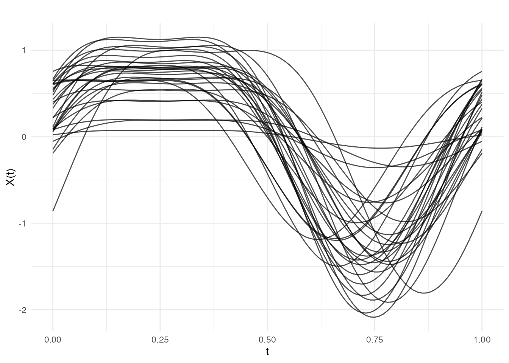
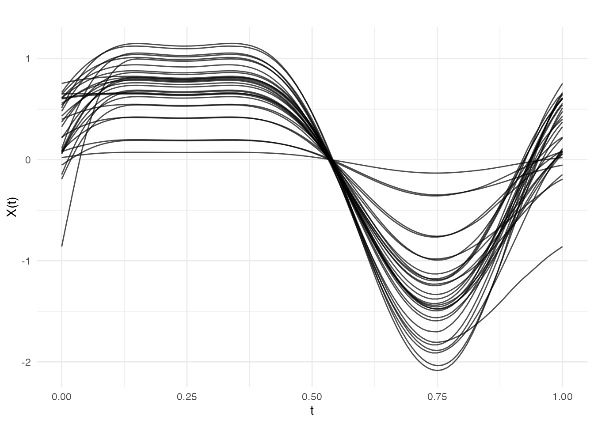
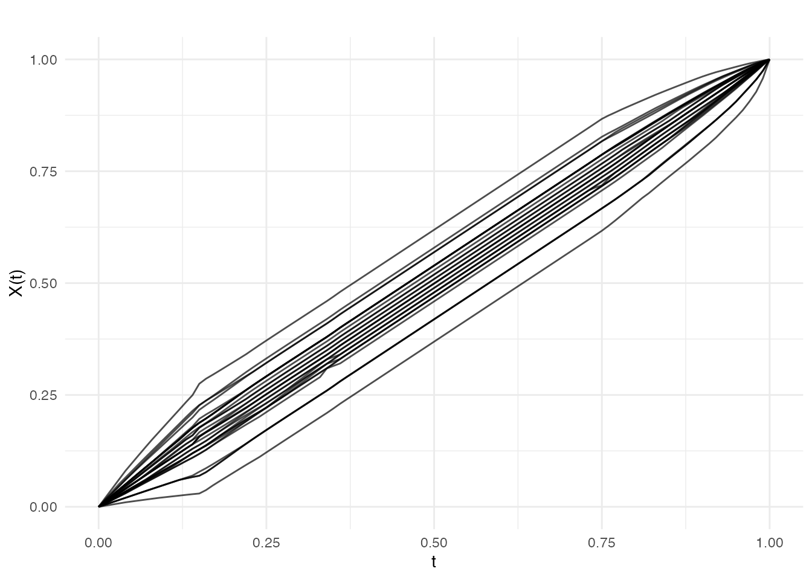
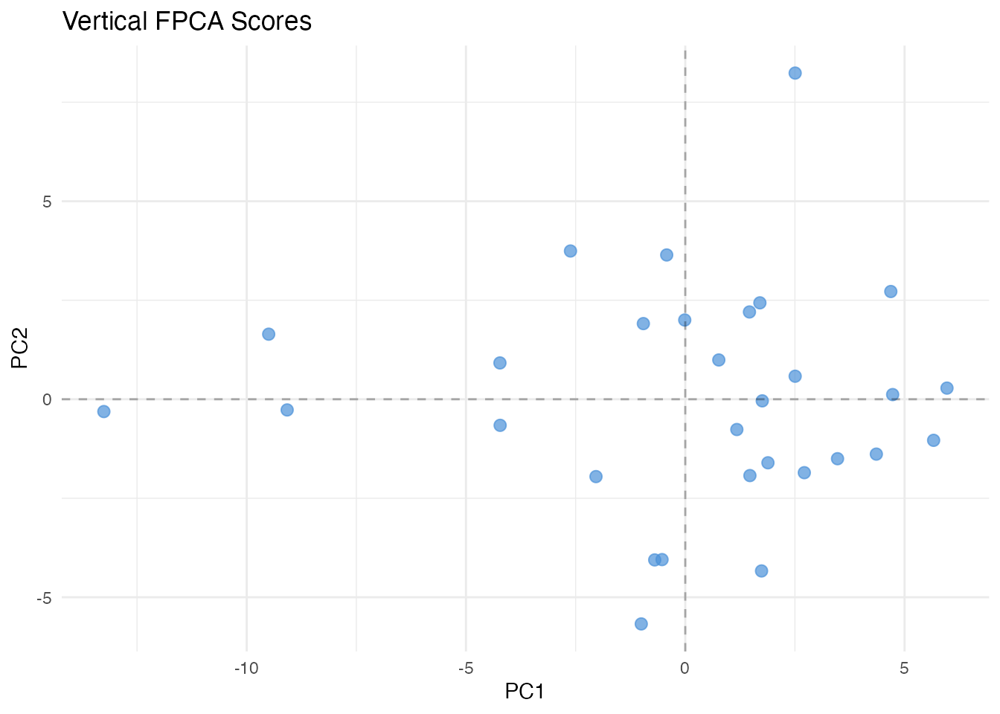
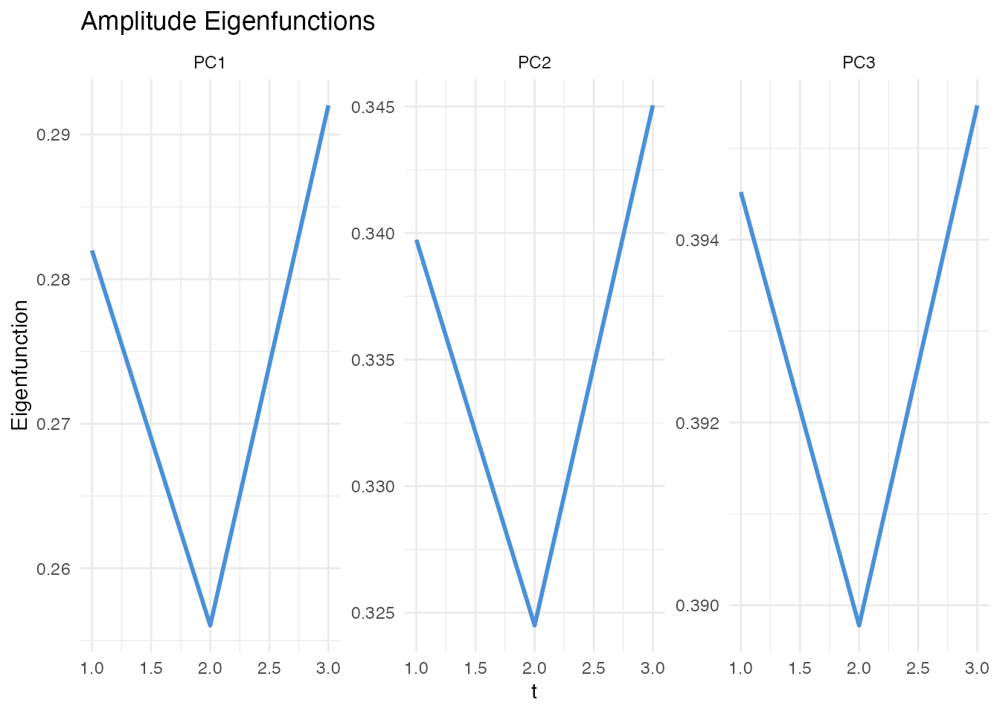
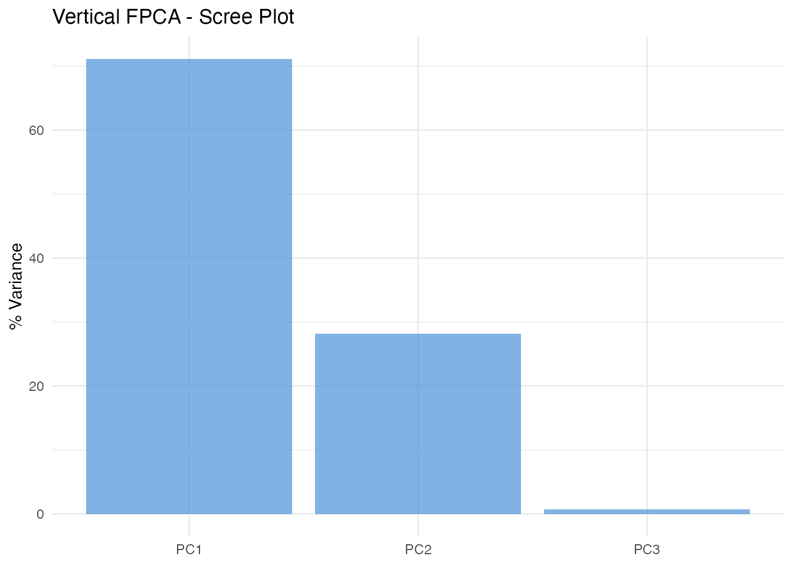
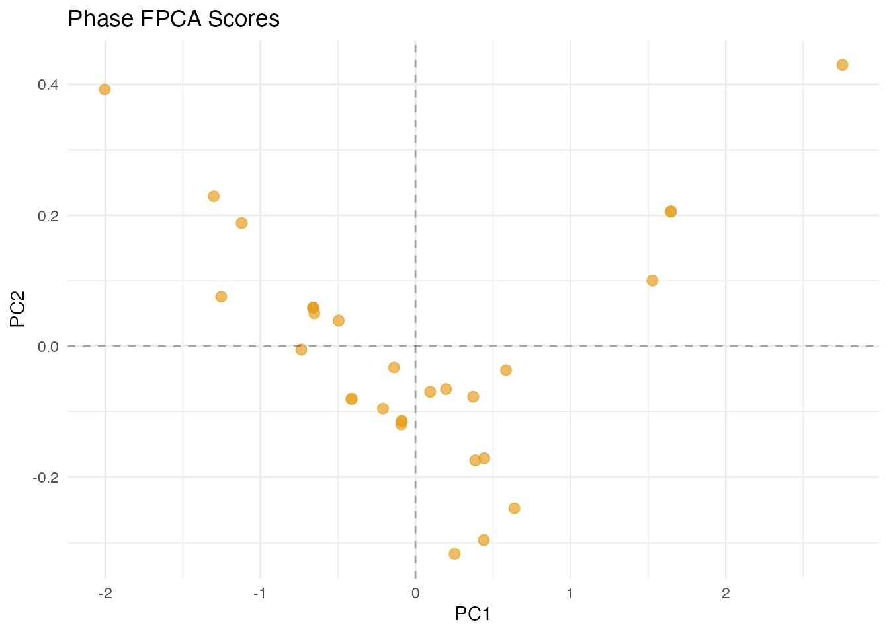
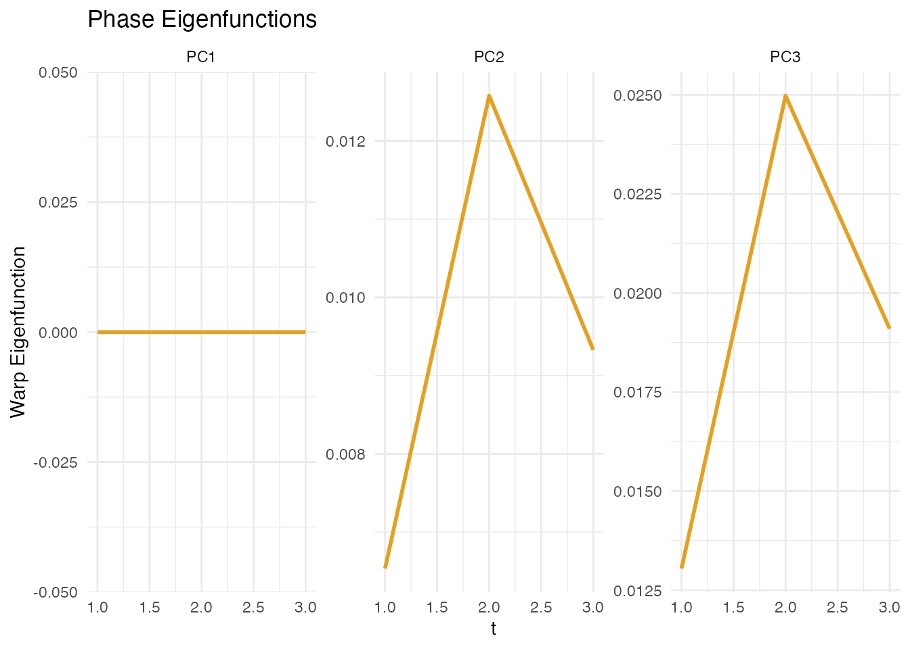
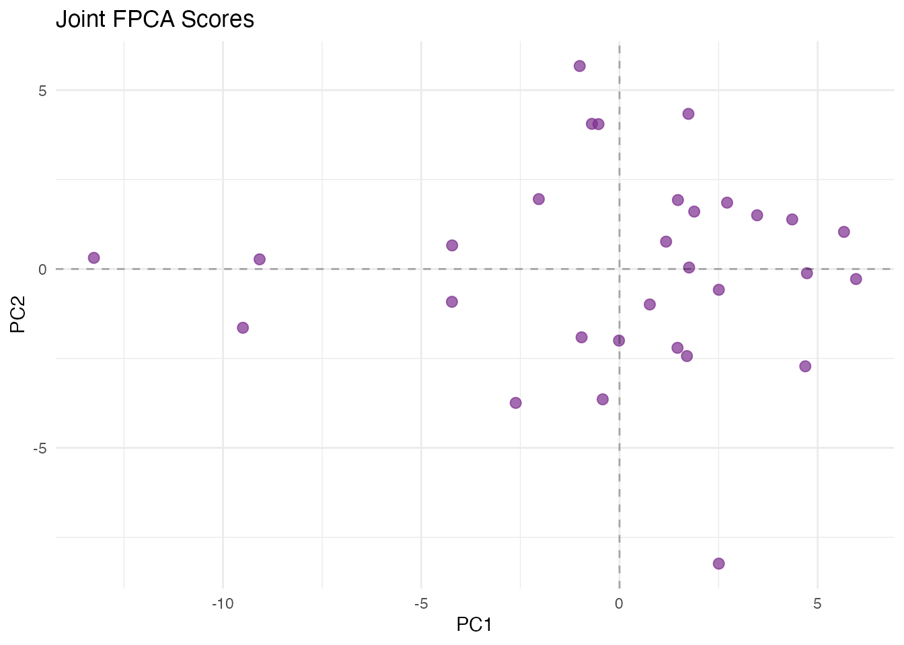
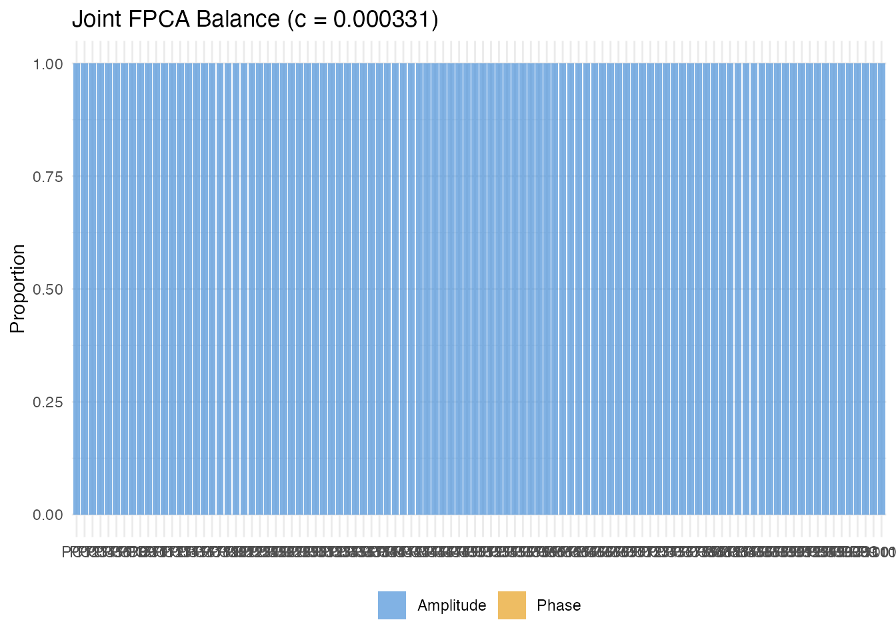

# Elastic FPCA

## Motivation

Functional principal component analysis (FPCA) is a powerful technique
for understanding variation in functional data. However, standard FPCA
conflates two distinct sources of variation:

- **Amplitude variability**: differences in the *values* or *shape* of
  functions
- **Phase variability**: differences in the *timing* or *alignment* of
  features

**Elastic FPCA** addresses this by first aligning curves using elastic
alignment (via the SRVF framework), then performing FPCA on the aligned
curves and warping functions separately.


## Mathematical Framework

### The SRVF Representation

Given a function
$\left. f:\lbrack 0,1\rbrack\rightarrow{\mathbb{R}} \right.$, its
**square-root velocity function** (SRVF) is

$$q(t) = \text{sign}(\dot{f}(t))\,\sqrt{\left| \dot{f}(t) \right|}.$$

The key property of the SRVF is that the Fisher-Rao metric between two
functions reduces to the ${\mathbb{L}}^{2}$ distance between their SRVFs
after optimal alignment:

$$d_{FR}\left( f_{1},f_{2} \right) = \inf\limits_{\gamma \in \Gamma} \parallel q_{1} - \left( q_{2} \circ \gamma \right)\sqrt{\dot{\gamma}} \parallel_{2},$$

where $\Gamma$ is the group of orientation-preserving diffeomorphisms
$\left. \gamma:\lbrack 0,1\rbrack\rightarrow\lbrack 0,1\rbrack \right.$.

### Karcher Mean

The **Karcher mean** $\bar{f}$ of a sample $\{ f_{1},\ldots,f_{n}\}$ is
the Fr0e9chet mean under the Fisher-Rao metric:

$$\bar{f} = \arg\min\limits_{f}\sum\limits_{i = 1}^{n}d_{FR}\left( f,f_{i} \right)^{2}.$$

The algorithm alternates between (1) aligning each curve to the current
mean and (2) computing a new mean from the aligned curves.

### Three Modes of FPCA

After computing the Karcher mean, we obtain aligned curves
$\{{\widetilde{f}}_{i}\}$ and warping functions $\{\gamma_{i}\}$. These
are analyzed with three variants of FPCA:

**Vertical (amplitude) FPCA**: PCA on the aligned SRVFs
$\{{\widetilde{q}}_{i}\}$, capturing pure shape variation. The
covariance operator is

$$C_{V}(s,t) = \frac{1}{n}\sum\limits_{i = 1}^{n}({\widetilde{q}}_{i}(s) - \bar{q}(s))({\widetilde{q}}_{i}(t) - \bar{q}(t)).$$

**Horizontal (phase) FPCA**: PCA on the shooting vectors
$v_{i} = \exp_{\text{id}}^{- 1}\left( \gamma_{i} \right)$ in the tangent
space at the identity warp, capturing pure timing variation.

**Joint FPCA**: Concatenates amplitude and phase representations into a
combined vector and performs PCA, revealing mixed amplitude-phase modes
of variation.

## Simulated Data with Amplitude + Phase Variation

``` r
n <- 30
m <- 101
t <- seq(0, 1, length.out = m)

# Generate curves with amplitude + phase variation
X <- matrix(0, n, m)
for (i in 1:n) {
  amp <- rnorm(1, 1, 0.3)           # amplitude variation
  shift <- rnorm(1, 0, 0.05)        # phase variation (timing shift)
  X[i, ] <- amp * sin(2 * pi * (t - shift)) +
            0.3 * amp * cos(4 * pi * (t - shift))
}
fd <- fdata(X, argvals = t)
```

``` r
plot(fd, main = "Simulated Curves: Mixed Amplitude + Phase",
     xlab = "t", ylab = "X(t)")
```



## Elastic Alignment

Elastic FPCA begins by aligning curves with
[`karcher.mean()`](https://sipemu.github.io/fdars-r/reference/karcher.mean.md):

``` r
karcher <- karcher.mean(fd, max.iter = 10)
```

``` r
plot(karcher$aligned, main = "After Elastic Alignment",
     xlab = "t", ylab = "X(t)")
```



``` r
plot(karcher$gammas, main = "Warping Functions (Phase Information)",
     xlab = "t", ylab = expression(gamma(t)))
```



## Vertical FPCA: Amplitude Variability

Vertical FPCA performs PCA on the **aligned** curves, capturing pure
shape variation:

``` r
vert_result <- vert.fpca(karcher, ncomp = 3)

cat("Vertical FPCA - cumulative variance:\n")
#> Vertical FPCA - cumulative variance:
print(round(vert_result$cumulative.variance, 4))
#> [1] 0.7113 0.9932 1.0000
```

``` r
plot(vert_result, type = "scores")
```



``` r
plot(vert_result, type = "eigenfunctions")
```



``` r
plot(vert_result, type = "variance")
```



## Horizontal FPCA: Phase Variability

Horizontal FPCA analyzes the **warping functions**, capturing pure
timing variation:

``` r
horiz_result <- horiz.fpca(karcher, ncomp = 3)

cat("Horizontal FPCA - cumulative variance:\n")
#> Horizontal FPCA - cumulative variance:
print(round(horiz_result$cumulative.variance, 4))
#> [1] 0.9532 0.9845 1.0000
```

``` r
plot(horiz_result, type = "scores")
```



``` r
plot(horiz_result, type = "warps")
```



## Joint FPCA: Combined Analysis

Joint FPCA simultaneously analyzes both amplitude and phase:

``` r
joint_result <- joint.fpca(karcher, ncomp = 3)

cat("Joint FPCA - cumulative variance:\n")
#> Joint FPCA - cumulative variance:
print(round(joint_result$cumulative.variance, 4))
#> [1] 0.7113 0.9932 1.0000
```

``` r
plot(joint_result, type = "scores")
```



``` r
plot(joint_result, type = "balance")
#> Warning in vert_var + horiz_var: longer object length is not a multiple of
#> shorter object length
#> Warning in horiz_var/total: longer object length is not a multiple of shorter
#> object length
```



## Practical Guidance

**Use vertical (amplitude) FPCA when:**

- You want to understand pure shape variation after removing timing
  differences

**Use horizontal (phase) FPCA when:**

- You want to understand timing or alignment variation

**Use joint FPCA when:**

- You want to simultaneously analyze amplitude and phase variation
- You need to understand their relative contributions

**Example applications:**

- **Growth curves**: Vertical for shape differences, horizontal for
  developmental timing
- **Gait analysis**: Vertical for movement patterns, horizontal for
  stride timing
- **Weather**: Vertical for seasonal temperature patterns, horizontal
  for seasonal shift

## References

- Srivastava, A., Wu, W., Kurtek, S., Klassen, E. and Marron, J.S.
  (2011). Registration of functional data using the Fisher-Rao metric.
  *arXiv preprint arXiv:1103.3817*.

- Tucker, J.D., Wu, W. and Srivastava, A. (2013). Generative models for
  functional data using phase and amplitude separation. *Computational
  Statistics & Data Analysis*, 61, 50–66.

- Srivastava, A. and Klassen, E.P. (2016). *Functional and Shape Data
  Analysis*. Springer.

- Ramsay, J.O. and Silverman, B.W. (2005). *Functional Data Analysis*.
  2nd ed. Springer.

## See Also

- `vignette("elastic-alignment")` — alignment without FPCA
- `vignette("fpca")` — standard (non-elastic) FPCA
- `vignette("elastic-regression")` — regression using elastic FPCA
  scores
