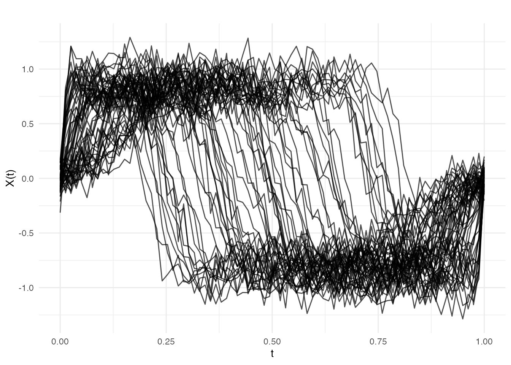
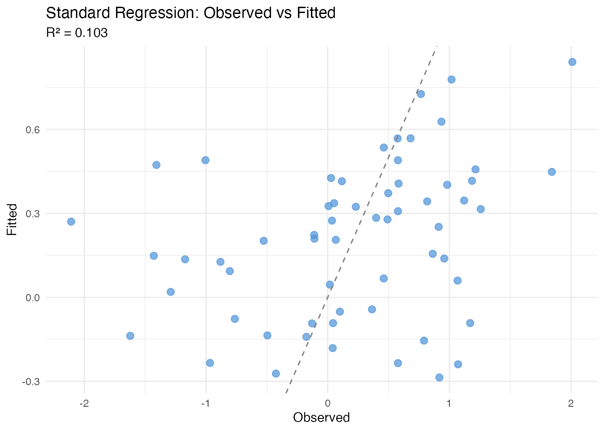
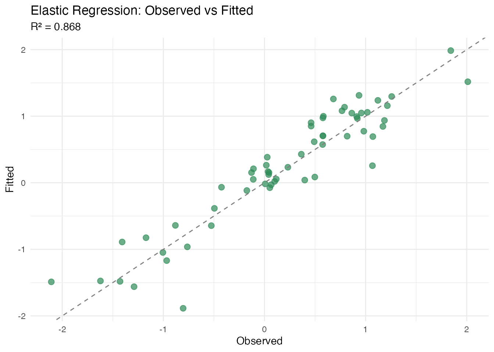
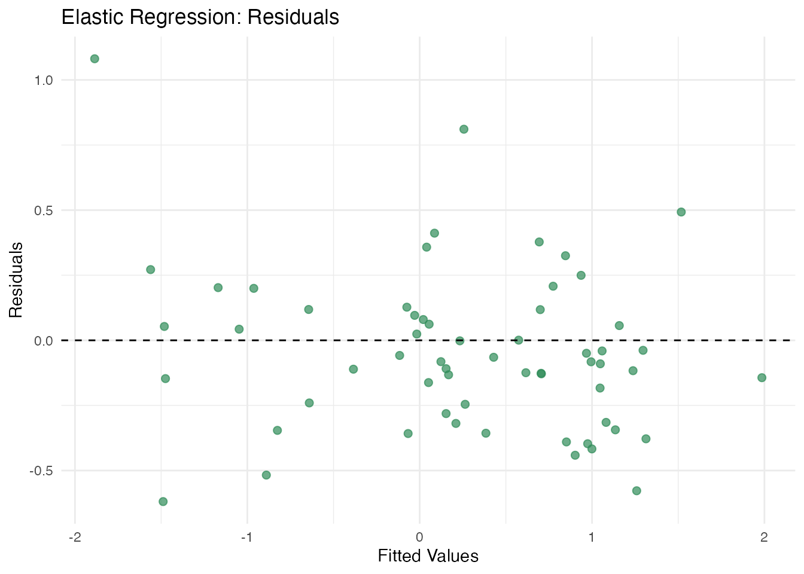
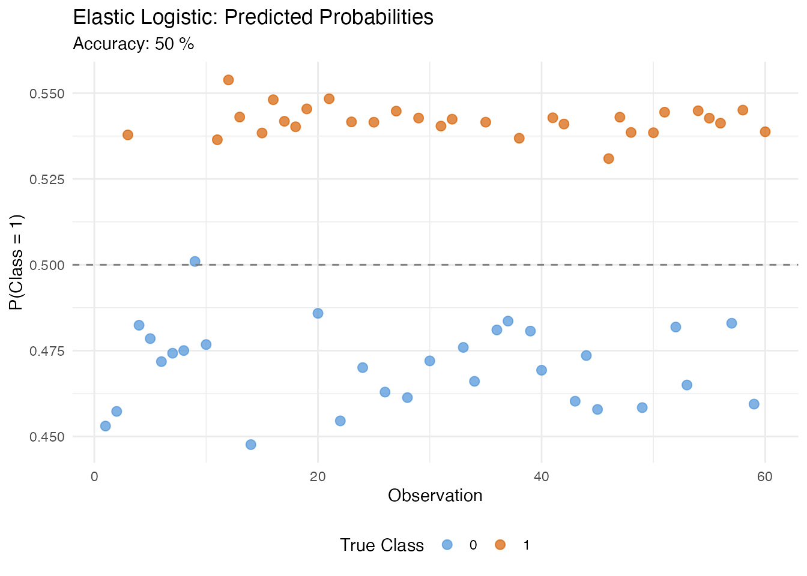
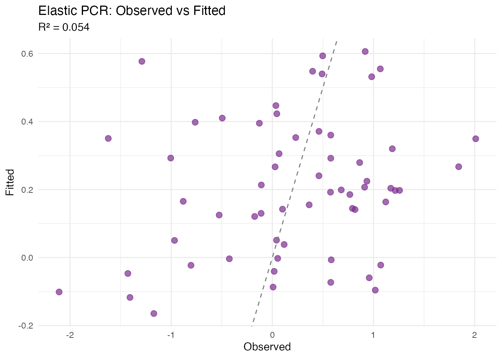
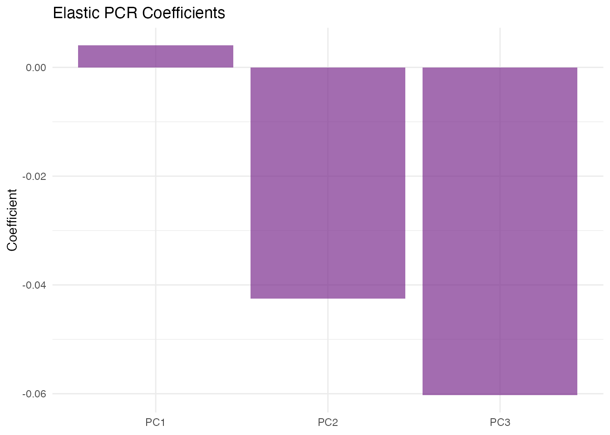
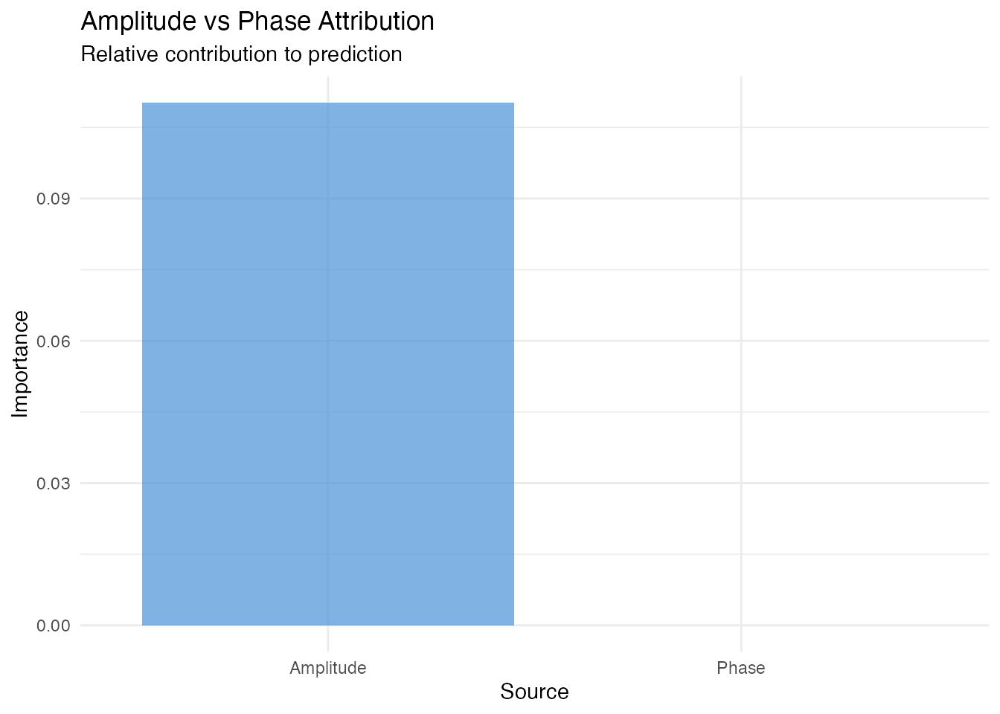

# Elastic Regression

## Introduction

Functional regression often assumes curves are meaningfully aligned
before analysis. However, when functional predictors contain **phase
variability** (differences in timing or alignment), standard regression
methods blend amplitude and phase variation, reducing predictive power
and interpretability of the coefficient function.

**Elastic regression** addresses this by jointly estimating the
alignment warping functions and regression coefficients, separating
phase from amplitude variation.


## Mathematical Framework

### Standard Functional Linear Model

The scalar-on-function model is

$$y_{i} = \alpha + \int_{0}^{1}X_{i}(t)\,\beta(t)\, dt + \varepsilon_{i}.$$

When curves $X_{i}$ are misaligned, the integral mixes amplitude and
phase effects, and the estimated $\widehat{\beta}(t)$ becomes blurred
and uninterpretable.

### Elastic Regression Model

Elastic regression introduces warping functions $\gamma_{i} \in \Gamma$:

$$y_{i} = \alpha + \int_{0}^{1}{\widetilde{X}}_{i}(t)\,\beta(t)\, dt + \varepsilon_{i},\qquad{\widetilde{X}}_{i} = X_{i} \circ \gamma_{i}.$$

The algorithm alternates between:

1.  **Alignment step**: Fix $\beta(t)$, update warping functions
    $\gamma_{i}$ to minimize the residual sum of squares via the
    Fisher-Rao elastic metric.
2.  **Regression step**: Fix warping functions, re-estimate $\alpha$ and
    $\beta(t)$ from the aligned curves.

Convergence is measured by the relative change in SSE. The SRVF
representation $q_{i} = \text{SRVF}\left( {\widetilde{X}}_{i} \right)$
ensures the alignment respects the elastic geometry (Srivastava et al.,
2011).

### Elastic Logistic Model

For binary classification $y_{i} \in \{ 0,1\}$, the model becomes

$$\log\frac{P\left( y_{i} = 1 \right)}{P\left( y_{i} = 0 \right)} = \alpha + \int_{0}^{1}{\widetilde{X}}_{i}(t)\,\beta(t)\, dt,$$

with the same alternating alignment-regression optimization.

### Elastic PCR

Elastic Principal Component Regression first computes elastic FPCA
scores (vertical, horizontal, or joint), then regresses $y$ on the
scores:

$$y_{i} = \alpha + \sum\limits_{k = 1}^{K}b_{k}\,\xi_{ik} + \varepsilon_{i},$$

where $\xi_{ik}$ are scores from the chosen FPCA mode.

## Simulated Data: Warped Template with Amplitude Signal

We simulate a scenario that strongly favours elastic regression: all
curves share a common shape (template), but each is **nonlinearly
warped** by a random diffeomorphism. The response depends on a subtle
*amplitude* perturbation that is invisible to standard FPCA because the
dominant variation is phase:

``` r
n <- 60
m <- 80
t <- seq(0, 1, length.out = m)

template <- function(s) sin(2 * pi * s) + 0.3 * sin(6 * pi * s)

X <- matrix(0, n, m)
y <- numeric(n)
for (i in 1:n) {
  # Random nonlinear warp via Beta CDF
  a <- runif(1, 0.5, 2.0)
  b <- runif(1, 0.5, 2.0)
  gamma <- pbeta(t, a, b)

  # Amplitude perturbation (the signal)
  delta <- rnorm(1, 0, 0.4)

  # Warped and scaled template
  X[i, ] <- (1 + 0.2 * delta) *
            approx(t, template(t), xout = gamma, rule = 2)$y +
            rnorm(m, sd = 0.1)

  # Response depends on amplitude perturbation
  y[i] <- 2 * delta + rnorm(1, sd = 0.3)
}
fd <- fdata(X, argvals = t)
```

``` r
plot(fd, main = "Functional Predictors: Nonlinearly Warped Template",
     xlab = "t", ylab = "X(t)")
```



Standard FPCA spends nearly all its components capturing the dominant
warp variation, leaving little capacity for the amplitude signal that
drives the response.

## Standard Regression (Baseline)

``` r
fit_std <- fregre.lm(fd, y, ncomp = 5)
cat("Standard fregre.lm R\u00b2:", round(fit_std$r.squared, 4), "\n")
#> Standard fregre.lm R²: 0.1027
```

``` r
df_std <- data.frame(Observed = y, Fitted = fit_std$fitted.values)
ggplot(df_std, aes(x = Observed, y = Fitted)) +
  geom_point(color = "#4A90D9", size = 2.5, alpha = 0.7) +
  geom_abline(slope = 1, intercept = 0, linetype = "dashed", color = "gray50") +
  labs(title = "Standard Regression: Observed vs Fitted",
       subtitle = paste("R\u00b2 =", round(fit_std$r.squared, 3)),
       x = "Observed", y = "Fitted")
```



Standard regression fails because the FPCs capture warp variation rather
than the amplitude signal the response depends on.

## Elastic Scalar-on-Function Regression

[`elastic.regression()`](https://sipemu.github.io/fdars-r/reference/elastic.regression.md)
jointly estimates alignment and regression, removing the phase variation
before fitting:

``` r
fit_elastic <- elastic.regression(fd, y, ncomp.beta = 5, lambda = 0.01,
                                  max.iter = 20, tol = 1e-3)
cat("Elastic regression R\u00b2:", round(fit_elastic$r.squared, 4), "\n")
#> Elastic regression R²: 0.868
cat("Iterations:", fit_elastic$n.iter, "\n")
#> Iterations: 20
```

``` r
plot(fit_elastic, type = "fit")
```



``` r
plot(fit_elastic, type = "beta")
```

``` r
plot(fit_elastic, type = "residuals")
```



### Comparison

``` r
comp <- data.frame(
  Method = c("Standard (fregre.lm)", "Elastic Regression"),
  R2 = c(fit_std$r.squared, fit_elastic$r.squared),
  RMSE = c(sqrt(mean(fit_std$residuals^2)),
           sqrt(mean(fit_elastic$residuals^2)))
)
print(comp)
#>                 Method        R2      RMSE
#> 1 Standard (fregre.lm) 0.1026623 0.8166588
#> 2   Elastic Regression 0.8680056 0.3132134
```

## Elastic Logistic Classification

For binary classification:

``` r
y_bin <- as.numeric(y > median(y))

fit_logistic <- elastic.logistic(fd, y_bin, ncomp.beta = 5, lambda = 0.01,
                                 max.iter = 15, tol = 1e-3)
cat("Accuracy:", round(fit_logistic$accuracy * 100, 1), "%\n")
#> Accuracy: 50 %
```

``` r
plot(fit_logistic, type = "probabilities")
```



## Elastic PCR

Compare vertical, horizontal, and joint PCA methods:

``` r
fit_vert <- elastic.pcr(fd, y, ncomp = 3, pca.method = "vertical")
fit_horiz <- elastic.pcr(fd, y, ncomp = 3, pca.method = "horizontal")
fit_joint <- elastic.pcr(fd, y, ncomp = 3, pca.method = "joint")

comp_pcr <- data.frame(
  Method = c("Vertical", "Horizontal", "Joint"),
  R2 = c(fit_vert$r.squared, fit_horiz$r.squared, fit_joint$r.squared)
)
print(comp_pcr)
#>       Method         R2
#> 1   Vertical 0.05441282
#> 2 Horizontal 0.03157880
#> 3      Joint 0.05441282
```

``` r
plot(fit_joint, type = "fit")
```



``` r
plot(fit_joint, type = "coefficients")
```



## Amplitude vs Phase Attribution

[`elastic.attribution()`](https://sipemu.github.io/fdars-r/reference/elastic.attribution.md)
quantifies how much of the prediction accuracy is attributable to
amplitude variation (shape after alignment) versus phase variation
(warping), using elastic PCR scores. This helps decide whether alignment
is worthwhile for a given dataset.

``` r
attr <- elastic.attribution(fd, y, ncomp = 3, pca.method = "vertical",
                            n.perm = 50, seed = 42)

cat("Amplitude importance:", round(attr$amplitude_importance, 4), "\n")
#> Amplitude importance: 0.1102
cat("Phase importance:", round(attr$phase_importance, 4), "\n")
#> Phase importance: 0
```

``` r
df_attr <- data.frame(
  Source = c("Amplitude", "Phase"),
  Importance = c(attr$amplitude_importance, attr$phase_importance)
)

ggplot(df_attr, aes(x = Source, y = Importance, fill = Source)) +
  geom_col(alpha = 0.7) +
  scale_fill_manual(values = c("Amplitude" = "#4A90D9", "Phase" = "#D55E00")) +
  labs(title = "Amplitude vs Phase Attribution",
       subtitle = "Relative contribution to prediction",
       y = "Importance") +
  theme(legend.position = "none")
```



In our simulated data, the response depends on amplitude perturbations,
so
[`elastic.attribution()`](https://sipemu.github.io/fdars-r/reference/elastic.attribution.md)
correctly identifies amplitude as the dominant predictive source.

## When to Use Elastic Regression

- **Phase variability dominates**: when nonlinear warping is the primary
  source of variation, standard FPCA wastes components on phase
- **Interpretability important**: want a clear coefficient function
  after removing phase
- **Classification with misalignment**: use
  [`elastic.logistic()`](https://sipemu.github.io/fdars-r/reference/elastic.logistic.md)
  for groups with different peak timings
- **Attribution needed**:
  [`elastic.attribution()`](https://sipemu.github.io/fdars-r/reference/elastic.attribution.md)
  can quantify amplitude vs phase contributions before committing to a
  full elastic model

Avoid elastic regression if curves are already well-aligned or if the
response depends on phase variation itself.

## References

- Srivastava, A., Wu, W., Kurtek, S., Klassen, E. and Marron, J.S.
  (2011). Registration of functional data using the Fisher-Rao metric.
  *arXiv preprint arXiv:1103.3817*.

- Tucker, J.D., Wu, W. and Srivastava, A. (2013). Generative models for
  functional data using phase and amplitude separation. *Computational
  Statistics & Data Analysis*, 61, 50–66.

- Ramsay, J.O. and Silverman, B.W. (2005). *Functional Data Analysis*.
  2nd ed. Springer.

## See Also

- `vignette("elastic-alignment")` — alignment without regression
- [`vignette("articles/scalar-on-function")`](https://sipemu.github.io/fdars-r/articles/scalar-on-function.md)
  — standard scalar-on-function regression
- `vignette("elastic-fpca")` — elastic FPCA for amplitude/phase
  separation
