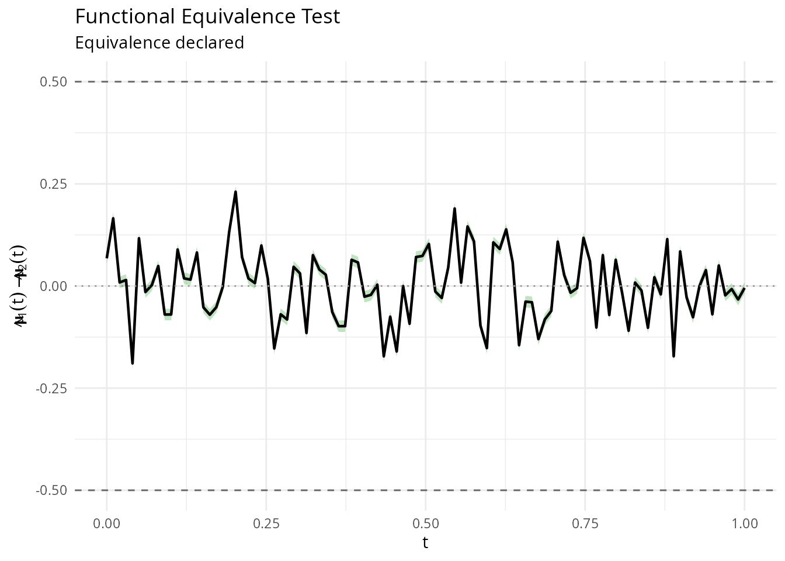
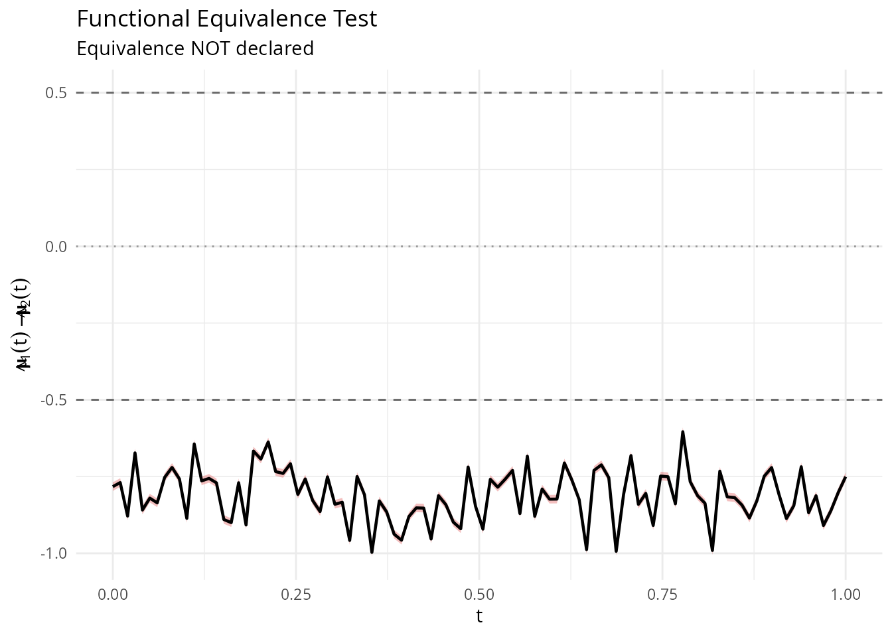
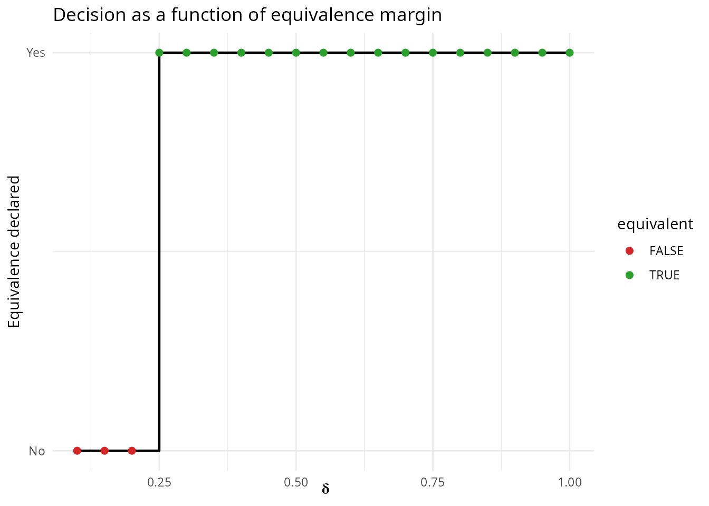
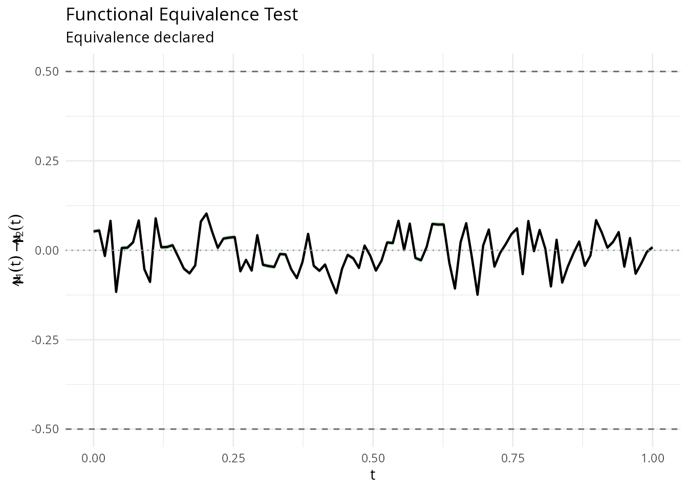

# Functional Equivalence Testing

## Introduction

Classical hypothesis tests (like `group.test`) ask whether two groups of
curves are *different*. But in many applications the relevant question
is the opposite: **are two groups of curves equivalent?**

Examples include:

- **Bioequivalence**: Do a generic and brand-name drug produce
  equivalent concentration-time profiles?
- **Process validation**: Does a new manufacturing process produce
  output curves within tolerance of the old one?
- **Reproducibility**: Do two labs produce equivalent functional
  measurements?

[`fequiv.test()`](https://sipemu.github.io/fdars-r/reference/fequiv.test.md)
implements a functional **TOST** (Two One-Sided Tests) procedure based
on the supremum norm. It constructs a simultaneous confidence band (SCB)
for the mean difference and checks whether the entire band lies within
an equivalence margin $`[-\delta, \delta]`$.

**Hypotheses:**

- $`H_0`$: $`\sup_t |\mu_1(t) - \mu_2(t)| \geq \delta`$ (NOT equivalent)
- $`H_1`$: $`\sup_t |\mu_1(t) - \mu_2(t)| < \delta`$ (equivalent)

## Setup

``` r
library(fdars)
#> 
#> Attaching package: 'fdars'
#> The following objects are masked from 'package:stats':
#> 
#>     cov, decompose, deriv, median, sd, var
#> The following object is masked from 'package:base':
#> 
#>     norm
library(ggplot2)
theme_set(theme_minimal())

set.seed(42)
m <- 100
t_grid <- seq(0, 1, length.out = m)
```

## Example 1: Equivalent curves

Two samples drawn from the same distribution should be declared
equivalent with a reasonable $`\delta`$.

``` r
# Two groups from the same process
n1 <- 30
n2 <- 25
X1 <- matrix(0, n1, m)
X2 <- matrix(0, n2, m)
for (i in 1:n1) X1[i, ] <- sin(2 * pi * t_grid) + rnorm(m, sd = 0.3)
for (i in 1:n2) X2[i, ] <- sin(2 * pi * t_grid) + rnorm(m, sd = 0.3)

fd1 <- fdata(X1, argvals = t_grid)
fd2 <- fdata(X2, argvals = t_grid)

result <- fequiv.test(fd1, fd2, delta = 0.5, n.boot = 1000, seed = 42)
print(result)
#> Functional Equivalence Test (TOST)
#> ===================================
#> Data: fd1 and fd2 
#> Two-sample test, n1 = 30 , n2 = 25 
#> Bootstrap method: multiplier 
#> Equivalence margin (delta): 0.5 
#> Significance level (alpha): 0.05 
#> ---
#> Test statistic (sup|d_hat|): 0.2307 
#> Critical value: 0.0141 
#> SCB range: [ -0.2035 , 0.2448 ]
#> P-value: <2e-16 
#> ---
#> Decision: Reject H0 -- equivalence declared
```

The plot shows the mean difference curve (black), the simultaneous
confidence band (green = equivalence declared, red = not declared), and
the equivalence margins (dashed lines at $`\pm\delta`$).

``` r
plot(result)
```



## Example 2: Non-equivalent curves

When the two groups have genuinely different mean functions, the test
should *not* declare equivalence.

``` r
# Group 2 has a shifted mean
X2_shifted <- matrix(0, n2, m)
for (i in 1:n2) X2_shifted[i, ] <- sin(2 * pi * t_grid) + 0.8 + rnorm(m, sd = 0.3)

fd2_shifted <- fdata(X2_shifted, argvals = t_grid)

result2 <- fequiv.test(fd1, fd2_shifted, delta = 0.5, n.boot = 1000, seed = 42)
print(result2)
#> Functional Equivalence Test (TOST)
#> ===================================
#> Data: fd1 and fd2_shifted 
#> Two-sample test, n1 = 30 , n2 = 25 
#> Bootstrap method: multiplier 
#> Equivalence margin (delta): 0.5 
#> Significance level (alpha): 0.05 
#> ---
#> Test statistic (sup|d_hat|): 0.9969 
#> Critical value: 0.014 
#> SCB range: [ -1.0109 , -0.5899 ]
#> P-value: 1 
#> ---
#> Decision: Fail to reject H0 -- equivalence NOT declared
```

``` r
plot(result2)
```



The red band extends well beyond the dashed equivalence margins, so
equivalence is not declared.

## Choosing delta

The equivalence margin $`\delta`$ is the maximum sup-norm difference you
consider scientifically negligible. It must be chosen *before* looking
at the data, based on domain knowledge:

- **Too large**: trivially declares equivalence (low power against real
  differences)
- **Too small**: almost never declares equivalence (conservative)

A useful diagnostic is to sweep over $`\delta`$ values and see where the
decision flips:

``` r
deltas <- seq(0.1, 1.0, by = 0.05)
decisions <- sapply(deltas, function(d) {
  fequiv.test(fd1, fd2, delta = d, n.boot = 500, seed = 42)$reject
})

df_sweep <- data.frame(delta = deltas, equivalent = decisions)
ggplot(df_sweep, aes(x = delta, y = as.numeric(equivalent))) +
  geom_step(linewidth = 0.8) +
  geom_point(aes(color = equivalent), size = 2) +
  scale_color_manual(values = c("FALSE" = "#d62728", "TRUE" = "#2ca02c")) +
  labs(x = expression(delta), y = "Equivalence declared",
       title = "Decision as a function of equivalence margin") +
  scale_y_continuous(breaks = c(0, 1), labels = c("No", "Yes"))
```



## One-sample test

You can also test whether a single sample’s mean is equivalent to a
known reference function $`\mu_0`$.

``` r
# Test if the sample mean is equivalent to the true generating function
mu0 <- sin(2 * pi * t_grid)
result_one <- fequiv.test(fd1, delta = 0.5, mu0 = mu0, n.boot = 1000, seed = 42)
print(result_one)
#> Functional Equivalence Test (TOST)
#> ===================================
#> Data: fd1 
#> One-sample test, n = 30 
#> Bootstrap method: multiplier 
#> Equivalence margin (delta): 0.5 
#> Significance level (alpha): 0.05 
#> ---
#> Test statistic (sup|d_hat|): 0.1243 
#> Critical value: 0.0061 
#> SCB range: [ -0.1305 , 0.1088 ]
#> P-value: <2e-16 
#> ---
#> Decision: Reject H0 -- equivalence declared
plot(result_one)
```



## Bootstrap methods

`fequiv.test` supports two bootstrap methods:

- **`"multiplier"`** (default): Gaussian multiplier bootstrap. Fast and
  asymptotically valid. Recommended for most applications.
- **`"percentile"`**: Resampling-based bootstrap. More robust with small
  samples or heavy-tailed data.

``` r
result_pct <- fequiv.test(fd1, fd2, delta = 0.5, n.boot = 1000,
                          method = "percentile", seed = 42)
print(result_pct)
#> Functional Equivalence Test (TOST)
#> ===================================
#> Data: fd1 and fd2 
#> Two-sample test, n1 = 30 , n2 = 25 
#> Bootstrap method: percentile 
#> Equivalence margin (delta): 0.5 
#> Significance level (alpha): 0.05 
#> ---
#> Test statistic (sup|d_hat|): 0.2307 
#> Critical value: 0.2691 
#> SCB range: [ -0.4585 , 0.4998 ]
#> P-value: 0.1 
#> ---
#> Decision: Reject H0 -- equivalence declared
```

## References

- Dette, H. and Kokot, K. (2021). Detecting relevant differences in the
  covariance operators of functional time series. *Biometrika*,
  108(4):895–913.
