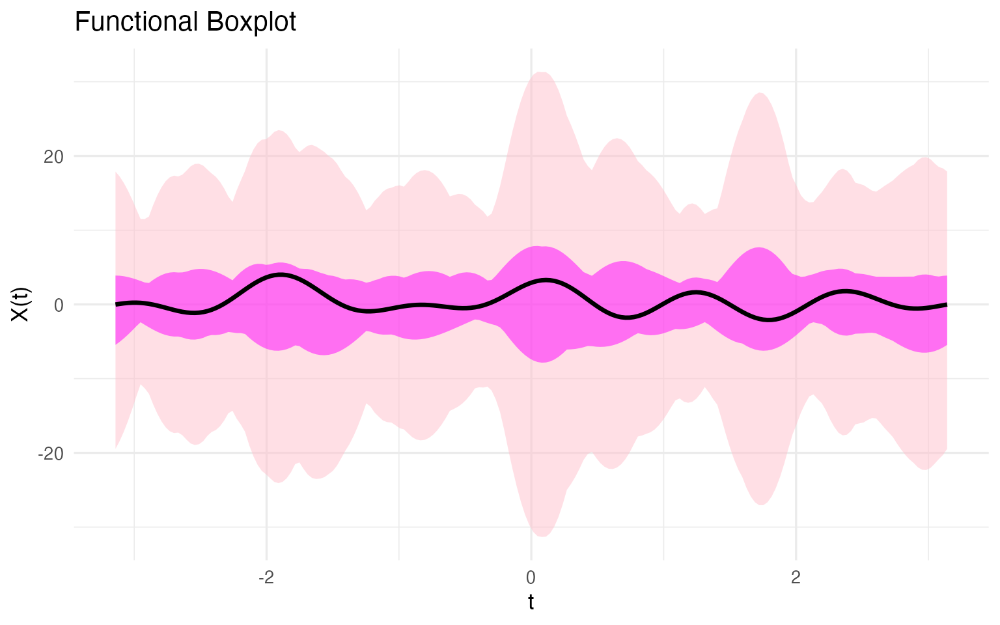
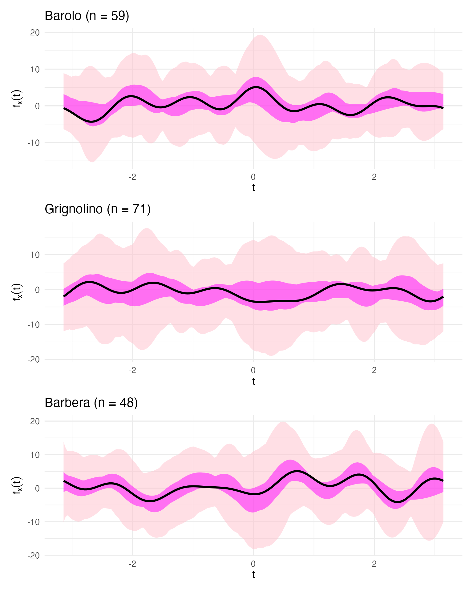
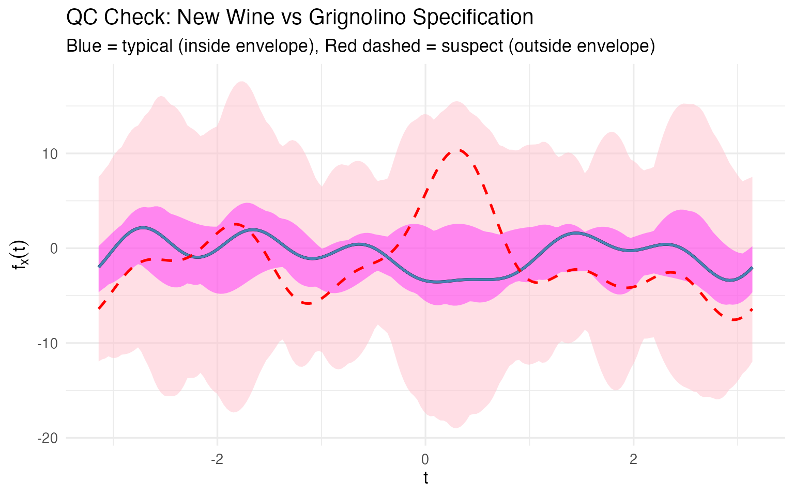
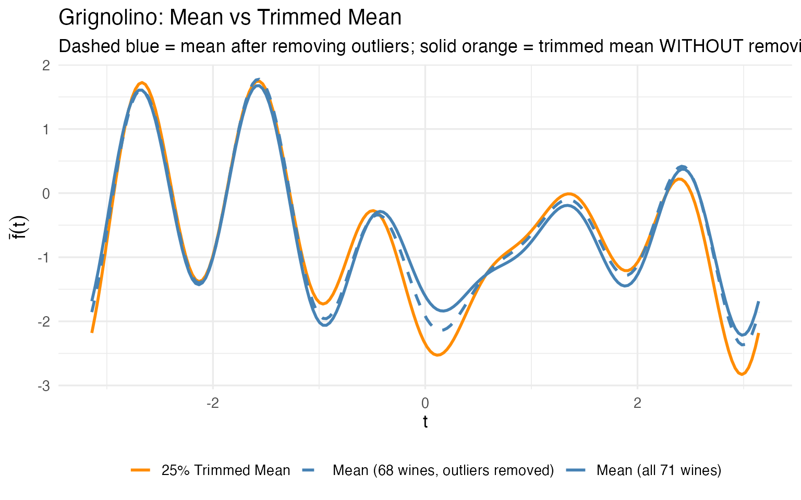
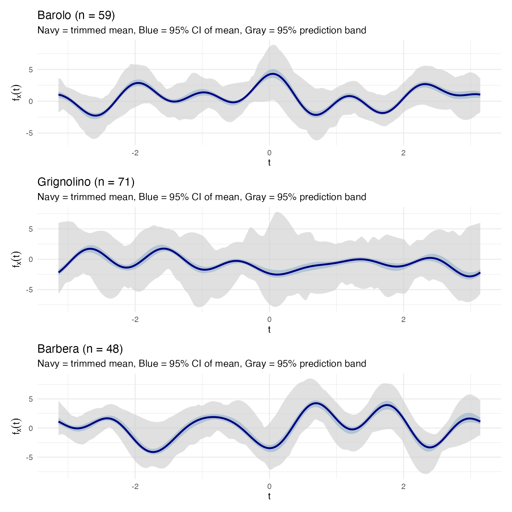
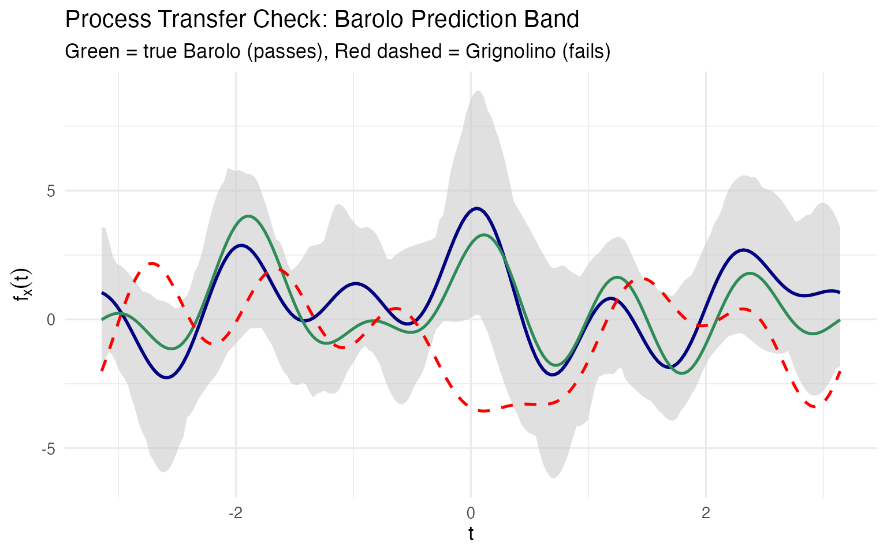
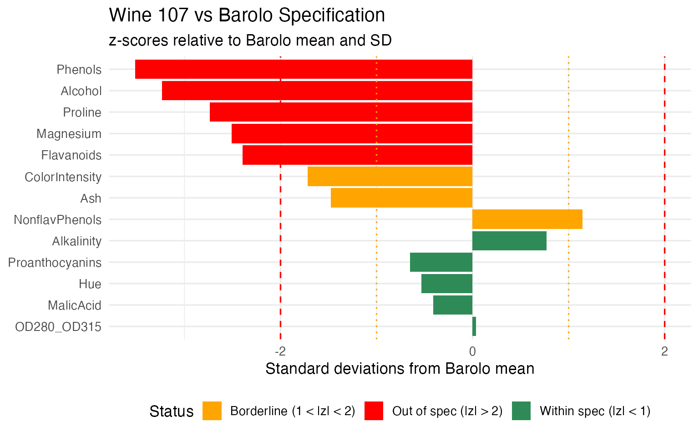
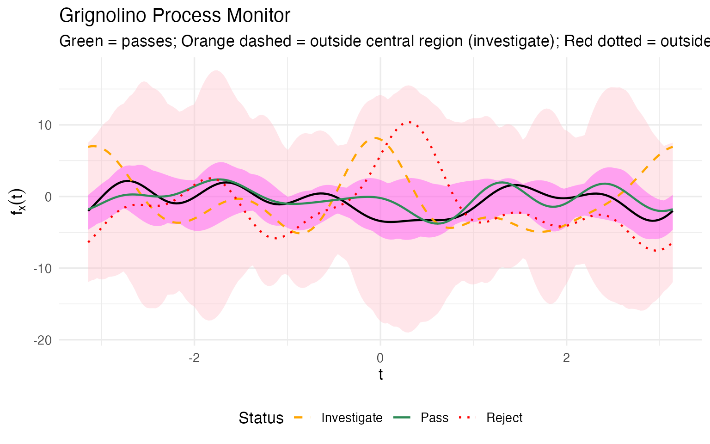
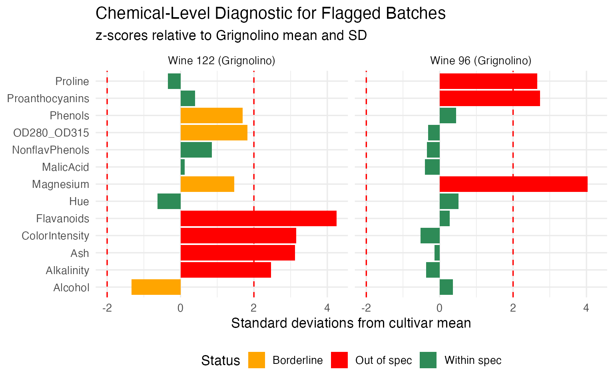

# Andrews Wine: Quality Control

``` r
library(fdars)
library(ggplot2)
library(dplyr)
library(patchwork)
library(knitr)
theme_set(theme_minimal(base_size = 13))
set.seed(42)
```

This article is part of a four-article series analyzing 178 wines (3
cultivars, 13 chemicals) with Andrews curves and functional data
analysis. Each article is self-contained.

| Article                                                                                                          | What It Does                                                     | Outcome                                                             |
|------------------------------------------------------------------------------------------------------------------|------------------------------------------------------------------|---------------------------------------------------------------------|
| [Why Andrews Curves?](https://sipemu.github.io/fdars-r/articles/example-andrews-wine-intro.md)                   | Transform 13 chemicals into curves; verify distance preservation | Each wine becomes a visual fingerprint; distances preserved exactly |
| [Outlier Detection](https://sipemu.github.io/fdars-r/articles/example-andrews-wine.md)                           | Depth, outliergram, MS-plot                                      | 9 anomalies classified by type with corrective actions              |
| [Clustering & Variable Importance](https://sipemu.github.io/fdars-r/articles/example-andrews-wine-clustering.md) | K-means, fuzzy c-means, permutation test, FPCA                   | Cultivar recovery at 96% accuracy; top 5 chemicals identified       |
| **Quality Control** (this article)                                                                               | Functional boxplots, depth rankings, tolerance bands             | Monitoring system: one chart checks all 13 chemicals simultaneously |

**What you get from this article:**

- **Functional boxplot** monitors all 13 chemicals in a single chart —
  replacing 13 separate control charts and catching unusual
  *combinations* that per-variable charts miss
- **Depth ranking** gives every wine a continuous typicality score, so
  the quality controller sets their own investigation threshold
- **Trimmed mean** provides a robust cultivar reference that resists
  contamination without manual outlier removal
- **Three-phase monitoring workflow** (validate, transfer, monitor) maps
  directly to the ICH Q8–Q12 process validation lifecycle
- **Chemical-level diagnostics** decompose every alert back to specific
  chemicals — not just “investigate” but “*which* assays to re-run”

``` r
# Load wine data
wine_url <- "https://archive.ics.uci.edu/ml/machine-learning-databases/wine/wine.data"
col_names <- c("Cultivar", "Alcohol", "MalicAcid", "Ash", "Alkalinity",
               "Magnesium", "Phenols", "Flavanoids", "NonflavPhenols",
               "Proanthocyanins", "ColorIntensity", "Hue",
               "OD280_OD315", "Proline")
wine <- read.csv(wine_url, header = FALSE, col.names = col_names)
cultivar <- factor(wine$Cultivar, levels = 1:3,
                   labels = c("Barolo", "Grignolino", "Barbera"))
X <- scale(as.matrix(wine[, -1]))
chem_names <- colnames(wine)[-1]

# Andrews transform
fd_wine <- andrews_transform(X)
n <- nrow(fd_wine$data)
m <- ncol(fd_wine$data)
t_grid <- fd_wine$argvals
```

## The Functional Boxplot: A Cultivar Specification

Classical boxplots summarize one variable at a time. If you want to
monitor 13 chemicals, you need 13 boxplots, and there’s no way to assess
whether the *combination* of values is normal. The functional boxplot
solves this: it defines a simultaneous envelope over all 13 chemicals
(encoded in the curve), giving you a single visual that says “this is
what a normal wine looks like.”

### Overall Functional Boxplot

``` r

fbp <- boxplot(fd_wine)
fbp$plot
```



The median curve (black) is the **most typical wine** — the one with the
highest functional depth. The magenta band is the **50% central
region**: half of all wines fall within this envelope at every point.
The pink band extends to the fences (1.5x the envelope width); any wine
whose curve escapes the pink band at *any* Fourier frequency is
automatically flagged.

### Per-Cultivar Specifications

The overall boxplot mixes all three cultivars. For quality control, what
you really want is a **cultivar-specific specification** — what should a
typical Barolo, Grignolino, or Barbera look like?

``` r

bp_list <- list()
for (cv in levels(cultivar)) {
  idx <- which(cultivar == cv)
  fd_cv <- fd_wine[idx]
  fbp_cv <- boxplot(fd_cv)

  bp_list[[cv]] <- fbp_cv$plot +
    labs(title = sprintf("%s (n = %d)", cv, length(idx)),
         x = expression(t), y = expression(f[x](t)))
}

bp_list[["Barolo"]] / bp_list[["Grignolino"]] / bp_list[["Barbera"]]
```



These three boxplots define a **visual specification** for each
cultivar. A quality controller can now take a new wine, compute its
Andrews curve, and overlay it on the appropriate cultivar’s boxplot. If
the curve falls within the magenta band, the wine is typical. If it
escapes the pink fences, investigate.

### Incoming Batch Monitoring

Let’s simulate this workflow. We take Wine 122 (a suspect Grignolino
identified in the [outlier
analysis](https://sipemu.github.io/fdars-r/articles/example-andrews-wine.md))
and Wine 107 (the most typical Grignolino by depth) and check them
against the Grignolino specification:

``` r

grig_idx <- which(cultivar == "Grignolino")
fd_grig <- fd_wine[grig_idx]
fbp_grig <- boxplot(fd_grig)

# Extract envelope and fence for custom overlay
df_envelope <- data.frame(
  t = t_grid,
  env_min = fbp_grig$envelope$min, env_max = fbp_grig$envelope$max,
  fence_min = fbp_grig$fence$min, fence_max = fbp_grig$fence$max,
  median_val = fd_grig$data[fbp_grig$median, ]
)

# Wine 122 and Wine 107 curves
df_check <- rbind(
  data.frame(t = t_grid, value = fd_wine$data[122, ], Wine = "Wine 122 (suspect)"),
  data.frame(t = t_grid, value = fd_wine$data[107, ], Wine = "Wine 107 (typical)")
)

ggplot() +
  geom_ribbon(data = df_envelope, aes(x = t, ymin = fence_min, ymax = fence_max),
              fill = "pink", alpha = 0.5) +
  geom_ribbon(data = df_envelope, aes(x = t, ymin = env_min, ymax = env_max),
              fill = "magenta", alpha = 0.4) +
  geom_line(data = df_envelope, aes(x = t, y = median_val),
            color = "black", linewidth = 1) +
  geom_line(data = filter(df_check, Wine == "Wine 107 (typical)"),
            aes(x = t, y = value), color = "steelblue", linewidth = 0.9) +
  geom_line(data = filter(df_check, Wine == "Wine 122 (suspect)"),
            aes(x = t, y = value), color = "red", linewidth = 0.9,
            linetype = "dashed") +
  labs(title = "QC Check: New Wine vs Grignolino Specification",
       subtitle = "Blue = typical (inside envelope), Red dashed = suspect (outside envelope)",
       x = expression(t), y = expression(f[x](t)))
```



No 13-column spreadsheet comparison needed. One glance tells the story:
Wine 107 traces the median closely; Wine 122’s curve departs from the
envelope in several regions, particularly around $t \approx 0$ where the
$\sin(t)$ and $\cos(t)$ terms (encoding Malic Acid and Ash) dominate.
This is a **multivariate control chart** — monitoring all 13 chemicals
simultaneously in a single visual.

There is no simple classical equivalent. A 13-dimensional confidence
ellipsoid exists mathematically, but you can’t plot it, you can’t show
it to a plant manager, and you can’t point to the region where the wine
deviates. The functional boxplot does all three.

## Depth as a Typicality Score

Functional depth gives every wine a scalar **typicality score** within
its cultivar. This is a concept with no clean classical equivalent — it
simultaneously accounts for all 13 chemicals without requiring a
parametric model or covariance matrix inversion.

``` r
# Compute within-cultivar depth rankings
depth_rankings <- lapply(levels(cultivar), function(cv) {
  idx <- which(cultivar == cv)
  fd_cv <- fd_wine[idx]
  depths <- depth.MBD(fd_cv)
  data.frame(
    Wine = idx,
    Cultivar = cv,
    Depth = round(depths, 4),
    Rank = rank(-depths)
  )
})
df_depths <- bind_rows(depth_rankings)

# Show top 3 and bottom 3 per cultivar
top_bottom <- df_depths |>
  group_by(Cultivar) |>
  arrange(Rank) |>
  slice(c(1:3, (n()-2):n())) |>
  mutate(Status = ifelse(Rank <= 3, "Most typical", "Least typical"))

kable(top_bottom |> select(Cultivar, Wine, Depth, Rank, Status),
      caption = "Most and least typical wines per cultivar (by functional depth)")
```

| Cultivar   | Wine |  Depth | Rank | Status        |
|:-----------|-----:|-------:|-----:|:--------------|
| Barbera    |  175 | 0.4756 |    1 | Most typical  |
| Barbera    |  149 | 0.4734 |    2 | Most typical  |
| Barbera    |  164 | 0.4311 |    3 | Most typical  |
| Barbera    |  153 | 0.2874 |   46 | Least typical |
| Barbera    |  160 | 0.2434 |   47 | Least typical |
| Barbera    |  159 | 0.1980 |   48 | Least typical |
| Barolo     |   58 | 0.4351 |    1 | Most typical  |
| Barolo     |   49 | 0.4321 |    2 | Most typical  |
| Barolo     |   36 | 0.4084 |    3 | Most typical  |
| Barolo     |   40 | 0.2640 |   57 | Least typical |
| Barolo     |   15 | 0.2370 |   58 | Least typical |
| Barolo     |   26 | 0.1994 |   59 | Least typical |
| Grignolino |  107 | 0.4394 |    1 | Most typical  |
| Grignolino |   82 | 0.4377 |    2 | Most typical  |
| Grignolino |  118 | 0.4360 |    3 | Most typical  |
| Grignolino |   70 | 0.2244 |   69 | Least typical |
| Grignolino |   96 | 0.2086 |   70 | Least typical |
| Grignolino |  122 | 0.1938 |   71 | Least typical |

Most and least typical wines per cultivar (by functional depth)

The “most typical” wines are the ones a sommelier would call textbook
examples of their cultivar. The “least typical” wines — 122, 96, 70 for
Grignolino; 159 for Barbera — are exactly the ones the [outlier
analysis](https://sipemu.github.io/fdars-r/articles/example-andrews-wine.md)
flagged. Depth provides a continuous ranking, not a binary flag, so the
quality controller can set their own threshold: investigate the bottom
5%? The bottom 10%?

### Robust Location: Trimmed Mean vs Ordinary Mean

Depth also enables **robust estimation**. The trimmed mean discards the
shallowest curves (the most atypical wines) before averaging, giving a
center estimate that resists contamination:

``` r

fd_grig <- fd_wine[which(cultivar == "Grignolino")]

# Full sample estimates
fn_mean_full <- mean(fd_grig)
fn_trimmed_full <- trimmed(fd_grig, trim = 0.25)

# Remove 3 most extreme outliers and recompute
grig_clean <- setdiff(which(cultivar == "Grignolino"), c(70, 96, 122))
fd_grig_clean <- fd_wine[grig_clean]
fn_mean_clean <- mean(fd_grig_clean)
fn_trimmed_clean <- trimmed(fd_grig_clean, trim = 0.25)

# Measure how much each shifted
mean_shift <- sqrt(sum((fn_mean_full$data - fn_mean_clean$data)^2) *
                   diff(t_grid[1:2]))
trimmed_shift <- sqrt(sum((fn_trimmed_full$data - fn_trimmed_clean$data)^2) *
                      diff(t_grid[1:2]))

cat(sprintf("Removing 3 extreme Grignolino outliers (wines 70, 96, 122):\n"))
#> Removing 3 extreme Grignolino outliers (wines 70, 96, 122):
cat(sprintf("  Mean curve shifted by:          %.2f\n", mean_shift))
#>   Mean curve shifted by:          0.32
cat(sprintf("  25%% trimmed mean shifted by:    %.2f\n", trimmed_shift))
#>   25% trimmed mean shifted by:    0.22
cat(sprintf("  Trimmed mean is %.0f%% more stable\n",
            100 * (mean_shift - trimmed_shift) / mean_shift))
#>   Trimmed mean is 33% more stable

df_robust <- rbind(
  data.frame(t = t_grid, value = as.numeric(fn_mean_full$data),
             Estimator = "Mean (all 71 wines)"),
  data.frame(t = t_grid, value = as.numeric(fn_trimmed_full$data),
             Estimator = "25% Trimmed Mean"),
  data.frame(t = t_grid, value = as.numeric(fn_mean_clean$data),
             Estimator = "Mean (68 wines, outliers removed)")
)

ggplot(df_robust, aes(x = t, y = value, color = Estimator, linetype = Estimator)) +
  geom_line(linewidth = 1) +
  scale_color_manual(values = c("Mean (all 71 wines)" = "steelblue",
                                 "25% Trimmed Mean" = "darkorange",
                                 "Mean (68 wines, outliers removed)" = "steelblue")) +
  scale_linetype_manual(values = c("Mean (all 71 wines)" = "solid",
                                    "25% Trimmed Mean" = "solid",
                                    "Mean (68 wines, outliers removed)" = "dashed")) +
  labs(title = "Grignolino: Mean vs Trimmed Mean",
       subtitle = "Dashed blue = mean after removing outliers; solid orange = trimmed mean WITHOUT removing them",
       x = expression(t), y = expression(bar(f)(t))) +
  theme(legend.position = "bottom",
        legend.title = element_blank())
```



The trimmed mean (orange) computed on **all** 71 Grignolinos is close to
the ordinary mean computed after manually removing outliers (dashed
blue). The trimmed mean achieves robustness automatically — no need to
first detect outliers and then decide which to remove. For a production
pipeline where you can’t manually curate every batch, this is a
significant practical advantage.

## From Validation to Monitoring

So far we have tools for retrospective analysis. But a quality lab
doesn’t analyze the same 178 wines forever. New batches arrive every
week. The real question is: **can we turn this analysis into an ongoing
monitoring system?**

The answer is yes, and the functional framework makes it natural. The
workflow has three phases.

### Phase 1: Establish the Reference (Process Validation)

During process validation, you collect a representative set of wines for
each cultivar and compute the **reference profile**: the trimmed mean
curve and an envelope that captures the expected range of normal
variation.

We use the bootstrap to construct two types of bands:

- A **confidence band** (blue) for the trimmed mean — this quantifies
  uncertainty about the cultivar’s *average* profile (“where is the
  center?”).
- A **prediction band** (gray) for individual wines — this captures the
  range where a *single new observation* is expected to fall (“is this
  wine normal?”).

Both are **prediction intervals**: they use the observed sample to
predict where future observations or statistics will land. This is the
appropriate tool for *routine monitoring*, where you ask “does this new
wine look like my reference set?”

For *process transfer* — validating that a new vineyard, lab, or
fermentation facility produces equivalent wines — the statistically
correct tool is a **tolerance interval**. A tolerance interval
guarantees that *at least a specified proportion* of the population
(e.g., 95%) falls within the band, with a given confidence level (e.g.,
99%). This dual coverage is stricter than a prediction interval, which
only covers the *next single observation*. Computing functional
tolerance intervals requires adjustments for simultaneous coverage
across the entire curve domain, which goes beyond what we demonstrate
here, but the conceptual framework is the same: replace the bootstrap
quantiles below with the appropriate tolerance factors (e.g., based on
non-central $\chi^{2}$ or Bonferroni-corrected normal order statistics).
For the purposes of this article, we proceed with prediction bands as a
practical approximation:

``` r

tolerance_plots <- list()

for (cv in levels(cultivar)) {
  idx <- which(cultivar == cv)
  fd_cv <- fd_wine[idx]

  # Bootstrap the trimmed mean to get a tolerance band
  # Using the percentile method on pointwise quantiles of bootstrap curves
  n_boot <- 500
  boot_obj <- fdata.bootstrap(fd_cv, n.boot = n_boot, method = "naive",
                               seed = 42)

  # For each bootstrap sample, compute the trimmed mean
  boot_means <- matrix(NA, n_boot, m)
  for (b in seq_len(n_boot)) {
    boot_means[b, ] <- as.numeric(trimmed(boot_obj$boot.samples[[b]],
                                           trim = 0.25)$data)
  }

  # Pointwise 2.5% and 97.5% quantiles of bootstrap trimmed means
  band_lower <- apply(boot_means, 2, quantile, probs = 0.025)
  band_upper <- apply(boot_means, 2, quantile, probs = 0.975)

  # Also compute a wider prediction band using the raw bootstrap curves
  # This captures individual wine variability, not just mean uncertainty
  boot_curves <- matrix(NA, n_boot, m)
  for (b in seq_len(n_boot)) {
    # Pick a random curve from each bootstrap sample
    boot_curves[b, ] <- boot_obj$boot.samples[[b]]$data[
      sample(nrow(boot_obj$boot.samples[[b]]$data), 1), ]
  }
  pred_lower <- apply(boot_curves, 2, quantile, probs = 0.025)
  pred_upper <- apply(boot_curves, 2, quantile, probs = 0.975)

  ref_mean <- as.numeric(trimmed(fd_cv, trim = 0.25)$data)

  df_band <- data.frame(
    t = t_grid,
    mean = ref_mean,
    ci_lower = band_lower, ci_upper = band_upper,
    pred_lower = pred_lower, pred_upper = pred_upper
  )

  tolerance_plots[[cv]] <- ggplot(df_band, aes(x = t)) +
    geom_ribbon(aes(ymin = pred_lower, ymax = pred_upper),
                fill = "gray80", alpha = 0.6) +
    geom_ribbon(aes(ymin = ci_lower, ymax = ci_upper),
                fill = "steelblue", alpha = 0.3) +
    geom_line(aes(y = mean), color = "navy", linewidth = 1) +
    labs(title = sprintf("%s (n = %d)", cv, length(idx)),
         subtitle = "Navy = trimmed mean, Blue = 95% CI of mean, Gray = 95% prediction band",
         x = expression(t), y = expression(f[x](t))) +
    theme_minimal()
}

tolerance_plots[["Barolo"]] / tolerance_plots[["Grignolino"]] / tolerance_plots[["Barbera"]]
```



The **blue band** (confidence band for the mean) answers: “where does
the cultivar’s average profile sit?” The **gray band** (prediction band
for individual wines) answers: “where can a single new wine’s curve fall
and still be considered normal?” For routine QC, the gray prediction
band is the operational acceptance criterion: any new wine whose Andrews
curve stays entirely inside it passes.

For formal process transfer validation, you would replace the gray band
with a proper tolerance band (wider, to guarantee population coverage
with confidence). The prediction band shown here is a pragmatic starting
point that works well for ongoing monitoring.

### Phase 2: Process Transfer

When a process is transferred — to a new vineyard, a new fermentation
facility, or a new analytical lab — you need to verify that the new
process produces wines within the validated specification. Ideally this
would use tolerance bands (guaranteeing population coverage); here we
demonstrate the workflow with prediction bands as a practical
approximation.

The key advantage of the functional approach is that when a wine
*fails*, you can trace back to **which chemicals** caused the deviation.
Because the Andrews curve maps each Fourier frequency to specific input
variables, a violation at a particular region of the curve implicates
specific chemicals. We can also directly compare the original
(standardized) chemical values to pinpoint exactly where the new wine
deviates:

``` r

# Simulate: take a Barolo wine and check against the Barolo tolerance band
barolo_idx <- which(cultivar == "Barolo")
fd_barolo <- fd_wine[barolo_idx]

# Compute the prediction band for Barolo
boot_barolo <- fdata.bootstrap(fd_barolo, n.boot = 500, method = "naive",
                                seed = 42)
boot_barolo_curves <- matrix(NA, 500, m)
for (b in 1:500) {
  boot_barolo_curves[b, ] <- boot_barolo$boot.samples[[b]]$data[
    sample(nrow(boot_barolo$boot.samples[[b]]$data), 1), ]
}
barolo_pred_lower <- apply(boot_barolo_curves, 2, quantile, probs = 0.025)
barolo_pred_upper <- apply(boot_barolo_curves, 2, quantile, probs = 0.975)
barolo_mean <- as.numeric(trimmed(fd_barolo, trim = 0.25)$data)

df_barolo_band <- data.frame(
  t = t_grid,
  mean = barolo_mean,
  pred_lower = barolo_pred_lower,
  pred_upper = barolo_pred_upper
)

# Test wines: a true Barolo (wine 36, typical) and a Grignolino (wine 107)
df_test_wines <- rbind(
  data.frame(t = t_grid, value = fd_wine$data[36, ],
             Wine = "Wine 36 (Barolo — typical)"),
  data.frame(t = t_grid, value = fd_wine$data[107, ],
             Wine = "Wine 107 (Grignolino)")
)

# Check which wines stay inside the band
for (w in c(36, 107)) {
  inside <- all(fd_wine$data[w, ] >= barolo_pred_lower &
                fd_wine$data[w, ] <= barolo_pred_upper)
  cat(sprintf("Wine %d (%s): %s Barolo prediction band\n",
              w, cultivar[w], ifelse(inside, "INSIDE", "OUTSIDE")))
}
#> Wine 36 (Barolo): INSIDE Barolo prediction band
#> Wine 107 (Grignolino): OUTSIDE Barolo prediction band

ggplot() +
  geom_ribbon(data = df_barolo_band,
              aes(x = t, ymin = pred_lower, ymax = pred_upper),
              fill = "gray80", alpha = 0.6) +
  geom_line(data = df_barolo_band, aes(x = t, y = mean),
            color = "navy", linewidth = 1) +
  geom_line(data = filter(df_test_wines, Wine == "Wine 36 (Barolo — typical)"),
            aes(x = t, y = value), color = "#2E8B57", linewidth = 0.9) +
  geom_line(data = filter(df_test_wines, Wine == "Wine 107 (Grignolino)"),
            aes(x = t, y = value), color = "red", linewidth = 0.9,
            linetype = "dashed") +
  labs(title = "Process Transfer Check: Barolo Prediction Band",
       subtitle = "Green = true Barolo (passes), Red dashed = Grignolino (fails)",
       x = expression(t), y = expression(f[x](t)))
```



A true Barolo stays inside the gray band; a Grignolino immediately
violates it. But the critical follow-up question is: **which chemicals
caused the failure?** Because we preserved the mapping between curve and
original variables, we can answer this directly:

``` r

# Compare wine 107 (Grignolino) against Barolo reference ranges
barolo_means <- colMeans(X[barolo_idx, ])
barolo_sds <- apply(X[barolo_idx, ], 2, sd)

wine107_z <- (X[107, ] - barolo_means) / barolo_sds

df_diag <- data.frame(
  Chemical = chem_names,
  z_score = as.numeric(wine107_z)
) |>
  dplyr::mutate(
    Status = dplyr::case_when(
      abs(z_score) > 2 ~ "Out of spec (|z| > 2)",
      abs(z_score) > 1 ~ "Borderline (1 < |z| < 2)",
      TRUE ~ "Within spec (|z| < 1)"
    ),
    Chemical = factor(Chemical, levels = Chemical[order(abs(z_score))])
  )

ggplot(df_diag, aes(x = Chemical, y = z_score, fill = Status)) +
  geom_col() +
  geom_hline(yintercept = c(-2, 2), linetype = "dashed", color = "red") +
  geom_hline(yintercept = c(-1, 1), linetype = "dotted", color = "orange") +
  coord_flip() +
  scale_fill_manual(values = c("Out of spec (|z| > 2)" = "red",
                                "Borderline (1 < |z| < 2)" = "orange",
                                "Within spec (|z| < 1)" = "#2E8B57")) +
  labs(title = "Wine 107 vs Barolo Specification",
       subtitle = "z-scores relative to Barolo mean and SD",
       x = NULL, y = "Standard deviations from Barolo mean") +
  theme(legend.position = "bottom")
```



``` r

# Report the failing chemicals
failing <- df_diag |> dplyr::filter(abs(z_score) > 2) |>
  dplyr::arrange(dplyr::desc(abs(z_score)))
cat("Chemicals out of spec (|z| > 2):\n")
#> Chemicals out of spec (|z| > 2):
for (i in seq_len(nrow(failing))) {
  cat(sprintf("  %s: z = %+.1f (%s Barolo range)\n",
              failing$Chemical[i], failing$z_score[i],
              ifelse(failing$z_score[i] > 0, "above", "below")))
}
#>   Phenols: z = -3.5 (below Barolo range)
#>   Alcohol: z = -3.2 (below Barolo range)
#>   Proline: z = -2.7 (below Barolo range)
#>   Magnesium: z = -2.5 (below Barolo range)
#>   Flavanoids: z = -2.4 (below Barolo range)
```

This is the operational payoff: not just “this wine fails the Barolo
check” but “it fails *because* its Flavanoids are too low and its Color
Intensity is too high” — actionable information that tells the lab
exactly what to re-test or the quality manager what went wrong in
production.

### Phase 3: Ongoing Process Monitoring

Once the process is validated, monitoring becomes routine. Each new
batch is:

1.  Measured for the 13 chemicals (or the reduced set identified by
    FPCA)
2.  Transformed into an Andrews curve
3.  Checked against the cultivar-specific tolerance band *and* the
    functional boxplot fences

``` r

# Build the monitoring view: functional boxplot + incoming wines
grig_idx <- which(cultivar == "Grignolino")
fd_grig <- fd_wine[grig_idx]
fbp_grig <- boxplot(fd_grig)

df_monitor <- data.frame(
  t = t_grid,
  env_min = fbp_grig$envelope$min, env_max = fbp_grig$envelope$max,
  fence_min = fbp_grig$fence$min, fence_max = fbp_grig$fence$max,
  median_val = fd_grig$data[fbp_grig$median, ]
)

# "Incoming" wines: one normal, one outlier, one mislabeled
incoming <- rbind(
  data.frame(t = t_grid, value = fd_wine$data[82, ],
             Wine = "Batch A (normal)", Status = "Pass"),
  data.frame(t = t_grid, value = fd_wine$data[96, ],
             Wine = "Batch B (Mg outlier)", Status = "Investigate"),
  data.frame(t = t_grid, value = fd_wine$data[122, ],
             Wine = "Batch C (mislabel?)", Status = "Reject")
)

ggplot() +
  geom_ribbon(data = df_monitor, aes(x = t, ymin = fence_min, ymax = fence_max),
              fill = "pink", alpha = 0.4) +
  geom_ribbon(data = df_monitor, aes(x = t, ymin = env_min, ymax = env_max),
              fill = "magenta", alpha = 0.3) +
  geom_line(data = df_monitor, aes(x = t, y = median_val),
            color = "black", linewidth = 0.8) +
  geom_line(data = incoming,
            aes(x = t, y = value, color = Status, linetype = Status),
            linewidth = 0.8) +
  scale_color_manual(values = c("Pass" = "#2E8B57", "Investigate" = "orange",
                                 "Reject" = "red")) +
  scale_linetype_manual(values = c("Pass" = "solid", "Investigate" = "dashed",
                                    "Reject" = "dotted")) +
  labs(title = "Grignolino Process Monitor",
       subtitle = "Green = passes; Orange dashed = outside central region (investigate); Red dotted = outside envelope (reject)",
       x = expression(t), y = expression(f[x](t))) +
  theme(legend.position = "bottom")
```



Again, the crucial advantage is that a monitoring alert doesn’t end with
“investigate” — it tells you **which chemicals** are driving the
deviation. For each flagged batch, we can decompose the alert back into
the original measurement space:

``` r

# For the flagged wines (96 = investigate, 122 = reject), compute z-scores
# relative to Grignolino reference
grig_means <- colMeans(X[grig_idx, ])
grig_sds <- apply(X[grig_idx, ], 2, sd)

diag_list <- list()
for (w in c(96, 122)) {
  wz <- (X[w, ] - grig_means) / grig_sds
  diag_list[[as.character(w)]] <- data.frame(
    Chemical = chem_names,
    z_score = as.numeric(wz),
    Wine = sprintf("Wine %d (%s)", w, cultivar[w])
  )
}

df_mon_diag <- do.call(rbind, diag_list) |>
  dplyr::mutate(
    Status = dplyr::case_when(
      abs(z_score) > 2 ~ "Out of spec",
      abs(z_score) > 1 ~ "Borderline",
      TRUE ~ "Within spec"
    )
  )

ggplot(df_mon_diag, aes(x = Chemical, y = z_score, fill = Status)) +
  geom_col() +
  geom_hline(yintercept = c(-2, 2), linetype = "dashed", color = "red") +
  coord_flip() +
  scale_fill_manual(values = c("Out of spec" = "red",
                                "Borderline" = "orange",
                                "Within spec" = "#2E8B57")) +
  facet_wrap(~ Wine) +
  labs(title = "Chemical-Level Diagnostic for Flagged Batches",
       subtitle = "z-scores relative to Grignolino mean and SD",
       x = NULL, y = "Standard deviations from cultivar mean") +
  theme(legend.position = "bottom")
```



Wine 96 (the “Investigate” batch) has a small number of chemicals
pulling it outside the central region — the alert is localized, and the
quality team knows exactly which assays to re-run. Wine 122 (the
“Reject” batch) deviates on a broad set of chemicals in a pattern
consistent with a different cultivar entirely — confirming the
mislabeling hypothesis from the [outlier
analysis](https://sipemu.github.io/fdars-r/articles/example-andrews-wine.md).

This is the operational payoff of the entire pipeline. The validation
phase produces the reference profiles, prediction bands, and decision
rules. The monitoring phase applies them to every new batch with a
single curve overlay *plus* a chemical-level breakdown when something
goes wrong. The quality controller doesn’t need to understand Fourier
analysis or functional depth — they see a curve, a band, a
red/yellow/green signal, and a bar chart telling them which chemicals to
investigate.

For regulated industries, this workflow maps directly to the **process
validation lifecycle** (ICH Q8-Q12, FDA guidance):

- **Stage 1 (Process Design)**: FPCA identifies critical quality
  attributes (which chemicals matter); clustering validates groupings
- **Stage 2 (Process Qualification)**: prediction bands define
  acceptance criteria (tolerance bands for formal validation); the
  permutation test provides statistical evidence of cultivar
  distinctness
- **Stage 3 (Continued Process Verification)**: the functional boxplot
  serves as the ongoing control chart; depth ranking flags drifting
  batches before they exceed limits; chemical-level diagnostics pinpoint
  root causes

## So Why Not Just Use Standard Statistics?

The QC methods demonstrated here have classical counterparts. Here’s
what the functional approach adds:

| Task               | Classical Method                                 | What FDA Adds                                                                |
|--------------------|--------------------------------------------------|------------------------------------------------------------------------------|
| Quality monitoring | Per-variable control charts (13 separate charts) | Functional boxplot: one chart monitoring all 13 chemicals simultaneously     |
| Robust estimation  | Trimmed column means (per variable)              | Depth-based trimmed mean: robust center that respects multivariate structure |
| Outlier detection  | Mahalanobis distance                             | Three methods classifying the TYPE of outlier (magnitude vs shape vs rank)   |
| Hypothesis testing | MANOVA (assumes multivariate normality)          | Nonparametric permutation test; bootstrap CIs showing WHERE profiles diverge |

The functional boxplot is the standout: it monitors all 13 chemicals in
one chart, catching unusual *combinations* that per-variable charts
miss.

## What’s Next?

The other articles in this series:

- **[Why Andrews
  Curves?](https://sipemu.github.io/fdars-r/articles/example-andrews-wine-intro.md)**:
  The starting point — why transform 13 chemicals into curves, and the
  distance preservation proof.

- **[Outlier
  Detection](https://sipemu.github.io/fdars-r/articles/example-andrews-wine.md)**:
  Three complementary methods classify 9 anomalies by type with specific
  corrective actions.

- **[Clustering & Variable
  Importance](https://sipemu.github.io/fdars-r/articles/example-andrews-wine-clustering.md)**:
  K-means, fuzzy c-means, FPCA, and permutation testing.

## References

- Ramsay, J.O. and Silverman, B.W. (2005). *Functional Data Analysis*.
  Springer.
