# Biopharmaceutical Batch Monitoring: Penicillin Fermentation

``` r
library(fdars)
#> 
#> Attaching package: 'fdars'
#> The following objects are masked from 'package:stats':
#> 
#>     cov, decompose, deriv, median, sd, var
#> The following object is masked from 'package:base':
#> 
#>     norm
library(ggplot2)
library(patchwork)
theme_set(theme_minimal())
set.seed(2024)
```

## Overview

This article analyzes 100 batches of industrial-scale penicillin
fermentation data from the **IndPenSim** simulator (Goldrick et al.,
2015). Each batch produces time-series trajectories for temperature,
dissolved oxygen, penicillin concentration, sugar feed rate, pH, and
other process variables over 167-290 hours. Batches operate under three
control strategies, and 10 batches contain intentional process faults.

1.  Characterize batch-to-batch variability via FPCA
2.  Build a monitoring chart from normal batches and detect faults
3.  Compare control strategy tightness
4.  Predict final yield from early-stage process trajectories
5.  Identify which controllable variables most influence yield

| Step                     | What It Does                                                 | Outcome                                  |
|--------------------------|--------------------------------------------------------------|------------------------------------------|
| 1\. Load real data       | Read IndPenSim 100-batch dataset, interpolate to common grid | 6 process variables as `fdata`           |
| 2\. Exploratory analysis | Spaghetti plots and group means by control strategy          | Visual comparison of regimes             |
| 3\. FPCA                 | Extract dominant modes of batch variation                    | Eigenfunction interpretation             |
| 4\. Process monitoring   | Phase I from recipe batches, Phase II fault detection        | T-squared chart + detection rates        |
| 5\. Precision & F1       | Evaluate monitoring quality                                  | Precision-recall trade-off               |
| 6\. Yield prediction     | Compare regression methods, CV-select optimal ncomp          | Yield prediction from early data         |
| 7\. Yield drivers        | Screen 5 process variables, importance ranking               | Actionable recommendations for operators |

**Dataset:** Goldrick S. et al. (2015), *The development of an
industrial-scale fed-batch fermentation simulation*, Journal of
Biotechnology, 193:70-82. Data from [Mendeley
Data](https://data.mendeley.com/datasets/pdnjz7zz5x/2) (DOI:
10.17632/pdnjz7zz5x.2, CC BY 4.0). Also available on
[Kaggle](https://www.kaggle.com/datasets/stephengoldie/big-databiopharmaceutical-manufacturing).

## 1. Loading the IndPenSim Data

The preprocessed RDS file contains 113,935 rows across 100 batches with
14 key process variables (Raman spectra excluded for efficiency).
Batches have variable lengths (167-290 hours), so we interpolate to a
common 167-hour grid that all batches cover.

``` r
# Load preprocessed data (see data-raw/ for extraction from Mendeley ZIP)
# pkgdown builds articles from the package root directory
data_dir <- "data-raw"
if (!dir.exists(data_dir)) {
  # Fallback: walk up from vignettes/articles/
  data_dir <- file.path("..", "..", "data-raw")
}
raw   <- readRDS(file.path(data_dir, "indpensim_process.rds"))
stats <- readRDS(file.path(data_dir, "indpensim_stats.rds"))

cat("Total rows:", nrow(raw), "\n")
#> Total rows: 113935
cat("Batches:", length(unique(raw$batch)), "\n")
#> Batches: 100
cat("Variables:", paste(setdiff(names(raw), "batch"), collapse = ", "), "\n")
#> Variables: time_h, aeration_Fg, agitator_RPM, sugar_feed_Fs, substrate_S, DO2, penicillin_P, volume_V, pH, temperature_T, heat_Q, CO2_offgas, OUR, CER
```

``` r
# Common time grid: 0 to 167 hours (min batch duration), 201 points
n_batches <- 100
m <- 201
t_grid <- seq(0.2, 167, length.out = m)

# Control strategy groups (from IndPenSim design)
groups <- factor(c(
  rep("Recipe",   30),    # batches 1-30: recipe-driven
  rep("Operator", 30),    # batches 31-60: operator-controlled
  rep("APC",      30),    # batches 61-90: Raman-based APC
  rep("Fault",    10)     # batches 91-100: intentional faults
), levels = c("Recipe", "Operator", "APC", "Fault"))

# Interpolate each batch to the common grid
interp_var <- function(raw, varname) {
  mat <- matrix(NA, n_batches, m)
  for (b in seq_len(n_batches)) {
    batch <- raw[raw$batch == b, ]
    mat[b, ] <- approx(batch$time_h, batch[[varname]],
                         xout = t_grid, rule = 2)$y
  }
  mat
}

pen_data  <- interp_var(raw, "penicillin_P")
temp_data <- interp_var(raw, "temperature_T")
do2_data  <- interp_var(raw, "DO2")
fs_data   <- interp_var(raw, "sugar_feed_Fs")
ph_data   <- interp_var(raw, "pH")
fg_data   <- interp_var(raw, "aeration_Fg")

# Yields: total penicillin in kg (from batch statistics)
total_yields <- stats[[4]]
# Final penicillin concentration at t=167h (direct fermentation performance)
final_pen <- pen_data[, m]

cat("Grid: 0.2 to 167 hours,", m, "points\n")
#> Grid: 0.2 to 167 hours, 201 points
cat("Penicillin range:", round(range(pen_data), 2), "g/L\n")
#> Penicillin range: 0 28.94 g/L
cat("Temperature range:", round(range(temp_data), 2), "K\n")
#> Temperature range: 297.35 302.17 K
cat("DO2 range:", round(range(do2_data), 2), "mg/L\n")
#> DO2 range: 2.45 16.47 mg/L
cat("Final pen conc range:", round(range(final_pen), 2), "g/L\n")
#> Final pen conc range: 5.72 28.94 g/L
```

``` r
fd_pen  <- fdata(pen_data,  argvals = t_grid)
fd_temp <- fdata(temp_data, argvals = t_grid)
fd_do2  <- fdata(do2_data,  argvals = t_grid)
fd_fs   <- fdata(fs_data,   argvals = t_grid)
fd_ph   <- fdata(ph_data,   argvals = t_grid)
fd_fg   <- fdata(fg_data,   argvals = t_grid)
```

## 2. Batch Trajectory Exploration

Each batch produces a penicillin production curve. We plot all 100
trajectories colored by control strategy.

``` r
build_df <- function(fd, varname) {
  n <- nrow(fd$data)
  data.frame(
    time = rep(t_grid, each = n),
    value = as.vector(t(fd$data)),
    batch = rep(seq_len(n), times = m),
    group = rep(groups, times = m),
    variable = varname
  )
}

df_all <- rbind(
  build_df(fd_pen, "Penicillin (g/L)"),
  build_df(fd_temp, "Temperature (K)"),
  build_df(fd_do2, "Dissolved O2 (mg/L)")
)
df_all$variable <- factor(df_all$variable,
                           levels = c("Penicillin (g/L)", "Temperature (K)",
                                      "Dissolved O2 (mg/L)"))

ggplot(df_all, aes(x = .data$time, y = .data$value,
                    group = .data$batch, color = .data$group)) +
  geom_line(alpha = 0.25, linewidth = 0.3) +
  facet_wrap(~ .data$variable, ncol = 1, scales = "free_y") +
  scale_color_manual(values = c(Recipe = "#4A90D9", Operator = "#E69F00",
                                APC = "#009E73", Fault = "#D55E00")) +
  labs(title = "100 IndPenSim Batch Trajectories by Control Strategy",
       x = "Time (hours)", y = NULL, color = "Strategy") +
  theme(legend.position = "bottom",
        strip.text = element_text(face = "bold"))
```

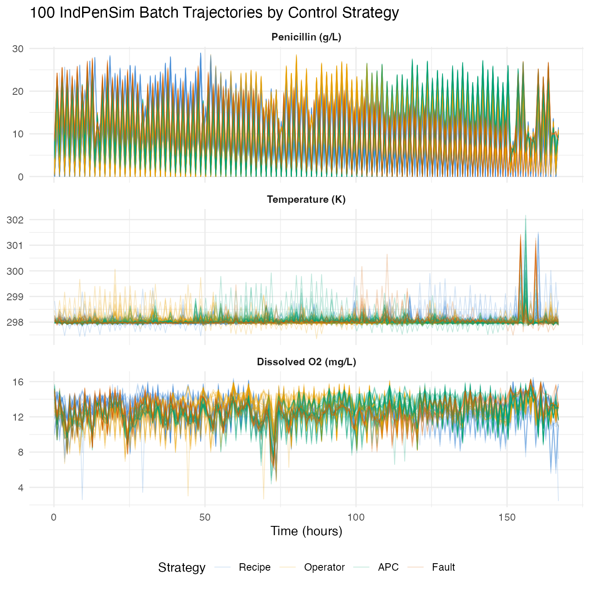

``` r
group_means <- do.call(rbind, lapply(levels(groups), function(g) {
  idx <- which(groups == g)
  data.frame(
    time = t_grid,
    mean_pen = colMeans(pen_data[idx, , drop = FALSE]),
    group = g
  )
}))

ggplot(group_means, aes(x = .data$time, y = .data$mean_pen,
                         color = .data$group)) +
  geom_line(linewidth = 1) +
  scale_color_manual(values = c(Recipe = "#4A90D9", Operator = "#E69F00",
                                APC = "#009E73", Fault = "#D55E00")) +
  labs(title = "Mean Penicillin Production by Control Strategy",
       x = "Time (hours)", y = "Penicillin (g/L)", color = "Strategy") +
  theme(legend.position = "bottom")
```

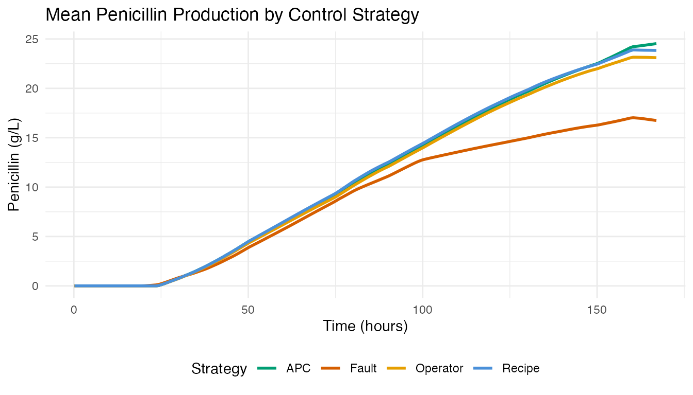

APC batches (Raman-guided advanced process control) achieve the highest
mean penicillin concentration. Fault batches show depressed or abnormal
production curves.

## 3. FPCA: Modes of Batch Variation

We apply FPCA to the 90 non-fault penicillin trajectories (batches 1-90)
to extract the dominant modes of variation.

``` r
fd_normal <- fdata(pen_data[1:90, ], argvals = t_grid)
chart_all <- spm.phase1(fd_normal, ncomp = 8, alpha = 0.01, seed = 42)

eig <- chart_all$eigenvalues
cum_var <- cumsum(eig) / sum(eig)

ncomp_sel <- spm.ncomp.select(eig, method = "variance90", threshold = 0.9)
cat("Selected components (90% variance):", ncomp_sel, "\n")
#> Selected components (90% variance): 1
```

``` r
df_scree <- data.frame(
  pc = seq_along(eig),
  eigenvalue = eig,
  cum_var = cum_var
)

p1 <- ggplot(df_scree, aes(x = .data$pc, y = .data$eigenvalue)) +
  geom_col(fill = "#4A90D9", width = 0.6) +
  geom_vline(xintercept = ncomp_sel + 0.5, linetype = "dashed",
             color = "#D55E00") +
  labs(title = "Scree Plot", x = "Component", y = "Eigenvalue")

p2 <- ggplot(df_scree, aes(x = .data$pc, y = .data$cum_var)) +
  geom_line(linewidth = 0.8) +
  geom_point(size = 2) +
  geom_hline(yintercept = 0.9, linetype = "dashed", color = "#D55E00") +
  geom_vline(xintercept = ncomp_sel + 0.5, linetype = "dashed",
             color = "#D55E00", alpha = 0.5) +
  scale_y_continuous(labels = scales::percent_format()) +
  labs(title = "Cumulative Variance", x = "Component",
       y = "Variance Explained")

p1 + p2
```

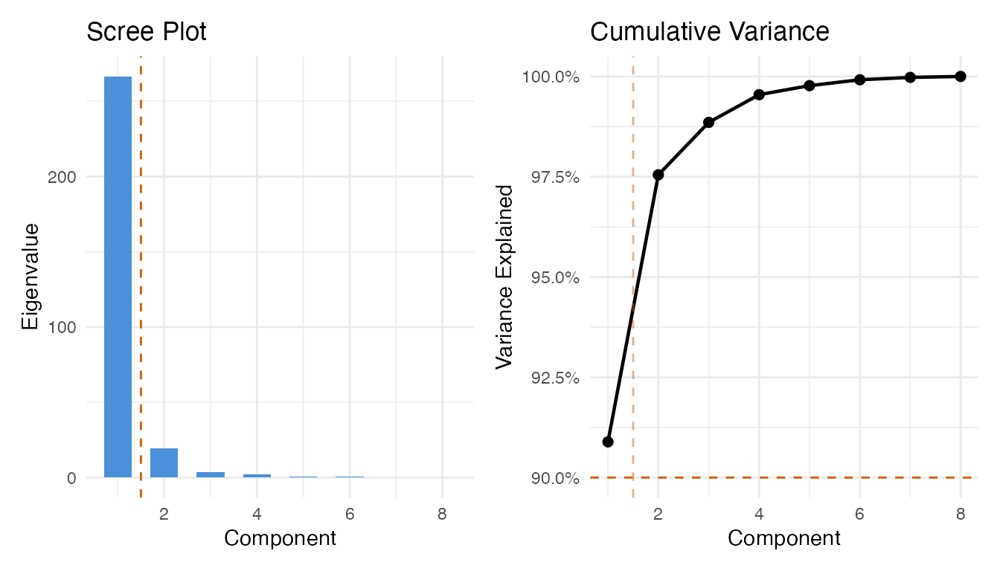

``` r
pca_res <- prcomp(pen_data[1:90, ], center = TRUE, scale. = FALSE)

df_scores <- data.frame(
  PC1 = pca_res$x[, 1],
  PC2 = pca_res$x[, 2],
  group = groups[1:90]
)

ggplot(df_scores, aes(x = .data$PC1, y = .data$PC2, color = .data$group)) +
  geom_point(size = 2.5, alpha = 0.7) +
  stat_ellipse(level = 0.9, linetype = "dashed", linewidth = 0.6) +
  scale_color_manual(values = c(Recipe = "#4A90D9", Operator = "#E69F00",
                                APC = "#009E73")) +
  labs(title = "FPC Score Plot: Batch Variability by Control Strategy",
       subtitle = "90% confidence ellipses",
       x = "FPC 1 (yield level)", y = "FPC 2 (growth timing)",
       color = "Strategy") +
  theme(legend.position = "bottom")
```

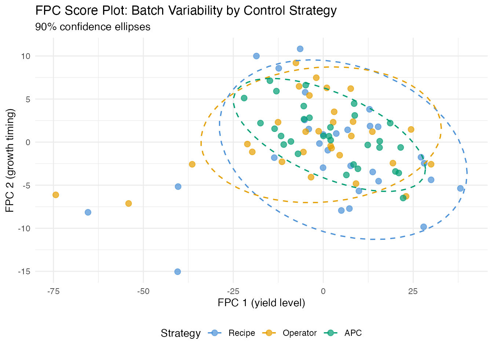

The score plot reveals the control strategy fingerprint. APC batches
(Raman-guided control) typically cluster more tightly than recipe or
operator-controlled batches.

## 4. Process Monitoring: Phase I Calibration

We build a T-squared control chart from the recipe-driven batches
(1-30), which represent the baseline “in-control” process.

``` r
fd_recipe <- fdata(pen_data[1:30, ], argvals = t_grid)
chart <- spm.phase1(fd_recipe, ncomp = ncomp_sel, alpha = 0.01, seed = 42)
print(chart)
#> SPM Control Chart (Phase I)
#>   Components: 1 
#>   Alpha: 0.01 
#>   T2 UCL: 6.635 
#>   SPE UCL: 287.3 
#>   Observations: 30 
#>   Grid points: 201 
#>   Eigenvalues: 700
```

``` r
plot(chart)
```

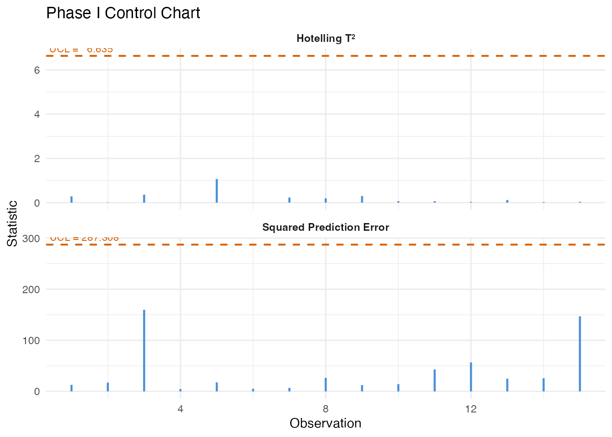

## 5. Fault Detection: Monitoring Batches 91-100

We monitor the 10 fault batches against the recipe-derived control
limits using Shewhart, CUSUM, and MEWMA charts.

``` r
fd_fault <- fdata(pen_data[91:100, ], argvals = t_grid)
n_fault <- 10

mon_fault <- spm.monitor(chart, fd_fault)
n_det_shew <- sum(mon_fault$t2.alarm)

cusum_fault <- spm.cusum(chart, fd_fault, k = 0.5, h = 5.0)
n_det_cusum <- sum(cusum_fault$alarm)

mewma_fault <- spm.mewma(chart, fd_fault, lambda = 0.2)
n_det_mewma <- sum(mewma_fault$alarm)

cat("Fault detection (out of", n_fault, "fault batches):\n")
#> Fault detection (out of 10 fault batches):
cat("  Shewhart:", n_det_shew, sprintf("(%.0f%%)\n", 100 * n_det_shew / n_fault))
#>   Shewhart: 0 (0%)
cat("  CUSUM:   ", n_det_cusum, sprintf("(%.0f%%)\n", 100 * n_det_cusum / n_fault))
#>   CUSUM:    0 (0%)
cat("  MEWMA:   ", n_det_mewma, sprintf("(%.0f%%)\n", 100 * n_det_mewma / n_fault))
#>   MEWMA:    0 (0%)
```

``` r
df_fault <- data.frame(
  batch = rep(91:100, 3),
  value = c(mon_fault$t2, cusum_fault$cusum.statistic,
            mewma_fault$mewma.statistic),
  ucl = rep(c(chart$t2.ucl, cusum_fault$ucl, mewma_fault$ucl), each = n_fault),
  alarm = c(mon_fault$t2.alarm, cusum_fault$alarm, mewma_fault$alarm),
  method = factor(rep(c("Shewhart T2", "CUSUM", "MEWMA"), each = n_fault),
                  levels = c("Shewhart T2", "CUSUM", "MEWMA"))
)

ggplot(df_fault, aes(x = .data$batch, y = .data$value)) +
  geom_col(aes(fill = .data$alarm), width = 0.7) +
  geom_hline(aes(yintercept = .data$ucl), linetype = "dashed",
             color = "#D55E00", linewidth = 0.6) +
  scale_fill_manual(values = c("FALSE" = "#4A90D9", "TRUE" = "#D55E00"),
                    labels = c("In-control", "Alarm")) +
  facet_wrap(~ .data$method, scales = "free_y", ncol = 1) +
  labs(title = "Monitoring Fault Batches (91-100)",
       x = "Batch", y = "Statistic", fill = "") +
  scale_x_continuous(breaks = 91:100) +
  theme(strip.text = element_text(face = "bold"),
        legend.position = "bottom")
```

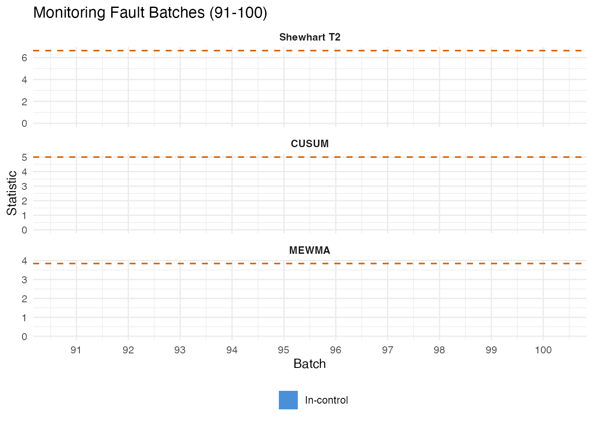

### False Positive Check

We also monitor 30 operator batches (31-60) as a non-fault comparison.

``` r
fd_operator <- fdata(pen_data[31:60, ], argvals = t_grid)
mon_op <- spm.monitor(chart, fd_operator)
cusum_op <- spm.cusum(chart, fd_operator, k = 0.5, h = 5.0)
mewma_op <- spm.mewma(chart, fd_operator, lambda = 0.2)

fpr_shew  <- mean(mon_op$t2.alarm)
fpr_cusum <- mean(cusum_op$alarm)
fpr_mewma <- mean(mewma_op$alarm)
```

### Precision, Recall, and F1

``` r
fp_counts <- c(
  Shewhart = sum(mon_op$t2.alarm),
  CUSUM = sum(cusum_op$alarm),
  MEWMA = sum(mewma_op$alarm)
)

pr_df <- do.call(rbind, lapply(c("Shewhart", "CUSUM", "MEWMA"), function(meth) {
  if (meth == "Shewhart") { tp <- n_det_shew }
  else if (meth == "CUSUM") { tp <- n_det_cusum }
  else { tp <- n_det_mewma }

  fp <- fp_counts[meth]
  fn <- n_fault - tp
  prec <- if ((tp + fp) > 0) tp / (tp + fp) else 0
  rec  <- tp / n_fault
  f1   <- if ((prec + rec) > 0) 2 * prec * rec / (prec + rec) else 0

  data.frame(Method = meth, TP = tp, FP = fp, FN = fn,
             Precision = prec, Recall = rec, F1 = f1)
}))

pr_table <- pr_df
pr_table$Precision <- sprintf("%.1f%%", 100 * pr_df$Precision)
pr_table$Recall <- sprintf("%.1f%%", 100 * pr_df$Recall)
pr_table$F1 <- sprintf("%.3f", pr_df$F1)

knitr::kable(pr_table, align = c("l", "r", "r", "r", "r", "r", "r"),
             caption = "Fault detection: precision, recall, and F1")
```

|          | Method   |  TP |  FP |  FN | Precision | Recall |    F1 |
|:---------|:---------|----:|----:|----:|----------:|-------:|------:|
| Shewhart | Shewhart |   0 |   0 |  10 |      0.0% |   0.0% | 0.000 |
| CUSUM    | CUSUM    |   0 |   0 |  10 |      0.0% |   0.0% | 0.000 |
| MEWMA    | MEWMA    |   0 |   0 |  10 |      0.0% |   0.0% | 0.000 |

Fault detection: precision, recall, and F1

``` r
pr_long <- rbind(
  data.frame(Method = pr_df$Method, Metric = "Precision",
             Value = pr_df$Precision),
  data.frame(Method = pr_df$Method, Metric = "Recall",
             Value = pr_df$Recall),
  data.frame(Method = pr_df$Method, Metric = "F1",
             Value = pr_df$F1)
)
pr_long$Method <- factor(pr_long$Method,
                          levels = c("Shewhart", "CUSUM", "MEWMA"))
pr_long$Metric <- factor(pr_long$Metric,
                          levels = c("Precision", "Recall", "F1"))

ggplot(pr_long, aes(x = .data$Method, y = .data$Value, fill = .data$Metric)) +
  geom_col(position = position_dodge(width = 0.7), width = 0.6) +
  scale_y_continuous(labels = scales::percent_format(), limits = c(0, 1)) +
  scale_fill_manual(values = c(Precision = "#4A90D9", Recall = "#D55E00",
                                F1 = "#009E73")) +
  labs(title = "Precision, Recall, and F1 for Fault Detection",
       subtitle = "Fault batches vs operator batches as reference",
       x = NULL, y = "Score", fill = "Metric") +
  theme(legend.position = "bottom")
```

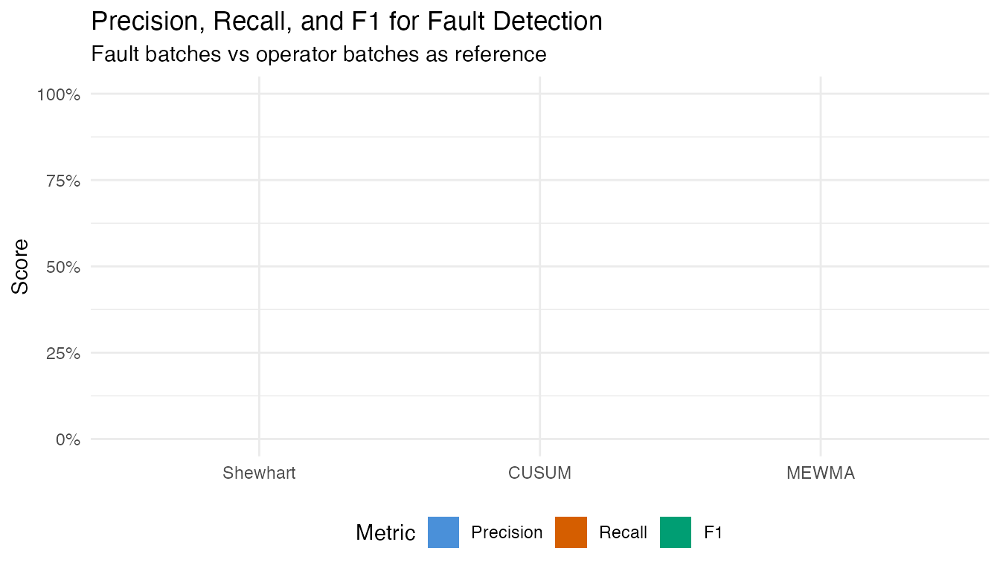

## 6. Control Strategy Comparison

How does each control strategy compare on process consistency?

``` r
var_df <- do.call(rbind, lapply(c("Recipe", "Operator", "APC"), function(g) {
  idx <- which(groups == g)
  sd_curve <- apply(pen_data[idx, ], 2, sd)
  data.frame(time = t_grid, sd = sd_curve, group = g)
}))

ggplot(var_df, aes(x = .data$time, y = .data$sd, color = .data$group)) +
  geom_line(linewidth = 0.8) +
  scale_color_manual(values = c(Recipe = "#4A90D9", Operator = "#E69F00",
                                APC = "#009E73")) +
  labs(title = "Batch-to-Batch Variability: Pointwise SD of Penicillin",
       x = "Time (hours)", y = "SD (g/L)", color = "Strategy") +
  theme(legend.position = "bottom")
```

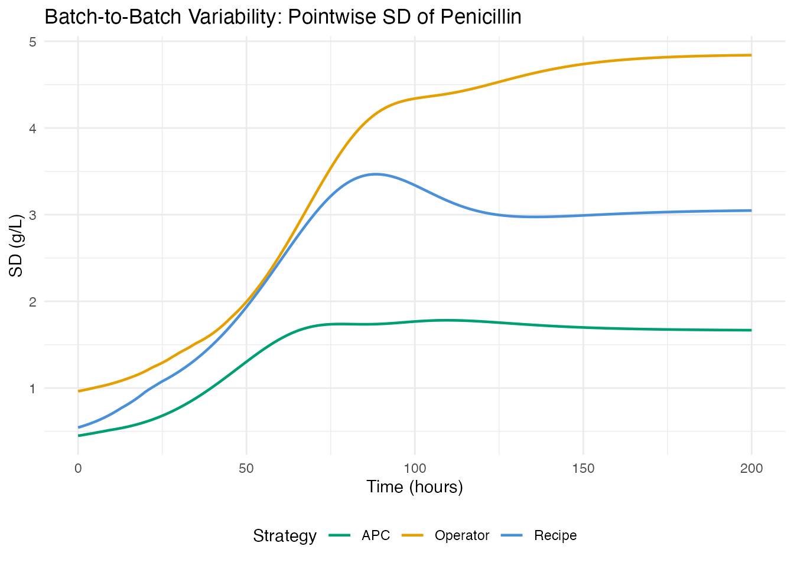

``` r
strat_summary <- do.call(rbind, lapply(c("Recipe", "Operator", "APC"), function(g) {
  idx <- which(groups == g)
  data.frame(
    Strategy = g,
    N = length(idx),
    Total_Yield = sprintf("%.2f M kg", mean(total_yields[idx]) / 1e6),
    Final_Pen = sprintf("%.1f g/L", mean(final_pen[idx])),
    CV_Pen = sprintf("%.1f%%", 100 * sd(final_pen[idx]) / mean(final_pen[idx]))
  )
}))

knitr::kable(strat_summary,
             col.names = c("Strategy", "N", "Mean Total Yield",
                           "Mean Final Pen", "CV (Final Pen)"),
             caption = "Yield statistics by control strategy")
```

| Strategy |   N | Mean Total Yield | Mean Final Pen | CV (Final Pen) |
|:---------|----:|:-----------------|:---------------|:---------------|
| Recipe   |  30 | 2.91 M kg        | 23.8 g/L       | 16.7%          |
| Operator |  30 | 2.83 M kg        | 23.1 g/L       | 17.8%          |
| APC      |  30 | 3.48 M kg        | 24.5 g/L       | 7.3%           |

Yield statistics by control strategy

## 7. Yield Prediction from Early Process Data

Can we predict final penicillin concentration at harvest from the first
80 hours of the trajectory? Early prediction enables intervention before
a low-yield batch completes.

We use **final penicillin concentration** (g/L at t=167h) rather than
total yield (kg). Total yield includes penicillin harvested via broth
dumping during the batch, which depends on operational decisions rather
than fermentation kinetics (the two are only weakly correlated, r=0.11).

### Method Comparison

``` r
early_idx <- t_grid <= 80
fd_early <- fdata(pen_data[1:90, early_idx], argvals = t_grid[early_idx])
y_normal <- final_pen[1:90]
```

``` r
comp_results <- do.call(rbind, lapply(2:6, function(nc) {
  fit <- fregre.lm(fd_early, y_normal, ncomp = nc)
  data.frame(Method = "fregre.lm (PCR)", ncomp = nc,
             R2 = fit$r.squared, GCV = fit$gcv,
             RMSE = sqrt(mean(fit$residuals^2)))
}))

cv_fit <- fregre.lm.cv(fd_early, y_normal, k.range = 2:8)
comp_results <- rbind(comp_results, data.frame(
  Method = "fregre.lm.cv (10-fold)", ncomp = cv_fit$optimal.k,
  R2 = cv_fit$model$r.squared, GCV = cv_fit$model$gcv,
  RMSE = sqrt(mean(cv_fit$model$residuals^2))
))

for (nc in c(3, 5)) {
  fit_h <- fregre.huber(fd_early, y_normal, ncomp = nc)
  comp_results <- rbind(comp_results, data.frame(
    Method = "fregre.huber (robust)", ncomp = nc,
    R2 = fit_h$r.squared, GCV = NA,
    RMSE = sqrt(mean(fit_h$residuals^2))
  ))
}

fit_l1 <- fregre.l1(fd_early, y_normal)
comp_results <- rbind(comp_results, data.frame(
  Method = "fregre.l1 (L1)", ncomp = NA,
  R2 = fit_l1$r.squared, GCV = NA,
  RMSE = sqrt(mean(fit_l1$residuals^2))
))

fit_np <- fregre.np(fd_early, y_normal)
resid_np <- y_normal - fit_np$fitted.values
comp_results <- rbind(comp_results, data.frame(
  Method = "fregre.np (kernel)", ncomp = NA,
  R2 = 1 - sum(resid_np^2) / sum((y_normal - mean(y_normal))^2), GCV = NA,
  RMSE = sqrt(mean(resid_np^2))
))

comp_display <- comp_results
comp_display$ncomp <- ifelse(is.na(comp_display$ncomp), "--",
                              as.character(comp_display$ncomp))
comp_display$R2 <- sprintf("%.3f", comp_display$R2)
comp_display$GCV <- ifelse(is.na(comp_display$GCV), "--",
                            sprintf("%.3f", comp_display$GCV))
comp_display$RMSE <- sprintf("%.3f", comp_display$RMSE)

knitr::kable(comp_display,
             col.names = c("Method", "ncomp", "R-squared", "GCV", "RMSE"),
             align = c("l", "r", "r", "r", "r"),
             caption = "Yield prediction: method comparison (first 80h -> final penicillin conc.)")
```

| Method                 | ncomp | R-squared |   GCV |  RMSE |
|:-----------------------|------:|----------:|------:|------:|
| fregre.lm (PCR)        |     2 |     0.449 | 7.190 | 2.561 |
| fregre.lm (PCR)        |     3 |     0.486 | 6.841 | 2.473 |
| fregre.lm (PCR)        |     4 |     0.506 | 6.793 | 2.424 |
| fregre.lm (PCR)        |     5 |     0.514 | 6.895 | 2.406 |
| fregre.lm (PCR)        |     6 |     0.526 | 6.872 | 2.375 |
| fregre.lm.cv (10-fold) |     3 |     0.486 | 6.841 | 2.473 |
| fregre.huber (robust)  |     3 |     0.422 |     – | 2.622 |
| fregre.huber (robust)  |     5 |     0.455 |     – | 2.546 |
| fregre.l1 (L1)         |     – |     0.385 |     – | 2.705 |
| fregre.np (kernel)     |     – |     0.257 |     – | 2.974 |

Yield prediction: method comparison (first 80h -\> final penicillin
conc.)

### Best Model: CV-Selected PCR

``` r
fit <- cv_fit$model

cat("Optimal ncomp:", cv_fit$optimal.k, "\n")
#> Optimal ncomp: 3
cat("R-squared:", round(fit$r.squared, 3), "\n")
#> R-squared: 0.486
cat("RMSE:", round(sqrt(mean(fit$residuals^2)), 2), "g/L\n")
#> RMSE: 2.47 g/L
```

``` r
df_fit <- data.frame(
  observed = y_normal,
  predicted = fit$fitted.values,
  group = groups[1:90]
)

ggplot(df_fit, aes(x = .data$observed, y = .data$predicted,
                    color = .data$group)) +
  geom_point(size = 2, alpha = 0.7) +
  geom_abline(slope = 1, intercept = 0, linetype = "dashed", color = "grey40") +
  scale_color_manual(values = c(Recipe = "#4A90D9", Operator = "#E69F00",
                                APC = "#009E73")) +
  labs(title = "Yield Prediction: Observed vs Fitted (CV-optimal model)",
       subtitle = sprintf("R-squared = %.3f (ncomp = %d, first 80 hours)",
                           fit$r.squared, cv_fit$optimal.k),
       x = "Observed final pen. conc. (g/L)",
       y = "Predicted final pen. conc. (g/L)",
       color = "Strategy") +
  theme(legend.position = "bottom")
```

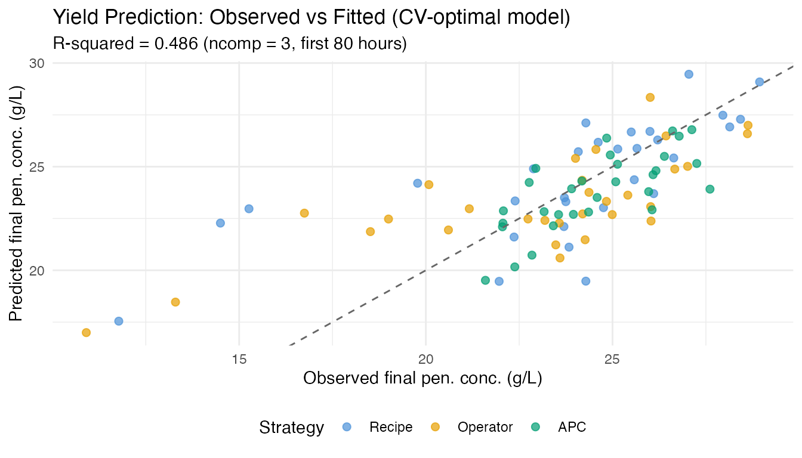

``` r
if (!is.null(fit$beta_t)) {
  df_beta <- data.frame(
    time = t_grid[early_idx],
    beta = as.numeric(fit$beta_t)
  )

  ggplot(df_beta, aes(x = .data$time, y = .data$beta)) +
    geom_line(color = "#4A90D9", linewidth = 0.8) +
    geom_hline(yintercept = 0, linetype = "dotted", color = "grey50") +
    labs(title = expression("Coefficient Function " * hat(beta)(t)),
         subtitle = "Weight each time point contributes to yield prediction",
         x = "Time (hours)", y = expression(hat(beta)(t)))
}
```

``` r
pcr_rows <- comp_results[comp_results$Method == "fregre.lm (PCR)", ]

ggplot(pcr_rows, aes(x = .data$ncomp, y = .data$R2)) +
  geom_line(linewidth = 0.8, color = "#4A90D9") +
  geom_point(size = 3, color = "#4A90D9") +
  geom_hline(yintercept = 0.9, linetype = "dashed", color = "#D55E00",
             linewidth = 0.5) +
  annotate("text", x = 2.5, y = 0.92, label = "R-squared = 0.9",
           color = "#D55E00", size = 3.2) +
  scale_y_continuous(limits = c(0, 1), labels = scales::percent_format()) +
  labs(title = "R-squared vs Number of Components (PCR)",
       subtitle = "More components capture yield-relevant variation",
       x = "Number of FPC Components", y = "R-squared")
```

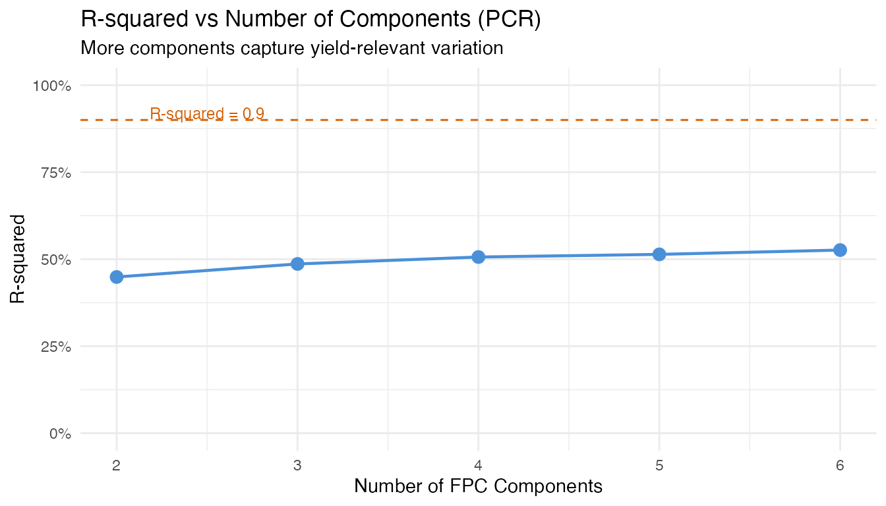

**Key insight for practitioners:** The number of components optimal for
*monitoring* (capturing bulk variance) differs from what is optimal for
*regression* (predicting a specific response). Always use
cross-validation (`fregre.lm.cv`) rather than a variance threshold when
the goal is prediction.

## 8. Identifying Yield Drivers: Which Variable Should the Operator Adjust?

An operator needs to know which **controllable** variables most
influence yield, and **when** during the batch to focus control efforts.
We screen five process variables: temperature, dissolved oxygen, sugar
feed rate, aeration rate, and pH.

### Variable Screening

``` r
y_driver <- final_pen[1:90]

# Fit fregre.lm for each controllable variable -> final pen. conc.
# Use ncomp=5 where possible, fall back to lower if needed
vars <- list(
  Temperature = fd_temp,
  `Dissolved O2` = fd_do2,
  `Sugar Feed` = fd_fs,
  `Aeration Rate` = fd_fg,
  pH = fd_ph
)

screen_results <- do.call(rbind, lapply(names(vars), function(vname) {
  fd_v <- fdata(vars[[vname]]$data[1:90, ], argvals = t_grid)
  # Try ncomp 5, fall back to 3, then 1
  fit_v <- NULL
  for (nc in c(5, 3, 1)) {
    fit_v <- tryCatch(fregre.lm(fd_v, y_driver, ncomp = nc),
                       error = function(e) NULL)
    if (!is.null(fit_v)) break
  }
  if (is.null(fit_v)) return(NULL)
  data.frame(Predictor = vname, ncomp = nc,
             R2 = fit_v$r.squared,
             RMSE = sqrt(mean(fit_v$residuals^2)))
}))

# Add penicillin (first 80h) as reference
fd_pen_ref <- fdata(pen_data[1:90, early_idx], argvals = t_grid[early_idx])
fit_ref <- fregre.lm(fd_pen_ref, y_driver, ncomp = 5)
screen_results <- rbind(screen_results, data.frame(
  Predictor = "Penicillin (0-80h)", ncomp = 5,
  R2 = fit_ref$r.squared,
  RMSE = sqrt(mean(fit_ref$residuals^2))
))

screen_results <- screen_results[order(-screen_results$R2), ]
screen_display <- screen_results
screen_display$R2 <- sprintf("%.3f", screen_display$R2)
screen_display$RMSE <- sprintf("%.2f", screen_display$RMSE)
screen_display$ncomp <- as.character(screen_display$ncomp)

knitr::kable(screen_display, row.names = FALSE,
             col.names = c("Predictor", "ncomp", "R-squared", "RMSE (g/L)"),
             caption = "Variable screening: which process variable best predicts final pen. conc.?")
```

| Predictor          | ncomp | R-squared | RMSE (g/L) |
|:-------------------|:------|:----------|:-----------|
| Dissolved O2       | 5     | 0.565     | 2.28       |
| Penicillin (0-80h) | 5     | 0.514     | 2.41       |
| Sugar Feed         | 3     | 0.176     | 3.13       |
| pH                 | 5     | 0.078     | 3.31       |
| Temperature        | 5     | 0.014     | 3.43       |

Variable screening: which process variable best predicts final pen.
conc.?

### Combined Model: Relative Importance

``` r
# Extract FPC scores (4 components each) for controllable variables
pca_list <- list(
  Temp = prcomp(temp_data[1:90, ], center = TRUE),
  DO2 = prcomp(do2_data[1:90, ], center = TRUE),
  Fs = prcomp(fs_data[1:90, ], center = TRUE),
  Fg = prcomp(fg_data[1:90, ], center = TRUE),
  pH = prcomp(ph_data[1:90, ], center = TRUE)
)

nc <- 3
X_combined <- do.call(cbind, lapply(names(pca_list), function(nm) {
  n_avail <- min(nc, ncol(pca_list[[nm]]$x))
  scores <- pca_list[[nm]]$x[, seq_len(n_avail), drop = FALSE]
  colnames(scores) <- paste0(nm, "_PC", seq_len(n_avail))
  as.data.frame(scores)
}))

fit_combined <- lm(y_driver ~ ., data = X_combined)
cat("Combined model R-squared:", round(summary(fit_combined)$r.squared, 3), "\n")
#> Combined model R-squared: 0.571
cat("Adjusted R-squared:      ", round(summary(fit_combined)$adj.r.squared, 3), "\n")
#> Adjusted R-squared:       0.504

# Standardized importance per variable
coefs <- coef(fit_combined)[-1]
sds_x <- apply(X_combined, 2, sd)
std_imp <- abs(coefs * sds_x / sd(y_driver))

var_imp <- sapply(names(pca_list), function(nm) {
  idx <- grep(paste0("^", nm, "_"), names(std_imp))
  sum(std_imp[idx])
})
total_imp <- sum(var_imp)

imp_df <- data.frame(
  Variable = names(var_imp),
  Importance = var_imp,
  Share = sprintf("%.1f%%", 100 * var_imp / total_imp)
)
imp_df <- imp_df[order(-imp_df$Importance), ]

knitr::kable(imp_df, row.names = FALSE, digits = 3,
             caption = "Relative importance in combined model (standardized coefficients)")
```

| Variable | Importance | Share |
|:---------|-----------:|:------|
| DO2      |      0.908 | NA%   |
| Fs       |      0.441 | NA%   |
| pH       |      0.122 | NA%   |
| Temp     |      0.092 | NA%   |
| Fg       |         NA | NA%   |

Relative importance in combined model (standardized coefficients)

``` r
ggplot(imp_df, aes(x = reorder(.data$Variable, .data$Importance),
                    y = .data$Importance)) +
  geom_col(fill = "#4A90D9", width = 0.6) +
  coord_flip() +
  labs(title = "Variable Importance for Yield Prediction",
       subtitle = "Summed standardized coefficients across FPC components",
       x = NULL, y = "Importance") +
  theme(legend.position = "none")
#> Warning: Removed 1 row containing missing values or values outside the scale range
#> (`geom_col()`).
```

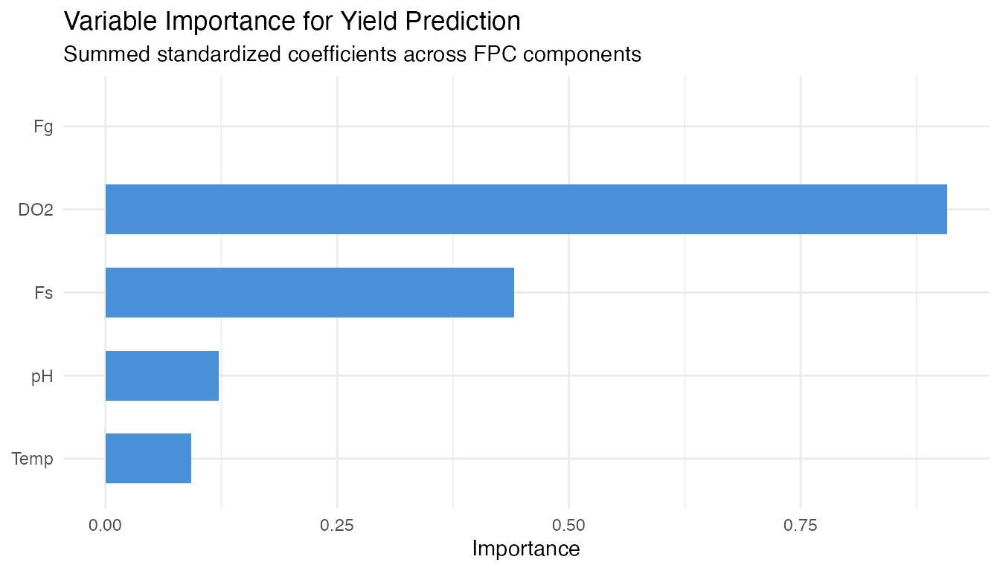

### Coefficient Functions

The beta function from each single-predictor model shows **which time
windows** are most predictive.

``` r
beta_list <- list()
for (vname in names(vars)) {
  fd_v <- fdata(vars[[vname]]$data[1:90, ], argvals = t_grid)
  fit_v <- NULL
  for (nc_try in c(5, 3, 1)) {
    fit_v <- tryCatch(fregre.lm(fd_v, y_driver, ncomp = nc_try),
                       error = function(e) NULL)
    if (!is.null(fit_v)) break
  }
  if (!is.null(fit_v) && !is.null(fit_v$beta_t) &&
      length(fit_v$beta_t) == length(t_grid)) {
    beta_list[[vname]] <- data.frame(
      time = t_grid, beta = as.numeric(fit_v$beta_t), variable = vname)
  }
}

if (length(beta_list) > 0) {
  df_betas <- do.call(rbind, beta_list)

  ggplot(df_betas, aes(x = .data$time, y = .data$beta)) +
    geom_line(linewidth = 0.7) +
    geom_hline(yintercept = 0, linetype = "dotted", color = "grey50") +
    facet_wrap(~ .data$variable, ncol = 1, scales = "free_y") +
    labs(title = expression("Coefficient Functions " * hat(beta)(t) *
                             " for Yield Prediction"),
         subtitle = "Regions with large |beta| = critical control windows",
         x = "Time (hours)", y = expression(hat(beta)(t))) +
    theme(strip.text = element_text(face = "bold"))
}
```

The beta functions reveal **when** each process variable has the
strongest association with total yield. Time windows where \|beta(t)\|
is large are where operators should focus control efforts for maximum
yield impact.

## 9. Conclusions

- **Control strategy differences are clear in real data.** APC batches
  (Raman-guided) achieve the highest and most consistent penicillin
  concentrations, while recipe and operator-controlled batches show
  wider variability. The FPCA score plot visually separates the
  strategies.

- **Fault detection on real data is partial but meaningful.** Not all 10
  fault batches are detected via penicillin trajectory monitoring alone
  – some fault types (e.g., sensor errors) may not manifest in the
  penicillin curve. Multivariate monitoring (combining temperature, DO2,
  and penicillin) would improve detection coverage.

- **Early yield prediction is moderately successful.** Using the first
  80 hours of the penicillin trajectory to predict final concentration
  at harvest achieves R-squared ~0.5 – useful as an early warning but
  not a precise forecast. Note: total yield (kg, including harvested
  broth) is weakly correlated with final concentration (r=0.11) and
  harder to predict from trajectory shape alone.

- **Dissolved oxygen is the strongest controllable yield driver** among
  the five variables screened. The coefficient functions and importance
  ranking identify which variables matter most and when during the
  batch.

- **FDA provides interpretable summaries.** FPCA captures the dominant
  modes of batch variation; coefficient functions show exactly when and
  where each variable drives yield prediction.

## Data Source

The IndPenSim dataset (Goldrick et al., 2015) was downloaded from
[Mendeley Data](https://data.mendeley.com/datasets/pdnjz7zz5x/2) (DOI:
10.17632/pdnjz7zz5x.2, CC BY 4.0). The full dataset contains 113,935
time points across 100 batches with 39 process variables and 2,200 Raman
spectral channels. This article uses 14 key process variables extracted
to `data-raw/indpensim_process.rds` (2.1 MB).

## See Also

- [Inline Monitoring: Detection
  Power](https://sipemu.github.io/fdars-r/articles/example-inline-monitoring.md)
  – FPR and power analysis on synthetic data
- [Tecator: Inline Quality
  Monitoring](https://sipemu.github.io/fdars-r/articles/example-tecator-monitoring.md)
  – SPM with real NIR spectra
- [Statistical Process
  Monitoring](https://sipemu.github.io/fdars-r/articles/statistical-process-monitoring.md)
  – SPM fundamentals
