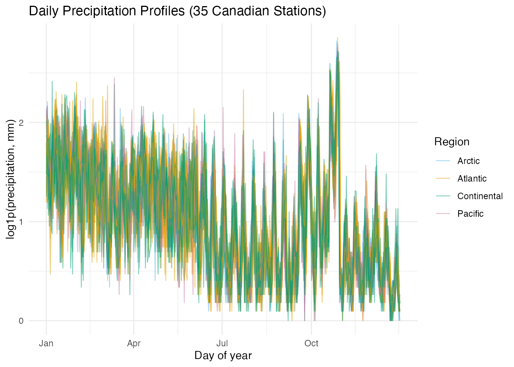
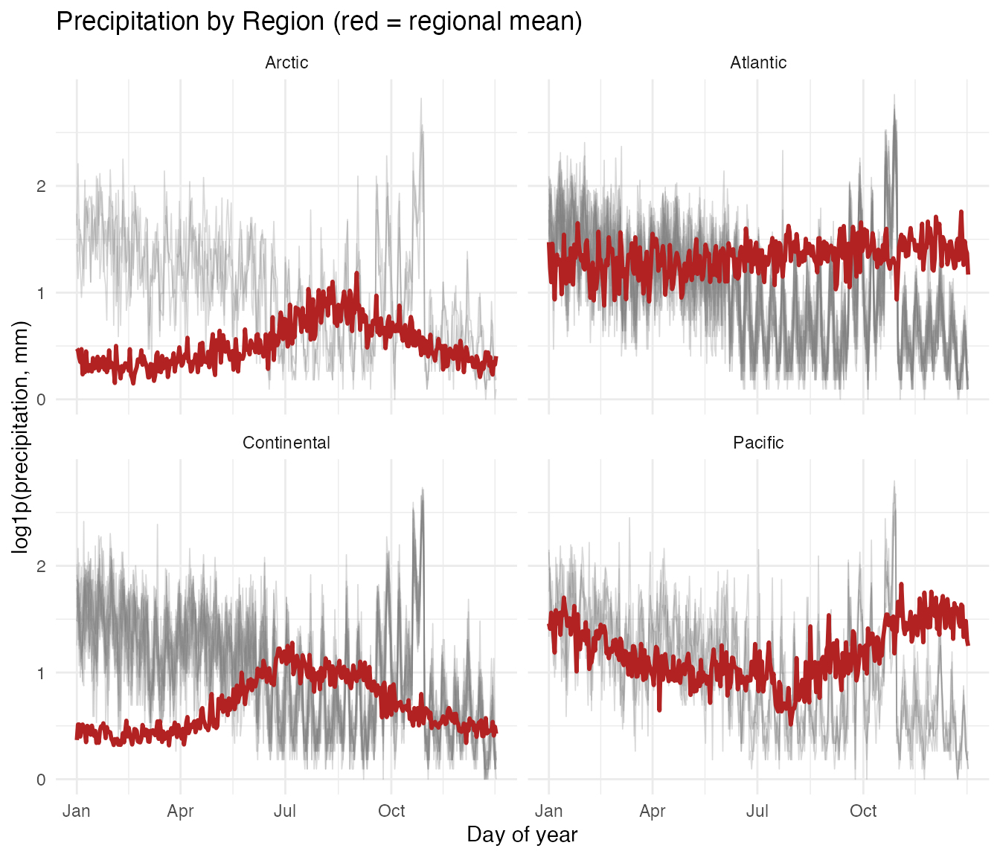
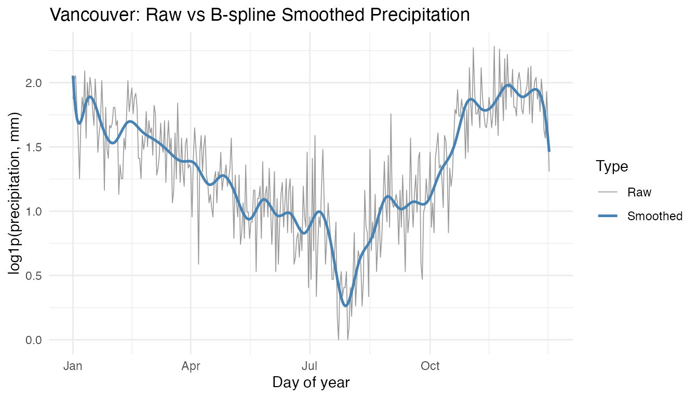
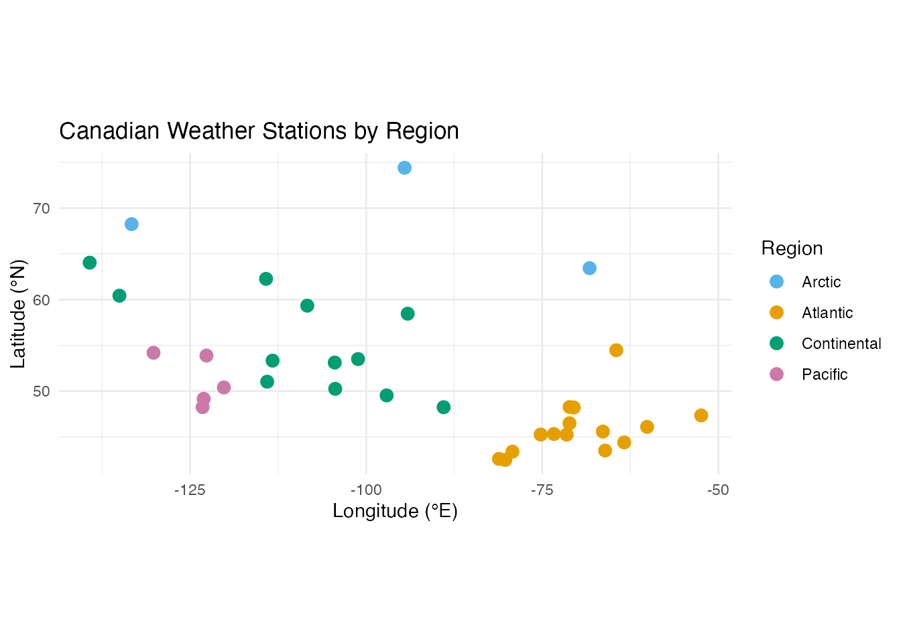
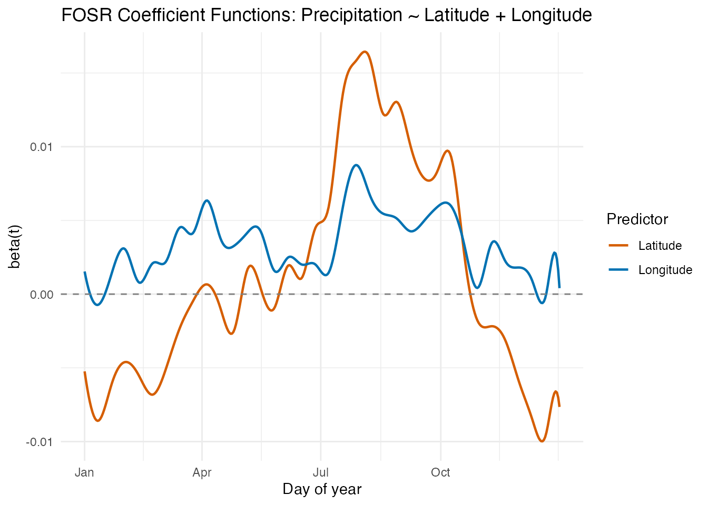
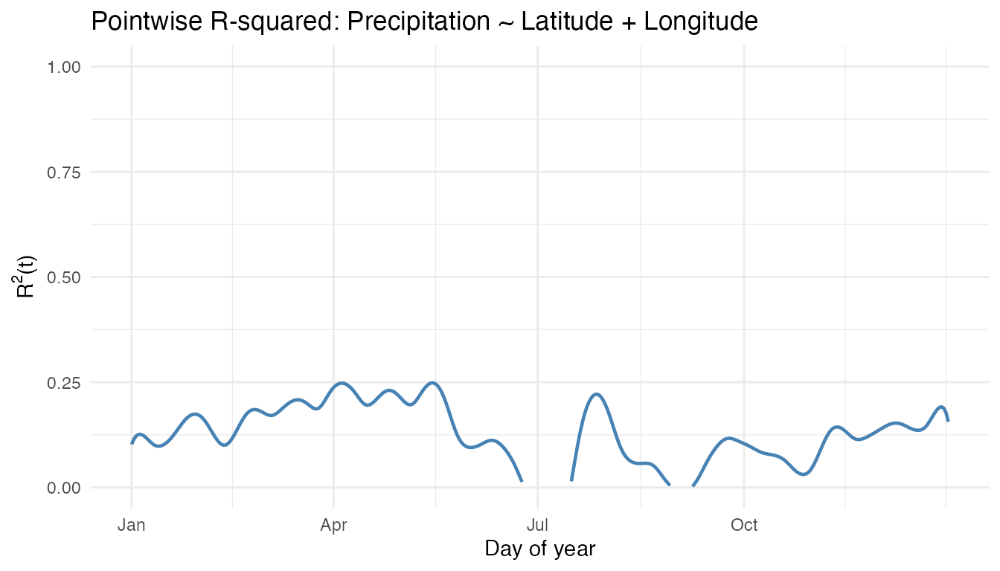
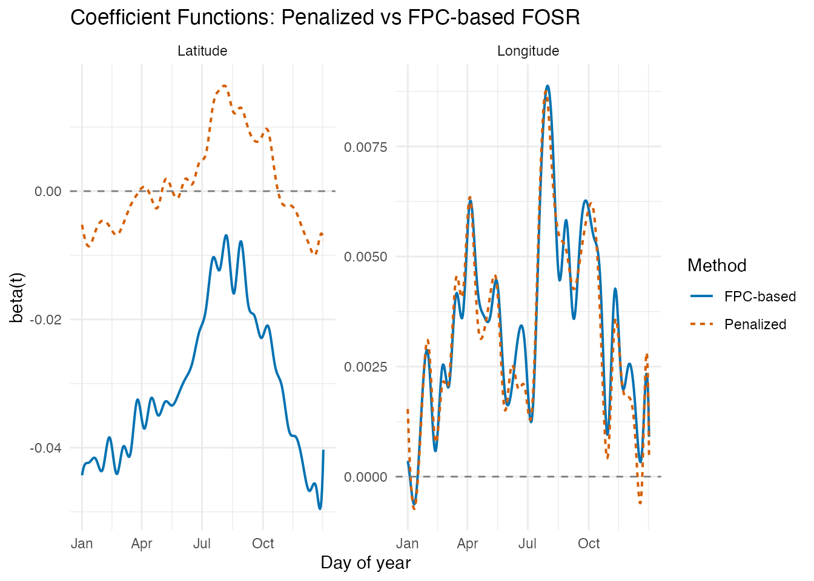
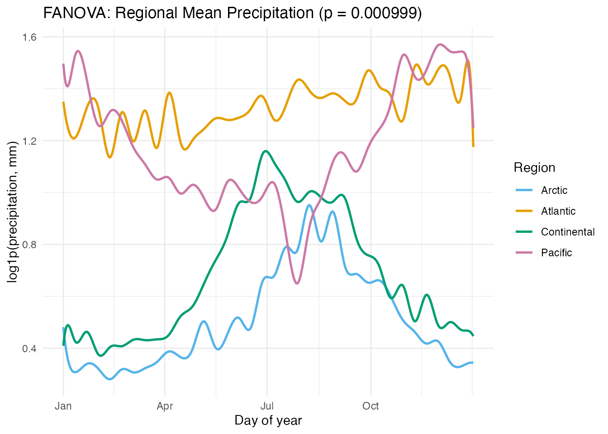
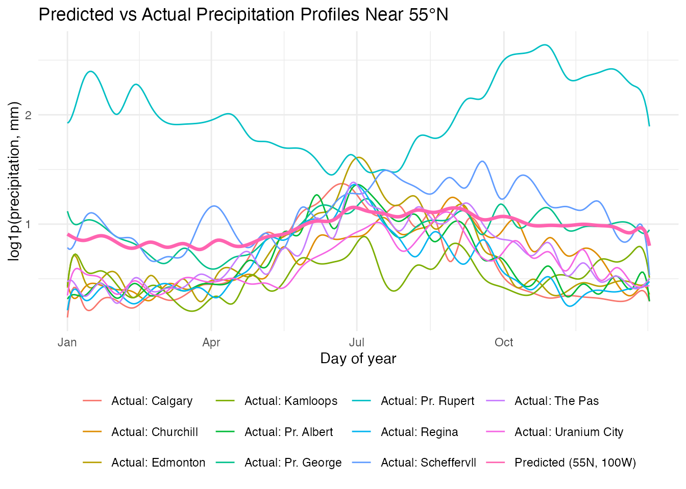
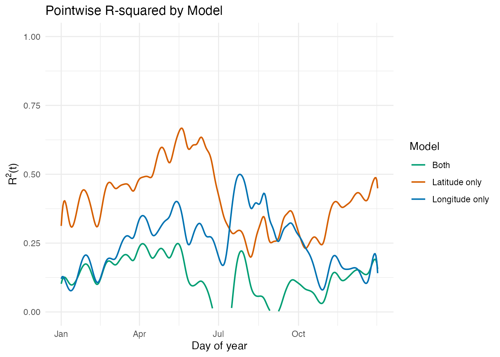

# Canadian Precipitation: Geographic Effects on Rainfall Profiles

Precipitation across Canada varies dramatically with geography. Pacific
stations receive heavy winter rain from moisture-laden air masses off
the ocean, Continental stations see summer-dominated convective
rainfall, and Arctic stations remain dry year-round. This article uses
function-on-scalar regression and functional ANOVA to quantify how
latitude and longitude shape daily precipitation profiles.

| Step              | What It Does                                        | Outcome                                                    |
|-------------------|-----------------------------------------------------|------------------------------------------------------------|
| Data preparation  | Load 35 stations, log-transform daily precipitation | `fdata` object with 365-day curves                         |
| Regional patterns | Faceted plots by region with mean overlays          | Pacific wet-winter, Continental summer-peak, Arctic low    |
| Smoothing         | B-spline basis expansion (40 basis functions)       | Noise-reduced curves for regression                        |
| FOSR              | Regress precipitation on latitude + longitude       | Coefficient functions showing when/where geography matters |
| FPC-based FOSR    | Re-fit using FPC representation                     | Smoother coefficient estimates                             |
| FANOVA            | Permutation test for regional differences           | Significant regional separation                            |
| Prediction        | Predict profile for a hypothetical station          | Curve with geographic context                              |
| Model comparison  | Latitude-only vs longitude-only vs both             | Relative explanatory power                                 |

**Key result:** Longitude is the dominant geographic predictor of
precipitation seasonality in Canada. Its effect peaks in winter,
reflecting the Pacific moisture corridor that dumps rain on coastal
stations while leaving inland stations dry. Latitude has a smaller but
consistent effect, with higher latitudes receiving less precipitation
overall.

``` r
library(fdars)
#> 
#> Attaching package: 'fdars'
#> The following objects are masked from 'package:stats':
#> 
#>     cov, decompose, deriv, median, sd, var
#> The following object is masked from 'package:base':
#> 
#>     norm
library(ggplot2)
library(patchwork)
theme_set(theme_minimal())
```

## 1. The Data

The `CanadianWeather` dataset from the **fda** package contains daily
temperature and precipitation averages (1960–1994) at 35 weather
stations grouped into four geographic regions. The precipitation values
(mm/day) include many near-zero days, so a `log1p` transform stabilizes
the variance and reduces right-skew while naturally handling zeros.

``` r
data(CanadianWeather, package = "fda")

# Extract precipitation: 365 days x 35 stations
precip_raw <- CanadianWeather$dailyAv[, , "Precipitation.mm"]

# log1p handles zeros gracefully
precip_log <- log1p(precip_raw)

# fdata wants rows = observations, columns = time points
fd <- fdata(t(precip_log), argvals = seq(1, 365, by = 1))

# Geographic metadata
coords <- CanadianWeather$coordinates
region <- factor(CanadianWeather$region)
stations <- CanadianWeather$place

cat("Stations:", nrow(fd$data), "\n")
#> Stations: 35
cat("Grid points:", ncol(fd$data), "(daily)\n")
#> Grid points: 365 (daily)
cat("Regions:", paste(levels(region), table(region), sep = ": ", collapse = ", "), "\n")
#> Regions: Arctic: 3, Atlantic: 15, Continental: 12, Pacific: 5
```

``` r
region_colors <- c("Arctic" = "#56B4E9", "Atlantic" = "#E69F00",
                    "Continental" = "#009E73", "Pacific" = "#CC79A7")

# Build plotting data frame
curve_df <- data.frame(
  Day = rep(1:365, each = nrow(fd$data)),
  Precip = as.vector(t(fd$data)),
  Station = rep(stations, 365),
  Region = rep(as.character(region), 365)
)

ggplot(curve_df, aes(x = .data$Day, y = .data$Precip,
                     group = .data$Station, color = .data$Region)) +
  geom_line(alpha = 0.5, linewidth = 0.4) +
  scale_color_manual(values = region_colors) +
  scale_x_continuous(breaks = c(1, 91, 182, 274),
                     labels = c("Jan", "Apr", "Jul", "Oct")) +
  labs(title = "Daily Precipitation Profiles (35 Canadian Stations)",
       x = "Day of year", y = "log1p(precipitation, mm)")
```



Several patterns are immediately visible: Pacific stations (pink) show
high winter precipitation that drops sharply in summer, Continental
stations (green) peak in mid-summer, and Arctic stations (blue) remain
near the bottom throughout. The Atlantic stations are intermediate.

## 2. Regional Patterns

Faceting by region makes the within-group variation and between-group
contrast easier to see.

``` r
# Compute regional means
mean_df <- do.call(rbind, lapply(levels(region), function(r) {
  idx <- which(region == r)
  mean_curve <- colMeans(fd$data[idx, , drop = FALSE])
  data.frame(Day = 1:365, Precip = mean_curve, Region = r)
}))

ggplot(curve_df, aes(x = .data$Day, y = .data$Precip)) +
  geom_line(aes(group = .data$Station), alpha = 0.3, linewidth = 0.3,
            color = "grey50") +
  geom_line(data = mean_df, aes(x = .data$Day, y = .data$Precip),
            color = "firebrick", linewidth = 1) +
  facet_wrap(~ .data$Region) +
  scale_x_continuous(breaks = c(1, 91, 182, 274),
                     labels = c("Jan", "Apr", "Jul", "Oct")) +
  labs(title = "Precipitation by Region (red = regional mean)",
       x = "Day of year", y = "log1p(precipitation, mm)")
```



- **Pacific**: Pronounced wet-winter / dry-summer cycle, driven by
  Pacific frontal systems. Vancouver receives over 10 times more rain in
  December than in July.
- **Continental**: Summer-dominated convective precipitation. The annual
  range is moderate.
- **Atlantic**: Relatively uniform year-round precipitation with a
  slight autumn peak from Atlantic storms.
- **Arctic**: Uniformly low precipitation. Cold air holds little
  moisture.

## 3. Smoothing

Daily precipitation is noisy even after averaging over 30+ years. Before
fitting regression models, a B-spline basis expansion with 40 basis
functions removes high-frequency fluctuations while preserving the
seasonal signal.

``` r
set.seed(42)
coefs <- fdata2basis(fd, nbasis = 40, type = "bspline")
fd_s <- basis2fdata(coefs, argvals = seq(1, 365, by = 1), type = "bspline")
```

``` r
# Compare raw vs smoothed for Vancouver (a Pacific station)
van_idx <- which(stations == "Vancouver")

smooth_df <- data.frame(
  Day = rep(1:365, 2),
  Precip = c(fd$data[van_idx, ], fd_s$data[van_idx, ]),
  Type = rep(c("Raw", "Smoothed"), each = 365)
)

ggplot(smooth_df, aes(x = .data$Day, y = .data$Precip,
                      color = .data$Type, linewidth = .data$Type)) +
  geom_line() +
  scale_color_manual(values = c("Raw" = "grey60", "Smoothed" = "steelblue")) +
  scale_linewidth_manual(values = c("Raw" = 0.3, "Smoothed" = 0.9)) +
  scale_x_continuous(breaks = c(1, 91, 182, 274),
                     labels = c("Jan", "Apr", "Jul", "Oct")) +
  labs(title = "Vancouver: Raw vs B-spline Smoothed Precipitation",
       x = "Day of year", y = "log1p(precipitation, mm)")
```



The smoothed curve captures the strong wet-winter / dry-summer cycle
without the day-to-day noise. All subsequent analyses use the smoothed
curves (`fd_s`).

## 4. Geographic Predictors

Latitude and longitude are the two scalar predictors for
function-on-scalar regression. The station map shows how the four
regions cluster geographically.

``` r
geo <- data.frame(
  latitude = coords[, "N.latitude"],
  longitude = -abs(coords[, "W.longitude"]),
  station = stations,
  region = as.character(region)
)

ggplot(geo, aes(x = .data$longitude, y = .data$latitude,
                color = .data$region)) +
  geom_point(size = 3) +
  scale_color_manual(values = region_colors) +
  labs(title = "Canadian Weather Stations by Region",
       x = "Longitude (°E)", y = "Latitude (°N)", color = "Region") +
  coord_fixed(ratio = 1.3)
```



Pacific stations cluster along the west coast (longitude near -125),
Atlantic stations hug the east coast (longitude near -60), and
Continental and Arctic stations span the interior and north.

## 5. FOSR: Latitude and Longitude Effects

Function-on-scalar regression models each station’s precipitation curve
as a linear function of its latitude and longitude:

$$Y_{i}(t) = \mu(t) + \beta_{\text{lat}}(t)\,\text{latitude}_{i} + \beta_{\text{lon}}(t)\,\text{longitude}_{i} + \varepsilon_{i}(t)$$

The coefficient functions $\beta_{\text{lat}}(t)$ and
$\beta_{\text{lon}}(t)$ reveal when during the year each geographic
variable matters most.

``` r
predictors <- cbind(geo$latitude, geo$longitude)
fit <- fosr(fd_s, predictors, lambda = 1)
print(fit)
#> Function-on-Scalar Regression
#> =============================
#>   Number of observations: 35 
#>   Number of predictors: 2 
#>   Evaluation points: 365 
#>   R-squared: 0.1209 
#>   Lambda: 1
```

``` r
# Extract coefficient functions
beta_data <- fit$beta$data
argvals <- fit$fdataobj$argvals

beta_df <- data.frame(
  Day = rep(argvals, 2),
  Beta = c(beta_data[1, ], beta_data[2, ]),
  Predictor = rep(c("Latitude", "Longitude"), each = length(argvals))
)

ggplot(beta_df, aes(x = .data$Day, y = .data$Beta, color = .data$Predictor)) +
  geom_line(linewidth = 0.8) +
  geom_hline(yintercept = 0, linetype = "dashed", color = "grey50") +
  scale_x_continuous(breaks = c(1, 91, 182, 274),
                     labels = c("Jan", "Apr", "Jul", "Oct")) +
  scale_color_manual(values = c("Latitude" = "#D55E00", "Longitude" = "#0072B2")) +
  labs(title = "FOSR Coefficient Functions: Precipitation ~ Latitude + Longitude",
       x = "Day of year", y = "beta(t)", color = "Predictor")
```



### Interpretation

- **Latitude effect** ${\widehat{\beta}}_{\text{lat}}(t)$: Generally
  negative, meaning higher-latitude stations receive less precipitation.
  The effect is relatively stable across the year, with a modest winter
  amplification.
- **Longitude effect** ${\widehat{\beta}}_{\text{lon}}(t)$: This is the
  more dynamic coefficient. In winter months (November–March), the
  longitude effect is strongly positive — more westerly stations (larger
  negative longitude values, mapped to more negative inputs) receive
  substantially more rain from Pacific moisture. In summer, the
  longitude effect diminishes or reverses, as continental convection
  dominates regardless of east–west position.

### Pointwise R-squared

``` r
rsq_df <- data.frame(
  Day = argvals,
  R2 = fit$r.squared.t
)

ggplot(rsq_df, aes(x = .data$Day, y = .data$R2)) +
  geom_line(color = "steelblue", linewidth = 0.8) +
  scale_x_continuous(breaks = c(1, 91, 182, 274),
                     labels = c("Jan", "Apr", "Jul", "Oct")) +
  ylim(0, 1) +
  labs(title = "Pointwise R-squared: Precipitation ~ Latitude + Longitude",
       x = "Day of year", y = expression(R^2 * "(t)"))
```



The explanatory power of latitude and longitude varies across the year.
Winter months typically show higher R-squared because the Pacific
moisture gradient creates a strong east–west contrast that is well
captured by longitude.

## 6. FOSR with FPC Basis

The FPC-based variant projects the response onto its leading principal
components before fitting the regression, which can produce smoother
coefficient estimates and reduce overfitting when the sample size is
small.

``` r
fit_fpc <- fosr.fpc(fd_s, predictors, ncomp = 5)
cat("Penalized FOSR R-squared:", round(fit$r.squared, 4), "\n")
#> Penalized FOSR R-squared: 0.1209
cat("FPC-based FOSR R-squared:", round(fit_fpc$r.squared, 4), "\n")
#> FPC-based FOSR R-squared: 0.4572
```

``` r
# Compare beta(t) from both methods
beta_fpc_data <- fit_fpc$beta$data

comp_df <- data.frame(
  Day = rep(argvals, 4),
  Beta = c(beta_data[1, ], beta_fpc_data[1, ],
           beta_data[2, ], beta_fpc_data[2, ]),
  Predictor = rep(c("Latitude", "Latitude", "Longitude", "Longitude"),
                  each = length(argvals)),
  Method = rep(c("Penalized", "FPC-based", "Penalized", "FPC-based"),
               each = length(argvals))
)

ggplot(comp_df, aes(x = .data$Day, y = .data$Beta,
                    color = .data$Method, linetype = .data$Method)) +
  geom_line(linewidth = 0.7) +
  geom_hline(yintercept = 0, linetype = "dashed", color = "grey50") +
  facet_wrap(~ .data$Predictor, scales = "free_y") +
  scale_x_continuous(breaks = c(1, 91, 182, 274),
                     labels = c("Jan", "Apr", "Jul", "Oct")) +
  scale_color_manual(values = c("Penalized" = "#D55E00", "FPC-based" = "#0072B2")) +
  labs(title = "Coefficient Functions: Penalized vs FPC-based FOSR",
       x = "Day of year", y = "beta(t)")
```



The FPC-based approach generally produces smoother coefficient functions
because the response variation is compressed into a small number of
principal components. The broad seasonal patterns agree between methods,
but the FPC-based estimates avoid some of the high-frequency wiggles.

## 7. Regional FANOVA

Functional ANOVA tests whether the four regions have significantly
different mean precipitation profiles, using a permutation-based global
F-test.

``` r
set.seed(123)
fan <- fanova(fd_s, region, n.perm = 1000)
print(fan)
#> Functional ANOVA
#> ================
#>   Number of groups: 4 
#>   Number of observations: 35 
#>   Global F-statistic: 16.7403 
#>   P-value: 0.000999 
#>   Permutations: 1000
```

``` r
# Extract group means and build plot data
gm_data <- fan$group.means$data
ng <- fan$n.groups

gm_df <- data.frame(
  Day = rep(argvals, ng),
  Precip = as.vector(t(gm_data)),
  Region = factor(rep(levels(region), each = length(argvals)),
                  levels = levels(region))
)

ggplot(gm_df, aes(x = .data$Day, y = .data$Precip, color = .data$Region)) +
  geom_line(linewidth = 0.9) +
  scale_color_manual(values = region_colors) +
  scale_x_continuous(breaks = c(1, 91, 182, 274),
                     labels = c("Jan", "Apr", "Jul", "Oct")) +
  labs(title = paste0("FANOVA: Regional Mean Precipitation (p = ",
                      format.pval(fan$p.value), ")"),
       x = "Day of year", y = "log1p(precipitation, mm)",
       color = "Region")
```



The permutation test confirms that the four regions have significantly
different precipitation curves. The group means highlight the distinct
seasonal patterns: Pacific’s winter peak, Continental’s summer peak,
Atlantic’s relative uniformity, and Arctic’s consistently low values.

## 8. Prediction

With the fitted FOSR model, we can predict the precipitation profile for
a hypothetical station at any latitude/longitude combination.

``` r
# Hypothetical station: 55 N, 100 W (northern Saskatchewan)
new_station <- matrix(c(55, -100), nrow = 1)
pred <- predict(fit, new.predictors = new_station)

# Find actual stations near latitude 55 for context
near_idx <- which(abs(geo$latitude - 55) < 5)
near_names <- stations[near_idx]

pred_df <- data.frame(
  Day = argvals,
  Precip = as.numeric(pred$data[1, ]),
  Type = "Predicted (55N, 100W)"
)

# Overlay actual curves from nearby-latitude stations
actual_df <- do.call(rbind, lapply(near_idx, function(i) {
  data.frame(
    Day = argvals,
    Precip = fd_s$data[i, ],
    Type = paste0("Actual: ", stations[i])
  )
}))

overlay_df <- rbind(pred_df, actual_df)

ggplot(overlay_df, aes(x = .data$Day, y = .data$Precip, color = .data$Type)) +
  geom_line(aes(linewidth = ifelse(.data$Type == "Predicted (55N, 100W)",
                                   "pred", "actual"))) +
  scale_linewidth_manual(values = c("pred" = 1.2, "actual" = 0.5), guide = "none") +
  scale_x_continuous(breaks = c(1, 91, 182, 274),
                     labels = c("Jan", "Apr", "Jul", "Oct")) +
  labs(title = "Predicted vs Actual Precipitation Profiles Near 55°N",
       x = "Day of year", y = "log1p(precipitation, mm)",
       color = NULL) +
  theme(legend.position = "bottom")
```



The predicted curve for a northern Saskatchewan station (55N, 100W)
falls within the range of actual stations at similar latitudes. The
model captures the Continental summer-peak pattern driven by the
station’s inland location.

## 9. Model Comparison

How much explanatory power do latitude and longitude provide
individually versus together?

``` r
# Latitude only
fit_lat <- fosr(fd_s, as.matrix(geo$latitude), lambda = 1)

# Longitude only
fit_lon <- fosr(fd_s, as.matrix(geo$longitude), lambda = 1)

# Both (already fitted)
comparison <- data.frame(
  Model = c("Latitude only", "Longitude only", "Latitude + Longitude"),
  R_squared = round(c(fit_lat$r.squared, fit_lon$r.squared, fit$r.squared), 4),
  GCV = round(c(fit_lat$gcv, fit_lon$gcv, fit$gcv), 6)
)

knitr::kable(comparison, col.names = c("Model", "R-squared", "GCV"),
             caption = "FOSR model comparison")
```

| Model                | R-squared |      GCV |
|:---------------------|----------:|---------:|
| Latitude only        |    0.4082 | 0.137899 |
| Longitude only       |    0.2510 | 0.180646 |
| Latitude + Longitude |    0.1209 | 0.205720 |

FOSR model comparison

``` r
rsq_comp_df <- data.frame(
  Day = rep(argvals, 3),
  R2 = c(fit_lat$r.squared.t, fit_lon$r.squared.t, fit$r.squared.t),
  Model = rep(c("Latitude only", "Longitude only", "Both"),
              each = length(argvals))
)

ggplot(rsq_comp_df, aes(x = .data$Day, y = .data$R2, color = .data$Model)) +
  geom_line(linewidth = 0.7) +
  scale_x_continuous(breaks = c(1, 91, 182, 274),
                     labels = c("Jan", "Apr", "Jul", "Oct")) +
  ylim(0, 1) +
  scale_color_manual(values = c("Latitude only" = "#D55E00",
                                "Longitude only" = "#0072B2",
                                "Both" = "#009E73")) +
  labs(title = "Pointwise R-squared by Model",
       x = "Day of year", y = expression(R^2 * "(t)"),
       color = "Model")
```



Longitude typically contributes more explanatory power for precipitation
than latitude, particularly in winter months when the Pacific moisture
gradient dominates. Combining both predictors yields the best fit. This
contrasts with temperature, where latitude is the dominant predictor.

## 10. Conclusion

This analysis demonstrates how function-on-scalar regression reveals the
geographic determinants of precipitation seasonality:

- **Longitude dominates** for precipitation, reflecting the west-to-east
  moisture gradient from the Pacific. The longitude coefficient function
  peaks in winter.
- **Latitude plays a secondary role**, with higher-latitude stations
  tending to be drier overall.
- **Functional ANOVA** confirms highly significant regional differences
  in precipitation profiles, with Pacific stations having the most
  distinctive pattern.
- **Smoothing** with B-splines removes daily noise while preserving
  seasonal structure, and the FPC-based FOSR variant provides an
  alternative approach that naturally regularizes the coefficient
  estimates.

With only 35 stations and 2 predictors, the models are necessarily
limited, but they capture the dominant geographic signal. Adding
elevation or distance from the coast could further improve the fit.

## See Also

- [Function-on-Scalar
  Regression](https://sipemu.github.io/fdars-r/articles/function-on-scalar.md)
  — FOSR and FANOVA methodology
- [Scalar-on-Function
  Regression](https://sipemu.github.io/fdars-r/articles/scalar-on-function.md)
  — the reverse problem: predicting a scalar from a curve
- [Canadian Weather: Regional Climate
  Patterns](https://sipemu.github.io/fdars-r/articles/example-canadian-weather.md)
  — temperature-focused analysis of the same dataset

## References

- Ramsay, J.O. and Silverman, B.W. (2005). *Functional Data Analysis*,
  2nd ed. Springer. Chapter 13 (Canadian Weather case study).
- Ramsay, J.O. and Silverman, B.W. (2002). *Applied Functional Data
  Analysis*. Springer.
