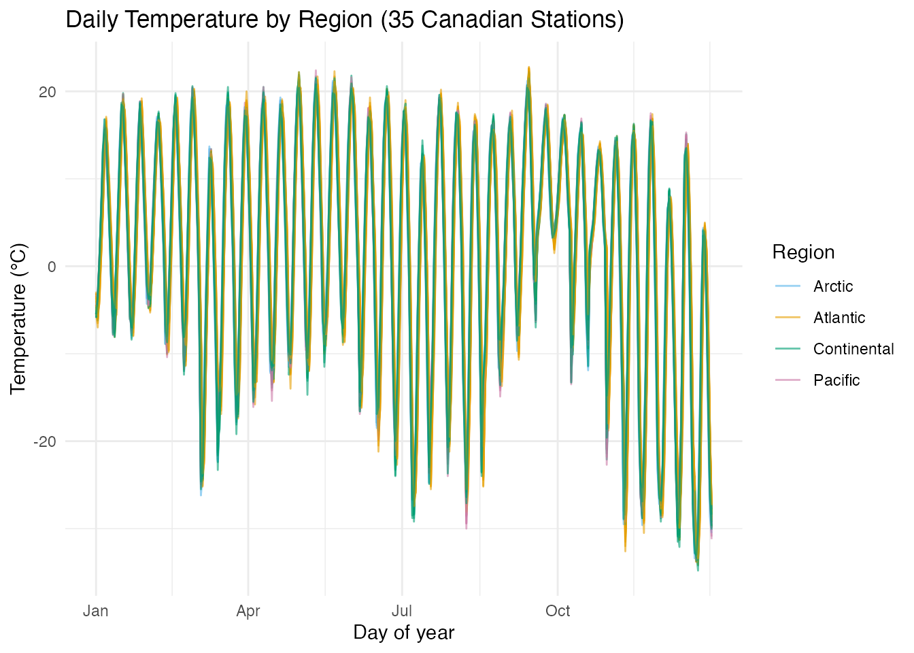
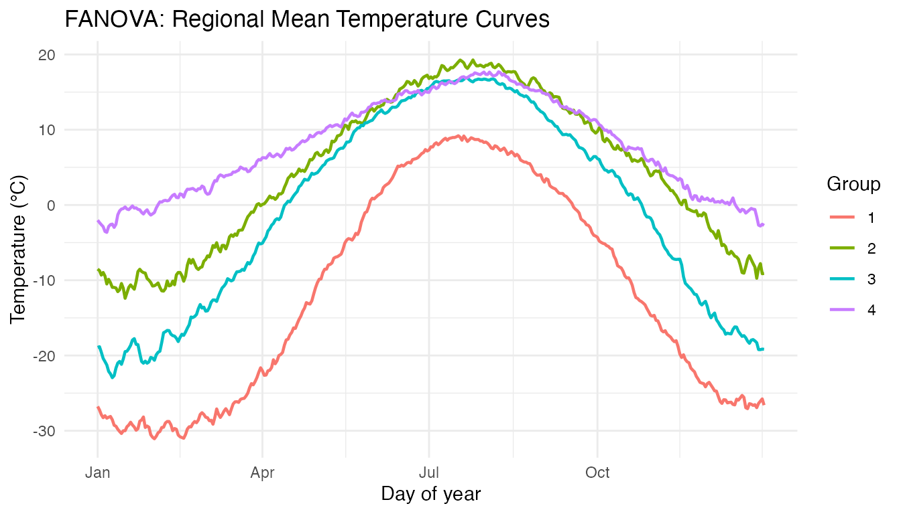
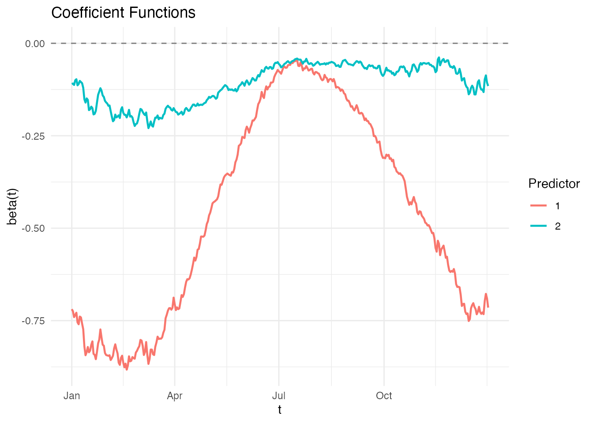
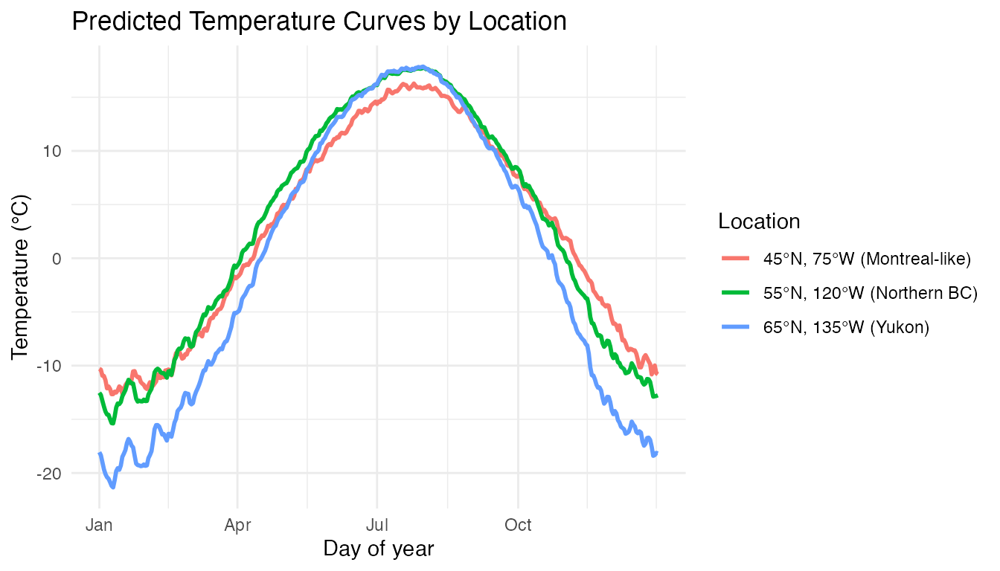
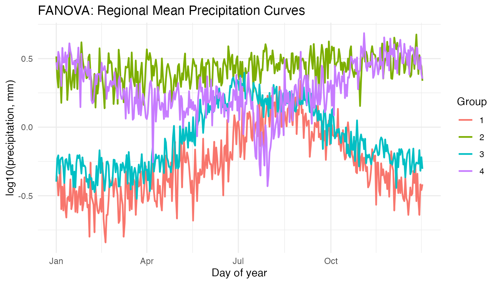

# Canadian Weather: Regional Climate Patterns

A climate analyst wants to characterize how geography shapes seasonal
temperature and precipitation patterns across Canada. Functional ANOVA
tests whether climate curves differ by region, while function-on-scalar
regression reveals which geographic variables (latitude, longitude)
drive seasonal variation.

| Step                          | What It Does                                                  | Outcome                                                              |
|-------------------------------|---------------------------------------------------------------|----------------------------------------------------------------------|
| Data preparation              | Load 35 stations × 365 daily temperature/precipitation curves | `fdata` objects colored by 4 regions                                 |
| FANOVA (temperature)          | Permutation test for regional mean differences                | Strong rejection: regions differ significantly                       |
| Pairwise FANOVA               | Test all region pairs                                         | Pacific/Arctic most distinct; Atlantic/Continental overlap in summer |
| FOSR: temperature ~ geography | Regress temperature curves on latitude + longitude            | Latitude dominates in winter; longitude effect peaks in spring/fall  |
| Precipitation analysis        | FANOVA + FOSR on precipitation curves                         | Regions also differ; Pacific has distinct wet-season pattern         |
| Classification                | Classify region from temperature curves                       | Cross-validated accuracy by region                                   |

**Key result:** Latitude is the strongest predictor of temperature
seasonality — its effect is largest in winter when Arctic/Continental
stations drop far below Atlantic/Pacific ones. The permutation FANOVA
confirms highly significant regional differences (p \< 0.002).

The Canadian Weather dataset is a classic benchmark in functional data
analysis (Ramsay and Silverman, 2005).

``` r
library(fdars)
#> 
#> Attaching package: 'fdars'
#> The following objects are masked from 'package:stats':
#> 
#>     cov, decompose, deriv, median, sd, var
#> The following object is masked from 'package:base':
#> 
#>     norm
library(ggplot2)
theme_set(theme_minimal())
```

## Data Preparation

The dataset contains daily temperature and precipitation averaged over
1960–1994 at 35 Canadian weather stations, grouped into 4 regions.

``` r
data(CanadianWeather, package = "fda")

# Temperature: 365 x 35 matrix (days x stations) — transpose for fdata
temp_mat <- t(CanadianWeather$dailyAv[, , "Temperature.C"])
fd_temp <- fdata(temp_mat, argvals = 1:365)

# Precipitation (log mm)
precip_mat <- t(CanadianWeather$dailyAv[, , "log10precip"])
fd_precip <- fdata(precip_mat, argvals = 1:365)

# Region labels
region <- factor(CanadianWeather$region)

# Geographic coordinates
coords <- CanadianWeather$coordinates
latitude <- coords[, "N.latitude"]
longitude <- -abs(coords[, "W.longitude"])  # negative for West

cat("Stations:", nrow(fd_temp$data), "\n")
#> Stations: 35
cat("Grid points:", ncol(fd_temp$data), "(daily)\n")
#> Grid points: 365 (daily)
cat("Regions:", paste(levels(region), table(region), sep = ": ", collapse = ", "), "\n")
#> Regions: Arctic: 3, Atlantic: 15, Continental: 12, Pacific: 5
```

## Temperature Curves by Region

``` r
region_colors <- c("Arctic" = "#56B4E9", "Atlantic" = "#E69F00",
                    "Continental" = "#009E73", "Pacific" = "#CC79A7")

# Create data frame for ggplot
temp_df <- data.frame(
  Day = rep(1:365, each = nrow(fd_temp$data)),
  Temp = as.vector(t(fd_temp$data)),
  Station = rep(rownames(fd_temp$data), 365),
  Region = rep(as.character(region), 365)
)

ggplot(temp_df, aes(x = Day, y = Temp, group = Station, color = Region)) +
  geom_line(alpha = 0.6) +
  scale_color_manual(values = region_colors) +
  labs(title = "Daily Temperature by Region (35 Canadian Stations)",
       x = "Day of year", y = "Temperature (°C)") +
  scale_x_continuous(breaks = c(1, 91, 182, 274),
                     labels = c("Jan", "Apr", "Jul", "Oct"))
```



Arctic and Continental stations show the widest annual swing (cold
winters, warm summers), while Pacific stations have the mildest climate.
The key question: are these regional differences statistically
significant across the whole year?

## Functional ANOVA: Do Regions Differ?

``` r
anova_temp <- fanova(fd_temp, region, n.perm = 500)
print(anova_temp)
#> Functional ANOVA
#> ================
#>   Number of groups: 4 
#>   Number of observations: 35 
#>   Global F-statistic: 22.5107 
#>   P-value: 0.001996 
#>   Permutations: 500
```

The small p-value confirms that the four regions have significantly
different mean temperature curves — the visual separation is real, not a
sampling artifact.

``` r
plot(anova_temp) +
  scale_x_continuous(breaks = c(1, 91, 182, 274),
                     labels = c("Jan", "Apr", "Jul", "Oct")) +
  labs(title = "FANOVA: Regional Mean Temperature Curves",
       x = "Day of year", y = "Temperature (°C)")
```



The group means show the expected pattern: Arctic coldest year-round,
Continental with the largest amplitude, Pacific mildest, Atlantic
intermediate. The separation is greatest in winter (days 1–90 and
275–365).

## Pairwise FANOVA

Which specific region pairs differ?

``` r
# Test each pair of regions
pairs <- combn(levels(region), 2)
pairwise_results <- data.frame(
  Region1 = character(), Region2 = character(),
  F_stat = numeric(), p_value = numeric(),
  stringsAsFactors = FALSE
)

for (j in 1:ncol(pairs)) {
  idx <- region %in% pairs[, j]
  result <- fanova(fd_temp[idx, ], region[idx, drop = TRUE], n.perm = 500)
  pairwise_results <- rbind(pairwise_results, data.frame(
    Region1 = pairs[1, j], Region2 = pairs[2, j],
    F_stat = round(result$global.statistic, 2),
    p_value = result$p.value
  ))
}

knitr::kable(pairwise_results, caption = "Pairwise FANOVA p-values")
```

| Region1     | Region2     | F_stat |   p_value |
|:------------|:------------|-------:|----------:|
| Arctic      | Atlantic    |  51.83 | 0.0019960 |
| Arctic      | Continental |  18.99 | 0.0059880 |
| Arctic      | Pacific     |  55.39 | 0.0239521 |
| Atlantic    | Continental |  13.19 | 0.0019960 |
| Atlantic    | Pacific     |   5.61 | 0.0079840 |
| Continental | Pacific     |  15.54 | 0.0019960 |

Pairwise FANOVA p-values

Arctic vs Pacific shows the largest F-statistic (greatest separation).
Continental vs Atlantic may overlap more, particularly in summer when
both regions reach similar peak temperatures.

## FOSR: Temperature ~ Latitude + Longitude

Function-on-scalar regression reveals *how* geographic variables shape
the temperature curve at each day of the year.

``` r
predictors <- cbind(latitude, longitude)
fosr_temp <- fosr(fd_temp, predictors, lambda = 1)
print(fosr_temp)
#> Function-on-Scalar Regression
#> =============================
#>   Number of observations: 35 
#>   Number of predictors: 2 
#>   Evaluation points: 365 
#>   R-squared: 0.466 
#>   Lambda: 1
```

``` r
plot(fosr_temp) +
  scale_x_continuous(breaks = c(1, 91, 182, 274),
                     labels = c("Jan", "Apr", "Jul", "Oct"))
```



### Interpreting the Coefficient Functions

- **Latitude ${\widehat{\beta}}_{1}(t)$**: Negative throughout the year
  (higher latitude → colder). The effect is *strongest in winter* — a 1°
  increase in latitude has a bigger cooling effect in January than in
  July.
- **Longitude ${\widehat{\beta}}_{2}(t)$**: More subtle. Western
  stations (more negative longitude) tend to be warmer in winter
  (Pacific influence) but the effect reverses or diminishes in summer.

### FPC-Based FOSR

``` r
fosr_fpc <- fosr.fpc(fd_temp, predictors, ncomp = 5)
cat("FPC-based R-squared:", round(fosr_fpc$r.squared, 4), "\n")
#> FPC-based R-squared: 0.8114
```

### Prediction: What Would a Station at Given Coordinates Look Like?

``` r
# Predict temperature curve for hypothetical stations
new_locs <- matrix(c(
  45, -75,   # Montreal-like (Continental)
  55, -120,  # Northern BC (Continental/Pacific)
  65, -135   # Yukon (Arctic)
), nrow = 3, byrow = TRUE)

pred_curves <- predict(fosr_temp, new_locs)

pred_df <- data.frame(
  Day = rep(1:365, 3),
  Temp = as.vector(t(pred_curves$data)),
  Location = rep(c("45°N, 75°W (Montreal-like)",
                    "55°N, 120°W (Northern BC)",
                    "65°N, 135°W (Yukon)"), each = 365)
)

ggplot(pred_df, aes(x = Day, y = Temp, color = Location)) +
  geom_line(linewidth = 1) +
  scale_x_continuous(breaks = c(1, 91, 182, 274),
                     labels = c("Jan", "Apr", "Jul", "Oct")) +
  labs(title = "Predicted Temperature Curves by Location",
       x = "Day of year", y = "Temperature (°C)")
```



## Precipitation Analysis

### FANOVA on Precipitation

``` r
anova_precip <- fanova(fd_precip, region, n.perm = 500)
print(anova_precip)
#> Functional ANOVA
#> ================
#>   Number of groups: 4 
#>   Number of observations: 35 
#>   Global F-statistic: 14.0489 
#>   P-value: 0.001996 
#>   Permutations: 500
```

``` r
plot(anova_precip) +
  scale_x_continuous(breaks = c(1, 91, 182, 274),
                     labels = c("Jan", "Apr", "Jul", "Oct")) +
  labs(title = "FANOVA: Regional Mean Precipitation Curves",
       x = "Day of year", y = "log10(precipitation, mm)")
```



Pacific stations show a distinct wet-winter/dry-summer
Mediterranean-like pattern, while Continental stations have
summer-dominated precipitation.

### FOSR on Precipitation

``` r
fosr_precip <- fosr(fd_precip, predictors, lambda = 1)
cat("Precipitation FOSR R-squared:", round(fosr_precip$r.squared, 4), "\n")
#> Precipitation FOSR R-squared: 0.2542
```

## Classification: Region from Temperature

Can we classify a station’s region from its temperature curve alone?

``` r
# Functional classification with cross-validation
classif_result <- fclassif.cv(fd_temp, region, nfold = 5)
print(classif_result)
#> Cross-Validated Functional Classification
#> ==========================================
#>   Method: LDA 
#>   Folds: 5 
#>   Error rate: 0.1429 
#>   Best ncomp: 3
```

``` r
# Also fit on full data to see confusion matrix
classif_full <- fclassif(fd_temp, region)

cat("Overall accuracy:", round(classif_full$accuracy * 100, 1), "%\n")
#> Overall accuracy: 88.6 %
print(classif_full$confusion)
#>      [,1] [,2] [,3] [,4]
#> [1,]    3    0    0    0
#> [2,]    0   14    1    0
#> [3,]    1    1    9    1
#> [4,]    0    0    0    5
```

Pacific and Arctic stations are typically classified correctly due to
their distinctive temperature profiles. Misclassification is most common
between Atlantic and Continental stations, whose summer temperatures
overlap.

## Conclusions

- **FANOVA** confirms highly significant regional differences in both
  temperature and precipitation curves (p \< 0.002 in both cases).
- **Latitude** is the dominant geographic predictor of temperature
  seasonality. Its effect is strongest in winter, when the
  Arctic/Continental vs Atlantic/Pacific divide is most pronounced.
- **Longitude** has a more subtle effect, primarily reflecting the
  moderating influence of the Pacific Ocean on western stations.
- **FOSR** with 2 scalar predictors explains a substantial fraction of
  the curve-to-curve temperature variation — geography alone goes a long
  way.
- **Classification** from temperature curves correctly identifies most
  regions, with Pacific and Arctic being the most distinctive.

## See Also

- [`vignette("articles/functional-regression")`](https://sipemu.github.io/fdars-r/articles/functional-regression.md)
  — FOSR and FANOVA methodology
- [`vignette("articles/regression")`](https://sipemu.github.io/fdars-r/articles/regression.md)
  — scalar-on-function regression methods
- [`vignette("articles/example-tecator-regression")`](https://sipemu.github.io/fdars-r/articles/example-tecator-regression.md)
  — real-data regression: NIR spectra → fat content
- [`vignette("articles/clustering")`](https://sipemu.github.io/fdars-r/articles/clustering.md)
  — alternative approach: unsupervised grouping of curves

## References

- Ramsay, J.O. and Silverman, B.W. (2005). *Functional Data Analysis*,
  2nd ed. Springer. Chapter 13 (Canadian Weather example).
- Cuevas, A., Febrero, M., and Fraiman, R. (2004). An anova test for
  functional data. *Computational Statistics & Data Analysis*, 47(1),
  111-122.
