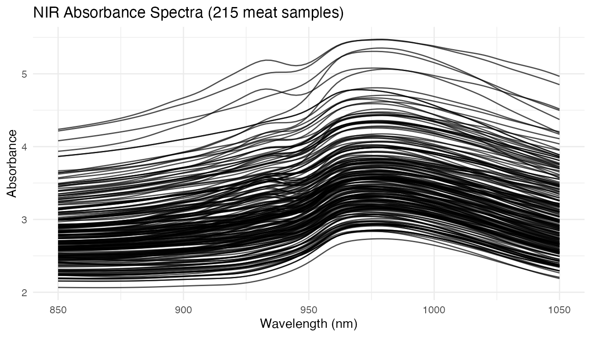
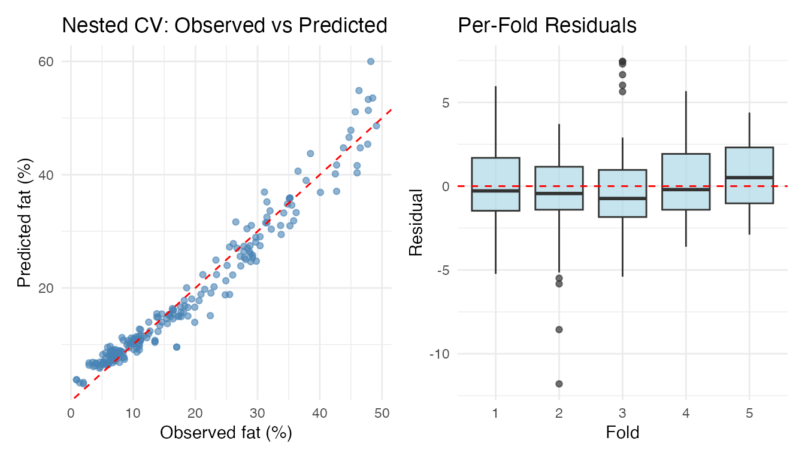
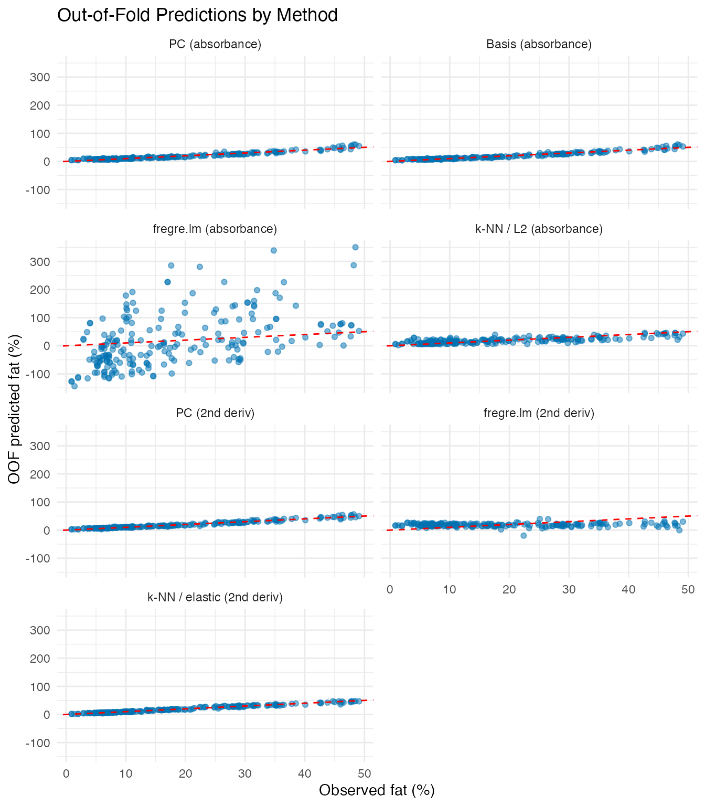
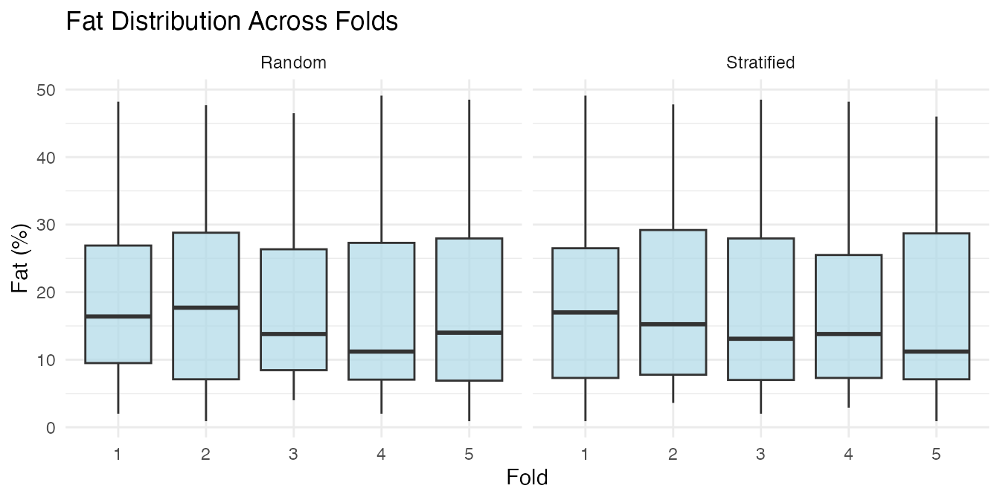

# Cross-Validation: Honest Model Comparison with OOF Predictions

The individual `*.cv` functions (`fregre.pc.cv`, `fregre.basis.cv`,
`fregre.np.cv`) tune hyperparameters but don’t produce **out-of-fold
(OOF) predictions** — predictions where each observation is predicted
exactly once, when it sits in the held-out fold. OOF predictions give an
honest estimate of generalisation performance and are the standard
output of a cross-validation workflow.

[`cv.fdata()`](https://sipemu.github.io/fdars-r/reference/cv.fdata.md)
provides a unified framework that wraps *any* fit/predict workflow and
returns OOF predictions for the entire dataset.

| Step              | What It Does                                       | Outcome                                   |
|-------------------|----------------------------------------------------|-------------------------------------------|
| Data preparation  | Load 215 Tecator NIR spectra with fat response     | `fdata` object ready for regression       |
| Basic CV          | 5-fold CV with fixed hyperparameters               | OOF predictions + RMSE/MAE/R2             |
| Nested CV         | Outer 5-fold, inner CV selects ncomp per fold      | Unbiased evaluation with automatic tuning |
| Method comparison | Run seven methods on identical fold splits         | Fair head-to-head comparison table        |
| Visualisation     | Observed vs predicted + per-fold residual boxplots | Diagnose prediction quality across folds  |

**Key result:** Nested CV avoids the optimistic bias of evaluating on
the same data used to select hyperparameters, giving realistic
out-of-sample error estimates.

``` r
library(fdars)
#> 
#> Attaching package: 'fdars'
#> The following objects are masked from 'package:stats':
#> 
#>     cov, decompose, deriv, median, sd, var
#> The following object is masked from 'package:base':
#> 
#>     norm
library(ggplot2)
theme_set(theme_minimal())
```

## Tecator Data

The Tecator dataset contains 215 meat samples, each with an absorbance
spectrum measured at 100 wavelengths (850–1050 nm) and
laboratory-measured fat content. This is the same dataset used in the
[Tecator regression
example](https://sipemu.github.io/fdars-r/articles/example-tecator-regression.md).

``` r
data(tecator, package = "fda.usc")

absorp_data <- tecator$absorp.fdata$data
wavelengths <- as.numeric(tecator$absorp.fdata$argvals)
fd <- fdata(absorp_data, argvals = wavelengths)
fat <- tecator$y$Fat
n <- nrow(fd$data)

cat("Samples:", n, "\n")
#> Samples: 215
cat("Wavelengths:", ncol(fd$data), "(", range(wavelengths), "nm)\n")
#> Wavelengths: 100 ( 850 1050 nm)
cat("Fat range:", round(range(fat), 1), "%\n")
#> Fat range: 0.9 49.1 %
```

``` r
plot(fd) +
  labs(title = "NIR Absorbance Spectra (215 meat samples)",
       x = "Wavelength (nm)", y = "Absorbance")
```



## Pre-Processing

Raw absorbance spectra contain baseline shifts. Smoothing with B-splines
and taking the second derivative removes these effects and enhances
spectral features — we’ll use both representations for cross-validation.

``` r
coefs_raw <- fdata2basis(fd, nbasis = 30, type = "bspline")
fd_smooth <- basis2fdata(coefs_raw, wavelengths)

fd_deriv2 <- deriv(deriv(fd_smooth))
```

## Basic K-Fold Cross-Validation

Pass any fitting function to `cv.fdata` and it handles the fold loop.
Every observation is predicted exactly once:

``` r
cv_result <- cv.fdata(fd_smooth, fat,
  fit.fn = function(fd, y, ...) fregre.pc(fd, y, ncomp = 6),
  kfold = 5, seed = 42)
print(cv_result)
#> K-Fold Cross-Validation (cv.fdata)
#>   Type: regression 
#>   Folds: 5 
#>   Observations: 215  
#> 
#> Overall metrics:
#>   RMSE: 3.164 
#>   MAE:  2.466 
#>   R2:   0.938 
#> 
#> Per-fold RMSE range: [2.785, 3.681]
```

``` r
cat("OOF predictions:", length(cv_result$oof.predictions), "\n")
#> OOF predictions: 215
cat("Any missing:", any(is.na(cv_result$oof.predictions)), "\n")
#> Any missing: FALSE
```

## Nested Cross-Validation

When hyperparameters are tuned, evaluating on the same data used for
selection gives an optimistically biased error estimate. **Nested CV**
fixes this: the outer folds produce OOF predictions while an inner CV
selects optimal parameters on each training fold independently.

``` r
cv_nested <- cv.fdata(fd_smooth, fat,
  fit.fn = function(fd, y, ...) {
    cv_inner <- fregre.pc.cv(fd, y, ncomp.range = 1:15, kfold = 5)
    cv_inner$model
  },
  kfold = 5, seed = 42)
print(cv_nested)
#> K-Fold Cross-Validation (cv.fdata)
#>   Type: regression 
#>   Folds: 5 
#>   Observations: 215  
#> 
#> Overall metrics:
#>   RMSE: 2.646 
#>   MAE:  2 
#>   R2:   0.9567 
#> 
#> Per-fold RMSE range: [2.197, 3.175]
```

Inspect which `ncomp` was selected in each outer fold — different
training subsets may favour different complexities:

``` r
ncomps <- sapply(cv_nested$fold.models, function(m) m$ncomp)
cat("ncomp per fold:", ncomps, "\n")
#> ncomp per fold: 15 15 15 15 15
```

## Comparing Methods on Identical Folds

Because `cv.fdata` accepts any `fit.fn`, you can fairly compare methods
by using the same `seed` (which fixes the fold assignments):

``` r
# Absorbance-based methods
cv_pc <- cv.fdata(fd_smooth, fat,
  fit.fn = function(fd, y, ...) fregre.pc(fd, y, ncomp = 6),
  kfold = 5, seed = 42)

cv_basis <- cv.fdata(fd_smooth, fat,
  fit.fn = function(fd, y, ...) {
    cv_inner <- fregre.basis.cv(fd, y,
      lambda.range = c(0.001, 0.01, 0.1, 1, 10))
    fregre.basis(fd, y, lambda = cv_inner$optimal.lambda)
  },
  kfold = 5, seed = 42)

cv_lm <- cv.fdata(fd_smooth, fat,
  fit.fn = function(fd, y, ...) {
    cv_inner <- fregre.lm.cv(fd, y, k.range = 1:15, nfold = 5)
    fregre.lm(fd, y, ncomp = cv_inner$optimal.k)
  },
  kfold = 5, seed = 42)

cv_knn <- cv.fdata(fd_smooth, fat,
  fit.fn = function(fd, y, ...) fregre.np(fd, y, type.S = "kNN.gCV"),
  kfold = 5, seed = 42)

# Second-derivative methods
cv_pc_d2 <- cv.fdata(fd_deriv2, fat,
  fit.fn = function(fd, y, ...) {
    cv_inner <- fregre.pc.cv(fd, y, ncomp.range = 1:15, kfold = 5)
    cv_inner$model
  },
  kfold = 5, seed = 42)

cv_lm_d2 <- cv.fdata(fd_deriv2, fat,
  fit.fn = function(fd, y, ...) {
    cv_inner <- fregre.lm.cv(fd, y, k.range = 1:15, nfold = 5)
    fregre.lm(fd, y, ncomp = cv_inner$optimal.k)
  },
  kfold = 5, seed = 42)

cv_knn_elastic <- cv.fdata(fd_deriv2, fat,
  fit.fn = function(fd, y, ...) fregre.np(fd, y, type.S = "kNN.gCV",
                                           metric = metric.elastic),
  kfold = 5, seed = 42)

comparison <- data.frame(
  Method = c("PC (absorbance)", "Basis (absorbance)",
             "fregre.lm (absorbance)", "k-NN / L2 (absorbance)",
             "PC (2nd derivative)", "fregre.lm (2nd derivative)",
             "k-NN / elastic (2nd derivative)"),
  RMSE = round(c(cv_pc$metrics$RMSE, cv_basis$metrics$RMSE,
                  cv_lm$metrics$RMSE, cv_knn$metrics$RMSE,
                  cv_pc_d2$metrics$RMSE, cv_lm_d2$metrics$RMSE,
                  cv_knn_elastic$metrics$RMSE), 3),
  MAE = round(c(cv_pc$metrics$MAE, cv_basis$metrics$MAE,
                 cv_lm$metrics$MAE, cv_knn$metrics$MAE,
                 cv_pc_d2$metrics$MAE, cv_lm_d2$metrics$MAE,
                 cv_knn_elastic$metrics$MAE), 3),
  R2 = round(c(cv_pc$metrics$R2, cv_basis$metrics$R2,
                cv_lm$metrics$R2, cv_knn$metrics$R2,
                cv_pc_d2$metrics$R2, cv_lm_d2$metrics$R2,
                cv_knn_elastic$metrics$R2), 3)
)
knitr::kable(comparison, caption = "5-fold OOF performance (same folds)")
```

| Method                          |   RMSE |    MAE |      R2 |
|:--------------------------------|-------:|-------:|--------:|
| PC (absorbance)                 |  3.164 |  2.466 |   0.938 |
| Basis (absorbance)              |  2.898 |  2.234 |   0.948 |
| fregre.lm (absorbance)          | 87.821 | 68.280 | -46.738 |
| k-NN / L2 (absorbance)          |  8.011 |  5.967 |   0.603 |
| PC (2nd derivative)             |  2.374 |  1.808 |   0.965 |
| fregre.lm (2nd derivative)      | 13.561 | 11.192 |  -0.138 |
| k-NN / elastic (2nd derivative) |  1.737 |  1.178 |   0.981 |

5-fold OOF performance (same folds)

## Visualising OOF Predictions

Observed vs predicted and per-fold residual boxplots for the nested CV
result:

``` r
valid <- !is.na(cv_nested$oof.predictions)
df_pred <- data.frame(
  Observed = fat[valid],
  Predicted = cv_nested$oof.predictions[valid],
  Fold = factor(cv_nested$folds[valid]),
  Residual = fat[valid] - cv_nested$oof.predictions[valid]
)

p1 <- ggplot(df_pred, aes(x = Observed, y = Predicted)) +
  geom_point(colour = "steelblue", alpha = 0.6) +
  geom_abline(intercept = 0, slope = 1, linetype = "dashed", colour = "red") +
  labs(title = "Nested CV: Observed vs Predicted",
       x = "Observed fat (%)", y = "Predicted fat (%)")

p2 <- ggplot(df_pred, aes(x = Fold, y = Residual)) +
  geom_boxplot(fill = "lightblue", alpha = 0.7) +
  geom_hline(yintercept = 0, linetype = "dashed", colour = "red") +
  labs(title = "Per-Fold Residuals", x = "Fold", y = "Residual")

library(patchwork)
p1 + p2
```



## Comparing OOF Predictions Across Methods

``` r
method_levels <- c("PC (absorbance)", "Basis (absorbance)",
                   "fregre.lm (absorbance)", "k-NN / L2 (absorbance)",
                   "PC (2nd deriv)", "fregre.lm (2nd deriv)",
                   "k-NN / elastic (2nd deriv)")

df_oof <- data.frame(
  Observed = rep(fat, 7),
  Predicted = c(cv_pc$oof.predictions, cv_basis$oof.predictions,
                cv_lm$oof.predictions, cv_knn$oof.predictions,
                cv_pc_d2$oof.predictions, cv_lm_d2$oof.predictions,
                cv_knn_elastic$oof.predictions),
  Method = factor(rep(method_levels, each = n), levels = method_levels)
)

ggplot(df_oof, aes(x = Observed, y = Predicted)) +
  geom_point(alpha = 0.5, colour = "#0072B2") +
  geom_abline(intercept = 0, slope = 1, linetype = "dashed", colour = "red") +
  facet_wrap(~ Method, ncol = 2) +
  labs(title = "Out-of-Fold Predictions by Method",
       x = "Observed fat (%)", y = "OOF predicted fat (%)")
```



## Per-Fold Stability

The `fold.metrics` data frame shows how performance varies across folds
— large variation can indicate sensitivity to the particular train/test
split:

``` r
knitr::kable(cv_nested$fold.metrics, digits = 3,
             caption = "Per-fold metrics (nested CV)")
```

| fold |   n |  RMSE |   MAE |    R2 |
|-----:|----:|------:|------:|------:|
|    1 |  45 | 2.368 | 1.866 | 0.966 |
|    2 |  44 | 3.012 | 2.055 | 0.945 |
|    3 |  44 | 3.175 | 2.401 | 0.940 |
|    4 |  41 | 2.273 | 1.828 | 0.967 |
|    5 |  41 | 2.197 | 1.828 | 0.969 |

Per-fold metrics (nested CV)

## Stratified Folds

By default, `cv.fdata` uses **stratified** fold assignment: the response
is binned into quantile groups and observations are sampled within each
bin. This ensures every fold has a similar distribution of fat content,
which matters because the Tecator dataset has a right-skewed fat
distribution.

``` r
folds_strat <- fdars::: .create_folds(fat, kfold = 5, type = "regression",
                                       stratified = TRUE, seed = 1)
folds_rand <- fdars::: .create_folds(fat, kfold = 5, type = "regression",
                                      stratified = FALSE, seed = 1)

df_folds <- data.frame(
  Fat = rep(fat, 2),
  Fold = factor(c(folds_strat, folds_rand)),
  Type = rep(c("Stratified", "Random"), each = n)
)

ggplot(df_folds, aes(x = Fold, y = Fat)) +
  geom_boxplot(fill = "lightblue", alpha = 0.7) +
  facet_wrap(~ Type) +
  labs(title = "Fat Distribution Across Folds",
       y = "Fat (%)")
```



Set `stratified = FALSE` to use purely random assignment (matching the
existing `*.cv` functions).

## Custom Predict Functions

Some models need a custom prediction step. The `predict.fn` argument
receives the fitted model and new data, and returns predictions:

``` r
cv_custom <- cv.fdata(fd_smooth, fat,
  fit.fn = function(fd, y, ...) fregre.basis(fd, y, nbasis = 20, lambda = 0.1),
  predict.fn = function(model, newdata) predict(model, newdata),
  kfold = 5, seed = 42)
cat("Custom predict RMSE:", round(cv_custom$metrics$RMSE, 3), "\n")
#> Custom predict RMSE: 3.337
```

## Summary

| Feature               | `*.cv` functions    | `cv.fdata`                |
|-----------------------|---------------------|---------------------------|
| Hyperparameter tuning | Yes (internal)      | Via `fit.fn` wrapper      |
| OOF predictions       | No                  | Yes (full dataset)        |
| Stratified folds      | No                  | Yes (default)             |
| Method-agnostic       | No (one per method) | Yes (any fit/predict)     |
| Nested CV             | No                  | Yes (compose with `*.cv`) |
| Per-fold models       | No                  | Yes (`$fold.models`)      |
| Per-fold metrics      | No                  | Yes (`$fold.metrics`)     |

## See Also

- [`vignette("articles/regression")`](https://sipemu.github.io/fdars-r/articles/regression.md)
  — regression methods overview (PC, basis, NP)
- [`vignette("articles/example-tecator-regression")`](https://sipemu.github.io/fdars-r/articles/example-tecator-regression.md)
  — Tecator regression in depth
- [`vignette("articles/functional-classification")`](https://sipemu.github.io/fdars-r/articles/functional-classification.md)
  — classification methods
