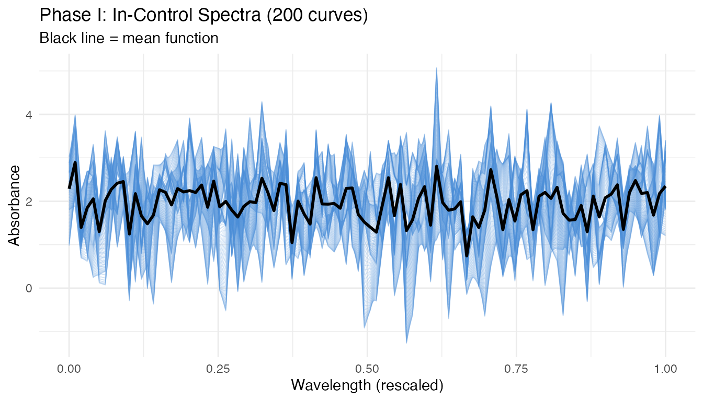
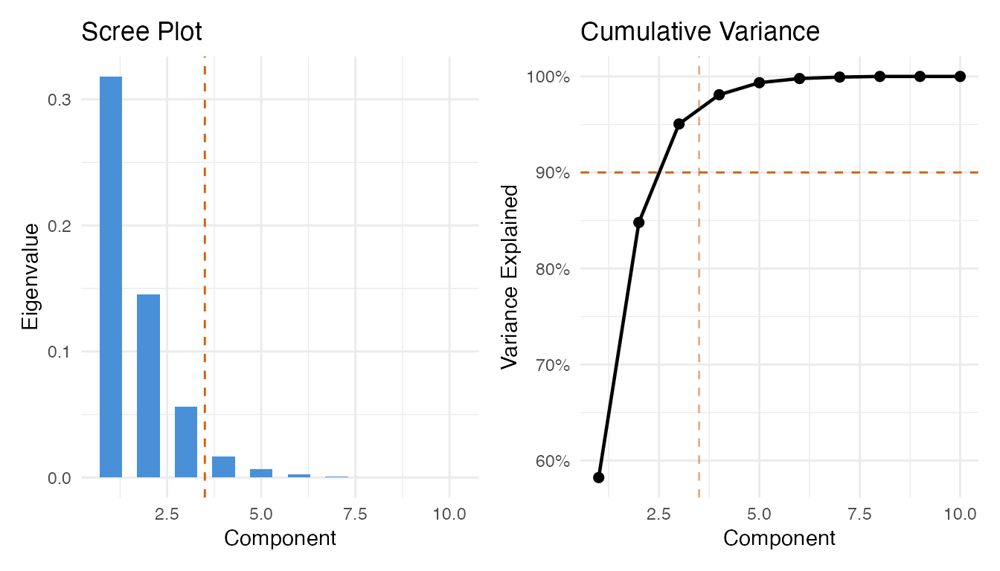
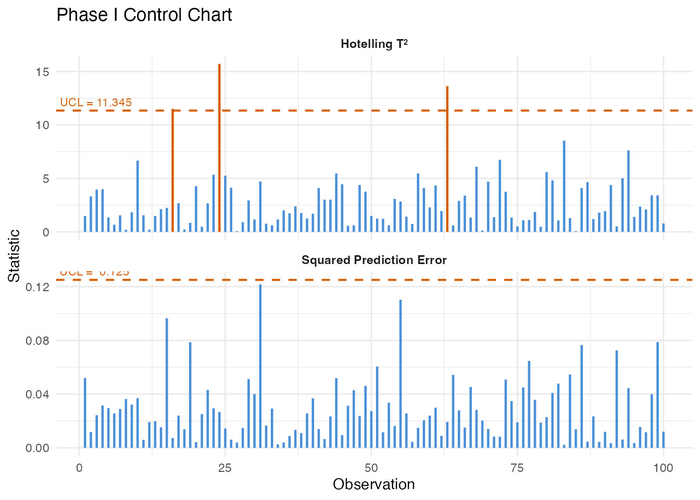
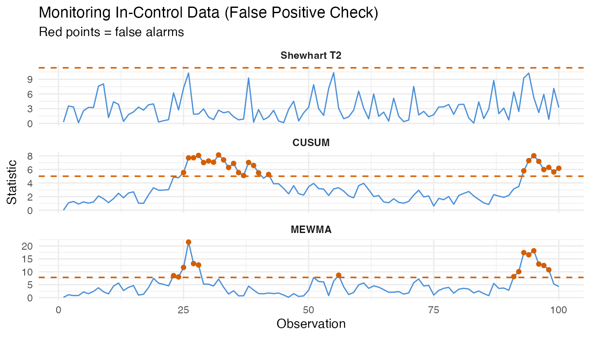
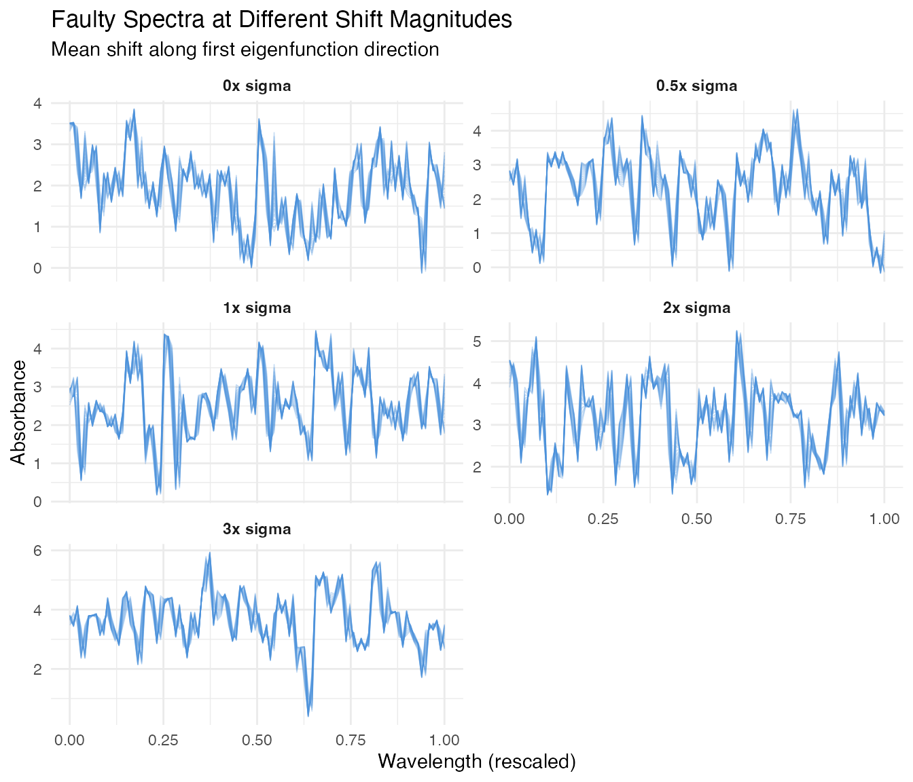
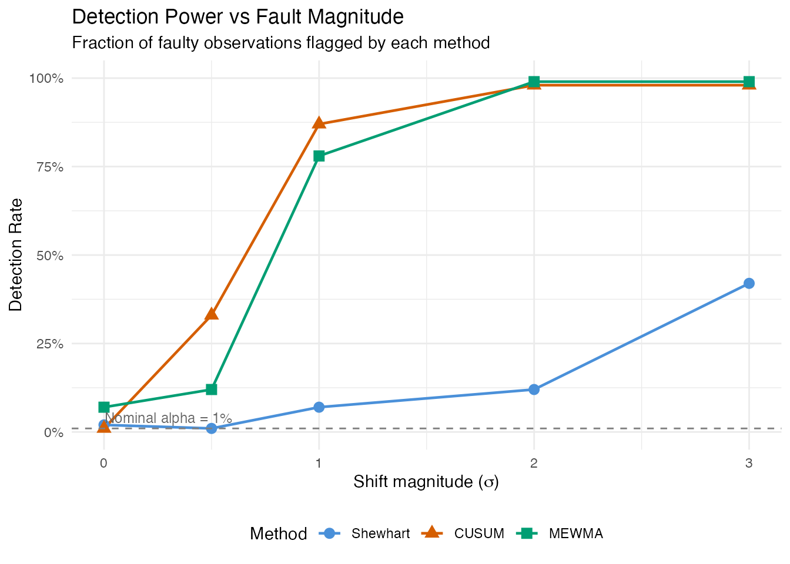
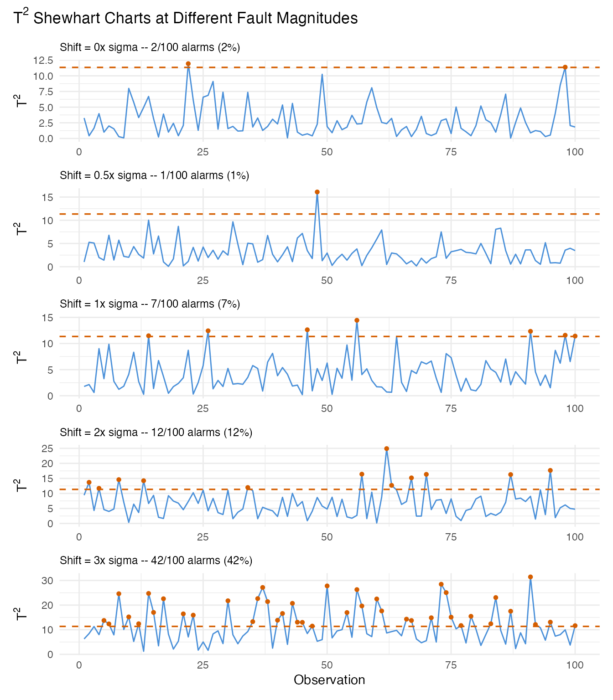
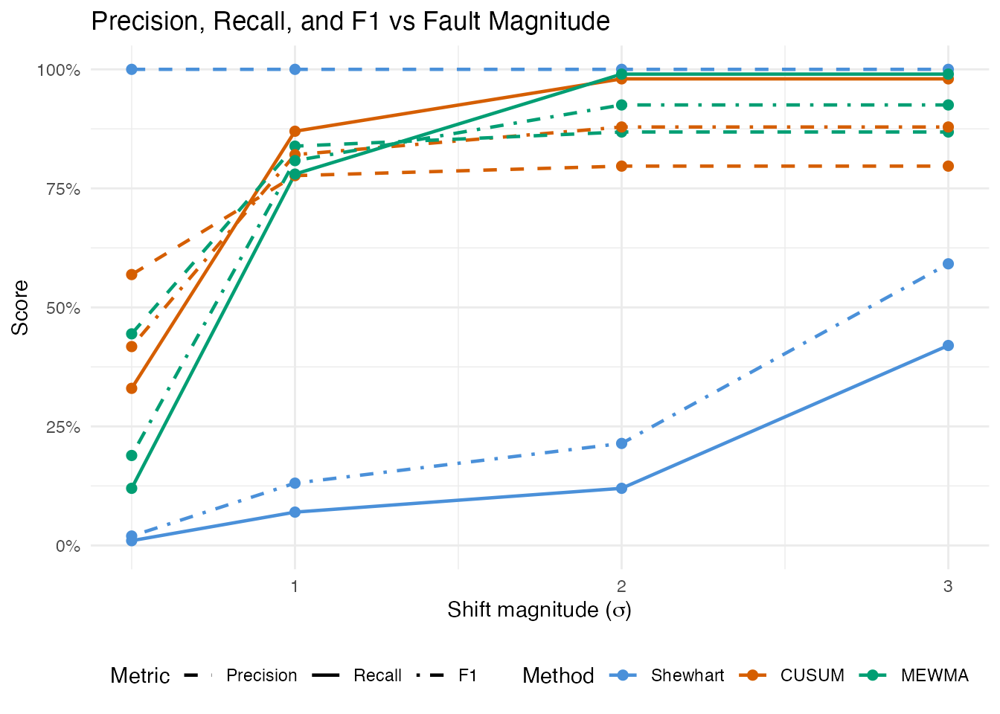
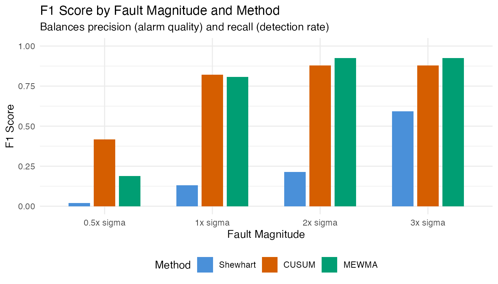
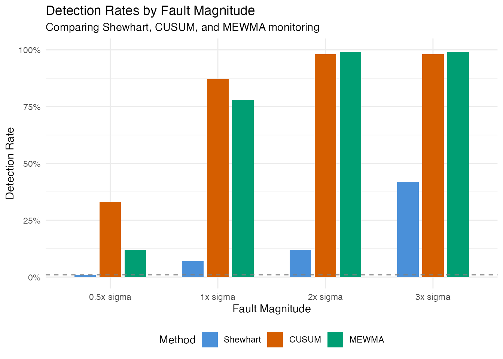

# Inline Quality Monitoring: Detection Power and False Alarm Analysis

``` r
library(fdars)
#> 
#> Attaching package: 'fdars'
#> The following objects are masked from 'package:stats':
#> 
#>     cov, decompose, deriv, median, sd, var
#> The following object is masked from 'package:base':
#> 
#>     norm
library(ggplot2)
library(patchwork)
theme_set(theme_minimal())
set.seed(2024)
```

## Overview

This article simulates an inline quality monitoring pipeline using
entirely artificial data. Instead of relying on a real dataset, we
generate synthetic NIR-like spectra via
[`simFunData()`](https://sipemu.github.io/fdars-r/reference/simFunData.md)
and introduce faults of varying magnitude. The goal is to quantify two
fundamental properties of a monitoring system:

- **False positive rate (FPR)**: How often does the chart flag
  in-control observations as out-of-control?
- **Detection power**: What fraction of truly faulty observations are
  caught, and how does this depend on fault strength?

| Step                        | What It Does                                             | Outcome                                            |
|-----------------------------|----------------------------------------------------------|----------------------------------------------------|
| 1\. Simulate baseline       | Generate in-control spectra via Karhunen-Loeve expansion | 200 clean curves for Phase I                       |
| 2\. Phase I calibration     | Build FPCA-based control chart                           | T-squared and SPE control limits                   |
| 3\. False positive analysis | Monitor fresh in-control data                            | Empirical false alarm rate                         |
| 4\. Fault injection         | Add mean shifts of 0x, 0.5x, 1x, 2x, 3x sigma            | Five Phase II datasets                             |
| 5\. Detection power         | Monitor each fault level with Shewhart, CUSUM, and MEWMA | Detection rate per method and fault strength       |
| 6\. Summary                 | Tabulate FPR and detection rates                         | Operating characteristic of the monitoring system  |
| 7\. Precision & F1          | Compute precision, recall, and F1 score                  | Trade-off between alarm quality and detection rate |

## 1. Generate In-Control Data

We simulate spectra resembling near-infrared absorbance measurements.
The Fourier eigenfunction basis produces smooth, oscillatory curves
typical of spectroscopic data. We add a smooth mean function to shift
the baseline away from zero, mimicking real absorbance levels.

``` r
# Grid: 100 wavelength channels on [0, 1] (rescaled from, e.g., 850-1050 nm)
m <- 100
argvals <- seq(0, 1, length.out = m)

# Number of basis functions and KL settings
M <- 8

# Sample sizes
n_phase1 <- 200   # Phase I (chart calibration)
n_ic     <- 100   # Fresh in-control data (for FPR estimation)
n_faulty <- 100   # Per fault level
```

``` r
# Mean function: smooth absorbance-like shape
mean_fn <- function(t) 2 + 0.5 * sin(2 * pi * t) + 0.3 * cos(4 * pi * t)

# Phase I training data (in-control)
fd_phase1 <- simFunData(
  n = n_phase1, argvals = argvals, M = M,
  eFun.type = "Fourier", eVal.type = "exponential",
  mean = mean_fn, seed = 100
)
```

``` r
# Visualize Phase I curves
n_curves <- nrow(fd_phase1$data)
df_phase1 <- data.frame(
  wavelength = rep(argvals, each = n_curves),
  absorbance = as.vector(t(fd_phase1$data)),
  sample = rep(seq_len(n_curves), times = m)
)

ggplot(df_phase1, aes(x = .data$wavelength, y = .data$absorbance,
                       group = .data$sample)) +
  geom_line(alpha = 0.15, linewidth = 0.3, color = "#4A90D9") +
  stat_summary(aes(group = 1), fun = mean, geom = "line",
               color = "black", linewidth = 1) +
  labs(title = "Phase I: In-Control Spectra (200 curves)",
       subtitle = "Black line = mean function",
       x = "Wavelength (rescaled)", y = "Absorbance") +
  theme(legend.position = "none")
```



The curves show the smooth, oscillatory variation characteristic of NIR
spectra. The black mean function captures the baseline shape, while
individual curves deviate according to the Karhunen-Loeve
eigenstructure.

## 2. Phase I Calibration

We build the control chart from the Phase I data, selecting the number
of principal components via the 90% cumulative variance rule.

``` r
# Preliminary chart with many components to inspect eigenvalues
chart_prelim <- spm.phase1(fd_phase1, ncomp = 10, alpha = 0.01, seed = 42)

# Select number of components
ncomp_sel <- spm.ncomp.select(chart_prelim$eigenvalues,
                               method = "variance90", threshold = 0.9)
cat("Selected components:", ncomp_sel, "\n")
#> Selected components: 3
```

``` r
eig <- chart_prelim$eigenvalues
cum_var <- cumsum(eig) / sum(eig)
df_scree <- data.frame(
  pc = seq_along(eig),
  eigenvalue = eig,
  cum_var = cum_var
)

p1 <- ggplot(df_scree, aes(x = .data$pc, y = .data$eigenvalue)) +
  geom_col(fill = "#4A90D9", width = 0.6) +
  geom_vline(xintercept = ncomp_sel + 0.5, linetype = "dashed",
             color = "#D55E00") +
  labs(title = "Scree Plot", x = "Component", y = "Eigenvalue")

p2 <- ggplot(df_scree, aes(x = .data$pc, y = .data$cum_var)) +
  geom_line(linewidth = 0.8) +
  geom_point(size = 2) +
  geom_hline(yintercept = 0.9, linetype = "dashed", color = "#D55E00") +
  geom_vline(xintercept = ncomp_sel + 0.5, linetype = "dashed",
             color = "#D55E00", alpha = 0.5) +
  scale_y_continuous(labels = scales::percent_format()) +
  labs(title = "Cumulative Variance", x = "Component",
       y = "Variance Explained")

p1 + p2
```



Now build the final Phase I chart with the selected number of
components:

``` r
chart <- spm.phase1(fd_phase1, ncomp = ncomp_sel, alpha = 0.01, seed = 42)
print(chart)
#> SPM Control Chart (Phase I)
#>   Components: 3 
#>   Alpha: 0.01 
#>   T2 UCL: 11.34 
#>   SPE UCL: 0.125 
#>   Observations: 200 
#>   Grid points: 100 
#>   Eigenvalues: 0.3182, 0.1452, 0.0561
```

``` r
plot(chart)
```



All Phase I observations should fall within the control limits. Any
violations at this stage would indicate the training data is
contaminated or the sample size is too small for the chosen significance
level.

## 3. False Positive Analysis

A well-calibrated chart should produce alarms at a rate close to the
nominal significance level (alpha = 0.01, i.e., 1%) when monitoring
genuinely in-control data. We generate 100 fresh in-control curves –
independent of the Phase I set – and monitor them.

``` r
# Fresh in-control data (same generative process, different seed)
fd_ic <- simFunData(
  n = n_ic, argvals = argvals, M = M,
  eFun.type = "Fourier", eVal.type = "exponential",
  mean = mean_fn, seed = 200
)
```

``` r
# Shewhart monitoring on in-control data
mon_ic <- spm.monitor(chart, fd_ic)
fpr_t2  <- mean(mon_ic$t2.alarm)
fpr_spe <- mean(mon_ic$spe.alarm)
fpr_any <- mean(mon_ic$t2.alarm | mon_ic$spe.alarm)

cat("In-control monitoring (n =", n_ic, ")\n")
#> In-control monitoring (n = 100 )
cat("  T2 false positive rate: ", sprintf("%.1f%%", 100 * fpr_t2), "\n")
#>   T2 false positive rate:  0.0%
cat("  SPE false positive rate:", sprintf("%.1f%%", 100 * fpr_spe), "\n")
#>   SPE false positive rate: 4.0%
cat("  Either alarm FPR:       ", sprintf("%.1f%%", 100 * fpr_any), "\n")
#>   Either alarm FPR:        4.0%
cat("  Nominal alpha:           1.0%\n")
#>   Nominal alpha:           1.0%
```

``` r
# CUSUM on in-control data
cusum_ic <- spm.cusum(chart, fd_ic, k = 0.5, h = 5.0)
fpr_cusum <- mean(cusum_ic$alarm)
cat("CUSUM false positive rate:", sprintf("%.1f%%", 100 * fpr_cusum), "\n")
#> CUSUM false positive rate: 25.0%
```

``` r
# MEWMA on in-control data
mewma_ic <- spm.mewma(chart, fd_ic, lambda = 0.2)
fpr_mewma <- mean(mewma_ic$alarm)
cat("MEWMA false positive rate:", sprintf("%.1f%%", 100 * fpr_mewma), "\n")
#> MEWMA false positive rate: 15.0%
```

The observed false positive rates should be reasonably close to the
nominal 1% level. Small deviations are expected due to finite sample
effects. If the FPR is substantially higher, the control limits may be
too tight; if it is zero, the limits may be overly conservative.

``` r
n_obs_ic <- n_ic
obs_idx <- seq_len(n_obs_ic)

df_fpr <- data.frame(
  obs = rep(obs_idx, 3),
  value = c(mon_ic$t2, cusum_ic$cusum.statistic, mewma_ic$mewma.statistic),
  ucl = rep(c(chart$t2.ucl, cusum_ic$ucl, mewma_ic$ucl), each = n_obs_ic),
  alarm = c(mon_ic$t2.alarm, cusum_ic$alarm, mewma_ic$alarm),
  method = factor(rep(c("Shewhart T2", "CUSUM", "MEWMA"), each = n_obs_ic),
                  levels = c("Shewhart T2", "CUSUM", "MEWMA"))
)

ggplot(df_fpr, aes(x = .data$obs, y = .data$value)) +
  geom_line(color = "#4A90D9", linewidth = 0.5) +
  geom_point(data = df_fpr[df_fpr$alarm, ], color = "#D55E00", size = 1.5) +
  geom_hline(aes(yintercept = .data$ucl), linetype = "dashed",
             color = "#D55E00", linewidth = 0.6) +
  facet_wrap(~ .data$method, scales = "free_y", ncol = 1) +
  labs(title = "Monitoring In-Control Data (False Positive Check)",
       subtitle = "Red points = false alarms",
       x = "Observation", y = "Statistic") +
  theme(strip.text = element_text(face = "bold"))
```



## 4. Fault Injection: Different Shift Magnitudes

We now create faulty data by adding a mean shift to the in-control
process. The shift is applied along the first eigenfunction direction,
which represents the dominant mode of spectral variation. We scale the
shift by multiples of the in-control standard deviation (sigma) of the
first FPC score.

``` r
# Estimate sigma from Phase I eigenvalues (SD of first FPC score)
sigma_shift <- sqrt(chart$eigenvalues[1])
cat("Sigma (sqrt of first eigenvalue):", format(sigma_shift, digits = 4), "\n")
#> Sigma (sqrt of first eigenvalue): 0.5641
```

``` r
# Fault magnitudes in units of sigma
shift_levels <- c(0, 0.5, 1.0, 2.0, 3.0)
shift_labels <- paste0(shift_levels, "x sigma")

# First eigenfunction direction for the shift
phi1 <- eFun(argvals, M = M, type = "Fourier")[, 1]

# Generate faulty datasets
fault_data <- lapply(seq_along(shift_levels), function(i) {
  delta <- shift_levels[i] * sigma_shift

  # Generate base curves (in-control process)
  fd_base <- simFunData(
    n = n_faulty, argvals = argvals, M = M,
    eFun.type = "Fourier", eVal.type = "exponential",
    mean = mean_fn, seed = 300 + i
  )

  # Add fault: shift along first eigenfunction
  shifted_data <- fd_base$data + outer(rep(delta, n_faulty), phi1)
  fdata(shifted_data, argvals = argvals)
})
names(fault_data) <- shift_labels
```

``` r
# Build data frame for all fault levels (show 20 curves per level)
n_show <- 20
df_faults <- do.call(rbind, lapply(seq_along(shift_levels), function(i) {
  mat <- fault_data[[i]]$data[seq_len(n_show), ]
  data.frame(
    wavelength = rep(argvals, each = n_show),
    absorbance = as.vector(t(mat)),
    sample = rep(seq_len(n_show), times = m),
    shift = factor(shift_labels[i], levels = shift_labels)
  )
}))

ggplot(df_faults, aes(x = .data$wavelength, y = .data$absorbance,
                       group = .data$sample)) +
  geom_line(alpha = 0.3, linewidth = 0.3, color = "#4A90D9") +
  facet_wrap(~ .data$shift, ncol = 2, scales = "free_y") +
  labs(title = "Faulty Spectra at Different Shift Magnitudes",
       subtitle = "Mean shift along first eigenfunction direction",
       x = "Wavelength (rescaled)", y = "Absorbance") +
  theme(strip.text = element_text(face = "bold"))
```



At 0x sigma (no shift), the curves look identical to the in-control
process. As the shift magnitude increases, the spectra drift away from
the baseline – but even at 0.5x sigma, the shift is subtle and partially
masked by natural variation.

## 5. Detection Power Analysis

We monitor each fault level with all three methods and record the
detection rate (fraction of faulty observations that trigger an alarm).

``` r
# Storage for results
results <- data.frame(
  shift = numeric(),
  method = character(),
  n_alarm = integer(),
  n_total = integer(),
  detection_rate = numeric(),
  stringsAsFactors = FALSE
)

for (i in seq_along(shift_levels)) {
  fd_test <- fault_data[[i]]

  # Shewhart T2
  mon <- spm.monitor(chart, fd_test)
  n_alarm_t2 <- sum(mon$t2.alarm)

  # CUSUM
  cusum <- spm.cusum(chart, fd_test, k = 0.5, h = 5.0)
  n_alarm_cusum <- sum(cusum$alarm)

  # MEWMA
  mewma <- spm.mewma(chart, fd_test, lambda = 0.2)
  n_alarm_mewma <- sum(mewma$alarm)

  results <- rbind(results, data.frame(
    shift = rep(shift_levels[i], 3),
    method = c("Shewhart", "CUSUM", "MEWMA"),
    n_alarm = c(n_alarm_t2, n_alarm_cusum, n_alarm_mewma),
    n_total = n_faulty,
    detection_rate = c(n_alarm_t2, n_alarm_cusum, n_alarm_mewma) / n_faulty,
    stringsAsFactors = FALSE
  ))
}

results$shift_label <- factor(
  paste0(results$shift, "x sigma"),
  levels = shift_labels
)
results$method <- factor(results$method,
                          levels = c("Shewhart", "CUSUM", "MEWMA"))
```

``` r
ggplot(results, aes(x = .data$shift, y = .data$detection_rate,
                     color = .data$method, shape = .data$method)) +
  geom_line(linewidth = 0.8) +
  geom_point(size = 3) +
  geom_hline(yintercept = 0.01, linetype = "dashed", color = "grey50") +
  annotate("text", x = 0.3, y = 0.04, label = "Nominal alpha = 1%",
           color = "grey40", size = 3.2) +
  scale_y_continuous(labels = scales::percent_format(),
                     limits = c(0, 1)) +
  scale_color_manual(values = c(Shewhart = "#4A90D9",
                                CUSUM = "#D55E00",
                                MEWMA = "#009E73")) +
  labs(title = "Detection Power vs Fault Magnitude",
       subtitle = "Fraction of faulty observations flagged by each method",
       x = expression("Shift magnitude (" * sigma * ")"),
       y = "Detection Rate",
       color = "Method", shape = "Method") +
  theme(legend.position = "bottom")
```



This **power curve** is the central result. At 0x sigma, the detection
rate equals the false positive rate (ideally near 1%). As the shift
grows, detection power increases – rapidly for large shifts, gradually
for subtle ones. The shape of this curve depends on the monitoring
method:

- **Shewhart** reacts to individual large deviations but may miss small
  persistent shifts.
- **CUSUM** accumulates evidence over time, providing better sensitivity
  to small sustained faults at the cost of a delayed first alarm.
- **MEWMA** smooths multivariate scores, offering a compromise between
  Shewhart’s immediacy and CUSUM’s sensitivity.

## 6. Detailed View: Monitoring at Each Fault Level

We visualize the monitoring statistics for each fault level under the
Shewhart chart, showing how the T-squared values relate to the control
limit.

``` r
panel_list <- lapply(seq_along(shift_levels), function(i) {
  fd_test <- fault_data[[i]]
  mon <- spm.monitor(chart, fd_test)

  df <- data.frame(
    obs = seq_len(n_faulty),
    t2 = mon$t2,
    alarm = mon$t2.alarm
  )

  pct <- sprintf("%.0f%%", 100 * mean(mon$t2.alarm))
  subtitle <- paste0("Shift = ", shift_levels[i], "x sigma -- ",
                      sum(mon$t2.alarm), "/", n_faulty,
                      " alarms (", pct, ")")

  ggplot(df, aes(x = .data$obs, y = .data$t2)) +
    geom_line(color = "#4A90D9", linewidth = 0.5) +
    geom_point(data = df[df$alarm, ], color = "#D55E00", size = 1.2) +
    geom_hline(yintercept = chart$t2.ucl, linetype = "dashed",
               color = "#D55E00", linewidth = 0.6) +
    labs(subtitle = subtitle,
         x = if (i == length(shift_levels)) "Observation" else NULL,
         y = expression("T"^2)) +
    theme(plot.subtitle = element_text(size = 9))
})

wrap_plots(panel_list, ncol = 1) +
  plot_annotation(
    title = expression("T"^2 * " Shewhart Charts at Different Fault Magnitudes"),
    theme = theme(plot.title = element_text(size = 13, face = "bold"))
  )
```



At 0x sigma (no fault), most values stay below the UCL – any breaches
are false positives. At 3x sigma, nearly every observation exceeds the
limit. The intermediate levels (0.5x, 1x, 2x) show the transition from
noise-dominated to signal-dominated monitoring.

## 7. Summary: FPR and Detection Rates

We combine all results into a single summary table. The 0x sigma row
represents the false positive rate; all other rows show detection power
(true positive rate).

``` r
# Add FPR row explicitly
fpr_row <- data.frame(
  Shift = "0x (in-control)",
  Shewhart = sprintf("%.1f%%", 100 * fpr_t2),
  CUSUM = sprintf("%.1f%%", 100 * fpr_cusum),
  MEWMA = sprintf("%.1f%%", 100 * fpr_mewma),
  Interpretation = "False Positive Rate",
  stringsAsFactors = FALSE
)

# Build detection rows from results
detect_rows <- do.call(rbind, lapply(shift_levels[shift_levels > 0], function(s) {
  row_shew  <- results[results$shift == s & results$method == "Shewhart", ]
  row_cusum <- results[results$shift == s & results$method == "CUSUM", ]
  row_mewma <- results[results$shift == s & results$method == "MEWMA", ]

  data.frame(
    Shift = paste0(s, "x sigma"),
    Shewhart = sprintf("%.1f%%", 100 * row_shew$detection_rate),
    CUSUM = sprintf("%.1f%%", 100 * row_cusum$detection_rate),
    MEWMA = sprintf("%.1f%%", 100 * row_mewma$detection_rate),
    Interpretation = "Detection Power (TPR)",
    stringsAsFactors = FALSE
  )
}))

summary_table <- rbind(fpr_row, detect_rows)

knitr::kable(
  summary_table,
  align = c("l", "r", "r", "r", "l"),
  caption = "False positive rate and detection power by fault magnitude and method"
)
```

| Shift           | Shewhart | CUSUM | MEWMA | Interpretation        |
|:----------------|---------:|------:|------:|:----------------------|
| 0x (in-control) |     0.0% | 25.0% | 15.0% | False Positive Rate   |
| 0.5x sigma      |     1.0% | 33.0% | 12.0% | Detection Power (TPR) |
| 1x sigma        |     7.0% | 87.0% | 78.0% | Detection Power (TPR) |
| 2x sigma        |    12.0% | 98.0% | 99.0% | Detection Power (TPR) |
| 3x sigma        |    42.0% | 98.0% | 99.0% | Detection Power (TPR) |

False positive rate and detection power by fault magnitude and method

### Key takeaways

1.  **False positives are controlled.** At 0x sigma (no fault), all
    three methods produce alarm rates near the nominal 1% level. This
    confirms the chart is well-calibrated.

2.  **Small faults are hard to detect.** At 0.5x sigma, detection rates
    are low – the shift is largely hidden within the natural process
    variation. This is expected: a half-sigma shift is a subtle defect.

3.  **Detection power grows with fault strength.** By 2-3x sigma, all
    methods achieve high detection rates. The power curve quantifies the
    minimum fault size the monitoring system can reliably catch.

4.  **Method choice matters for small shifts.** CUSUM and MEWMA
    generally outperform the Shewhart chart for small persistent shifts
    because they accumulate evidence over consecutive observations. For
    large sudden shifts, all three methods perform similarly.

## 8. Precision, Recall, and F1 Score

Detection rate (recall) alone does not tell the full story. A method
that flags everything achieves 100% recall but floods the operator with
false alarms. **Precision** measures how many alarms are genuine faults,
and the **F1 score** balances precision and recall into a single metric.

For each shift level, we combine the false alarms from in-control
monitoring (FP) with the true alarms from faulty monitoring (TP):

- **Precision** = TP / (TP + FP) – fraction of alarms that are real
  faults
- **Recall** = TP / (TP + FN) – fraction of faults that trigger an alarm
- **F1** = 2 \* Precision \* Recall / (Precision + Recall)

``` r
# False positive counts from in-control monitoring (Section 3)
fp_shewhart <- sum(mon_ic$t2.alarm)
fp_cusum    <- sum(cusum_ic$alarm)
fp_mewma    <- sum(mewma_ic$alarm)

fp_counts <- c(Shewhart = fp_shewhart, CUSUM = fp_cusum, MEWMA = fp_mewma)

# Compute precision, recall, F1 for each shift > 0
pr_results <- do.call(rbind, lapply(shift_levels[shift_levels > 0], function(s) {
  do.call(rbind, lapply(c("Shewhart", "CUSUM", "MEWMA"), function(meth) {
    row <- results[results$shift == s & results$method == meth, ]
    tp <- row$n_alarm
    fn <- row$n_total - tp
    fp <- fp_counts[meth]

    precision <- if ((tp + fp) > 0) tp / (tp + fp) else 0
    recall    <- row$detection_rate
    f1        <- if ((precision + recall) > 0) {
      2 * precision * recall / (precision + recall)
    } else {
      0
    }

    data.frame(
      shift = s,
      shift_label = paste0(s, "x sigma"),
      method = meth,
      TP = tp, FP = fp, FN = fn,
      Precision = precision,
      Recall = recall,
      F1 = f1,
      stringsAsFactors = FALSE
    )
  }))
}))

pr_results$method <- factor(pr_results$method,
                             levels = c("Shewhart", "CUSUM", "MEWMA"))
pr_results$shift_label <- factor(pr_results$shift_label,
                                  levels = paste0(shift_levels[shift_levels > 0],
                                                  "x sigma"))
```

``` r
pr_table <- data.frame(
  Shift = pr_results$shift_label,
  Method = pr_results$method,
  TP = pr_results$TP,
  FP = pr_results$FP,
  FN = pr_results$FN,
  Precision = sprintf("%.1f%%", 100 * pr_results$Precision),
  Recall = sprintf("%.1f%%", 100 * pr_results$Recall),
  F1 = sprintf("%.3f", pr_results$F1)
)

knitr::kable(
  pr_table,
  align = c("l", "l", "r", "r", "r", "r", "r", "r"),
  caption = "Precision, recall, and F1 score by fault magnitude and method"
)
```

| Shift      | Method   |  TP |  FP |  FN | Precision | Recall |    F1 |
|:-----------|:---------|----:|----:|----:|----------:|-------:|------:|
| 0.5x sigma | Shewhart |   1 |   0 |  99 |    100.0% |   1.0% | 0.020 |
| 0.5x sigma | CUSUM    |  33 |  25 |  67 |     56.9% |  33.0% | 0.418 |
| 0.5x sigma | MEWMA    |  12 |  15 |  88 |     44.4% |  12.0% | 0.189 |
| 1x sigma   | Shewhart |   7 |   0 |  93 |    100.0% |   7.0% | 0.131 |
| 1x sigma   | CUSUM    |  87 |  25 |  13 |     77.7% |  87.0% | 0.821 |
| 1x sigma   | MEWMA    |  78 |  15 |  22 |     83.9% |  78.0% | 0.808 |
| 2x sigma   | Shewhart |  12 |   0 |  88 |    100.0% |  12.0% | 0.214 |
| 2x sigma   | CUSUM    |  98 |  25 |   2 |     79.7% |  98.0% | 0.879 |
| 2x sigma   | MEWMA    |  99 |  15 |   1 |     86.8% |  99.0% | 0.925 |
| 3x sigma   | Shewhart |  42 |   0 |  58 |    100.0% |  42.0% | 0.592 |
| 3x sigma   | CUSUM    |  98 |  25 |   2 |     79.7% |  98.0% | 0.879 |
| 3x sigma   | MEWMA    |  99 |  15 |   1 |     86.8% |  99.0% | 0.925 |

Precision, recall, and F1 score by fault magnitude and method

At small shifts (0.5x sigma), precision is typically high (few false
alarms relative to the few detections) but recall is low. As the shift
grows, recall increases sharply. Precision remains high because the FP
count is fixed (determined by the in-control calibration), while TP
grows with shift magnitude.

``` r
# Reshape for plotting
pr_long <- rbind(
  data.frame(shift = pr_results$shift, method = pr_results$method,
             metric = "Precision", value = pr_results$Precision),
  data.frame(shift = pr_results$shift, method = pr_results$method,
             metric = "Recall", value = pr_results$Recall),
  data.frame(shift = pr_results$shift, method = pr_results$method,
             metric = "F1", value = pr_results$F1)
)
pr_long$metric <- factor(pr_long$metric, levels = c("Precision", "Recall", "F1"))

ggplot(pr_long, aes(x = .data$shift, y = .data$value,
                     color = .data$method, linetype = .data$metric)) +
  geom_line(linewidth = 0.8) +
  geom_point(size = 2) +
  scale_y_continuous(labels = scales::percent_format(), limits = c(0, 1)) +
  scale_color_manual(values = c(Shewhart = "#4A90D9",
                                CUSUM = "#D55E00",
                                MEWMA = "#009E73")) +
  scale_linetype_manual(values = c(Precision = "dashed",
                                    Recall = "solid",
                                    F1 = "dotdash")) +
  labs(title = "Precision, Recall, and F1 vs Fault Magnitude",
       x = expression("Shift magnitude (" * sigma * ")"),
       y = "Score",
       color = "Method", linetype = "Metric") +
  theme(legend.position = "bottom")
```



``` r
ggplot(pr_results, aes(x = .data$shift_label, y = .data$F1,
                        fill = .data$method)) +
  geom_col(position = position_dodge(width = 0.7), width = 0.6) +
  scale_y_continuous(limits = c(0, 1)) +
  scale_fill_manual(values = c(Shewhart = "#4A90D9",
                                CUSUM = "#D55E00",
                                MEWMA = "#009E73")) +
  labs(title = "F1 Score by Fault Magnitude and Method",
       subtitle = "Balances precision (alarm quality) and recall (detection rate)",
       x = "Fault Magnitude", y = "F1 Score",
       fill = "Method") +
  theme(legend.position = "bottom")
```



The F1 score reveals the practical trade-off: at small shifts, F1 is low
because recall is poor (most faults go undetected). At large shifts, F1
approaches 1.0 as both precision and recall converge to near-perfect
values. The **crossover point** – the shift magnitude where F1 exceeds
0.5 – indicates the minimum fault size the monitoring system handles
effectively.

## 9. Practical Implications

In a real manufacturing setting, this analysis answers critical
questions:

- **What fault size can we catch?** The power curve maps shift magnitude
  to detection probability. If a 1x-sigma shift is the smallest
  operationally meaningful defect, the chart must achieve an acceptable
  detection rate at that level.

- **How many false alarms will we see?** With alpha = 0.01 and
  continuous monitoring, roughly 1 in 100 in-control observations will
  trigger a false alarm. Over a production run of thousands of
  measurements, this translates to a predictable number of
  investigations.

- **Which method to deploy?** If the process typically fails with a
  sudden, large shift (equipment failure), the Shewhart chart is
  sufficient and the simplest to implement. If quality degrades
  gradually (drift, fouling), CUSUM or MEWMA provides earlier warning.

``` r
# Side-by-side bar chart of detection rates
df_bar <- results[results$shift > 0, ]

ggplot(df_bar, aes(x = .data$shift_label, y = .data$detection_rate,
                    fill = .data$method)) +
  geom_col(position = position_dodge(width = 0.7), width = 0.6) +
  geom_hline(yintercept = 0.01, linetype = "dashed", color = "grey50") +
  scale_y_continuous(labels = scales::percent_format(), limits = c(0, 1)) +
  scale_fill_manual(values = c(Shewhart = "#4A90D9",
                                CUSUM = "#D55E00",
                                MEWMA = "#009E73")) +
  labs(title = "Detection Rates by Fault Magnitude",
       subtitle = "Comparing Shewhart, CUSUM, and MEWMA monitoring",
       x = "Fault Magnitude", y = "Detection Rate",
       fill = "Method") +
  theme(legend.position = "bottom",
        axis.text.x = element_text(angle = 0))
```



## Conclusion

This article demonstrated how to evaluate a functional data monitoring
system using artificial data with controlled fault magnitudes:

1.  **Simulation** via
    [`simFunData()`](https://sipemu.github.io/fdars-r/reference/simFunData.md)
    provided a known ground truth for both in-control and faulty
    observations.
2.  **Phase I calibration** with
    [`spm.phase1()`](https://sipemu.github.io/fdars-r/reference/spm.phase1.md)
    learned the normal process variation and set statistically justified
    control limits.
3.  **False positive analysis** confirmed the chart produces alarms at
    the expected nominal rate on fresh in-control data.
4.  **Detection power analysis** across five fault magnitudes revealed
    how shift size affects the probability of detection for Shewhart,
    CUSUM, and MEWMA charts.
5.  **The power curve** provides the operating characteristic of the
    monitoring system – an essential tool for deciding whether the chart
    is sensitive enough for the application at hand.
6.  **Precision-recall and F1 scores** quantify the trade-off between
    alarm quality and detection completeness, identifying the minimum
    fault size where monitoring becomes effective.

This simulation-based approach can be adapted to any manufacturing
context by changing the mean function, eigenstructure, and fault model
to reflect the specific spectral or process characteristics of the
application.

## See Also

- [Simulating Functional
  Data](https://sipemu.github.io/fdars-r/articles/simulation-toolbox.md)
  –
  [`simFunData()`](https://sipemu.github.io/fdars-r/reference/simFunData.md),
  [`eFun()`](https://sipemu.github.io/fdars-r/reference/eFun.md),
  [`eVal()`](https://sipemu.github.io/fdars-r/reference/eVal.md), and
  noise models
- [Statistical Process
  Monitoring](https://sipemu.github.io/fdars-r/articles/statistical-process-monitoring.md)
  – SPM fundamentals and EWMA monitoring
- [Advanced
  SPM](https://sipemu.github.io/fdars-r/articles/advanced-spm.md) –
  CUSUM, MEWMA, AMEWMA, iterative Phase I, and ARL analysis
