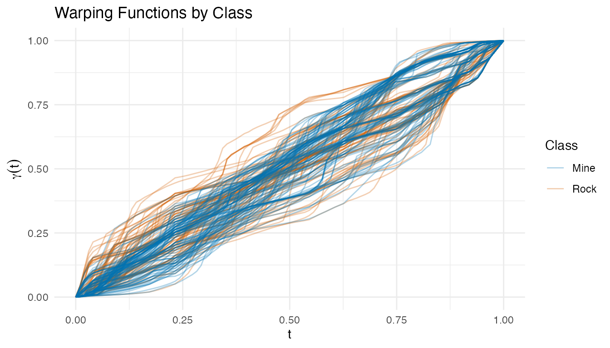
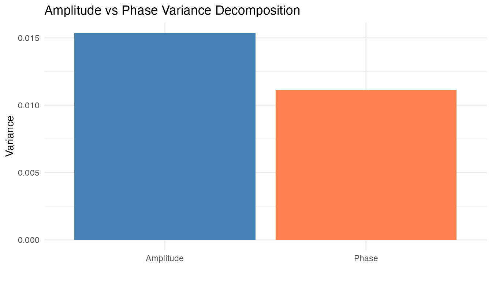
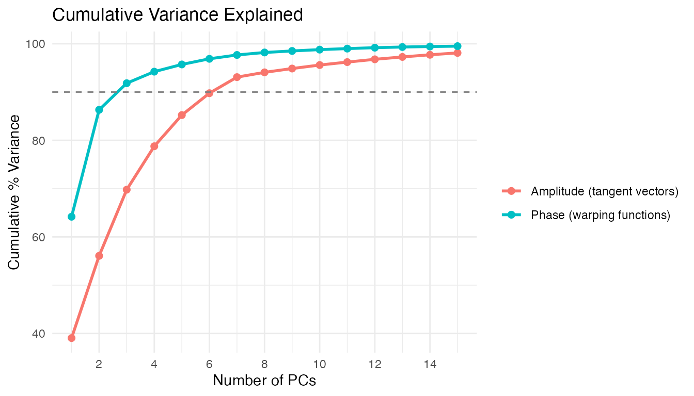

# Sonar: Mine vs Rock Classification via Elastic TSRVF

Sonar signals bounced off metal cylinders (mines) and rough rocks
produce different spectral return patterns. Each observation in the UCI
Sonar dataset consists of 60 frequency-band energy measurements — a
spectral profile that we treat as a functional curve. The challenge:
classify Mine vs Rock from these profiles.

This example applies the full elastic TSRVF pipeline and compares it
against raw, smoothed, and derivative-based features. The ablation study
reveals *when* elastic alignment helps — and when simpler approaches
suffice.

| Step                | What It Does                                                 | Outcome                                            |
|---------------------|--------------------------------------------------------------|----------------------------------------------------|
| Signal conditioning | Smooth + resample to \[0,1\]                                 | Ensure smooth derivatives for SRSF                 |
| Derivatives         | 1st and 2nd derivative of smoothed curves                    | Enhance spectral features, remove baseline         |
| Karcher mean        | Elastic alignment via SRSF + iterative mean                  | Aligned curves + warping functions $\gamma_{i}(t)$ |
| TSRVF projection    | Log map to tangent space at mean                             | Euclidean tangent vectors $v_{i}$                  |
| Feature extraction  | PCA on tangent vectors (amplitude) + PCA on warpings (phase) | Combined feature vector per sample                 |
| Ablation study      | CV accuracy across 7 feature representations                 | Compare raw, derivatives, aligned, and elastic     |

**Key finding:** On this spectral dataset, smoothed raw features with
sufficient FPCs outperform the elastic pipeline. Derivatives and elastic
alignment do not improve accuracy — the 60 frequency bands are fixed
physical measurements without genuine phase variability. This is an
instructive negative result: TSRVF shines on temporal data with timing
variation (e.g., growth curves), but spectral data needs different
tools.

``` r
library(fdars)
#> 
#> Attaching package: 'fdars'
#> The following objects are masked from 'package:stats':
#> 
#>     cov, decompose, deriv, median, sd, var
#> The following object is masked from 'package:base':
#> 
#>     norm
library(ggplot2)
library(patchwork)
theme_set(theme_minimal())
```

## 1. Data Preparation

The Sonar dataset contains 208 observations: 111 mines (M) and 97 rocks
(R). Each has 60 frequency-band energy measurements.

``` r
data(Sonar, package = "mlbench")

X <- as.matrix(Sonar[, 1:60])
y <- as.integer(Sonar$Class)  # 1 = M (mine), 2 = R (rock)
class_labels <- ifelse(y == 1, "Mine", "Rock")

cat("Observations:", nrow(X), "\n")
#> Observations: 208
cat("  Mines:", sum(y == 1), "| Rocks:", sum(y == 2), "\n")
#>   Mines: 111 | Rocks: 97
cat("Frequency bands:", ncol(X), "\n")
#> Frequency bands: 60

fd_raw <- fdata(X, argvals = seq(0, 1, length.out = 60))
```

``` r
plot(fd_raw, color = factor(class_labels),
     palette = c("Mine" = "#0072B2", "Rock" = "#D55E00"),
     alpha = 0.3) +
  labs(title = "Raw Sonar Returns by Class",
       x = "Frequency Band (normalized)", y = "Energy",
       color = "Class")
```


The raw profiles overlap substantially — mines and rocks share similar
spectral shapes, making this a challenging classification task.

## 2. Signal Conditioning & Derivatives

B-spline smoothing provides well-defined derivatives for the SRSF
transform and for derivative-based features. We compute both first and
second derivatives — commonly used in spectroscopy to remove baselines
and sharpen features.

``` r
# Smooth with B-splines on [0,1]
t_fine <- seq(0, 1, length.out = 100)
coefs <- fdata2basis(fd_raw, nbasis = 25, type = "bspline")
fd_smooth <- basis2fdata(coefs, t_fine)

# First and second derivatives
fd_d1 <- deriv(fd_smooth)
fd_d2 <- deriv(fd_d1)

cat("Smoothed grid:", ncol(fd_smooth$data), "points\n")
#> Smoothed grid: 100 points
```

``` r
p1 <- plot(fd_smooth, color = factor(class_labels),
           palette = c("Mine" = "#0072B2", "Rock" = "#D55E00"),
           alpha = 0.3) +
  labs(title = "Smoothed Spectra", x = "t", y = "f(t)", color = "Class")

p2 <- plot(fd_d1, color = factor(class_labels),
           palette = c("Mine" = "#0072B2", "Rock" = "#D55E00"),
           alpha = 0.3) +
  labs(title = "First Derivative", x = "t", y = "f'(t)", color = "Class")

p3 <- plot(fd_d2, color = factor(class_labels),
           palette = c("Mine" = "#0072B2", "Rock" = "#D55E00"),
           alpha = 0.3) +
  labs(title = "Second Derivative", x = "t", y = "f''(t)", color = "Class")

p1 / p2 / p3
```


The first derivative highlights slope differences between classes. The
second derivative enhances curvature features — peaks and troughs in the
original signal become more pronounced. Whether these enhance or degrade
classification depends on the signal-to-noise ratio.

## 3. Elastic Alignment & Karcher Mean

The Karcher mean aligns all curves elastically via the SRSF framework.
This separates **amplitude** variation (shape differences after
alignment) from **phase** variation (timing differences captured by
warping functions).

``` r
km <- karcher.mean(fd_smooth, max.iter = 20, tol = 1e-4)
aq <- alignment.quality(fd_smooth, km)
cat("Alignment quality:\n")
#> Alignment quality:
print(aq)
#> Alignment Quality Diagnostics
#>   Mean warp complexity: 0.3233 
#>   Mean warp smoothness: 2767.686 
#>   Total variance:      0.0265 
#>   Amplitude variance:  0.0154 
#>   Phase variance:      0.0111 
#>   Phase/Total ratio:   0.4196 
#>   Mean VR:             2.3341
```

``` r
p_orig <- plot(fd_smooth, color = factor(class_labels),
               palette = c("Mine" = "#0072B2", "Rock" = "#D55E00"),
               alpha = 0.3) +
  labs(title = "Before Alignment", x = "t", y = "f(t)", color = "Class")

p_aligned <- plot(km$aligned, color = factor(class_labels),
                  palette = c("Mine" = "#0072B2", "Rock" = "#D55E00"),
                  alpha = 0.3) +
  labs(title = "After Elastic Alignment", x = "t", y = "f(t)", color = "Class")

p_orig / p_aligned
```


``` r
plot(km$gammas, color = factor(class_labels),
     palette = c("Mine" = "#0072B2", "Rock" = "#D55E00"),
     alpha = 0.3) +
  labs(title = "Warping Functions by Class",
       x = "t", y = expression(gamma(t)),
       color = "Class")
```



The warping functions cluster tightly near the identity — indicating
that the curves had little genuine phase variability to begin with. This
is expected: frequency bands are fixed physical measurements, not time
points that shift between observations.

``` r
plot(aq, type = "variance") +
  labs(title = "Amplitude vs Phase Variance Decomposition")
```



## 4. TSRVF Projection

The TSRVF maps aligned curves to a tangent space at the Karcher mean,
where each curve is represented by a tangent vector capturing its shape
deviation.

``` r
tv <- tsrvf.from.alignment(km)

# Verify reconstruction quality
recon <- tsrvf.inverse(tv)
recon_err <- mean((km$aligned$data - recon$data)^2)
cat("Mean reconstruction error:", format(recon_err, digits = 4), "\n")
#> Mean reconstruction error: 0.004338
```

``` r
plot(tv$tangent_vectors, color = factor(class_labels),
     palette = c("Mine" = "#0072B2", "Rock" = "#D55E00"),
     alpha = 0.3) +
  labs(title = "TSRVF Tangent Vectors by Class",
       x = "t", y = expression(v[i](t)),
       color = "Class")
```


## 5. Feature Extraction

We extract features from both the amplitude (tangent vectors) and phase
(warping functions) spaces via PCA.

``` r
# Amplitude PCA (tangent vectors)
pca_amp <- prcomp(tv$tangent_vectors$data, center = TRUE)
var_amp <- pca_amp$sdev^2 / sum(pca_amp$sdev^2)

# Phase PCA (warping functions)
pca_phase <- prcomp(km$gammas$data, center = TRUE)
var_phase <- pca_phase$sdev^2 / sum(pca_phase$sdev^2)

# Choose components for ~90% variance
k_amp <- which(cumsum(var_amp) >= 0.90)[1]
k_phase <- which(cumsum(var_phase) >= 0.90)[1]
cat("Amplitude PCs for 90%:", k_amp, "\n")
#> Amplitude PCs for 90%: 7
cat("Phase PCs for 90%:", k_phase, "\n")
#> Phase PCs for 90%: 3
```

``` r
df_var <- rbind(
  data.frame(PC = 1:min(15, length(var_amp)),
             CumVar = cumsum(var_amp[1:min(15, length(var_amp))]) * 100,
             Space = "Amplitude (tangent vectors)"),
  data.frame(PC = 1:min(15, length(var_phase)),
             CumVar = cumsum(var_phase[1:min(15, length(var_phase))]) * 100,
             Space = "Phase (warping functions)")
)

ggplot(df_var, aes(x = PC, y = CumVar, color = Space)) +
  geom_line(linewidth = 1) +
  geom_point(size = 2) +
  geom_hline(yintercept = 90, linetype = "dashed", color = "grey50") +
  labs(title = "Cumulative Variance Explained",
       x = "Number of PCs", y = "Cumulative % Variance",
       color = "") +
  scale_x_continuous(breaks = seq(2, 15, by = 2))
```



``` r
df_amp <- data.frame(
  PC1 = pca_amp$x[, 1], PC2 = pca_amp$x[, 2],
  Class = class_labels
)
df_ph <- data.frame(
  PC1 = pca_phase$x[, 1], PC2 = pca_phase$x[, 2],
  Class = class_labels
)

p_amp <- ggplot(df_amp, aes(x = PC1, y = PC2, color = Class)) +
  geom_point(alpha = 0.6) +
  scale_color_manual(values = c("Mine" = "#0072B2", "Rock" = "#D55E00")) +
  labs(title = "Amplitude PC Scores", x = "PC1", y = "PC2") +
  coord_equal()

p_ph <- ggplot(df_ph, aes(x = PC1, y = PC2, color = Class)) +
  geom_point(alpha = 0.6) +
  scale_color_manual(values = c("Mine" = "#0072B2", "Rock" = "#D55E00")) +
  labs(title = "Phase PC Scores", x = "PC1", y = "PC2") +
  coord_equal()

p_amp + p_ph + plot_layout(guides = "collect")
```


Neither amplitude nor phase PC scores show strong class separation in
the first two components — the discriminative information is spread
across many dimensions.

``` r
amp_scores <- pca_amp$x[, 1:k_amp]
phase_scores <- pca_phase$x[, 1:k_phase]
combined <- cbind(amp_scores, phase_scores)
cat("Combined feature matrix:", nrow(combined), "x", ncol(combined), "\n")
#> Combined feature matrix: 208 x 10
```

## 6. Classification — Ablation Study

Seven feature representations, each evaluated with LDA and kNN via
10-fold cross-validation. We use `ncomp = 10` for curve-based features
(where FPCs are computed internally) and adapt for the pre-computed
combined features.

1.  **Raw**: original spectra on \[0,1\] (no smoothing, no alignment)
2.  **Smoothed**: B-spline smoothed spectra
3.  **1st derivative**: first derivative of smoothed spectra
4.  **2nd derivative**: second derivative of smoothed spectra
5.  **Aligned**: elastically aligned curves (no tangent projection)
6.  **Amplitude only**: TSRVF tangent vectors
7.  **Full elastic**: combined amplitude + phase PCA scores

``` r
# Prepare feature sets
fd_combined <- fdata(combined, argvals = seq_len(ncol(combined)))

feature_sets <- list(
  "Raw"            = fd_raw,
  "Smoothed"       = fd_smooth,
  "1st derivative" = fd_d1,
  "2nd derivative" = fd_d2,
  "Aligned"        = km$aligned,
  "Amplitude only" = tv$tangent_vectors,
  "Full elastic"   = fd_combined
)

methods <- c("lda", "knn")

# Run ablation
set.seed(42)
ablation <- data.frame(
  Features = character(),
  Method = character(),
  CV_Accuracy = numeric(),
  stringsAsFactors = FALSE
)

for (feat_name in names(feature_sets)) {
  for (meth in methods) {
    fd_i <- feature_sets[[feat_name]]
    nc <- min(10, ncol(fd_i$data) - 1)
    cv_i <- fclassif.cv(fd_i, y, method = meth, ncomp = nc,
                         nfold = 10, seed = 42)
    ablation <- rbind(ablation, data.frame(
      Features = feat_name,
      Method = toupper(meth),
      CV_Accuracy = round(1 - cv_i$error.rate, 3),
      stringsAsFactors = FALSE
    ))
  }
}

# Order features for display
ablation$Features <- factor(ablation$Features,
                             levels = names(feature_sets))

knitr::kable(ablation, caption = "10-Fold CV Accuracy: Ablation Study",
             row.names = FALSE)
```

| Features       | Method | CV_Accuracy |
|:---------------|:-------|------------:|
| Raw            | LDA    |       0.735 |
| Raw            | KNN    |       0.789 |
| Smoothed       | LDA    |       0.750 |
| Smoothed       | KNN    |       0.799 |
| 1st derivative | LDA    |       0.634 |
| 1st derivative | KNN    |       0.760 |
| 2nd derivative | LDA    |       0.634 |
| 2nd derivative | KNN    |       0.696 |
| Aligned        | LDA    |       0.640 |
| Aligned        | KNN    |       0.683 |
| Amplitude only | LDA    |       0.601 |
| Amplitude only | KNN    |       0.678 |
| Full elastic   | LDA    |       0.701 |
| Full elastic   | KNN    |       0.678 |

10-Fold CV Accuracy: Ablation Study

``` r
ggplot(ablation, aes(x = Features, y = CV_Accuracy, fill = Method)) +
  geom_col(position = "dodge", width = 0.6) +
  scale_fill_manual(values = c("LDA" = "#0072B2", "KNN" = "#D55E00")) +
  labs(title = "Classification Accuracy by Feature Representation",
       x = "", y = "10-Fold CV Accuracy") +
  ylim(0, 1) +
  theme(axis.text.x = element_text(angle = 30, hjust = 1))
```


## 7. Best Model Deep Dive

Train the best configuration on the full data and examine the confusion
matrix.

``` r
# Use the best method from ablation
best_idx <- which.max(ablation$CV_Accuracy)
best_method <- tolower(as.character(ablation$Method[best_idx]))
best_feat <- as.character(ablation$Features[best_idx])
best_fd <- feature_sets[[best_feat]]
best_nc <- min(10, ncol(best_fd$data) - 1)

cat("Best configuration:", best_feat, "+", toupper(best_method), "\n")
#> Best configuration: Smoothed + KNN

best_fit <- fclassif(best_fd, y, method = best_method, ncomp = best_nc)
cat("Training accuracy:", round(best_fit$accuracy, 3), "\n")
#> Training accuracy: 0.817

# Confusion matrix
plot(best_fit)
```


``` r
# Per-class accuracy
cm <- table(Predicted = best_fit$predicted, Actual = y)
class_acc <- diag(cm) / colSums(cm)
cat("Mine accuracy:", round(class_acc[1], 3), "\n")
#> Mine accuracy: 0.838
cat("Rock accuracy:", round(class_acc[2], 3), "\n")
#> Rock accuracy: 0.794
```

## 8. Conclusions

- **Smoothed raw features win** on this dataset. kNN with 10 FPCs on the
  smoothed (or raw) spectra achieves the highest CV accuracy.

- **Derivatives do not help.** First and second derivatives lose
  information from the spectral *levels* without adding discriminative
  power. Unlike chemometric data (where derivatives remove baseline
  shifts), sonar spectra have meaningful absolute energy levels.

- **Elastic alignment does not improve classification.** The warping
  functions cluster tightly near the identity, confirming that these
  frequency-band measurements lack genuine phase variability. The
  alignment step fits noise rather than removing nuisance variation.

- **When TSRVF shines vs. when it doesn’t.** Elastic alignment and TSRVF
  are designed for temporal curves where observations share common
  features that occur at different times (e.g., growth spurts, ECG
  peaks). For spectral data — where the x-axis represents fixed
  frequency bands rather than stretchable time — there is no phase
  variability to separate, and the simpler Euclidean analysis is both
  faster and more accurate.

- **Lesson for practitioners:** Always include the raw baseline in an
  ablation study. Sophisticated machinery can degrade performance when
  its assumptions (here: meaningful phase variability) do not hold.

## See Also

- [`vignette("articles/tsrvf")`](https://sipemu.github.io/fdars-r/articles/tsrvf.md)
  — TSRVF theory and linearized elastic analysis
- [`vignette("articles/elastic-alignment")`](https://sipemu.github.io/fdars-r/articles/elastic-alignment.md)
  — elastic alignment and Karcher mean
- [`vignette("articles/functional-classification")`](https://sipemu.github.io/fdars-r/articles/functional-classification.md)
  — supervised classification methods (LDA, QDA, kNN, kernel, DD)
- `vignette("articles/example-tecator-regression")` — Tecator NIR
  spectra where derivatives *do* improve prediction

## References

- Gorman, R.P. and Sejnowski, T.J. (1988). Analysis of hidden units in a
  layered network trained to classify sonar targets. *Neural Networks*,
  1(1), 75–89.
- Srivastava, A., Wu, W., Kurtek, S., Klassen, E., and Marron, J.S.
  (2011). Registration of functional data using the Fisher-Rao metric.
  *arXiv:1103.3817*.
- Tucker, J.D. (2014). Generative models for functional data using phase
  and amplitude separation. *Computational Statistics & Data Analysis*,
  61, 50–66.
