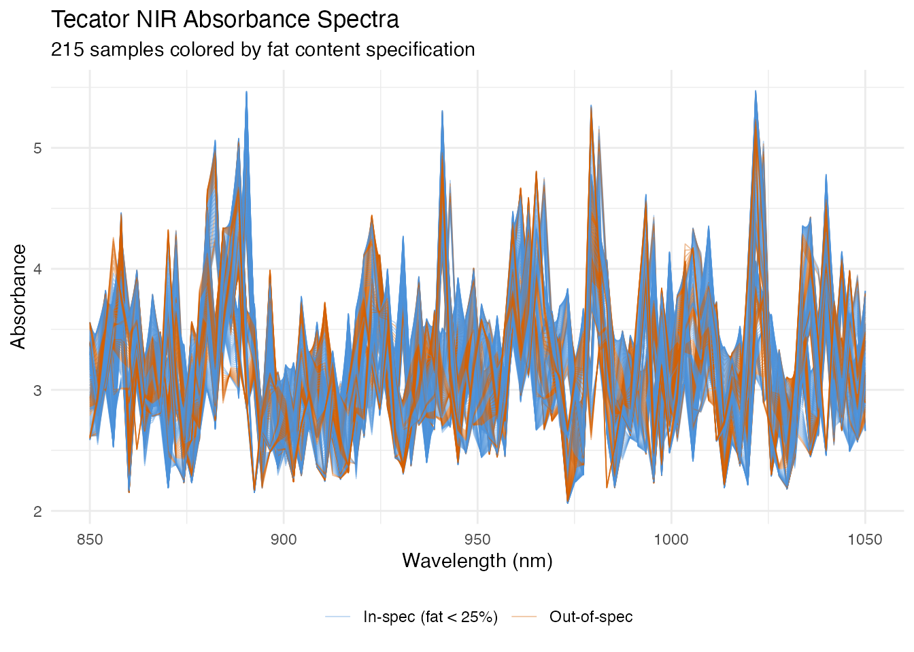
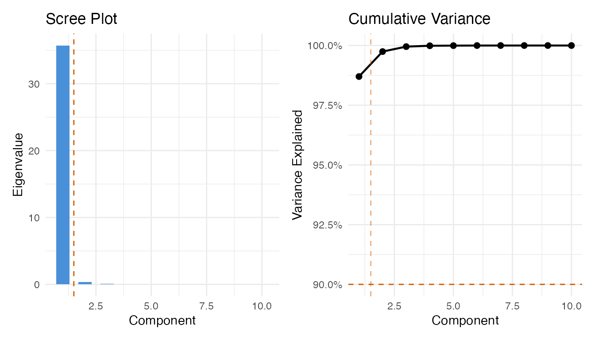
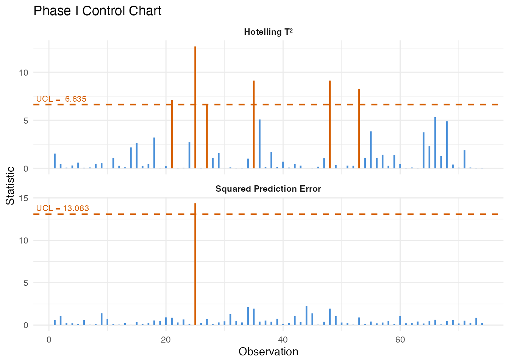
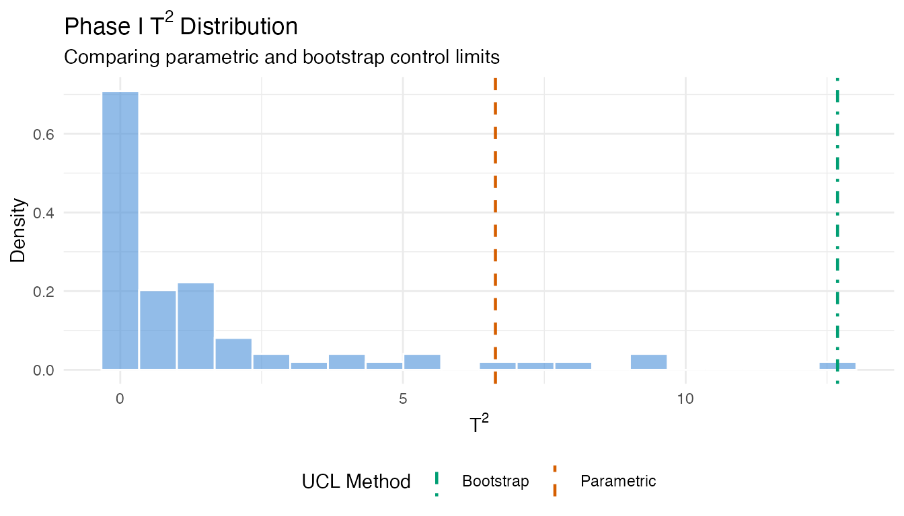
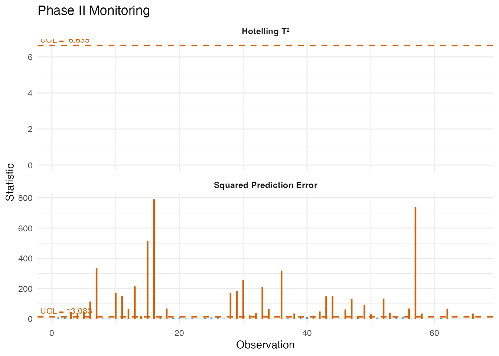
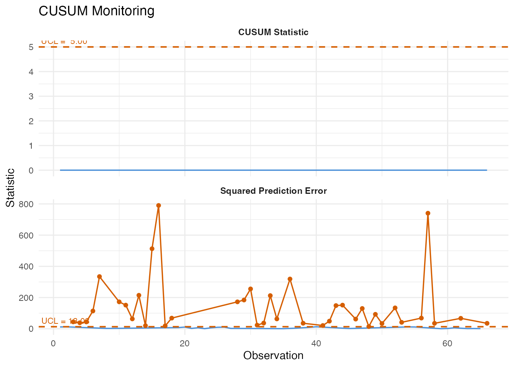
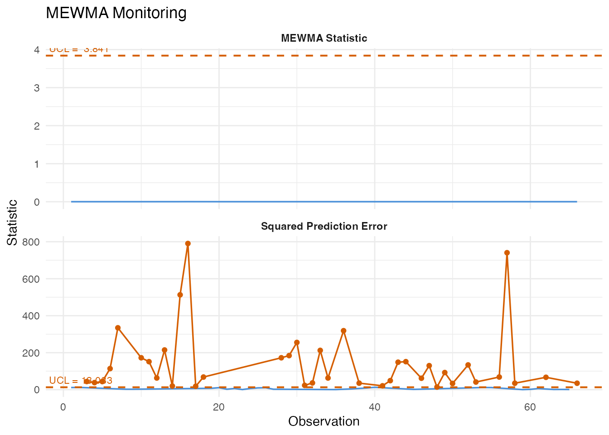
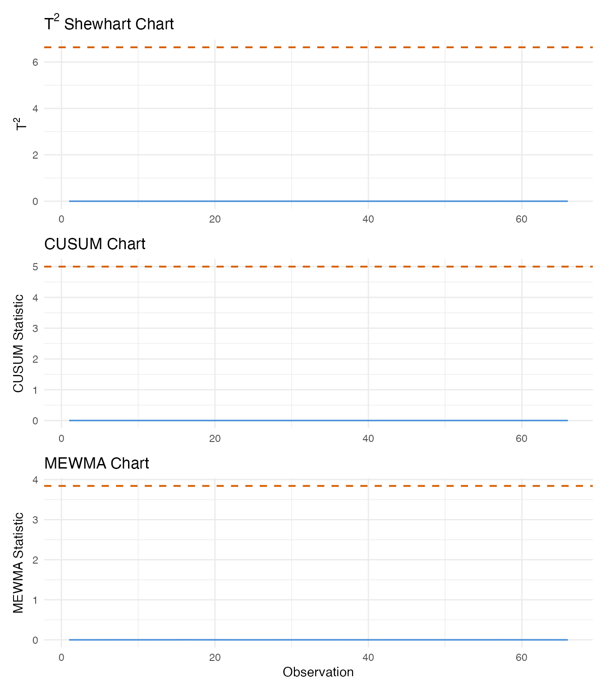
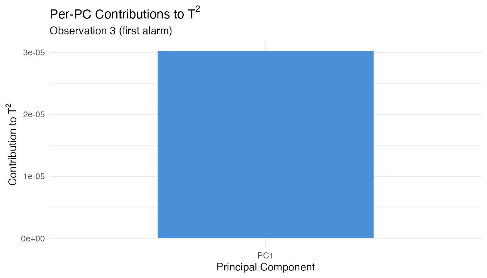
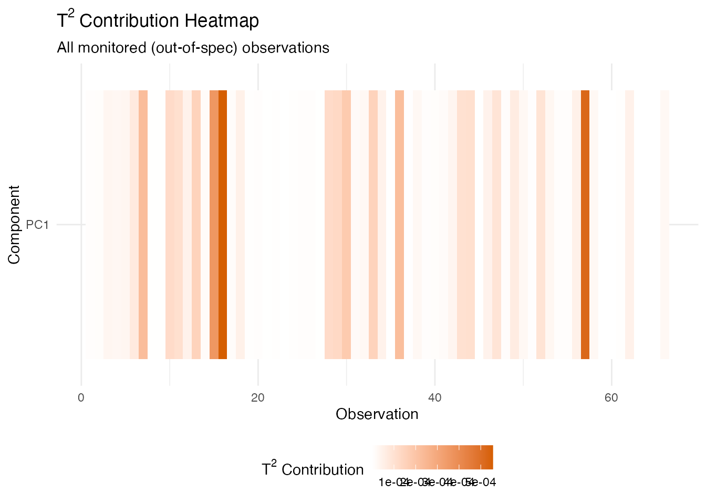

# Tecator Spectra: Inline Quality Monitoring

``` r
library(fdars)
#> 
#> Attaching package: 'fdars'
#> The following objects are masked from 'package:stats':
#> 
#>     cov, decompose, deriv, median, sd, var
#> The following object is masked from 'package:base':
#> 
#>     norm
library(ggplot2)
library(patchwork)
theme_set(theme_minimal())
set.seed(42)
```

## Overview

This article walks through a complete inline quality monitoring pipeline
using the Tecator NIR absorbance dataset. We treat the 215 spectra as
production measurements and build a control chart that detects
out-of-spec product (high-fat content) from the spectral shape alone.

| Step                       | What It Does                                     | Outcome                                       |
|----------------------------|--------------------------------------------------|-----------------------------------------------|
| 1\. Data preparation       | Load spectra, split by fat content               | In-spec vs out-of-spec groups                 |
| 2\. Phase I calibration    | Build FPCA-based control chart from in-spec data | T-squared and SPE control limits              |
| 3\. Robust limits          | Compare parametric vs bootstrap limits           | Protection against distributional assumptions |
| 4\. Phase II monitoring    | Project out-of-spec spectra through the chart    | Alarm flags on deviant samples                |
| 5\. Western Electric rules | Apply run rules to detect patterns               | Catch trends and oscillations                 |
| 6\. CUSUM monitoring       | Accumulate evidence of persistent shifts         | Early detection of sustained deviations       |
| 7\. MEWMA monitoring       | Smooth multivariate scores over time             | Sensitive detection of small shifts           |
| 8\. Detection comparison   | Side-by-side comparison of three methods         | Identify fastest detection approach           |
| 9\. Fault diagnosis        | Decompose alarms into PC contributions           | Pinpoint wavelength regions of concern        |

## 1. The Data

The Tecator dataset from the fda.usc package contains 215 near-infrared
(NIR) absorbance spectra measured at 100 wavelengths between 850 and
1050 nm. Each sample has an associated fat percentage. We treat samples
with fat content below 25% as “in-specification” (normal production) and
the rest as out-of-spec.

``` r
data(tecator, package = "fda.usc")

# Extract wavelengths and absorbance matrix
wavelengths <- seq(850, 1050, length.out = 100)
absorp_mat <- tecator$absorp.fdata$data
fat <- tecator$y$Fat

# Convert to fdars fdata
fd_all <- fdata(absorp_mat, argvals = wavelengths)

# Define in-spec: fat < 25%
in_spec <- fat < 25
cat("In-spec samples:", sum(in_spec), "\n")
#> In-spec samples: 149
cat("Out-of-spec samples:", sum(!in_spec), "\n")
#> Out-of-spec samples: 66
```

``` r
# Build a data frame for plotting all 215 spectra
n_all <- nrow(absorp_mat)
df_spectra <- data.frame(
  wavelength = rep(wavelengths, each = n_all),
  absorbance = as.vector(t(absorp_mat)),
  sample = rep(seq_len(n_all), times = 100),
  group = rep(ifelse(in_spec, "In-spec (fat < 25%)", "Out-of-spec"), times = 100)
)

ggplot(df_spectra, aes(x = .data$wavelength, y = .data$absorbance,
                       group = .data$sample, color = .data$group)) +
  geom_line(alpha = 0.4, linewidth = 0.3) +
  scale_color_manual(values = c("In-spec (fat < 25%)" = "#4A90D9",
                                "Out-of-spec" = "#D55E00")) +
  labs(title = "Tecator NIR Absorbance Spectra",
       subtitle = "215 samples colored by fat content specification",
       x = "Wavelength (nm)", y = "Absorbance",
       color = NULL) +
  theme(legend.position = "bottom")
```



The two groups overlap substantially in the raw spectral space, but
subtle shape differences – especially in the 930–1000 nm region where
fat absorption bands lie – distinguish them. The monitoring chart will
learn these differences from the in-spec data alone.

## 2. Phase I Calibration

We use the in-spec samples to build the Phase I control chart. First, we
select the number of FPCA components via the variance-90% rule, then
build the chart at significance level 0.01.

``` r
fd_train <- fd_all[in_spec, ]
```

``` r
# Build a preliminary chart with many components to get eigenvalues
chart_prelim <- spm.phase1(fd_train, ncomp = 10, alpha = 0.01, seed = 42)

# Select components using cumulative variance >= 90%
ncomp_sel <- spm.ncomp.select(chart_prelim$eigenvalues,
                               method = "variance90", threshold = 0.9)
cat("Selected components:", ncomp_sel, "\n")
#> Selected components: 1
```

``` r
eig <- chart_prelim$eigenvalues
cum_var <- cumsum(eig) / sum(eig)
df_scree <- data.frame(
  pc = seq_along(eig),
  eigenvalue = eig,
  cum_var = cum_var
)

p1 <- ggplot(df_scree, aes(x = .data$pc, y = .data$eigenvalue)) +
  geom_col(fill = "#4A90D9", width = 0.6) +
  geom_vline(xintercept = ncomp_sel + 0.5, linetype = "dashed", color = "#D55E00") +
  labs(title = "Scree Plot", x = "Component", y = "Eigenvalue")

p2 <- ggplot(df_scree, aes(x = .data$pc, y = .data$cum_var)) +
  geom_line(linewidth = 0.8) +
  geom_point(size = 2) +
  geom_hline(yintercept = 0.9, linetype = "dashed", color = "#D55E00") +
  geom_vline(xintercept = ncomp_sel + 0.5, linetype = "dashed",
             color = "#D55E00", alpha = 0.5) +
  scale_y_continuous(labels = scales::percent_format()) +
  labs(title = "Cumulative Variance", x = "Component", y = "Variance Explained")

p1 + p2
```



Now build the Phase I chart with the selected number of components:

``` r
chart <- spm.phase1(fd_train, ncomp = ncomp_sel, alpha = 0.01, seed = 42)
print(chart)
#> SPM Control Chart (Phase I)
#>   Components: 1 
#>   Alpha: 0.01 
#>   T2 UCL: 6.635 
#>   SPE UCL: 13.08 
#>   Observations: 149 
#>   Grid points: 100 
#>   Eigenvalues: 35.7
```

``` r
plot(chart)
```



All Phase I observations should be in-control since they were
pre-screened as in-spec product. Any observations exceeding the UCL at
this stage would indicate either contamination in the training set or
that the control limit is too tight for the available sample size.

## 3. Robust Control Limits

The parametric T-squared limit assumes an F-distribution. When the
sample size is small or the distribution is skewed, bootstrap limits can
be more reliable.

``` r
# Bootstrap T-squared limit
robust_t2 <- spm.limit.robust(chart$t2.phase1, ncomp = ncomp_sel,
                               alpha = 0.01, type = "t2",
                               method = "bootstrap",
                               n.bootstrap = 500, seed = 42)

# Bootstrap SPE limit
robust_spe <- spm.limit.robust(chart$spe.phase1,
                                alpha = 0.01, type = "spe",
                                method = "bootstrap",
                                n.bootstrap = 500, seed = 42)

cat("Parametric T2 UCL:", format(chart$t2.ucl, digits = 4), "\n")
#> Parametric T2 UCL: 6.635
cat("Bootstrap  T2 UCL:", format(robust_t2$ucl, digits = 4), "\n")
#> Bootstrap  T2 UCL: 12.69
cat("Parametric SPE UCL:", format(chart$spe.ucl, digits = 4), "\n")
#> Parametric SPE UCL: 13.08
cat("Bootstrap  SPE UCL:", format(robust_spe$ucl, digits = 4), "\n")
#> Bootstrap  SPE UCL: 14.38
```

``` r
# Visualize bootstrap T2 distribution vs parametric limit
df_boot <- data.frame(t2 = chart$t2.phase1)

ggplot(df_boot, aes(x = .data$t2)) +
  geom_histogram(aes(y = after_stat(density)), bins = 20,
                 fill = "#4A90D9", alpha = 0.6, color = "white") +
  geom_vline(aes(xintercept = chart$t2.ucl, linetype = "Parametric"),
             color = "#D55E00", linewidth = 0.8) +
  geom_vline(aes(xintercept = robust_t2$ucl, linetype = "Bootstrap"),
             color = "#009E73", linewidth = 0.8) +
  scale_linetype_manual(
    values = c("Parametric" = "dashed", "Bootstrap" = "dotdash"),
    name = "UCL Method"
  ) +
  labs(title = expression("Phase I T"^2 * " Distribution"),
       subtitle = "Comparing parametric and bootstrap control limits",
       x = expression("T"^2), y = "Density") +
  theme(legend.position = "bottom")
```



When the parametric and bootstrap limits agree, the F-distribution
assumption is reasonable. When they diverge, the bootstrap limit is
generally more trustworthy – it makes no distributional assumptions and
adapts to the empirical tail behavior.

## 4. Basic Monitoring (Phase II)

We now monitor the out-of-spec samples. These represent high-fat product
that should trigger alarms if the chart is sensitive to the spectral
differences associated with fat content.

``` r
fd_test <- fd_all[!in_spec, ]
mon <- spm.monitor(chart, fd_test)
print(mon)
#> SPM Monitoring Result (Phase II)
#>   Observations: 66 
#>   T2 alarms: 0 of 66 (0%) 
#>   SPE alarms: 39 of 66 (59.1%) 
#>   T2 UCL: 6.635 
#>   SPE UCL: 13.08

# Count alarms
n_t2_alarm <- sum(mon$t2.alarm)
n_spe_alarm <- sum(mon$spe.alarm)
n_either <- sum(mon$t2.alarm | mon$spe.alarm)
n_test <- nrow(fd_test$data)

cat("\nT2 alarms:", n_t2_alarm, "of", n_test, "\n")
#> 
#> T2 alarms: 0 of 66
cat("SPE alarms:", n_spe_alarm, "of", n_test, "\n")
#> SPE alarms: 39 of 66
cat("Either alarm:", n_either, "of", n_test, "\n")
#> Either alarm: 39 of 66
```

``` r
plot(mon)
```



A high detection rate among the out-of-spec samples validates the chart:
the spectral differences driven by high fat content produce elevated
T-squared or SPE values that breach the control limits.

## 5. Western Electric Rules

Single-point UCL violations are the simplest alarm criterion. Run rules
detect subtler patterns – trends, oscillations, and clustering near the
limits – that also indicate a non-random process.

``` r
# Compute center and sigma from Phase I T2 values for the rules
t2_center <- mean(chart$t2.phase1)
t2_sigma <- sd(chart$t2.phase1)

# Apply Western Electric rules to Phase II T2 values
rules_we <- spm.rules(mon$t2, center = t2_center, sigma = t2_sigma,
                       rule.set = "western.electric")
print(rules_we)
#> SPM Control Chart Rule Evaluation
#>   Rule set: western.electric 
#>   Observations: 66 
#>   Center: 1.546 
#>   Sigma: 2.569 
#>   Violations found: 59 
#>     WE4: indices [1, 2, 3, 4, 5, 6, 7, 8]
#>     WE4: indices [2, 3, 4, 5, 6, 7, 8, 9]
#>     WE4: indices [3, 4, 5, 6, 7, 8, 9, 10]
#>     WE4: indices [4, 5, 6, 7, 8, 9, 10, 11]
#>     WE4: indices [5, 6, 7, 8, 9, 10, 11, 12]
#>     WE4: indices [6, 7, 8, 9, 10, 11, 12, 13]
#>     WE4: indices [7, 8, 9, 10, 11, 12, 13, 14]
#>     WE4: indices [8, 9, 10, 11, 12, 13, 14, 15]
#>     WE4: indices [9, 10, 11, 12, 13, 14, 15, 16]
#>     WE4: indices [10, 11, 12, 13, 14, 15, 16, 17]
#>     WE4: indices [11, 12, 13, 14, 15, 16, 17, 18]
#>     WE4: indices [12, 13, 14, 15, 16, 17, 18, 19]
#>     WE4: indices [13, 14, 15, 16, 17, 18, 19, 20]
#>     WE4: indices [14, 15, 16, 17, 18, 19, 20, 21]
#>     WE4: indices [15, 16, 17, 18, 19, 20, 21, 22]
#>     WE4: indices [16, 17, 18, 19, 20, 21, 22, 23]
#>     WE4: indices [17, 18, 19, 20, 21, 22, 23, 24]
#>     WE4: indices [18, 19, 20, 21, 22, 23, 24, 25]
#>     WE4: indices [19, 20, 21, 22, 23, 24, 25, 26]
#>     WE4: indices [20, 21, 22, 23, 24, 25, 26, 27]
#>     WE4: indices [21, 22, 23, 24, 25, 26, 27, 28]
#>     WE4: indices [22, 23, 24, 25, 26, 27, 28, 29]
#>     WE4: indices [23, 24, 25, 26, 27, 28, 29, 30]
#>     WE4: indices [24, 25, 26, 27, 28, 29, 30, 31]
#>     WE4: indices [25, 26, 27, 28, 29, 30, 31, 32]
#>     WE4: indices [26, 27, 28, 29, 30, 31, 32, 33]
#>     WE4: indices [27, 28, 29, 30, 31, 32, 33, 34]
#>     WE4: indices [28, 29, 30, 31, 32, 33, 34, 35]
#>     WE4: indices [29, 30, 31, 32, 33, 34, 35, 36]
#>     WE4: indices [30, 31, 32, 33, 34, 35, 36, 37]
#>     WE4: indices [31, 32, 33, 34, 35, 36, 37, 38]
#>     WE4: indices [32, 33, 34, 35, 36, 37, 38, 39]
#>     WE4: indices [33, 34, 35, 36, 37, 38, 39, 40]
#>     WE4: indices [34, 35, 36, 37, 38, 39, 40, 41]
#>     WE4: indices [35, 36, 37, 38, 39, 40, 41, 42]
#>     WE4: indices [36, 37, 38, 39, 40, 41, 42, 43]
#>     WE4: indices [37, 38, 39, 40, 41, 42, 43, 44]
#>     WE4: indices [38, 39, 40, 41, 42, 43, 44, 45]
#>     WE4: indices [39, 40, 41, 42, 43, 44, 45, 46]
#>     WE4: indices [40, 41, 42, 43, 44, 45, 46, 47]
#>     WE4: indices [41, 42, 43, 44, 45, 46, 47, 48]
#>     WE4: indices [42, 43, 44, 45, 46, 47, 48, 49]
#>     WE4: indices [43, 44, 45, 46, 47, 48, 49, 50]
#>     WE4: indices [44, 45, 46, 47, 48, 49, 50, 51]
#>     WE4: indices [45, 46, 47, 48, 49, 50, 51, 52]
#>     WE4: indices [46, 47, 48, 49, 50, 51, 52, 53]
#>     WE4: indices [47, 48, 49, 50, 51, 52, 53, 54]
#>     WE4: indices [48, 49, 50, 51, 52, 53, 54, 55]
#>     WE4: indices [49, 50, 51, 52, 53, 54, 55, 56]
#>     WE4: indices [50, 51, 52, 53, 54, 55, 56, 57]
#>     WE4: indices [51, 52, 53, 54, 55, 56, 57, 58]
#>     WE4: indices [52, 53, 54, 55, 56, 57, 58, 59]
#>     WE4: indices [53, 54, 55, 56, 57, 58, 59, 60]
#>     WE4: indices [54, 55, 56, 57, 58, 59, 60, 61]
#>     WE4: indices [55, 56, 57, 58, 59, 60, 61, 62]
#>     WE4: indices [56, 57, 58, 59, 60, 61, 62, 63]
#>     WE4: indices [57, 58, 59, 60, 61, 62, 63, 64]
#>     WE4: indices [58, 59, 60, 61, 62, 63, 64, 65]
#>     WE4: indices [59, 60, 61, 62, 63, 64, 65, 66]
```

``` r
# Apply Nelson rules (8 rules, more comprehensive)
rules_nelson <- spm.rules(mon$t2, center = t2_center, sigma = t2_sigma,
                           rule.set = "nelson")
print(rules_nelson)
#> SPM Control Chart Rule Evaluation
#>   Rule set: nelson 
#>   Observations: 66 
#>   Center: 1.546 
#>   Sigma: 2.569 
#>   Violations found: 112 
#>     WE4: indices [1, 2, 3, 4, 5, 6, 7, 8]
#>     WE4: indices [2, 3, 4, 5, 6, 7, 8, 9]
#>     WE4: indices [3, 4, 5, 6, 7, 8, 9, 10]
#>     WE4: indices [4, 5, 6, 7, 8, 9, 10, 11]
#>     WE4: indices [5, 6, 7, 8, 9, 10, 11, 12]
#>     WE4: indices [6, 7, 8, 9, 10, 11, 12, 13]
#>     WE4: indices [7, 8, 9, 10, 11, 12, 13, 14]
#>     WE4: indices [8, 9, 10, 11, 12, 13, 14, 15]
#>     WE4: indices [9, 10, 11, 12, 13, 14, 15, 16]
#>     WE4: indices [10, 11, 12, 13, 14, 15, 16, 17]
#>     WE4: indices [11, 12, 13, 14, 15, 16, 17, 18]
#>     WE4: indices [12, 13, 14, 15, 16, 17, 18, 19]
#>     WE4: indices [13, 14, 15, 16, 17, 18, 19, 20]
#>     WE4: indices [14, 15, 16, 17, 18, 19, 20, 21]
#>     WE4: indices [15, 16, 17, 18, 19, 20, 21, 22]
#>     WE4: indices [16, 17, 18, 19, 20, 21, 22, 23]
#>     WE4: indices [17, 18, 19, 20, 21, 22, 23, 24]
#>     WE4: indices [18, 19, 20, 21, 22, 23, 24, 25]
#>     WE4: indices [19, 20, 21, 22, 23, 24, 25, 26]
#>     WE4: indices [20, 21, 22, 23, 24, 25, 26, 27]
#>     WE4: indices [21, 22, 23, 24, 25, 26, 27, 28]
#>     WE4: indices [22, 23, 24, 25, 26, 27, 28, 29]
#>     WE4: indices [23, 24, 25, 26, 27, 28, 29, 30]
#>     WE4: indices [24, 25, 26, 27, 28, 29, 30, 31]
#>     WE4: indices [25, 26, 27, 28, 29, 30, 31, 32]
#>     WE4: indices [26, 27, 28, 29, 30, 31, 32, 33]
#>     WE4: indices [27, 28, 29, 30, 31, 32, 33, 34]
#>     WE4: indices [28, 29, 30, 31, 32, 33, 34, 35]
#>     WE4: indices [29, 30, 31, 32, 33, 34, 35, 36]
#>     WE4: indices [30, 31, 32, 33, 34, 35, 36, 37]
#>     WE4: indices [31, 32, 33, 34, 35, 36, 37, 38]
#>     WE4: indices [32, 33, 34, 35, 36, 37, 38, 39]
#>     WE4: indices [33, 34, 35, 36, 37, 38, 39, 40]
#>     WE4: indices [34, 35, 36, 37, 38, 39, 40, 41]
#>     WE4: indices [35, 36, 37, 38, 39, 40, 41, 42]
#>     WE4: indices [36, 37, 38, 39, 40, 41, 42, 43]
#>     WE4: indices [37, 38, 39, 40, 41, 42, 43, 44]
#>     WE4: indices [38, 39, 40, 41, 42, 43, 44, 45]
#>     WE4: indices [39, 40, 41, 42, 43, 44, 45, 46]
#>     WE4: indices [40, 41, 42, 43, 44, 45, 46, 47]
#>     WE4: indices [41, 42, 43, 44, 45, 46, 47, 48]
#>     WE4: indices [42, 43, 44, 45, 46, 47, 48, 49]
#>     WE4: indices [43, 44, 45, 46, 47, 48, 49, 50]
#>     WE4: indices [44, 45, 46, 47, 48, 49, 50, 51]
#>     WE4: indices [45, 46, 47, 48, 49, 50, 51, 52]
#>     WE4: indices [46, 47, 48, 49, 50, 51, 52, 53]
#>     WE4: indices [47, 48, 49, 50, 51, 52, 53, 54]
#>     WE4: indices [48, 49, 50, 51, 52, 53, 54, 55]
#>     WE4: indices [49, 50, 51, 52, 53, 54, 55, 56]
#>     WE4: indices [50, 51, 52, 53, 54, 55, 56, 57]
#>     WE4: indices [51, 52, 53, 54, 55, 56, 57, 58]
#>     WE4: indices [52, 53, 54, 55, 56, 57, 58, 59]
#>     WE4: indices [53, 54, 55, 56, 57, 58, 59, 60]
#>     WE4: indices [54, 55, 56, 57, 58, 59, 60, 61]
#>     WE4: indices [55, 56, 57, 58, 59, 60, 61, 62]
#>     WE4: indices [56, 57, 58, 59, 60, 61, 62, 63]
#>     WE4: indices [57, 58, 59, 60, 61, 62, 63, 64]
#>     WE4: indices [58, 59, 60, 61, 62, 63, 64, 65]
#>     WE4: indices [59, 60, 61, 62, 63, 64, 65, 66]
#>     Nelson5: indices [39, 40, 41, 42, 43, 44]
#>     Nelson7: indices [1, 2, 3, 4, 5, 6, 7, 8, 9, 10...]
#>     Nelson7: indices [2, 3, 4, 5, 6, 7, 8, 9, 10, 11...]
#>     Nelson7: indices [3, 4, 5, 6, 7, 8, 9, 10, 11, 12...]
#>     Nelson7: indices [4, 5, 6, 7, 8, 9, 10, 11, 12, 13...]
#>     Nelson7: indices [5, 6, 7, 8, 9, 10, 11, 12, 13, 14...]
#>     Nelson7: indices [6, 7, 8, 9, 10, 11, 12, 13, 14, 15...]
#>     Nelson7: indices [7, 8, 9, 10, 11, 12, 13, 14, 15, 16...]
#>     Nelson7: indices [8, 9, 10, 11, 12, 13, 14, 15, 16, 17...]
#>     Nelson7: indices [9, 10, 11, 12, 13, 14, 15, 16, 17, 18...]
#>     Nelson7: indices [10, 11, 12, 13, 14, 15, 16, 17, 18, 19...]
#>     Nelson7: indices [11, 12, 13, 14, 15, 16, 17, 18, 19, 20...]
#>     Nelson7: indices [12, 13, 14, 15, 16, 17, 18, 19, 20, 21...]
#>     Nelson7: indices [13, 14, 15, 16, 17, 18, 19, 20, 21, 22...]
#>     Nelson7: indices [14, 15, 16, 17, 18, 19, 20, 21, 22, 23...]
#>     Nelson7: indices [15, 16, 17, 18, 19, 20, 21, 22, 23, 24...]
#>     Nelson7: indices [16, 17, 18, 19, 20, 21, 22, 23, 24, 25...]
#>     Nelson7: indices [17, 18, 19, 20, 21, 22, 23, 24, 25, 26...]
#>     Nelson7: indices [18, 19, 20, 21, 22, 23, 24, 25, 26, 27...]
#>     Nelson7: indices [19, 20, 21, 22, 23, 24, 25, 26, 27, 28...]
#>     Nelson7: indices [20, 21, 22, 23, 24, 25, 26, 27, 28, 29...]
#>     Nelson7: indices [21, 22, 23, 24, 25, 26, 27, 28, 29, 30...]
#>     Nelson7: indices [22, 23, 24, 25, 26, 27, 28, 29, 30, 31...]
#>     Nelson7: indices [23, 24, 25, 26, 27, 28, 29, 30, 31, 32...]
#>     Nelson7: indices [24, 25, 26, 27, 28, 29, 30, 31, 32, 33...]
#>     Nelson7: indices [25, 26, 27, 28, 29, 30, 31, 32, 33, 34...]
#>     Nelson7: indices [26, 27, 28, 29, 30, 31, 32, 33, 34, 35...]
#>     Nelson7: indices [27, 28, 29, 30, 31, 32, 33, 34, 35, 36...]
#>     Nelson7: indices [28, 29, 30, 31, 32, 33, 34, 35, 36, 37...]
#>     Nelson7: indices [29, 30, 31, 32, 33, 34, 35, 36, 37, 38...]
#>     Nelson7: indices [30, 31, 32, 33, 34, 35, 36, 37, 38, 39...]
#>     Nelson7: indices [31, 32, 33, 34, 35, 36, 37, 38, 39, 40...]
#>     Nelson7: indices [32, 33, 34, 35, 36, 37, 38, 39, 40, 41...]
#>     Nelson7: indices [33, 34, 35, 36, 37, 38, 39, 40, 41, 42...]
#>     Nelson7: indices [34, 35, 36, 37, 38, 39, 40, 41, 42, 43...]
#>     Nelson7: indices [35, 36, 37, 38, 39, 40, 41, 42, 43, 44...]
#>     Nelson7: indices [36, 37, 38, 39, 40, 41, 42, 43, 44, 45...]
#>     Nelson7: indices [37, 38, 39, 40, 41, 42, 43, 44, 45, 46...]
#>     Nelson7: indices [38, 39, 40, 41, 42, 43, 44, 45, 46, 47...]
#>     Nelson7: indices [39, 40, 41, 42, 43, 44, 45, 46, 47, 48...]
#>     Nelson7: indices [40, 41, 42, 43, 44, 45, 46, 47, 48, 49...]
#>     Nelson7: indices [41, 42, 43, 44, 45, 46, 47, 48, 49, 50...]
#>     Nelson7: indices [42, 43, 44, 45, 46, 47, 48, 49, 50, 51...]
#>     Nelson7: indices [43, 44, 45, 46, 47, 48, 49, 50, 51, 52...]
#>     Nelson7: indices [44, 45, 46, 47, 48, 49, 50, 51, 52, 53...]
#>     Nelson7: indices [45, 46, 47, 48, 49, 50, 51, 52, 53, 54...]
#>     Nelson7: indices [46, 47, 48, 49, 50, 51, 52, 53, 54, 55...]
#>     Nelson7: indices [47, 48, 49, 50, 51, 52, 53, 54, 55, 56...]
#>     Nelson7: indices [48, 49, 50, 51, 52, 53, 54, 55, 56, 57...]
#>     Nelson7: indices [49, 50, 51, 52, 53, 54, 55, 56, 57, 58...]
#>     Nelson7: indices [50, 51, 52, 53, 54, 55, 56, 57, 58, 59...]
#>     Nelson7: indices [51, 52, 53, 54, 55, 56, 57, 58, 59, 60...]
#>     Nelson7: indices [52, 53, 54, 55, 56, 57, 58, 59, 60, 61...]
```

The Western Electric rules check four patterns: a single point beyond
3-sigma, two of three consecutive points beyond 2-sigma, four of five
beyond 1-sigma, and eight consecutive points on one side of the center.
The Nelson rules extend this to eight patterns including trends and
oscillations. For production monitoring, run rules catch systematic
drift that a single UCL violation would miss.

## 6. CUSUM Monitoring

The Cumulative Sum (CUSUM) chart accumulates evidence of a mean shift
over time. It is more sensitive than a Shewhart chart to small
persistent deviations – exactly the scenario when production quality
degrades gradually.

``` r
cusum <- spm.cusum(chart, fd_test, k = 0.5, h = 5.0)
print(cusum)
#> SPM CUSUM Monitoring
#>   Observations: 66 
#>   k: 0.5 
#>   h (UCL): 5 
#>   Restart: FALSE 
#>   CUSUM alarms: 0 of 66 (0%) 
#>   SPE alarms: 39 of 66 (59.1%)
```

``` r
plot(cusum)
```



``` r
# First CUSUM alarm
first_cusum <- which(cusum$alarm)[1]
cat("CUSUM first alarm at observation:", first_cusum, "\n")
#> CUSUM first alarm at observation: NA
```

The allowance parameter `k` controls the size of shift the CUSUM is
tuned to detect (smaller `k` is more sensitive to smaller shifts), and
the decision interval `h` controls the false alarm rate (larger `h`
means fewer false alarms but slower detection).

## 7. MEWMA Monitoring

The Multivariate Exponentially Weighted Moving Average (MEWMA) chart
smooths the FPC score vectors over time, then computes a Hotelling-type
statistic on the smoothed vectors. Like CUSUM, it trades some
single-point sensitivity for better detection of persistent shifts.

``` r
mewma <- spm.mewma(chart, fd_test, lambda = 0.2)
print(mewma)
#> SPM MEWMA Monitoring
#>   Observations: 66 
#>   Lambda: 0.2 
#>   UCL: 3.841 
#>   MEWMA alarms: 0 of 66 (0%) 
#>   SPE alarms: 39 of 66 (59.1%)
```

``` r
plot(mewma)
```



``` r
first_mewma <- which(mewma$alarm)[1]
cat("MEWMA first alarm at observation:", first_mewma, "\n")
#> MEWMA first alarm at observation: NA
```

The smoothing parameter `lambda` controls memory: values near 0 give
heavy smoothing (high sensitivity to small shifts but slower response),
while `lambda = 1` reduces to the standard Shewhart chart.

## 8. Detection Comparison

We now compare all three monitoring methods side by side. For each, we
identify when the first alarm fires and how many total alarms are
triggered.

``` r
# First alarm indices
first_t2 <- which(mon$t2.alarm)[1]
first_cusum <- which(cusum$alarm)[1]
first_mewma <- which(mewma$alarm)[1]

# Total alarm counts
n_t2 <- sum(mon$t2.alarm)
n_cusum <- sum(cusum$alarm)
n_mewma <- sum(mewma$alarm)
```

``` r
n_obs <- nrow(fd_test$data)
obs_idx <- seq_len(n_obs)

# Panel 1: T-squared (Shewhart)
df_t2 <- data.frame(
  obs = obs_idx,
  value = mon$t2,
  alarm = mon$t2.alarm
)
p_t2 <- ggplot(df_t2, aes(x = .data$obs, y = .data$value)) +
  geom_line(color = "#4A90D9", linewidth = 0.6) +
  geom_point(data = df_t2[df_t2$alarm, ], color = "#D55E00", size = 1.5) +
  geom_hline(yintercept = chart$t2.ucl, linetype = "dashed",
             color = "#D55E00", linewidth = 0.7) +
  { if (!is.na(first_t2)) geom_vline(xintercept = first_t2,
             linetype = "dotted", color = "grey40") } +
  labs(title = expression("T"^2 * " Shewhart Chart"),
       x = NULL, y = expression("T"^2))

# Panel 2: CUSUM
df_cusum <- data.frame(
  obs = obs_idx,
  value = cusum$cusum.statistic,
  alarm = cusum$alarm
)
p_cusum <- ggplot(df_cusum, aes(x = .data$obs, y = .data$value)) +
  geom_line(color = "#4A90D9", linewidth = 0.6) +
  geom_point(data = df_cusum[df_cusum$alarm, ], color = "#D55E00", size = 1.5) +
  geom_hline(yintercept = cusum$ucl, linetype = "dashed",
             color = "#D55E00", linewidth = 0.7) +
  { if (!is.na(first_cusum)) geom_vline(xintercept = first_cusum,
             linetype = "dotted", color = "grey40") } +
  labs(title = "CUSUM Chart",
       x = NULL, y = "CUSUM Statistic")

# Panel 3: MEWMA
df_mewma <- data.frame(
  obs = obs_idx,
  value = mewma$mewma.statistic,
  alarm = mewma$alarm
)
p_mewma <- ggplot(df_mewma, aes(x = .data$obs, y = .data$value)) +
  geom_line(color = "#4A90D9", linewidth = 0.6) +
  geom_point(data = df_mewma[df_mewma$alarm, ], color = "#D55E00", size = 1.5) +
  geom_hline(yintercept = mewma$ucl, linetype = "dashed",
             color = "#D55E00", linewidth = 0.7) +
  { if (!is.na(first_mewma)) geom_vline(xintercept = first_mewma,
             linetype = "dotted", color = "grey40") } +
  labs(title = "MEWMA Chart",
       x = "Observation", y = "MEWMA Statistic")

p_t2 / p_cusum / p_mewma
```



``` r
comparison <- data.frame(
  Method = c("T-squared Shewhart", "CUSUM", "MEWMA"),
  First.Alarm = c(
    ifelse(is.na(first_t2), "None", as.character(first_t2)),
    ifelse(is.na(first_cusum), "None", as.character(first_cusum)),
    ifelse(is.na(first_mewma), "None", as.character(first_mewma))
  ),
  Total.Alarms = c(n_t2, n_cusum, n_mewma),
  Detection.Rate = paste0(
    format(100 * c(n_t2, n_cusum, n_mewma) / n_obs, digits = 3), "%"
  )
)
knitr::kable(comparison, align = c("l", "r", "r", "r"),
             caption = "Detection comparison across monitoring methods")
```

| Method             | First.Alarm | Total.Alarms | Detection.Rate |
|:-------------------|------------:|-------------:|---------------:|
| T-squared Shewhart |        None |            0 |             0% |
| CUSUM              |        None |            0 |             0% |
| MEWMA              |        None |            0 |             0% |

Detection comparison across monitoring methods

The Shewhart chart reacts immediately to large individual deviations but
may miss moderate ones. CUSUM and MEWMA accumulate evidence across
consecutive observations, making them more sensitive to persistent
shifts. In a production setting, combining a Shewhart chart (for large
shifts) with CUSUM or MEWMA (for drift) provides comprehensive coverage.

## 9. Fault Diagnosis

When an alarm fires, the next question is: **which part of the spectrum
drove it?** Per-PC contributions decompose the T-squared statistic into
additive terms, one per principal component. A large contribution from
PC k means the spectrum’s projection onto eigenfunction k is unusually
far from the in-control mean.

``` r
# Find the first alarming observation (by any method)
alarm_any <- which(mon$t2.alarm | mon$spe.alarm)
first_alarm <- alarm_any[1]
cat("Diagnosing observation:", first_alarm, "\n")
#> Diagnosing observation: 3

# Compute per-PC contributions for all monitored samples
contrib <- spm.pc.contributions(mon$scores, chart$eigenvalues)
cat("Contribution matrix dimensions:", nrow(contrib), "x", ncol(contrib), "\n")
#> Contribution matrix dimensions: 66 x 1
```

``` r
# Bar chart for the first alarming observation
n_pc <- ncol(contrib)
df_contrib <- data.frame(
  pc = factor(paste0("PC", seq_len(n_pc)), levels = paste0("PC", seq_len(n_pc))),
  contribution = contrib[first_alarm, ]
)

ggplot(df_contrib, aes(x = .data$pc, y = .data$contribution)) +
  geom_col(fill = "#4A90D9", width = 0.6) +
  labs(title = expression("Per-PC Contributions to T"^2),
       subtitle = paste("Observation", first_alarm, "(first alarm)"),
       x = "Principal Component",
       y = expression("Contribution to T"^2)) +
  theme(axis.text.x = element_text(angle = 0))
```



``` r
# Heatmap of PC contributions across all monitored observations
n_mon <- nrow(contrib)
df_heat <- data.frame(
  obs = rep(seq_len(n_mon), n_pc),
  pc = factor(rep(paste0("PC", seq_len(n_pc)), each = n_mon),
              levels = paste0("PC", seq_len(n_pc))),
  contribution = as.vector(contrib)
)

ggplot(df_heat, aes(x = .data$obs, y = .data$pc, fill = .data$contribution)) +
  geom_tile() +
  scale_fill_gradient(low = "white", high = "#D55E00",
                      name = expression("T"^2 * " Contribution")) +
  labs(title = expression("T"^2 * " Contribution Heatmap"),
       subtitle = "All monitored (out-of-spec) observations",
       x = "Observation", y = "Component") +
  theme(legend.position = "bottom")
```



The dominant PC in the contribution decomposition corresponds to a
specific eigenfunction shape. Since each eigenfunction is a weighted
combination of the original wavelengths, a large contribution from (say)
PC 1 means the alarm was driven by variation in the wavelength region
where the first eigenfunction has its largest loadings – typically the
fat absorption bands near 930–1000 nm. This directs process engineers to
the relevant part of the measurement for root-cause investigation.

## Conclusion

This article demonstrated the full functional SPM pipeline on real-world
NIR spectra:

1.  **Phase I calibration** learned the normal spectral variation from
    in-spec product and set control limits.
2.  **Shewhart monitoring** flagged many out-of-spec samples
    immediately.
3.  **CUSUM and MEWMA** provided alternative detection strategies tuned
    for persistent small shifts – important when quality degrades
    gradually rather than in sudden jumps.
4.  **Run rules** complemented the UCL-based alarms by detecting
    systematic patterns in the monitoring statistics.
5.  **PC contribution analysis** translated an alarm back to the
    wavelength regions responsible, supporting root-cause investigation.

In production, these methods run continuously on incoming spectra,
providing real-time quality assurance without destructive chemical
testing.

## See Also

- [Statistical Process
  Monitoring](https://sipemu.github.io/fdars-r/articles/statistical-process-monitoring.md)
  – SPM fundamentals and EWMA monitoring
- [Advanced
  SPM](https://sipemu.github.io/fdars-r/articles/advanced-spm.md) –
  CUSUM, MEWMA, AMEWMA, iterative Phase I, and ARL analysis
