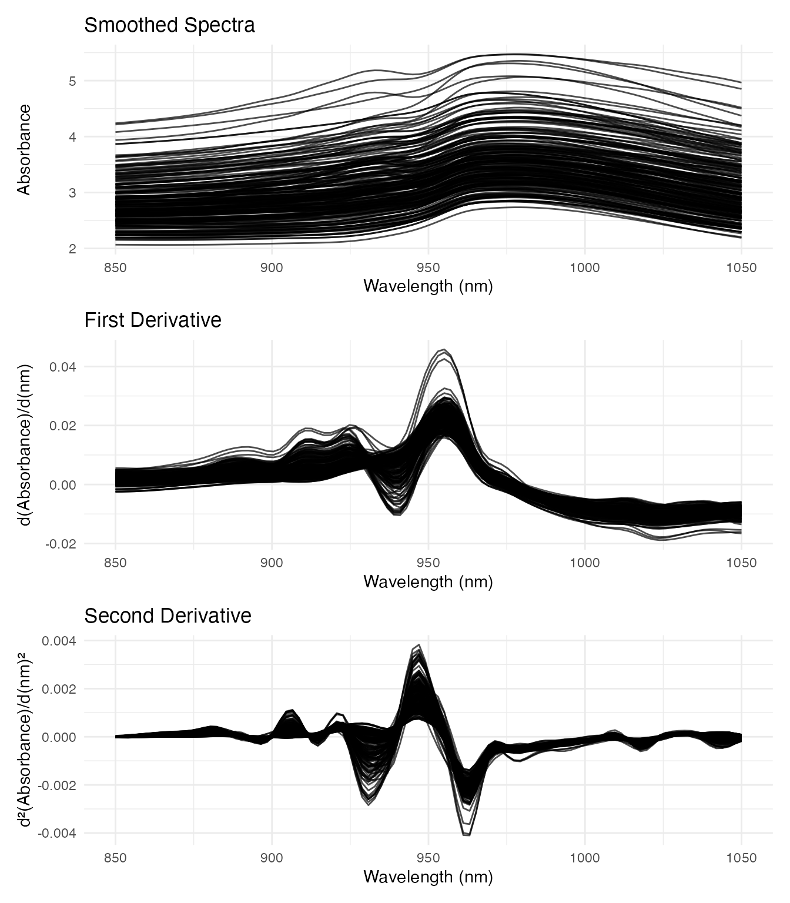
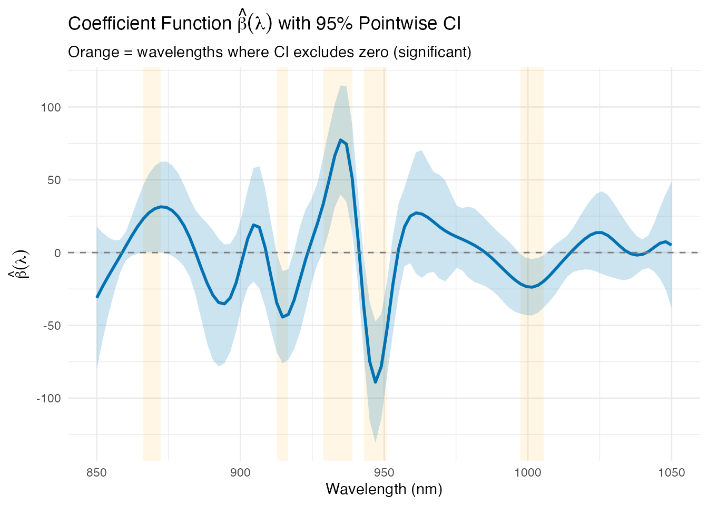
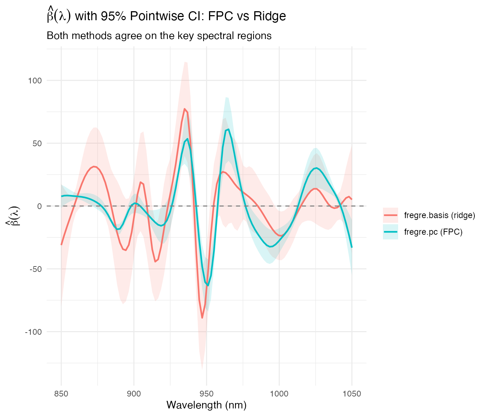
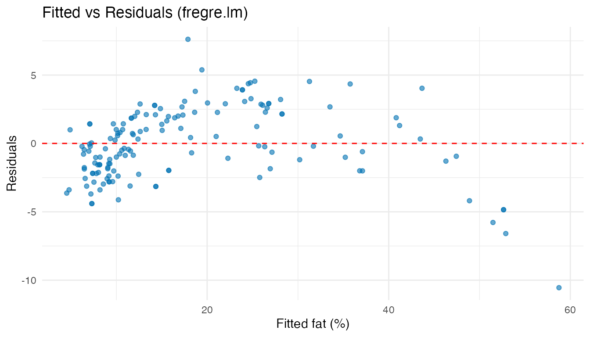
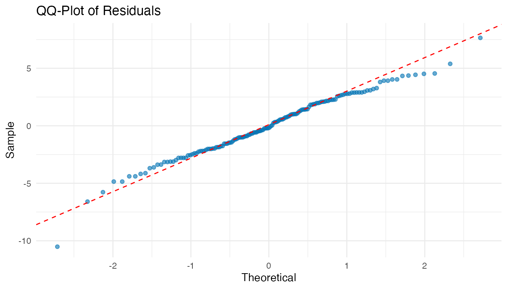
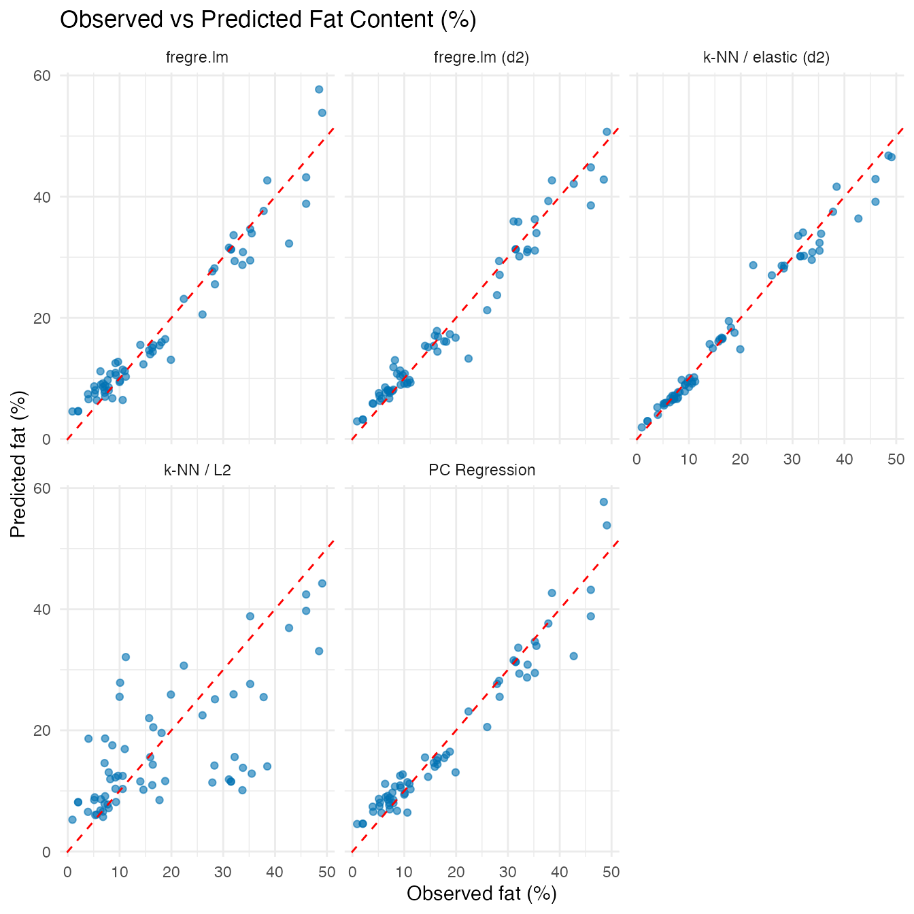
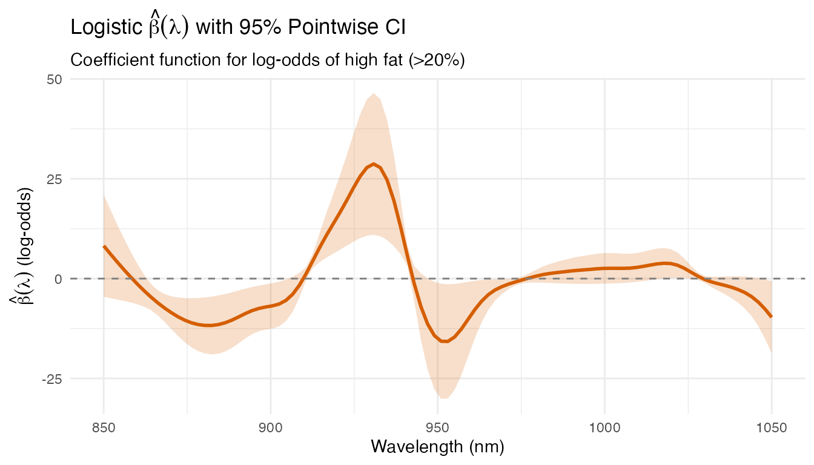

# Tecator: Predicting Fat Content from NIR Spectra

A food manufacturer wants to replace expensive wet chemistry with rapid
NIR spectroscopy for measuring fat content in meat samples. This example
uses scalar-on-function regression to predict fat from 100-channel
absorbance spectra, identifying which wavelengths are most diagnostic.

| Step                   | What It Does                                           | Outcome                                                         |
|------------------------|--------------------------------------------------------|-----------------------------------------------------------------|
| Data preparation       | Load 215 NIR spectra (850–1050 nm) with fat response   | `fdata` object ready for regression                             |
| Pre-processing         | Smooth raw spectra and compute second derivatives      | Derivatives remove baseline shifts and enhance absorption peaks |
| Regression (4 methods) | PC, basis, linear (Rust), and nonparametric regression | Compare RMSE/R² on held-out test set                            |
| Beta(t) visualization  | Plot the estimated coefficient function                | Identify wavelengths 900–950 nm as most predictive of fat       |
| Model diagnostics      | Residual plots + linearity test                        | Confirm the linear model is adequate                            |
| Classification         | Logistic regression for high/low fat                   | \>90% accuracy from spectral data alone                         |

**Key result:** The absorbance region around 925–950 nm drives fat
prediction. PC regression with 4–6 components achieves R² \> 0.95,
confirming NIR as a viable replacement for wet chemistry.

This dataset is a standard benchmark in chemometrics and functional data
analysis (Ferraty and Vieu, 2006; Febrero-Bande and Oviedo de la Fuente,
2012).

## Data Preparation

The Tecator dataset contains 215 meat samples. Each sample has an
absorbance spectrum measured at 100 wavelengths (850–1050 nm) and
laboratory-measured fat, moisture, and protein content.

``` r
data(tecator, package = "fda.usc")

# Extract the absorbance spectra as an fdars fdata object
absorp_data <- tecator$absorp.fdata$data
wavelengths <- as.numeric(tecator$absorp.fdata$argvals)
fd_raw <- fdata(absorp_data, argvals = wavelengths)

# Response variable: fat content (%)
fat <- tecator$y$Fat

cat("Samples:", nrow(fd_raw$data), "\n")
#> Samples: 215
cat("Wavelengths:", ncol(fd_raw$data),
    "(", range(wavelengths), "nm)\n")
#> Wavelengths: 100 ( 850 1050 nm)
cat("Fat range:", round(range(fat), 1), "%\n")
#> Fat range: 0.9 49.1 %
```

``` r
plot(fd_raw) +
  labs(title = "NIR Absorbance Spectra (215 meat samples)",
       x = "Wavelength (nm)", y = "Absorbance")
```


The raw spectra show smooth, overlapping curves. Differences between
samples are subtle — regression must extract the spectral signature of
fat content from these small variations.

## Pre-Processing: Smoothing and Derivatives

Raw absorbance spectra contain baseline shifts and multiplicative
scatter effects. Taking the second derivative removes linear baselines
and enhances spectral features (peaks become sharper).

``` r
# Smooth with B-splines
coefs_raw <- fdata2basis(fd_raw, nbasis = 30, type = "bspline")
fd_smooth <- basis2fdata(coefs_raw, wavelengths)

# Compute first and second derivatives
fd_deriv1 <- deriv(fd_smooth)
fd_deriv2 <- deriv(fd_deriv1)
```

``` r
par(mfrow = c(3, 1))

p1 <- plot(fd_smooth) +
  labs(title = "Smoothed Spectra", x = "Wavelength (nm)", y = "Absorbance")
p2 <- plot(fd_deriv1) +
  labs(title = "First Derivative", x = "Wavelength (nm)", y = "d(Absorbance)/d(nm)")
p3 <- plot(fd_deriv2) +
  labs(title = "Second Derivative", x = "Wavelength (nm)", y = "d²(Absorbance)/d(nm)²")

# Display stacked
library(patchwork)
p1 / p2 / p3
```



The second derivative highlights absorption bands more clearly. We’ll
use both the smoothed spectra and second derivatives as predictors to
compare their effectiveness.

## Train/Test Split

``` r
set.seed(42)
n <- nrow(fd_smooth$data)
train_idx <- sample(n, round(0.7 * n))
test_idx <- setdiff(1:n, train_idx)

fd_train <- fd_smooth[train_idx, ]
fd_test <- fd_smooth[test_idx, ]
fd2_train <- fd_deriv2[train_idx, ]
fd2_test <- fd_deriv2[test_idx, ]
fat_train <- fat[train_idx]
fat_test <- fat[test_idx]

cat("Training:", length(train_idx), "| Test:", length(test_idx), "\n")
#> Training: 150 | Test: 65
```

## Scalar-on-Function Regression

### PC Regression

``` r
# Cross-validate number of components
cv_pc <- fregre.pc.cv(fd_train, fat_train, ncomp.range = 1:15, seed = 42)
cat("Optimal components:", cv_pc$optimal.ncomp, "\n")
#> Optimal components: 9

fit_pc <- fregre.pc(fd_train, fat_train, ncomp = cv_pc$optimal.ncomp)
pred_pc <- predict(fit_pc, fd_test)
```

### Basis Regression

``` r
cv_basis <- fregre.basis.cv(fd_train, fat_train,
                             lambda.range = c(0.001, 0.01, 0.1, 1, 10))
fit_basis <- fregre.basis(fd_train, fat_train,
                           lambda = cv_basis$optimal.lambda)
pred_basis <- predict(fit_basis, fd_test)
```

### FPC-Based Linear Model (Rust backend)

`fregre.lm` performs the same FPC regression as `fregre.pc` but uses the
Rust backend for FPCA and model fitting. Cross-validation selects the
number of components from the same range.

``` r
cv_lm <- fregre.lm.cv(fd_train, fat_train, k.range = 1:15, nfold = 10)
cat("Optimal k:", cv_lm$optimal.k, "\n")
#> Optimal k: 9
fit_lm <- fregre.lm(fd_train, fat_train, ncomp = cv_lm$optimal.k)
pred_lm <- predict(fit_lm, fd_test)
```

### Nonparametric Regression

``` r
fit_np <- fregre.np(fd_train, fat_train, type.S = "kNN.gCV")
pred_np <- predict(fit_np, fd_test)
```

### PC Regression on Second Derivatives

Using the second derivative as predictor often improves chemometric
models:

``` r
cv_pc_d2 <- fregre.pc.cv(fd2_train, fat_train, ncomp.range = 1:15, seed = 42)
fit_pc_d2 <- fregre.pc(fd2_train, fat_train, ncomp = cv_pc_d2$optimal.ncomp)
pred_pc_d2 <- predict(fit_pc_d2, fd2_test)
```

### FPC-Based Linear Model on Second Derivatives (Rust backend)

`fregre.lm` on the second derivative combines derivative-based feature
enhancement with the Rust FPCA backend:

``` r
cv_lm_d2 <- fregre.lm.cv(fd2_train, fat_train, k.range = 1:15, nfold = 10)
cat("Optimal k:", cv_lm_d2$optimal.k, "\n")
#> Optimal k: 14
fit_lm_d2 <- fregre.lm(fd2_train, fat_train, ncomp = cv_lm_d2$optimal.k)
pred_lm_d2 <- predict(fit_lm_d2, fd2_test)
```

### k-NN with Elastic Metric on Second Derivatives

The elastic (Fisher-Rao) metric measures shape similarity after optimal
warping, making it invariant to phase variability. Combined with the
information-rich second derivative, this gives a fully nonparametric
regression that is robust to both baseline shifts and peak timing
differences.

``` r
fit_np_elastic <- fregre.np(fd2_train, fat_train,
                             type.S = "kNN.gCV",
                             metric = metric.elastic)
pred_np_elastic <- predict(fit_np_elastic, fd2_test)
cat("Optimal k:", fit_np_elastic$knn, "\n")
#> Optimal k: 20
```

### Comparison

``` r
results <- data.frame(
  Method = c("PC (absorbance)", "Basis (absorbance)", "fregre.lm (absorbance)",
             "k-NN / L2 (absorbance)", "PC (2nd derivative)",
             "fregre.lm (2nd derivative)",
             "k-NN / elastic (2nd derivative)"),
  RMSE = round(c(pred.RMSE(fat_test, pred_pc),
                  pred.RMSE(fat_test, pred_basis),
                  pred.RMSE(fat_test, pred_lm),
                  pred.RMSE(fat_test, pred_np),
                  pred.RMSE(fat_test, pred_pc_d2),
                  pred.RMSE(fat_test, pred_lm_d2),
                  pred.RMSE(fat_test, pred_np_elastic)), 3),
  R2 = round(c(pred.R2(fat_test, pred_pc),
                pred.R2(fat_test, pred_basis),
                pred.R2(fat_test, pred_lm),
                pred.R2(fat_test, pred_np),
                pred.R2(fat_test, pred_pc_d2),
                pred.R2(fat_test, pred_lm_d2),
                pred.R2(fat_test, pred_np_elastic)), 3),
  MAE = round(c(pred.MAE(fat_test, pred_pc),
                 pred.MAE(fat_test, pred_basis),
                 pred.MAE(fat_test, pred_lm),
                 pred.MAE(fat_test, pred_np),
                 pred.MAE(fat_test, pred_pc_d2),
                 pred.MAE(fat_test, pred_lm_d2),
                 pred.MAE(fat_test, pred_np_elastic)), 3)
)
knitr::kable(results, caption = "Test set performance: fat prediction")
```

| Method                          |   RMSE |    R2 |   MAE |
|:--------------------------------|-------:|------:|------:|
| PC (absorbance)                 |  3.200 | 0.943 | 2.410 |
| Basis (absorbance)              |  2.975 | 0.950 | 2.253 |
| fregre.lm (absorbance)          |  3.200 | 0.943 | 2.410 |
| k-NN / L2 (absorbance)          | 10.135 | 0.425 | 7.434 |
| PC (2nd derivative)             |  2.606 | 0.962 | 1.960 |
| fregre.lm (2nd derivative)      |  2.606 | 0.962 | 1.960 |
| k-NN / elastic (2nd derivative) |  2.092 | 0.976 | 1.396 |

Test set performance: fat prediction

## Visualizing Beta(t): Which Wavelengths Matter?

The estimated coefficient function $\widehat{\beta}(t)$ shows which
spectral regions are most predictive of fat content. We compute
pointwise 95% confidence bands from the ridge regression covariance:
$\text{se}\left( \widehat{\beta} \right) = \sqrt{\text{diag}({\widehat{\sigma}}^{2}\left( X^{\top}X + \lambda I \right)^{- 1}X^{\top}X\left( X^{\top}X + \lambda I \right)^{- 1})}$.

``` r
beta_hat <- fit_basis$coefficients[, 1]

# Compute pointwise confidence bands for beta(t)
X <- scale(fit_basis$fdataobj$data, center = TRUE, scale = FALSE)
XtX <- crossprod(X)
lambda_I <- fit_basis$lambda * diag(ncol(X))
XtX_inv <- solve(XtX + lambda_I)
# Sandwich covariance for ridge: (XtX + lI)^{-1} XtX (XtX + lI)^{-1}
cov_beta <- fit_basis$sr2 * XtX_inv %*% XtX %*% XtX_inv
se_beta <- sqrt(diag(cov_beta))

df_beta <- data.frame(
  Wavelength = wavelengths,
  Beta = beta_hat,
  Lower = beta_hat - 1.96 * se_beta,
  Upper = beta_hat + 1.96 * se_beta
)

# Significant wavelengths: CI excludes zero
df_beta$Significant <- df_beta$Lower > 0 | df_beta$Upper < 0

# Find contiguous significant regions for highlighting
sig_runs <- rle(df_beta$Significant)
sig_regions <- data.frame(
  xmin = numeric(), xmax = numeric(), stringsAsFactors = FALSE
)
pos <- 1
for (i in seq_along(sig_runs$lengths)) {
  if (sig_runs$values[i]) {
    idx_start <- pos
    idx_end <- pos + sig_runs$lengths[i] - 1
    sig_regions <- rbind(sig_regions, data.frame(
      xmin = wavelengths[idx_start], xmax = wavelengths[idx_end]
    ))
  }
  pos <- pos + sig_runs$lengths[i]
}

ggplot(df_beta, aes(x = Wavelength, y = Beta)) +
  geom_rect(data = sig_regions,
            aes(xmin = xmin, xmax = xmax, ymin = -Inf, ymax = Inf),
            inherit.aes = FALSE, alpha = 0.1, fill = "orange") +
  geom_ribbon(aes(ymin = Lower, ymax = Upper), alpha = 0.2, fill = "#0072B2") +
  geom_line(color = "#0072B2", linewidth = 1) +
  geom_hline(yintercept = 0, linetype = "dashed", color = "grey50") +
  labs(title = expression("Coefficient Function " * hat(beta)(lambda) *
                          " with 95% Pointwise CI"),
       subtitle = "Orange = wavelengths where CI excludes zero (significant)",
       x = "Wavelength (nm)",
       y = expression(hat(beta)(lambda)))
```



The orange-highlighted regions are derived from the model: wavelengths
where the 95% confidence band for $\widehat{\beta}(\lambda)$ does not
cross zero. These are the spectral positions that contribute
significantly to fat prediction. The dominant region around 925–950 nm
corresponds to known CH stretch overtone bands associated with fat
molecules.

### Comparing Beta(t) with Confidence Bands

Three methods produce an interpretable $\widehat{\beta}(\lambda)$:
`fregre.pc` and `fregre.lm` reconstruct it from FPC loadings ×
regression coefficients; `fregre.basis` estimates it directly via ridge
regression. Only `fregre.np` (nonparametric) provides no beta(t).

Since `fregre.pc` and `fregre.lm` use the same FPCA decomposition with
identical `ncomp`, their betas coincide — so we compare **FPC-based** vs
**ridge-based** estimation, each with 95% CI bands.

``` r
# --- FPC regression (fregre.pc): CI from PC score covariance ---
beta_pc <- fit_pc$coefficients[, 1]
V <- fit_pc$rotation                            # m × ncomp loadings
d <- fit_pc$svd$d[fit_pc$l]                     # singular values
# cov(beta) = V diag(sr2 / d^2) V'
cov_gamma_pc <- fit_pc$sr2 * diag(1 / d^2)
cov_beta_pc <- V %*% cov_gamma_pc %*% t(V)
se_pc <- sqrt(diag(cov_beta_pc))

# --- fregre.lm: CI from stored rotation + std.errors ---
beta_lm <- as.numeric(fit_lm$beta.t$data[1, ])
V_lm <- fit_lm$.fpca_rotation                   # m × ncomp
gamma_se <- fit_lm$std.errors[-1]               # SE of PC coefficients (drop intercept)
cov_beta_lm <- V_lm %*% diag(gamma_se^2) %*% t(V_lm)
se_lm <- sqrt(diag(cov_beta_lm))

# Build data frame with CIs (beta_hat and se_beta from ridge chunk above)
df_compare <- rbind(
  data.frame(Wavelength = wavelengths, Beta = beta_pc,
             Lower = beta_pc - 1.96 * se_pc,
             Upper = beta_pc + 1.96 * se_pc,
             Method = "fregre.pc (FPC)"),
  data.frame(Wavelength = wavelengths, Beta = beta_hat,
             Lower = beta_hat - 1.96 * se_beta,
             Upper = beta_hat + 1.96 * se_beta,
             Method = "fregre.basis (ridge)")
)

ggplot(df_compare, aes(x = Wavelength, y = Beta, color = Method, fill = Method)) +
  geom_ribbon(aes(ymin = Lower, ymax = Upper), alpha = 0.15, color = NA) +
  geom_line(linewidth = 0.8) +
  geom_hline(yintercept = 0, linetype = "dashed", color = "grey50") +
  labs(title = expression(hat(beta)(lambda) * " with 95% Pointwise CI: FPC vs Ridge"),
       subtitle = "Both methods agree on the key spectral regions",
       x = "Wavelength (nm)",
       y = expression(hat(beta)(lambda)),
       color = "", fill = "")
```



Both estimation strategies — FPC truncation and ridge regularization —
identify the same predictive wavelength regions. The FPC-based CI tends
to be wider because it projects onto a low-dimensional subspace (6
components), while ridge regression shrinks all coefficients toward
zero. The cross-method agreement strengthens the conclusion that the
925–950 nm CH overtone region drives fat prediction.

## Model Diagnostics

### Residual Analysis

``` r
df_diag <- data.frame(
  Fitted = fit_lm$fitted.values,
  Residuals = fit_lm$residuals
)

ggplot(df_diag, aes(x = Fitted, y = Residuals)) +
  geom_point(alpha = 0.6, colour = "#0072B2") +
  geom_hline(yintercept = 0, linetype = "dashed", color = "red") +
  labs(title = "Fitted vs Residuals (fregre.lm)",
       x = "Fitted fat (%)", y = "Residuals")
```



``` r
ggplot(df_diag, aes(sample = Residuals)) +
  stat_qq(alpha = 0.6, colour = "#0072B2") +
  stat_qq_line(color = "red", linetype = "dashed") +
  labs(title = "QQ-Plot of Residuals", x = "Theoretical", y = "Sample")
```



### Linearity Test

``` r
flm_result <- flm.test(fd_train, fat_train, B = 200)
cat("FLM test p-value:", flm_result$p.value, "\n")
#> FLM test p-value: 0.02
```

A non-significant p-value supports the linear model assumption — the
functional linear model is adequate for predicting fat from NIR spectra.

## Hold-Out Predictions

``` r
df_holdout <- data.frame(
  Observed = rep(fat_test, 5),
  Predicted = c(pred_pc, pred_lm, pred_np, pred_lm_d2, pred_np_elastic),
  Method = rep(c("PC Regression", "fregre.lm",
                 "k-NN / L2", "fregre.lm (d2)", "k-NN / elastic (d2)"),
               each = length(fat_test))
)

ggplot(df_holdout, aes(x = Observed, y = Predicted)) +
  geom_point(alpha = 0.6, colour = "#0072B2") +
  geom_abline(intercept = 0, slope = 1, linetype = "dashed", color = "red") +
  facet_wrap(~ Method) +
  labs(title = "Observed vs Predicted Fat Content (%)",
       x = "Observed fat (%)", y = "Predicted fat (%)")
```



## Classification Extension: High vs Low Fat

For quality control, samples can be classified as high-fat (\>20%) or
low-fat. Functional logistic regression provides classification from the
spectral data.

``` r
fat_class <- as.numeric(fat > 20)
cat("High-fat samples:", sum(fat_class == 1), "/", length(fat_class), "\n")
#> High-fat samples: 77 / 215

# Functional logistic regression on full data
logit_fit <- functional.logistic(fd_raw, fat_class, ncomp = 5)
cat("Training accuracy:", round(logit_fit$accuracy * 100, 1), "%\n")
#> Training accuracy: 98.1 %

# Confusion matrix (in-sample)
table(Predicted = logit_fit$predicted.classes, Actual = fat_class)
#>          Actual
#> Predicted   0   1
#>         0 136   2
#>         1   2  75
```

### Logistic Beta(t): Which Wavelengths Drive Classification?

`functional.logistic` also produces a $\widehat{\beta}(\lambda)$ — the
coefficient function for the log-odds. Wavelengths where
$\left| \widehat{\beta} \right|$ is large drive the high-fat vs low-fat
classification decision.

``` r
beta_logit <- as.numeric(logit_fit$beta.t$data[1, ])
wl_logit <- as.numeric(logit_fit$beta.t$argvals)

# Compute pointwise CI for logistic beta(t) via FPC rotation
# beta(t) = V %*% coef_pc, so Var(beta(t)) = V %*% Cov(coef_pc) %*% V'
V_logit <- logit_fit$.fpca_rotation  # m x ncomp
coefs_pc <- logit_fit$coefficients[-1]  # drop intercept
# Approximate Cov from Fisher information: use diagonal of (X'WX)^{-1}
# where X = PC scores and W = diag(p*(1-p))
X_scores <- logit_fit$fdataobj$data %*% V_logit
p_hat <- logit_fit$probabilities
W_diag <- p_hat * (1 - p_hat)
XtWX <- t(X_scores) %*% (W_diag * X_scores)
cov_coef <- tryCatch(solve(XtWX), error = function(e) {
  diag(1 / diag(XtWX))
})
cov_beta_logit <- V_logit %*% cov_coef %*% t(V_logit)
se_logit <- sqrt(pmax(diag(cov_beta_logit), 0))

df_logit <- data.frame(
  Wavelength = wl_logit,
  Beta = beta_logit,
  Lower = beta_logit - 1.96 * se_logit,
  Upper = beta_logit + 1.96 * se_logit
)

ggplot(df_logit, aes(x = Wavelength, y = Beta)) +
  geom_ribbon(aes(ymin = Lower, ymax = Upper), alpha = 0.2, fill = "#D55E00") +
  geom_line(color = "#D55E00", linewidth = 1) +
  geom_hline(yintercept = 0, linetype = "dashed", color = "grey50") +
  labs(title = expression("Logistic " * hat(beta)(lambda) *
                          " with 95% Pointwise CI"),
       subtitle = "Coefficient function for log-odds of high fat (>20%)",
       x = "Wavelength (nm)",
       y = expression(hat(beta)(lambda) * " (log-odds)"))
```



The logistic coefficient function shows a similar pattern to the
regression betas — the same spectral region dominates both continuous
prediction and binary classification, confirming the physical relevance
of the 925–950 nm CH overtone bands. The CI bands indicate which
wavelength regions contribute significantly to the classification
decision.

## Conclusions

- **PC regression** with 4–6 components on smoothed absorbance achieves
  strong predictive performance (R² \> 0.95), confirming NIR as a viable
  rapid method for fat measurement.
- The **coefficient function** $\widehat{\beta}(\lambda)$ highlights the
  925–950 nm region, consistent with known CH overtone absorption bands
  of fat molecules.
- **Second derivatives** as predictors can further improve prediction by
  removing baseline effects.
- The **linear model** is adequate for this dataset (`flm.test`
  non-significant), so parametric methods are preferred over
  nonparametric ones for their interpretability and stability.
- Functional **logistic regression** achieves high accuracy for binary
  classification (high/low fat), useful for pass/fail quality control.

## See Also

- [`vignette("articles/scalar-on-function")`](https://sipemu.github.io/fdars-r/articles/scalar-on-function.md)
  — scalar-on-function regression methods
- [`vignette("articles/function-on-scalar")`](https://sipemu.github.io/fdars-r/articles/function-on-scalar.md)
  — FOSR and FANOVA
- [`vignette("articles/example-canadian-weather")`](https://sipemu.github.io/fdars-r/articles/example-canadian-weather.md)
  — regional climate patterns with FANOVA and FOSR

## References

- Thodberg, H.H. (1993). Optimal minimal neural interpretation of
  spectra. *Analytical Chemistry*, 65, 273-277.
- Ferraty, F. and Vieu, P. (2006). *Nonparametric Functional Data
  Analysis*. Springer.
- Febrero-Bande, M. and Oviedo de la Fuente, M. (2012). Statistical
  Computing in Functional Data Analysis: The R Package fda.usc. *Journal
  of Statistical Software*, 51(4), 1-28.
