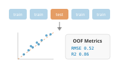

# Examples

Berkeley Growth Study

Alignment FPCA Equivalence

Tecator: NIR Spectra → Fat Prediction

Regression Beta(t) Diagnostics

Cross-Validation: OOF Model Comparison

CV Regression Nested CV

Canadian Weather: Regional Climate Patterns

FANOVA FOSR Classification

Canadian Temperature: Annual Cycle Detection

Seasonal Decompose Peaks

Andrews Wine: Why Andrews Curves?

Andrews Fourier Distance

Andrews Wine: Outlier Detection

Outliers Depth MS-plot

Andrews Wine: Clustering & Variable Importance

Clustering FPCA Testing

Andrews Wine: Quality Control

Boxplot Monitoring Bands

Sonar: Mine vs Rock via Elastic TSRVF

TSRVF Alignment Classification

Phoneme: Shape-Based Sound Classification

Shape Clustering Classification

Canadian Precipitation: Geographic FOSR

FOSR Regression Climate

Tecator: Inline Quality Monitoring

SPM CUSUM Quality

Explainability: Recovering Predictive Regions

Pointwise Domain Regions

Inline Monitoring: Detection Power & False Alarms

SPM Power FPR

Biopharma: Penicillin Batch Monitoring

SPM FPCA Regression
