# Model Explainability

## Overview

Understanding how functional regression models make predictions is
crucial for building trust and ensuring reliable deployments. The fdars
explainability toolkit provides **22 methods** organized into four
categories.


### Supported Models

Two model types are supported. Most methods work with **both**; a few
are specific to one:

| Model        | Class             | Response                        | Fitted by                                                                                    |
|:-------------|:------------------|:--------------------------------|:---------------------------------------------------------------------------------------------|
| **Linear**   | `fregre.lm`       | Continuous $y \in {\mathbb{R}}$ | [`fregre.lm()`](https://sipemu.github.io/fdars-r/reference/fregre.lm.md)                     |
| **Logistic** | `fregre.logistic` | Binary $y \in \{ 0,1\}$         | [`functional.logistic()`](https://sipemu.github.io/fdars-r/reference/functional.logistic.md) |

Both models project curves onto FPC scores and regress on them. The same
R functions (e.g. `fregre.pdp`) automatically dispatch to the correct
Rust backend based on the model class.

### Method Reference

| Method                         | Function                           |      Models       | Category        |
|:-------------------------------|:-----------------------------------|:-----------------:|:----------------|
| Partial Dependence (PDP)       | `fregre.pdp`                       |   lm, logistic    | Global (Score)  |
| Accumulated Local Effects      | `fregre.ale`                       |   lm, logistic    | Global (Score)  |
| Sobol Sensitivity              | `fregre.sobol`                     |   lm, logistic    | Global (Score)  |
| Friedman H-statistic           | `fregre.friedman`                  |   lm, logistic    | Global (Score)  |
| Beta Decomposition             | `fregre.beta.decomp`               |   lm, logistic    | Global (Score)  |
| Pointwise Importance           | `fregre.pointwise`                 |   lm, logistic    | Global (Domain) |
| Saliency Maps                  | `fregre.saliency`                  |   lm, logistic    | Global (Domain) |
| Domain Importance              | `fregre.domain`                    |   lm, logistic    | Global (Domain) |
| Significant Regions            | `fregre.significant.regions`       |   lm, logistic    | Global (Domain) |
| SHAP Values                    | `fregre.shap`                      |   lm, logistic    | Local           |
| LIME                           | `fregre.lime`                      |   lm, logistic    | Local           |
| Counterfactual                 | `fregre.counterfactual`            |   lm, logistic    | Local           |
| Anchor                         | `fregre.anchor`                    |   lm, logistic    | Local           |
| Prototypes                     | `fregre.prototype`                 |   lm, logistic    | Local           |
| Permutation Importance         | `fregre.importance`                |   lm, logistic    | Diagnostics     |
| VIF                            | `fregre.vif`                       |   lm, logistic    | Diagnostics     |
| Regression Depth               | `fregre.depth`                     |   lm, logistic    | Diagnostics     |
| Conditional Importance         | `fregre.conditional.importance`    |   lm, logistic    | Diagnostics     |
| Influence (Leverage, Cook’s D) | `fregre.influence`                 |    **lm only**    | Diagnostics     |
| DFBETAS / DFFITS               | `fregre.dfbetas`                   |    **lm only**    | Diagnostics     |
| Calibration / ECE              | `fregre.calibration`, `fregre.ece` | **logistic only** | Diagnostics     |
| Explanation Stability          | `fregre.stability`                 |   *model-free*    | Diagnostics     |

## Setup

### Simulated Data

We create a dataset where the response depends on specific regions of
the functional domain. In applied terms, imagine spectroscopy curves
where only certain wavelengths predict a chemical concentration — the
goal of explainability is to recover which wavelengths matter.

``` r
n <- 80
m <- 100
t_grid <- seq(0, 1, length.out = m)

# True coefficient function: peaked around t=0.3 and t=0.7
beta_true <- 2 * dnorm(t_grid, 0.3, 0.08) - 1.5 * dnorm(t_grid, 0.7, 0.08)
beta_true <- beta_true / max(abs(beta_true))

# Generate functional predictors
X <- matrix(0, n, m)
for (i in 1:n) {
  X[i, ] <- sin(2 * pi * t_grid) + 0.5 * rnorm(1) * cos(4 * pi * t_grid) +
            rnorm(m, sd = 0.1)
}

# Generate response: y_i = integral of beta(t) * X_i(t) dt + noise
dt <- t_grid[2] - t_grid[1]
y <- numeric(n)
for (i in 1:n) {
  y[i] <- sum(beta_true * X[i, ]) * dt + rnorm(1, sd = 0.3)
}

fdataobj <- fdata(X, argvals = t_grid)
```

``` r
df_beta <- data.frame(t = t_grid, beta = beta_true)

ggplot(df_beta, aes(x = t, y = beta)) +
  geom_line(color = "#2E8B57", linewidth = 1.5) +
  geom_hline(yintercept = 0, linetype = "dashed", alpha = 0.3) +
  geom_ribbon(aes(ymin = 0, ymax = beta), fill = "#2E8B57", alpha = 0.15) +
  annotate("text", x = 0.3, y = max(beta_true) * 1.1, label = "Important\nregion",
           color = "#2E8B57", size = 3) +
  annotate("text", x = 0.7, y = min(beta_true) * 1.1, label = "Important\nregion",
           color = "#D55E00", size = 3) +
  labs(title = expression("True Coefficient Function " * beta(t)),
       subtitle = "Positive peak at t=0.3, negative peak at t=0.7",
       x = "t", y = expression(beta(t)))
```

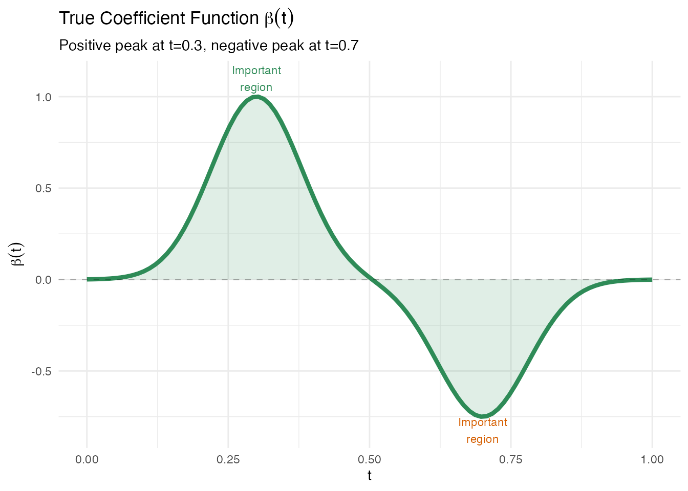

### Fitting a Linear Model

The functional linear model represents the scalar response as

$$y_{i} = \alpha + \int_{0}^{1}\beta(t)\, X_{i}(t)\, dt + \varepsilon_{i}.$$

In practice,
[`fregre.lm()`](https://sipemu.github.io/fdars-r/reference/fregre.lm.md)
projects each curve onto $K$ functional principal components (FPCs) and
fits OLS on the resulting scores:

$$y_{i} \approx \alpha + \sum\limits_{k = 1}^{K}b_{k}\xi_{ik},\qquad\xi_{ik} = \int X_{i}(t)\,\phi_{k}(t)\, dt.$$

This is the model that all explainability methods operate on.

``` r
model <- fregre.lm(fdataobj, y, ncomp = 5)
cat("R\u00b2:", round(model$r.squared, 4), "\n")
#> R²: 0.047
cat("RMSE:", round(sqrt(mean(model$residuals^2)), 4), "\n")
#> RMSE: 0.295
```

``` r
df_fit <- data.frame(Observed = y, Fitted = model$fitted.values)

ggplot(df_fit, aes(x = Observed, y = Fitted)) +
  geom_point(color = "#4A90D9", size = 2, alpha = 0.7) +
  geom_abline(slope = 1, intercept = 0, linetype = "dashed", color = "gray50") +
  labs(title = "Observed vs Fitted Values",
       subtitle = paste("R\u00b2 =", round(model$r.squared, 3)),
       x = "Observed y", y = "Fitted y")
```

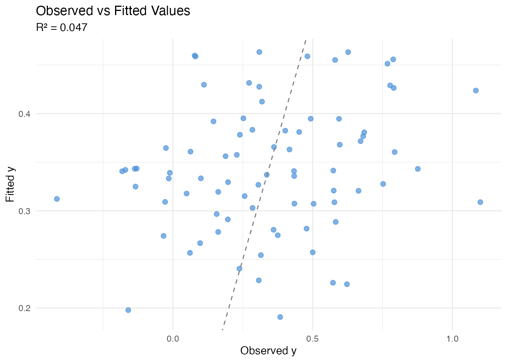

------------------------------------------------------------------------

## Global Explanations: Score-Level

These methods answer: **which FPC scores drive predictions?** They
operate on the multivariate regression
$y_{i} = \alpha + \sum_{k}b_{k}\xi_{ik}$ and reveal how changing each
score affects the predicted response.

*All methods in this section support both `fregre.lm` and
`functional.logistic`.*


### Partial Dependence Plots (PDP)

**In plain English:** A PDP shows how the model’s prediction changes as
one FPC score varies, averaging over all other scores. Think of it as:
“if we could separately control just PC1, what would happen to the
prediction?”

**Mathematically:** The partial dependence function for the $k$-th score
is

$${\widehat{f}}_{k}\left( \xi_{k} \right) = \frac{1}{n}\sum\limits_{i = 1}^{n}\widehat{f}\left( \xi_{i1},\ldots,\xi_{i,k - 1},\,\xi_{k},\,\xi_{i,k + 1},\ldots,\xi_{iK} \right).$$

For each value of $\xi_{k}$, we plug it into every observation’s score
vector (keeping all other scores at their actual values) and average the
predictions. A flat PDP means the score has no effect; a steep slope
means it matters.

**Limitation:** When FPC scores are correlated, PDP evaluates the model
at unrealistic score combinations (e.g. high PC1 with low PC2 even if
they always co-occur). See ALE below for a correction.

``` r
pdp1 <- fregre.pdp(model, data = fdataobj, component = 1, n.grid = 30)
pdp2 <- fregre.pdp(model, data = fdataobj, component = 2, n.grid = 30)

df_pdp <- rbind(
  data.frame(x = pdp1$grid_values, y = pdp1$pdp_curve, Component = "PC1"),
  data.frame(x = pdp2$grid_values, y = pdp2$pdp_curve, Component = "PC2")
)

ggplot(df_pdp, aes(x = x, y = y)) +
  geom_line(color = "#4A90D9", linewidth = 1) +
  facet_wrap(~ Component, scales = "free_x") +
  labs(title = "Partial Dependence Plots",
       subtitle = "Marginal effect of each PC on prediction",
       x = "PC Score", y = "Partial Dependence")
```

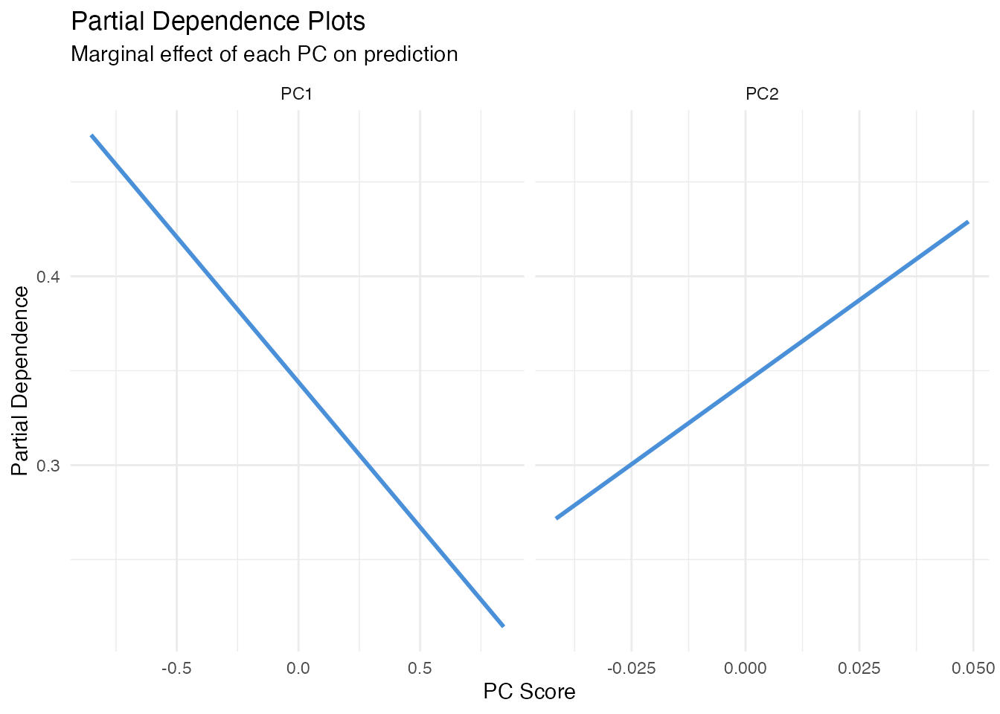

### Accumulated Local Effects (ALE)

**In plain English:** ALE fixes PDP’s correlation problem. Instead of
substituting scores globally, it looks at how predictions change
**locally** within narrow bins of the score distribution. This avoids
extrapolating into unrealistic score combinations.

**Mathematically:** The ALE for score $k$ accumulates local differences:

$${\widehat{\text{ALE}}}_{k}\left( \xi_{k} \right) = \sum\limits_{j = 1}^{J{(\xi_{k})}}\frac{1}{\left| N_{j} \right|}\sum\limits_{i \in N_{j}}\left\lbrack \widehat{f}\left( \xi_{ij,k}^{(U)} \right) - \widehat{f}\left( \xi_{ij,k}^{(L)} \right) \right\rbrack,$$

where $N_{j}$ is the set of observations in bin $j$, and $\xi^{(U)}$,
$\xi^{(L)}$ are the bin’s upper and lower bounds. The result is centred
so $E\left\lbrack {\widehat{\text{ALE}}}_{k} \right\rbrack = 0$.

**When to prefer ALE over PDP:** Always, unless FPC scores are (nearly)
uncorrelated — which they are by construction in FPCA. So for
`fregre.lm`, PDP and ALE will typically agree closely. They may diverge
for logistic models or when scalar covariates are correlated with FPC
scores.

``` r
ale1 <- fregre.ale(model, data = fdataobj, component = 1, n.bins = 15)

df_ale <- data.frame(x = ale1$bin_midpoints, y = ale1$ale_values)

ggplot(df_ale, aes(x = x, y = y)) +
  geom_step(color = "#4A90D9", linewidth = 1) +
  geom_hline(yintercept = 0, linetype = "dashed", alpha = 0.3) +
  labs(title = "ALE Plot for PC1",
       subtitle = "Accumulated Local Effects (robust to score correlations)",
       x = "PC1 Score", y = "ALE")
```

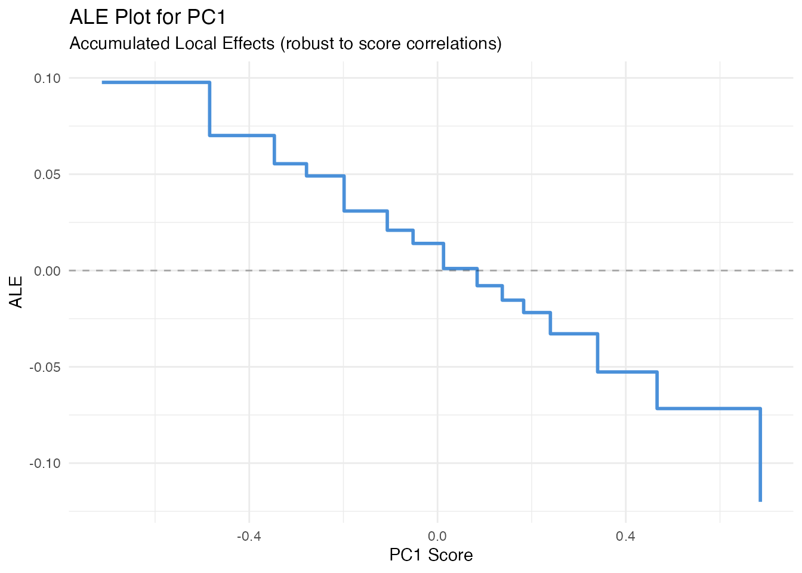

### Sobol Sensitivity Indices

**In plain English:** Sobol indices answer “what fraction of the
variation in predictions is due to each FPC score?” First-order indices
measure the direct effect of each score alone; total-order indices add
all interactions involving that score. If first-order and total-order
are nearly equal, the score acts independently.

**Mathematically:** The first-order index for score $k$ is

$$S_{k} = \frac{\text{Var}_{\xi_{k}}\!\left\lbrack E_{{\mathbf{ξ}}_{- k}}\left\lbrack \widehat{y} \mid \xi_{k} \right\rbrack \right\rbrack}{\text{Var}\left\lbrack \widehat{y} \right\rbrack},$$

and the total-order index is

$$S_{k}^{T} = 1 - \frac{\text{Var}_{{\mathbf{ξ}}_{- k}}\!\left\lbrack E_{\xi_{k}}\left\lbrack \widehat{y} \mid {\mathbf{ξ}}_{- k} \right\rbrack \right\rbrack}{\text{Var}\left\lbrack \widehat{y} \right\rbrack}.$$

Both are estimated via Monte Carlo sampling. First-order indices sum to
1 when there are no interactions; total-order indices can sum to more
than 1.

``` r
sob <- fregre.sobol(model, data = fdataobj, y = y)

df_sobol <- data.frame(
  Component = paste0("PC", seq_along(sob$first_order)),
  First = sob$first_order,
  Total = sob$total_order
)

df_sobol_long <- rbind(
  data.frame(Component = df_sobol$Component, Value = df_sobol$First, Index = "First-order"),
  data.frame(Component = df_sobol$Component, Value = df_sobol$Total, Index = "Total-order")
)

ggplot(df_sobol_long, aes(x = Component, y = Value, fill = Index)) +
  geom_col(position = "dodge", alpha = 0.7) +
  scale_fill_manual(values = c("First-order" = "#4A90D9", "Total-order" = "#D55E00")) +
  labs(title = "Sobol Sensitivity Indices",
       subtitle = "First-order vs total-order variance decomposition",
       x = "Component", y = "Index") +
  theme(legend.position = "bottom")
```

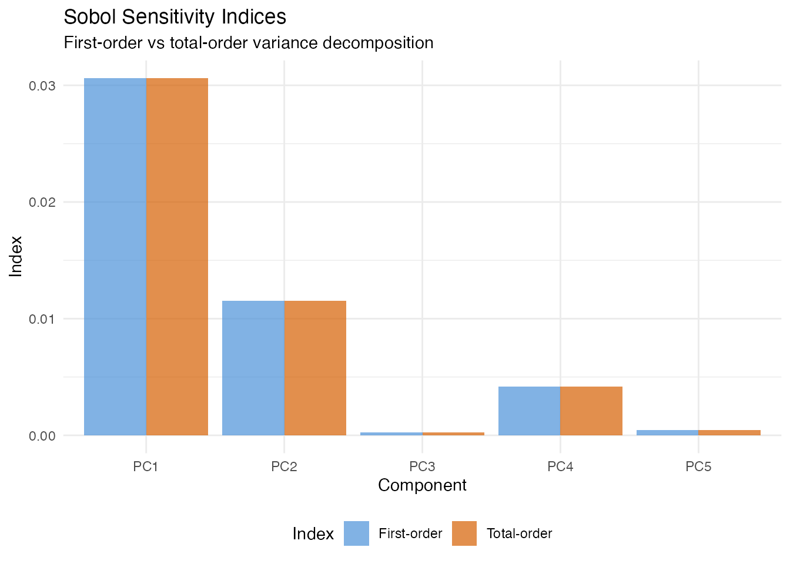

### Friedman H-Statistic

**In plain English:** The H-statistic tells you whether two FPC scores
interact — that is, whether the effect of one score depends on the value
of the other. A value near 0 means the scores affect the prediction
independently; a large value means their combined effect is more (or
less) than the sum of parts.

**Mathematically:** For scores $j$ and $k$, the H-statistic is

$$H_{jk}^{2} = \frac{\sum\limits_{i}\left\lbrack {\widehat{f}}_{jk}\left( \xi_{ij},\xi_{ik} \right) - {\widehat{f}}_{j}\left( \xi_{ij} \right) - {\widehat{f}}_{k}\left( \xi_{ik} \right) \right\rbrack^{2}}{\sum\limits_{i}{\widehat{f}}_{jk}\left( \xi_{ij},\xi_{ik} \right)^{2}},$$

where ${\widehat{f}}_{jk}$ is the two-dimensional PDP and
${\widehat{f}}_{j}$, ${\widehat{f}}_{k}$ are the marginal PDPs. For a
purely linear model (no interactions), $H_{jk}^{2} = 0$ exactly.

``` r
fried <- fregre.friedman(model, data = fdataobj, component.j = 1,
                         component.k = 2, n.grid = 15)
cat("H-statistic (PC1 x PC2):", round(fried$h_squared, 4), "\n")
#> H-statistic (PC1 x PC2): 0
```

### Beta Decomposition

**In plain English:** Since the model predicts using
$y = \alpha + b_{1}\xi_{1} + \ldots + b_{K}\xi_{K}$, we can ask “how
much of the variation in predictions comes from each component?” Beta
decomposition answers this by weighting each coefficient by the variance
of its score.

**Mathematically:** The variance proportion for component $k$ is

$$\text{VP}_{k} = \frac{b_{k}^{2}\,\text{Var}\left( \xi_{k} \right)}{\sum\limits_{j = 1}^{K}b_{j}^{2}\,\text{Var}\left( \xi_{j} \right)}.$$

This is the simplest global importance measure — it uses only the model
coefficients and score variances, with no Monte Carlo sampling.

``` r
decomp <- fregre.beta.decomp(model)

df_decomp <- data.frame(
  Component = paste0("PC", 1:length(decomp$variance_proportion)),
  Weight = decomp$variance_proportion
)
df_decomp$Component <- factor(df_decomp$Component,
                               levels = df_decomp$Component[order(-df_decomp$Weight)])

ggplot(df_decomp, aes(x = Component, y = Weight)) +
  geom_col(fill = "#4A90D9", alpha = 0.7) +
  labs(title = "Beta Decomposition: Variance Proportion",
       subtitle = "Fraction of prediction variance attributable to each PC",
       x = "Component", y = "Variance Proportion")
```

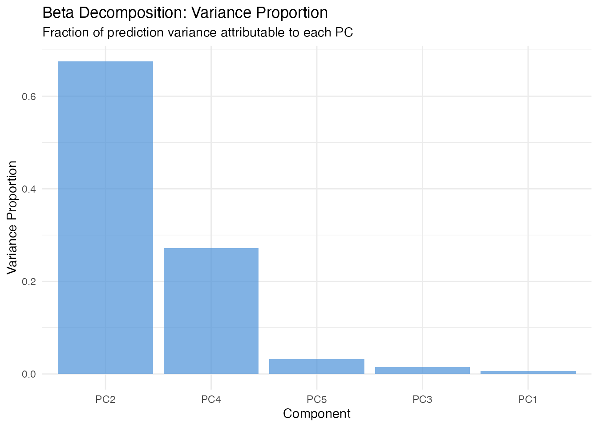

------------------------------------------------------------------------

## Global Explanations: Domain-Level

These methods answer: **where on the functional domain** $t$**does the
model focus?** While score-level methods operate on FPC scores
(multivariate), these methods translate importance back to the original
curve domain — telling you which time points, wavelengths, or spatial
locations matter.

*All methods in this section support both `fregre.lm` and
`functional.logistic`.*


### Pointwise Importance

**In plain English:** For each point $t$ on the domain, this method
combines how much each eigenfunction $\phi_{k}(t)$ contributes at that
point with how important the corresponding score is to the prediction.
The result is a curve showing which parts of the domain the model “pays
attention to”.

**Mathematically:** The pointwise importance at $t$ is

$$I(t) = \sum\limits_{k = 1}^{K}\left| b_{k} \right| \cdot \left| \phi_{k}(t) \right| \cdot \text{Var}\left( \xi_{k} \right)^{1/2}.$$

High values indicate regions where (a) the eigenfunctions are large and
(b) the regression coefficients are large. Compare the result to the
true $\beta(t)$ — the peaks should align.

``` r
pw <- fregre.pointwise(model)

df_pw <- data.frame(t = t_grid, importance = pw$importance)

ggplot(df_pw, aes(x = t, y = importance)) +
  geom_line(color = "#7B2D8E", linewidth = 1) +
  geom_ribbon(aes(ymin = 0, ymax = importance), fill = "#7B2D8E", alpha = 0.15) +
  labs(title = "Pointwise Importance",
       subtitle = "Which domain points drive predictions most?",
       x = "t", y = "Importance")
```

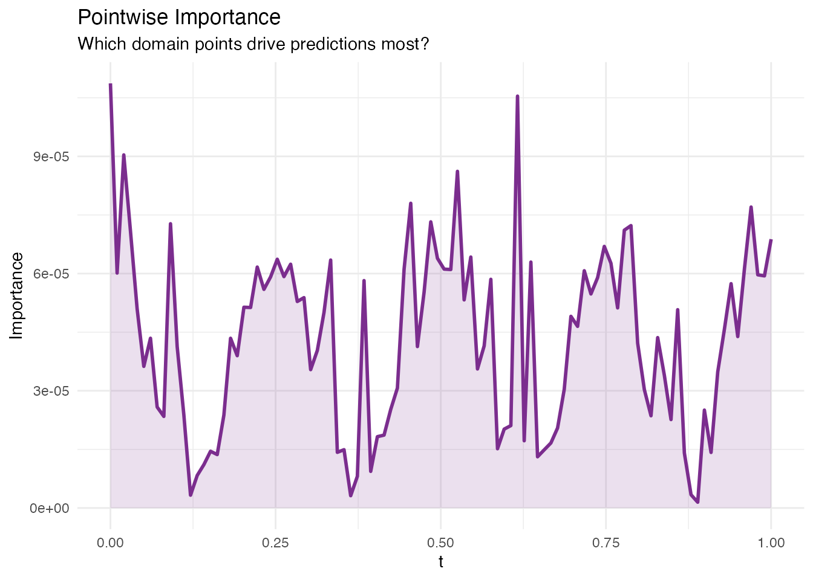

### Saliency Maps

**In plain English:** Saliency maps show how sensitive the prediction is
to small perturbations of the curve at each point $t$. If wiggling the
curve at $t = 0.3$ changes the prediction a lot, that point has high
saliency. This is the functional analogue of gradient-based saliency in
image classification.

**Mathematically:** For each observation $i$, the saliency at $t$ is

$$s_{i}(t) = \frac{\partial{\widehat{y}}_{i}}{\partial X_{i}(t)}.$$

In the linear model this equals $\widehat{\beta}(t)$ for every
observation.
[`fregre.saliency()`](https://sipemu.github.io/fdars-r/reference/fregre.saliency.md)
returns the mean absolute saliency across all observations, which
highlights where the model is most sensitive.

``` r
sal <- fregre.saliency(model, data = fdataobj)

df_sal <- data.frame(t = t_grid, saliency = sal$mean_absolute_saliency)

ggplot(df_sal, aes(x = t, y = saliency)) +
  geom_line(color = "#C0392B", linewidth = 1) +
  geom_ribbon(aes(ymin = 0, ymax = saliency), fill = "#C0392B", alpha = 0.15) +
  labs(title = "Mean Absolute Saliency Map",
       subtitle = "Gradient-based sensitivity across the domain",
       x = "t", y = "|Saliency|")
```

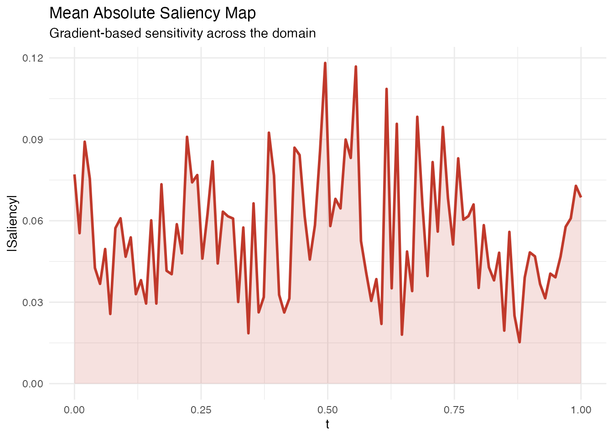

### Domain Importance

**In plain English:** Instead of looking at individual points, domain
importance uses a **sliding window** along $t$ to assess which regions
matter. This is useful when the effect is spread over a neighbourhood
rather than concentrated at a single point.

**Mathematically:** The domain importance at grid point $t_{j}$
aggregates the absolute coefficient function within a window of width
$w$:

$$D\left( t_{j} \right) = \sum\limits_{{|t_{l} - t_{j}|} \leq w/2}\left| \widehat{\beta}\left( t_{l} \right) \right|.$$

Larger `window.width` values produce smoother importance curves.

> **Methodological limitation.** Domain importance uses
> $\widehat{\beta}\left( t_{i} \right)^{2}$ as pointwise importance. In
> FPC-based regression, the estimated $\widehat{\beta}(t)$ is smooth and
> spread out – signal from localized regions gets diffused across the
> FPC reconstruction. The default `threshold = 0.1` (10% of total
> importance in one window) can be too aggressive for diffuse betas.
> Lowering the threshold helps, but the method is fundamentally limited
> for detecting sharp, localized regions when the basis functions are
> nonlocal. See the [Explainability Regions
> example](https://sipemu.github.io/fdars-r/articles/example-explainability-regions.md)
> for a detailed validation.

``` r
dom <- fregre.domain(model, window.width = 5)

df_dom <- data.frame(t = t_grid, importance = dom$pointwise_importance)

ggplot(df_dom, aes(x = t, y = importance)) +
  geom_line(color = "#2E8B57", linewidth = 1) +
  geom_ribbon(aes(ymin = 0, ymax = importance), fill = "#2E8B57", alpha = 0.15) +
  labs(title = "Domain Importance (Sliding Window)",
       subtitle = paste("Window width:", dom$window_width),
       x = "t", y = "Importance")
```

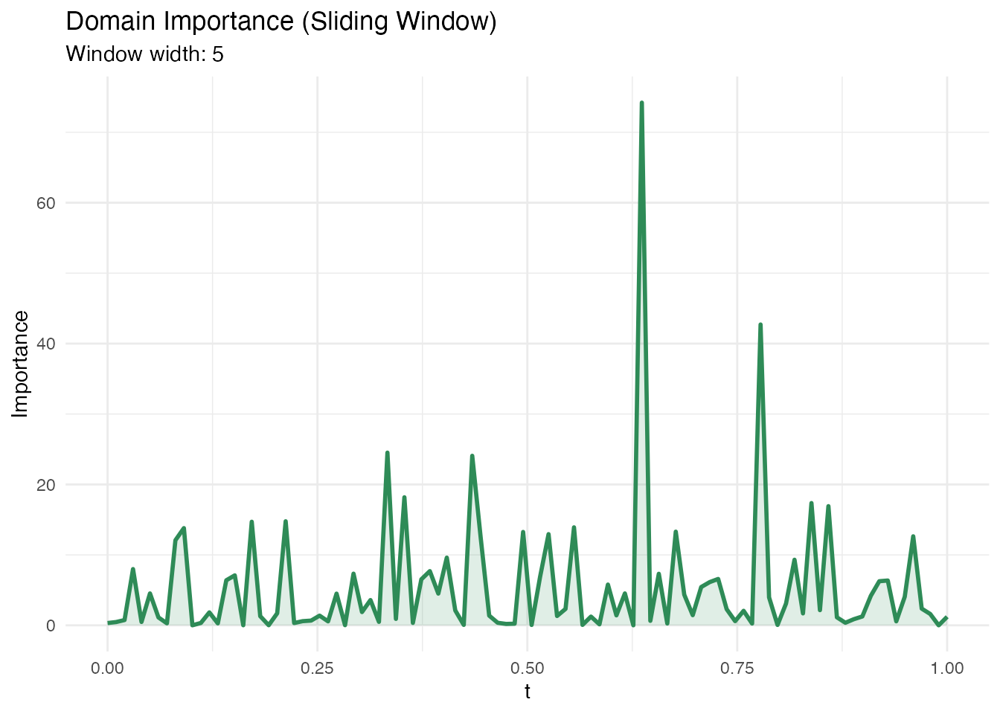

### Significant Regions

**In plain English:** This method identifies contiguous intervals of $t$
where the coefficient $\beta(t)$ is statistically different from zero.
Unlike pointwise importance (which gives a continuous importance score),
this gives a binary answer: significant or not. Use this when you need
formal inference about which domain regions matter.

**Mathematically:** At each $t$, a pointwise test is performed using the
standard error of $\widehat{\beta}(t)$. Contiguous intervals exceeding
the significance threshold at level $\alpha$ are reported.

``` r
sig <- fregre.significant.regions(model, alpha = 0.05)

if (is.null(sig) || length(sig$start_idx) == 0) {
  cat("No significant regions detected at alpha = 0.05.\n")
  cat("This can happen when the signal is spread across many FPCs or\n")
  cat("when pointwise tests lack power. Try bootstrap CI instead.\n")
} else {
  cat("Significant regions found:", length(sig$start_idx), "\n")
  for (i in seq_along(sig$start_idx)) {
    cat(sprintf("  Region %d: t = [%.3f, %.3f] (%s)\n",
                i, t_grid[sig$start_idx[i]], t_grid[sig$end_idx[i]],
                sig$direction[i]))
  }
}
#> Significant regions found: 47 
#>   Region 2: t = [0.000, 0.000] (positive)
#>   Region 3: t = [0.010, 0.010] (negative)
#>   Region 4: t = [0.020, 0.020] (positive)
#>   Region 5: t = [0.040, 0.051] (negative)
#>   Region 6: t = [0.061, 0.141] (positive)
#>   Region 7: t = [0.152, 0.192] (negative)
#>   Region 8: t = [0.202, 0.232] (positive)
#>   Region 9: t = [0.242, 0.242] (negative)
#>   Region 10: t = [0.253, 0.273] (positive)
#>   Region 11: t = [0.283, 0.283] (negative)
#>   Region 12: t = [0.293, 0.303] (positive)
#>   Region 13: t = [0.313, 0.313] (negative)
#>   Region 14: t = [0.323, 0.354] (positive)
#>   Region 15: t = [0.364, 0.364] (negative)
#>   Region 16: t = [0.384, 0.404] (negative)
#>   Region 17: t = [0.414, 0.455] (positive)
#>   Region 18: t = [0.465, 0.475] (negative)
#>   Region 19: t = [0.485, 0.485] (positive)
#>   Region 20: t = [0.495, 0.525] (negative)
#>   Region 21: t = [0.535, 0.535] (positive)
#>   Region 22: t = [0.545, 0.556] (negative)
#>   Region 23: t = [0.566, 0.596] (positive)
#>   Region 24: t = [0.606, 0.606] (negative)
#>   Region 25: t = [0.616, 0.626] (positive)
#>   Region 26: t = [0.636, 0.646] (negative)
#>   Region 27: t = [0.657, 0.657] (positive)
#>   Region 28: t = [0.667, 0.677] (negative)
#>   Region 29: t = [0.697, 0.697] (negative)
#>   Region 30: t = [0.707, 0.707] (positive)
#>   Region 31: t = [0.717, 0.717] (negative)
#>   Region 32: t = [0.727, 0.727] (positive)
#>   Region 33: t = [0.737, 0.737] (negative)
#>   Region 34: t = [0.758, 0.758] (negative)
#>   Region 35: t = [0.768, 0.768] (positive)
#>   Region 36: t = [0.778, 0.798] (negative)
#>   Region 37: t = [0.808, 0.808] (positive)
#>   Region 38: t = [0.818, 0.818] (negative)
#>   Region 39: t = [0.828, 0.838] (positive)
#>   Region 40: t = [0.848, 0.848] (negative)
#>   Region 41: t = [0.859, 0.869] (positive)
#>   Region 42: t = [0.879, 0.879] (negative)
#>   Region 43: t = [0.889, 0.899] (positive)
#>   Region 44: t = [0.919, 0.919] (negative)
#>   Region 45: t = [0.929, 0.929] (positive)
#>   Region 46: t = [0.939, 0.980] (negative)
#>   Region 47: t = [0.990, 0.990] (positive)
```

------------------------------------------------------------------------

## Local Explanations

These methods answer: **why did the model make this specific
prediction?** Each method explains a single observation’s prediction,
which is essential when you need to justify individual decisions
(e.g. medical diagnostics, process control).

*All methods in this section support both `fregre.lm` and
`functional.logistic`.*


### SHAP Values

**In plain English:** SHAP assigns each FPC score a “contribution” to a
specific prediction. If observation $i$ has a high predicted value, SHAP
tells you which scores pushed the prediction up and which pulled it
down. The contributions always add up exactly to the difference between
the prediction and the average prediction — nothing is missing.

**Mathematically:** SHAP values are the unique Shapley values from
cooperative game theory. For observation $i$ and score $k$:

$${\widehat{y}}_{i} - E\left\lbrack \widehat{y} \right\rbrack = \sum\limits_{k = 1}^{K}\phi_{k}^{(i)}.$$

Each $\phi_{k}^{(i)}$ averages the marginal contribution of score $k$
across all possible orderings of scores (hence: fair, additive, exact).

**The beeswarm plot** below shows every observation as a dot, coloured
by its feature value. This reveals whether high values of a score push
predictions up (dots on the right) or down (dots on the left).

``` r
shap <- fregre.shap(model, data = fdataobj)

obs_idx <- 1
ncomp <- ncol(shap$values)
df_shap <- data.frame(
  Component = paste0("PC", 1:ncomp),
  SHAP = shap$values[obs_idx, ]
)
df_shap$Direction <- ifelse(df_shap$SHAP > 0, "Positive", "Negative")
df_shap$Component <- factor(df_shap$Component,
                             levels = df_shap$Component[order(abs(df_shap$SHAP))])

ggplot(df_shap, aes(x = Component, y = SHAP, fill = Direction)) +
  geom_col(alpha = 0.7) +
  scale_fill_manual(values = c("Positive" = "#4A90D9", "Negative" = "#D55E00")) +
  coord_flip() +
  labs(title = paste("SHAP Values for Observation", obs_idx),
       subtitle = paste("Predicted:", round(model$fitted.values[obs_idx], 3),
                        "| Observed:", round(y[obs_idx], 3)),
       x = NULL, y = "SHAP Value") +
  theme(legend.position = "bottom")
```

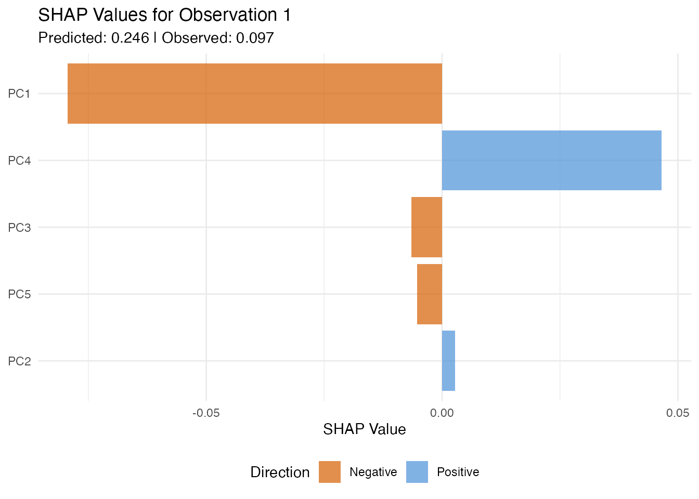

``` r
df_shap_all <- data.frame(
  Component = rep(paste0("PC", 1:ncomp), each = n),
  SHAP = as.vector(shap$values),
  Feature_Value = as.vector(model$.fpca_scores[, 1:ncomp])
)

ggplot(df_shap_all, aes(x = SHAP, y = Component, color = Feature_Value)) +
  geom_jitter(width = 0, height = 0.2, size = 1.5, alpha = 0.6) +
  scale_color_gradient2(low = "#4A90D9", mid = "gray90", high = "#D55E00",
                        midpoint = 0) +
  geom_vline(xintercept = 0, linetype = "dashed", alpha = 0.3) +
  labs(title = "SHAP Summary Plot",
       subtitle = "Each point = one observation's attribution for that component",
       x = "SHAP Value", y = NULL, color = "Feature\nValue")
```

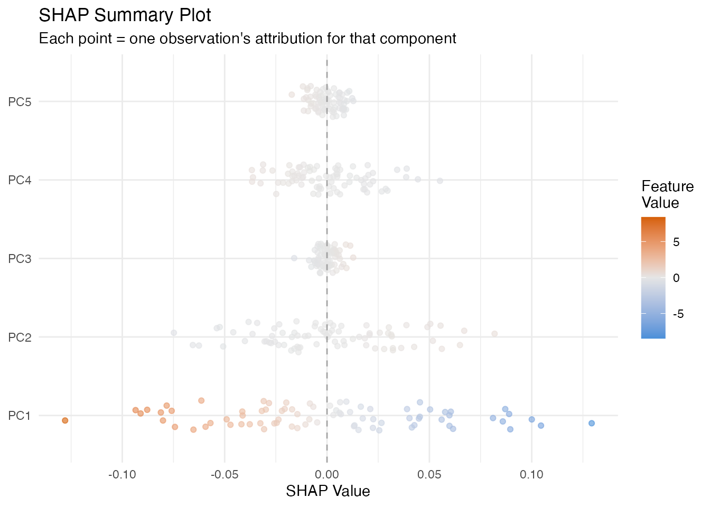

### LIME

**In plain English:** LIME explains one prediction by fitting a simple
linear model in the **neighbourhood** of that observation. It perturbs
the FPC scores slightly, observes how the prediction changes, and fits a
weighted linear model. The coefficients of this local model tell you
which scores matter for *this particular observation*.

**Mathematically:** LIME minimises

$$\sum\limits_{i = 1}^{M}w_{i}\left\lbrack \widehat{f}\left( {\widetilde{\mathbf{ξ}}}_{i} \right) - g\left( {\widetilde{\mathbf{ξ}}}_{i} \right) \right\rbrack^{2},$$

where $g$ is a simple (e.g. linear) surrogate,
${\widetilde{\mathbf{ξ}}}_{i}$ are perturbed score vectors, and
$w_{i} = \exp\left( - d_{i}^{2}/\sigma^{2} \right)$ weights by distance
from the target observation.

The **local $R^{2}$** indicates how well the linear surrogate
approximates the model in this neighbourhood. Low $R^{2}$ means the
model has local nonlinearities.

``` r
lime_res <- fregre.lime(model, data = fdataobj, observation = 1,
                        n.samples = 300, kernel.width = 1, seed = 42)

ncomp_lime <- length(lime_res$attributions)
df_lime <- data.frame(
  Component = paste0("PC", seq_len(ncomp_lime)),
  Attribution = lime_res$attributions
)
df_lime$Direction <- ifelse(df_lime$Attribution > 0, "Positive", "Negative")

ggplot(df_lime, aes(x = reorder(Component, abs(Attribution)), y = Attribution,
                     fill = Direction)) +
  geom_col(alpha = 0.7) +
  scale_fill_manual(values = c("Positive" = "#4A90D9", "Negative" = "#D55E00")) +
  coord_flip() +
  labs(title = paste("LIME Explanation (Obs 1, local R\u00b2 =",
                     round(lime_res$local_r_squared, 3), ")"),
       x = NULL, y = "Local Attribution") +
  theme(legend.position = "none")
```

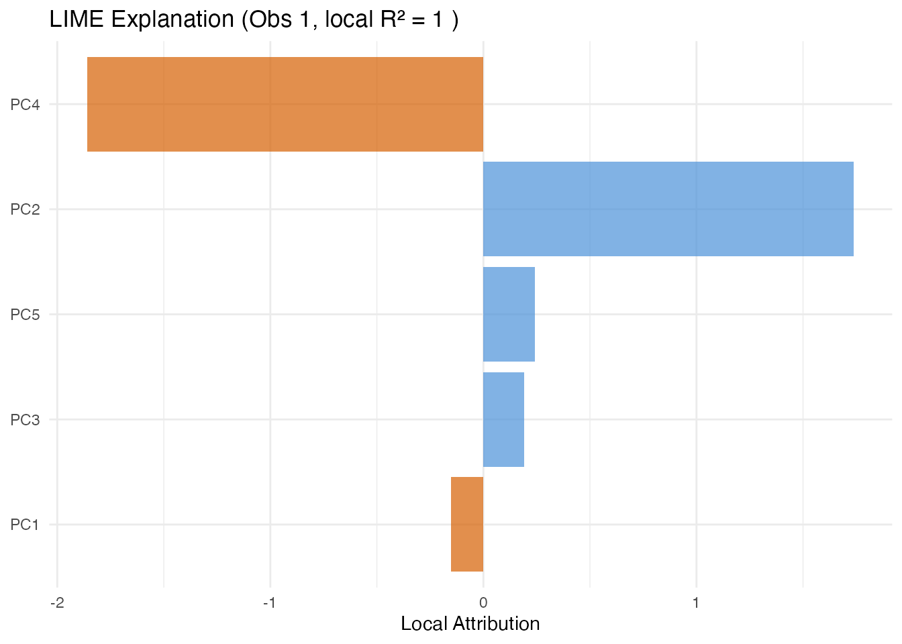

### Counterfactual Explanations

**In plain English:** A counterfactual answers “what is the smallest
change to this observation’s scores that would make the model predict a
target value?” This is useful for actionable feedback — e.g. “if PC1
were 0.5 units higher, the predicted quality score would cross the
acceptance threshold.”

**Mathematically:** The counterfactual finds

$${\mathbf{ξ}}^{*} = \arg\min\limits_{\mathbf{ξ}} \parallel {\mathbf{ξ}} - {\mathbf{ξ}}_{i} \parallel_{2}\quad\text{s.t.}\quad\widehat{f}\left( {\mathbf{ξ}}^{*} \right) = y_{\text{target}}.$$

The distance $\parallel {\mathbf{ξ}}^{*} - {\mathbf{ξ}}_{i} \parallel$
indicates how far the observation is from the target in score space.

``` r
target_val <- mean(y) + sd(y)
cf <- fregre.counterfactual(model, data = fdataobj, observation = 1,
                            target.value = target_val)

cat("Original prediction:", round(cf$original_prediction, 3), "\n")
#> Original prediction: 0.307
cat("Counterfactual prediction:", round(cf$counterfactual_prediction, 3), "\n")
#> Counterfactual prediction: 0.648
cat("Score distance:", round(cf$distance, 3), "\n")
#> Score distance: 1.741
```

### Anchor Explanations

**In plain English:** An anchor is a set of **sufficient conditions** on
the FPC scores such that any observation meeting those conditions
receives a similar prediction. Think of it as an if-then rule: “IF PC1
is between 2.1 and 3.4 AND PC3 is between -1.0 and 0.5, THEN the
prediction is approximately the same, with 95% precision.”

**Mathematically:** An anchor $A$ satisfies

$$P\left\lbrack \widehat{f}({\mathbf{ξ}}) \approx \widehat{f}\left( {\mathbf{ξ}}_{i} \right) \mid A({\mathbf{ξ}}) \right\rbrack \geq 1 - \delta,$$

where $\delta$ is the precision threshold and $A({\mathbf{ξ}})$ denotes
that $\mathbf{ξ}$ satisfies the anchor conditions.

**Coverage** is the fraction of observations satisfying the anchor.
Narrow anchors have high precision but low coverage; broader anchors are
more general but less precise.

``` r
anch <- fregre.anchor(model, data = fdataobj, observation = 1,
                      precision = 0.90, n.bins = 5)

cat("Anchor precision:", round(anch$precision, 3), "\n")
#> Anchor precision: 1
cat("Coverage:", round(anch$coverage, 3), "\n")
#> Coverage: 0.2
cat("Matching observations:", anch$n_matching, "\n")
#> Matching observations: 16
if (length(anch$condition_components) > 0) {
  cat("Conditions:\n")
  for (i in seq_along(anch$condition_components)) {
    cat(sprintf("  PC%d in [%.3f, %.3f]\n",
                anch$condition_components[i],
                anch$condition_lower[i], anch$condition_upper[i]))
  }
}
#> Conditions:
#>   PC0 in [2.718, Inf]
```

### Prototypes and Criticisms

**In plain English:** Prototypes are the most representative
observations — the “typical” curves in each part of score space.
Criticisms are the opposite: observations that are poorly represented by
the prototypes. Together, they give you a small set of example curves
that summarise the entire dataset.

**Mathematically:** Prototypes and criticisms are selected using the
Maximum Mean Discrepancy (MMD) witness function. Prototypes minimise the
MMD between the selected subset and the full dataset; criticisms are
points where the witness function is maximally negative
(underrepresented).

``` r
proto <- fregre.prototype(model, ncomp = model$ncomp,
                          n.prototypes = 3, n.criticisms = 3)

cat("Prototype indices:", paste(proto$prototype_indices, collapse = ", "), "\n")
#> Prototype indices: 71, 42, 11
cat("Criticism indices:", paste(proto$criticism_indices, collapse = ", "), "\n")
#> Criticism indices: 68, 35, 29
```

``` r
proto_curves <- fdataobj$data[proto$prototype_indices, , drop = FALSE]
crit_curves <- fdataobj$data[proto$criticism_indices, , drop = FALSE]

df_proto <- do.call(rbind, lapply(seq_len(nrow(proto_curves)), function(i) {
  data.frame(t = t_grid, y = proto_curves[i, ],
             type = "Prototype", id = paste("P", proto$prototype_indices[i]))
}))
df_crit <- do.call(rbind, lapply(seq_len(nrow(crit_curves)), function(i) {
  data.frame(t = t_grid, y = crit_curves[i, ],
             type = "Criticism", id = paste("C", proto$criticism_indices[i]))
}))
df_pc <- rbind(df_proto, df_crit)

ggplot(df_pc, aes(x = t, y = y, color = type, group = id)) +
  geom_line(linewidth = 0.8, alpha = 0.8) +
  scale_color_manual(values = c("Prototype" = "#4A90D9", "Criticism" = "#D55E00")) +
  labs(title = "Prototypes and Criticisms",
       subtitle = "Representative vs atypical curves",
       x = "t", y = "X(t)", color = NULL) +
  theme(legend.position = "bottom")
```

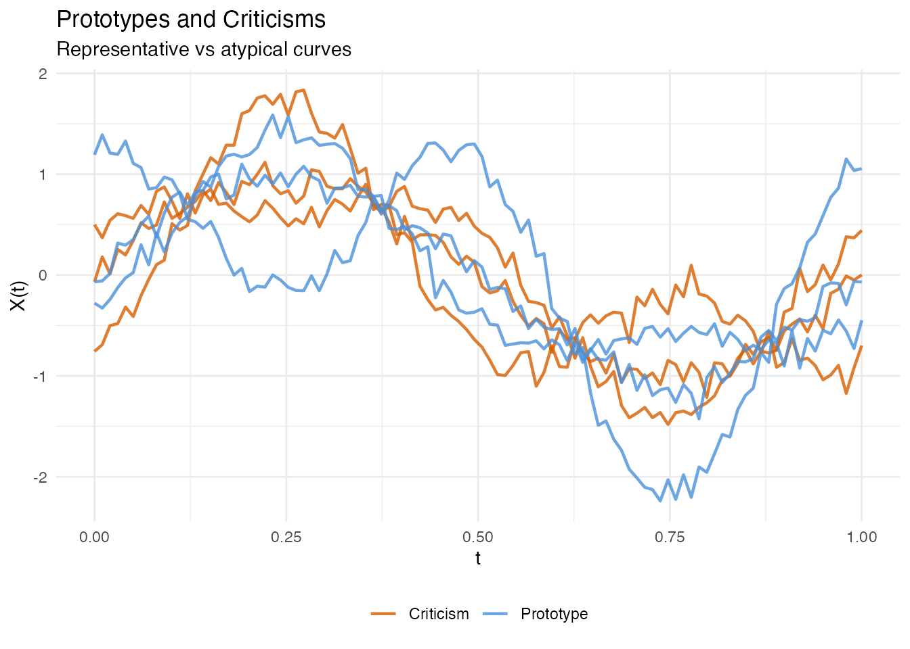

------------------------------------------------------------------------

## Classification Explainability

All the methods above also work with
[`functional.logistic()`](https://sipemu.github.io/fdars-r/reference/functional.logistic.md)
models via automatic dispatch — you call the same R function and it
detects the model class. In addition, two methods are **logistic-only**:
calibration and ECE.

| Method             | lm  | logistic | Notes                             |
|:-------------------|:---:|:--------:|:----------------------------------|
| PDP, ALE, Sobol, … | yes |   yes    | On probability scale for logistic |
| Calibration        |     |   yes    | Hosmer-Lemeshow test              |
| ECE / MCE          |     |   yes    | Binned calibration error          |

### Logistic Setup

``` r
y_binary <- as.numeric(y > median(y))
logit_model <- functional.logistic(fdataobj, y_binary, ncomp = 3)
cat("Accuracy:", round(logit_model$accuracy, 4), "\n")
#> Accuracy: 0.525
```

### PDP and ALE for Classification

For logistic models, PDP and ALE show the effect of FPC scores on the
**predicted probability** of the positive class (rather than a
continuous response).

``` r
pdp_logit <- fregre.pdp(logit_model, data = fdataobj, component = 1, n.grid = 30)

df_pdp_logit <- data.frame(x = pdp_logit$grid_values, y = pdp_logit$pdp_curve)

ggplot(df_pdp_logit, aes(x = x, y = y)) +
  geom_line(color = "#D55E00", linewidth = 1) +
  labs(title = "PDP for Logistic Model (PC1)",
       subtitle = "Effect of PC1 on predicted probability",
       x = "PC1 Score", y = "Predicted Probability")
```

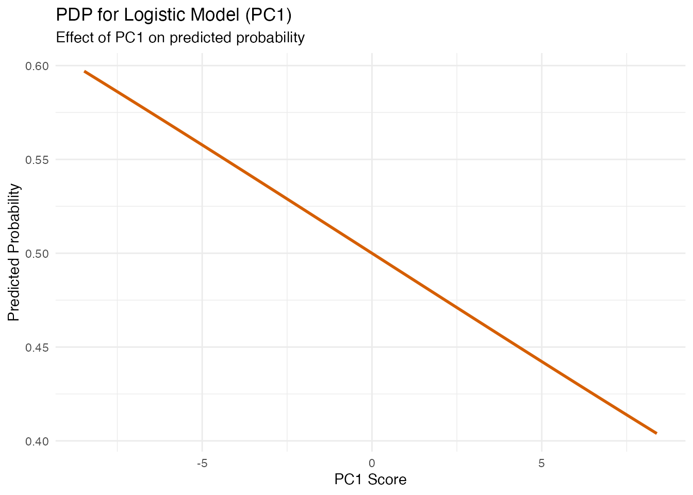

``` r
ale_logit <- fregre.ale(logit_model, data = fdataobj, component = 1, n.bins = 15)

df_ale_logit <- data.frame(x = ale_logit$bin_midpoints, y = ale_logit$ale_values)

ggplot(df_ale_logit, aes(x = x, y = y)) +
  geom_step(color = "#D55E00", linewidth = 1) +
  geom_hline(yintercept = 0, linetype = "dashed", alpha = 0.3) +
  labs(title = "ALE for Logistic Model (PC1)",
       x = "PC1 Score", y = "ALE")
```

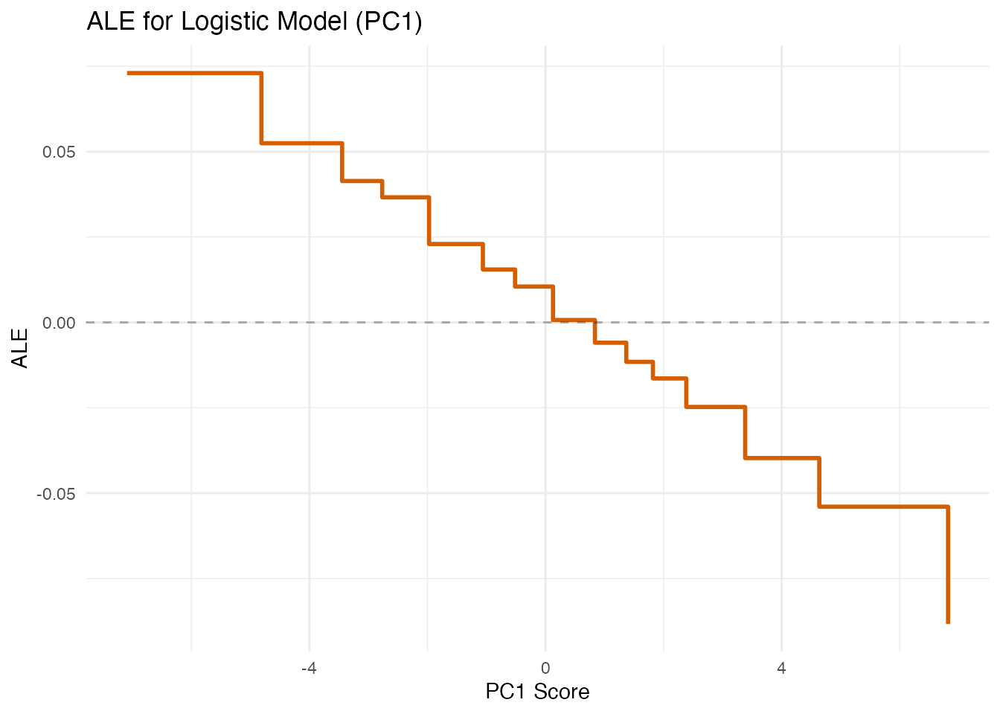

### Beta Decomposition (Logistic)

``` r
decomp_logit <- fregre.beta.decomp(logit_model)

df_decomp_logit <- data.frame(
  Component = paste0("PC", 1:length(decomp_logit$variance_proportion)),
  Weight = decomp_logit$variance_proportion
)
df_decomp_logit$Component <- factor(df_decomp_logit$Component,
  levels = df_decomp_logit$Component[order(-df_decomp_logit$Weight)])

ggplot(df_decomp_logit, aes(x = Component, y = Weight)) +
  geom_col(fill = "#D55E00", alpha = 0.7) +
  labs(title = "Beta Decomposition (Logistic)",
       subtitle = "Importance of each FPC for the classification boundary",
       x = "Component", y = "Variance Proportion")
```

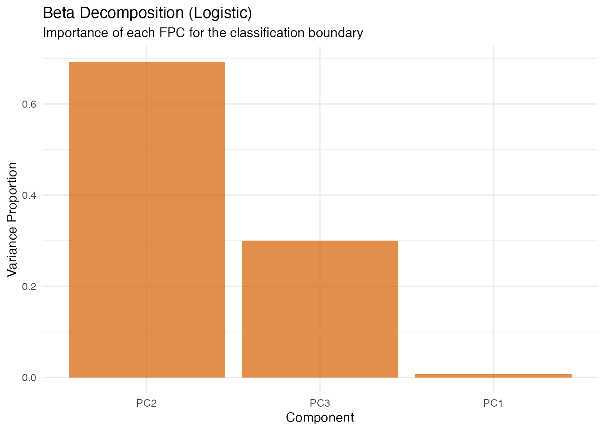

### Calibration Diagnostics

**In plain English:** Calibration checks whether predicted probabilities
match observed frequencies. If the model says “70% chance of class 1”
for a group of observations, about 70% should actually be class 1. Poor
calibration means the model is over- or under-confident.

**logistic only.** Continuous (`fregre.lm`) models do not produce
probabilities.

- **Brier score**: Mean squared error of probability forecasts (lower =
  better).
- **Hosmer-Lemeshow $\chi^{2}$**: Goodness-of-fit test for calibration.
- **ECE** (Expected Calibration Error): Average absolute gap between
  predicted probability and observed frequency.
- **MCE** (Maximum Calibration Error): Worst-case gap across bins.

``` r
cal <- fregre.calibration(logit_model, y = y_binary, n.groups = 5)
cat("Brier score:", round(cal$brier_score, 4), "\n")
#> Brier score: 0.245
cat("Hosmer-Lemeshow chi2:", round(cal$hosmer_lemeshow_chi2, 4), "\n")
#> Hosmer-Lemeshow chi2: 8.0144
```

``` r
ece <- fregre.ece(logit_model, y = y_binary, n.bins = 5)
cat("ECE:", round(ece$ece, 4), "\n")
#> ECE: 0.0593
cat("MCE:", round(ece$mce, 4), "\n")
#> MCE: 0.2271
```

------------------------------------------------------------------------

## Perturbation Spaces: Current Approach and Alternatives

All explainability methods in fdars work by **perturbing** the model
inputs and observing how predictions change. The key design choice is:
*in which space do we define perturbations?* For functional data this is
nontrivial, because a curve $X(t)$ is infinite-dimensional and different
representations capture different aspects of its variation.


### Current implementation: FPC scores

The fdars explainability toolkit operates in **FPC score space**. All
perturbations — PDP grid sweeps, SHAP coalitions, LIME neighbourhood
sampling, counterfactual optimisation — modify the $K$-dimensional score
vector ${\mathbf{ξ}} = \left( \xi_{1},\ldots,\xi_{K} \right)$ rather
than the curve itself.

**Why this works well:** For `fregre.lm` and `functional.logistic`, the
model is *defined* in FPC score space — the prediction function is
$\widehat{y} = f({\mathbf{ξ}})$. Perturbing scores is exact: we change
the actual model inputs. The dimensionality is low ($K \approx 3$–$15$),
so methods like SHAP (which enumerate subsets) and Sobol (which require
Monte Carlo sampling) are computationally tractable.

### Alternative perturbation spaces

For other model types or data structures, FPC scores may not be the most
faithful perturbation space:

| Space                    | Perturb what?                              | Best for                               | Pros                                | Cons                                                      |
|:-------------------------|:-------------------------------------------|:---------------------------------------|:------------------------------------|:----------------------------------------------------------|
| **FPC scores**           | $\xi_{k}$                                  | `fregre.lm`, `functional.logistic`     | Low-dim, exact for FPC-based models | Assumes FPCA captures relevant variation                  |
| **Basis coefficients**   | B-spline / Fourier $c_{j}$                 | Basis-represented models               | Low-dim, preserves smoothness       | Tied to a specific basis choice                           |
| **Pointwise / segments** | $X\left( t_{j} \right)$ or region averages | Nonparametric (`fregre.np`), any model | Model-agnostic                      | High-dim unless segmented; may produce unrealistic curves |
| **SRVF + warping**       | Amplitude and phase separately             | Elastic alignment models               | Respects shape geometry             | Complex; requires elastic framework                       |
| **Wavelet coefficients** | Multi-resolution $w_{j,k}$                 | Localized features                     | Captures local + global structure   | Basis-dependent; less common in FDA                       |

### When FPC scores are the wrong space

FPC scores are a **linear, global** representation. They can be
misleading when:

1.  **Phase variation dominates.** Elastic models exist precisely
    because FPCA cannot separate timing from amplitude. Perturbing FPC
    scores of unaligned curves produces unrealistic shapes that mix the
    two. The natural space for elastic models is SRVF amplitude scores +
    warping function scores.

2.  **Localized features matter.** FPCA eigenfunctions are global
    (nonzero everywhere). If a small bump at $t = 0.3$ is the key
    predictor, many FPCs are needed to represent it. A B-spline or
    wavelet perturbation space would be more faithful and
    lower-dimensional for that feature.

3.  **Nonlinear manifold structure.** If curves live on a curved
    manifold (e.g. positive functions, shapes, compositional data),
    linear FPC perturbations can produce off-manifold curves — negative
    where they should be positive, wrong topology, etc.

### The pragmatic path: FPC projection as a universal adapter

For models that do not internally use FPC scores (e.g. `fregre.np`), a
practical approach is to use FPCA as a **perturbation coordinate
system** without modifying the model:

1.  Perform FPCA on the training data.
2.  Project each observation into score space.
3.  Perturb scores as usual (PDP, SHAP, etc.).
4.  Reconstruct the perturbed curve from the modified scores.
5.  Call the model’s [`predict()`](https://rdrr.io/r/stats/predict.html)
    on the reconstructed curve.

This treats FPCA as the *perturbation language*, not part of the model
itself. It works well as a first-order approximation — “which modes of
variation matter most?” — but the explanations are in terms of FPC
modes, which may not align with the features the nonparametric model
actually uses.

**The principled alternative** is model-specific perturbation spaces:
elastic models perturb in (aligned amplitude, warping) space; basis
models perturb coefficients; NP models use functional distance-based
neighbourhoods. This is a potential direction for future fdars versions.

### Practical recipe: Elastic alignment + linear regression

You don’t need native elastic explainability to get explanations for
data with phase variation. The key insight: **elastic alignment
separates amplitude from phase**. Once curves are aligned, FPCA captures
amplitude variation only, and a standard
[`fregre.lm()`](https://sipemu.github.io/fdars-r/reference/fregre.lm.md)
model operates in a clean amplitude score space.

The pipeline is:

1.  **Align curves** using `alignment.karcher.mean()` to obtain aligned
    curves ${\widetilde{X}}_{i}(t)$ and warping functions
    $\gamma_{i}(t)$.
2.  **Fit
    [`fregre.lm()`](https://sipemu.github.io/fdars-r/reference/fregre.lm.md)**
    on the aligned curves ${\widetilde{X}}_{i}(t)$.
3.  **Apply any of the 22 explainability methods** — they all work on
    the resulting `fregre.lm` model.

``` r
# Step 1: Elastic alignment (removes phase variation)
aligned <- alignment.karcher.mean(fdataobj)

# Step 2: Fit linear model on aligned curves
model_aligned <- fregre.lm(aligned$aligned, y, ncomp = 5)

# Step 3: All explainability methods work!
pdp_aligned <- fregre.pdp(model_aligned, data = aligned$aligned, component = 1)
shap_aligned <- fregre.shap(model_aligned, data = aligned$aligned)
lime_aligned <- fregre.lime(model_aligned, data = aligned$aligned, observation = 1)
```

**What this gives you:**

| Aspect             | Before alignment          | After alignment                          |
|:-------------------|:--------------------------|:-----------------------------------------|
| FPC scores capture | Amplitude + phase (mixed) | Amplitude only (clean)                   |
| Explainability of  | Mixed variation           | Pure shape effects                       |
| Phase information  | Confounded with amplitude | Available separately via $\gamma_{i}(t)$ |
| Model support      | Need `elastic.regression` | Standard `fregre.lm` (all 22 methods)    |

**What about phase effects?** The warping functions $\gamma_{i}(t)$ from
alignment capture timing variation. You can analyse them separately —
e.g. via
[`horiz.fpca()`](https://sipemu.github.io/fdars-r/reference/horiz.fpca.md)
to extract phase modes — or include summary statistics of $\gamma_{i}$
(such as warp complexity or mean shift) as scalar covariates in the
regression model.

**When this is preferable to native elastic regression:**

- You want the full explainability toolkit (22 methods) rather than the
  limited
  [`elastic.attribution()`](https://sipemu.github.io/fdars-r/reference/elastic.attribution.md)
  (amplitude vs phase decomposition only).
- You want model diagnostics (influence, VIF, LOO-CV) for quality
  control.
- The amplitude component is the primary predictor and phase variation
  is nuisance — alignment removes it cleanly.

**When this is not enough:**

- Phase variation *is* the predictor (e.g. timing of a peak predicts the
  response). Then elastic regression models the relationship directly in
  SRVF space, and the align-then-regress pipeline discards the signal.
- Alignment is unreliable (e.g. curves have very different shapes, not
  just different timing). Forcing alignment can distort the amplitude
  component.

### Summary

The current FPC score approach covers ~90% of use cases — it is the
natural coordinate system for FDA, low-dimensional, and exact for the
two supported model types. The align-then-regress pipeline extends
coverage to elastic data by using alignment as a preprocessing step. For
the remaining cases, FPC projection provides a reasonable approximation
with documented caveats, while model-specific perturbation spaces would
provide more faithful explanations at greater implementation cost.

------------------------------------------------------------------------

## References

- Apley, D.W. and Zhu, J. (2020). Visualizing the effects of predictor
  variables in black box supervised learning models. *JRSS-B*, 82(4),
  1059–1086.

- Friedman, J.H. and Popescu, B.E. (2008). Predictive learning via rule
  ensembles. *Annals of Applied Statistics*, 2(3), 916–954.

- Goldstein, A., Kapelner, A., Bleich, J. and Pitkin, E. (2015). Peeking
  inside the black box. *JCGS*, 24(1), 44–65.

- Kim, B., Khanna, R. and Koyejo, O.O. (2016). Examples are not enough,
  learn to criticize! *NeurIPS*, 29.

- Lundberg, S.M. and Lee, S.-I. (2017). A unified approach to
  interpreting model predictions. *NeurIPS*, 30.

- Ramsay, J.O. and Silverman, B.W. (2005). *Functional Data Analysis*.
  2nd ed. Springer.

- Ribeiro, M.T., Singh, S. and Guestrin, C. (2016). “Why should I trust
  you?”: Explaining the predictions of any classifier. *KDD*.

- Ribeiro, M.T., Singh, S. and Guestrin, C. (2018). Anchors:
  High-precision model-agnostic explanations. *AAAI*.

- Sobol, I.M. (1993). Sensitivity estimates for nonlinear mathematical
  models. *Mathematical Modelling and Computational Experiments*, 1,
  407–414.

## See Also

- `vignette("regression-diagnostics")` — DFBETAS, permutation
  importance, stability
- `vignette("uncertainty-quantification")` — prediction intervals,
  bootstrap CI
- [`vignette("articles/scalar-on-function")`](https://sipemu.github.io/fdars-r/articles/scalar-on-function.md)
  — scalar-on-function regression methods
