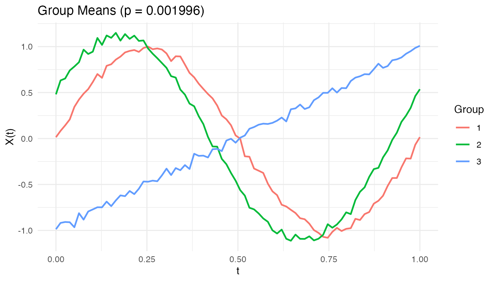
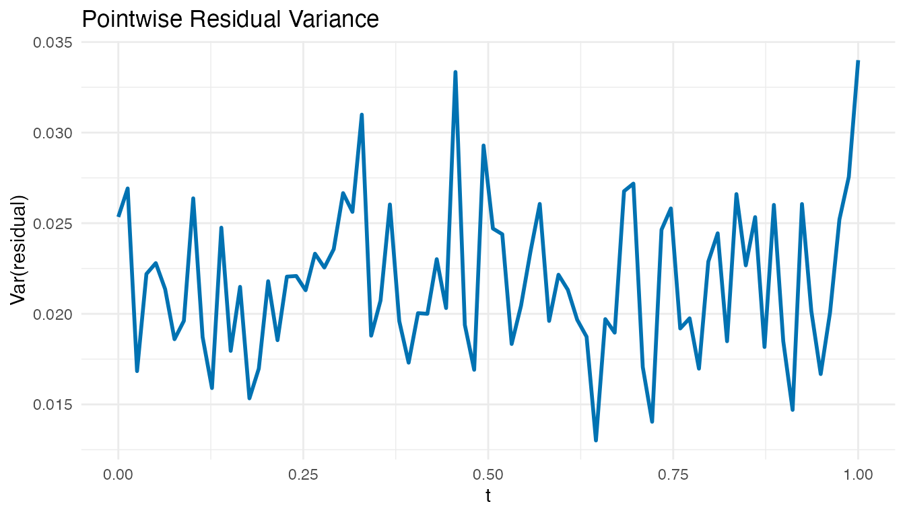
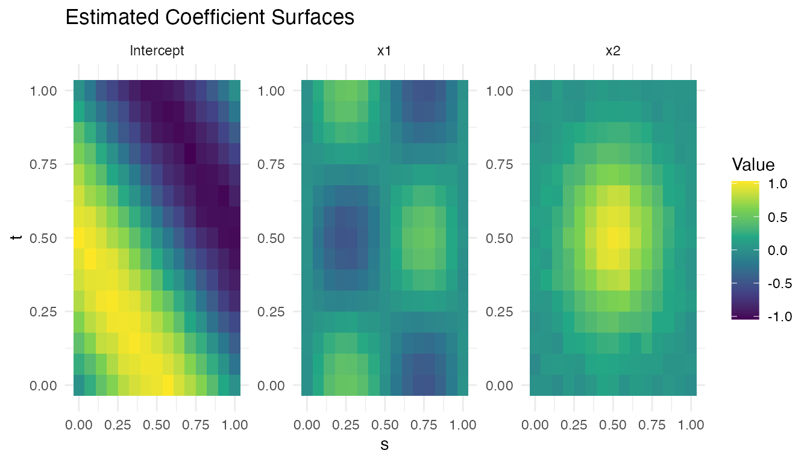

# Function-on-Scalar Regression

## Introduction

Function-on-scalar regression predicts a **functional response**
$Y_{i}(t)$ from **scalar predictors** $x_{i1},\ldots,x_{ip}$. This is
the reverse of scalar-on-function regression: the response is a curve,
not a number.

Typical questions:

- “How does the treatment shift the entire response curve?”
- “Do group means differ at every time point?”


## Mathematical Framework

The function-on-scalar model is:

$$Y_{i}(t) = \mu(t) + \sum\limits_{j = 1}^{p}x_{ij}\,\beta_{j}(t) + \varepsilon_{i}(t)$$

Each coefficient $\beta_{j}(t)$ is a function describing how predictor
$j$ modifies the response curve at each time point $t$. The intercept
$\mu(t)$ is the mean response when all predictors are zero.

### Penalized Estimation

Direct pointwise OLS at each $t$ would produce coefficient estimates
that are noisy and discontinuous.
[`fosr()`](https://sipemu.github.io/fdars-r/reference/fosr.md) imposes
smoothness via a second-difference roughness penalty:

$$\sum\limits_{i = 1}^{n} \parallel Y_{i} - \mu - X_{i}\beta \parallel^{2} + \lambda\sum\limits_{j = 1}^{p}\int\left\lbrack \beta_{j}''(t) \right\rbrack^{2}\, dt$$

where $\lambda > 0$ controls the trade-off between fidelity to the data
and smoothness. The solution at each grid point is a ridge-type
estimator:

$$\widehat{\beta}( \cdot ) = \left( X^{T}X + \lambda D^{T}D \right)^{- 1}X^{T}Y( \cdot )$$

### Pointwise R-squared

The goodness of fit is measured by:

$$R^{2}(t) = 1 - \frac{\sum\limits_{i}\left\lbrack Y_{i}(t) - {\widehat{Y}}_{i}(t) \right\rbrack^{2}}{\sum\limits_{i}\left\lbrack Y_{i}(t) - \bar{Y}(t) \right\rbrack^{2}}$$

Values near 1 everywhere indicate the scalar predictors explain the
functional response well at all time points; regions with low $R^{2}(t)$
suggest additional predictors or nonlinear effects may be needed.

## Penalized FOSR (`fosr`)

[`fosr()`](https://sipemu.github.io/fdars-r/reference/fosr.md) estimates
the coefficient functions $\beta_{j}(t)$ with an optional ridge penalty.

``` r
set.seed(42)
n <- 60
m <- 80
t_grid <- seq(0, 1, length.out = m)

# Two scalar predictors: treatment and age
treatment <- rep(c(0, 1), each = n/2)
age <- rnorm(n)
predictors <- cbind(treatment, age)

# Functional response depends on predictors
Y <- matrix(0, n, m)
for (i in 1:n) {
  Y[i, ] <- sin(2 * pi * t_grid) +
    treatment[i] * 0.5 * cos(2 * pi * t_grid) +
    age[i] * 0.2 * t_grid +
    rnorm(m, sd = 0.15)
}

fd_y <- fdata(Y, argvals = t_grid)
fosr_fit <- fosr(fd_y, predictors, lambda = 0.1)
print(fosr_fit)
#> Function-on-Scalar Regression
#> =============================
#>   Number of observations: 60 
#>   Number of predictors: 2 
#>   Evaluation points: 80 
#>   R-squared: 0.6412 
#>   Lambda: 0.1
```

The treatment coefficient ${\widehat{\beta}}_{1}(t)$ should recover the
simulated $0.5\cos(2\pi t)$ pattern, while the age coefficient
${\widehat{\beta}}_{2}(t)$ should approximate the linear $0.2t$ trend.

### Visualizing Coefficient Functions

``` r
plot(fosr_fit)
```


Each panel shows one coefficient function ${\widehat{\beta}}_{j}(t)$.
The shape reveals *when* during the functional domain each predictor has
its strongest effect.

## FPC-Based FOSR (`fosr.fpc`)

[`fosr.fpc()`](https://sipemu.github.io/fdars-r/reference/fosr.fpc.md)
uses functional principal components instead of penalization:

``` r
fosr_fpc_fit <- fosr.fpc(fd_y, predictors, ncomp = 5)
cat("FPC-based R-squared:", round(fosr_fpc_fit$r.squared, 4), "\n")
#> FPC-based R-squared: 0.6421
```

The FPC-based approach avoids choosing $\lambda$ but requires selecting
the number of components. When the response curves have strong low-rank
structure (most variance in a few FPCs), this approach is efficient and
stable.

## Prediction

``` r
new_pred <- matrix(c(1, 0.5,   # treated, average age
                     0, -1.0), # control, young
                   nrow = 2, byrow = TRUE)
pred <- predict(fosr_fit, new_pred)
```

## Functional ANOVA (`fanova`)

Functional ANOVA tests whether the mean functions of $G$ groups are
equal:

$$H_{0}:\mu_{1}(t) = \mu_{2}(t) = \cdots = \mu_{G}(t)\quad{\text{for all}\mspace{6mu}}t$$

### Pointwise F-Statistic

At each grid point $t$:

$$F(t) = \frac{\sum\limits_{g = 1}^{G}n_{g}\left\lbrack {\bar{Y}}_{g}(t) - \bar{Y}(t) \right\rbrack^{2}/(G - 1)}{\sum\limits_{g = 1}^{G}\sum\limits_{i \in g}\left\lbrack Y_{i}(t) - {\bar{Y}}_{g}(t) \right\rbrack^{2}/(N - G)}$$

These are summarized into a **global test statistic** by integration:

$$F_{\text{global}} = \int F(t)\, dt$$

### Permutation Testing

Because the null distribution of $F_{\text{global}}$ is intractable,
[`fanova()`](https://sipemu.github.io/fdars-r/reference/fanova.md) uses
a permutation approach:

1.  Compute the observed $F_{\text{obs}}$ from the original data.
2.  For $b = 1,\ldots,B$: randomly permute group labels and compute
    $F_{b}^{*}$.
3.  The p-value is:

$$p = \frac{1 + \#\{ F_{b}^{*} \geq F_{\text{obs}}\}}{B + 1}$$

This makes the test exact (valid at any sample size) and assumption-free
regarding the distribution of $\varepsilon_{i}(t)$.

### Example

``` r
set.seed(42)
n_per_group <- 25
m_a <- 80
t_a <- seq(0, 1, length.out = m_a)

# Three treatment groups with different mean functions
Y_anova <- matrix(0, 3 * n_per_group, m_a)
for (i in 1:n_per_group) {
  Y_anova[i, ] <- sin(2 * pi * t_a) + rnorm(m_a, sd = 0.15)
  Y_anova[n_per_group + i, ] <- sin(2 * pi * t_a) +
    0.5 * cos(2 * pi * t_a) + rnorm(m_a, sd = 0.15)
  Y_anova[2 * n_per_group + i, ] <- 2 * t_a - 1 + rnorm(m_a, sd = 0.15)
}
groups <- rep(1:3, each = n_per_group)

fd_anova <- fdata(Y_anova, argvals = t_a)
anova_result <- fanova(fd_anova, groups, n.perm = 500)
print(anova_result)
#> Functional ANOVA
#> ================
#>   Number of groups: 3 
#>   Number of observations: 75 
#>   Global F-statistic: 577.3765 
#>   P-value: 0.001996 
#>   Permutations: 500
```

A small p-value rejects the null hypothesis that all groups share the
same mean function. In this simulation, the three groups have clearly
different shapes (sine, sine + cosine, linear), so we expect strong
rejection.

### Visualizing Group Means

``` r
plot(anova_result)
```



The group mean curves show the estimated ${\widehat{\mu}}_{g}(t)$ for
each group. Where the curves separate most, the pointwise F-statistic is
largest.

## Model Diagnostics

After fitting a FOSR model, examine the residuals to check for
misspecification. Large residuals concentrated at certain time points
suggest the model misses structure there.

``` r
# Pointwise residual variance
resid_mat <- fosr_fit$residuals$data
resid_var <- apply(resid_mat, 2, var)

df_resid <- data.frame(t = t_grid, variance = resid_var)
ggplot(df_resid, aes(x = t, y = variance)) +
  geom_line(color = "#0072B2", linewidth = 1) +
  labs(title = "Pointwise Residual Variance",
       x = "t", y = "Var(residual)")
```



Roughly constant residual variance across $t$ supports the model. Peaks
indicate time points where the scalar predictors fail to capture the
response variation, suggesting additional predictors or a more flexible
model.

## 2D Function-on-Scalar Regression (`fosr.2d`)

When the functional response is a **2D surface** $Y_{i}(s,t)$ rather
than a curve $Y_{i}(t)$, standard FOSR does not apply directly. Examples
include:

- **Spatial-temporal fields** — temperature or precipitation measured on
  a spatial grid over time.
- **Brain imaging** — cortical activation surfaces from fMRI or EEG.
- **Environmental monitoring** — pollutant concentrations over a
  geographic region.

[`fosr.2d()`](https://sipemu.github.io/fdars-r/reference/fosr.2d.md)
extends the penalized FOSR framework to surface-valued responses.

### Mathematical Model

The 2D function-on-scalar model is:

$$Y_{i}(s,t) = \mu(s,t) + \sum\limits_{j = 1}^{p}x_{ij}\,\beta_{j}(s,t) + \varepsilon_{i}(s,t)$$

Each coefficient $\beta_{j}(s,t)$ is now a **coefficient surface**
describing how predictor $j$ modifies the response across the entire 2D
domain. The intercept $\mu(s,t)$ is the mean surface when all predictors
are zero.

### Anisotropic Penalization

The two grid directions may require different amounts of smoothing.
[`fosr.2d()`](https://sipemu.github.io/fdars-r/reference/fosr.2d.md)
supports **separate penalties** $\lambda_{s}$ and $\lambda_{t}$ for the
$s$ and $t$ dimensions respectively. This anisotropic penalization is
important when the response varies more rapidly in one direction than
the other — for example, spatial fields that are smooth geographically
but fluctuate quickly over time.

### Worked Example

We simulate $n = 40$ observations of a surface response on a
$15 \times 15$ grid with two scalar predictors: a continuous predictor
`x1` and a binary predictor `x2`.

``` r
set.seed(42)
n_2d <- 40
m1 <- 15; m2 <- 15
s_grid <- seq(0, 1, length.out = m1)
t_2d_grid <- seq(0, 1, length.out = m2)

# Two scalar predictors
x1 <- rnorm(n_2d)
x2 <- rbinom(n_2d, 1, 0.5)
pred_2d <- cbind(x1, x2)

# True coefficient surfaces
beta1_true <- outer(s_grid, t_2d_grid, function(s, t)
  0.5 * sin(2 * pi * s) * cos(2 * pi * t))
beta2_true <- outer(s_grid, t_2d_grid, function(s, t)
  exp(-((s - 0.5)^2 + (t - 0.5)^2) / 0.1))

# Generate surface responses (each row is a flattened m1*m2 surface)
Y_2d <- matrix(0, n_2d, m1 * m2)
for (i in 1:n_2d) {
  surface <- sin(pi * outer(s_grid, t_2d_grid, "+")) +
    x1[i] * beta1_true + x2[i] * beta2_true
  Y_2d[i, ] <- as.vector(surface) + rnorm(m1 * m2, sd = 0.1)
}

fd_2d <- fdata(Y_2d)
fit_2d <- fosr.2d(fd_2d, pred_2d, s_grid, t_2d_grid,
                  lambda.s = 0.01, lambda.t = 0.01)
print(fit_2d)
#> 2D Function-on-Scalar Regression
#>   Grid: 15 x 15 
#>   Predictors: 2 
#>   R-squared: 0.7596 
#>   Lambda (s, t): 0.01 , 0.01
```

### Prediction on New Data

Use [`predict()`](https://rdrr.io/r/stats/predict.html) to obtain fitted
surfaces for new observations:

``` r
new_pred_2d <- matrix(c(1.0, 1,    # x1 = 1.0, x2 = 1
                         -0.5, 0),  # x1 = -0.5, x2 = 0
                       nrow = 2, byrow = TRUE)
pred_2d_out <- predict(fit_2d, new_pred_2d)
```

### Visualizing Coefficient Surfaces

Each estimated coefficient ${\widehat{\beta}}_{j}(s,t)$ is stored as a
flattened row in `fit_2d$beta$data`. To visualize, reshape to the
original $m_{1} \times m_{2}$ grid and plot as a heatmap.

``` r
# Extract and reshape coefficient surfaces for visualization
coef_list <- list(
  data.frame(
    s = rep(s_grid, m2), t = rep(t_2d_grid, each = m1),
    value = as.vector(matrix(fit_2d$intercept$data[1, ], m1, m2)),
    coefficient = "Intercept"
  ),
  data.frame(
    s = rep(s_grid, m2), t = rep(t_2d_grid, each = m1),
    value = as.vector(matrix(fit_2d$beta$data[1, ], m1, m2)),
    coefficient = "x1"
  ),
  data.frame(
    s = rep(s_grid, m2), t = rep(t_2d_grid, each = m1),
    value = as.vector(matrix(fit_2d$beta$data[2, ], m1, m2)),
    coefficient = "x2"
  )
)
df_coef <- do.call(rbind, coef_list)

ggplot(df_coef, aes(x = .data$s, y = .data$t, fill = .data$value)) +
  geom_tile() +
  facet_wrap(~ .data$coefficient, scales = "free") +
  scale_fill_viridis_c() +
  labs(title = "Estimated Coefficient Surfaces",
       x = "s", y = "t", fill = "Value")
```



The `x1` surface should recover the sinusoidal pattern
$0.5\sin(2\pi s)\cos(2\pi t)$, while the `x2` surface should approximate
the Gaussian bump centred at $(0.5,0.5)$.

### GCV for Tuning

The returned object includes a **generalized cross-validation**
criterion (`fit_2d$gcv`) that can guide the choice of $\lambda_{s}$ and
$\lambda_{t}$. Lower GCV values indicate a better bias–variance
trade-off. In practice, you can search over a grid of penalty pairs and
select the combination that minimizes GCV.

## When to Use Each Method

| Method                | Function                                                               | Tuning                    | Best when                               |
|-----------------------|------------------------------------------------------------------------|---------------------------|-----------------------------------------|
| **Penalized FOSR**    | [`fosr()`](https://sipemu.github.io/fdars-r/reference/fosr.md)         | $\lambda$                 | Smooth coefficient functions, large $m$ |
| **FPC-Based FOSR**    | [`fosr.fpc()`](https://sipemu.github.io/fdars-r/reference/fosr.fpc.md) | $K$ (# components)        | Low-rank response structure             |
| **Functional ANOVA**  | [`fanova()`](https://sipemu.github.io/fdars-r/reference/fanova.md)     | $B$ (# permutations)      | Testing group differences               |
| **2D Penalized FOSR** | [`fosr.2d()`](https://sipemu.github.io/fdars-r/reference/fosr.2d.md)   | $\lambda_{s},\lambda_{t}$ | Surface responses on 2D grids           |

## See Also

- [`vignette("articles/scalar-on-function")`](https://sipemu.github.io/fdars-r/articles/scalar-on-function.md)
  — when the *response* is a scalar
- [`vignette("articles/functional-mixed-models")`](https://sipemu.github.io/fdars-r/articles/functional-mixed-models.md)
  — repeated measures with
  [`fmm()`](https://sipemu.github.io/fdars-r/reference/fmm.md)
- [`vignette("articles/example-canadian-weather")`](https://sipemu.github.io/fdars-r/articles/example-canadian-weather.md)
  — real-data FANOVA + FOSR: regional climate patterns

## References

- Ramsay, J.O. and Silverman, B.W. (2005). *Functional Data Analysis*,
  2nd ed. Springer.
- Reiss, P.T. and Ogden, R.T. (2007). Functional Principal Component
  Regression and Functional Partial Least Squares. *Journal of the
  American Statistical Association*, 102(479), 984–996.
- Cuevas, A., Febrero, M., and Fraiman, R. (2004). An anova test for
  functional data. *Computational Statistics & Data Analysis*, 47(1),
  111–122.
