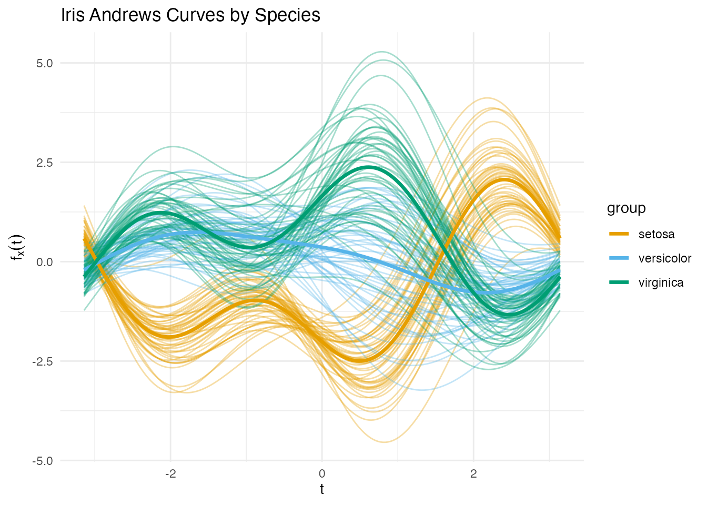
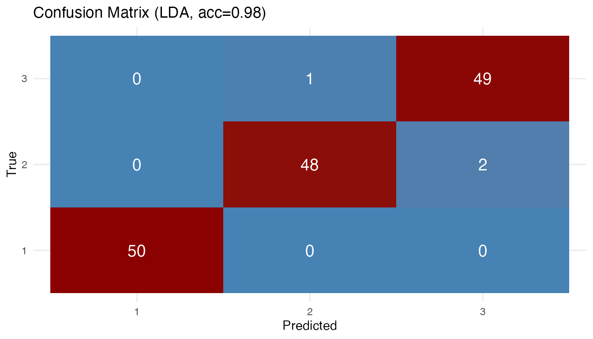
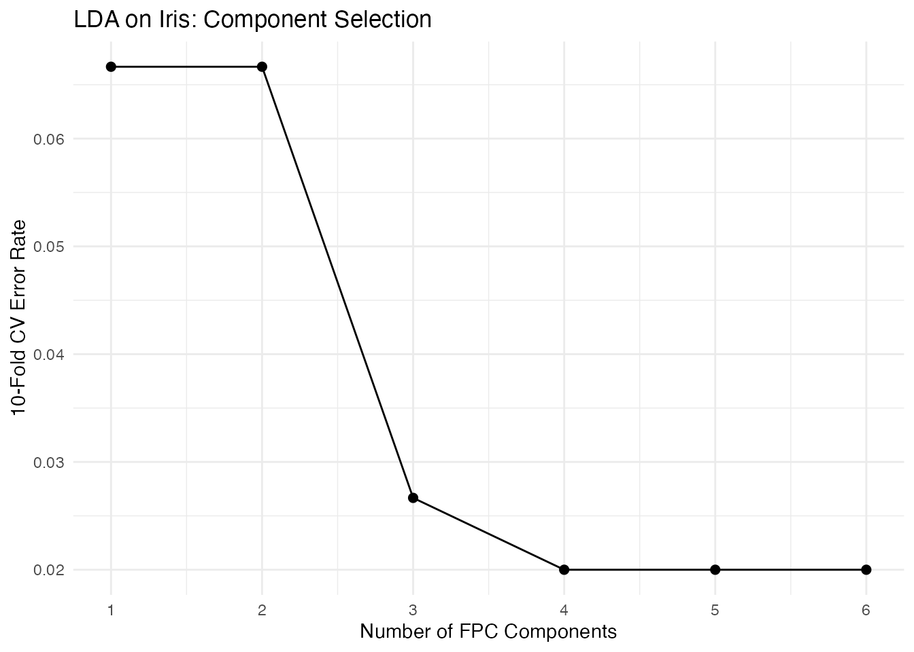

# Supervised Classification of Functional Data

## Introduction

Supervised classification assigns functional observations to discrete
groups. **fdars** provides five methods through a unified
[`fclassif()`](https://sipemu.github.io/fdars-r/reference/fclassif.md)
interface:

| Method     | Description                                   | Strengths                         |
|------------|-----------------------------------------------|-----------------------------------|
| **LDA**    | Linear discriminant analysis on FPC scores    | Fast, interpretable               |
| **QDA**    | Quadratic discriminant analysis on FPC scores | Handles class-specific covariance |
| **kNN**    | k-nearest neighbors in FPC space              | Nonparametric, flexible           |
| **Kernel** | Kernel classifier with functional bandwidth   | Fully nonparametric               |
| **DD**     | Depth-vs-depth classification                 | Robust to outliers                |

All methods support optional scalar covariates alongside functional
predictors.

``` r
library(fdars)
#> 
#> Attaching package: 'fdars'
#> The following objects are masked from 'package:stats':
#> 
#>     cov, decompose, deriv, median, sd, var
#> The following object is masked from 'package:base':
#> 
#>     norm
library(ggplot2)
theme_set(theme_minimal())
```

## Iris as Functional Data

Instead of a toy simulation we use the classic **iris** dataset,
transformed into functional data via the Andrews transformation. This
maps each 4-dimensional observation to a curve on
$\lbrack - \pi,\pi\rbrack$ using a Fourier expansion — preserving
Euclidean distances up to a constant factor.

The three species (*setosa*, *versicolor*, *virginica*) are the classes.
Crucially, *versicolor* and *virginica* overlap substantially, making
this a non-trivial classification task.

``` r
andrews_transform <- function(X, m = 200) {
  if (is.data.frame(X)) X <- as.matrix(X)
  n <- nrow(X)
  p <- ncol(X)
  t_grid <- seq(-pi, pi, length.out = m)

  basis <- matrix(0, m, p)
  basis[, 1] <- 1 / sqrt(2)
  for (j in 2:p) {
    k <- ceiling((j - 1) / 2)
    if (j %% 2 == 0) {
      basis[, j] <- sin(k * t_grid)
    } else {
      basis[, j] <- cos(k * t_grid)
    }
  }

  fdata(X %*% t(basis), argvals = t_grid)
}
```

``` r
X_raw <- as.matrix(iris[, 1:4])
X <- scale(X_raw)
species <- iris$Species
y <- as.integer(species)  # 1 = setosa, 2 = versicolor, 3 = virginica

fd <- andrews_transform(X)
```

``` r
plot(fd, color = species, alpha = 0.35, show.mean = TRUE,
     palette = c("setosa" = "#E69F00", "versicolor" = "#56B4E9",
                 "virginica" = "#009E73")) +
  labs(x = expression(t), y = expression(f[x](t)),
       title = "Iris Andrews Curves by Species")
```



Setosa is well separated, but versicolor and virginica overlap — exactly
the kind of challenge where classifier choice matters.

## Comparing All Five Methods

``` r
methods <- c("lda", "qda", "knn", "kernel", "dd")
results <- list()

for (meth in methods) {
  if (meth == "knn") {
    results[[meth]] <- fclassif(fd, y, method = meth, ncomp = 3, k = 7)
  } else {
    results[[meth]] <- fclassif(fd, y, method = meth, ncomp = 3)
  }
}

acc_df <- data.frame(
  Method = toupper(methods),
  Training_Accuracy = sapply(results, function(r) round(r$accuracy, 3))
)
print(acc_df)
#>        Method Training_Accuracy
#> lda       LDA             0.980
#> qda       QDA             0.973
#> knn       KNN             0.960
#> kernel KERNEL             0.960
#> dd         DD             0.840
```

Training accuracy alone can be misleading — QDA and kNN may overfit.
Cross-validation gives a fairer picture (see below).

## Confusion Matrix

The LDA confusion matrix reveals where errors concentrate:

``` r
plot(results[["lda"]])
```



Most errors are between versicolor and virginica, as expected from the
overlapping Andrews curves.

## Cross-Validation

[`fclassif.cv()`](https://sipemu.github.io/fdars-r/reference/fclassif.cv.md)
evaluates out-of-sample error via k-fold cross-validation:

``` r
set.seed(42)
cv_results <- list()
for (meth in methods) {
  cv_results[[meth]] <- fclassif.cv(fd, y, method = meth,
                                     ncomp = 3, nfold = 10, seed = 42)
}

cv_df <- data.frame(
  Method = toupper(methods),
  CV_Error = sapply(cv_results, function(r) round(r$error.rate, 3)),
  CV_Accuracy = sapply(cv_results, function(r) round(1 - r$error.rate, 3))
)
print(cv_df)
#>        Method CV_Error CV_Accuracy
#> lda       LDA    0.027       0.973
#> qda       QDA    0.033       0.967
#> knn       KNN    0.040       0.960
#> kernel KERNEL    0.667       0.333
#> dd         DD    0.667       0.333
```

## Choosing the Number of Components

Cross-validation can also help select the optimal number of FPC
components. Too few loses discriminative information; too many
introduces noise.

``` r
ncomp_range <- 1:6
cv_by_ncomp <- sapply(ncomp_range, function(k) {
  fclassif.cv(fd, y, method = "lda", ncomp = k, nfold = 10, seed = 42)$error.rate
})

df_ncomp <- data.frame(ncomp = ncomp_range, error = cv_by_ncomp)
ggplot(df_ncomp, aes(x = ncomp, y = error)) +
  geom_line() +
  geom_point(size = 2) +
  labs(x = "Number of FPC Components", y = "10-Fold CV Error Rate",
       title = "LDA on Iris: Component Selection") +
  scale_x_continuous(breaks = ncomp_range)
```



## Method Selection Guidelines

- **LDA**: Good default when classes have similar covariance. Fast and
  interpretable. Works well on iris.
- **QDA**: Better when each class has its own covariance pattern. Needs
  enough observations per class to estimate class-specific covariances.
- **kNN**: Flexible nonparametric option. Tune $k$ via CV. Robust to
  non-linear boundaries.
- **Kernel**: Fully nonparametric — works directly in function space
  without dimension reduction. Can be slow on large datasets.
- **DD**: Robust to outliers. Uses depth-vs-depth plots for
  classification. Less sensitive to distributional assumptions.

## See Also

- [`vignette("articles/andrews-transformation")`](https://sipemu.github.io/fdars-r/articles/andrews-transformation.md)
  for more on the Andrews transform and its distance-preservation
  property
- [`vignette("articles/functional-regression")`](https://sipemu.github.io/fdars-r/articles/functional-regression.md)
  for scalar-on-function regression including
  [`functional.logistic()`](https://sipemu.github.io/fdars-r/reference/functional.logistic.md)
- [`vignette("articles/clustering")`](https://sipemu.github.io/fdars-r/articles/clustering.md)
  for unsupervised functional clustering
- [`vignette("articles/fpca")`](https://sipemu.github.io/fdars-r/articles/fpca.md)
  for functional PCA, which underlies LDA/QDA/kNN
