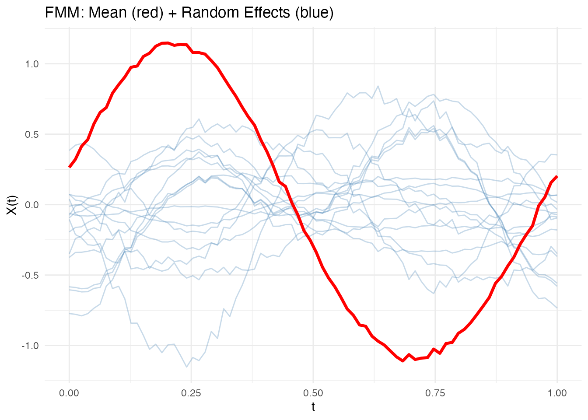
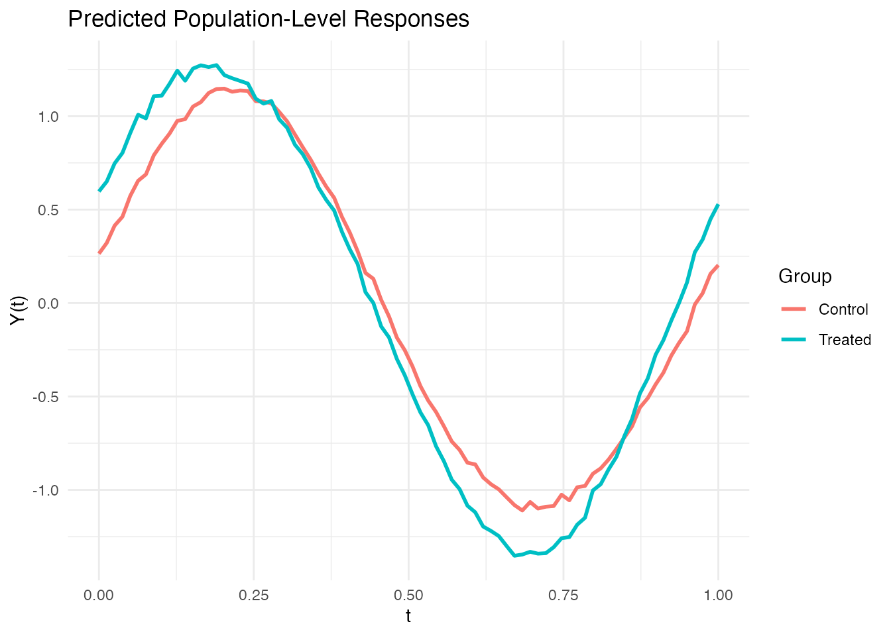

# Functional Mixed Models for Repeated Measures

## Introduction

In many studies, each subject is observed multiple times, producing
repeated functional measurements. A **functional mixed model** (FMM)
decomposes the variation into:

$$Y_{ij}(t) = \mu(t) + \sum\limits_{k}x_{ij,k}\beta_{k}(t) + b_{i}(t) + \varepsilon_{ij}(t)$$

where:

- $\mu(t)$ is the population mean function
- $\beta_{k}(t)$ are fixed-effect coefficient functions (e.g., treatment
  effects)
- $b_{i}(t)$ are subject-level random effects
- $\varepsilon_{ij}(t)$ is measurement error

**fdars** provides
[`fmm()`](https://sipemu.github.io/fdars-r/reference/fmm.md) for
fitting,
[`fmm.predict()`](https://sipemu.github.io/fdars-r/reference/fmm.predict.md)
for prediction, and
[`fmm.test.fixed()`](https://sipemu.github.io/fdars-r/reference/fmm.test.fixed.md)
for testing fixed effects via permutation.

``` r
library(fdars)
#> 
#> Attaching package: 'fdars'
#> The following objects are masked from 'package:stats':
#> 
#>     cov, decompose, deriv, median, sd, var
#> The following object is masked from 'package:base':
#> 
#>     norm
library(ggplot2)
theme_set(theme_minimal())
```

## Simulated Repeated Measures Data

We simulate a clinical trial with 15 subjects, each measured at 3 time
points, with a binary treatment covariate.

``` r
set.seed(42)
n_subjects <- 15
n_visits <- 3
n_total <- n_subjects * n_visits
m <- 80
t_grid <- seq(0, 1, length.out = m)

# Subject-specific random effects
subject_effects <- matrix(0, n_subjects, m)
for (i in 1:n_subjects) {
  subject_effects[i, ] <- 0.3 * rnorm(1) * sin(2 * pi * t_grid) +
    0.2 * rnorm(1) * cos(4 * pi * t_grid)
}

# Treatment assignment (first 8 subjects treated, rest control)
treatment <- c(rep(1, 8), rep(0, 7))

# Generate observations
Y <- matrix(0, n_total, m)
subject_ids <- rep(1:n_subjects, each = n_visits)
covariates <- matrix(0, n_total, 1)

for (i in 1:n_total) {
  subj <- subject_ids[i]
  trt <- treatment[subj]
  covariates[i, 1] <- trt

  Y[i, ] <- sin(2 * pi * t_grid) +                         # Mean function
    trt * 0.5 * cos(2 * pi * t_grid) +                      # Treatment effect
    subject_effects[subj, ] +                                 # Random effect
    rnorm(m, sd = 0.1)                                        # Noise
}

fd <- fdata(Y, argvals = t_grid)
```

## Fitting the Functional Mixed Model

``` r
fit <- fmm(fd, subject_ids, covariates = covariates, ncomp = 3)
print(fit)
#> Functional Mixed Model
#> ======================
#>   Number of observations: 45 
#>   Number of subjects: 15 
#>   FPC components: 3 
#>   Residual variance (sigma2_eps): 0.000159 
#>   Fixed effect covariates: 1
```

## Visualizing Fixed and Random Effects

The plot shows the population mean (red) overlaid with subject-specific
random effects (blue):

``` r
plot(fit)
```



## Examining Model Components

``` r
# Residual variance
cat("Residual variance:", round(fit$sigma2.eps, 4), "\n")
#> Residual variance: 2e-04

# Number of subjects
cat("Number of subjects:", fit$n.subjects, "\n")
#> Number of subjects: 15

# FPC components used for random effects
cat("FPC components:", fit$ncomp, "\n")
#> FPC components: 3
```

## Population-Level Prediction

[`fmm.predict()`](https://sipemu.github.io/fdars-r/reference/fmm.predict.md)
generates predictions using fixed effects only (no random effects),
useful for predicting the population-level response for new covariate
values.

``` r
# Predict for treated and control groups
new_cov <- matrix(c(1, 0), nrow = 2)
pred <- fmm.predict(fit, new.covariates = new_cov)

# Plot predictions
df_pred <- data.frame(
  t = rep(t_grid, 2),
  value = as.vector(t(pred$data)),
  group = factor(rep(c("Treated", "Control"), each = m))
)

ggplot(df_pred, aes(x = t, y = value, color = group)) +
  geom_line(linewidth = 1) +
  labs(x = "t", y = "Y(t)",
       title = "Predicted Population-Level Responses",
       color = "Group")
```



## Testing Fixed Effects

[`fmm.test.fixed()`](https://sipemu.github.io/fdars-r/reference/fmm.test.fixed.md)
tests whether the treatment has a significant effect using a permutation
F-test that respects within-subject correlation:

``` r
test_result <- fmm.test.fixed(fd, subject_ids, covariates,
                               ncomp = 3, n.perm = 500, seed = 123)
print(test_result)
#> Fixed Effects Permutation Test
#> ==============================
#>   Permutations: 500 
#> 
#>             F.statistic  P.value
#> Covariate 1      0.0394 0.001996
```

## Comparison: Ignoring Subject Structure

What happens if we ignore the repeated measures structure and treat all
observations as independent?

``` r
# Naive approach: function-on-scalar regression ignoring subjects
fosr_naive <- fosr(fd, covariates)
cat("Naive FOSR R-squared:", round(fosr_naive$r.squared, 4), "\n")
#> Naive FOSR R-squared: 0.3143

# FMM accounts for subject-level variation
cat("FMM residual variance:", round(fit$sigma2.eps, 4), "\n")
#> FMM residual variance: 2e-04
```

The FMM separates subject-level variation from residual noise, giving a
cleaner estimate of the treatment effect.

## See Also

- [`vignette("articles/functional-regression")`](https://sipemu.github.io/fdars-r/articles/functional-regression.md)
  for scalar-on-function and function-on-scalar regression
- [`vignette("articles/fpca")`](https://sipemu.github.io/fdars-r/articles/fpca.md)
  for the FPC decomposition underlying the random effects
