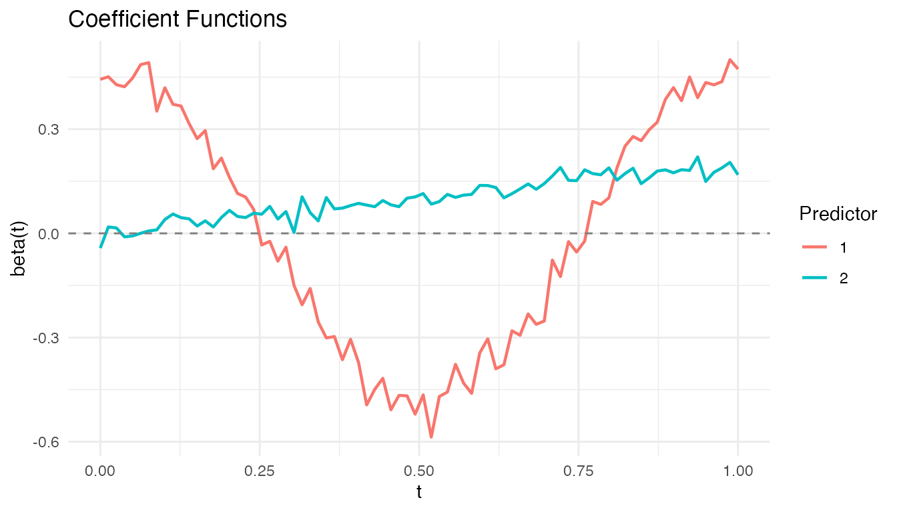

# Functional Regression: Scalar and Function Responses

## Introduction

Functional regression extends classical regression to settings where
predictors or responses are functions. **fdars** provides two
complementary directions:

- **Scalar-on-function regression**: scalar response, functional
  predictors
  ([`fregre.lm()`](https://sipemu.github.io/fdars-r/reference/fregre.lm.md),
  [`functional.logistic()`](https://sipemu.github.io/fdars-r/reference/functional.logistic.md))
- **Function-on-scalar regression**: functional response, scalar
  predictors
  ([`fosr()`](https://sipemu.github.io/fdars-r/reference/fosr.md),
  [`fosr.fpc()`](https://sipemu.github.io/fdars-r/reference/fosr.fpc.md),
  [`fanova()`](https://sipemu.github.io/fdars-r/reference/fanova.md))

This article demonstrates both, including cross-validation and
hypothesis testing.

``` r
library(fdars)
#> 
#> Attaching package: 'fdars'
#> The following objects are masked from 'package:stats':
#> 
#>     cov, decompose, deriv, median, sd, var
#> The following object is masked from 'package:base':
#> 
#>     norm
library(ggplot2)
theme_set(theme_minimal())
```

## Why Functional Regression?

Classical regression assumes that predictors live in ${\mathbb{R}}^{p}$
with $p$ finite and fixed. When the predictor is a curve $X_{i}(t)$
observed on a continuum, we face a fundamentally different problem: the
regression coefficient $\beta(t)$ is itself a function, and the “design
matrix” is infinite-dimensional.

This creates two immediate challenges:

1.  **Ill-posedness.** The functional linear model
    $y_{i} = \alpha + \int X_{i}(t)\beta(t)\, dt + \varepsilon_{i}$ has
    infinitely many solutions because the integral operator is compact.
    Without regularization, the least-squares estimate of $\beta(t)$
    does not exist or is wildly unstable.

2.  **Curse of dimensionality.** Naively discretizing $X_{i}(t)$ at $m$
    grid points and running OLS gives $m$ parameters from $n$
    observations. When $m \gg n$ (the typical FDA setting), the model is
    massively overparameterized.

Two strategies resolve these issues:

- **Dimension reduction**: project $X_{i}(t)$ onto its leading
  functional principal components (FPCs) and regress on the scores. This
  is the approach taken by
  [`fregre.lm()`](https://sipemu.github.io/fdars-r/reference/fregre.lm.md)
  and
  [`fregre.pc()`](https://sipemu.github.io/fdars-r/reference/fregre.pc.md).
- **Penalization**: estimate $\beta(t)$ directly but penalize its
  roughness via a second-derivative penalty. This is the approach taken
  by [`fosr()`](https://sipemu.github.io/fdars-r/reference/fosr.md) for
  the function-on-scalar direction.

Both approaches replace the ill-posed infinite-dimensional problem with
a well-conditioned finite-dimensional one.

## Scalar-on-Function Regression

### Mathematical Framework

The **functional linear model** relates a scalar response $y_{i}$ to a
functional predictor $X_{i}(t)$ via:

$$y_{i} = \alpha + \int_{0}^{1}X_{i}(t)\,\beta(t)\, dt + \varepsilon_{i},\quad\varepsilon_{i}\overset{\text{iid}}{\sim}\left( 0,\sigma^{2} \right)$$

The coefficient function $\beta(t)$ describes *how* the predictor curve
at time $t$ influences the response. A positive $\beta(t)$ in some
interval means that curves with higher values there tend to have higher
$y_{i}$.

#### FPC-Based Estimation

Let $\phi_{1}(t),\phi_{2}(t),\ldots$ be the eigenfunctions of the
covariance operator of $X$, and let
$\xi_{ik} = \int\left( X_{i}(t) - \bar{X}(t) \right)\phi_{k}(t)\, dt$ be
the FPC scores. Expanding
$\beta(t) = \sum_{k = 1}^{\infty}\gamma_{k}\phi_{k}(t)$ and substituting
gives:

$$y_{i} \approx \alpha + \sum\limits_{k = 1}^{K}\gamma_{k}\xi_{ik} + \varepsilon_{i}$$

This reduces the functional regression to an ordinary multiple
regression on $K$ FPC scores. The coefficient function is recovered as:

$$\widehat{\beta}(t) = \sum\limits_{k = 1}^{K}{\widehat{\gamma}}_{k}\phi_{k}(t)$$

The number of components $K$ controls the bias–variance trade-off: too
few components oversimplify $\beta(t)$; too many introduce noise.
Cross-validation selects $K$ in a data-driven way.

#### Standard Errors and GCV

With the FPC scores as predictors, standard OLS inference applies. The
variance of $\widehat{\gamma}$ is
$\sigma^{2}\left( \Xi^{T}\Xi \right)^{- 1}$ where $\Xi$ is the
$n \times K$ score matrix. Generalized cross-validation provides a
computationally efficient alternative to leave-one-out CV:

$$\text{GCV} = \frac{1}{n}\sum\limits_{i = 1}^{n}\left( \frac{y_{i} - {\widehat{y}}_{i}}{1 - h_{ii}} \right)^{2}$$

where $h_{ii}$ are the diagonal elements of the hat matrix
$H = \Xi\left( \Xi^{T}\Xi \right)^{- 1}\Xi^{T}$.

### FPC-Based Functional Linear Model

[`fregre.lm()`](https://sipemu.github.io/fdars-r/reference/fregre.lm.md)
estimates $\beta(t)$ by projecting onto functional principal components.

``` r
set.seed(42)
n <- 80
m <- 100
t_grid <- seq(0, 1, length.out = m)

# Simulate functional predictor
X <- matrix(0, n, m)
for (i in 1:n) {
  X[i, ] <- sin(2 * pi * t_grid) * runif(1, 0.5, 2) +
    cos(4 * pi * t_grid) * rnorm(1, sd = 0.3) +
    rnorm(m, sd = 0.1)
}

# Scalar response depends on the first FPC direction
beta_true <- sin(2 * pi * t_grid)
y <- X %*% beta_true / m + rnorm(n, sd = 0.3)

fd <- fdata(X, argvals = t_grid)
fit <- fregre.lm(fd, y, ncomp = 3)
print(fit)
#> Functional Linear Model (FPC-based)
#> ====================================
#>   Number of observations: 80 
#>   Number of FPC components: 3 
#>   R-squared: 0.4371 
#>   Adjusted R-squared: 0.4149 
#>   GCV: 0.0968
```

The R-squared tells us how much scalar variance is explained by the
leading FPC directions of the predictor curves. The estimated
$\widehat{\beta}(t)$ should approximate the true
$\beta(t) = \sin(2\pi t)$ used in the simulation.

### Cross-Validation for Component Selection

[`fregre.lm.cv()`](https://sipemu.github.io/fdars-r/reference/fregre.lm.cv.md)
selects the optimal number of FPC components via k-fold
cross-validation. This is the data-driven way to choose $K$, balancing
approximation accuracy against overfitting.

``` r
cv_result <- fregre.lm.cv(fd, y, k.range = 1:8, nfold = 10)
cat("Optimal ncomp:", cv_result$optimal.k, "\n")
#> Optimal ncomp: 6
cat("CV errors:", round(cv_result$cv.errors, 4), "\n")
#> CV errors: 0.0957 0.0959 0.0971 0.0971 0.0978 0.0938 0.0942 0.0951
```

The CV error typically decreases as components are added (capturing more
signal), then plateaus or increases (adding noise). The optimal $K$ sits
at the elbow.

### Comparison with fregre.pc

[`fregre.lm()`](https://sipemu.github.io/fdars-r/reference/fregre.lm.md)
uses the Rust backend while
[`fregre.pc()`](https://sipemu.github.io/fdars-r/reference/fregre.pc.md)
uses the same FPC-based approach. Both produce similar fits:

``` r
fit_pc <- fregre.pc(fd, y, ncomp = 3)
cat("fregre.lm R-squared:", round(fit$r.squared, 4), "\n")
#> fregre.lm R-squared: 0.4371
cat("fregre.pc residual MSE:", round(mean(fit_pc$residuals^2), 4), "\n")
#> fregre.pc residual MSE: 0.0871
cat("fregre.lm residual MSE:", round(mean(fit$residuals^2), 4), "\n")
#> fregre.lm residual MSE: 0.0871
```

### Functional Logistic Regression

For binary classification,
[`functional.logistic()`](https://sipemu.github.io/fdars-r/reference/functional.logistic.md)
fits a logistic model with FPC features.

#### The IRLS Algorithm

The functional logistic model uses the logit link on FPC scores:

$$\log\frac{P\left( Y_{i} = 1 \right)}{1 - P\left( Y_{i} = 1 \right)} = \alpha + \sum\limits_{k = 1}^{K}\gamma_{k}\xi_{ik}$$

This is estimated via **Iteratively Reweighted Least Squares (IRLS)**,
which alternates between:

1.  **Working response**:
    $z_{i} = {\widehat{\eta}}_{i} + \left( y_{i} - {\widehat{p}}_{i} \right)/\left\lbrack {\widehat{p}}_{i}\left( 1 - {\widehat{p}}_{i} \right) \right\rbrack$
2.  **Working weights**:
    $w_{i} = {\widehat{p}}_{i}\left( 1 - {\widehat{p}}_{i} \right)$
3.  **Weighted least squares**: update $\widehat{\gamma}$ by regressing
    $z$ on $\Xi$ with weights $w$

Convergence is monitored via the log-likelihood:

$$\ell(\gamma) = \sum\limits_{i = 1}^{n}\lbrack y_{i}\log p_{i} + \left( 1 - y_{i} \right)\log\left( 1 - p_{i} \right)\rbrack$$

where
$p_{i} = \text{logit}^{- 1}\left( \alpha + \xi_{i}^{T}\gamma \right)$.

``` r
# Create binary response (0/1)
y_bin <- as.numeric(y > median(y))

logit_fit <- functional.logistic(fd, y_bin, ncomp = 3)
print(logit_fit)
#> Functional Logistic Regression
#> ==============================
#>   Number of observations: 80 
#>   Number of FPC components: 3 
#>   Accuracy: 0.85 
#>   Log-likelihood: -30.93 
#>   Iterations: 6

cat("Probabilities range:", range(logit_fit$probabilities), "\n")
#> Probabilities range: 0.01257656 0.9824597
```

The estimated probabilities near 0 or 1 indicate confident
classification; values near 0.5 indicate curves in the overlap region
where the predictor’s FPC scores do not clearly separate the two
classes.

## Function-on-Scalar Regression

### Mathematical Framework

When the *response* is a function and the predictors are scalar, the
model is:

$$Y_{i}(t) = \mu(t) + \sum\limits_{j = 1}^{p}x_{ij}\,\beta_{j}(t) + \varepsilon_{i}(t)$$

Each coefficient $\beta_{j}(t)$ is a function describing how predictor
$j$ modifies the response curve at each time point $t$. The intercept
$\mu(t)$ is the mean response when all predictors are zero.

#### Penalized Estimation

Direct pointwise OLS at each $t$ would produce coefficient estimates
that are noisy and discontinuous across the time domain.
[`fosr()`](https://sipemu.github.io/fdars-r/reference/fosr.md) imposes
smoothness via a second-difference roughness penalty. The penalized
objective is:

$$\sum\limits_{i = 1}^{n} \parallel Y_{i} - \mu - X_{i}\beta \parallel^{2} + \lambda\sum\limits_{j = 1}^{p}\int\left\lbrack \beta_{j}''(t) \right\rbrack^{2}\, dt$$

where $\lambda > 0$ controls the trade-off between fidelity to the data
and smoothness. In matrix form, the penalty uses the second-difference
matrix $D$:

$$\widehat{\beta} = \arg\min\limits_{\beta} \parallel Y - X\beta \parallel_{F}^{2} + \lambda\,\text{tr}\left( \beta^{T}D^{T}D\,\beta \right)$$

The solution at each grid point is a ridge-type estimator:

$$\widehat{\beta}( \cdot ) = \left( X^{T}X + \lambda D^{T}D \right)^{- 1}X^{T}Y( \cdot )$$

#### Pointwise R-squared

The goodness of fit is measured by the **pointwise R-squared**:

$$R^{2}(t) = 1 - \frac{\sum\limits_{i}\left\lbrack Y_{i}(t) - {\widehat{Y}}_{i}(t) \right\rbrack^{2}}{\sum\limits_{i}\left\lbrack Y_{i}(t) - \bar{Y}(t) \right\rbrack^{2}}$$

The overall (mean) R-squared averages this across the domain. Values
near 1 everywhere indicate the scalar predictors explain the functional
response well at all time points; regions with low $R^{2}(t)$ suggest
additional predictors or nonlinear effects may be needed.

### Penalized FOSR

[`fosr()`](https://sipemu.github.io/fdars-r/reference/fosr.md) estimates
the coefficient functions $\beta_{j}(t)$ with optional ridge penalty.

``` r
set.seed(42)
n <- 60
m <- 80
t_grid <- seq(0, 1, length.out = m)

# Two scalar predictors: treatment and age
treatment <- rep(c(0, 1), each = n/2)
age <- rnorm(n)
predictors <- cbind(treatment, age)

# Functional response depends on predictors
Y <- matrix(0, n, m)
for (i in 1:n) {
  Y[i, ] <- sin(2 * pi * t_grid) +
    treatment[i] * 0.5 * cos(2 * pi * t_grid) +
    age[i] * 0.2 * t_grid +
    rnorm(m, sd = 0.15)
}

fd_y <- fdata(Y, argvals = t_grid)
fosr_fit <- fosr(fd_y, predictors, lambda = 0.1)
print(fosr_fit)
#> Function-on-Scalar Regression
#> =============================
#>   Number of observations: 60 
#>   Number of predictors: 2 
#>   Evaluation points: 80 
#>   R-squared: 0.6412 
#>   Lambda: 0.1
```

The treatment coefficient ${\widehat{\beta}}_{1}(t)$ should recover the
simulated $0.5\cos(2\pi t)$ pattern, while the age coefficient
${\widehat{\beta}}_{2}(t)$ should approximate the linear $0.2t$ trend.

### Visualizing Coefficient Functions

``` r
plot(fosr_fit)
```



Each panel shows one coefficient function ${\widehat{\beta}}_{j}(t)$.
The shape reveals *when* during the functional domain each predictor has
its strongest effect.

### FPC-Based FOSR

[`fosr.fpc()`](https://sipemu.github.io/fdars-r/reference/fosr.fpc.md)
uses functional principal components instead of penalization:

``` r
fosr_fpc_fit <- fosr.fpc(fd_y, predictors, ncomp = 5)
cat("FPC-based R-squared:", round(fosr_fpc_fit$r.squared, 4), "\n")
#> FPC-based R-squared: 0.6421
```

The FPC-based approach avoids choosing $\lambda$ but requires selecting
the number of components. When the response curves have strong low-rank
structure (most variance in a few FPCs), this approach is efficient and
stable.

### Prediction

``` r
new_pred <- matrix(c(1, 0.5,   # treated, average age
                     0, -1.0), # control, young
                   nrow = 2, byrow = TRUE)
pred <- predict(fosr_fit, new_pred)
```

## Functional ANOVA

### Mathematical Framework

Functional ANOVA tests whether the mean functions of $G$ groups are
equal:

$$H_{0}:\mu_{1}(t) = \mu_{2}(t) = \cdots = \mu_{G}(t)\quad{\text{for all}\mspace{6mu}}t$$

At each grid point $t$, a pointwise F-statistic is computed:

$$F(t) = \frac{\sum\limits_{g = 1}^{G}n_{g}\left\lbrack {\bar{Y}}_{g}(t) - \bar{Y}(t) \right\rbrack^{2}/(G - 1)}{\sum\limits_{g = 1}^{G}\sum\limits_{i \in g}\left\lbrack Y_{i}(t) - {\bar{Y}}_{g}(t) \right\rbrack^{2}/(N - G)}$$

These are summarized into a **global test statistic** by integration:

$$F_{\text{global}} = \int F(t)\, dt$$

#### Permutation Testing

Because the null distribution of $F_{\text{global}}$ is intractable,
[`fanova()`](https://sipemu.github.io/fdars-r/reference/fanova.md) uses
a permutation approach:

1.  Compute the observed $F_{\text{obs}}$ from the original data.
2.  For $b = 1,\ldots,B$: randomly permute group labels and compute
    $F_{b}^{*}$.
3.  The p-value is:

$$p = \frac{1 + \#\{ F_{b}^{*} \geq F_{\text{obs}}\}}{B + 1}$$

The $+ 1$ in numerator and denominator ensures the p-value is never
exactly zero and accounts for the observed statistic being one of the
$B + 1$ values under consideration. This makes the test exact (valid at
any sample size) and assumption-free regarding the distribution of
$\varepsilon_{i}(t)$.

### Permutation F-Test

[`fanova()`](https://sipemu.github.io/fdars-r/reference/fanova.md) tests
whether mean functions differ across groups using a permutation-based
F-test.

``` r
set.seed(42)
n_per_group <- 25
m <- 80
t_grid <- seq(0, 1, length.out = m)

# Three treatment groups with different mean functions
Y_anova <- matrix(0, 3 * n_per_group, m)
for (i in 1:n_per_group) {
  Y_anova[i, ] <- sin(2 * pi * t_grid) + rnorm(m, sd = 0.15)
  Y_anova[n_per_group + i, ] <- sin(2 * pi * t_grid) + 0.5 * cos(2 * pi * t_grid) +
    rnorm(m, sd = 0.15)
  Y_anova[2 * n_per_group + i, ] <- 2 * t_grid - 1 + rnorm(m, sd = 0.15)
}
groups <- rep(1:3, each = n_per_group)

fd_anova <- fdata(Y_anova, argvals = t_grid)
anova_result <- fanova(fd_anova, groups, n.perm = 500)
print(anova_result)
#> Functional ANOVA
#> ================
#>   Number of groups: 3 
#>   Number of observations: 75 
#>   Global F-statistic: 577.3765 
#>   P-value: 0.001996 
#>   Permutations: 500
```

A small p-value rejects the null hypothesis that all groups share the
same mean function. In this simulation, the three groups have clearly
different shapes (sine, sine + cosine, linear), so we expect strong
rejection.

### Visualizing Group Means

``` r
plot(anova_result)
```


The group mean curves show the estimated ${\widehat{\mu}}_{g}(t)$ for
each group. Where the curves separate most, the pointwise F-statistic is
largest.

## Assumptions and Diagnostics

### When FPC-Based Regression Works Well

- **Low intrinsic dimensionality**: most predictor variability is
  captured by a few leading FPCs. This is common when curves are smooth.
- **Linear relationship**: the link between FPC scores and response is
  approximately linear. For nonlinear relationships, consider kernel
  regression (see
  [`vignette("articles/regression")`](https://sipemu.github.io/fdars-r/articles/regression.md)).
- **Adequate sample size**: $n$ should be substantially larger than $K$
  to avoid overfitting.

### When to Be Cautious

- **Local effects**: if $\beta(t)$ is nonzero only on a small interval,
  the FPC basis (which captures *global* variance modes) may need many
  components to represent it, defeating the purpose of dimension
  reduction.
- **Non-Gaussian errors**: the permutation tests in
  [`fanova()`](https://sipemu.github.io/fdars-r/reference/fanova.md) and
  [`fmm.test.fixed()`](https://sipemu.github.io/fdars-r/reference/fmm.test.fixed.md)
  are distribution-free, but the confidence intervals from
  [`fregre.lm()`](https://sipemu.github.io/fdars-r/reference/fregre.lm.md)
  assume normality.
- **Phase variability**: if curves are misaligned, FPCs mix amplitude
  and phase variation. Consider elastic alignment first (see
  [`vignette("articles/elastic-alignment")`](https://sipemu.github.io/fdars-r/articles/elastic-alignment.md)).

## References

- Ramsay, J.O. and Silverman, B.W. (2005). *Functional Data Analysis*,
  2nd ed. Springer.
- Reiss, P.T. and Ogden, R.T. (2007). Functional Principal Component
  Regression and Functional Partial Least Squares. *Journal of the
  American Statistical Association*, 102(479), 984–996.
- Ferraty, F. and Vieu, P. (2006). *Nonparametric Functional Data
  Analysis: Theory and Practice*. Springer.
- Cuevas, A., Febrero, M., and Fraiman, R. (2004). An anova test for
  functional data. *Computational Statistics & Data Analysis*, 47(1),
  111–122.

## See Also

- [`vignette("articles/regression")`](https://sipemu.github.io/fdars-r/articles/regression.md)
  for kernel and basis regression
- [`vignette("articles/functional-classification")`](https://sipemu.github.io/fdars-r/articles/functional-classification.md)
  for classification with
  [`fclassif()`](https://sipemu.github.io/fdars-r/reference/fclassif.md)
- [`vignette("articles/functional-mixed-models")`](https://sipemu.github.io/fdars-r/articles/functional-mixed-models.md)
  for repeated measures with
  [`fmm()`](https://sipemu.github.io/fdars-r/reference/fmm.md)
