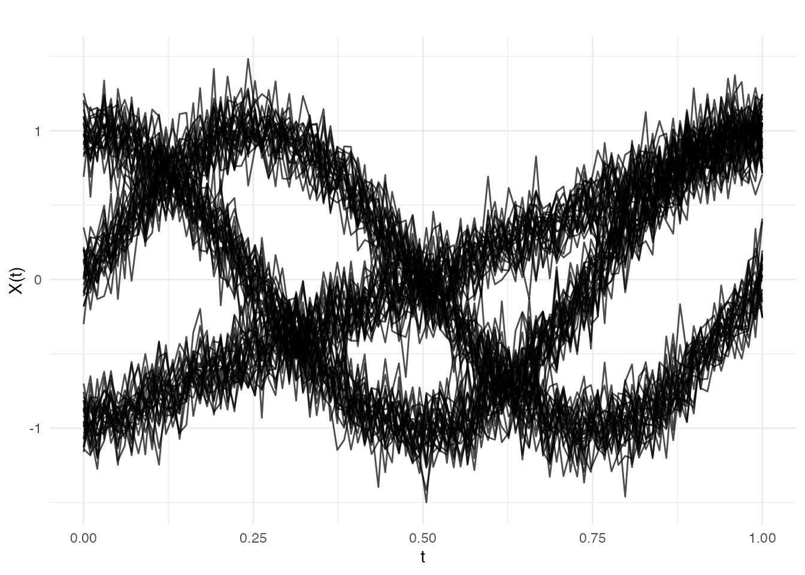
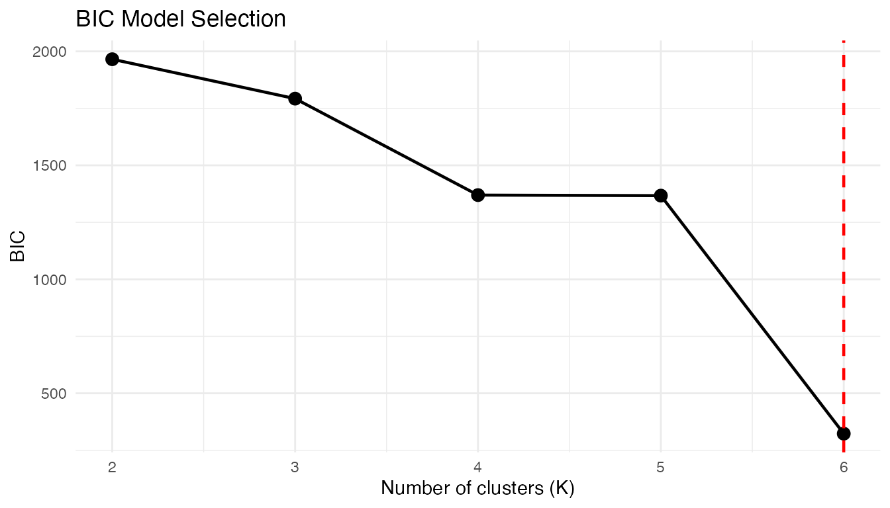

# Model-Based Clustering with Gaussian Mixtures

## Introduction

Gaussian Mixture Models (GMMs) provide model-based clustering with
several advantages over k-means:

- **Soft assignment**: Each curve gets a probability of belonging to
  each cluster, not just a hard label.
- **Automatic model selection**: BIC or ICL criteria select the number
  of clusters.
- **Flexible covariance**: Full, diagonal, or spherical covariance
  structures adapt to cluster shapes.

**fdars** implements GMM clustering through
[`cluster.gmm()`](https://sipemu.github.io/fdars-r/reference/cluster.gmm.md),
which projects functional data onto a B-spline basis before fitting the
mixture model.

``` r
library(fdars)
#> 
#> Attaching package: 'fdars'
#> The following objects are masked from 'package:stats':
#> 
#>     cov, decompose, deriv, median, sd, var
#> The following object is masked from 'package:base':
#> 
#>     norm
library(ggplot2)
theme_set(theme_minimal())
```

## Why Model-Based Clustering?

K-means is a natural starting point for clustering, but it makes strong
implicit assumptions:

1.  **Spherical clusters.** K-means minimizes within-cluster sum of
    squares, which treats all directions equally. It cannot adapt to
    elongated or correlated cluster shapes.
2.  **Equal-size clusters.** K-means assigns each point to its nearest
    centroid, effectively giving all clusters equal “pull” regardless of
    their size.
3.  **Hard assignment.** Each observation belongs to exactly one
    cluster, with no notion of uncertainty.

Gaussian mixture models relax all three assumptions by positing that the
data arise from a mixture of $K$ Gaussian distributions, each with its
own mean, covariance, and mixing weight. The EM algorithm provides:

- **Soft (probabilistic) assignment**: each observation gets a
  responsibility $\tau_{ik} \in \lbrack 0,1\rbrack$ for each cluster,
  quantifying classification uncertainty.
- **Adaptive cluster shapes**: full covariance matrices capture
  correlations between features within each cluster.
- **Principled model selection**: information criteria (BIC, ICL)
  balance fit against complexity, selecting both the number of clusters
  and the covariance structure.

## Mathematical Framework

### Gaussian Mixture Model

A $K$-component GMM models the density of the data
$\mathbf{z} \in {\mathbb{R}}^{d}$ as:

$$f(\mathbf{z}) = \sum\limits_{k = 1}^{K}\pi_{k}\,\mathcal{N}\left( \mathbf{z};\,{\mathbf{μ}}_{k},\,\mathbf{\Sigma}_{k} \right)$$

where:

- $\pi_{k} > 0$ are the **mixing weights** with
  $\sum_{k = 1}^{K}\pi_{k} = 1$
- ${\mathbf{μ}}_{k} \in {\mathbb{R}}^{d}$ is the mean of component $k$
- $\mathbf{\Sigma}_{k} \in {\mathbb{R}}^{d \times d}$ is the covariance
  of component $k$
- $\mathcal{N}(\mathbf{z};\,{\mathbf{μ}},\,\mathbf{\Sigma})$ is the
  multivariate Gaussian density

The **log-likelihood** for observations
$\mathbf{z}_{1},\ldots,\mathbf{z}_{n}$ is:

$$\ell(\theta) = \sum\limits_{i = 1}^{n}\log\left\lbrack \sum\limits_{k = 1}^{K}\pi_{k}\,\mathcal{N}\left( \mathbf{z}_{i};\,{\mathbf{μ}}_{k},\,\mathbf{\Sigma}_{k} \right) \right\rbrack$$

Direct maximization is difficult because of the log-of-sum structure.
The EM algorithm resolves this.

### EM Algorithm

The Expectation-Maximization algorithm alternates between two steps:

**E-step.** Compute the **responsibilities** (posterior cluster
probabilities):

$$\tau_{ik} = \frac{\pi_{k}\,\mathcal{N}\left( \mathbf{z}_{i};\,{\mathbf{μ}}_{k},\,\mathbf{\Sigma}_{k} \right)}{\sum\limits_{c = 1}^{K}\pi_{c}\,\mathcal{N}\left( \mathbf{z}_{i};\,{\mathbf{μ}}_{c},\,\mathbf{\Sigma}_{c} \right)}$$

Each $\tau_{ik}$ is the probability that observation $i$ was generated
by component $k$, given the current parameter estimates.

**M-step.** Update parameters using the responsibilities as soft
weights:

$$n_{k} = \sum\limits_{i = 1}^{n}\tau_{ik},\qquad\pi_{k} = \frac{n_{k}}{n}$$

$${\mathbf{μ}}_{k} = \frac{1}{n_{k}}\sum\limits_{i = 1}^{n}\tau_{ik}\,\mathbf{z}_{i}$$

$$\mathbf{\Sigma}_{k} = \frac{1}{n_{k}}\sum\limits_{i = 1}^{n}\tau_{ik}\,\left( \mathbf{z}_{i} - {\mathbf{μ}}_{k} \right)\left( \mathbf{z}_{i} - {\mathbf{μ}}_{k} \right)^{T}$$

The algorithm iterates until convergence:
$\left| \ell^{(t + 1)} - \ell^{(t)} \right| < \varepsilon$. Each
iteration is guaranteed to increase (or maintain) the log-likelihood,
ensuring convergence to a local maximum.

**Numerical stability.** Computing
$\mathcal{N}\left( \mathbf{z}_{i};\,{\mathbf{μ}}_{k},\,\mathbf{\Sigma}_{k} \right)$
involves exponentiating large negative values, which can underflow. The
implementation uses the **log-sum-exp trick**: work in log space and
subtract the maximum before exponentiating.

**Initialization.** EM is sensitive to starting values.
[`cluster.gmm()`](https://sipemu.github.io/fdars-r/reference/cluster.gmm.md)
uses **K-means++ initialization** to obtain well-separated initial
centroids, which substantially reduces the chance of converging to a
poor local maximum.

### Model Selection

#### BIC (Bayesian Information Criterion)

$$\text{BIC} = - 2\ell\left( \widehat{\theta} \right) + p\log n$$

where $p$ is the number of free parameters. For a full-covariance GMM
with $K$ components in $d$ dimensions:

$$p = K \cdot \left\lbrack \frac{d(d + 1)}{2} + d + 1 \right\rbrack - 1$$

accounting for $d(d + 1)/2$ covariance parameters, $d$ mean parameters,
and 1 mixing weight per component, minus 1 for the sum-to-one
constraint. Lower BIC is better.

#### ICL (Integrated Completed Likelihood)

$$\text{ICL} = \text{BIC} - 2\sum\limits_{i = 1}^{n}\sum\limits_{k = 1}^{K}\tau_{ik}\log\tau_{ik}$$

ICL adds an **entropy penalty** that penalizes overlap between clusters.
When responsibilities are crisp ($\tau_{ik} \approx 0$ or $1$), the
entropy term is small and ICL $\approx$ BIC. When clusters overlap
heavily, the entropy is large and ICL penalizes more strongly, favoring
fewer, better-separated clusters.

**When BIC and ICL disagree:** BIC tends to select more components (it
is a better density estimator), while ICL tends to select fewer (it
prioritizes well-separated clusters). If your goal is clustering, ICL is
often more appropriate; if your goal is density estimation, prefer BIC.

### Covariance Structures

- **Full**: $d(d + 1)/2$ free parameters per component. Captures all
  pairwise correlations. Flexible but data-hungry.
- **Diagonal**: $d$ parameters per component. Assumes features are
  independent within each cluster. Parsimonious, useful when the basis
  coefficients are approximately uncorrelated.

## From Curves to Features

[`cluster.gmm()`](https://sipemu.github.io/fdars-r/reference/cluster.gmm.md)
does not operate on raw discretized curves. Instead, it first projects
each curve onto a **B-spline basis**, producing a vector of basis
coefficients $\mathbf{z}_{i} \in {\mathbb{R}}^{d}$ where $d$ equals the
number of basis functions (`nbasis`). This step:

1.  **Reduces dimensionality** from $m$ grid points to $d$ basis
    coefficients (typically $d = 10\text{–}30$).
2.  **Imposes smoothness** because B-splines are smooth by construction.
3.  **Decorrelates** (partially), since B-spline coefficients are less
    redundant than adjacent grid-point values.

The choice of `nbasis` controls how much curve detail is retained. Too
few basis functions smooth away cluster-distinguishing features; too
many inflate the dimensionality and slow convergence.

## Simulated Data

``` r
set.seed(42)
n_per_cluster <- 25
m <- 100
t_grid <- seq(0, 1, length.out = m)

# Cluster 1: Sine curves
X1 <- matrix(0, n_per_cluster, m)
for (i in 1:n_per_cluster) {
  X1[i, ] <- sin(2 * pi * t_grid) + rnorm(m, sd = 0.15)
}

# Cluster 2: Cosine curves
X2 <- matrix(0, n_per_cluster, m)
for (i in 1:n_per_cluster) {
  X2[i, ] <- cos(2 * pi * t_grid) + rnorm(m, sd = 0.15)
}

# Cluster 3: Linear curves
X3 <- matrix(0, n_per_cluster, m)
for (i in 1:n_per_cluster) {
  X3[i, ] <- 2 * t_grid - 1 + rnorm(m, sd = 0.15)
}

X <- rbind(X1, X2, X3)
true_clusters <- rep(1:3, each = n_per_cluster)

fd <- fdata(X, argvals = t_grid)
plot(fd)
```



The three clusters have visually distinct shapes: sinusoidal,
cosinusoidal, and linear. The added noise ($\sigma = 0.15$) creates some
overlap but the clusters remain well separated — an ideal scenario for
GMM.

## Fitting a GMM

[`cluster.gmm()`](https://sipemu.github.io/fdars-r/reference/cluster.gmm.md)
searches over a range of k values and selects the best model using BIC
(default) or ICL.

``` r
gmm_fit <- cluster.gmm(fd, k.range = 2:6, seed = 123)
print(gmm_fit)
#> Gaussian Mixture Model Clustering
#> ==================================
#>   Number of clusters: 6 
#>   Number of observations: 75 
#>   Criterion: BIC 
#>   BIC: 322.95 
#>   ICL: 322.95 
#>   Converged: TRUE 
#>   Covariance type: full 
#>   Basis: bspline ( 10 functions )
#> 
#> Cluster sizes:
#> 
#>  1  2  3  4  5  6 
#> 16 14 21  9  9  6
```

The selected $k$ should match the true number of clusters (3). The BIC
values for $k < 3$ will be worse because they cannot capture the three
distinct shapes, and $k > 3$ will be penalized for unnecessary
parameters.

## Model Selection: BIC Curve

The BIC values across candidate k help visualize model selection:

``` r
plot(gmm_fit)
```



A clear minimum (or elbow) at $k = 3$ confirms the true structure. When
the BIC curve is flat, the data may not have well-defined clusters, or
multiple values of $k$ provide comparably good fits.

## Soft vs Hard Assignment

Unlike k-means, GMM provides membership probabilities:

``` r
# Show membership for first 6 curves
head(round(gmm_fit$membership, 3))
#>      [,1] [,2] [,3] [,4] [,5] [,6]
#> [1,]    1    0    0    0    0    0
#> [2,]    0    0    1    0    0    0
#> [3,]    0    0    0    1    0    0
#> [4,]    0    0    0    0    0    1
#> [5,]    0    0    1    0    0    0
#> [6,]    0    0    1    0    0    0

# Maximum membership gives hard assignment
cat("Hard clusters:", head(gmm_fit$cluster), "\n")
#> Hard clusters: 1 3 4 6 3 3
```

Membership probabilities near 1 indicate confident assignment; values
like $(0.6,0.3,0.1)$ indicate the curve sits between clusters.
High-entropy observations are natural candidates for further
investigation — they may be transitional curves, outliers, or evidence
that the model needs refinement.

## Comparison with K-Means

``` r
kmeans_fit <- cluster.kmeans(fd, ncl = 3, seed = 123)

cat("K-means WCSS:", round(kmeans_fit$tot.withinss, 2), "\n")
#> K-means WCSS: 1.63
cat("GMM BIC:", round(gmm_fit$bic, 2), "\n")
#> GMM BIC: 322.95
cat("GMM converged:", gmm_fit$converged, "\n")
#> GMM converged: TRUE
```

K-means and GMM often agree on well-separated clusters. The key
differences emerge when clusters have unequal sizes, non-spherical
shapes, or overlapping boundaries — situations where GMM’s flexibility
pays off.

## Covariance Types

[`cluster.gmm()`](https://sipemu.github.io/fdars-r/reference/cluster.gmm.md)
supports different covariance structures:

- `"full"` (default): Each cluster has its own full covariance matrix.
- `"diagonal"`: Diagonal covariance (features are independent within
  clusters).

``` r
gmm_diag <- cluster.gmm(fd, k.range = 3, cov.type = "diagonal", seed = 123)
cat("Full GMM BIC:", round(gmm_fit$bic, 2), "\n")
#> Full GMM BIC: 322.95
cat("Diagonal GMM BIC:", round(gmm_diag$bic, 2), "\n")
#> Diagonal GMM BIC: 1729.75
```

If the diagonal model achieves a comparable BIC, it suggests that the
B-spline coefficients are approximately uncorrelated within clusters — a
simpler model is adequate and will generalize better.

## Predicting New Observations

Assign new curves to clusters using the fitted model:

``` r
# Generate new curves
set.seed(99)
X_new <- matrix(0, 3, m)
X_new[1, ] <- sin(2 * pi * t_grid) + rnorm(m, sd = 0.1)   # Should be cluster 1
X_new[2, ] <- cos(2 * pi * t_grid) + rnorm(m, sd = 0.1)   # Should be cluster 2
X_new[3, ] <- 2 * t_grid - 1 + rnorm(m, sd = 0.1)          # Should be cluster 3

fd_new <- fdata(X_new, argvals = t_grid)
pred <- predict(gmm_fit, fd_new)

cat("Predicted clusters:", pred$cluster, "\n")
#> Predicted clusters: 2 2 2
cat("Membership probabilities:\n")
#> Membership probabilities:
print(round(pred$membership, 3))
#>      [,1] [,2] [,3] [,4] [,5] [,6]
#> [1,]    0    1    0    0    0    0
#> [2,]    0    1    0    0    0    0
#> [3,]    0    1    0    0    0    0
```

The membership probabilities for new curves should be highly
concentrated on the correct cluster, since the test curves were
generated with lower noise ($\sigma = 0.1$) than the training data.

## BIC vs ICL

ICL (Integrated Completed Likelihood) penalizes cluster overlap more
strongly than BIC:

``` r
gmm_icl <- cluster.gmm(fd, k.range = 2:6, criterion = "icl", seed = 123)
cat("BIC selected k:", gmm_fit$k, "\n")
#> BIC selected k: 6
cat("ICL selected k:", gmm_icl$k, "\n")
#> ICL selected k: 6
```

When BIC and ICL agree, the clustering structure is unambiguous. When
they disagree (ICL selects fewer clusters), it signals that some
BIC-selected components overlap substantially and might be better
interpreted as a single heterogeneous cluster.

## References

- McLachlan, G.J. and Peel, D. (2000). *Finite Mixture Models*. Wiley.
- Fraley, C. and Raftery, A.E. (2002). Model-based clustering,
  discriminant analysis, and density estimation. *Journal of the
  American Statistical Association*, 97(458), 611–631.
- Jacques, J. and Preda, C. (2014). Functional data clustering: a
  survey. *Advances in Data Analysis and Classification*, 8(3), 231–255.
- Biernacki, C., Celeux, G., and Govaert, G. (2000). Assessing a mixture
  model for clustering with the integrated completed likelihood. *IEEE
  Transactions on Pattern Analysis and Machine Intelligence*, 22(7),
  719–725.

## See Also

- [`vignette("articles/clustering")`](https://sipemu.github.io/fdars-r/articles/clustering.md)
  for k-means and fuzzy c-means
- [`vignette("articles/functional-classification")`](https://sipemu.github.io/fdars-r/articles/functional-classification.md)
  for supervised classification with
  [`fclassif()`](https://sipemu.github.io/fdars-r/reference/fclassif.md)
