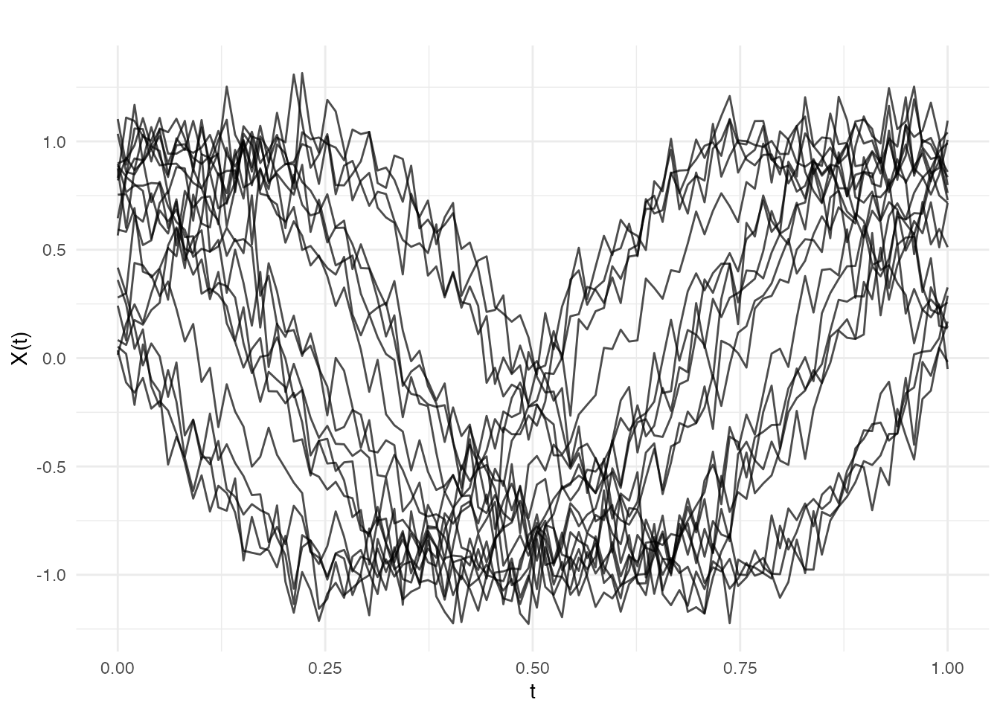
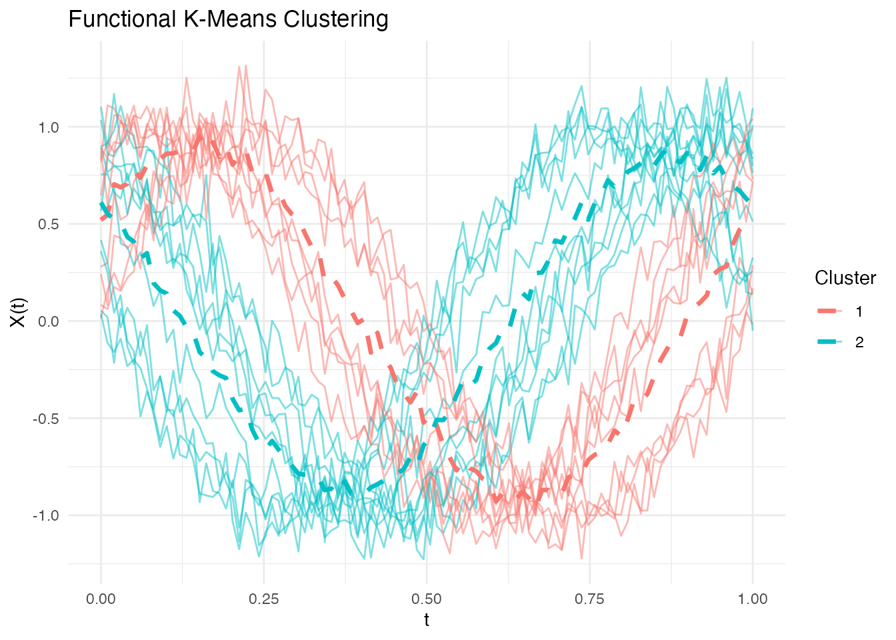
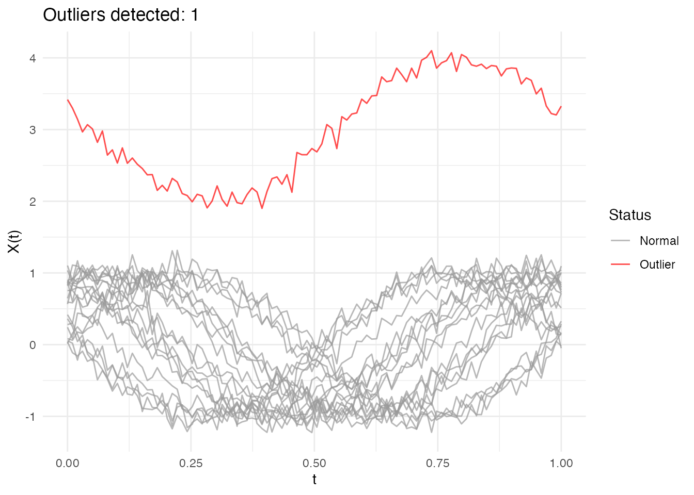

# Introduction to fdars

## What is Functional Data Analysis?

Functional Data Analysis (FDA) is a branch of statistics that deals with
data where each observation is a function, curve, or surface rather than
a single number or vector. Examples include: - Temperature curves
recorded over a day - Growth curves of children over time -
Spectrometric measurements across wavelengths - Stock prices throughout
trading hours

In FDA, we treat each curve as a single observation and develop methods
to analyze collections of such curves.

## The fdars Package

**fdars** (Functional Data Analysis in Rust) provides a comprehensive
toolkit for FDA with a high-performance Rust backend. Key features
include:

- **Fast computation**: 10-200x speedups over pure R implementations
- **Comprehensive methods**: Depth functions, regression, clustering,
  outlier detection
- **Flexible metrics**: Multiple distance measures including DTW
- **2D support**: Analysis of surfaces in addition to curves

## Installation

``` r
# Install from GitHub
remotes::install_github("sipemu/fdars")
```

## Getting Started

``` r
library(fdars)
#> 
#> Attaching package: 'fdars'
#> The following objects are masked from 'package:stats':
#> 
#>     cov, decompose, deriv, median, sd, var
#> The following object is masked from 'package:base':
#> 
#>     norm
library(ggplot2)
theme_set(theme_minimal())
```

### Creating Functional Data

The core data structure is the `fdata` class. Create functional data
from a matrix where rows are observations (curves) and columns are
evaluation points:

``` r
# Generate example data: 20 curves evaluated at 100 points
set.seed(42)
n <- 20
m <- 100
t_grid <- seq(0, 1, length.out = m)

# Create curves: sine waves with random phase and noise
X <- matrix(0, n, m)
for (i in 1:n) {
  phase <- runif(1, 0, pi)
  X[i, ] <- sin(2 * pi * t_grid + phase) + rnorm(m, sd = 0.1)
}

# Create fdata object
fd <- fdata(X, argvals = t_grid)
fd
#> Functional data object
#>   Type: 1D (curve) 
#>   Number of observations: 20 
#>   Number of points: 100 
#>   Range: 0 - 1
```

### Adding Identifiers and Metadata

You can attach identifiers and metadata (covariates) to functional data:

``` r
# Create metadata with covariates
meta <- data.frame(
  group = factor(rep(c("control", "treatment"), each = 10)),
  age = sample(20:60, n, replace = TRUE),
  response = rnorm(n)
)

# Create fdata with IDs and metadata
fd_meta <- fdata(X, argvals = t_grid,
                 id = paste0("patient_", 1:n),
                 metadata = meta)
fd_meta
#> Functional data object
#>   Type: 1D (curve) 
#>   Number of observations: 20 
#>   Number of points: 100 
#>   Range: 0 - 1 
#>   Metadata columns: group, age, response

# Access metadata
fd_meta$id[1:5]
#> [1] "patient_1" "patient_2" "patient_3" "patient_4" "patient_5"
head(fd_meta$metadata)
#>     group age   response
#> 1 control  54  0.3533851
#> 2 control  43 -0.2975149
#> 3 control  55  0.5553262
#> 4 control  56 -0.3193581
#> 5 control  28 -0.7752047
#> 6 control  38  0.4711363
```

Metadata is preserved when subsetting:

``` r
fd_sub <- fd_meta[1:5, ]
fd_sub$id
#> [1] "patient_1" "patient_2" "patient_3" "patient_4" "patient_5"
fd_sub$metadata
#>     group age   response
#> 1 control  54  0.3533851
#> 2 control  43 -0.2975149
#> 3 control  55  0.5553262
#> 4 control  56 -0.3193581
#> 5 control  28 -0.7752047
```

### Visualizing Functional Data

``` r
plot(fd)
```



### Basic Operations

``` r
# Compute mean function
mean_curve <- mean(fd)

# Center the data
fd_centered <- fdata.cen(fd)

# Compute functional variance
variance <- var(fd)
```

### Subsetting

Select specific curves or evaluation points:

``` r
# First 5 curves
fd_subset <- fd[1:5, ]

# Specific range of t values
fd_range <- fd[, t_grid >= 0.25 & t_grid <= 0.75]
```

## Key Functionality Overview

### Depth Functions

Depth measures how “central” a curve is within a sample. Higher depth
indicates a more typical curve:

``` r
# Fraiman-Muniz depth
depths <- depth(fd, method = "FM")
head(depths)
#> [1] 0.411 0.703 0.604 0.558 0.725 0.309

# Find the median curve (deepest)
median_curve <- median(fd, method = "FM")
```

### Distance Metrics

Compute distances between curves using various metrics:

``` r
# L2 (Euclidean) distance
dist_l2 <- metric.lp(fd)

# Dynamic Time Warping
dist_dtw <- metric.DTW(fd)
```

### Regression

Predict a scalar response from functional predictors:

``` r
# Generate response
y <- rowMeans(X) + rnorm(n, sd = 0.1)

# Principal component regression
fit_pc <- fregre.pc(fd, y, ncomp = 3)
print(fit_pc)
#> Functional regression model
#>   Number of observations: 20 
#>   R-squared: 0.1146712
```

### Clustering

Group curves into clusters:

``` r
# K-means clustering
km <- cluster.kmeans(fd, ncl = 2, seed = 123)
plot(km)
```



### Outlier Detection

Identify atypical curves:

``` r
# Add an outlier
X_out <- rbind(X, X[1, ] + 3)
fd_out <- fdata(X_out, argvals = t_grid)

# Detect outliers
out <- outliers.depth.pond(fd_out)
plot(out)
```



## Next Steps

Explore the other vignettes for detailed coverage of specific topics:

- **Covariance Functions**: Generate Gaussian process samples with
  various kernels
- **Depth Functions**: Comprehensive guide to functional depth measures
- **Distance Metrics**: Distance and semimetric functions
- **Regression**: Functional regression methods
- **Clustering**: Functional k-means and optimal k selection
- **Outlier Detection**: Methods for identifying atypical curves

## Performance

The Rust backend provides significant speedups for computationally
intensive operations. For example, computing depth for 1000 curves:

``` r
# Generate large dataset
X_large <- matrix(rnorm(1000 * 200), 1000, 200)
fd_large <- fdata(X_large)

# Depth computation is fast even for large datasets
system.time(depth(fd_large, method = "FM"))
#>    user  system elapsed
#>   0.045   0.000   0.045
```

## References

- Ramsay, J.O. and Silverman, B.W. (2005). *Functional Data Analysis*.
  Springer.
- Ferraty, F. and Vieu, P. (2006). *Nonparametric Functional Data
  Analysis*. Springer.
- Febrero-Bande, M. and Oviedo de la Fuente, M. (2012). Statistical
  Computing in Functional Data Analysis: The R Package fda.usc. *Journal
  of Statistical Software*, 51(4), 1-28.
