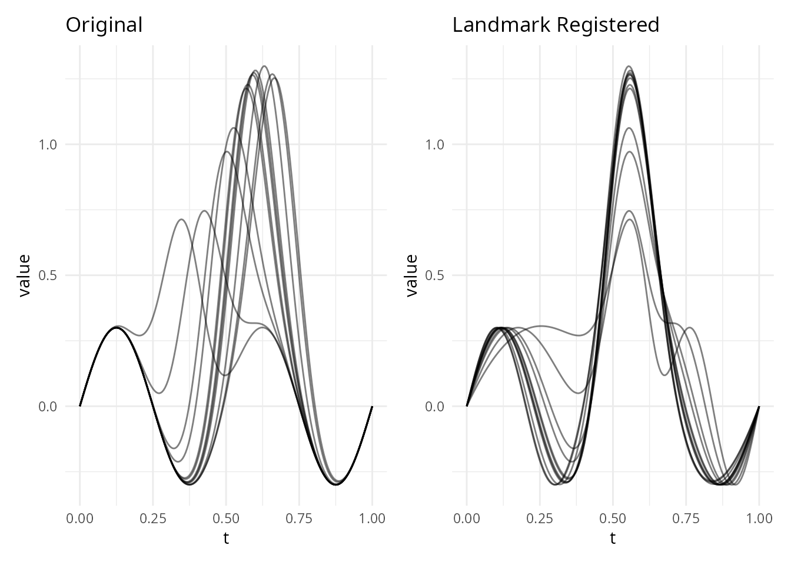
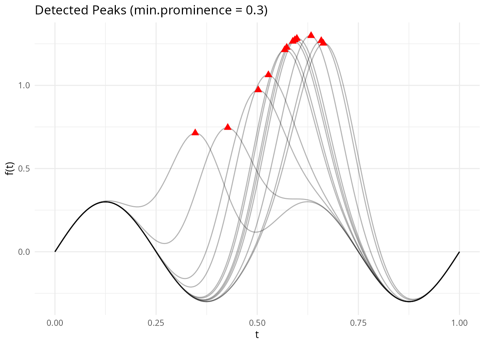
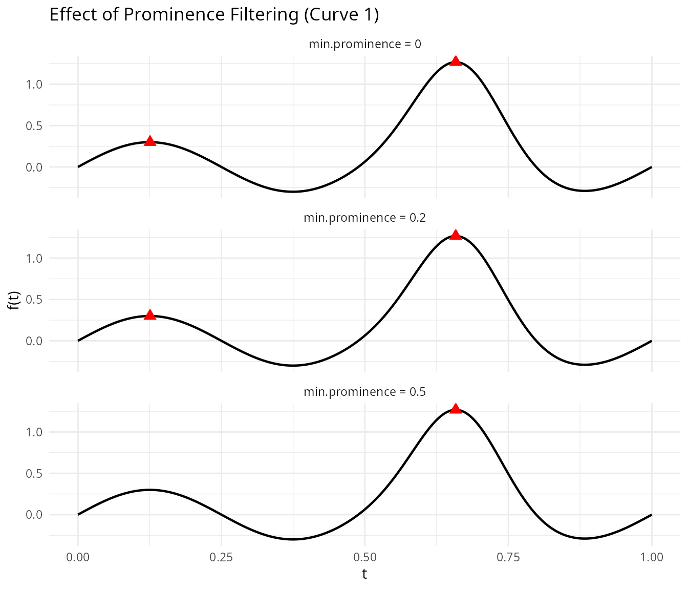
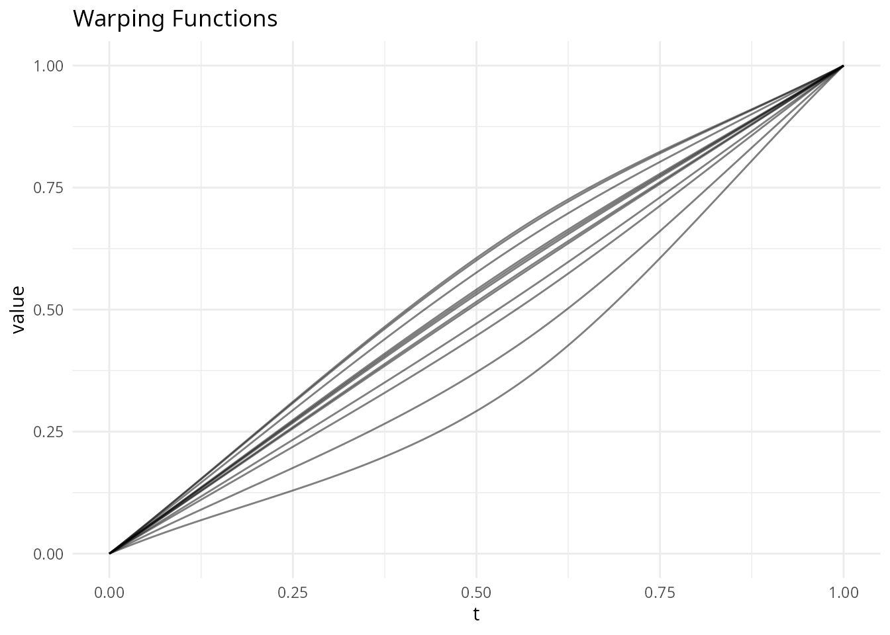
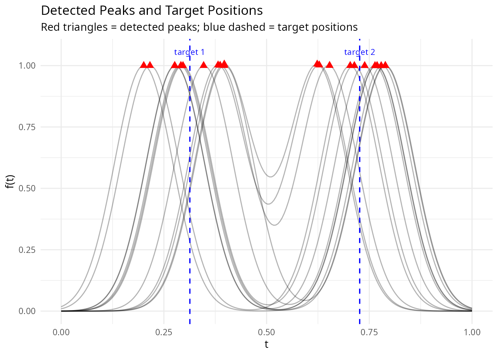
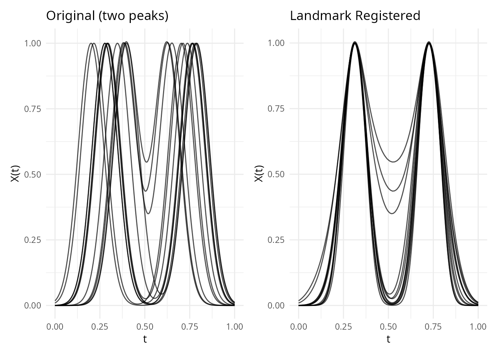
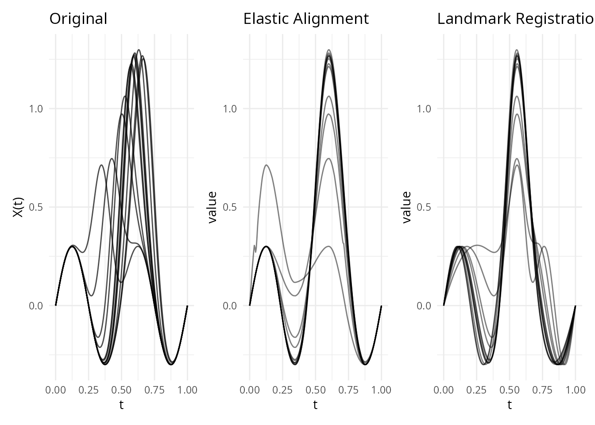
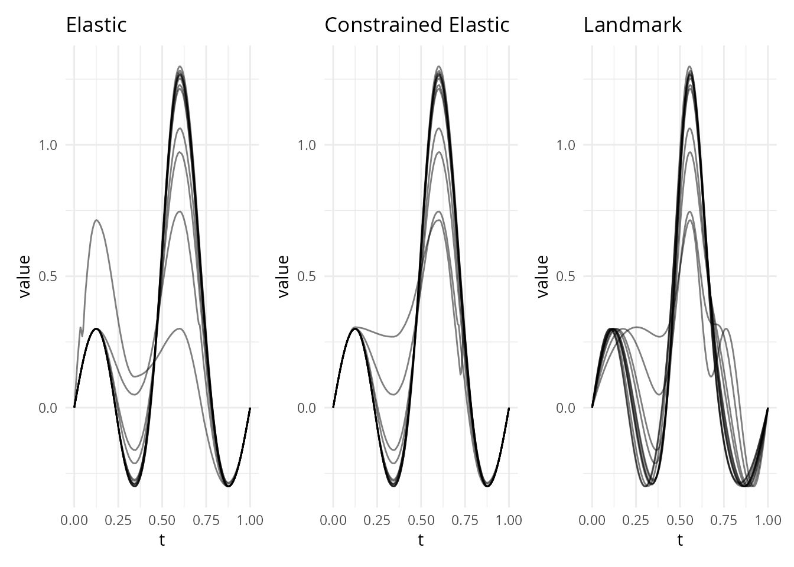

# Landmark Registration

## Introduction

**Landmark registration** aligns functional data by identifying salient
features – peaks, valleys, zero-crossings, or inflection points – and
warping curves so that corresponding features occur at the same time.
Unlike elastic alignment, which searches for the globally optimal
warping function via dynamic programming, landmark registration anchors
the warping at specific feature locations and interpolates between them.

This approach is particularly useful when:

- Curves have **identifiable, biologically or physically meaningful
  features** (e.g., the P, QRS, and T waves in an ECG, peak force in a
  gait cycle)
- Features are **sparse** and can be reliably detected
- You want alignment to respect **domain knowledge** about which
  features should coincide

``` r
library(fdars)
#> 
#> Attaching package: 'fdars'
#> The following objects are masked from 'package:stats':
#> 
#>     cov, decompose, deriv, median, sd, var
#> The following object is masked from 'package:base':
#> 
#>     norm
library(ggplot2)
library(patchwork)
theme_set(theme_minimal())
```

## How It Works (Intuition)

Landmark registration works like aligning sheet music by lining up the
bar lines. You identify specific **landmarks** – prominent peaks,
valleys, or zero-crossings – in each curve, then stretch or compress the
time axis so that corresponding landmarks occur at the same position.

The approach is simple:

1.  **Detect** features in each curve (e.g., the tallest peak)
2.  **Match** features across curves (the tallest peak in curve 1
    corresponds to the tallest peak in curve 2, etc.)
3.  **Compute target positions** by averaging where each feature occurs
    across all curves
4.  **Warp** each curve so its features move to the target positions,
    with straight-line interpolation between landmarks

This is fast and interpretable – you know exactly which features are
being aligned and why. The trade-off is that the warping is
piecewise-linear (with corners at landmark positions) rather than
smooth, and you need features that can be reliably detected.

## Mathematical Framework

### The Registration Problem

Given a sample of curves $`f_1, \ldots, f_n`$ observed on a common
domain $`[a, b]`$, registration seeks warping functions
$`\gamma_i : [a, b] \to [a, b]`$ such that the registered curves
$`\tilde{f}_i(t) = f_i(\gamma_i(t))`$ have their salient features
aligned.

In the landmark approach, we identify $`k`$ corresponding feature times
$`\tau_{i,1}, \ldots, \tau_{i,k}`$ in each curve $`f_i`$, and common
target times $`\tau_1^*, \ldots, \tau_k^*`$. The warping function
$`\gamma_i`$ must satisfy:

``` math
\gamma_i(\tau_j^*) = \tau_{i,j}, \quad j = 1, \ldots, k
```

with boundary conditions $`\gamma_i(a) = a`$ and $`\gamma_i(b) = b`$.

### Piecewise-Linear Warping

The simplest solution is piecewise-linear interpolation between the
$`k+2`$ anchor points (boundaries plus landmarks). Let $`\tau_0^* = a`$,
$`\tau_{k+1}^* = b`$, and similarly $`\tau_{i,0} = a`$,
$`\tau_{i,k+1} = b`$. For $`t \in [\tau_j^*, \tau_{j+1}^*]`$:

``` math
\gamma_i(t) = \tau_{i,j} + \frac{\tau_{i,j+1} - \tau_{i,j}}{\tau_{j+1}^* - \tau_j^*} (t - \tau_j^*)
```

This warping is monotone (orientation-preserving) as long as the
landmarks are in the same order in every curve. The derivative
$`\dot\gamma_i`$ is piecewise constant, with value
$`(\tau_{i,j+1} - \tau_{i,j}) / (\tau_{j+1}^* - \tau_j^*)`$ on each
segment.

### Target Landmark Selection

The common target times $`\tau_j^*`$ are chosen as the average of the
detected landmark positions across curves:

``` math
\tau_j^* = \frac{1}{n} \sum_{i=1}^n \tau_{i,j}
```

This minimizes the total squared warping (in the piecewise-linear sense)
and ensures the target positions are representative of the sample.

### Prominence and Feature Detection

A **peak** at time $`t_0`$ in a curve $`f`$ is a local maximum:
$`f(t_0) \geq f(t)`$ for all $`t`$ in a neighborhood of $`t_0`$. Its
**prominence** is defined as:

``` math
\text{prom}(t_0) = f(t_0) - \max\left( \min_{t \in [t_L, t_0]} f(t),\; \min_{t \in [t_0, t_R]} f(t) \right)
```

where $`t_L`$ and $`t_R`$ are the nearest higher peaks to the left and
right (or the domain boundaries). Prominence measures how much a peak
stands out from its surroundings – a peak nestled on the flank of a
larger peak has low prominence, while an isolated peak has high
prominence.

Valleys are detected analogously (as peaks of $`-f`$). Zero-crossings
are points where $`f`$ changes sign, and inflection points are where
$`f''`$ changes sign.

## Quick Start

``` r
set.seed(42)
argvals <- seq(0, 1, length.out = 200)

# Simulate curves with a shifted peak
n <- 12
data <- matrix(0, n, 200)
peak_locs <- runif(n, 0.3, 0.7)
for (i in 1:n) {
  data[i, ] <- exp(-100 * (argvals - peak_locs[i])^2) +
               0.3 * sin(4 * pi * argvals)
}
fd <- fdata(data, argvals = argvals)

# Register using detected peaks
lr <- landmark.register(fd, kind = "peak", min.prominence = 0.5,
                        expected.count = 1)
print(lr)
#> Landmark Registration
#>   Curves: 12 x 200 grid points
#>   Target landmarks: 1 
#>   Target positions: 0.557
```

``` r
plot(lr, type = "both")
```



The registered curves now have their dominant peak aligned to a common
position.

## Detecting Landmarks

Before registration, you can inspect which landmarks are detected in
each curve. The
[`detect.landmarks()`](https://sipemu.github.io/fdars-r/reference/detect.landmarks.md)
function finds features of a given type and returns their position,
value, and prominence.

``` r
lms <- detect.landmarks(fd, kind = "peak", min.prominence = 0.3)

# Show landmarks for first 3 curves
for (i in 1:3) {
  cat("Curve", i, ":\n")
  print(lms[[i]])
  cat("\n")
}
#> Curve 1 :
#>    position kind    value prominence
#> 1 0.6582915 peak 1.268322   1.557776
#> 
#> Curve 2 :
#>    position kind    value prominence
#> 1 0.6633166 peak 1.252722   1.538256
#> 
#> Curve 3 :
#>    position kind     value prominence
#> 1 0.4271357 peak 0.7461648  0.7461648
```

Visualizing detected landmarks overlaid on the curves makes it easier to
verify that detection is working correctly:

``` r
# Build data frame of all curves
n_curves <- nrow(fd$data)
m_pts <- length(fd$argvals)
df_curves <- data.frame(
  curve = rep(seq_len(n_curves), each = m_pts),
  t = rep(fd$argvals, n_curves),
  value = as.vector(t(fd$data))
)

# Build data frame of detected landmarks
df_lms <- do.call(rbind, lapply(seq_along(lms), function(i) {
  if (nrow(lms[[i]]) > 0) {
    data.frame(curve = i, t = lms[[i]]$position, value = lms[[i]]$value)
  }
}))

ggplot() +
  geom_line(data = df_curves, aes(x = t, y = value, group = curve),
            alpha = 0.3) +
  geom_point(data = df_lms, aes(x = t, y = value),
             color = "red", size = 2.5, shape = 17) +
  labs(title = "Detected Peaks (min.prominence = 0.3)",
       x = "t", y = "f(t)") +
  theme_minimal()
```



### Landmark Types

Four types of landmarks can be detected:

| Kind           | Description                                |
|----------------|--------------------------------------------|
| `"peak"`       | Local maxima                               |
| `"valley"`     | Local minima                               |
| `"zero"`       | Zero-crossings (sign changes)              |
| `"inflection"` | Inflection points (curvature sign changes) |

``` r
# Detect valleys and zero-crossings
valleys <- detect.landmarks(fd, kind = "valley", min.prominence = 0.1)
zeros <- detect.landmarks(fd, kind = "zero")

cat("Curve 1 peaks:\n")
#> Curve 1 peaks:
print(lms[[1]])
#>    position kind    value prominence
#> 1 0.6582915 peak 1.268322   1.557776
cat("\nCurve 1 valleys:\n")
#> 
#> Curve 1 valleys:
print(valleys[[1]])
#>    position   kind      value prominence
#> 1 0.3768844 valley -0.2996805  0.5996712
#> 2 0.8844221 valley -0.2894549  0.2894691
cat("\nCurve 1 zero-crossings:\n")
#> 
#> Curve 1 zero-crossings:
print(zeros[[1]])
#>    position          kind value prominence
#> 1 0.2499997 zero_crossing     0          0
#> 2 0.4885279 zero_crossing     0          0
#> 3 0.7986067 zero_crossing     0          0
#> 4 0.9999962 zero_crossing     0          0
```

### Prominence Filtering

The `min.prominence` parameter filters out minor features. A peak’s
**prominence** measures how much it stands out from its surroundings –
the minimum vertical drop required to reach a higher peak. Setting a
higher threshold keeps only the most salient features:

``` r
# All peaks (no filtering)
lms_all <- detect.landmarks(fd, kind = "peak", min.prominence = 0)
cat("Curve 1 - all peaks:", nrow(lms_all[[1]]), "\n")
#> Curve 1 - all peaks: 2

# Only prominent peaks
lms_prominent <- detect.landmarks(fd, kind = "peak", min.prominence = 0.5)
cat("Curve 1 - prominent peaks:", nrow(lms_prominent[[1]]), "\n")
#> Curve 1 - prominent peaks: 1
```

The effect of prominence filtering is clearest when plotted. Low
prominence thresholds keep minor bumps; higher thresholds retain only
the dominant feature:

``` r
# Show curve 1 with three prominence levels
curve1_df <- data.frame(t = fd$argvals, value = fd$data[1, ])

make_lm_df <- function(lm_list, label) {
  li <- lm_list[[1]]
  if (nrow(li) > 0) data.frame(t = li$position, value = li$value, level = label)
  else data.frame(t = numeric(0), value = numeric(0), level = character(0))
}

lms_0 <- detect.landmarks(fd, kind = "peak", min.prominence = 0)
lms_02 <- detect.landmarks(fd, kind = "peak", min.prominence = 0.2)
lms_05 <- detect.landmarks(fd, kind = "peak", min.prominence = 0.5)

df_pts <- rbind(
  make_lm_df(lms_0, "min.prominence = 0"),
  make_lm_df(lms_02, "min.prominence = 0.2"),
  make_lm_df(lms_05, "min.prominence = 0.5")
)
df_pts$level <- factor(df_pts$level,
  levels = c("min.prominence = 0", "min.prominence = 0.2", "min.prominence = 0.5"))

ggplot(curve1_df, aes(x = t, y = value)) +
  geom_line(linewidth = 0.8) +
  geom_point(data = df_pts, aes(x = t, y = value),
             color = "red", size = 3, shape = 17) +
  facet_wrap(~level, ncol = 1) +
  labs(title = "Effect of Prominence Filtering (Curve 1)",
       x = "t", y = "f(t)")
```



## Registration

The
[`landmark.register()`](https://sipemu.github.io/fdars-r/reference/landmark.register.md)
function detects landmarks in every curve, computes common target
positions (by averaging detected landmark positions), and warps each
curve so that its landmarks map to the targets.

``` r
lr <- landmark.register(fd, kind = "peak", min.prominence = 0.5,
                        expected.count = 1)
```

The result is an S3 object of class `"landmark.register"` containing:

- `registered` – an `fdata` of warped curves
- `gammas` – an `fdata` of warping functions
- `landmarks` – detected landmarks for each curve
- `target_landmarks` – the common target positions

``` r
plot(lr, type = "warps")
```



The warping functions are piecewise-linear, with knots at the landmark
positions. Between landmarks, the warping is a simple linear
interpolation.

### Expected Count

When `expected.count > 0`, the function selects the most prominent
landmarks up to that count. This is useful when different curves have
different numbers of detected features but you know the true number of
corresponding features:

``` r
# Data with two peaks per curve
data2 <- matrix(0, n, 200)
for (i in 1:n) {
  pk1 <- runif(1, 0.2, 0.4)
  pk2 <- runif(1, 0.6, 0.8)
  data2[i, ] <- exp(-100 * (argvals - pk1)^2) +
                exp(-100 * (argvals - pk2)^2)
}
fd2 <- fdata(data2, argvals = argvals)

lr2 <- landmark.register(fd2, kind = "peak", min.prominence = 0.3,
                         expected.count = 2)
cat("Target landmarks:", round(lr2$target_landmarks, 3), "\n")
#> Target landmarks: 0.313 0.727
```

``` r
# Show detected landmarks on the two-peak data
lms2 <- detect.landmarks(fd2, kind = "peak", min.prominence = 0.3)
df_curves2 <- data.frame(
  curve = rep(seq_len(n), each = 200),
  t = rep(argvals, n),
  value = as.vector(t(fd2$data))
)
df_lms2 <- do.call(rbind, lapply(seq_along(lms2), function(i) {
  if (nrow(lms2[[i]]) > 0) {
    data.frame(curve = i, t = lms2[[i]]$position, value = lms2[[i]]$value)
  }
}))
target_df <- data.frame(t = lr2$target_landmarks)

ggplot() +
  geom_line(data = df_curves2, aes(x = t, y = value, group = curve), alpha = 0.3) +
  geom_point(data = df_lms2, aes(x = t, y = value),
             color = "red", size = 2.5, shape = 17) +
  geom_vline(data = target_df, aes(xintercept = t),
             linetype = "dashed", color = "blue", linewidth = 0.6) +
  annotate("text", x = lr2$target_landmarks, y = max(fd2$data) * 1.05,
           label = paste("target", seq_along(lr2$target_landmarks)),
           color = "blue", size = 3) +
  labs(title = "Detected Peaks and Target Positions",
       subtitle = "Red triangles = detected peaks; blue dashed = target positions",
       x = "t", y = "f(t)")
```



``` r
p1 <- plot(fd2) + labs(title = "Original (two peaks)")
p2 <- plot(lr2$registered) + labs(title = "Landmark Registered")
p1 + p2
```



## Comparison with Elastic Alignment

Landmark and elastic alignment solve the same problem – removing phase
variability – but with different strategies. Landmark registration is
fast and guarantees feature correspondence, while elastic alignment
produces smooth, globally optimal warps without requiring feature
detection.

``` r
# Same data, two approaches
ea <- elastic.align(fd)

p1 <- plot(fd) + labs(title = "Original")
p2 <- plot(ea, type = "aligned") + labs(title = "Elastic Alignment")
p3 <- plot(lr, type = "registered") + labs(title = "Landmark Registration")
p1 + p2 + p3
```



You can also combine both approaches via
[`elastic.align.constrained()`](https://sipemu.github.io/fdars-r/reference/elastic.align.constrained.md),
which runs elastic alignment through landmark anchor points – smooth
warps with guaranteed feature correspondence:

``` r
ec <- elastic.align.constrained(fd, kind = "peak", min.prominence = 0.5,
                                 expected.count = 1)
p_ea <- plot(ea, type = "aligned") + labs(title = "Elastic")
p_ec <- plot(ec, type = "aligned") + labs(title = "Constrained Elastic")
p_lr <- plot(lr, type = "registered") + labs(title = "Landmark")
p_ea + p_ec + p_lr
```



For a detailed side-by-side comparison of all alignment methods
(elastic, landmark, constrained, TSRVF) with variance reduction metrics
and a decision guide, see
`vignette("alignment-comparison", package = "fdars")`.

## See Also

- `vignette("elastic-alignment", package = "fdars")` – elastic alignment
  framework
- [`elastic.align.constrained()`](https://sipemu.github.io/fdars-r/reference/elastic.align.constrained.md)
  – constrained elastic alignment
- [`alignment.quality()`](https://sipemu.github.io/fdars-r/reference/alignment.quality.md)
  – diagnostics for alignment results
