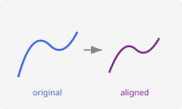

# Learn

## Learn

Get started, preprocess, and simulate functional data.

Introduction to fdars

Custom Plotting with ggplot2

Introduction to Smoothing Functional Data

Working with Derivatives

Simulating Functional Data

Working with Irregular Functional Data

## Represent

Decompose, transform, rank, and measure functional data.

Functional Principal Component Analysis (FPCA)

Elastic FPCA

Finding the Best Basis Representation

Andrews Transformation: From Tables to Curves

Functional Depth Functions

Streaming Depth Computation

Distance Metrics and Semimetrics

## Align

Register and align curves to remove phase variability.

Elastic Curve Alignment

Landmark Registration

TSRVF: Linearized Elastic Analysis

Comparing Alignment Methods

Shape Analysis

## Regression

Regression, classification, and mixed models for functional data.

Scalar-on-Function Regression

Elastic Regression

Scalar-on-Shape Regression

Robust Functional Regression

Function-on-Scalar Regression

Supervised Classification of Functional Data

Functional Mixed Models for Repeated Measures

Cross-Validation for Functional Data

Model Explainability

Regression Diagnostics

Uncertainty Quantification

Conformal Prediction for Classification

Conformal Prediction Guide

## Process Monitoring

Statistical process control for functional data streams.

Statistical Process Monitoring for Functional Data

Advanced Statistical Process Monitoring

Profile and Partial-Domain Monitoring

## Analyze

Infer, cluster, detect outliers, and test functional data.

Functional Tolerance Bands

Functional Equivalence Testing

Functional Clustering

Model-Based Clustering with Gaussian Mixtures

Elastic Clustering

Outlier Detection

Seasonal Analysis of Functional Data

Covariance Functions and Gaussian Process Generation

Elastic Changepoint Detection
