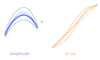
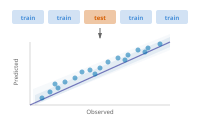
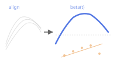
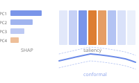

# Learn

## Learn

Get started, preprocess, and simulate functional data.

Introduction to fdars

Custom Plotting

Introduction to Smoothing

Working with Derivatives

Simulation Toolbox

Irregular Sampling

## Represent

Decompose, transform, rank, and measure functional data.

Functional PCA

Basis Representation

Andrews Curves

Depth Functions

Streaming Depth

Distance Metrics

Elastic FPCA

## Align

Register and align curves to remove phase variability.

Elastic Alignment

Landmark Registration

TSRVF (Tangent Space)

Comparing Methods

## Regression

Regression, classification, and mixed models for functional data.

Scalar-on-Function Regression

Function-on-Scalar Regression

Classification

Mixed Models

Cross-Validation

Elastic Regression

Model Explainability

Regression Diagnostics

Uncertainty Quantification

Conformal Classification

Conformal Prediction Guide

## Analyze

Infer, cluster, detect outliers, and test functional data.

Tolerance Bands

Equivalence Testing

Clustering

GMM Clustering

Outlier Detection

Seasonal Analysis

Covariance Functions

Elastic Changepoint
