# Outlier Detection

## Introduction

Outlier detection in functional data identifies curves that are atypical
or anomalous compared to the rest of the sample. **fdars** provides
several methods based on functional depth and likelihood ratio tests.

``` r
library(fdars)
#> 
#> Attaching package: 'fdars'
#> The following objects are masked from 'package:stats':
#> 
#>     cov, decompose, deriv, median, sd, var
#> The following object is masked from 'package:base':
#> 
#>     norm
library(ggplot2)
theme_set(theme_minimal())

# Generate normal data with low noise for clear signal
set.seed(42)
n <- 30
m <- 100
t_grid <- seq(0, 1, length.out = m)

X <- matrix(0, n, m)
for (i in 1:n) {
  X[i, ] <- sin(2 * pi * t_grid) + rnorm(m, sd = 0.1)
}

# Add three distinct types of outliers
X[1, ] <- sin(2 * pi * t_grid) + 3           # MAGNITUDE outlier (shifted up)
X[2, ] <- -sin(2 * pi * t_grid)              # SHAPE outlier (inverted pattern)
X[3, ] <- 3 * sin(2 * pi * t_grid)           # AMPLITUDE outlier (larger scale)

fd <- fdata(X, argvals = t_grid)

# Visualize with outliers highlighted
df_curves <- data.frame(
  t = rep(t_grid, n),
  value = as.vector(t(X)),
  curve = rep(1:n, each = m),
  type = rep(c("Magnitude", "Shape", "Amplitude", rep("Normal", n - 3)), each = m)
)
df_curves$type <- factor(df_curves$type, levels = c("Normal", "Magnitude", "Shape", "Amplitude"))

ggplot(df_curves, aes(x = t, y = value, group = curve, color = type)) +
  geom_line(alpha = 0.7) +
  scale_color_manual(values = c("Normal" = "gray50", "Magnitude" = "red",
                                 "Shape" = "blue", "Amplitude" = "green3")) +
  labs(title = "Functional Data with Three Types of Outliers",
       x = "t", y = "X(t)", color = "Type") +
  theme(legend.position = "bottom")
```

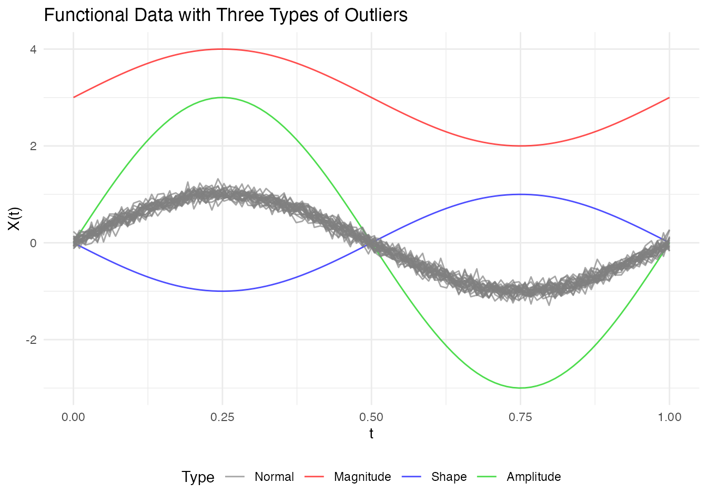

## Depth-Based Methods

Depth-based outlier detection identifies curves with unusually low depth
(far from the center of the data).

### Weighted Depth Method (outliers.depth.pond)

Uses bootstrap resampling to estimate the distribution of depths and
identifies curves with depth below a data-driven cutoff. The function
supports three different methods for computing the threshold.

#### Threshold Methods

| Method       | Formula                  | When to Use                                       |
|--------------|--------------------------|---------------------------------------------------|
| `"quantile"` | `quantile(depths, quan)` | When you expect a specific proportion of outliers |
| `"mad"`      | `median - k × MAD`       | More robust when outliers may already exist       |
| `"iqr"`      | `Q1 - k × IQR`           | Boxplot-style detection                           |

**Default: 95th percentile threshold** (`quan = 0.05`), which flags
curves in the bottom 5% of depths as outliers.

``` r
# Default: quantile method with quan = 0.05 (95th percentile, flags bottom 5%)
out_pond <- outliers.depth.pond(fd, nb = 1000)
print(out_pond)
#> Functional data outlier detection
#>   Number of observations: 30 
#>   Number of outliers: 3 
#>   Outlier indices: 1 2 3
#>   Threshold method: quantile 
#>   Depth cutoff: 0.0591
```

#### Comparing Threshold Methods

``` r
# Quantile method: flags curves with depth in the bottom 5% (default)
out_quantile <- outliers.depth.pond(fd, nb = 1000,
                                     threshold_method = "quantile", quan = 0.05)
cat("Quantile (5%): ", out_quantile$outliers, "\n")
#> Quantile (5%):  1 2 3

# More permissive: bottom 10%
out_quantile10 <- outliers.depth.pond(fd, nb = 1000,
                                       threshold_method = "quantile", quan = 0.1)
cat("Quantile (10%):", out_quantile10$outliers, "\n")
#> Quantile (10%): 1 2 3

# MAD method: more robust, uses median - 2.5*MAD
out_mad <- outliers.depth.pond(fd, nb = 1000,
                                threshold_method = "mad", k = 2.5)
cat("MAD (k=2.5):   ", out_mad$outliers, "\n")
#> MAD (k=2.5):    1 2 3

# IQR method: boxplot-like, uses Q1 - 1.5*IQR
out_iqr <- outliers.depth.pond(fd, nb = 1000,
                                threshold_method = "iqr", k = 1.5)
cat("IQR (k=1.5):   ", out_iqr$outliers, "\n")
#> IQR (k=1.5):    1 2 3
```

**Choosing the right method:**

- **Quantile** (default): Uses a fixed proportion cutoff. The default
  `quan = 0.05` (95th percentile) flags the bottom 5% of curves.
  Increase to `quan = 0.1` for more permissive detection.

- **MAD**: More robust to existing outliers in the data. The default
  `k = 2.5` corresponds roughly to a 1-2% false positive rate. Increase
  `k` for stricter detection (fewer outliers).

- **IQR**: Similar to boxplot fences. The default `k = 1.5` is the
  standard boxplot rule. Use `k = 3.0` for “far outliers” only.

### Visualizing Outliers

``` r
plot(out_pond)
```


### Examining Results

``` r
# Which curves are outliers?
out_pond$outliers
#> [1] 1 2 3

# Depth values for all curves
head(out_pond$depths)
#> [1] 0.03333337 0.05506193 0.05477837 0.87274161 0.86959674 0.86759472

# Cutoff used
cat("Cutoff:", out_pond$cutoff, "\n")
#> Cutoff: 0.05905061
cat("Threshold method:", out_pond$threshold_method, "\n")
#> Threshold method: quantile
```

### Understanding depth.pond Results

The `outliers.depth.pond` method uses bootstrap resampling to estimate
what depth values are “normal” for your dataset.

**Key behaviors:**

1.  **Edge curves**: Curves near the boundary of the data cloud
    naturally have lower depth, even if they’re not true outliers
2.  **Bootstrap variability**: Small samples give unstable cutoffs - use
    at least `nb = 200` for stable results
3.  **Threshold choice matters**: The `quantile` method with a fixed
    proportion will always flag that proportion as outliers. Use `mad`
    or `iqr` for data-driven thresholds that adapt to the actual depth
    distribution.

**Recommendation**: Start with `threshold_method = "mad"` for a robust,
data-driven approach. Adjust `k` based on how conservative you want the
detection to be.

Compare with `outliers.depth.trim` which uses a fixed trim proportion -
more predictable but requires you to choose the proportion.

### Trimming-Based Method (outliers.depth.trim)

Iteratively removes curves with lowest depth:

``` r
out_trim <- outliers.depth.trim(fd, trim = 0.1, seed = 123)
print(out_trim)
#> Functional data outlier detection
#>   Number of observations: 30 
#>   Number of outliers: 3 
#>   Outlier indices: 1 2 3
#>   Depth cutoff: 0.7817
plot(out_trim)
```

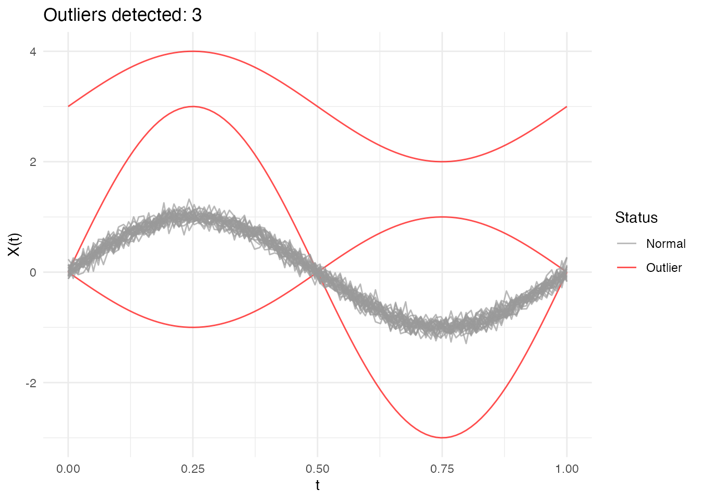

### Using Different Depth Functions

Both methods accept a `depth` parameter to specify the depth function:

``` r
# Using Random Projection depth
out_rp <- outliers.depth.pond(fd, nb = 1000, seed = 123)

# Using modal depth (default is FM)
out_mode <- outliers.depth.trim(fd, trim = 0.1, seed = 123)
```

## Likelihood Ratio Test (LRT) Method

The LRT method uses a likelihood ratio test to sequentially identify
outliers. It’s particularly effective for detecting magnitude outliers.

### Automatic Threshold Computation

The LRT method automatically computes a bootstrap threshold based on a
percentile of the maximum distance distribution under the null
hypothesis (no outliers). By default, the 99th percentile is used,
meaning approximately 1% of observations would be flagged as outliers
when there are no true outliers.

``` r
# The outliers.lrt function automatically computes the threshold
out_lrt <- outliers.lrt(fd, nb = 1000, seed = 123)
print(out_lrt)
#> Functional data outlier detection
#>   Number of observations: 30 
#>   Number of outliers: 0 
#>   LRT threshold: 32.913  (99th percentile)
plot(out_lrt)
```

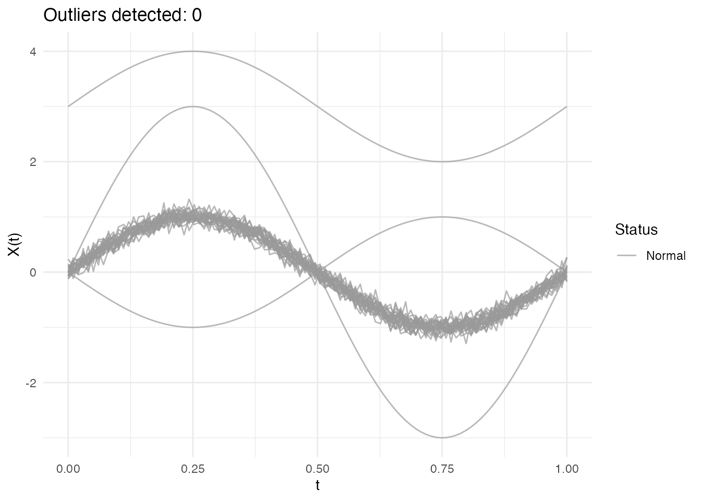

### Configuring the Percentile

The `percentile` parameter controls the sensitivity of the LRT method:

- **Higher percentile** (e.g., 0.99): More conservative, fewer false
  positives
- **Lower percentile** (e.g., 0.95): More sensitive, may catch more
  subtle outliers

``` r
# Default: 99th percentile (conservative)
out_lrt_99 <- outliers.lrt(fd, nb = 1000, seed = 123, percentile = 0.99)
cat("99th percentile outliers:", out_lrt_99$outliers, "\n")
#> 99th percentile outliers:

# More sensitive: 95th percentile
out_lrt_95 <- outliers.lrt(fd, nb = 1000, seed = 123, percentile = 0.95)
cat("95th percentile outliers:", out_lrt_95$outliers, "\n")
#> 95th percentile outliers:
```

### Manual Threshold Computation

You can also compute the threshold separately if you want to examine it
or apply a custom threshold:

``` r
# Compute threshold separately (99th percentile by default)
threshold_99 <- outliers.thres.lrt(fd, nb = 1000, seed = 123)
cat("LRT threshold (99th percentile):", threshold_99, "\n")
#> LRT threshold (99th percentile): 32.91297

# Or with a different percentile
threshold_95 <- outliers.thres.lrt(fd, nb = 1000, seed = 123, percentile = 0.95)
cat("LRT threshold (95th percentile):", threshold_95, "\n")
#> LRT threshold (95th percentile): 32.36814
```

### LRT Results

``` r
# Outlier indices
out_lrt$outliers
#> integer(0)

# Distance from center for each curve
head(out_lrt$distances)
#> [1] 31.2933479 14.5221905 14.5627739  0.8885643  0.9423256  1.0432319

# Threshold used
out_lrt$threshold
#> [1] 32.91297
```

### When LRT Works Best

The LRT method is specifically optimized for **magnitude outliers** -
curves that are shifted up or down relative to the main data cloud. It
computes how far each curve is from the center (mean) of the data.

**What LRT detects well:** - Curves shifted up or down (magnitude
outliers) - Curves with unusual overall level

**What LRT may miss:** - Shape outliers (different pattern but similar
overall level) - Amplitude outliers (scaled versions centered at the
same level)

**Using the threshold
([`outliers.thres.lrt()`](https://sipemu.github.io/fdars-r/reference/outliers.thres.lrt.md)):**

The threshold represents the critical value of the LRT statistic. Use it
to:

- Apply a custom significance level
- Compare test statistics across different datasets
- Combine with domain knowledge for decision-making

If LRT detects no outliers when you expect some: 1. The outliers may be
shape-based rather than magnitude-based 2. Try depth-based methods
(`outliers.depth.pond` or `outliers.depth.trim`) instead 3. Use the
outliergram or MS-plot for visual detection

## Comparing Methods

Different methods may detect different types of outliers:

``` r
# Run all methods
out1 <- outliers.depth.pond(fd, nb = 1000, seed = 123)
out2 <- outliers.depth.trim(fd, trim = 0.1, seed = 123)
out3 <- outliers.lrt(fd, nb = 1000, seed = 123)

# Compare detected outliers
cat("Depth-pond outliers:", out1$outliers, "\n")
#> Depth-pond outliers: 1 2 3
cat("Depth-trim outliers:", out2$outliers, "\n")
#> Depth-trim outliers: 1 2 3
cat("LRT outliers:", out3$outliers, "\n")
#> LRT outliers:

# True outliers are curves 1, 2, 3
cat("True outliers: 1, 2, 3\n")
#> True outliers: 1, 2, 3
```

## Types of Outliers

### Magnitude Outliers

Curves shifted up or down from the main group:

``` r
# Create clean data with just a magnitude outlier
X_mag <- matrix(0, n, m)
for (i in 1:n) {
  X_mag[i, ] <- sin(2 * pi * t_grid) + rnorm(m, sd = 0.1)
}
X_mag[1, ] <- sin(2 * pi * t_grid) + 3  # Large vertical shift

fd_mag <- fdata(X_mag, argvals = t_grid)

# Visualize the magnitude outlier
plot(fd_mag) +
  labs(title = "Magnitude Outlier: Curve 1 Shifted Up",
       subtitle = "Same shape as others, but at a different level")
```

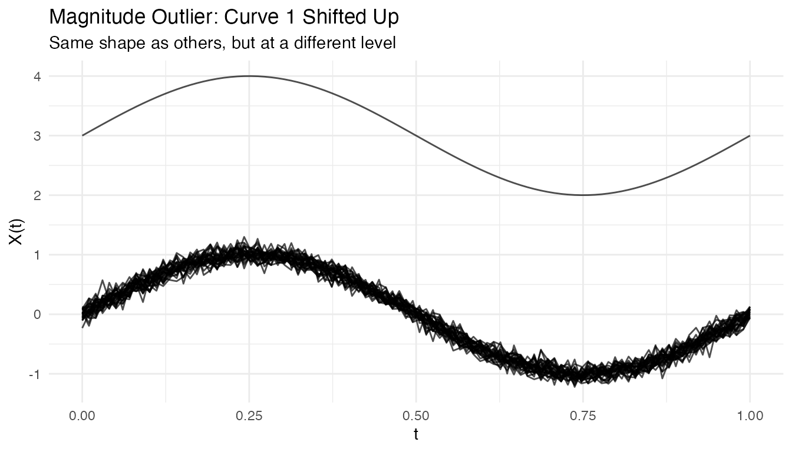

``` r
out_mag <- outliers.depth.pond(fd_mag, nb = 1000, seed = 123)
cat("Detected magnitude outlier:", out_mag$outliers, "\n")
#> Detected magnitude outlier: 1
```

### Shape Outliers

Curves with different patterns but similar overall level:

``` r
# Create clean data with just a shape outlier
X_shape <- matrix(0, n, m)
for (i in 1:n) {
  X_shape[i, ] <- sin(2 * pi * t_grid) + rnorm(m, sd = 0.1)
}
X_shape[1, ] <- -sin(2 * pi * t_grid)  # Inverted (phase-shifted by pi)

fd_shape <- fdata(X_shape, argvals = t_grid)

# Visualize the shape outlier
plot(fd_shape) +
  labs(title = "Shape Outlier: Curve 1 Has Inverted Pattern",
       subtitle = "Same amplitude and level, but opposite phase")
```

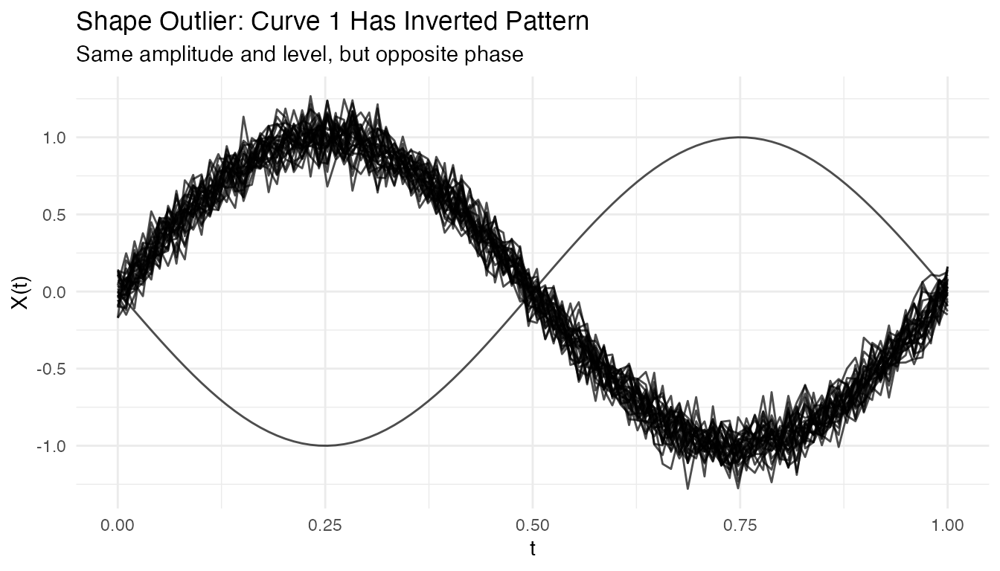

``` r
out_shape <- outliers.depth.pond(fd_shape, nb = 1000, seed = 123)
cat("Detected shape outlier:", out_shape$outliers, "\n")
#> Detected shape outlier: 1
```

### Amplitude Outliers

Curves with unusual amplitude (larger or smaller scale):

``` r
# Create clean data with just an amplitude outlier
X_amp <- matrix(0, n, m)
for (i in 1:n) {
  X_amp[i, ] <- sin(2 * pi * t_grid) + rnorm(m, sd = 0.1)
}
X_amp[1, ] <- 3 * sin(2 * pi * t_grid)  # 3x larger amplitude

fd_amp <- fdata(X_amp, argvals = t_grid)

# Visualize the amplitude outlier
plot(fd_amp) +
  labs(title = "Amplitude Outlier: Curve 1 Has 3x Larger Scale",
       subtitle = "Same shape and center, but much larger oscillations")
```

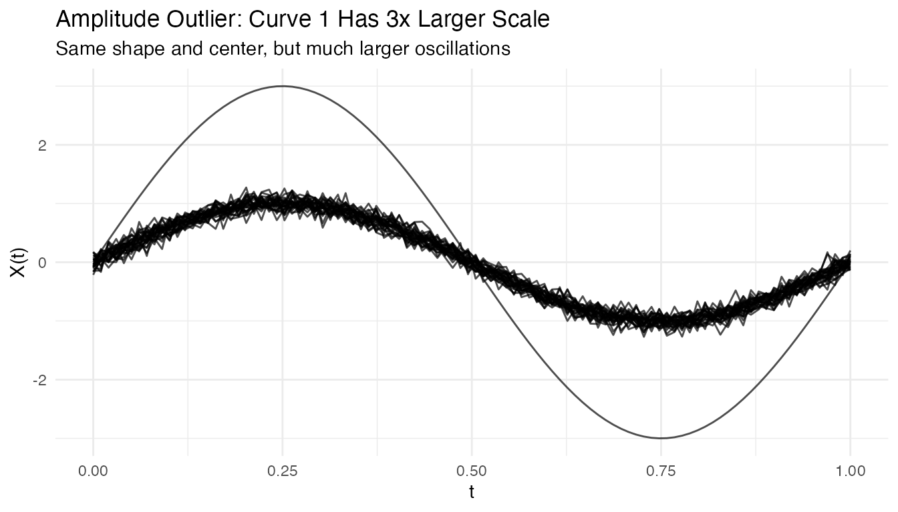

``` r
out_amp <- outliers.depth.pond(fd_amp, nb = 1000, seed = 123)
cat("Detected amplitude outlier:", out_amp$outliers, "\n")
#> Detected amplitude outlier: 1
```

## Tuning Parameters

### Number of Bootstrap Samples

More bootstrap samples give more stable results but take longer:

``` r
# Compare with different nb values
out_nb50 <- outliers.depth.pond(fd, nb = 50, seed = 123)
out_nb200 <- outliers.depth.pond(fd, nb = 200, seed = 123)

cat("nb=50 outliers:", out_nb50$outliers, "\n")
#> nb=50 outliers: 1 2 3
cat("nb=200 outliers:", out_nb200$outliers, "\n")
#> nb=200 outliers: 1 2 3
```

### Trim Proportion

For `outliers.depth.trim`, the trim proportion controls sensitivity:

``` r
# More aggressive trimming
out_trim05 <- outliers.depth.trim(fd, trim = 0.05, seed = 123)
out_trim20 <- outliers.depth.trim(fd, trim = 0.2, seed = 123)

cat("trim=0.05 outliers:", out_trim05$outliers, "\n")
#> trim=0.05 outliers: 1 3
cat("trim=0.20 outliers:", out_trim20$outliers, "\n")
#> trim=0.20 outliers: 1 2 3 10 29 30
```

## Handling High Contamination

When outlier contamination is high, use robust methods:

``` r
# Create data with 20% outliers
X_contam <- X
n_outliers <- 6
for (i in 1:n_outliers) {
  X_contam[i, ] <- sin(2 * pi * t_grid) + rnorm(1, 0, 2)
}

fd_contam <- fdata(X_contam, argvals = t_grid)

# Depth-trim with higher trim proportion
out_contam <- outliers.depth.trim(fd_contam, trim = 0.2, seed = 123)
cat("Detected outliers:", out_contam$outliers, "\n")
#> Detected outliers: 1 2 3 4 5 6
cat("True outliers: 1-6\n")
#> True outliers: 1-6
```

## Visualizing Depth Distribution

``` r
# Compute depths
depths <- depth.FM(fd)

# Create histogram
library(ggplot2)
df_depths <- data.frame(
  curve = 1:n,
  depth = depths,
  type = ifelse(1:n %in% c(1, 2, 3), "Outlier", "Normal")
)

ggplot(df_depths, aes(x = depth, fill = type)) +
  geom_histogram(bins = 10, alpha = 0.7, position = "identity") +
  labs(title = "Distribution of Functional Depths",
       x = "Depth", y = "Count", fill = "") +
  theme_minimal()
```

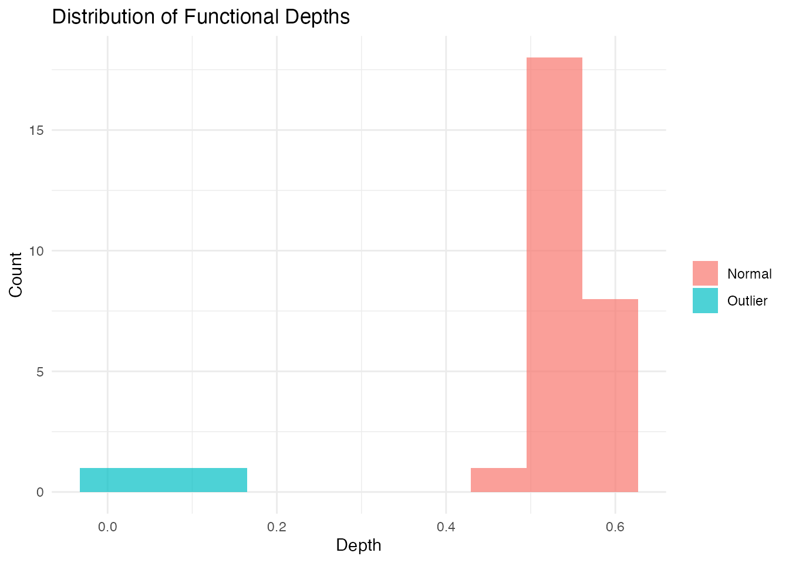

## Performance

The LRT method uses a parallel Rust backend for speed:

``` r
# Benchmark with larger dataset
X_large <- matrix(rnorm(200 * 100), 200, 100)
fd_large <- fdata(X_large)

system.time(outliers.lrt(fd_large, nb = 200, seed = 123))
#>    user  system elapsed
#>   0.456   0.000   0.123
```

## Outliergram and MS-Plot

For visual outlier detection, **fdars** provides two powerful diagnostic
plots.

### The Outliergram

The outliergram plots the **Modified Epigraph Index (MEI)** against
**Modified Band Depth (MBD)**:

``` r
og <- outliergram(fd)
plot(og)
```

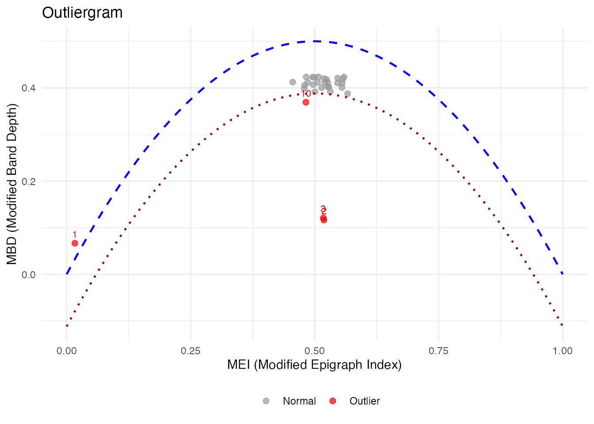

**How to read the outliergram:**

| Position     | MEI (X-axis) | MBD (Y-axis) | Interpretation                                     |
|--------------|--------------|--------------|----------------------------------------------------|
| Bottom-left  | Low          | Low          | **Extreme outlier** (unusual shape AND position)   |
| Bottom-right | High         | Low          | **Magnitude outlier** (shifted up/down)            |
| Top-left     | Low          | High         | **Shape outlier** (unusual pattern, typical level) |
| Top-right    | High         | High         | **Normal curve** (typical shape and position)      |

The parabolic boundary marks the theoretical limit for non-outlying
curves. Points below this boundary are flagged as outliers.

### The Magnitude-Shape Plot (MS-Plot)

The MS-plot separates magnitude outlyingness from shape outlyingness:

``` r
ms <- magnitudeshape(fd)
plot(ms)
```

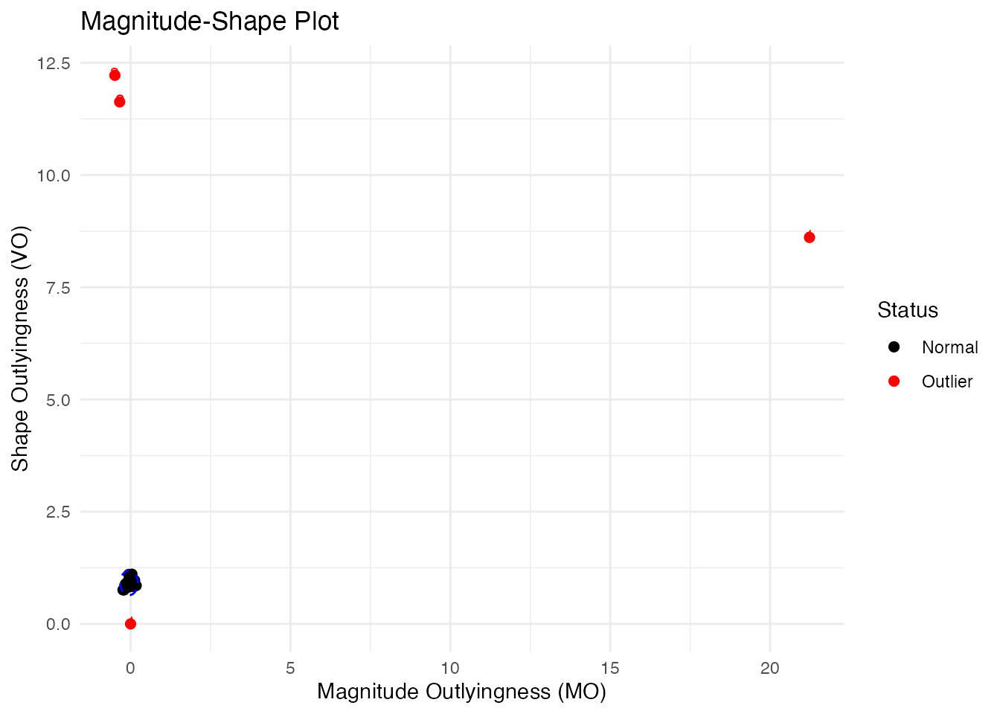

**How to read the MS-plot:**

| Quadrant     | Magnitude Outlyingness | Shape Outlyingness | Type                              |
|--------------|------------------------|--------------------|-----------------------------------|
| Bottom-left  | Low                    | Low                | **Normal curve**                  |
| Bottom-right | High                   | Low                | **Magnitude outlier** only        |
| Top-left     | Low                    | High               | **Shape outlier** only            |
| Top-right    | High                   | High               | **Combined outlier** (both types) |

The MS-plot is particularly useful when you want to understand *why* a
curve is an outlier - is it because of its level (magnitude) or its
pattern (shape)?

### Labeling Outliers by ID or Metadata

When fdata has IDs or metadata, you can label outliers in plots:

``` r
# Create fdata with IDs and metadata
meta <- data.frame(
  subject = paste0("S", sprintf("%02d", 1:n)),
  group = rep(c("A", "B"), length.out = n)
)
fd_labeled <- fdata(X, argvals = t_grid,
                    id = paste0("patient_", 1:n),
                    metadata = meta)

# Outliergram with patient IDs
og_labeled <- outliergram(fd_labeled)
plot(og_labeled, label = "id")
```

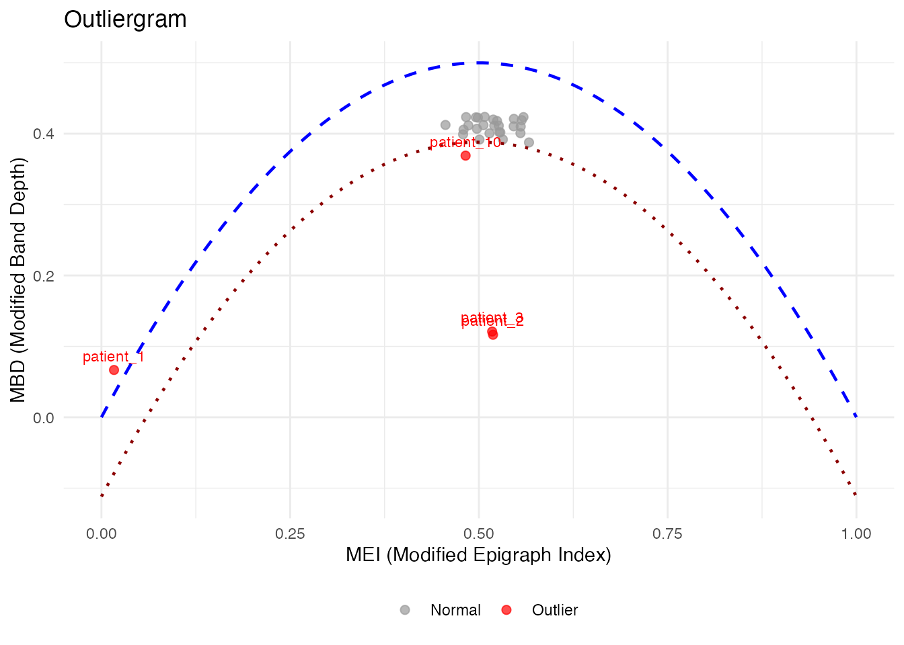

``` r

# Or with metadata column
plot(og_labeled, label = "subject")
```


``` r

# Label ALL points, not just outliers
plot(og_labeled, label = "id", label_all = TRUE)
```

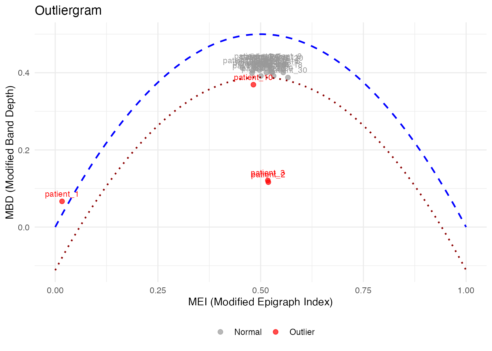

``` r
# magnitudeshape with custom labels
magnitudeshape(fd_labeled, label = "subject")
```

## Method Selection Guide

| Method         | Best For                 | Sensitivity  |
|----------------|--------------------------|--------------|
| depth.pond     | General purpose          | Moderate     |
| depth.trim     | Known contamination rate | Controllable |
| LRT            | Magnitude outliers       | High         |
| outliergram    | Shape outliers           | Visual       |
| magnitudeshape | Both magnitude & shape   | Visual       |

## Best Practices

1.  **Start with visualization**: Plot the data to understand outlier
    types
2.  **Try multiple methods**: Different methods catch different outliers
3.  **Use sufficient bootstrap samples**: At least 100 for stable
    results
4.  **Consider domain knowledge**: Some “outliers” may be valid
    observations
5.  **Validate findings**: Check detected outliers make sense
    contextually

## References

- Febrero, M., Galeano, P., and González-Manteiga, W. (2008). Outlier
  detection in functional data by depth measures, with application to
  identify abnormal NOx levels. *Environmetrics*, 19(4), 331-345.
- Hyndman, R.J. and Shang, H.L. (2010). Rainbow plots, bagplots, and
  boxplots for functional data. *Journal of Computational and Graphical
  Statistics*, 19(1), 29-45.
