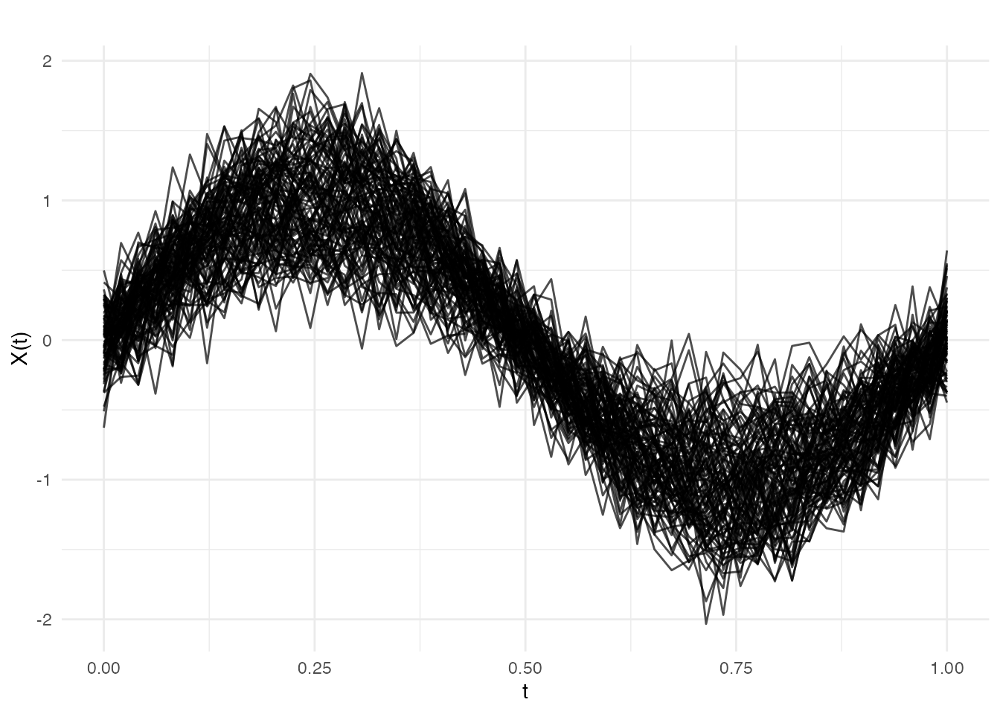
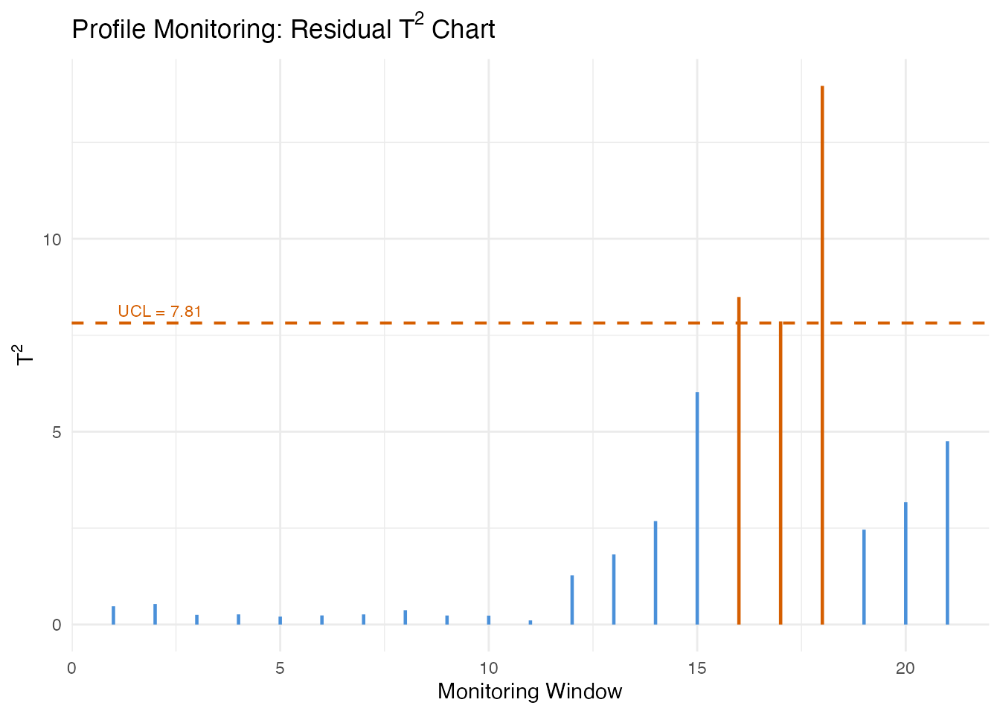
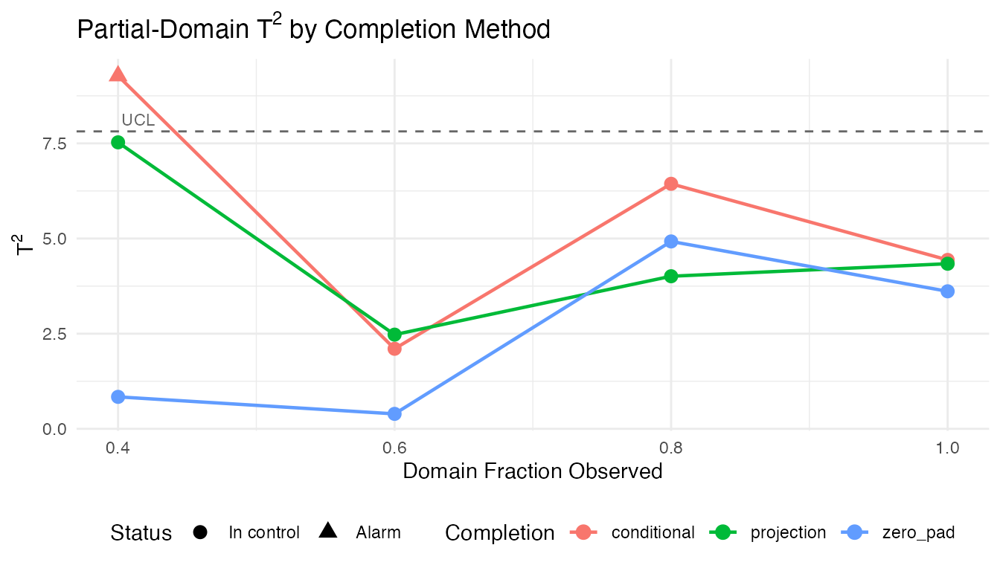
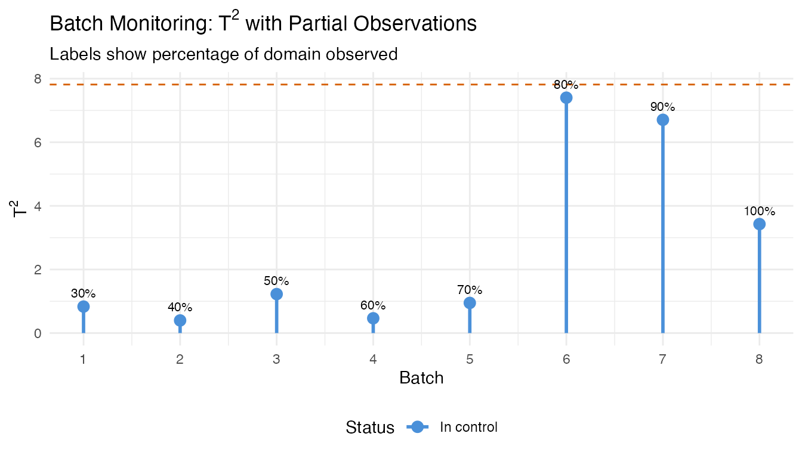
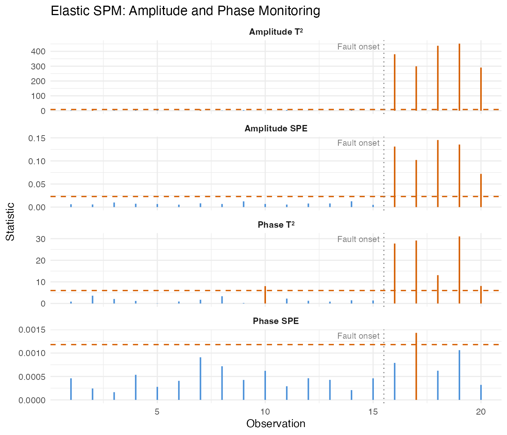

# Profile and Partial-Domain Monitoring

## Introduction

Standard functional SPM (see
[`vignette("articles/statistical-process-monitoring")`](https://sipemu.github.io/fdars-r/articles/statistical-process-monitoring.md))
monitors curves assuming they are fully observed and independent of
external covariates. Two common situations break these assumptions:

1.  **Profile monitoring** — The functional response depends on known
    scalar covariates (e.g., catalyst concentration affects a reactor
    temperature profile). Ignoring covariates inflates false alarm rates
    because covariate-driven variation is mistaken for process shifts.

2.  **Partial-domain monitoring** — Curves arrive incrementally: at time
    $t$ during a batch, only the portion $\lbrack 0,t\rbrack$ has been
    observed. Waiting for the full curve delays detection; monitoring
    the partial curve requires completing the unobserved tail.

This article demonstrates both capabilities, plus elastic SPM for
processes where phase (timing) variation is present.

## Simulating Process Data

We simulate a chemical reactor scenario. Each batch produces a
temperature profile over a normalised time domain $\lbrack 0,1\rbrack$.
A scalar covariate — catalyst concentration — modulates the profile
shape. Phase II data includes 10 out-of-control batches at the end.

``` r
set.seed(42)
n_train <- 100
n_test <- 40
m <- 50
argvals <- seq(0, 1, length.out = m)

# Covariate: catalyst concentration
catalyst_train <- runif(n_train, 0.5, 1.5)
catalyst_test <- runif(n_test, 0.5, 1.5)

# Response curves with covariate effect
Y_train <- matrix(0, n_train, m)
for (i in 1:n_train) {
  Y_train[i, ] <- catalyst_train[i] * sin(2 * pi * argvals) +
                  rnorm(m, sd = 0.2)
}
fd_train <- fdata(Y_train, argvals = argvals)
predictors_train <- matrix(catalyst_train, ncol = 1)

# Phase II: last 10 curves have a shifted covariate-response relationship
Y_test <- matrix(0, n_test, m)
for (i in 1:n_test) {
  shift <- if (i > 30) 1.2 * cos(4 * pi * argvals) else 0
  Y_test[i, ] <- catalyst_test[i] * sin(2 * pi * argvals) +
                 shift + rnorm(m, sd = 0.2)
}
fd_test <- fdata(Y_test, argvals = argvals)
predictors_test <- matrix(catalyst_test, ncol = 1)
```

``` r
plot(fd_train, main = "Phase I: Reactor Temperature Profiles",
     xlab = "Normalised Time", ylab = "Temperature")
```



## Profile Monitoring

Profile monitoring uses function-on-scalar regression (FOSR) to model
how the covariate influences the curve. Sliding-window FOSR estimates
capture time-varying regression coefficients. FPCA on these coefficient
trajectories gives a reduced representation; $T^{2}$ statistics on the
FPC scores detect shifts in the covariate-response relationship.

### Phase I

``` r
profile_chart <- spm.profile.phase1(
  fd_train, predictors_train,
  ncomp = 3, window.size = 20, alpha = 0.05
)
print(profile_chart)
#> SPM Profile Monitoring Chart (Phase I)
#>   Components: 3 
#>   Alpha: 0.05 
#>   T2 UCL: 7.815 
#>   Observations: 100 
#>   Predictors: 1 
#>   Lag-1 autocorrelation: 0.9125 
#>   Effective windows: 29
```

### Phase II

``` r
profile_mon <- spm.profile.monitor(profile_chart, fd_test, predictors_test)

alarm_idx <- which(profile_mon$t2.alarm)
cat("Alarms at windows:", alarm_idx, "\n")
#> Alarms at windows: 16 17 18
```

``` r
# Residual T-squared control chart
n_mon <- length(profile_mon$t2)
df_profile <- data.frame(
  window = seq_len(n_mon),
  t2 = profile_mon$t2,
  alarm = profile_mon$t2.alarm
)

ggplot(df_profile, aes(x = window, y = t2)) +
  geom_segment(aes(xend = window, y = 0, yend = t2, color = alarm),
               linewidth = 0.8) +
  geom_hline(yintercept = profile_mon$t2.ucl,
             linetype = "dashed", color = "#D55E00", linewidth = 0.7) +
  annotate("text", x = 1, y = profile_mon$t2.ucl,
           label = paste("UCL =", round(profile_mon$t2.ucl, 2)),
           hjust = -0.05, vjust = -0.5, size = 3, color = "#D55E00") +
  scale_color_manual(values = c("FALSE" = "#4A90D9", "TRUE" = "#D55E00"),
                     guide = "none") +
  labs(title = expression("Profile Monitoring: Residual T"^2 * " Chart"),
       x = "Monitoring Window", y = expression("T"^2)) +
  theme(plot.title = element_text(face = "bold"))
```



## Partial-Domain Monitoring

During a running batch, only a prefix of the temperature curve has been
observed.
[`spm.monitor.partial()`](https://sipemu.github.io/fdars-r/reference/spm.monitor.partial.md)
completes the unobserved tail before computing monitoring statistics.

Three completion methods are available:

| Method          | Description                                             |
|-----------------|---------------------------------------------------------|
| `"conditional"` | Conditional expectation (BLUP) given observed portion   |
| `"projection"`  | Project partial curve onto the FPCA basis directly      |
| `"zero_pad"`    | Pad unobserved portion with zeros (fast, less accurate) |

We first build a standard Phase I chart (no covariates), then monitor a
single curve at several observation fractions.

``` r
# Phase I chart (standard, no covariates)
chart_ic <- spm.phase1(fd_train, ncomp = 3, alpha = 0.05, seed = 42)

# A test curve observed at increasing fractions
test_curve <- Y_test[35, ]  # an out-of-control curve
fractions <- c(0.4, 0.6, 0.8, 1.0)
n_obs_vals <- as.integer(fractions * m)
```

``` r
methods <- c("conditional", "projection", "zero_pad")
partial_results <- list()

for (method in methods) {
  for (k in seq_along(fractions)) {
    result <- spm.monitor.partial(
      chart_ic, test_curve,
      n.observed = n_obs_vals[k],
      completion = method
    )
    partial_results[[length(partial_results) + 1]] <- data.frame(
      method = method,
      fraction = fractions[k],
      t2 = result$t2,
      alarm = result$t2.alarm
    )
  }
}
df_partial <- do.call(rbind, partial_results)
```

``` r
ggplot(df_partial, aes(x = fraction, y = t2, color = method)) +
  geom_line(linewidth = 0.8) +
  geom_point(aes(shape = alarm), size = 3) +
  geom_hline(yintercept = chart_ic$t2.ucl,
             linetype = "dashed", color = "grey40") +
  annotate("text", x = 0.4, y = chart_ic$t2.ucl,
           label = "UCL", hjust = -0.1, vjust = -0.5,
           size = 3, color = "grey40") +
  scale_shape_manual(values = c("FALSE" = 16, "TRUE" = 17),
                     labels = c("In control", "Alarm")) +
  labs(title = expression("Partial-Domain T"^2 * " by Completion Method"),
       x = "Domain Fraction Observed",
       y = expression("T"^2),
       color = "Completion", shape = "Status") +
  theme(legend.position = "bottom")
```



The conditional method generally produces the most reliable statistics
at low observation fractions because it leverages the full covariance
structure learned in Phase I.

## Batch Processing

When multiple partially-observed curves are available (e.g., several
batches at different stages of completion),
[`spm.monitor.partial.batch()`](https://sipemu.github.io/fdars-r/reference/spm.monitor.partial.batch.md)
processes them in a single call.

``` r
# Simulate 8 batches at varying completion stages
set.seed(123)
n_batch <- 8
obs_fractions <- seq(0.3, 1.0, length.out = n_batch)
n_obs_batch <- as.integer(obs_fractions * m)

batch_curves <- vector("list", n_batch)
for (i in 1:n_batch) {
  # Last 3 batches are out-of-control
  shift <- if (i > 5) 1.5 * cos(4 * pi * argvals) else 0
  batch_curves[[i]] <- sin(2 * pi * argvals) + shift + rnorm(m, sd = 0.2)
}
```

``` r
batch_results <- spm.monitor.partial.batch(
  chart_ic, batch_curves, n_obs_batch,
  completion = "conditional"
)

df_batch <- data.frame(
  batch = seq_len(n_batch),
  fraction = obs_fractions,
  t2 = sapply(batch_results, function(r) r$t2),
  alarm = sapply(batch_results, function(r) r$t2.alarm)
)
print(df_batch)
#>   batch fraction        t2 alarm
#> 1     1      0.3 0.8334159 FALSE
#> 2     2      0.4 0.3980182 FALSE
#> 3     3      0.5 1.2264254 FALSE
#> 4     4      0.6 0.4658310 FALSE
#> 5     5      0.7 0.9487427 FALSE
#> 6     6      0.8 7.4012743 FALSE
#> 7     7      0.9 6.7057339 FALSE
#> 8     8      1.0 3.4275624 FALSE
```

``` r
ggplot(df_batch, aes(x = batch, y = t2)) +
  geom_segment(aes(xend = batch, y = 0, yend = t2, color = alarm),
               linewidth = 1) +
  geom_point(aes(color = alarm), size = 3) +
  geom_hline(yintercept = chart_ic$t2.ucl,
             linetype = "dashed", color = "#D55E00") +
  geom_text(aes(label = paste0(round(fraction * 100), "%")),
            vjust = -1, size = 2.8) +
  scale_color_manual(values = c("FALSE" = "#4A90D9", "TRUE" = "#D55E00"),
                     labels = c("In control", "Alarm"), name = "Status") +
  scale_x_continuous(breaks = seq_len(n_batch)) +
  labs(title = expression("Batch Monitoring: T"^2 * " with Partial Observations"),
       subtitle = "Labels show percentage of domain observed",
       x = "Batch", y = expression("T"^2)) +
  theme(legend.position = "bottom")
```



## Elastic SPM

When process timing varies between batches (e.g., a reaction reaches
peak temperature earlier or later), standard SPM conflates amplitude
changes (how high the peak is) with phase changes (when it occurs).
Elastic SPM separates these sources of variation using elastic alignment
to a Karcher mean.

### Phase I

``` r
# Simulate curves with phase variability
set.seed(42)
n_el <- 60
m_el <- 50
argvals_el <- seq(0, 1, length.out = m_el)

X_elastic <- matrix(0, n_el, m_el)
for (i in 1:n_el) {
  phase_shift <- runif(1, -0.08, 0.08)
  amp <- rnorm(1, mean = 1, sd = 0.15)
  X_elastic[i, ] <- amp * sin(2 * pi * (argvals_el + phase_shift)) +
                    rnorm(m_el, sd = 0.1)
}
fd_elastic <- fdata(X_elastic, argvals = argvals_el)

elastic_chart <- spm.elastic.phase1(
  fd_elastic, ncomp = 3, warp.ncomp = 2,
  alpha = 0.05, seed = 42
)
print(elastic_chart)
#> Elastic SPM Control Chart (Phase I)
#>   Components (amplitude): 3 
#>   Alpha: 0.05 
#>   Amplitude T2 UCL: 7.815 
#>   Amplitude SPE UCL: 0.02286 
#>   Phase monitoring: enabled
#>   Phase components: 2 
#>   Phase T2 UCL: 5.991 
#>   Phase SPE UCL: 0.001181 
#>   Observations: 60 
#>   Grid points: 50
```

### Phase II

``` r
# New data: 15 in-control, then 5 with amplitude shift + phase distortion
set.seed(99)
n_new_el <- 20
X_new_el <- matrix(0, n_new_el, m_el)
for (i in 1:n_new_el) {
  phase_shift <- runif(1, -0.08, 0.08)
  amp <- rnorm(1, mean = 1, sd = 0.15)
  if (i > 15) {
    amp <- amp + 1.5           # amplitude fault
    phase_shift <- phase_shift + 0.15  # phase fault
  }
  X_new_el[i, ] <- amp * sin(2 * pi * (argvals_el + phase_shift)) +
                   rnorm(m_el, sd = 0.1)
}
fd_new_el <- fdata(X_new_el, argvals = argvals_el)

elastic_mon <- spm.elastic.monitor(elastic_chart, fd_new_el)

cat("Amplitude T2 alarms:", sum(elastic_mon$amplitude$t2.alarm), "\n")
#> Amplitude T2 alarms: 7
cat("Phase T2 alarms:", sum(elastic_mon$phase$t2.alarm), "\n")
#> Phase T2 alarms: 6
```

``` r
n_pts <- length(elastic_mon$amplitude$t2)

df_elastic <- data.frame(
  obs = rep(seq_len(n_pts), 4),
  value = c(
    elastic_mon$amplitude$t2, elastic_mon$amplitude$spe,
    elastic_mon$phase$t2, elastic_mon$phase$spe
  ),
  panel = factor(rep(
    c("Amplitude T\u00b2", "Amplitude SPE",
      "Phase T\u00b2", "Phase SPE"),
    each = n_pts
  ), levels = c("Amplitude T\u00b2", "Amplitude SPE",
                "Phase T\u00b2", "Phase SPE")),
  alarm = c(
    elastic_mon$amplitude$t2.alarm, elastic_mon$amplitude$spe.alarm,
    elastic_mon$phase$t2.alarm, elastic_mon$phase$spe.alarm
  )
)

ucl_df <- data.frame(
  panel = factor(
    c("Amplitude T\u00b2", "Amplitude SPE",
      "Phase T\u00b2", "Phase SPE"),
    levels = c("Amplitude T\u00b2", "Amplitude SPE",
               "Phase T\u00b2", "Phase SPE")
  ),
  ucl = c(
    elastic_chart$amplitude$t2.ucl, elastic_chart$amplitude$spe.ucl,
    elastic_chart$phase$t2.ucl, elastic_chart$phase$spe.ucl
  )
)

ggplot(df_elastic, aes(x = obs, y = value)) +
  geom_segment(aes(xend = obs, y = 0, yend = value, color = alarm),
               linewidth = 0.7) +
  geom_hline(data = ucl_df, aes(yintercept = ucl),
             linetype = "dashed", color = "#D55E00", linewidth = 0.6) +
  geom_vline(xintercept = 15.5, linetype = "dotted", color = "grey50") +
  annotate("text", x = 15.5, y = Inf, label = "Fault onset",
           hjust = 1.1, vjust = 1.5, size = 3, color = "grey50") +
  scale_color_manual(values = c("FALSE" = "#4A90D9", "TRUE" = "#D55E00"),
                     guide = "none") +
  facet_wrap(~ panel, ncol = 1, scales = "free_y") +
  labs(title = "Elastic SPM: Amplitude and Phase Monitoring",
       x = "Observation", y = "Statistic") +
  theme(strip.text = element_text(face = "bold"))
```



The amplitude charts detect the magnitude shift, while the phase charts
detect the timing distortion. Separating these makes root-cause
diagnosis straightforward: an amplitude alarm points to process
intensity changes, a phase alarm points to timing or kinetics changes.

## See Also

- [`vignette("articles/statistical-process-monitoring")`](https://sipemu.github.io/fdars-r/articles/statistical-process-monitoring.md)
  — Standard functional SPM
- [`vignette("articles/fpca")`](https://sipemu.github.io/fdars-r/articles/fpca.md)
  — Functional PCA fundamentals
- [`vignette("articles/elastic-alignment")`](https://sipemu.github.io/fdars-r/articles/elastic-alignment.md)
  — Elastic alignment background

## References

- Colosimo, B.M. and Pacella, M. (2010). A comparison study of control
  charts for statistical monitoring of functional data. *International
  Journal of Production Research*, 48(6), 1575–1601.
- Capezza, C., Lepore, A., Menafoglio, A., Palumbo, B., and Vantini, S.
  (2020). Control charts for monitoring ship operating conditions and
  CO2 emissions based on scalar-on-function regression. *Applied
  Stochastic Models in Business and Industry*, 36(3), 477–500.
- Srivastava, A. and Klassen, E.P. (2016). *Functional and Shape Data
  Analysis*. Springer.
