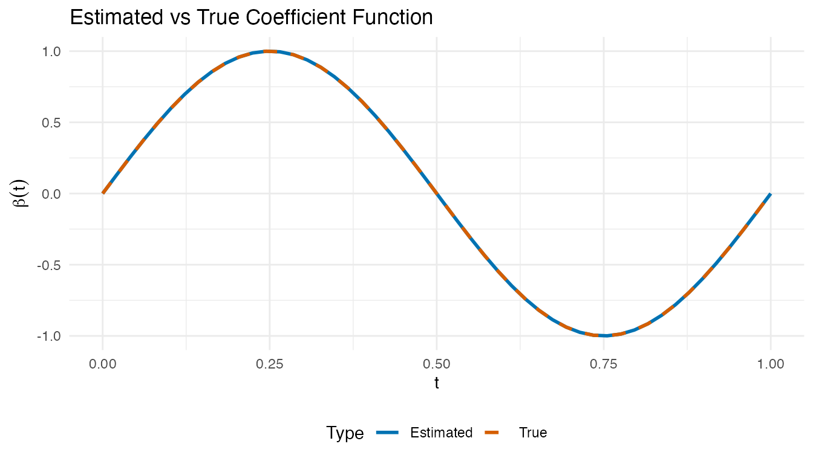
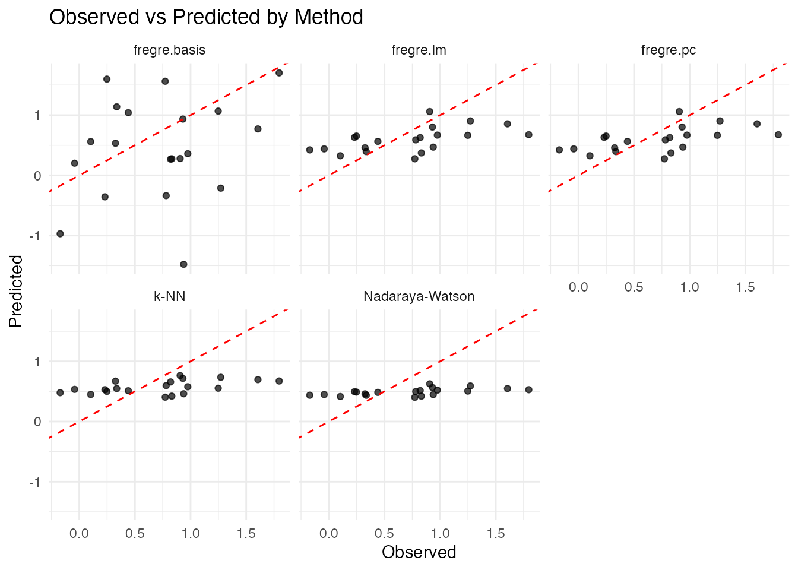
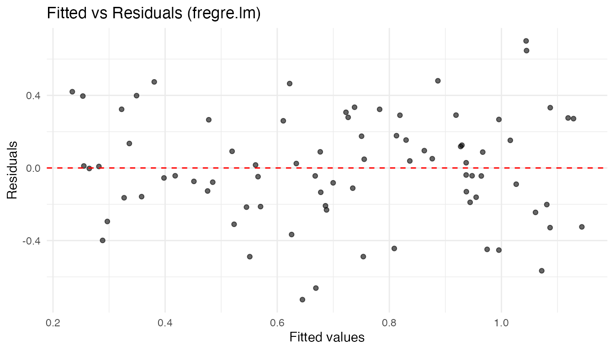
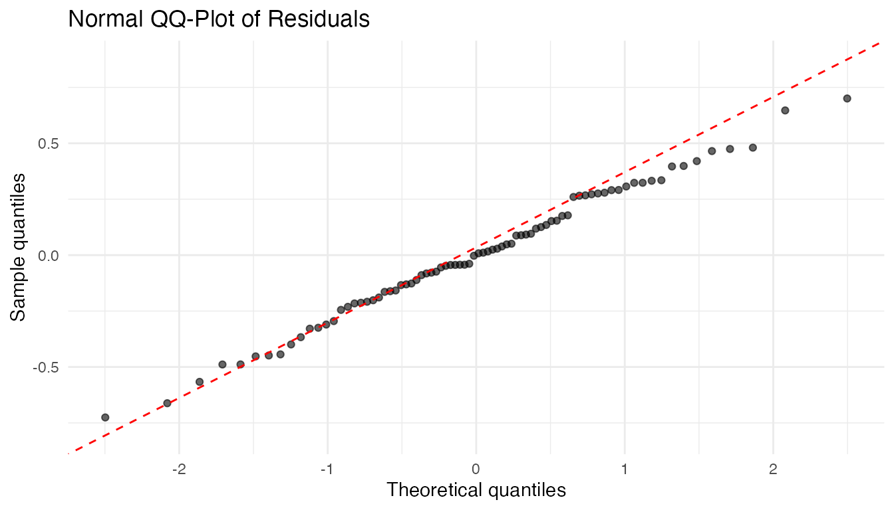
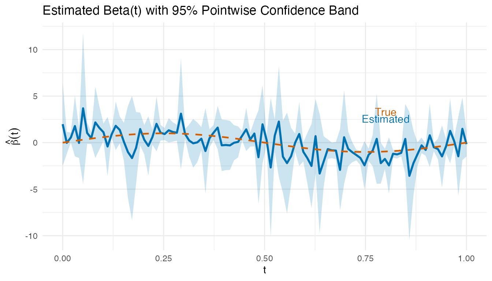

# Scalar-on-Function Regression

## Introduction

Scalar-on-function regression predicts a **scalar response** $Y$ from a
**functional predictor** $X(t)$. This is the most common regression
setting in functional data analysis: you have curves and want to predict
a number.


### Which Method Should I Use?

| Method              | Function                                                                                   | Key parameter          | Best when                                                                                      |
|---------------------|--------------------------------------------------------------------------------------------|------------------------|------------------------------------------------------------------------------------------------|
| **FPC Regression**  | [`fregre.lm()`](https://sipemu.github.io/fdars-r/reference/fregre.lm.md)                   | $K$ (# components)     | Default choice; full diagnostics/explainability                                                |
| **PC Regression**   | [`fregre.pc()`](https://sipemu.github.io/fdars-r/reference/fregre.pc.md)                   | $K$ (# components)     | Pure R alternative to [`fregre.lm()`](https://sipemu.github.io/fdars-r/reference/fregre.lm.md) |
| **Basis Expansion** | [`fregre.basis()`](https://sipemu.github.io/fdars-r/reference/fregre.basis.md)             | $\lambda$ (penalty)    | Smooth $\beta(t)$, interpretable coefficient                                                   |
| **Nonparametric**   | [`fregre.np()`](https://sipemu.github.io/fdars-r/reference/fregre.np.md)                   | $h$ (bandwidth) or $k$ | Nonlinear relationships                                                                        |
| **Elastic**         | [`elastic.regression()`](https://sipemu.github.io/fdars-r/reference/elastic.regression.md) | $\lambda$, warps       | Phase-variable curves                                                                          |

**Quick decision rule:**

1.  Start with
    [`fregre.lm()`](https://sipemu.github.io/fdars-r/reference/fregre.lm.md)
    — it has the richest downstream support (explainability,
    diagnostics, uncertainty quantification).
2.  Test linearity with
    [`flm.test()`](https://sipemu.github.io/fdars-r/reference/flm.test.md).
    If rejected, try
    [`fregre.np()`](https://sipemu.github.io/fdars-r/reference/fregre.np.md).
3.  If curves are misaligned, consider
    [`elastic.regression()`](https://sipemu.github.io/fdars-r/reference/elastic.regression.md)
    (see
    [`vignette("articles/elastic-regression")`](https://sipemu.github.io/fdars-r/articles/elastic-regression.md)).

## The Functional Linear Model

The foundational model in scalar-on-function regression is:

$$Y_{i} = \alpha + \int_{\mathcal{T}}\beta(t)X_{i}(t)\, dt + \epsilon_{i},\quad\epsilon_{i}\overset{\text{iid}}{\sim}\left( 0,\sigma^{2} \right)$$

where:

- $Y_{i}$ is the scalar response for observation $i$
- $X_{i}(t)$ is the functional predictor observed over domain
  $\mathcal{T}$
- $\alpha$ is the intercept
- $\beta(t)$ is the **coefficient function** (unknown, to be estimated)
- $\epsilon_{i}$ are i.i.d. errors

The coefficient function $\beta(t)$ describes *how* the predictor curve
at time $t$ influences the response. A positive $\beta(t)$ means higher
predictor values at time $t$ increase $Y$.

### The Estimation Challenge

Unlike classical regression where we estimate a finite number of
parameters, here we must estimate an entire *function* $\beta(t)$. This
is an ill-posed inverse problem:

1.  **Ill-posedness.** The integral operator is compact, so infinitely
    many solutions may exist and the least-squares estimate is wildly
    unstable.

2.  **Curse of dimensionality.** Discretizing $X_{i}(t)$ at $m$ grid
    points gives $m$ parameters from $n$ observations. When $m \gg n$,
    the model is massively overparameterized.

**fdars** provides four approaches to regularize this problem, each
described in the sections below.

## FPC Regression (`fregre.lm`)

[`fregre.lm()`](https://sipemu.github.io/fdars-r/reference/fregre.lm.md)
estimates $\beta(t)$ by projecting onto **functional principal
components** (FPCs). This is the recommended default: it has the Rust
backend, supports standard errors and GCV, and is the only model with
full
[explainability](https://sipemu.github.io/fdars-r/articles/explainability.md),
[diagnostics](https://sipemu.github.io/fdars-r/articles/regression-diagnostics.md),
and [uncertainty
quantification](https://sipemu.github.io/fdars-r/articles/uncertainty-quantification.md)
support.

### Mathematical Formulation

Let $\phi_{1}(t),\phi_{2}(t),\ldots$ be the eigenfunctions of the
covariance operator of $X$, and let
$\xi_{ik} = \int\left( X_{i}(t) - \bar{X}(t) \right)\phi_{k}(t)\, dt$ be
the FPC scores. Expanding
$\beta(t) = \sum_{k = 1}^{\infty}\gamma_{k}\phi_{k}(t)$ and substituting
gives:

$$Y_{i} \approx \alpha + \sum\limits_{k = 1}^{K}\gamma_{k}\xi_{ik} + \epsilon_{i}$$

This reduces the functional regression to an ordinary multiple
regression on $K$ FPC scores. The coefficient function is recovered as:

$$\widehat{\beta}(t) = \sum\limits_{k = 1}^{K}{\widehat{\gamma}}_{k}\phi_{k}(t)$$

The number of components $K$ controls the bias–variance trade-off: too
few components oversimplify $\beta(t)$; too many introduce noise.

### Standard Errors and GCV

With the FPC scores as predictors, standard OLS inference applies. The
variance of $\widehat{\gamma}$ is
$\sigma^{2}\left( \Xi^{T}\Xi \right)^{- 1}$ where $\Xi$ is the
$n \times K$ score matrix. Generalized cross-validation provides a
computationally efficient alternative to leave-one-out CV:

$$\text{GCV} = \frac{1}{n}\sum\limits_{i = 1}^{n}\left( \frac{y_{i} - {\widehat{y}}_{i}}{1 - h_{ii}} \right)^{2}$$

where $h_{ii}$ are the diagonal elements of the hat matrix
$H = \Xi\left( \Xi^{T}\Xi \right)^{- 1}\Xi^{T}$.

### Basic Usage

``` r
set.seed(42)
n_lm <- 80
m_lm <- 100
t_lm <- seq(0, 1, length.out = m_lm)

# Simulate functional predictor
X_lm <- matrix(0, n_lm, m_lm)
for (i in 1:n_lm) {
  X_lm[i, ] <- sin(2 * pi * t_lm) * runif(1, 0.5, 2) +
    cos(4 * pi * t_lm) * rnorm(1, sd = 0.3) +
    rnorm(m_lm, sd = 0.1)
}

beta_true_lm <- sin(2 * pi * t_lm)
y_lm <- X_lm %*% beta_true_lm / m_lm + rnorm(n_lm, sd = 0.3)

fd_lm <- fdata(X_lm, argvals = t_lm)
fit_lm <- fregre.lm(fd_lm, y_lm, ncomp = 3)
print(fit_lm)
#> Functional Linear Model (FPC-based)
#> ====================================
#>   Number of observations: 80 
#>   Number of FPC components: 3 
#>   R-squared: 0.4371 
#>   Adjusted R-squared: 0.4149 
#>   GCV: 0.0968
```

### Cross-Validation for Component Selection

[`fregre.lm.cv()`](https://sipemu.github.io/fdars-r/reference/fregre.lm.cv.md)
selects the optimal number of FPC components via k-fold
cross-validation.

``` r
cv_lm <- fregre.lm.cv(fd_lm, y_lm, k.range = 1:8, nfold = 10)
cat("Optimal ncomp:", cv_lm$optimal.k, "\n")
#> Optimal ncomp: 7
cat("CV errors:", round(cv_lm$cv.errors, 4), "\n")
#> CV errors: 0.0972 0.0964 0.0967 0.0986 0.0987 0.0966 0.0954 0.0967
```

## PC Regression (`fregre.pc`)

[`fregre.pc()`](https://sipemu.github.io/fdars-r/reference/fregre.pc.md)
uses the same FPC-based approach as
[`fregre.lm()`](https://sipemu.github.io/fdars-r/reference/fregre.lm.md)
but is implemented in pure R. It is mathematically equivalent — choose
[`fregre.lm()`](https://sipemu.github.io/fdars-r/reference/fregre.lm.md)
when you need the downstream explainability/diagnostics ecosystem;
choose
[`fregre.pc()`](https://sipemu.github.io/fdars-r/reference/fregre.pc.md)
if you prefer a pure-R solution.

### Mathematical Formulation

Using FPCA, each curve is represented as:

$$X_{i}(t) = \bar{X}(t) + \sum\limits_{k = 1}^{\infty}\xi_{ik}\phi_{k}(t)$$

Truncating at $K$ components and substituting into the functional linear
model:

$$Y_{i} = \alpha + \sum\limits_{k = 1}^{K}\gamma_{k}\xi_{ik} + \epsilon_{i}$$

The coefficient function is reconstructed as:

$$\widehat{\beta}(t) = \sum\limits_{k = 1}^{K}{\widehat{\gamma}}_{k}\phi_{k}(t)$$

### Basic Usage

``` r
# Fit PC regression with 3 components
fit_pc <- fregre.pc(fd, y, ncomp = 3)
print(fit_pc)
#> Functional regression model
#>   Number of observations: 100 
#>   R-squared: 0.1682634
```

### Examining the Fit

``` r
# Fitted values
fitted_pc <- fit_pc$fitted.values

# Residuals
residuals_pc <- y - fitted_pc

# R-squared
r2_pc <- 1 - sum(residuals_pc^2) / sum((y - mean(y))^2)
cat("R-squared:", round(r2_pc, 3), "\n")
#> R-squared: 0.168
```

### Cross-Validation for Component Selection

``` r
# Find optimal number of components
cv_pc <- fregre.pc.cv(fd, y, ncomp.range = 1:10, seed = 42)

cat("Optimal number of components:", cv_pc$optimal.ncomp, "\n")
#> Optimal number of components: 1
cat("CV error by component:\n")
#> CV error by component:
print(round(cv_pc$cv.errors, 4))
#>      1      2      3      4      5      6      7      8      9     10 
#> 0.2662 0.2670 0.2724 0.2722 0.2740 0.2688 0.2778 0.2714 0.2747 0.2722
```

### Prediction

``` r
# Split data
train_idx <- 1:80
test_idx <- 81:100

fd_train <- fd[train_idx, ]
fd_test <- fd[test_idx, ]
y_train <- y[train_idx]
y_test <- y[test_idx]

# Fit on training data
fit_train <- fregre.pc(fd_train, y_train, ncomp = 3)

# Predict on test data
y_pred <- predict(fit_train, fd_test)

# Evaluate
cat("Test RMSE:", round(pred.RMSE(y_test, y_pred), 3), "\n")
#> Test RMSE: 0.457
cat("Test R2:", round(pred.R2(y_test, y_pred), 3), "\n")
#> Test R2: 0.219
```

## Basis Expansion Regression (`fregre.basis`)

Basis expansion regression represents both the functional predictor
$X(t)$ and the coefficient function $\beta(t)$ using a finite set of
basis functions, providing a different regularization strategy.

### Mathematical Formulation

Let $\{ B_{j}(t)\}_{j = 1}^{J}$ be a set of basis functions (e.g.,
B-splines or Fourier). We expand:

$$X_{i}(t) = \sum\limits_{j = 1}^{J}c_{ij}B_{j}(t)\quad\text{and}\quad\beta(t) = \sum\limits_{j = 1}^{J}b_{j}B_{j}(t)$$

Substituting into the functional linear model:

$$Y_{i} = \alpha + \mathbf{c}_{i}^{\top}\mathbf{W}\mathbf{b} + \epsilon_{i}$$

where $\mathbf{W}$ is the **inner product matrix** with entries
$W_{jk} = \int B_{j}(t)B_{k}(t)\, dt$.

### Ridge Regularization

To prevent overfitting, we add a roughness penalty:

$$\min\limits_{\alpha,\mathbf{b}}\sum\limits_{i = 1}^{n}\left( Y_{i} - \alpha - \mathbf{c}_{i}^{\top}\mathbf{W}\mathbf{b} \right)^{2} + \lambda\int\left\lbrack \beta''(t) \right\rbrack^{2}dt$$

The penalty discourages rapid oscillations.

### Basis Choice

- **B-splines**: Flexible, local support, good for non-periodic data
- **Fourier**: Natural for periodic data, global support

### Basic Usage

``` r
# Fit basis regression with 15 B-spline basis functions
fit_basis <- fregre.basis(fd, y, nbasis = 15, type = "bspline")
print(fit_basis)
#> Functional regression model
#>   Number of observations: 100 
#>   R-squared: 0.5805754
```

### Regularization

``` r
# Higher lambda = more regularization
fit_basis_reg <- fregre.basis(fd, y, nbasis = 15, type = "bspline", lambda = 1)
```

### Cross-Validation for Lambda

``` r
# Find optimal lambda
cv_basis <- fregre.basis.cv(fd, y, nbasis = 15, type = "bspline",
                            lambda.range = c(0.001, 0.01, 0.1, 1, 10))

cat("Optimal lambda:", cv_basis$optimal.lambda, "\n")
#> Optimal lambda: 10
cat("CV error by lambda:\n")
#> CV error by lambda:
print(round(cv_basis$cv.errors, 4))
#>  0.001   0.01    0.1      1     10 
#> 0.6124 0.5766 0.4332 0.3047 0.2794
```

### Fourier Basis

For periodic data, use Fourier basis:

``` r
fit_fourier <- fregre.basis(fd, y, nbasis = 11, type = "fourier")
```

### Visualizing the Estimated Beta(t)

The coefficient function $\widehat{\beta}(t)$ reveals *which time
points* drive the response. Positive regions mean higher predictor
values there increase $Y$; negative regions decrease it.

``` r
# Reconstruct beta_hat(t) from basis regression coefficients
beta_hat <- fit_basis$beta.est

# Compare estimated vs true beta(t)
df_beta <- data.frame(
  t = rep(t_grid, 2),
  beta = c(beta_hat, beta_true),
  Type = rep(c("Estimated", "True"), each = m)
)

ggplot(df_beta, aes(x = t, y = beta, color = Type, linetype = Type)) +
  geom_line(linewidth = 1) +
  scale_color_manual(values = c("Estimated" = "#0072B2", "True" = "#D55E00")) +
  scale_linetype_manual(values = c("Estimated" = "solid", "True" = "dashed")) +
  labs(title = "Estimated vs True Coefficient Function",
       x = "t", y = expression(beta(t))) +
  theme(legend.position = "bottom")
```



## Nonparametric Regression (`fregre.np`)

Nonparametric functional regression makes no parametric assumptions
about the relationship between $X(t)$ and $Y$. Instead, it estimates
${\mathbb{E}}\left\lbrack Y|X = x \right\rbrack$ directly using local
averaging techniques.

### The General Framework

Given a new functional observation $X^{*}$, the predicted response is:

$${\widehat{Y}}^{*} = \widehat{m}\left( X^{*} \right) = \sum\limits_{i = 1}^{n}w_{i}\left( X^{*} \right)Y_{i}$$

where $w_{i}\left( X^{*} \right)$ are weights that depend on the
“distance” between $X^{*}$ and the training curves $X_{i}$.

### Nadaraya-Watson Estimator

The **Nadaraya-Watson** (kernel regression) estimator uses:

$$\widehat{m}\left( X^{*} \right) = \frac{\sum\limits_{i = 1}^{n}K\left( \frac{d\left( X^{*},X_{i} \right)}{h} \right)Y_{i}}{\sum\limits_{i = 1}^{n}K\left( \frac{d\left( X^{*},X_{i} \right)}{h} \right)}$$

where $K( \cdot )$ is a kernel function and $h > 0$ is the
**bandwidth**.

| Kernel       | Formula $K(u)$                                                 |
|--------------|----------------------------------------------------------------|
| Gaussian     | $\frac{1}{\sqrt{2\pi}}e^{- u^{2}/2}$                           |
| Epanechnikov | $\frac{3}{4}\left( 1 - u^{2} \right)\mathbf{1}_{{|u|} \leq 1}$ |
| Uniform      | $\frac{1}{2}\mathbf{1}_{{|u|} \leq 1}$                         |

### k-Nearest Neighbors

The **k-NN** estimator averages the responses of the $k$ closest curves:

$$\widehat{m}\left( X^{*} \right) = \frac{1}{k}\sum\limits_{i \in \mathcal{N}_{k}{(X^{*})}}Y_{i}$$

Two variants are available:

- **Global k-NN** (`kNN.gCV`): single $k$ selected by leave-one-out CV
- **Local k-NN** (`kNN.lCV`): adaptive $k$ that may vary per prediction
  point

### Nadaraya-Watson Example

``` r
# Fit nonparametric regression with Nadaraya-Watson
fit_np <- fregre.np(fd, y, type.S = "S.NW")
print(fit_np)
#> Nonparametric functional regression model
#>   Number of observations: 100 
#>   Smoother type: S.NW 
#>   Bandwidth: 0.3302789 
#>   R-squared: 0.0552
```

### k-Nearest Neighbors

``` r
# Global k-NN (single k for all observations)
fit_knn_global <- fregre.np(fd, y, type.S = "kNN.gCV")

# Local k-NN (adaptive k per observation)
fit_knn_local <- fregre.np(fd, y, type.S = "kNN.lCV")

cat("Global k-NN optimal k:", fit_knn_global$knn, "\n")
#> Global k-NN optimal k: 20
```

### Bandwidth Selection

``` r
# Cross-validation for bandwidth
cv_np <- fregre.np.cv(fd, y, h.range = seq(0.1, 1, by = 0.1))

cat("Optimal bandwidth:", cv_np$optimal.h, "\n")
#> Optimal bandwidth: 0.2
```

### Different Kernels

``` r
# Epanechnikov kernel
fit_epa <- fregre.np(fd, y, Ker = "epa")

# Available kernels: "norm", "epa", "tri", "quar", "cos", "unif"
```

### Different Metrics

``` r
# Use L1 metric instead of default L2
fit_np_l1 <- fregre.np(fd, y, metric = metric.lp, p = 1)

# Use semimetric based on PCA
fit_np_pca <- fregre.np(fd, y, metric = semimetric.pca, ncomp = 5)
```

### Multiple Functional Predictors

When the response depends on more than one functional predictor,
[`fregre.np.multi()`](https://sipemu.github.io/fdars-r/reference/fregre.np.multi.md)
extends nonparametric regression to handle a list of functional
predictors.

``` r
# Simulate a second functional predictor
set.seed(123)
X2 <- matrix(0, n, m)
for (i in 1:n) {
  X2[i, ] <- cos(2 * pi * t_grid) * rnorm(1, 0, 0.5) +
    rnorm(m, sd = 0.1)
}
fd2 <- fdata(X2, argvals = t_grid)

# Response depends on both predictors
beta_true2 <- cos(4 * pi * t_grid)
y_multi <- numeric(n)
for (i in 1:n) {
  y_multi[i] <- sum(beta_true * X[i, ]) / m +
    0.5 * sum(beta_true2 * X2[i, ]) / m +
    rnorm(1, sd = 0.3)
}

# Fit with multiple functional predictors
fit_multi <- fregre.np.multi(list(fd, fd2), y_multi)
print(fit_multi)
#> Nonparametric functional regression with multiple predictors
#> =============================================================
#> Number of observations: 100 
#> Number of functional predictors: 2 
#> Smoother type: S.NW 
#> Weights: 0.5, 0.5 
#> Bandwidth: 0.2809 
#> R-squared: 0.0632
```

### Mixed Functional and Scalar Predictors

Real datasets often include both functional and scalar covariates.
[`fregre.np.mixed()`](https://sipemu.github.io/fdars-r/reference/fregre.np.mixed.md)
handles this by selecting separate bandwidths for the functional and
scalar parts.

``` r
# Add a scalar covariate
z <- rnorm(n)
y_mixed <- y + 0.8 * z  # scalar effect added

# Fit with functional + scalar predictors
fit_mixed <- fregre.np.mixed(fd, y_mixed, scalar.covariates = z)
print(fit_mixed)
#> Nonparametric functional regression model
#>   Number of observations: 100 
#>   Smoother type: 
#>   R-squared: 0.7061
```

## Testing the Linear Model Assumption

Before choosing between linear and nonparametric methods,
[`flm.test()`](https://sipemu.github.io/fdars-r/reference/flm.test.md)
tests whether the functional linear model is adequate. If the null
hypothesis (linear relationship) is not rejected, PC and basis
regression are justified; otherwise nonparametric methods may be
preferable.

``` r
# Test H0: the relationship between X(t) and Y is linear
flm_result <- flm.test(fd_train, y_train, B = 200)
print(flm_result)
#> 
#>  Projected Cramer-von Mises test for FLM
#> 
#> data:  
#> = 2073.2, p-value = 0.13
```

A large p-value supports the linear model; a small p-value ($< 0.05$)
suggests the true relationship is nonlinear and parametric methods may
be misspecified.

## Comparing Methods

``` r
# Fit all methods on training data
fit1 <- fregre.pc(fd_train, y_train, ncomp = 3)
fit2 <- fregre.basis(fd_train, y_train, nbasis = 15)
fit3 <- fregre.np(fd_train, y_train, type.S = "S.NW")
fit4 <- fregre.np(fd_train, y_train, type.S = "kNN.gCV")
fit5 <- fregre.lm(fd_train, y_train, ncomp = 3)

# Predict on test data
pred1 <- predict(fit1, fd_test)
pred2 <- predict(fit2, fd_test)
pred3 <- predict(fit3, fd_test)
pred4 <- predict(fit4, fd_test)
pred5 <- predict(fit5, fd_test)

# Compare performance
results <- data.frame(
  Method = c("fregre.pc", "fregre.basis",
             "Nadaraya-Watson", "k-NN", "fregre.lm (Rust)"),
  RMSE = round(c(pred.RMSE(y_test, pred1),
                  pred.RMSE(y_test, pred2),
                  pred.RMSE(y_test, pred3),
                  pred.RMSE(y_test, pred4),
                  pred.RMSE(y_test, pred5)), 4),
  R2 = round(c(pred.R2(y_test, pred1),
                pred.R2(y_test, pred2),
                pred.R2(y_test, pred3),
                pred.R2(y_test, pred4),
                pred.R2(y_test, pred5)), 4),
  MAE = round(c(pred.MAE(y_test, pred1),
                 pred.MAE(y_test, pred2),
                 pred.MAE(y_test, pred3),
                 pred.MAE(y_test, pred4),
                 pred.MAE(y_test, pred5)), 4)
)
knitr::kable(results, caption = "Hold-out test set performance")
```

| Method           |   RMSE |      R2 |    MAE |
|:-----------------|-------:|--------:|-------:|
| fregre.pc        | 0.4570 |  0.2188 | 0.3820 |
| fregre.basis     | 0.8990 | -2.0226 | 0.7162 |
| Nadaraya-Watson  | 0.5359 | -0.0742 | 0.4453 |
| k-NN             | 0.4935 |  0.0891 | 0.4186 |
| fregre.lm (Rust) | 0.4570 |  0.2188 | 0.3820 |

Hold-out test set performance

### Visualizing Predictions

``` r
df_pred <- data.frame(
  Observed = rep(y_test, 5),
  Predicted = c(pred1, pred2, pred3, pred4, pred5),
  Method = rep(c("fregre.pc", "fregre.basis",
                 "Nadaraya-Watson", "k-NN", "fregre.lm"),
               each = length(y_test))
)

ggplot(df_pred, aes(x = Observed, y = Predicted)) +
  geom_point(alpha = 0.7) +
  geom_abline(intercept = 0, slope = 1, linetype = "dashed", color = "red") +
  facet_wrap(~ Method, nrow = 2) +
  labs(title = "Observed vs Predicted by Method",
       x = "Observed", y = "Predicted")
```



### Comparison Table

| Method            | Model                                              | Key Parameter       | Speed    | Interpretability |
|-------------------|----------------------------------------------------|---------------------|----------|------------------|
| `fregre.lm`       | $Y = \alpha + \sum_{k}\gamma_{k}\xi_{ik}$          | $K$ (# components)  | Fast     | High             |
| `fregre.pc`       | $Y = \alpha + \sum_{k}\gamma_{k}\xi_{ik}$          | $K$ (# components)  | Fast     | High             |
| `fregre.basis`    | $Y = \alpha + \int\beta(t)X(t)dt$                  | $\lambda$ (penalty) | Fast     | High             |
| `fregre.np` (NW)  | $Y = m(X)$ (nonparametric)                         | $h$ (bandwidth)     | Moderate | Low              |
| `fregre.np` (kNN) | $Y = \frac{1}{k}\sum_{j \in \mathcal{N}_{k}}Y_{j}$ | $k$ (neighbors)     | Moderate | Low              |

## Model Diagnostics

After fitting a functional linear model, standard regression diagnostics
help check whether the model assumptions hold.

### Residual Plots

``` r
df_diag <- data.frame(
  Fitted = fit_lm$fitted.values,
  Residuals = fit_lm$residuals
)

ggplot(df_diag, aes(x = Fitted, y = Residuals)) +
  geom_point(alpha = 0.6) +
  geom_hline(yintercept = 0, linetype = "dashed", color = "red") +
  labs(title = "Fitted vs Residuals (fregre.lm)",
       x = "Fitted values", y = "Residuals")
```



A random scatter around zero supports the linearity and
constant-variance assumptions. Fan-shaped or curved patterns suggest
heteroscedasticity or nonlinearity.

### QQ-Plot of Residuals

``` r
ggplot(df_diag, aes(sample = Residuals)) +
  stat_qq(alpha = 0.6) +
  stat_qq_line(color = "red", linetype = "dashed") +
  labs(title = "Normal QQ-Plot of Residuals",
       x = "Theoretical quantiles", y = "Sample quantiles")
```



### Visualizing Beta(t) with Confidence Bands

``` r
# fregre.lm stores beta(t) as an fdata object and SEs from the FPC regression
coefs <- fit_lm$coefficients[-1]  # exclude intercept
loadings <- fit_lm$.fpca_rotation  # m x K matrix of FPC loadings

beta_hat_lm <- as.numeric(loadings %*% coefs)

# Approximate pointwise SE via delta method using FPC score regression SEs
se_coefs <- fit_lm$std.errors[-1]  # exclude intercept SE
beta_se <- sqrt(as.numeric((loadings^2) %*% (se_coefs^2)))

df_beta_ci <- data.frame(
  t = t_lm,
  beta = beta_hat_lm,
  lower = beta_hat_lm - 1.96 * beta_se,
  upper = beta_hat_lm + 1.96 * beta_se,
  true_beta = beta_true_lm
)

ggplot(df_beta_ci, aes(x = t)) +
  geom_ribbon(aes(ymin = lower, ymax = upper), fill = "#0072B2", alpha = 0.2) +
  geom_line(aes(y = beta), color = "#0072B2", linewidth = 1) +
  geom_line(aes(y = true_beta), color = "#D55E00", linetype = "dashed",
            linewidth = 0.8) +
  labs(title = "Estimated Beta(t) with 95% Pointwise Confidence Band",
       x = "t", y = expression(hat(beta)(t))) +
  annotate("text", x = 0.8, y = max(beta_hat_lm) * 0.9,
           label = "True", color = "#D55E00") +
  annotate("text", x = 0.8, y = max(beta_hat_lm) * 0.7,
           label = "Estimated", color = "#0072B2")
```



Regions where the confidence band excludes zero indicate time points
where the predictor significantly influences the response.

For comprehensive diagnostics (influence, Cook’s distance, DFBETAS,
etc.), see
[`vignette("articles/regression-diagnostics")`](https://sipemu.github.io/fdars-r/articles/regression-diagnostics.md).

## Prediction Metrics

Model performance is evaluated using standard regression metrics:

| Metric  | Formula                                                                                               | Interpretation                   |
|---------|-------------------------------------------------------------------------------------------------------|----------------------------------|
| MAE     | $\frac{1}{n}\sum\left| y_{i} - {\widehat{y}}_{i} \right|$                                             | Average absolute error           |
| MSE     | $\frac{1}{n}\sum\left( y_{i} - {\widehat{y}}_{i} \right)^{2}$                                         | Average squared error            |
| RMSE    | $\sqrt{\text{MSE}}$                                                                                   | Error in original units          |
| $R^{2}$ | $1 - \frac{\sum\left( y_{i} - {\widehat{y}}_{i} \right)^{2}}{\sum\left( y_{i} - \bar{y} \right)^{2}}$ | Proportion of variance explained |

``` r
cat("MAE:", pred.MAE(y_test, pred1), "\n")
#> MAE: 0.3819577
cat("MSE:", pred.MSE(y_test, pred1), "\n")
#> MSE: 0.2088714
cat("RMSE:", pred.RMSE(y_test, pred1), "\n")
#> RMSE: 0.4570245
cat("R2:", pred.R2(y_test, pred1), "\n")
#> R2: 0.2188439
```

All methods support **leave-one-out cross-validation** (LOOCV) for
parameter selection:

$$\text{CV} = \frac{1}{n}\sum\limits_{i = 1}^{n}\left( Y_{i} - {\widehat{Y}}_{- i} \right)^{2}$$

This is implemented efficiently using the “hat matrix trick” for linear
methods.

## Practical Workflow

A recommended workflow for scalar-on-function regression:

1.  **Start simple:** fit
    [`fregre.lm.cv()`](https://sipemu.github.io/fdars-r/reference/fregre.lm.cv.md)
    to find the optimal number of FPC components via cross-validation.
2.  **Check linearity:** run
    [`flm.test()`](https://sipemu.github.io/fdars-r/reference/flm.test.md)
    on the training data. A significant p-value suggests nonlinearity.
3.  **If linear holds:** compare
    [`fregre.lm()`](https://sipemu.github.io/fdars-r/reference/fregre.lm.md),
    [`fregre.pc()`](https://sipemu.github.io/fdars-r/reference/fregre.pc.md),
    and
    [`fregre.basis()`](https://sipemu.github.io/fdars-r/reference/fregre.basis.md)
    — all estimate the functional linear model with different
    regularization strategies.
4.  **If linearity is rejected:** try
    [`fregre.np()`](https://sipemu.github.io/fdars-r/reference/fregre.np.md)
    with bandwidth cross-validation
    ([`fregre.np.cv()`](https://sipemu.github.io/fdars-r/reference/fregre.np.cv.md)).
5.  **Evaluate:** hold out a test set and compare methods with
    [`pred.RMSE()`](https://sipemu.github.io/fdars-r/reference/pred.RMSE.md),
    [`pred.R2()`](https://sipemu.github.io/fdars-r/reference/pred.R2.md),
    and
    [`pred.MAE()`](https://sipemu.github.io/fdars-r/reference/pred.MAE.md).
6.  **Diagnose:** check residual plots and the estimated
    $\widehat{\beta}(t)$ for interpretability.

``` r
set.seed(42)
tr <- sample(n, 70)
te <- setdiff(1:n, tr)

fd_tr <- fd[tr, ]
fd_te <- fd[te, ]
y_tr <- y[tr]
y_te <- y[te]

# Step 1: CV for component selection
cv <- fregre.lm.cv(fd_tr, y_tr, k.range = 1:6, nfold = 5)

# Step 2: Test linearity
linearity <- flm.test(fd_tr, y_tr, B = 200)
cat("FLM test p-value:", linearity$p.value, "\n")
#> FLM test p-value: 0.65

# Step 3-4: Fit best linear and nonparametric
fit_best_lm <- fregre.lm(fd_tr, y_tr, ncomp = cv$optimal.k)
fit_best_np <- fregre.np(fd_tr, y_tr, type.S = "kNN.gCV")

# Step 5: Evaluate
pred_lm_wf <- predict(fit_best_lm, fd_te)
pred_np_wf <- predict(fit_best_np, fd_te)

cat("Linear RMSE:", round(pred.RMSE(y_te, pred_lm_wf), 4),
    "| R2:", round(pred.R2(y_te, pred_lm_wf), 4), "\n")
#> Linear RMSE: 0.4575 | R2: -3e-04
cat("Nonpar RMSE:", round(pred.RMSE(y_te, pred_np_wf), 4),
    "| R2:", round(pred.R2(y_te, pred_np_wf), 4), "\n")
#> Nonpar RMSE: 0.5028 | R2: -0.2086
```

## Method Selection Guide

**FPC Regression** (`fregre.lm` / `fregre.pc`):

- Best when the functional predictor has clear dominant modes of
  variation
- Computationally efficient for large datasets
- Interpretable: each PC represents a pattern in the data
- [`fregre.lm()`](https://sipemu.github.io/fdars-r/reference/fregre.lm.md)
  is the only model with full explainability support

**Basis Expansion Regression** (`fregre.basis`):

- Best when you believe $\beta(t)$ is smooth
- Use B-splines for local features, Fourier for periodic patterns
- The penalty parameter $\lambda$ provides automatic regularization
- Good when you want to visualize and interpret $\widehat{\beta}(t)$

**Nonparametric Regression** (`fregre.np`):

- Best when the relationship between $X$ and $Y$ may be nonlinear
- Makes minimal assumptions about the data-generating process
- Computationally more expensive (requires distance calculations)
- May require larger sample sizes for stable estimation

## See Also

- [`vignette("articles/function-on-scalar")`](https://sipemu.github.io/fdars-r/articles/function-on-scalar.md)
  — when the *response* is a curve
- [`vignette("articles/elastic-regression")`](https://sipemu.github.io/fdars-r/articles/elastic-regression.md)
  — alignment-aware regression
- [`vignette("articles/functional-classification")`](https://sipemu.github.io/fdars-r/articles/functional-classification.md)
  — classifying curves (including
  [`functional.logistic()`](https://sipemu.github.io/fdars-r/reference/functional.logistic.md))
- [`vignette("articles/explainability")`](https://sipemu.github.io/fdars-r/articles/explainability.md)
  — interpreting
  [`fregre.lm()`](https://sipemu.github.io/fdars-r/reference/fregre.lm.md)
  models
- [`vignette("articles/regression-diagnostics")`](https://sipemu.github.io/fdars-r/articles/regression-diagnostics.md)
  — influence, Cook’s distance, VIF
- [`vignette("articles/uncertainty-quantification")`](https://sipemu.github.io/fdars-r/articles/uncertainty-quantification.md)
  — prediction intervals
- [`vignette("articles/cross-validation")`](https://sipemu.github.io/fdars-r/articles/cross-validation.md)
  — cross-validation framework
- `vignette("fpca", package = "fdars")` — functional principal component
  analysis
- `vignette("basis-representation", package = "fdars")` — basis function
  representations

## References

**Foundational texts:**

- Ramsay, J.O. and Silverman, B.W. (2005). *Functional Data Analysis*,
  2nd ed. Springer.
- Ferraty, F. and Vieu, P. (2006). *Nonparametric Functional Data
  Analysis: Theory and Practice*. Springer.
- Horváth, L. and Kokoszka, P. (2012). *Inference for Functional Data
  with Applications*. Springer.

**Key methodological papers:**

- Cardot, H., Ferraty, F., and Sarda, P. (1999). Functional Linear
  Model. *Statistics & Probability Letters*, 45(1), 11–22.
- Reiss, P.T. and Ogden, R.T. (2007). Functional Principal Component
  Regression and Functional Partial Least Squares. *Journal of the
  American Statistical Association*, 102(479), 984–996.
- Goldsmith, J., Bobb, J., Crainiceanu, C., Caffo, B., and Reich, D.
  (2011). Penalized Functional Regression. *Journal of Computational and
  Graphical Statistics*, 20(4), 830–851.
- Ferraty, F., Laksaci, A., and Vieu, P. (2006). Estimating Some
  Characteristics of the Conditional Distribution in Nonparametric
  Functional Models. *Statistical Inference for Stochastic Processes*,
  9, 47–76.
