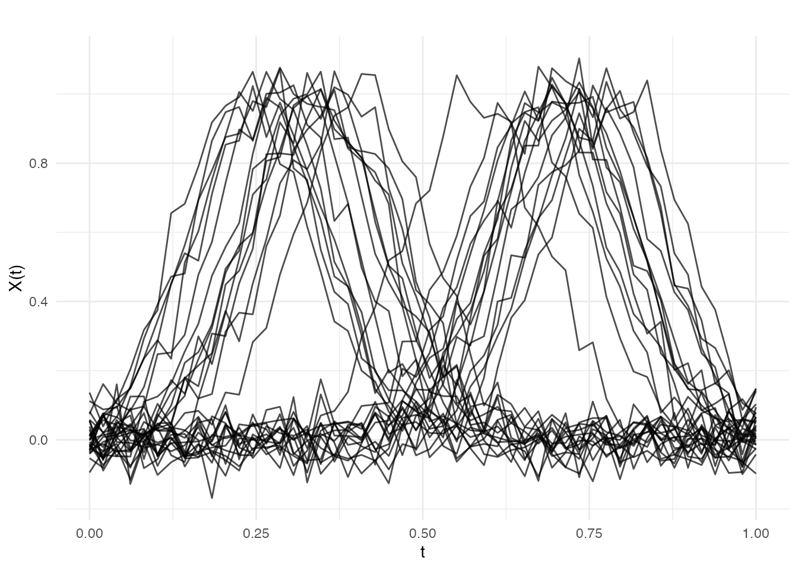
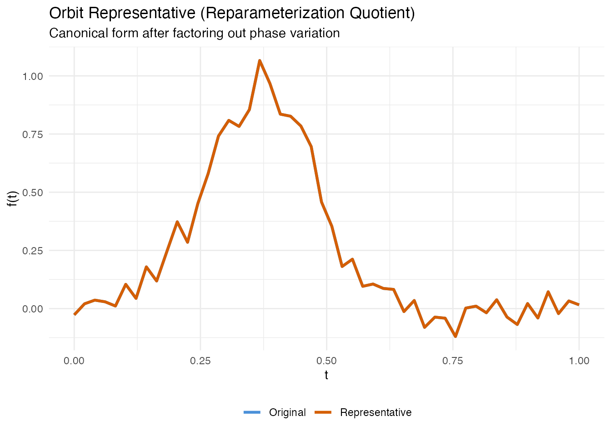
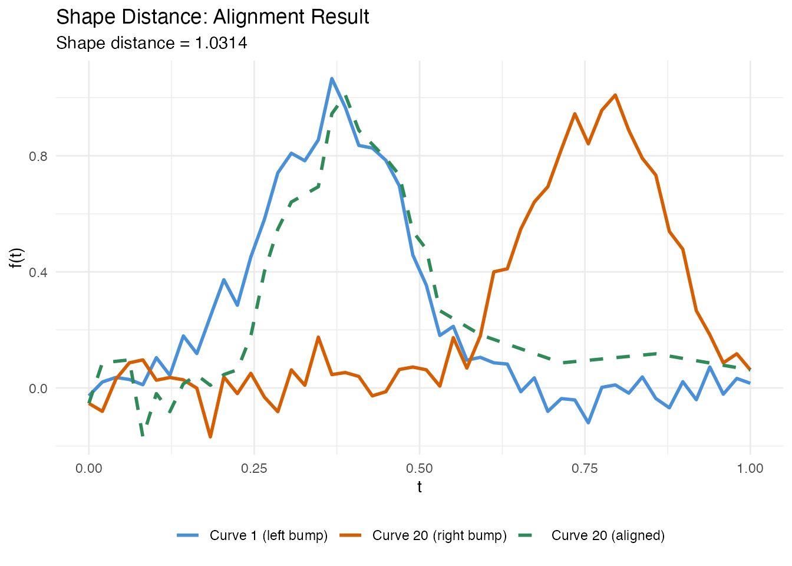
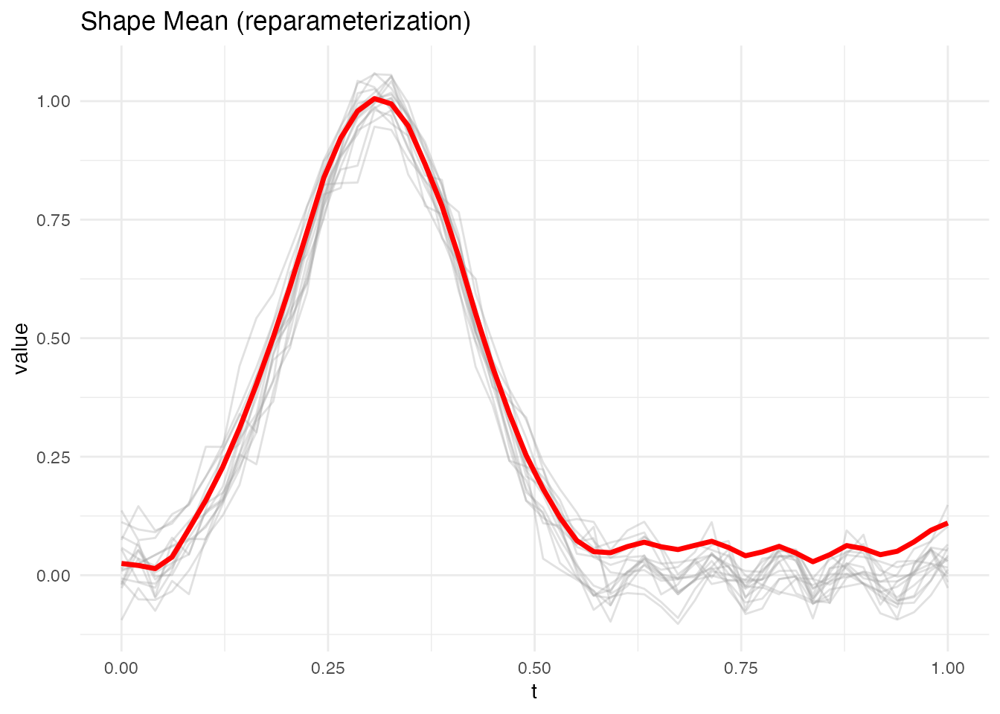
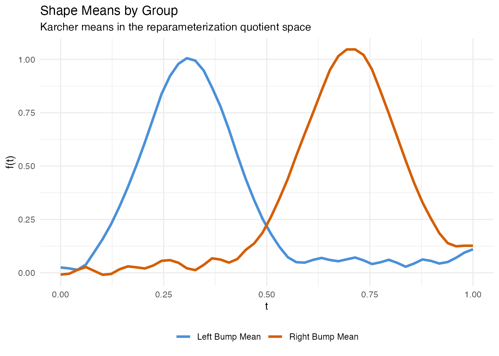
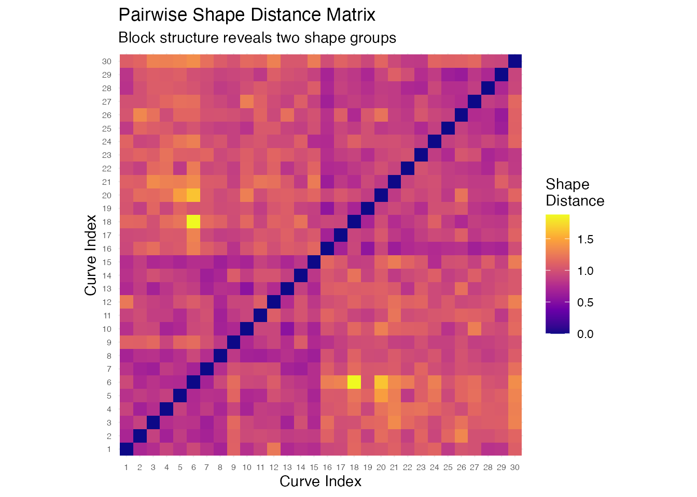

# Shape Analysis

## Introduction

Two curves may look different pointwise yet represent the *same shape* —
they differ only in how they are parameterized (traversal speed),
translated (vertical shift), or scaled (overall magnitude). **Shape
analysis** provides a rigorous framework for comparing curves after
factoring out these nuisance transformations.

The key idea is to work in a **quotient space**: the set of all curves
modulo a group of transformations. Two curves that differ only by a
reparameterization, translation, or scaling are identified as the same
point in the quotient space. The elastic (Fisher-Rao) framework makes
this quotient geometry computationally tractable by using the
Square-Root Slope Function (SRSF) representation.

**fdars** provides four core functions for shape analysis:

| Function                                                                                         | Purpose                                                             |
|--------------------------------------------------------------------------------------------------|---------------------------------------------------------------------|
| [`shape.representative()`](https://sipemu.github.io/fdars-r/reference/shape.representative.md)   | Canonical form of a single curve in the quotient space              |
| [`shape.distance()`](https://sipemu.github.io/fdars-r/reference/shape.distance.md)               | Elastic distance between two curves modulo nuisance transformations |
| [`shape.mean()`](https://sipemu.github.io/fdars-r/reference/shape.mean.md)                       | Karcher mean in the quotient space (average shape)                  |
| [`shape.distance.matrix()`](https://sipemu.github.io/fdars-r/reference/shape.distance.matrix.md) | Pairwise shape distance matrix for a set of curves                  |


## Simulated Data

We simulate 30 curves that represent two groups of bump-shaped profiles,
inspired by letter-stroke outlines from different writers. Group 1 has
bumps centered near $t = 0.3$ and Group 2 near $t = 0.7$. Within each
group, the bump location varies slightly, mimicking natural variation in
handwriting.

``` r
set.seed(42)
n <- 30
m <- 50
argvals <- seq(0, 1, length.out = m)

# Two groups of shapes - bumps at different locations
X <- matrix(0, n, m)
for (i in 1:15) {
  center <- 0.3 + rnorm(1, sd = 0.05)
  X[i, ] <- exp(-((argvals - center)^2) / 0.02) + rnorm(m, sd = 0.05)
}
for (i in 16:30) {
  center <- 0.7 + rnorm(1, sd = 0.05)
  X[i, ] <- exp(-((argvals - center)^2) / 0.02) + rnorm(m, sd = 0.05)
}
fd <- fdata(X, argvals = argvals)
group <- rep(c("Left bump", "Right bump"), each = 15)
```

``` r
plot(fd, main = "Simulated Letter-Stroke Profiles (2 groups)",
     xlab = "Normalized Arc Length", ylab = "Curvature (a.u.)")
```



Within each group, the curves share a common shape (a single bump) but
differ in the exact position of the peak — this is phase variation that
standard pointwise analysis would treat as genuine shape difference.

## Orbit Representatives

Every curve belongs to an **orbit** in the quotient space: the set of
all curves that can be obtained from it by applying the allowed
transformations (reparameterization, translation, or scaling).
[`shape.representative()`](https://sipemu.github.io/fdars-r/reference/shape.representative.md)
computes a canonical member of this orbit — the orbit representative —
which provides a standard form for the curve’s shape.

``` r
# Compute orbit representative for a single curve
f_original <- X[1, ]
rep_result <- shape.representative(f_original, argvals = argvals,
                                    quotient = "reparameterization")
```

``` r
df_orbit <- data.frame(
  argval = rep(argvals, 2),
  value = c(f_original, rep_result$representative),
  type = factor(rep(c("Original", "Representative"), each = m),
                levels = c("Original", "Representative"))
)

ggplot(df_orbit, aes(x = .data$argval, y = .data$value,
                     color = .data$type)) +
  geom_line(linewidth = 1.1) +
  scale_color_manual(values = c("Original" = "#4A90D9",
                                "Representative" = "#D55E00")) +
  labs(title = "Orbit Representative (Reparameterization Quotient)",
       subtitle = "Canonical form after factoring out phase variation",
       x = "t", y = "f(t)", color = NULL) +
  theme(legend.position = "bottom")
```



The representative has the same shape as the original but is
reparameterized to a canonical speed. Two curves with the same shape
will map to the same representative (up to numerical precision),
regardless of how they were originally parameterized.

### Quotient Spaces

The `quotient` argument controls which transformations are factored out:

| Quotient               | Factors out                  | Use case                               |
|------------------------|------------------------------|----------------------------------------|
| `"reparameterization"` | Warping (timing differences) | Curves with different traversal speeds |
| `"translation"`        | Vertical shifts              | Curves at different baselines          |
| `"scale"`              | Reparameterization + scaling | Curves of different magnitudes         |

## Shape Distance

[`shape.distance()`](https://sipemu.github.io/fdars-r/reference/shape.distance.md)
computes the elastic distance between two curves in the quotient space.
It returns the distance along with the optimal warping that aligns the
second curve to the first.

``` r
# Compare a left-bump curve to another left-bump curve
d_same <- shape.distance(X[1, ], X[5, ], argvals = argvals,
                          quotient = "reparameterization")

# Compare a left-bump curve to a right-bump curve
d_diff <- shape.distance(X[1, ], X[20, ], argvals = argvals,
                          quotient = "reparameterization")

cat("Same group (curves 1 vs 5):", round(d_same$distance, 4), "\n")
#> Same group (curves 1 vs 5): 0.7941
cat("Different groups (curves 1 vs 20):", round(d_diff$distance, 4), "\n")
#> Different groups (curves 1 vs 20): 1.0314
```

Curves from the same group have a small shape distance because their
bumps have the same form — only the location differs, and that is
factored out. Curves from different groups have a larger distance
because their shapes genuinely differ.

``` r
df_align <- data.frame(
  argval = rep(argvals, 3),
  value = c(X[1, ], X[20, ], d_diff$f2.aligned),
  curve = factor(rep(c("Curve 1 (left bump)", "Curve 20 (right bump)",
                        "Curve 20 (aligned)"), each = m),
                 levels = c("Curve 1 (left bump)", "Curve 20 (right bump)",
                            "Curve 20 (aligned)"))
)

ggplot(df_align, aes(x = .data$argval, y = .data$value,
                     color = .data$curve, linetype = .data$curve)) +
  geom_line(linewidth = 1) +
  scale_color_manual(values = c("#4A90D9", "#D55E00", "#2E8B57")) +
  scale_linetype_manual(values = c("solid", "solid", "dashed")) +
  labs(title = "Shape Distance: Alignment Result",
       subtitle = paste("Shape distance =", round(d_diff$distance, 4)),
       x = "t", y = "f(t)", color = NULL, linetype = NULL) +
  theme(legend.position = "bottom")
```



## Shape Mean

[`shape.mean()`](https://sipemu.github.io/fdars-r/reference/shape.mean.md)
computes the Karcher (Frechet) mean in the quotient space. This is the
curve that minimizes the total squared shape distance to all input
curves. Unlike a pointwise mean, the shape mean is not blurred by phase
variation.

``` r
# Shape mean of left-bump group
fd_left <- fd[1:15, ]
sm_left <- shape.mean(fd_left, quotient = "reparameterization",
                       max.iter = 20, tol = 1e-4)
print(sm_left)
#> Shape Mean (Quotient Space)
#>   Curves: 15 x 50 grid points
#>   Quotient: reparameterization 
#>   Iterations: 20 
#>   Converged: FALSE
```

The built-in plot method shows aligned curves (grey) with the mean curve
(red):

``` r
plot(sm_left)
```



### Comparing Group Means

``` r
fd_right <- fd[16:30, ]
sm_right <- shape.mean(fd_right, quotient = "reparameterization",
                        max.iter = 20, tol = 1e-4)

df_means <- data.frame(
  argval = rep(argvals, 2),
  value = c(sm_left$mean, sm_right$mean),
  group = factor(rep(c("Left Bump Mean", "Right Bump Mean"), each = m))
)

ggplot(df_means, aes(x = .data$argval, y = .data$value,
                     color = .data$group)) +
  geom_line(linewidth = 1.2) +
  scale_color_manual(values = c("Left Bump Mean" = "#4A90D9",
                                "Right Bump Mean" = "#D55E00")) +
  labs(title = "Shape Means by Group",
       subtitle = "Karcher means in the reparameterization quotient space",
       x = "t", y = "f(t)", color = NULL) +
  theme(legend.position = "bottom")
```



Each shape mean captures the representative bump profile for its group
without the blurring that a pointwise average would produce.

## Shape Distance Matrix

[`shape.distance.matrix()`](https://sipemu.github.io/fdars-r/reference/shape.distance.matrix.md)
computes all pairwise shape distances for a set of curves. This is the
foundation for downstream tasks like clustering, multidimensional
scaling, or nearest-neighbor classification.

``` r
D <- shape.distance.matrix(fd, quotient = "reparameterization")
```

### Heatmap

``` r
# Convert to long format for ggplot
df_heat <- expand.grid(Curve1 = 1:n, Curve2 = 1:n)
df_heat$distance <- as.vector(D)
df_heat$Curve1 <- factor(df_heat$Curve1)
df_heat$Curve2 <- factor(df_heat$Curve2)

ggplot(df_heat, aes(x = .data$Curve1, y = .data$Curve2,
                    fill = .data$distance)) +
  geom_tile() +
  scale_fill_viridis_c(option = "plasma", name = "Shape\nDistance") +
  labs(title = "Pairwise Shape Distance Matrix",
       subtitle = "Block structure reveals two shape groups",
       x = "Curve Index", y = "Curve Index") +
  coord_equal() +
  theme(axis.text = element_text(size = 6))
```



The heatmap shows clear block-diagonal structure: curves within the same
group (1–15 and 16–30) have small pairwise distances, while curves from
different groups have large distances. This confirms that shape distance
correctly distinguishes the two bump patterns.

### Using with Standard Clustering

The shape distance matrix can be passed directly to standard R
clustering tools:

``` r
# Hierarchical clustering on shape distances
hc <- hclust(as.dist(D), method = "complete")
plot(hc, main = "Dendrogram from Shape Distances",
     xlab = "Curve", ylab = "Shape Distance", cex = 0.7)
```


``` r

# Cut into 2 clusters
shape_clusters <- cutree(hc, k = 2)
table(Shape_Cluster = shape_clusters, True_Group = group)
#>              True_Group
#> Shape_Cluster Left bump Right bump
#>             1        15          0
#>             2         0         15
```

## Best Practices

1.  **Choose the right quotient space.** Use `"reparameterization"` when
    curves differ in speed/timing. Add `"translation"` or `"scale"` when
    baseline shifts or magnitude differences are also nuisance factors.
2.  **Check convergence** of
    [`shape.mean()`](https://sipemu.github.io/fdars-r/reference/shape.mean.md).
    If `converged = FALSE`, increase `max.iter` or relax `tol`.
3.  **Regularization.** Set `lambda > 0` to prevent extreme warpings
    when curves are noisy or sparsely sampled.
4.  **Preprocess consistently.** Smooth curves and evaluate on a common
    grid before shape analysis.
5.  **Visualize warpings.** The `gamma` output from
    [`shape.distance()`](https://sipemu.github.io/fdars-r/reference/shape.distance.md)
    and
    [`shape.representative()`](https://sipemu.github.io/fdars-r/reference/shape.representative.md)
    reveals how much reparameterization was needed.

## See Also

- [`vignette("articles/elastic-alignment")`](https://sipemu.github.io/fdars-r/articles/elastic-alignment.md)
  — elastic curve alignment and Karcher means
- [`vignette("articles/elastic-clustering")`](https://sipemu.github.io/fdars-r/articles/elastic-clustering.md)
  — elastic k-means and hierarchical clustering
- [`vignette("articles/scalar-on-shape")`](https://sipemu.github.io/fdars-r/articles/scalar-on-shape.md)
  — scalar-on-shape regression (phase-invariant prediction)
- [`vignette("articles/tsrvf")`](https://sipemu.github.io/fdars-r/articles/tsrvf.md)
  — the SRSF representation underlying elastic shape analysis

## References

- Srivastava, A. and Klassen, E. (2016). *Functional and Shape Data
  Analysis*. Springer.

- Srivastava, A., Klassen, E., Joshi, S.H. and Jermyn, I.H. (2011).
  Shape Analysis of Elastic Curves in Euclidean Spaces. *IEEE
  Transactions on Pattern Analysis and Machine Intelligence*, 33(7),
  1415–1428.

- Kurtek, S., Srivastava, A., Klassen, E. and Ding, Z. (2012).
  Statistical Modeling of Curves Using Shapes and Related Features.
  *Journal of the American Statistical Association*, 107(499),
  1152–1165.
