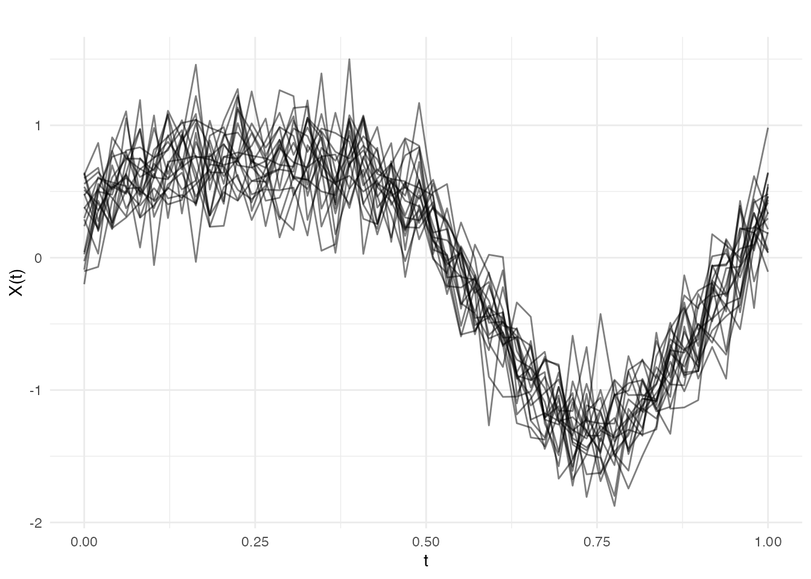
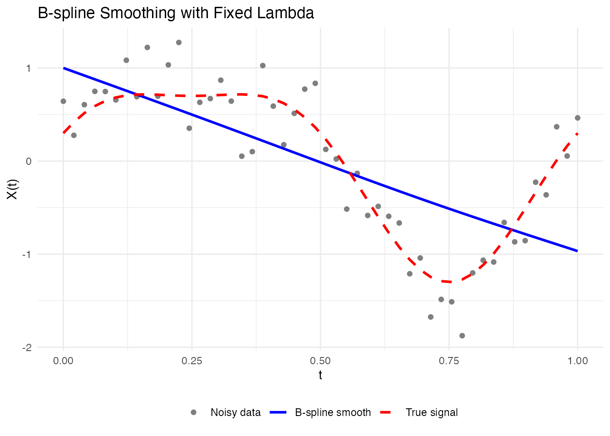
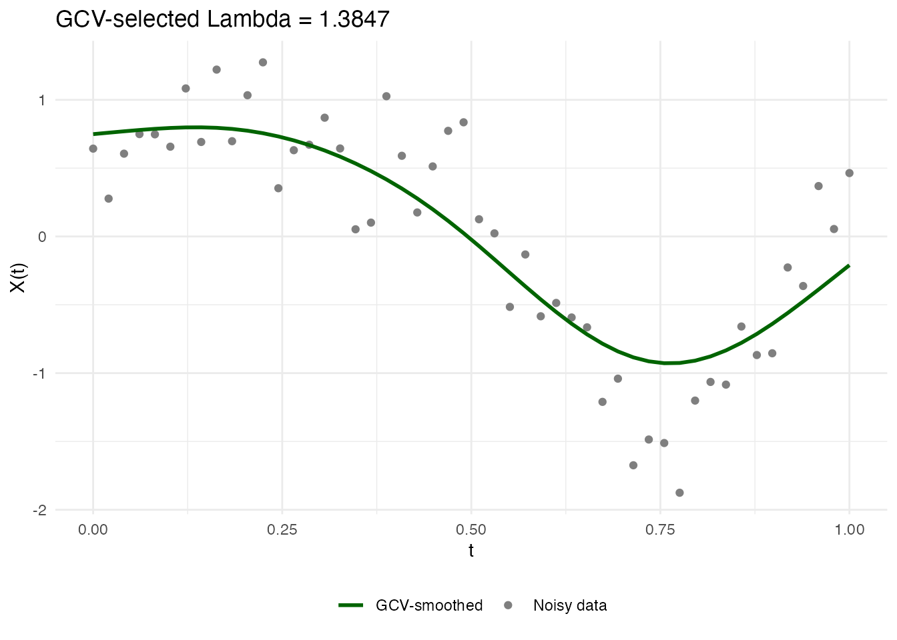
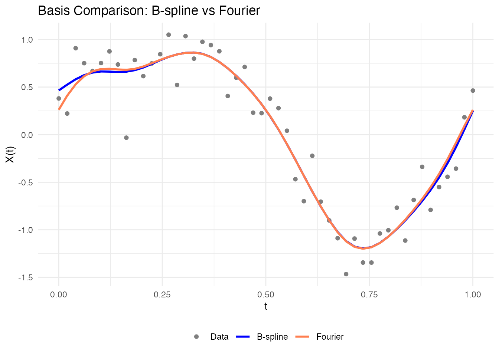
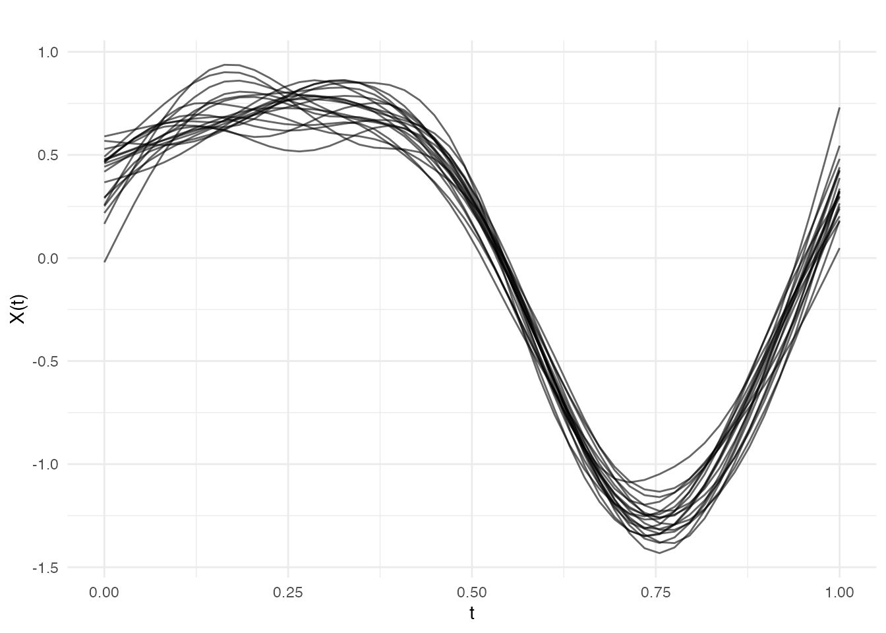
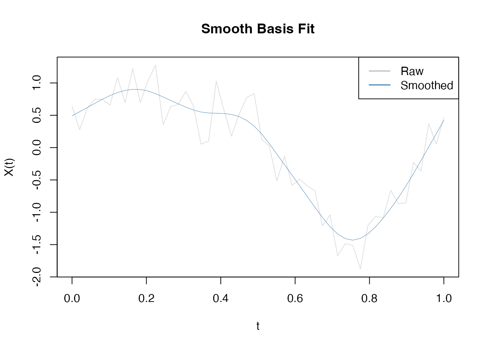
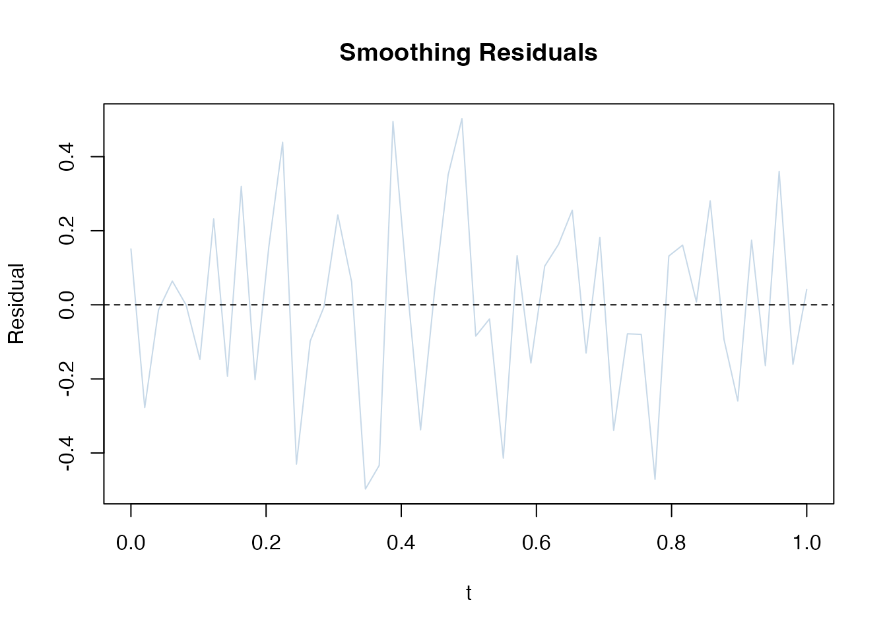

# Penalized Basis Smoothing

## Introduction

Penalized basis smoothing combines two powerful ideas: representing
curves as basis expansions and automatically selecting smoothness
through penalties. Unlike simple basis projection (which fixes the
number of basis functions), penalized smoothing uses a fixed set of
basis functions but adds a penalty term that discourages roughness.

This approach offers:

- **Automatic smoothing**: GCV selects the optimal smoothing parameter
  $\lambda$ without manual tuning
- **Flexible fit**: Uses many basis functions but controls complexity
  through penalties
- **Derivative-friendly**: Smooth coefficients lead to interpretable
  derivatives
- **B-spline and Fourier**: Choose the basis type that matches your data
  structure


## Creating Simulated Data

Let’s create functional data with known signal and noise:

``` r
# Generate noisy functional data
t <- seq(0, 1, length.out = 50)
n_curves <- 20

# True underlying signal: smooth function with features
true_signal <- function(t) sin(2 * pi * t) + 0.3 * cos(4 * pi * t)

# Generate noisy observations
X <- matrix(0, n_curves, length(t))
for (i in 1:n_curves) {
  X[i, ] <- true_signal(t) + rnorm(length(t), sd = 0.25)
}
fd_noisy <- fdata(X, argvals = t)

# Plot raw data
plot(fd_noisy, main = "Noisy Functional Data",
     xlab = "t", ylab = "X(t)", alpha = 0.5)
```



## Fixed Lambda Smoothing with smooth.basis.fd()

When you know or want to fix the smoothing parameter $\lambda$, use
[`smooth.basis.fd()`](https://sipemu.github.io/fdars-r/reference/smooth.basis.fd.md).
The penalty term balances data fit with smoothness:

$$\text{minimize}\quad \parallel y - Xc \parallel^{2} + \lambda c^{T}D^{T}Dc$$

where $D$ is a difference matrix encoding roughness.

### B-spline Smoothing

``` r
# Smooth with B-spline basis, fixed lambda
result_bs <- smooth.basis.fd(
  fd_noisy,
  type = "bspline",
  nbasis = 25,
  lambda = 1.0,
  lfd.order = 2
)

# Inspect result
print(result_bs)
#> Penalized Basis Smoothing
#>   Basis type: bspline 
#>   Number of basis functions: 25 
#>   Lambda: 1 
#>   EDF: 2.1 
#>   GCV: 0.342717

# Extract components
fitted_curves <- result_bs$fitted
coef_matrix <- result_bs$coefficients
edf <- result_bs$edf  # Effective degrees of freedom

cat("Effective df:", edf, "\n")
#> Effective df: 2.115902
```

### Visualization

``` r
# Compare first curve: data vs fit
idx <- 1
df_compare <- data.frame(
  t = rep(t, 3),
  value = c(fd_noisy$data[idx, ],
            result_bs$fitted$data[idx, ],
            true_signal(t)),
  type = factor(rep(c("Noisy data", "B-spline smooth", "True signal"),
                    each = length(t)),
                levels = c("Noisy data", "B-spline smooth", "True signal"))
)

ggplot(df_compare, aes(x = t, y = value, color = type, linetype = type)) +
  geom_point(data = subset(df_compare, type == "Noisy data"), size = 1.5) +
  geom_line(data = subset(df_compare, type != "Noisy data"), linewidth = 1) +
  scale_color_manual(
    values = c("Noisy data" = "gray50", "B-spline smooth" = "blue",
               "True signal" = "red")
  ) +
  scale_linetype_manual(
    values = c("Noisy data" = "blank", "B-spline smooth" = "solid",
               "True signal" = "dashed")
  ) +
  labs(title = "B-spline Smoothing with Fixed Lambda",
       x = "t", y = "X(t)", color = NULL, linetype = NULL) +
  theme(legend.position = "bottom")
```



### Fourier Smoothing

For periodic data, Fourier basis is more natural:

``` r
# Smooth with Fourier basis
result_fourier <- smooth.basis.fd(
  fd_noisy,
  type = "fourier",
  nbasis = 21,  # Fourier needs odd number
  lambda = 0.5,
  period = 1.0  # Period of the data
)

print(result_fourier)
#> Penalized Basis Smoothing
#>   Basis type: fourier 
#>   Number of basis functions: 21 
#>   Lambda: 0.5 
#>   EDF: 1.1 
#>   GCV: 0.602229
```

## Automatic Lambda Selection with smooth.basis.gcv()

The key advantage of penalized smoothing is **automatic parameter
selection** using Generalized Cross-Validation (GCV). This avoids manual
tuning:

$$\text{GCV}(\lambda) = \frac{\text{RSS}/n}{\left( 1 - \text{edf}/n \right)^{2}}$$

where RSS is residual sum of squares and edf is effective degrees of
freedom.

### GCV-based Smoothing

``` r
# Automatic lambda selection via GCV
result_gcv <- smooth.basis.gcv(
  fd_noisy,
  type = "bspline",
  nbasis = 25,
  lfd.order = 2,
  log.lambda.range = c(-2, 2),
  n.grid = 20
)

print(result_gcv)
#> Penalized Basis Smoothing
#>   Basis type: bspline 
#>   Number of basis functions: 25 
#>   Lambda: 1.385 
#>   EDF: 4 
#>   GCV: 0.141358
cat("Selected lambda:", result_gcv$lambda, "\n")
#> Selected lambda: 1.384708
cat("GCV score:", result_gcv$gcv, "\n")
#> GCV score: 0.1413581
```

### Visualization of GCV Selection

``` r
# GCV often computes multiple lambda values internally
# Plot shows how GCV score varies with lambda
idx <- 1
df_fit <- data.frame(
  t = rep(t, 2),
  value = c(fd_noisy$data[idx, ], result_gcv$fitted$data[idx, ]),
  type = rep(c("Noisy data", "GCV-smoothed"), each = length(t))
)

ggplot(df_fit, aes(x = t, y = value, color = type)) +
  geom_point(data = subset(df_fit, type == "Noisy data"), size = 1.5) +
  geom_line(data = subset(df_fit, type == "GCV-smoothed"), linewidth = 1) +
  scale_color_manual(
    values = c("Noisy data" = "gray50", "GCV-smoothed" = "darkgreen")
  ) +
  labs(title = paste("GCV-selected Lambda =", round(result_gcv$lambda, 4)),
       x = "t", y = "X(t)", color = NULL) +
  theme(legend.position = "bottom")
```



### Information Criteria Comparison

The
[`smooth.basis.gcv()`](https://sipemu.github.io/fdars-r/reference/smooth.basis.gcv.md)
object includes multiple criteria:

``` r
# Access different criteria
cat("GCV:", result_gcv$gcv, "\n")
#> GCV: 0.1413581
cat("AIC:", result_gcv$aic, "\n")
#> AIC: -2115.756
cat("BIC:", result_gcv$bic, "\n")
#> BIC: -2096.062

# BIC is more conservative (penalizes complexity more)
# Use AIC for moderate penalty, BIC for simpler models
```

## B-spline vs Fourier Comparison

### When to Use Each

| Aspect                       | B-spline          | Fourier                |
|------------------------------|-------------------|------------------------|
| **Best for**                 | Non-periodic data | Periodic/seasonal data |
| **Local support**            | Yes (local basis) | No (global basis)      |
| **Boundary behavior**        | Good              | May show ringing       |
| **Derivative smoothness**    | Good              | Excellent              |
| **Computational efficiency** | Very fast         | Fast                   |

### Direct Comparison

``` r
# Smooth same data with both bases
result_bs <- smooth.basis.gcv(fd_noisy, type = "bspline", nbasis = 25)
result_fourier <- smooth.basis.gcv(fd_noisy, type = "fourier", nbasis = 21)

# Compare fit quality
cat("B-spline GCV:", result_bs$gcv, "\n")
#> B-spline GCV: 0.07319206
cat("Fourier GCV:", result_fourier$gcv, "\n")
#> Fourier GCV: 0.07146269
cat("B-spline EDF:", result_bs$edf, "\n")
#> B-spline EDF: 8.337083
cat("Fourier EDF:", result_fourier$edf, "\n")
#> Fourier EDF: 7.294185

# Plot comparison
idx <- 2
df_comp <- data.frame(
  t = rep(t, 3),
  value = c(fd_noisy$data[idx, ],
            result_bs$fitted$data[idx, ],
            result_fourier$fitted$data[idx, ]),
  method = factor(rep(c("Data", "B-spline", "Fourier"), each = length(t)),
                  levels = c("Data", "B-spline", "Fourier"))
)

ggplot(df_comp, aes(x = t, y = value, color = method)) +
  geom_point(data = subset(df_comp, method == "Data"), size = 1.5) +
  geom_line(data = subset(df_comp, method != "Data"), linewidth = 1) +
  scale_color_manual(values = c("Data" = "gray50", "B-spline" = "blue",
                                 "Fourier" = "coral")) +
  labs(title = "Basis Comparison: B-spline vs Fourier",
       x = "t", y = "X(t)", color = NULL) +
  theme(legend.position = "bottom")
```



## Smoothing Multiple Curves

[`smooth.basis.fd()`](https://sipemu.github.io/fdars-r/reference/smooth.basis.fd.md)
and
[`smooth.basis.gcv()`](https://sipemu.github.io/fdars-r/reference/smooth.basis.gcv.md)
automatically handle all curves:

``` r
# Smooth entire dataset with GCV
result_all <- smooth.basis.gcv(
  fd_noisy,
  type = "bspline",
  nbasis = 25,
  lfd.order = 2
)

# All curves are smoothed
cat("Smoothed dataset shape:", nrow(result_all$fitted$data),
    "curves x", ncol(result_all$fitted$data), "points\n")
#> Smoothed dataset shape: 20 curves x 50 points

# Plot all smoothed curves
plot(result_all$fitted, alpha = 0.6,
     main = "All Curves Smoothed with Penalized B-splines")
```



## Diagnostic Plots

``` r
# For a single curve result
single_result <- smooth.basis.gcv(fd_noisy[1], type = "bspline", nbasis = 25)

# Plot fit quality
plot(single_result, type = "fit")
```



``` r

# Plot residuals
plot(single_result, type = "residuals")
```



## Comparison: smooth.basis vs fdata2basis

| Function               | Approach                      | Best For         | Parameter Selection  |
|------------------------|-------------------------------|------------------|----------------------|
| **fdata2basis()**      | Basis projection (no penalty) | Fixed complexity | Manual nbasis choice |
| **smooth.basis.fd()**  | Penalized basis (fixed λ)     | Known smoothness | Manual lambda        |
| **smooth.basis.gcv()** | Penalized basis (auto λ)      | Automatic tuning | GCV/AIC/BIC          |

### When to Use Each

``` r
# Use fdata2basis() when:
# - You have a specific model in mind
# - You want fast computation without penalty overhead
# - Dimensionality reduction is your goal

# Use smooth.basis.fd() when:
# - You know the optimal smoothness parameter
# - You want explicit control over lambda
# - You're comparing methods with fixed settings

# Use smooth.basis.gcv() when:
# - You want automatic tuning (recommended default)
# - You're doing exploratory analysis
# - You need data-driven smoothing parameter selection
```

## Summary

Penalized basis smoothing provides:

1.  **Flexibility**: Fixed set of basis functions with adaptive
    smoothness
2.  **Automation**: GCV automatically selects smoothing parameter
3.  **Quality derivatives**: Smooth coefficients → interpretable
    derivatives
4.  **Choice**: B-spline for non-periodic, Fourier for periodic data

**Practical recommendation**: Start with
[`smooth.basis.gcv()`](https://sipemu.github.io/fdars-r/reference/smooth.basis.gcv.md)
using the default settings. Increase `nbasis` if you suspect
underfitting, or increase `log.lambda.range` upper bound if the GCV
curve looks flat.

## See Also

- `vignette("basis-representation", package = "fdars")` — basis function
  representations and cross-validation
- `vignette("intro-to-smoothing", package = "fdars")` — overview of
  smoothing techniques
- `vignette("working-with-derivatives", package = "fdars")` — computing
  functional derivatives

## References

- Ramsay, J.O. and Silverman, B.W. (2005). *Functional Data Analysis*.
  Springer.
- Eilers, P.H.C. and Marx, B.D. (1996). Flexible smoothing with
  B-splines and penalties. *Statistical Science*, 11(2), 89-121.
- Wahba, G. (1990). *Spline Models for Observational Data*. SIAM.
