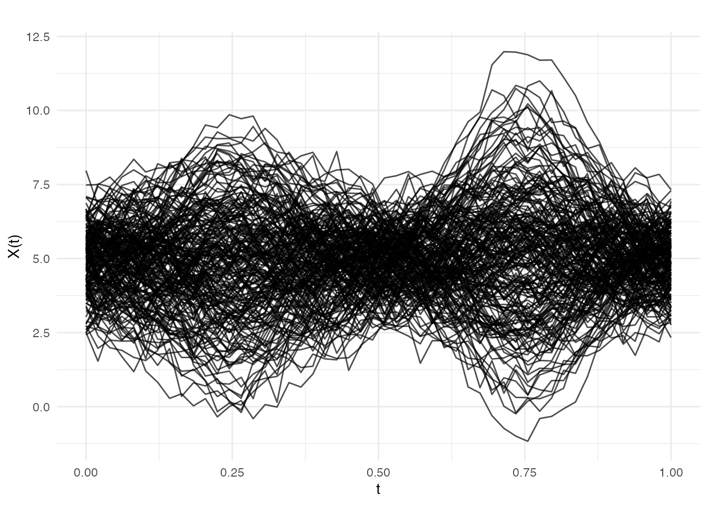
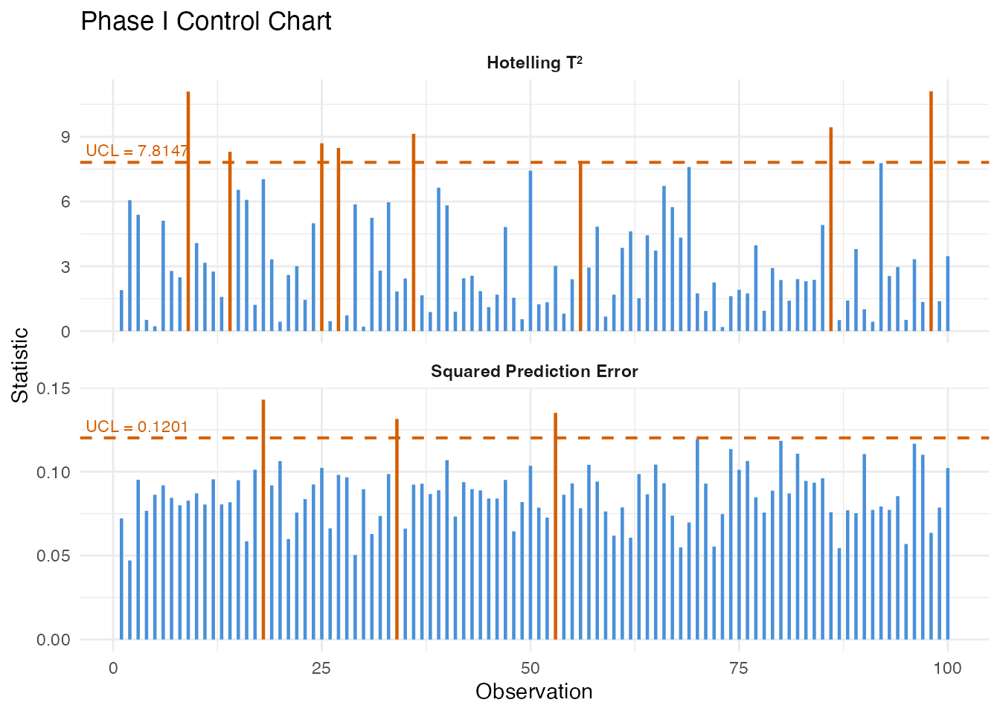
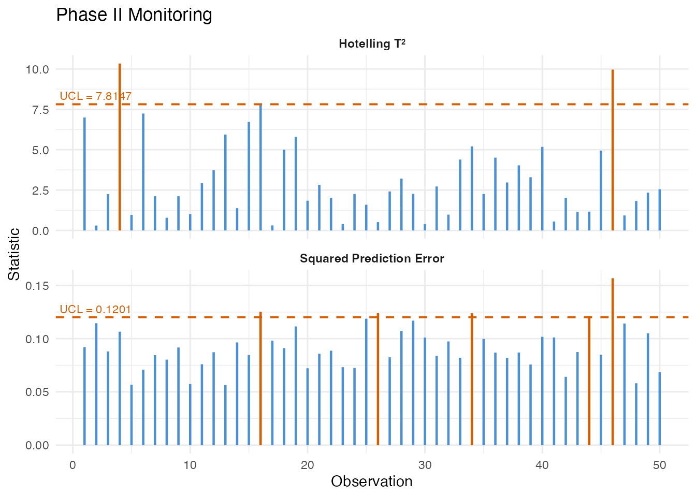
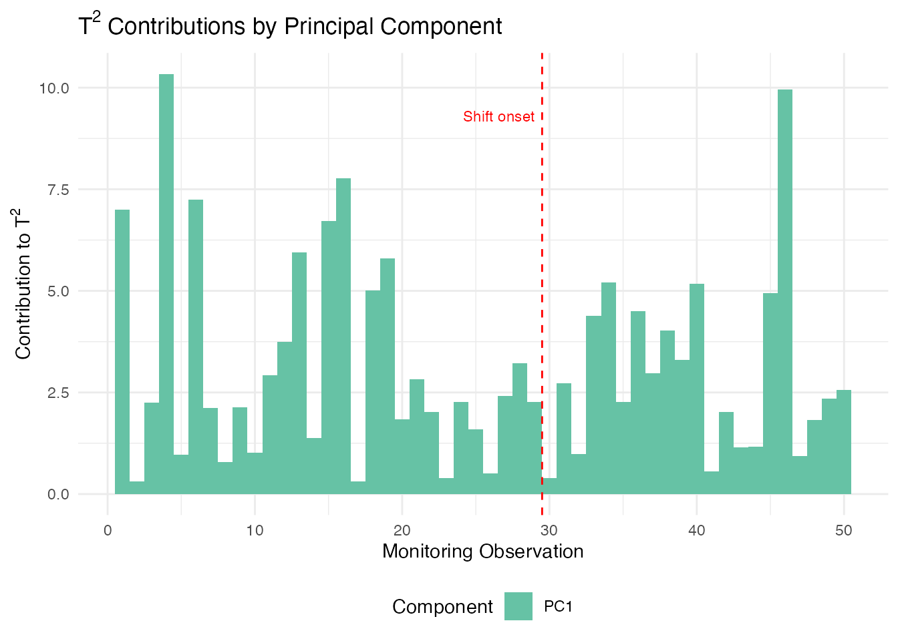
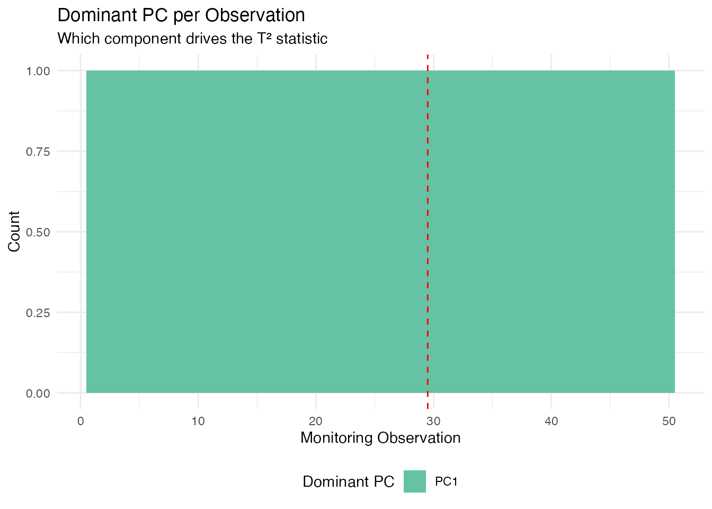

# Statistical Process Monitoring for Functional Data

## Introduction

Statistical Process Monitoring (SPM) extends classical control charts to
functional data. When the “quality characteristic” is an entire curve
(e.g., a spectral profile, a temperature trajectory, or a process
signature), univariate control charts on summary statistics lose
information. Functional SPM monitors the full curve structure.


The workflow has two phases:

1.  **Phase I** — Estimate the in-control process using historical
    “good” data: perform FPCA, compute Hotelling $T^{2}$ and Squared
    Prediction Error (SPE) statistics, and set control limits.

2.  **Phase II** — Monitor new observations by projecting onto the Phase
    I principal components and comparing statistics to the control
    limits. Alarms fire when a statistic exceeds its Upper Control Limit
    (UCL).

### When to Use Functional SPM

| Scenario                           | Method                                                                                                                                                    |
|------------------------------------|-----------------------------------------------------------------------------------------------------------------------------------------------------------|
| Single functional quality variable | [`spm.phase1()`](https://sipemu.github.io/fdars-r/reference/spm.phase1.md) + [`spm.monitor()`](https://sipemu.github.io/fdars-r/reference/spm.monitor.md) |
| Multiple functional variables      | `mf.spm.phase1()` + `mf.spm.monitor()`                                                                                                                    |
| Detecting gradual drifts           | [`spm.ewma()`](https://sipemu.github.io/fdars-r/reference/spm.ewma.md)                                                                                    |
| Process with known covariates      | `frcc()` + [`frcc.monitor()`](https://sipemu.github.io/fdars-r/reference/frcc.monitor.md)                                                                 |
| Diagnosing alarm root cause        | [`spm.contributions()`](https://sipemu.github.io/fdars-r/reference/spm.contributions.md)                                                                  |

## Simulating Process Data

We simulate semiconductor wafer thickness profiles: each curve is a
spectral measurement across the wafer surface. Phase I uses 200
in-control profiles; Phase II introduces a shift at observation 30.

``` r
set.seed(42)

m <- 50  # grid points
t_grid <- seq(0, 1, length.out = m)

# In-control process: smooth curves with random variation
n_ic <- 200  # Phase I observations
X_ic <- matrix(0, n_ic, m)
for (i in seq_len(n_ic)) {
  scores <- rnorm(3, sd = c(2, 1, 0.5))
  X_ic[i, ] <- 5 + scores[1] * sin(2 * pi * t_grid) +
                    scores[2] * cos(4 * pi * t_grid) +
                    scores[3] * sin(6 * pi * t_grid) +
                    rnorm(m, sd = 0.3)
}

# Phase II: 50 observations, shift at observation 30
n_new <- 50
X_new <- matrix(0, n_new, m)
for (i in seq_len(n_new)) {
  scores <- rnorm(3, sd = c(2, 1, 0.5))
  shift <- if (i >= 30) 1.5 * sin(2 * pi * t_grid) else 0
  X_new[i, ] <- 5 + scores[1] * sin(2 * pi * t_grid) +
                     scores[2] * cos(4 * pi * t_grid) +
                     scores[3] * sin(6 * pi * t_grid) +
                     shift + rnorm(m, sd = 0.3)
}

fd_ic <- fdata(X_ic, argvals = t_grid)
fd_new <- fdata(X_new, argvals = t_grid)
```

``` r
plot(fd_ic, main = "Phase I: In-Control Profiles",
     xlab = "Measurement Position", ylab = "Thickness")
```



## Phase I: Estimating Control Limits

[`spm.phase1()`](https://sipemu.github.io/fdars-r/reference/spm.phase1.md)
performs FPCA on the in-control data, computes $T^{2}$ and SPE
statistics for each training observation, and estimates control limits
at significance level $\alpha$.

``` r
chart <- spm.phase1(fd_ic, ncomp = 3, alpha = 0.05, seed = 42)
print(chart)
#> SPM Control Chart (Phase I)
#>   Components: 3 
#>   Alpha: 0.05 
#>   T2 UCL: 7.815 
#>   SPE UCL: 0.1201 
#>   Observations: 200 
#>   Grid points: 50 
#>   Eigenvalues: 1.607, 0.458, 0.119
```

The returned `spm.chart` object contains:

- **T2 control limit** — based on the $F$-distribution with `ncomp` and
  `n - ncomp` degrees of freedom
- **SPE control limit** — estimated from the empirical distribution of
  Phase I SPE values
- **Phase I statistics** — $T^{2}$ and SPE for each training observation
  (useful for checking that Phase I data is truly in-control)

``` r
plot(chart)
```



## Phase II: Online Monitoring

Project new observations onto the Phase I principal components and
compare to control limits:

``` r
monitor <- spm.monitor(chart, fd_new)
print(monitor)
#> SPM Monitoring Result (Phase II)
#>   Observations: 50 
#>   T2 alarms: 2 of 50 (4%) 
#>   SPE alarms: 5 of 50 (10%) 
#>   T2 UCL: 7.815 
#>   SPE UCL: 0.1201

# Which observations triggered alarms?
alarm_idx <- which(monitor$t2.alarm | monitor$spe.alarm)
cat("Alarms at observations:", alarm_idx, "\n")
#> Alarms at observations: 4 16 26 34 44 46
```

``` r
plot(monitor)
```



The monitoring result contains:

| Field       | Description                                       |
|-------------|---------------------------------------------------|
| `t2`        | Hotelling $T^{2}$ values for each new observation |
| `spe`       | SPE values for each new observation               |
| `t2.alarm`  | Logical: did $T^{2}$ exceed the UCL?              |
| `spe.alarm` | Logical: did SPE exceed the UCL?                  |
| `scores`    | PC scores for the new observations                |

## EWMA Monitoring

The Exponentially Weighted Moving Average (EWMA) chart smooths the
monitoring statistics over time, making it more sensitive to small,
persistent shifts than the standard Shewhart-type chart:

``` r
ewma_result <- spm.ewma(chart, fd_new, lambda = 0.2, alpha = 0.05)

cat("EWMA T2 alarms:", sum(ewma_result$t2.alarm), "\n")
#> EWMA T2 alarms: 9
cat("EWMA SPE alarms:", sum(ewma_result$spe.alarm), "\n")
#> EWMA SPE alarms: 5
```

The smoothing parameter $\lambda \in (0,1\rbrack$ controls the memory: -
$\lambda = 1$ gives the standard Shewhart chart (no smoothing) -
$\lambda = 0.2$ (default) gives moderate smoothing - Smaller $\lambda$
detects smaller shifts but responds more slowly

## Multivariate FPCA

When multiple functional variables are measured simultaneously (e.g.,
temperature, pressure, and flow rate profiles), Multivariate FPCA
extracts joint modes of variation across all variables:

``` r
# Simulate two correlated functional variables
fd_var1 <- fdata(X_ic, argvals = t_grid)
fd_var2 <- fdata(X_ic + matrix(rnorm(n_ic * m, sd = 0.5), n_ic, m),
                 argvals = t_grid)

mfpca_result <- mfpca(list(fd_var1, fd_var2), ncomp = 3)
cat("Eigenvalues:", round(mfpca_result$eigenvalues, 3), "\n")
#> Eigenvalues: 69.642 18.471 4.308
```

The result contains joint scores and per-variable eigenfunctions, which
can be used for multivariate SPM via `mf.spm.phase1()`.

## Contribution Diagnostics

When an alarm fires, the next question is: **what went wrong?**
Contribution analysis decomposes the aggregate $T^{2}$ and SPE
statistics into per-variable (or per-grid-region) contributions,
pinpointing which part of the curve triggered the alarm.

### T-squared Contributions

$T^{2}$ contributions break down the Hotelling statistic into additive
terms, one per principal component. A large contribution from PC $k$
means that the curve’s score on the $k$-th eigenfunction is unusually
far from the in-control mean. This tells you *which mode of variation*
shifted:

``` r
# T2 contributions: one value per PC per observation
t2_contrib <- spm.contributions(monitor$scores,
                                chart$eigenvalues,
                                grid.sizes = c(m),
                                type = "t2")

# Identify the first alarming observation
alarm_idx <- which(monitor$t2.alarm | monitor$spe.alarm)
first_alarm <- alarm_idx[1]
cat("First alarm at observation:", first_alarm, "\n")
#> First alarm at observation: 4
cat("T2 contributions (per PC):", round(t2_contrib[first_alarm, ], 3), "\n")
#> T2 contributions (per PC): 10.337
```

``` r
# Visualize T2 contributions for all monitoring observations
n_mon <- nrow(t2_contrib)
n_pc <- ncol(t2_contrib)
df_t2 <- data.frame(
  obs = rep(seq_len(n_mon), n_pc),
  contribution = as.vector(t2_contrib),
  pc = factor(rep(paste0("PC", seq_len(n_pc)), each = n_mon))
)

ggplot(df_t2, aes(x = obs, y = contribution, fill = pc)) +
  geom_col(position = "stack", width = 1) +
  geom_vline(xintercept = 29.5, linetype = "dashed", color = "red", linewidth = 0.5) +
  annotate("text", x = 29.5, y = max(rowSums(t2_contrib)) * 0.9,
           label = "Shift onset", hjust = 1.1, color = "red", size = 3) +
  scale_fill_brewer(palette = "Set2") +
  labs(title = expression("T"^2 * " Contributions by Principal Component"),
       x = "Monitoring Observation", y = expression("Contribution to T"^2),
       fill = "Component") +
  theme(legend.position = "bottom")
```



Since we injected a shift in the first eigenfunction direction
($\sin(2\pi t)$), PC 1 should dominate the $T^{2}$ contributions after
the shift onset at observation 30.

### Identifying the Dominant Component

We can extract which principal component drives the alarm for each
observation. This is especially useful for directing root-cause
investigation:

``` r
# Which PC has the largest T2 contribution per observation?
dominant_pc <- apply(t2_contrib, 1, which.max)

df_dom <- data.frame(
  obs = seq_len(nrow(t2_contrib)),
  dominant = factor(paste0("PC", dominant_pc)),
  alarm = monitor$t2.alarm | monitor$spe.alarm
)

ggplot(df_dom, aes(x = obs, fill = dominant)) +
  geom_bar(width = 1) +
  geom_vline(xintercept = 29.5, linetype = "dashed", color = "red") +
  scale_fill_brewer(palette = "Set2") +
  labs(title = "Dominant PC per Observation",
       subtitle = "Which component drives the T\u00b2 statistic",
       x = "Monitoring Observation", y = "Count",
       fill = "Dominant PC") +
  theme(legend.position = "bottom")
```



After the shift onset (observation 30), PC 1 dominates because we
injected a shift aligned with the first eigenfunction ($\sin 2\pi t$).

### Interpreting Contributions in Practice

| Diagnostic                         | What it tells you                       | Typical action                       |
|------------------------------------|-----------------------------------------|--------------------------------------|
| **T2 dominated by PC 1**           | Shift in the dominant mode of variation | Check for process mean shift         |
| **T2 dominated by higher PCs**     | Shift in a minor mode                   | Check for subtle process changes     |
| **SPE spike in a specific region** | New variation not in the model          | Inspect that region for sensor fault |
| **SPE uniformly elevated**         | Global model inadequacy                 | Consider adding more PCs             |

In a multi-variable setting (using `mf.spm.phase1()`), the contributions
are further broken down by variable, allowing you to identify which
sensor or measurement channel is responsible for the alarm.

## Elastic SPM

When functional data exhibit **phase variation** (timing differences
between curves), standard SPM charts based on Euclidean FPCA can produce
false alarms. Elastic SPM separates amplitude and phase components,
monitoring each with its own control chart.

``` r
# Phase I: build elastic chart
chart_elastic <- spm.elastic.phase1(fd_train, ncomp = 3, alpha = 0.05,
                                     monitor.phase = TRUE, warp.ncomp = 3)

# Phase II: monitor new data
mon_elastic <- spm.elastic.monitor(chart_elastic, fd_test)
```

The elastic chart produces dual T²/SPE statistics for both amplitude and
phase. Amplitude alarms indicate changes in curve shape; phase alarms
indicate changes in timing or dynamics.

For a comprehensive tutorial on elastic SPM and advanced monitoring
methods, see
[`vignette("articles/advanced-spm")`](https://sipemu.github.io/fdars-r/articles/advanced-spm.md).

## Partial Domain Monitoring

In many applications, we need to monitor curves **before they are fully
observed** — for example, monitoring a batch process while it is still
running. Partial domain monitoring completes the unobserved portion of
the curve and projects it through the existing control chart.

``` r
# Monitor a curve observed over only the first 70% of the domain
partial_values <- new_curve[1:35]  # first 35 of 50 grid points
result <- spm.monitor.partial(chart, partial.data = partial_values,
                               n.observed = 35,
                               completion = "conditional")
result$t2        # T² statistic
result$t2.alarm  # whether alarm is triggered
```

Three completion methods are available: `"conditional"` (BLUP,
recommended), `"projection"` (scaled inner products), and `"zero_pad"`
(mean padding).

For profile monitoring with covariates and batch processing of partial
curves, see
[`vignette("articles/profile-partial-monitoring")`](https://sipemu.github.io/fdars-r/articles/profile-partial-monitoring.md).

## Comparison of Methods

| Method      | Detects                                                  | Best for                                     |
|-------------|----------------------------------------------------------|----------------------------------------------|
| **T²**      | Mean shifts in the PC score space                        | Location changes in dominant modes           |
| **SPE**     | Changes not captured by the PCs                          | New types of variation, sensor drift         |
| **EWMA**    | Small persistent shifts                                  | Gradual process degradation                  |
| **FRCC**    | Shifts in the relationship between curves and covariates | Regression-based monitoring                  |
| **CUSUM**   | Small sustained shifts                                   | Drift detection with tunable sensitivity     |
| **MEWMA**   | Multivariate small shifts                                | Persistent shifts across multiple components |
| **AMEWMA**  | Shifts of unknown size                                   | Adaptive smoothing for mixed shift sizes     |
| **Elastic** | Phase/amplitude changes                                  | Phase-variable processes                     |
| **Partial** | Early detection mid-curve                                | In-progress batch monitoring                 |

## See Also

- [`vignette("articles/fpca")`](https://sipemu.github.io/fdars-r/articles/fpca.md)
  — Functional PCA fundamentals
- [`vignette("articles/streaming-depth")`](https://sipemu.github.io/fdars-r/articles/streaming-depth.md)
  — Online depth-based monitoring
- [`vignette("articles/outlier-detection")`](https://sipemu.github.io/fdars-r/articles/outlier-detection.md)
  — Depth-based outlier detection

## References

- Colosimo, B.M. and Pacella, M. (2010). A comparison study of control
  charts for statistical monitoring of functional data. *International
  Journal of Production Research*, 48(6), 1575–1601.
- Paynabar, K., Jin, J., and Pacella, M. (2013). Monitoring and
  diagnosis of multichannel nonlinear profiles using uncorrelated
  multilinear principal component analysis. *IIE Transactions*, 45(11),
  1235–1247.
- Grasso, M., Colosimo, B.M., and Pacella, M. (2014). Profile monitoring
  via sensor fusion: the use of PCA methods for multi-channel data.
  *International Journal of Production Research*, 52(20), 6110–6135.
