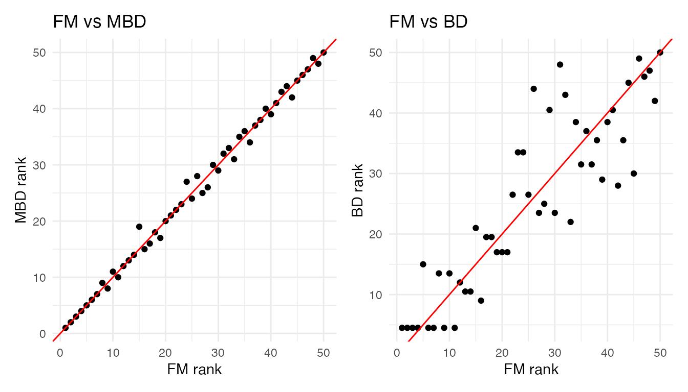
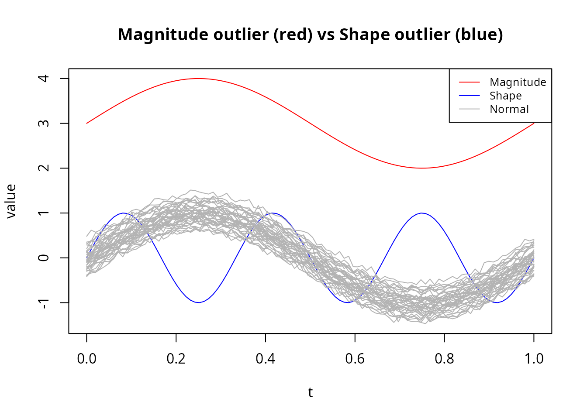
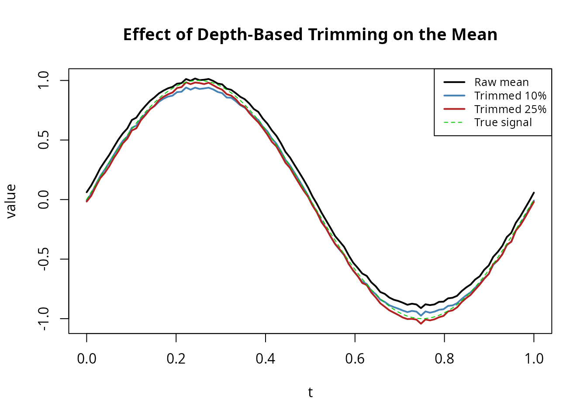
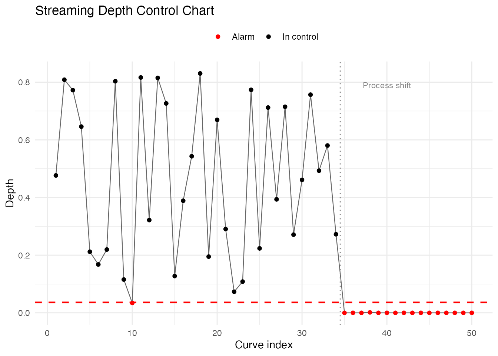
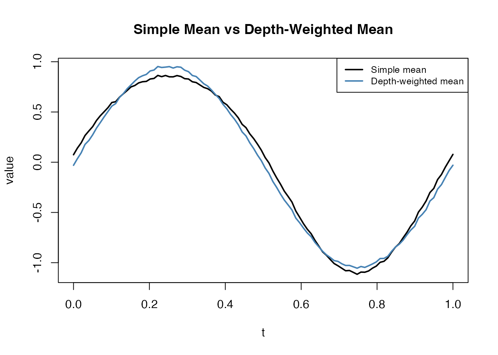

# Streaming Depth Computation

## Introduction

Standard depth computations require $O\left( N^{2}T \right)$ time for
$N$ curves on $T$ grid points, which becomes expensive for large
reference samples. **Streaming depth** decouples reference-set
construction from query evaluation: the reference data is pre-sorted at
each time point, enabling $O\left( T\log N \right)$ depth per query
curve.

This is particularly useful for:

- **Online monitoring**: Evaluating new curves as they arrive against a
  fixed reference
- **Large reference samples**: When $N$ is large, the
  $O\left( \log N \right)$ lookup is much faster than $O(N)$


## Self-Depth (Batch)

The simplest use case computes the depth of each curve relative to the
full dataset:

The outlier (curve 1) has the lowest depth:

``` r
cat("Outlier depth:", round(d_fm[1], 4), "\n")
#> Outlier depth: 0.0516
cat("Median depth:", round(median(d_fm[-1]), 4), "\n")
#> Median depth: 0.5552
```

## Monitoring New Curves

A key application is evaluating new observations against a fixed
reference sample:

``` r
# Split into reference and new data
ref <- fd[1:40]
new_curves <- fd[41:50]

# Compute depth of new curves against reference
d_new <- streaming.depth(new_curves, fdataori = ref, method = "FM")
round(d_new, 4)
#>  [1] 0.7700 0.6085 0.3785 0.3870 0.5795 0.2195 0.9125 0.6630 0.7855 0.3600
```

Curves with unusually low depth may be considered anomalous.

## Comparing FM, MBD, and BD

Three streaming depth methods are available:

- **FM** (Fraiman-Muniz): Integrates pointwise depth ranks; robust
  general-purpose
- **MBD** (Modified Band Depth): Based on fraction of time a curve is
  within bands; always in \[0, 1\]
- **BD** (Band Depth): All-or-nothing band containment; more
  conservative

``` r
d_fm <- streaming.depth(fd, method = "FM")
d_mbd <- streaming.depth(fd, method = "MBD")
d_bd <- streaming.depth(fd, method = "BD")

# Compare rankings
df <- data.frame(
  curve = 1:n,
  FM = d_fm,
  MBD = d_mbd,
  BD = d_bd
)

# Correlations between methods
round(cor(df[, -1]), 3)
#>        FM   MBD    BD
#> FM  1.000 0.974 0.923
#> MBD 0.974 1.000 0.938
#> BD  0.923 0.938 1.000
```

The methods generally agree on ranking, though MBD and FM tend to be
more concordant:

``` r
df_rank <- data.frame(
  FM = rank(d_fm), MBD = rank(d_mbd), BD = rank(d_bd)
)

p1 <- ggplot(df_rank, aes(x = FM, y = MBD)) +
  geom_point(size = 1.5) +
  geom_abline(slope = 1, intercept = 0, color = "red") +
  labs(title = "FM vs MBD", x = "FM rank", y = "MBD rank") +
  theme_minimal()

p2 <- ggplot(df_rank, aes(x = FM, y = BD)) +
  geom_point(size = 1.5) +
  geom_abline(slope = 1, intercept = 0, color = "red") +
  labs(title = "FM vs BD", x = "FM rank", y = "BD rank") +
  theme_minimal()

if (requireNamespace("patchwork", quietly = TRUE)) {
  library(patchwork)
  p1 + p2
} else {
  print(p1)
  print(p2)
}
```



## Outlier Detection

Depth naturally provides an outlier score: curves with low depth are far
from the centre of the distribution. A simple threshold on the depth
values identifies magnitude outliers (shifted too high or too low) and
shape outliers (unusual patterns).

### Threshold-Based Detection

``` r
# Depth-based threshold: flag curves below the 5th percentile
threshold <- quantile(d_fm, 0.05)
outlier_idx <- which(d_fm < threshold)
cat("Outlier indices:", outlier_idx, "\n")
#> Outlier indices: 1 30 37
cat("Outlier depths:", round(d_fm[outlier_idx], 4), "\n")
#> Outlier depths: 0.0516 0.0188 0.0812
```

### Combining with the Functional Boxplot

The functional boxplot uses depth to define a central region and fences.
Streaming depth can serve as the depth engine:

``` r
bp <- boxplot(fd, depth.func = depth.streaming)
cat("Functional boxplot outliers:", bp$outliers, "\n")
#> Functional boxplot outliers: 1
```

### Magnitude vs Shape Outliers

Different outlier types have different depth signatures. **Magnitude
outliers** (vertically shifted) are detected by all depth methods.
**Shape outliers** (unusual pattern but similar range) are harder — MBD
is particularly sensitive to them:

``` r
set.seed(42)
n <- 40
data_out <- matrix(0, n, m)
for (i in 1:n) {
  data_out[i, ] <- sin(2 * pi * argvals) + rnorm(1, 0, 0.2) + rnorm(m, 0, 0.05)
}

# Add a magnitude outlier (shifted up)
data_out[1, ] <- sin(2 * pi * argvals) + 3

# Add a shape outlier (different frequency)
data_out[2, ] <- sin(6 * pi * argvals)

fd_out <- fdata(data_out, argvals = argvals)

d_fm_out <- streaming.depth(fd_out, method = "FM")
d_mbd_out <- streaming.depth(fd_out, method = "MBD")

cat("Magnitude outlier (curve 1):\n")
#> Magnitude outlier (curve 1):
cat("  FM depth: ", round(d_fm_out[1], 4),
    "  MBD depth:", round(d_mbd_out[1], 4), "\n")
#>   FM depth:  0   MBD depth: 0.05
cat("Shape outlier (curve 2):\n")
#> Shape outlier (curve 2):
cat("  FM depth: ", round(d_fm_out[2], 4),
    "  MBD depth:", round(d_mbd_out[2], 4), "\n")
#>   FM depth:  0.193   MBD depth: 0.1718
cat("Typical curve (curve 3):\n")
#> Typical curve (curve 3):
cat("  FM depth: ", round(d_fm_out[3], 4),
    "  MBD depth:", round(d_mbd_out[3], 4), "\n")
#>   FM depth:  0.333   MBD depth: 0.3231
```

``` r
curve_type <- rep("Normal", n)
curve_type[1] <- "Magnitude"
curve_type[2] <- "Shape"

df_out <- data.frame(
  t = rep(argvals, each = n),
  value = as.vector(fd_out$data),
  curve = rep(1:n, times = m),
  type = rep(curve_type, times = m)
)

ggplot(df_out, aes(x = t, y = value, group = curve, color = type)) +
  geom_line(aes(alpha = type), linewidth = 0.5) +
  scale_color_manual(values = c("Magnitude" = "red", "Shape" = "blue", "Normal" = "grey70")) +
  scale_alpha_manual(values = c("Magnitude" = 1, "Shape" = 1, "Normal" = 0.5), guide = "none") +
  labs(title = "Magnitude outlier (red) vs Shape outlier (blue)",
       x = "t", y = "value", color = NULL) +
  theme_minimal() +
  theme(legend.position = "top")
```



## Depth-Based Trimming

Streaming depth can drive robust summary statistics. The **trimmed
mean** drops the least deep curves before averaging, providing a robust
functional mean that is less sensitive to outliers than `colMeans`:

``` r
# Use streaming depth for trimmed mean
tm_10 <- trimmed(fd_out, trim = 0.10, method = "FM")
tm_25 <- trimmed(fd_out, trim = 0.25, method = "FM")
raw_mean <- colMeans(fd_out$data)

cat("Max |raw mean - trimmed 10%|:", round(max(abs(raw_mean - tm_10$data)), 4), "\n")
#> Max |raw mean - trimmed 10%|: 0.0768
cat("Max |raw mean - trimmed 25%|:", round(max(abs(raw_mean - tm_25$data)), 4), "\n")
#> Max |raw mean - trimmed 25%|: 0.131
```

``` r
df_trim <- data.frame(
  t = rep(argvals, 4),
  value = c(raw_mean, as.numeric(tm_10$data), as.numeric(tm_25$data),
            sin(2 * pi * argvals)),
  Method = factor(rep(c("Raw mean", "Trimmed 10%", "Trimmed 25%", "True signal"),
                      each = m),
                  levels = c("Raw mean", "Trimmed 10%", "Trimmed 25%", "True signal"))
)

ggplot(df_trim, aes(x = t, y = value, color = Method, linetype = Method)) +
  geom_line(linewidth = 1) +
  scale_color_manual(values = c("Raw mean" = "black", "Trimmed 10%" = "steelblue",
                                "Trimmed 25%" = "firebrick", "True signal" = "green3")) +
  scale_linetype_manual(values = c("Raw mean" = "solid", "Trimmed 10%" = "solid",
                                   "Trimmed 25%" = "solid", "True signal" = "dashed")) +
  labs(title = "Effect of Depth-Based Trimming on the Mean",
       x = "t", y = "value") +
  theme_minimal() +
  theme(legend.position = "top")
```



With outliers present, trimming at 25% recovers a mean much closer to
the true generating function.

## Process Monitoring

A practical use case for streaming depth is **statistical process
control**: a reference sample defines “normal” behaviour, and incoming
curves are flagged when their depth falls below a control limit.

``` r
set.seed(42)

# Phase 1: Establish reference from in-control process
n_ref <- 100
data_ref <- matrix(0, n_ref, m)
for (i in 1:n_ref) {
  data_ref[i, ] <- sin(2 * pi * argvals) + rnorm(1, 0, 0.2) + rnorm(m, 0, 0.05)
}
fd_ref <- fdata(data_ref, argvals = argvals)

# Compute self-depth to establish control limit
d_ref <- streaming.depth(fd_ref, method = "FM")
control_limit <- quantile(d_ref, 0.01)  # 1st percentile
cat("Control limit (1st percentile):", round(control_limit, 4), "\n")
#> Control limit (1st percentile): 0.0361
```

``` r
# Phase 2: Monitor 50 new curves (some from a shifted process)
n_new <- 50
data_new <- matrix(0, n_new, m)
shift_point <- 35  # process shifts at curve 35
for (i in 1:n_new) {
  if (i < shift_point) {
    # In-control
    data_new[i, ] <- sin(2 * pi * argvals) + rnorm(1, 0, 0.2) + rnorm(m, 0, 0.05)
  } else {
    # Out-of-control: mean shift
    data_new[i, ] <- sin(2 * pi * argvals) + 0.8 + rnorm(1, 0, 0.2) + rnorm(m, 0, 0.05)
  }
}
fd_new <- fdata(data_new, argvals = argvals)

# Evaluate each new curve against reference
d_monitor <- streaming.depth(fd_new, fdataori = fd_ref, method = "FM")
alarms <- which(d_monitor < control_limit)
```

``` r
df_monitor <- data.frame(
  index = 1:n_new,
  depth = d_monitor,
  status = ifelse(d_monitor < control_limit, "Alarm", "In control")
)

ggplot(df_monitor, aes(x = index, y = depth, color = status)) +
  geom_line(color = "grey40", linewidth = 0.4) +
  geom_point(size = 1.5) +
  geom_hline(yintercept = control_limit, linetype = "dashed", color = "red", linewidth = 0.8) +
  geom_vline(xintercept = shift_point - 0.5, linetype = "dotted", color = "grey50") +
  annotate("text", x = shift_point + 5, y = max(d_monitor) * 0.95,
           label = "Process shift", color = "grey50", size = 3) +
  scale_color_manual(values = c("In control" = "black", "Alarm" = "red")) +
  labs(title = "Streaming Depth Control Chart",
       x = "Curve index", y = "Depth", color = NULL) +
  theme_minimal() +
  theme(legend.position = "top")
```



``` r
cat("Alarms at curves:", alarms, "\n")
#> Alarms at curves: 10 35 36 37 38 39 40 41 42 43 44 45 46 47 48 49 50
cat("First alarm:", min(alarms), "(shift at", shift_point, ")\n")
#> First alarm: 10 (shift at 35 )
```

The depth chart detects the process shift shortly after it occurs.
Unlike univariate control charts, this approach monitors the entire
curve shape simultaneously.

## Depth-Weighted Density Estimation

Depth values can weight curves for density estimation or visualization,
giving more influence to central curves and down-weighting outliers:

``` r
# Use depth as weights for a weighted mean
d_weights <- d_fm / sum(d_fm)
weighted_mean <- colSums(fd$data * d_weights)
simple_mean <- colMeans(fd$data)

df_wmean <- data.frame(
  t = rep(argvals, 2),
  value = c(simple_mean, weighted_mean),
  Method = rep(c("Simple mean", "Depth-weighted mean"), each = m)
)

ggplot(df_wmean, aes(x = t, y = value, color = Method)) +
  geom_line(linewidth = 1) +
  scale_color_manual(values = c("Simple mean" = "black", "Depth-weighted mean" = "steelblue")) +
  labs(title = "Simple Mean vs Depth-Weighted Mean",
       x = "t", y = "value") +
  theme_minimal() +
  theme(legend.position = "top")
```



The depth-weighted mean down-weights the outlier (curve 1), producing a
more representative central tendency.

## Performance: Streaming vs Standard Depth

Streaming depth is designed for the scenario where a reference sample is
fixed and many query curves must be evaluated. The pre-sorting step is
$O\left( NT\log N \right)$, but each subsequent query is only
$O\left( T\log N \right)$ instead of $O(NT)$:

``` r
set.seed(42)
sizes <- c(50, 100, 500, 1000)
m_perf <- 100
argvals_perf <- seq(0, 1, length.out = m_perf)

cat("Streaming depth timing (self-depth, FM method):\n")
#> Streaming depth timing (self-depth, FM method):
for (n_size in sizes) {
  data_perf <- matrix(rnorm(n_size * m_perf), n_size, m_perf)
  fd_perf <- fdata(data_perf, argvals = argvals_perf)
  t_elapsed <- system.time(streaming.depth(fd_perf, method = "FM"))["elapsed"]
  cat(sprintf("  N = %4d: %.4f sec\n", n_size, t_elapsed))
}
#>   N =   50: 0.0000 sec
#>   N =  100: 0.0000 sec
#>   N =  500: 0.0000 sec
#>   N = 1000: 0.0020 sec
```

For large reference samples with many incoming queries, the streaming
approach provides substantial speedup over recomputing standard depth
from scratch.

## Integration with the Depth Dispatcher

Streaming depth is available through the
[`depth()`](https://sipemu.github.io/fdars-r/reference/depth.md)
dispatcher:

``` r
d <- depth(fd, method = "streaming")
all.equal(d, streaming.depth(fd, method = "FM"))
#> [1] TRUE
```

The
[`depth.streaming()`](https://sipemu.github.io/fdars-r/reference/depth.streaming.md)
alias also works:

``` r
d2 <- depth.streaming(fd)
all.equal(d, d2)
#> [1] TRUE
```

## See Also

- `vignette("depth-functions", package = "fdars")` — functional depth
  measures and ranking
- `vignette("outlier-detection", package = "fdars")` — functional
  outlier detection methods

## References

- Fraiman, R. and Muniz, G. (2001). Trimmed means for functional data.
  *Test*, 10(2):419–440.
- Lopez-Pintado, S. and Romo, J. (2009). On the concept of depth for
  functional data. *Journal of the American Statistical Association*,
  104(486):718–734.
