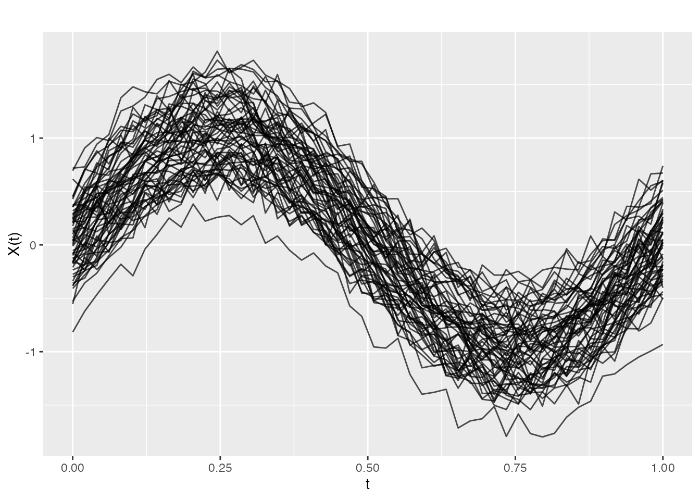
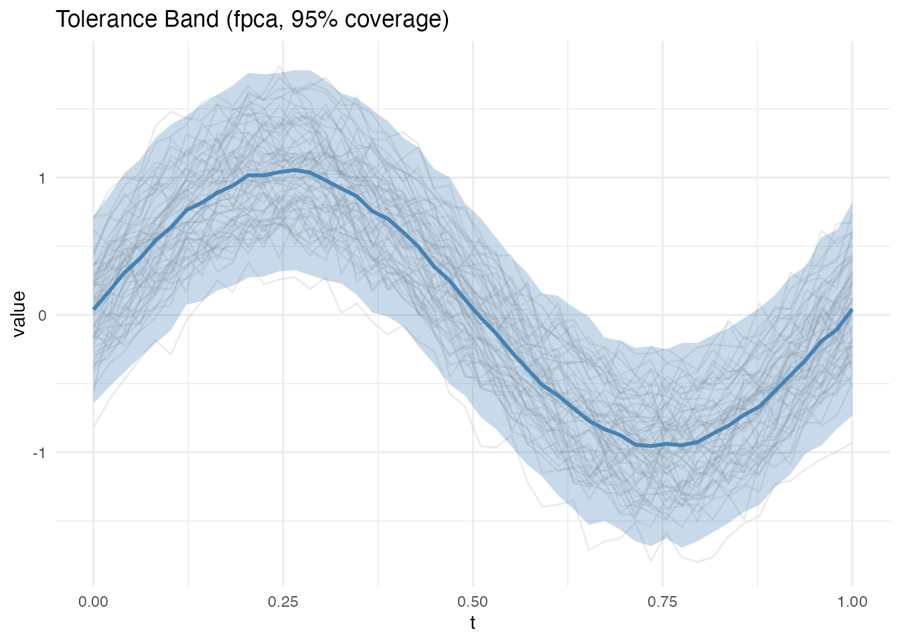
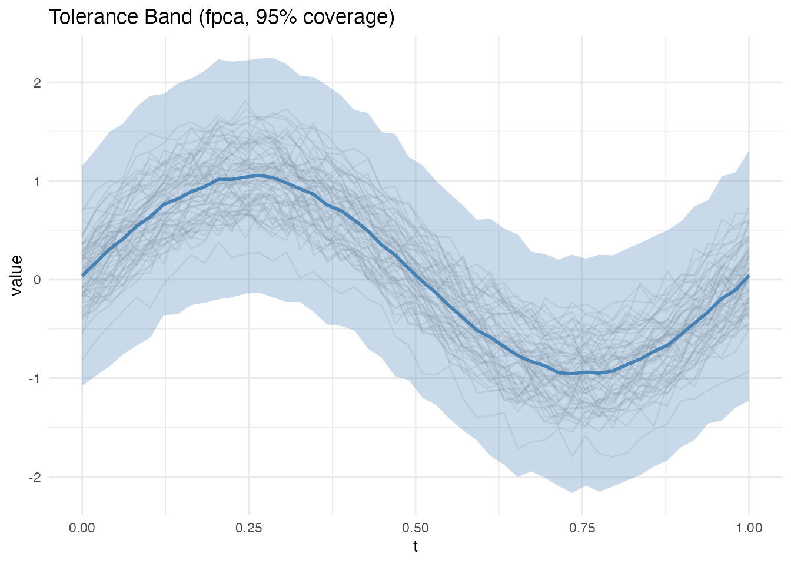
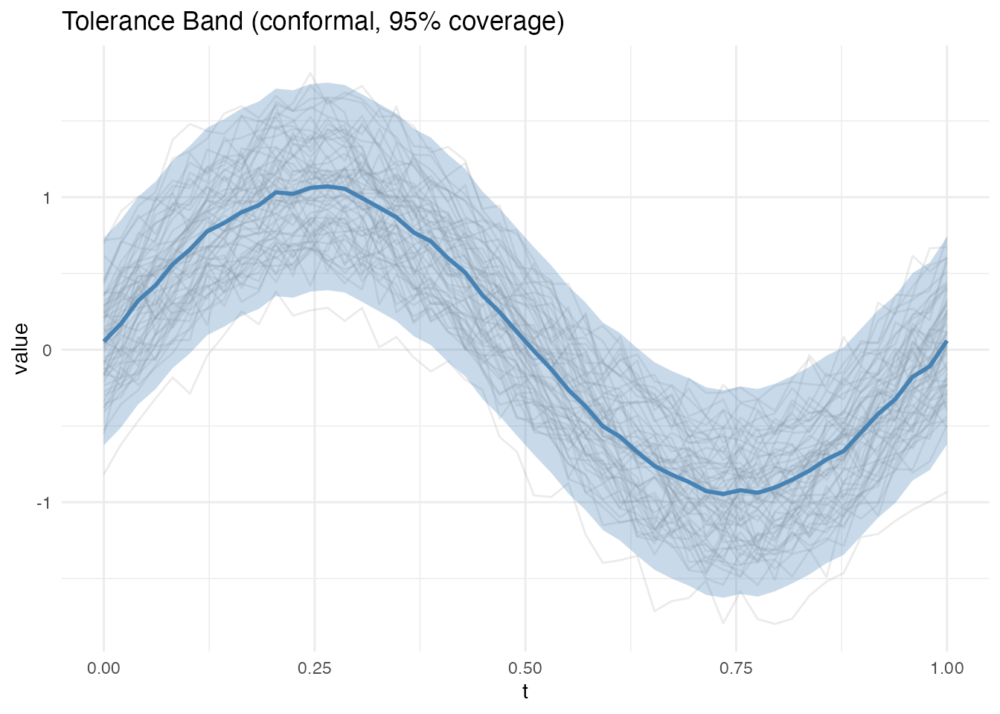
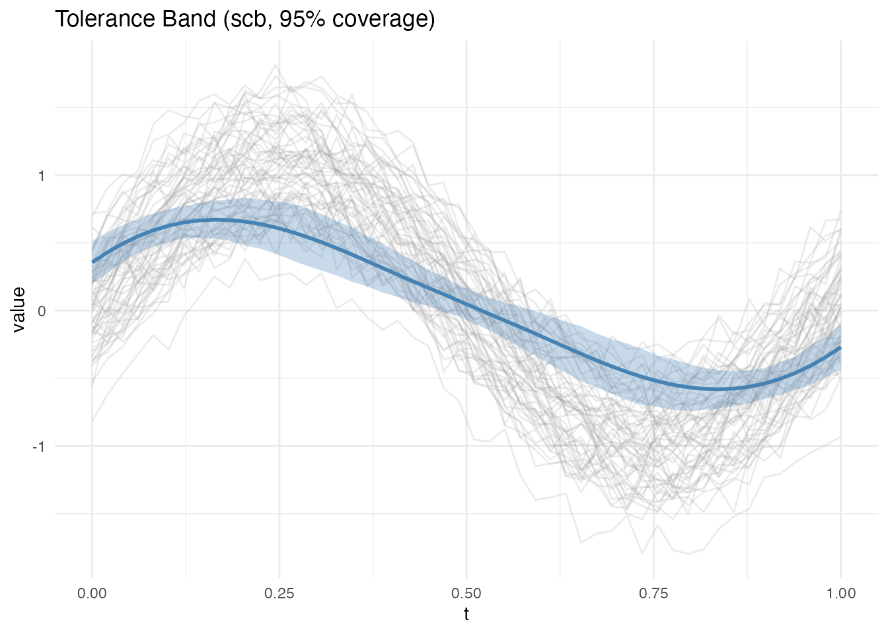
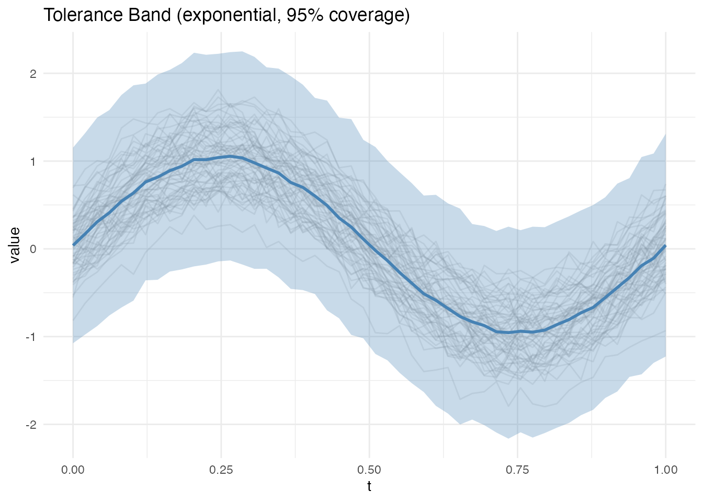
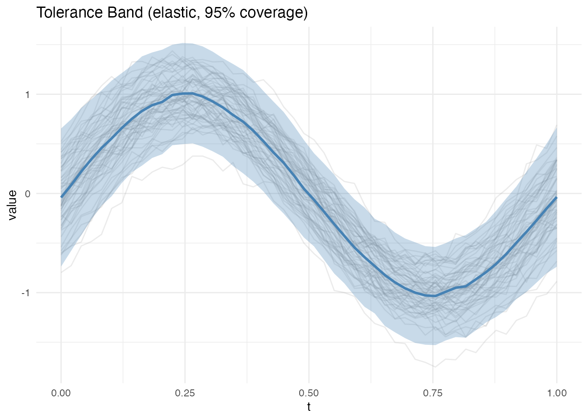

# Functional Tolerance Bands

## Introduction

A **tolerance band** for functional data is a region expected to contain
a given fraction of individual curves in the population – the functional
analogue of classical tolerance intervals. Unlike confidence bands
(which target the mean), tolerance bands characterize the spread of
individual curves.

**fdars** provides four tolerance band methods, plus a confidence band
for the mean:

**Tolerance bands** (for individual curves):

| Method             | Key Properties                                     |
|--------------------|----------------------------------------------------|
| FPCA               | Bootstrap on PC scores; pointwise or simultaneous  |
| Conformal          | Distribution-free; uses calibration/training split |
| Exponential family | For non-Gaussian data (Binomial, Poisson)          |
| Elastic            | Alignment-based; removes phase variability first   |

**Confidence band** (for the mean function):

| Method       | Key Properties                                                     |
|--------------|--------------------------------------------------------------------|
| SCB (Degras) | Simultaneous confidence band for the mean via multiplier bootstrap |

The distinction matters: a tolerance band captures the spread of
*individual curves* in the population, while a confidence band
quantifies the uncertainty in the estimated *mean function*. Tolerance
bands are always wider than confidence bands because individual curve
variability exceeds mean estimation uncertainty.

## How It Works (Intuition)

Imagine you have a collection of temperature curves measured over a
year. A tolerance band answers: “If I measure one more year, where will
the new curve likely fall?” The band should be wide enough to contain,
say, 95% of future curves.

The **FPCA method** breaks each curve into a mean shape plus a few
dominant modes of variation (principal components). It resamples the
scores on these modes to estimate where new curves might land.

The **conformal method** takes a simpler, assumption-free approach: it
holds out some curves, measures how far they deviate from the rest, and
uses those deviations directly to set band width. No distributional
assumptions needed.

The **elastic method** first aligns curves to remove timing differences
(phase variability), then builds a tolerance band on the aligned data.
This is useful when curves have the same shape but differ in timing –
the band is tighter because alignment concentrates the variability.

The **exponential family method** handles non-Gaussian data (e.g., count
data) by transforming to a natural parameter scale, computing bands
there, and transforming back.

Finally, the **SCB Degras method** is different in kind: it builds a
confidence band for the *mean function* rather than individual curves.
It answers “where does the true population mean lie?” rather than “where
will the next curve fall?”

## Mathematical Framework

### Setup

Let $X_{1},\ldots,X_{n}$ be i.i.d. random functions observed on a grid
$t_{1},\ldots,t_{T} \in \lbrack a,b\rbrack$ with mean function
$\mu(t) = E\left\lbrack X(t) \right\rbrack$ and covariance function
$C(s,t) = \text{Cov}\left( X(s),X(t) \right)$.

A **$(1 - \alpha)$-tolerance band** is a region
$\left\lbrack \ell(t),u(t) \right\rbrack$ such that

$$P(X_{\text{new}}(t) \in \left\lbrack \ell(t),u(t) \right\rbrack\;{\text{for all}\mspace{6mu}}t) \geq 1 - \alpha$$

for a new independent draw $X_{\text{new}}$ from the same process.

### FPCA Method (Rathnayake and Cuevas, 2016)

By the Karhunen-Loève expansion, each curve can be represented as

$$X_{i}(t) = \mu(t) + \sum\limits_{k = 1}^{K}\xi_{ik}\phi_{k}(t)$$

where $\phi_{k}$ are the eigenfunctions of $C$ and $\xi_{ik}$ are
uncorrelated PC scores with
$\text{Var}\left( \xi_{ik} \right) = \lambda_{k}$. The method proceeds:

1.  Estimate $\widehat{\mu}$, ${\widehat{\phi}}_{k}$, and scores
    ${\widehat{\xi}}_{ik}$ from data
2.  Bootstrap: resample ${\widehat{\xi}}_{ik}^{*}$ from the empirical
    score distribution and reconstruct
    $X_{i}^{*}(t) = \widehat{\mu}(t) + \sum_{k = 1}^{K}{\widehat{\xi}}_{ik}^{*}{\widehat{\phi}}_{k}(t)$
3.  **Pointwise band**: At each $t_{j}$, set $\ell\left( t_{j} \right)$
    and $u\left( t_{j} \right)$ to the $\alpha/2$ and $1 - \alpha/2$
    quantiles of the bootstrap distribution
4.  **Simultaneous band**: Find the smallest $c > 0$ such that a
    fraction $\geq 1 - \alpha$ of bootstrap curves lie entirely within
    $\widehat{\mu}(t) \pm c \cdot \widehat{\sigma}(t)$, where
    $\widehat{\sigma}(t)$ is the pointwise bootstrap standard deviation

The simultaneous band is wider (controls family-wise coverage) while the
pointwise band is narrower (controls marginal coverage at each $t$).

### Conformal Method (Lei and Wasserman, 2014)

The conformal approach is distribution-free. Split the data into a
training set of size $n_{\text{train}}$ and a calibration set of size
$n_{\text{cal}}$:

1.  Compute $\widehat{\mu}(t)$ from the training set
2.  For each calibration curve $X_{j}$, compute a non-conformity score:
    - **Sup-norm**:
      $R_{j} = \sup_{t}\left| X_{j}(t) - \widehat{\mu}(t) \right|$
    - **$L^{2}$**:
      $R_{j} = (\int\left| X_{j}(t) - \widehat{\mu}(t) \right|^{2}\, dt)^{1/2}$
3.  Set $\widehat{q}$ to the
    $\lceil(1 - \alpha)\left( n_{\text{cal}} + 1 \right)\rceil/n_{\text{cal}}$
    quantile of $\{ R_{1},\ldots,R_{n_{\text{cal}}}\}$
4.  The band is $\widehat{\mu}(t) \pm \widehat{q}$ (sup-norm) or
    $\widehat{\mu}(t) \pm \widehat{q} \cdot w(t)$ ($L^{2}$, with local
    weights)

The key guarantee is finite-sample validity:
$P\left( R_{\text{new}} \leq \widehat{q} \right) \geq 1 - \alpha$, with
no distributional assumptions.

### SCB Degras Method (Degras, 2011)

This constructs a **simultaneous confidence band for the mean** $\mu(t)$
rather than a tolerance band for individual curves. Let

$$S_{n}(t) = \frac{\sqrt{n}\left( {\bar{X}}_{n}(t) - \mu(t) \right)}{\widehat{\sigma}(t)}$$

be the standardized process. Under regularity conditions, $S_{n}$
converges to a Gaussian process $G$ with known covariance structure. The
critical value $c_{\alpha}$ is obtained via a multiplier bootstrap:

1.  Generate
    $W_{1}^{*},\ldots,W_{n}^{*}\overset{\text{iid}}{\sim}N(0,1)$
2.  Compute
    $G^{*}(t) = \frac{1}{\sqrt{n}\widehat{\sigma}(t)}\sum_{i = 1}^{n}W_{i}^{*}\left( X_{i}(t) - {\bar{X}}_{n}(t) \right)$
3.  Set \$c\_= \$ the $(1 - \alpha)$-quantile of
    $\sup_{t}\left| G^{*}(t) \right|$ across bootstrap replicates

The SCB is then
${\bar{X}}_{n}(t) \pm c_{\alpha}\widehat{\sigma}(t)/\sqrt{n}$.

### Exponential Family Method

For functional data from an exponential family with density

$$f\left( x|\theta \right) = h(x)\exp\left( \theta x - A(\theta) \right)$$

the method applies the canonical link $g$ to transform data to the
natural parameter scale, computes FPCA tolerance bands on the
transformed data, and maps back through $g^{- 1}$:

1.  Transform: $Y_{i}(t) = g\left( X_{i}(t) \right)$
2.  Compute FPCA band $\left\lbrack \ell_{Y}(t),u_{Y}(t) \right\rbrack$
    on $\{ Y_{i}\}$
3.  Back-transform: $\ell(t) = g^{- 1}\left( \ell_{Y}(t) \right)$,
    $u(t) = g^{- 1}\left( u_{Y}(t) \right)$

For Gaussian data ($g = \text{identity}$), this reduces to the standard
FPCA band. For Poisson data ($g = \log$), the band respects the
non-negativity constraint.

### Elastic Method

When curves exhibit **phase variability** (horizontal shifts), standard
tolerance bands are inflated because they treat timing differences as
amplitude variation. The elastic method removes this:

1.  Compute the Karcher mean ${\widehat{\mu}}_{K}$ and warping functions
    ${\widehat{\gamma}}_{1},\ldots,{\widehat{\gamma}}_{n}$ using the
    elastic (Fisher-Rao) framework
2.  Align:
    ${\widetilde{X}}_{i}(t) = X_{i}\left( {\widehat{\gamma}}_{i}(t) \right)$
3.  Compute an FPCA tolerance band on the aligned data
    $\{{\widetilde{X}}_{i}\}$

The resulting band is tighter because alignment concentrates variability
into the amplitude component, reducing the effective variance at each
grid point.

## Generate Sample Data

``` r
library(fdars)
#> 
#> Attaching package: 'fdars'
#> The following objects are masked from 'package:stats':
#> 
#>     cov, decompose, deriv, median, sd, var
#> The following object is masked from 'package:base':
#> 
#>     norm
set.seed(42)

argvals <- seq(0, 1, length.out = 50)
n <- 60
data <- matrix(0, n, 50)
for (i in 1:n) {
  data[i, ] <- sin(2 * pi * argvals) + rnorm(1, 0, 0.3) +
               rnorm(50, 0, 0.1)
}
fd <- fdata(data, argvals = argvals)
plot(fd)
```



## FPCA Bootstrap Band

The FPCA method reconstructs curves from their principal component
scores and uses bootstrap resampling to estimate quantiles. Two types
are available:

- **Pointwise**: Independent interval at each evaluation point
  (narrower)
- **Simultaneous**: Single scaling factor across all points (wider,
  controls family-wise error)

``` r
band_pw <- tolerance.band(fd, method = "fpca", coverage = 0.95,
                          band.type = "pointwise", nb = 200, seed = 42)
print(band_pw)
#> Functional Tolerance Band
#>   Method: fpca 
#>   Coverage: 0.95 
#>   Grid points: 50 
#>   Mean half-width: 0.7171
plot(band_pw)
```



``` r
band_sim <- tolerance.band(fd, method = "fpca", coverage = 0.95,
                           band.type = "simultaneous", nb = 200, seed = 42)
plot(band_sim)
```



## Conformal Prediction Band

The conformal method is **distribution-free**: it makes no parametric
assumptions about the data-generating process. It splits data into a
training set and calibration set, computing non-conformity scores on the
calibration set to determine band width.

Two score types are available: - **supnorm**: Maximum deviation
(constant band width) - **l2**: Integrated squared deviation (variable
band width)

``` r
band_conf <- tolerance.band(fd, method = "conformal", coverage = 0.95,
                            score.type = "supnorm", seed = 42)
plot(band_conf)
```



## Mean Confidence Band (SCB Degras)

The Degras (2011) method is fundamentally different from the tolerance
band methods above. It constructs a **simultaneous confidence band for
the mean function** $\mu(t) = E\left\lbrack X(t) \right\rbrack$, not a
tolerance band for individual curves.

**What it tells you**: “The true population mean lies within this band
with 95% confidence.” The band shrinks as
$\left. n\rightarrow\infty \right.$ because we estimate the mean more
precisely. In contrast, tolerance bands do *not* shrink with $n$ – they
target the spread of individual curves, which is a fixed population
property.

**How it works**: The method standardizes the empirical process
$\sqrt{n}\left( {\bar{X}}_{n}(t) - \mu(t) \right)/\widehat{\sigma}(t)$
and uses a multiplier bootstrap to estimate the distribution of its
supremum. The critical value $c_{\alpha}$ controls the family-wise
coverage across all $t$ simultaneously – the band is valid uniformly
over the entire domain, not just pointwise.

**When to use it**:

- Testing whether a hypothesized mean function falls within the band
- Comparing mean functions across groups (non-overlapping SCBs indicate
  significant differences)
- Assessing sample size adequacy (very wide SCBs suggest more data is
  needed)

``` r
band_scb <- tolerance.band(fd, method = "scb", coverage = 0.95,
                           nb = 200, seed = 42)
plot(band_scb)
```



Note how much narrower the SCB is compared to the tolerance bands above
– it targets the mean, not individual curves. The width scales as
$O\left( 1/\sqrt{n} \right)$.

## Exponential Family Band

For data from exponential family distributions (e.g., count data), the
exponential family method applies the appropriate link function
transformation before computing FPCA bands:

``` r
# Gaussian data (identity link)
band_exp <- tolerance.band(fd, method = "exponential", family = "gaussian",
                           nb = 200, seed = 42)
plot(band_exp)
```



## Elastic (Alignment-Based) Band

The elastic method first aligns curves using the Karcher mean in the
elastic metric, removing phase variability. It then computes an FPCA
tolerance band on the aligned data. This produces tighter bands when
curves exhibit timing differences:

``` r
# Generate data with phase variability
set.seed(42)
data_phase <- matrix(0, n, 50)
for (i in 1:n) {
  shift <- runif(1, -0.05, 0.05)
  data_phase[i, ] <- sin(2 * pi * (argvals - shift)) + rnorm(1, 0, 0.2) +
                     rnorm(50, 0, 0.05)
}
fd_phase <- fdata(data_phase, argvals = argvals)

band_elastic <- tolerance.band(fd_phase, method = "elastic", coverage = 0.95,
                               nb = 200, max.iter = 10, seed = 42)
print(band_elastic)
#> Functional Tolerance Band
#>   Method: elastic 
#>   Coverage: 0.95 
#>   Grid points: 50 
#>   Mean half-width: 0.5351
plot(band_elastic)
```



Compare the elastic band to FPCA on the same phase-shifted data:

``` r
band_fpca_phase <- tolerance.band(fd_phase, method = "fpca", coverage = 0.95,
                                  nb = 200, seed = 42)
cat("FPCA mean half-width:   ", round(mean(band_fpca_phase$half_width), 4), "\n")
#> FPCA mean half-width:    0.5563
cat("Elastic mean half-width:", round(mean(band_elastic$half_width), 4), "\n")
#> Elastic mean half-width: 0.5351
```

The elastic band is narrower because alignment concentrates variance
into amplitude rather than spreading it across both amplitude and phase.

## Choosing a Method

| Your goal                       | Recommended method                     |
|---------------------------------|----------------------------------------|
| General-purpose tolerance band  | FPCA (`method = "fpca"`)               |
| No distributional assumptions   | Conformal (`method = "conformal"`)     |
| Data with timing differences    | Elastic (`method = "elastic"`)         |
| Count or binary functional data | Exponential (`method = "exponential"`) |
| Confidence band for the mean    | SCB Degras (`method = "scb"`)          |

## References

- Rathnayake, L.N. and Cuevas, A. (2016). Tolerance bands for functional
  data. *Technometrics*, 58(3):326–334.
- Lei, J. and Wasserman, L. (2014). Distribution-free prediction bands
  for non-parametric regression. *Journal of the Royal Statistical
  Society: Series B*, 76(1):71–96.
- Degras, D. (2011). Simultaneous confidence bands for nonparametric
  regression with functional data. *Statistica Sinica*, 21(4):1735–1765.
