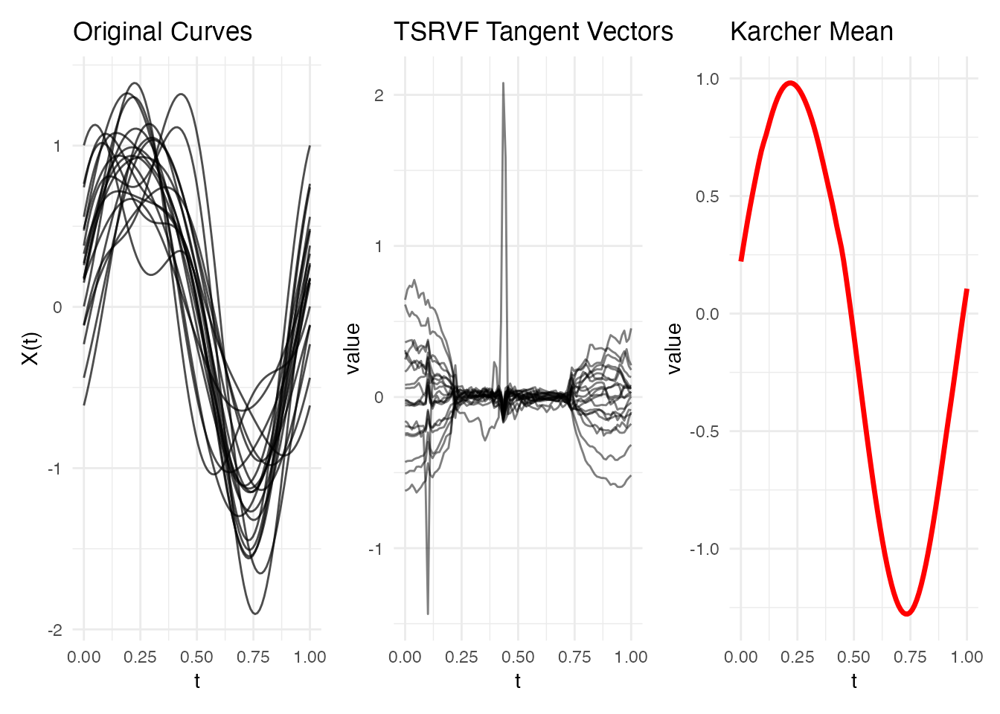
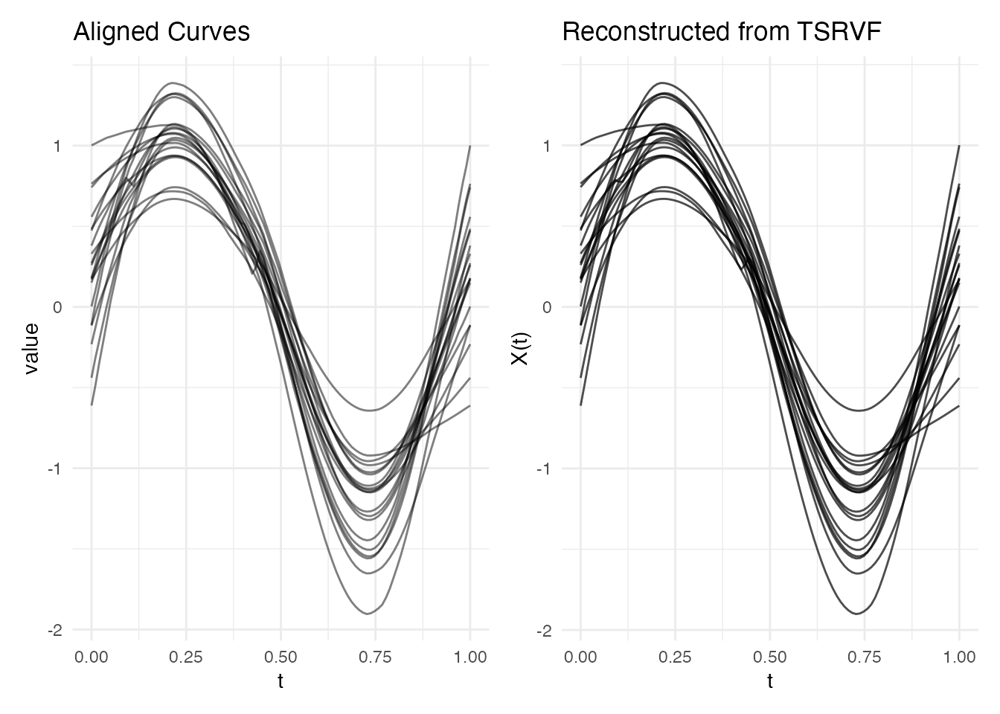
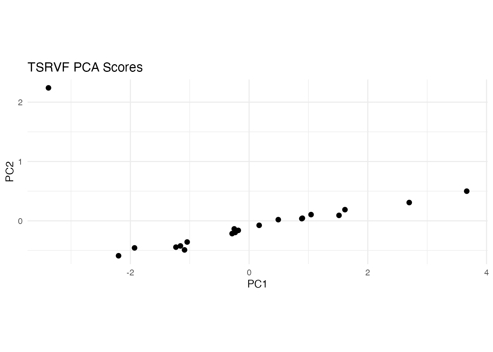
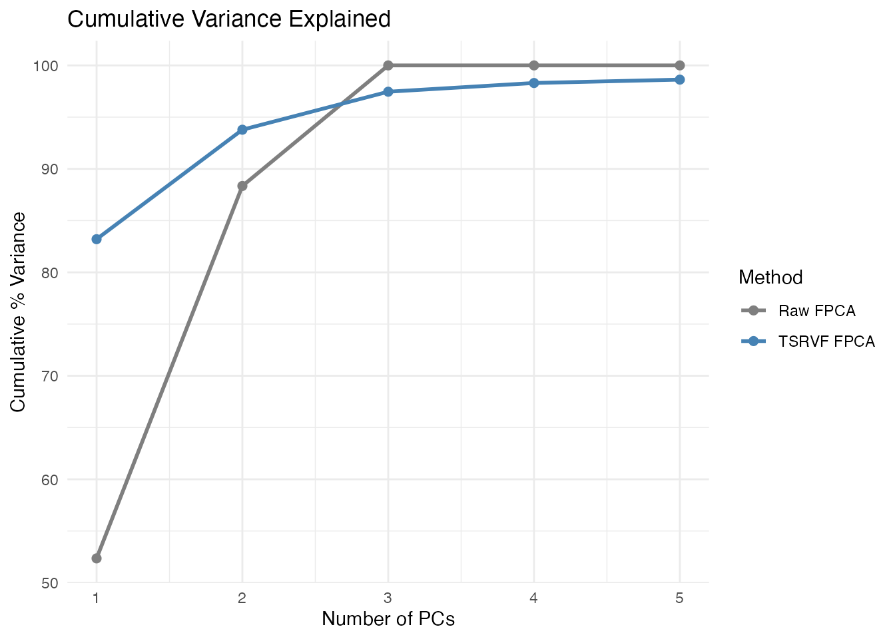

# TSRVF: Linearized Elastic Analysis

## Introduction

After elastic alignment, the aligned curves live on a **nonlinear
manifold** – the quotient space $\mathcal{F}/\Gamma$ of functions modulo
reparameterization. Standard linear operations (PCA, regression,
hypothesis testing) are not directly valid on this curved space.

The **Transported Square-Root Velocity Function (TSRVF)** solves this by
mapping aligned curves to a **tangent space** at the Karcher mean, where
the geometry is locally Euclidean. In this tangent space, standard
multivariate methods apply directly, giving a rigorous framework for
**elastic functional data analysis**.

``` r
library(fdars)
#> 
#> Attaching package: 'fdars'
#> The following objects are masked from 'package:stats':
#> 
#>     cov, decompose, deriv, median, sd, var
#> The following object is masked from 'package:base':
#> 
#>     norm
library(ggplot2)
library(patchwork)
theme_set(theme_minimal())
```

## How It Works (Intuition)

After elastic alignment, curve shapes live on a curved surface (a
manifold) – think of points on the surface of a globe. Standard
statistical methods like PCA assume data lives in a flat space (like a
map), so applying them directly to aligned curves introduces distortion.

The TSRVF solves this by **projecting curves onto a flat tangent plane**
at the mean shape – like laying a flat map tangent to the globe at one
point. Near the point of contact, the map is a good approximation of the
globe’s surface.

Each curve becomes a **tangent vector** – a direction and magnitude
showing how that curve’s shape differs from the mean. These tangent
vectors live in ordinary Euclidean space, so you can:

- Run **PCA** to find the main modes of shape variation
- Use **regression** with tangent vectors as predictors
- Apply any **clustering** or **classification** method that works with
  vectors

The projection is invertible: you can go from tangent vectors back to
curves (by “projecting back onto the globe”), so you can reconstruct
curves from their PC scores or model predictions.

## Mathematical Framework

### The Shape Space

Let $\mathcal{F}$ denote the space of absolutely continuous functions
$\left. f:\lbrack 0,1\rbrack\rightarrow{\mathbb{R}} \right.$, and let
$\Gamma$ be the warping group of orientation-preserving diffeomorphisms
of $\lbrack 0,1\rbrack$. The **shape space** is the quotient:

$$\mathcal{S} = \mathcal{F}/\Gamma$$

where two functions $f_{1},f_{2}$ are equivalent if
$f_{1} = f_{2} \circ \gamma$ for some $\gamma \in \Gamma$. Points in
$\mathcal{S}$ represent curve *shapes*, stripped of parameterization
effects.

Via the SRSF transform
$q(t) = \text{sign}\left( f\prime(t) \right)\sqrt{\left| f\prime(t) \right|}$,
the shape space is isometric to the quotient of the unit Hilbert sphere
${\mathbb{S}}^{\infty} \subset L^{2}$ by $\Gamma$. This is a nonlinear
manifold with nontrivial curvature.

### Exponential and Logarithmic Maps

At a point $\lbrack\mu\rbrack$ on the shape space (represented by the
Karcher mean), the **tangent space** $T_{\lbrack\mu\rbrack}\mathcal{S}$
is a flat (Euclidean) vector space. The **exponential map**
$\exp_{\lbrack\mu\rbrack}$ projects from the tangent space onto the
manifold, and the **logarithmic map** $\log_{\lbrack\mu\rbrack}$ does
the reverse:

$$v_{i} = \log_{\lbrack\mu\rbrack}\left( \left\lbrack f_{i} \right\rbrack \right) \in T_{\lbrack\mu\rbrack}\mathcal{S}$$

These tangent vectors $v_{i}$ are the TSRVF representation. They capture
how each curve’s *shape* differs from the mean, in a coordinate system
where Euclidean distances approximate geodesic distances on the
manifold.

### The TSRVF Transform

Given aligned SRSFs
${\widetilde{q}}_{i} = \left( q_{i} \circ \gamma_{i}^{*} \right)\sqrt{{\dot{\gamma}}_{i}^{*}}$
and the mean SRSF $\bar{q}$ (the Karcher mean in SRSF space), the TSRVF
of the $i$-th curve is computed via the **inverse exponential map** on
the sphere:

$$v_{i} = \frac{\theta_{i}}{\sin\left( \theta_{i} \right)}\left( {\widetilde{q}}_{i} - \cos\left( \theta_{i} \right)\,\bar{q} \right)$$

where
$\theta_{i} = \cos^{- 1}\left( \langle{\widetilde{q}}_{i},\bar{q}\rangle_{L^{2}} \right)$
is the geodesic distance between ${\widetilde{q}}_{i}$ and $\bar{q}$ on
the sphere.

Key properties:

1.  **$v_{i} \in T_{\bar{q}}{\mathbb{S}}^{\infty}$**: the tangent
    vectors are orthogonal to $\bar{q}$, i.e.,
    $\langle v_{i},\bar{q}\rangle = 0$
2.  **Euclidean distances approximate geodesic distances**:
    $\parallel v_{i} - v_{j} \parallel_{L^{2}} \approx d_{e}\left( f_{i},f_{j} \right)$
    for curves near the mean
3.  **Linear operations are valid**: addition, scalar multiplication,
    inner products in the tangent space have geometric meaning

### Inverse Transform

To reconstruct a curve from its tangent vector $v$, we apply the
**exponential map**:

$$\widetilde{q} = \cos( \parallel v \parallel )\,\bar{q} + \sin( \parallel v \parallel )\,\frac{v}{\parallel v \parallel}$$

This gives the aligned SRSF, from which the aligned curve is recovered
via SRSF inversion.

## Quick Start

``` r
set.seed(42)
argvals <- seq(0, 1, length.out = 100)

# Simulate curves with amplitude and phase variation
n <- 20
data <- matrix(0, n, 100)
for (i in 1:n) {
  amp <- rnorm(1, 1, 0.2)
  shift <- runif(1, -0.08, 0.08)
  data[i, ] <- amp * sin(2 * pi * (argvals - shift)) +
               0.3 * rnorm(1) * cos(4 * pi * argvals)
}
fd <- fdata(data, argvals = argvals)

# Compute TSRVF
tv <- tsrvf.transform(fd, max.iter = 15, tol = 1e-4)
print(tv)
#> TSRVF (Transported SRSF)
#>   Curves: 20 x 100 grid points
#>   Converged: TRUE
```

``` r
p1 <- plot(fd) + labs(title = "Original Curves")
p2 <- plot(tv, type = "tangent") + labs(title = "TSRVF Tangent Vectors")
p3 <- plot(tv, type = "mean")
p1 + p2 + p3
```



The tangent vectors represent each curve’s shape deviation from the mean
in a Euclidean space – ready for PCA, regression, or any linear method.

## From a Pre-Computed Alignment

If you have already computed a Karcher mean (which is the expensive
step), you can obtain the TSRVF without re-running the alignment:

``` r
km <- karcher.mean(fd, max.iter = 15)
tv_from <- tsrvf.from.alignment(km)

# Same tangent space, no extra alignment cost
cat("Dimensions:", nrow(tv_from$tangent_vectors$data), "x",
    ncol(tv_from$tangent_vectors$data), "\n")
#> Dimensions: 20 x 100
```

## Inverse Transform

The TSRVF is invertible – you can reconstruct (aligned) curves from
their tangent vectors:

``` r
recon <- tsrvf.inverse(tv)

# Compare original aligned curves to reconstruction
p1 <- plot(km, type = "aligned") + labs(title = "Aligned Curves")
p2 <- plot(recon) + labs(title = "Reconstructed from TSRVF")
p1 + p2
```



## TSRVF-Based PCA

The main application of TSRVF is enabling standard PCA in the tangent
space. This gives **elastic FPCA** – principal components that respect
the geometry of the shape space.

``` r
# Standard PCA on tangent vectors
tv_data <- tv$tangent_vectors$data
pca_result <- prcomp(tv_data, center = TRUE, scale. = FALSE)

# Variance explained
var_explained <- pca_result$sdev^2 / sum(pca_result$sdev^2)
cat("Variance explained by first 3 PCs:",
    round(cumsum(var_explained)[1:3] * 100, 1), "%\n")
#> Variance explained by first 3 PCs: 83.2 93.8 97.5 %
```

``` r
scores <- pca_result$x[, 1:2]
df_scores <- data.frame(PC1 = scores[, 1], PC2 = scores[, 2])

ggplot(df_scores, aes(x = PC1, y = PC2)) +
  geom_point(size = 2) +
  labs(title = "TSRVF PCA Scores", x = "PC1", y = "PC2") +
  coord_equal()
```



### Comparison: Raw FPCA vs TSRVF FPCA

Standard FPCA on the raw (unaligned) data confounds amplitude and phase
variation. TSRVF FPCA operates on aligned shapes, so the principal
components capture only amplitude variation:

``` r
# Raw FPCA
raw_pca <- prcomp(fd$data, center = TRUE, scale. = FALSE)
raw_var <- raw_pca$sdev^2 / sum(raw_pca$sdev^2)

# TSRVF FPCA
tsrvf_var <- var_explained

df_var <- data.frame(
  PC = rep(1:5, 2),
  Variance = c(cumsum(raw_var[1:5]), cumsum(tsrvf_var[1:5])) * 100,
  Method = rep(c("Raw FPCA", "TSRVF FPCA"), each = 5)
)

ggplot(df_var, aes(x = PC, y = Variance, color = Method)) +
  geom_line(linewidth = 1) +
  geom_point(size = 2) +
  labs(title = "Cumulative Variance Explained",
       x = "Number of PCs", y = "Cumulative % Variance") +
  scale_color_manual(values = c("Raw FPCA" = "grey50", "TSRVF FPCA" = "steelblue"))
```



TSRVF FPCA typically needs fewer components because it has already
removed phase variation – the remaining amplitude variation is
lower-dimensional.

## When to Use TSRVF

| Scenario                              | Recommended approach                                                                                                                                              |
|---------------------------------------|-------------------------------------------------------------------------------------------------------------------------------------------------------------------|
| Exploratory alignment & visualization | [`karcher.mean()`](https://sipemu.github.io/fdars-r/reference/karcher.mean.md) / [`elastic.align()`](https://sipemu.github.io/fdars-r/reference/elastic.align.md) |
| PCA on aligned data                   | [`tsrvf.transform()`](https://sipemu.github.io/fdars-r/reference/tsrvf.transform.md) + [`prcomp()`](https://rdrr.io/r/stats/prcomp.html)                          |
| Regression with aligned predictors    | [`tsrvf.transform()`](https://sipemu.github.io/fdars-r/reference/tsrvf.transform.md) + standard regression                                                        |
| Clustering aligned curves             | [`tsrvf.transform()`](https://sipemu.github.io/fdars-r/reference/tsrvf.transform.md) + any Euclidean clustering                                                   |
| Classification                        | TSRVF scores as features                                                                                                                                          |

The key insight: **TSRVF converts a nonlinear shape analysis problem
into a standard multivariate statistics problem**, at the cost of a
one-time alignment step.

## See Also

- `vignette("elastic-alignment", package = "fdars")` – the underlying
  alignment framework
- [`karcher.mean()`](https://sipemu.github.io/fdars-r/reference/karcher.mean.md)
  – compute the Karcher mean (prerequisite for TSRVF)
- [`alignment.quality()`](https://sipemu.github.io/fdars-r/reference/alignment.quality.md)
  – diagnostics for the alignment step
