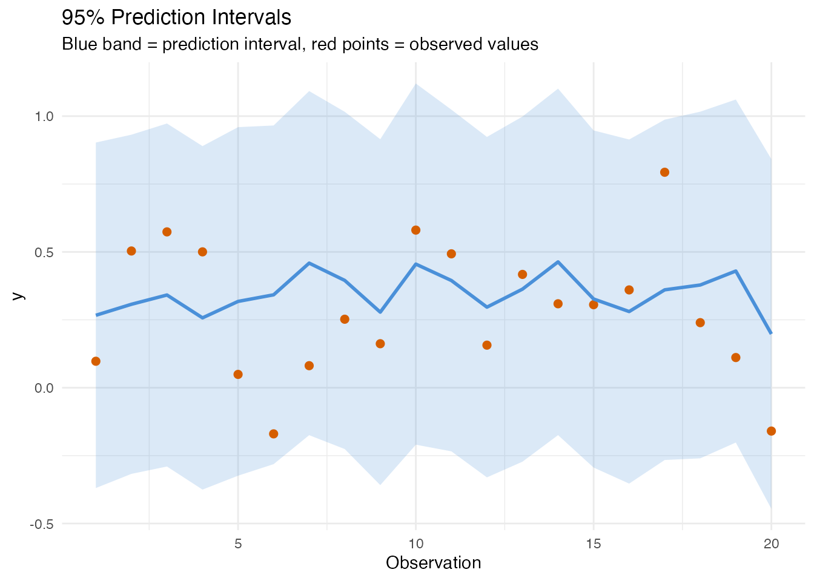
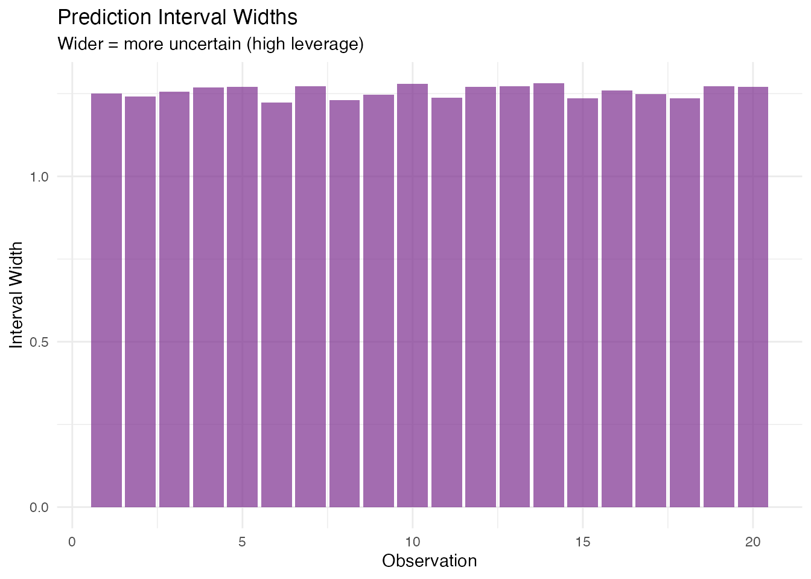
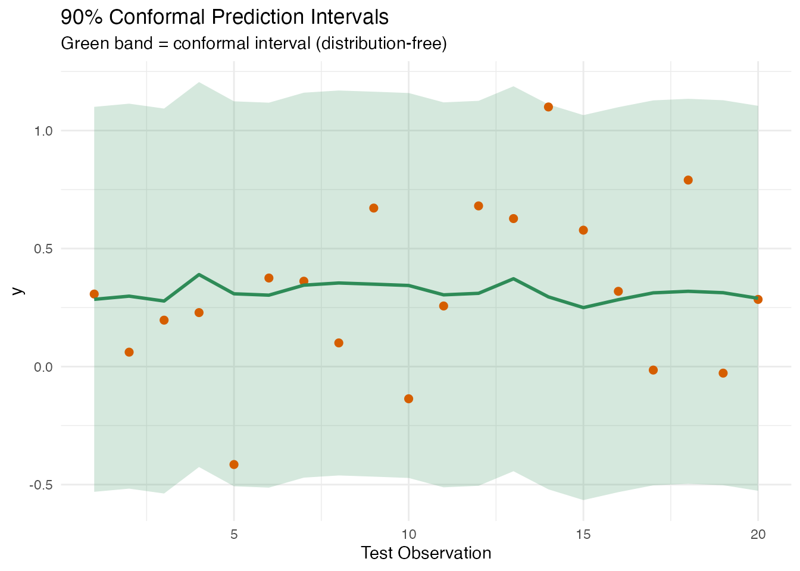
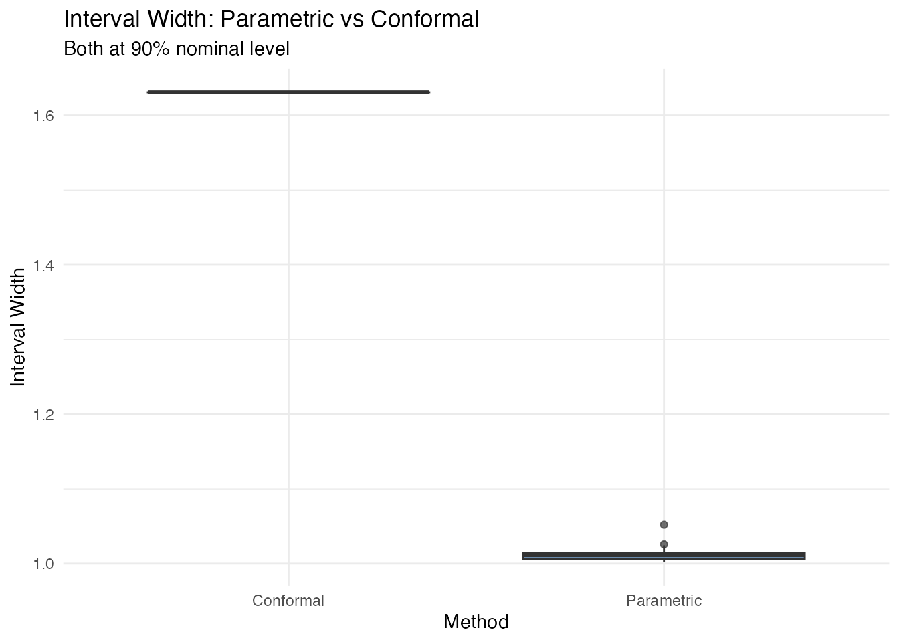
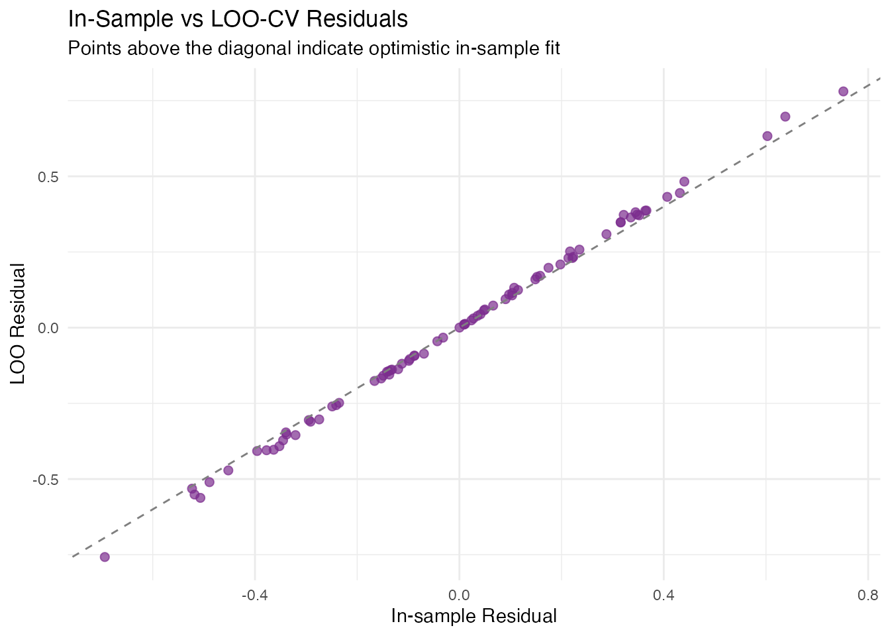
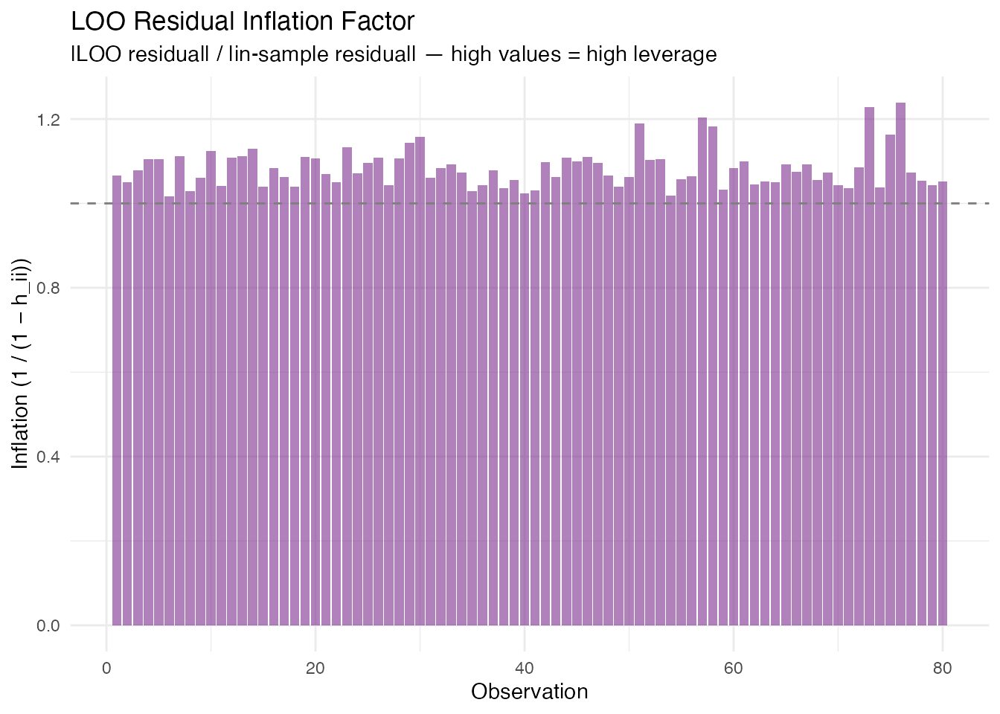
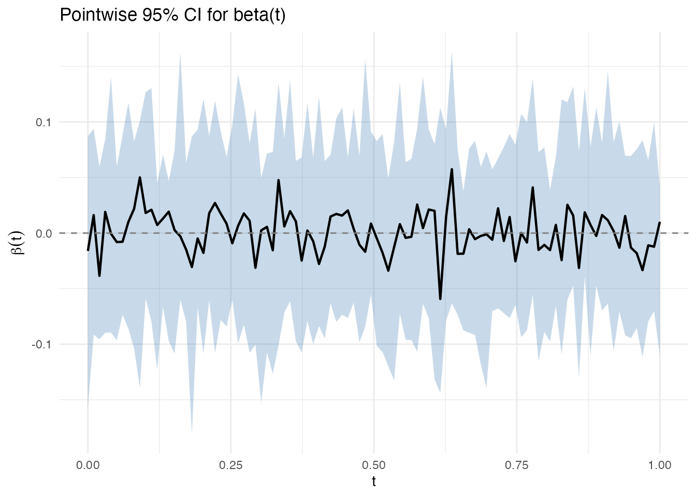
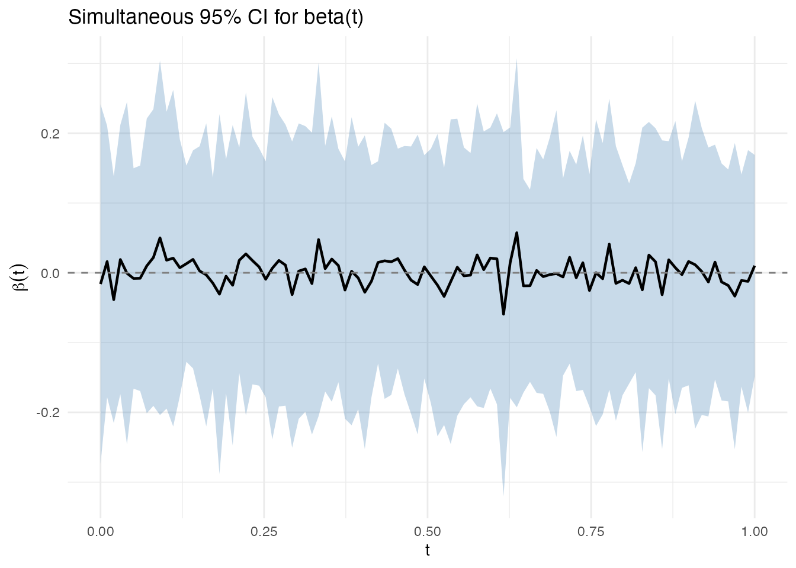
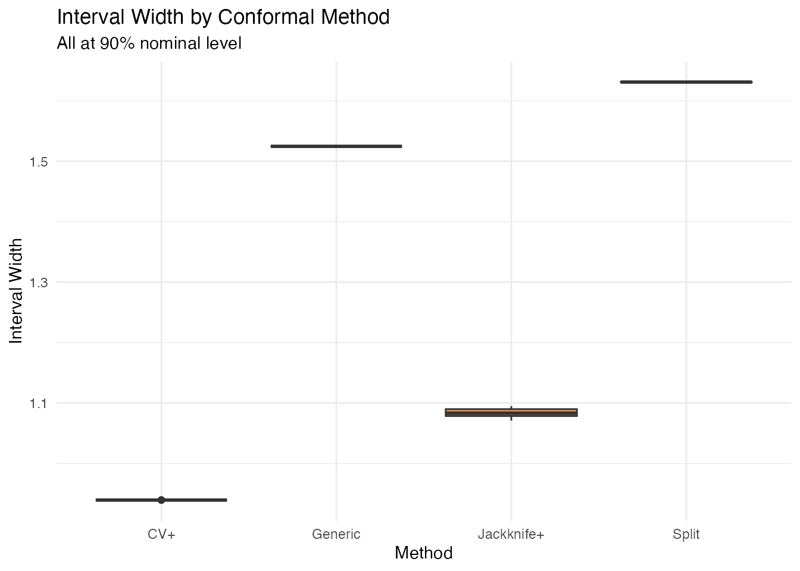

# Uncertainty Quantification

## Overview

Point predictions alone are insufficient for critical applications.
**fdars** provides four complementary approaches to uncertainty
quantification for functional regression models:


| Method                      | Question                              | Assumptions              |        Current Models         | Function                                                                                                                                                                                                 |
|:----------------------------|:--------------------------------------|:-------------------------|:-----------------------------:|:---------------------------------------------------------------------------------------------------------------------------------------------------------------------------------------------------------|
| Prediction Intervals        | How uncertain is $\widehat{y}$?       | Gaussian errors          |          **lm only**          | [`fregre.prediction.interval()`](https://sipemu.github.io/fdars-r/reference/fregre.prediction.interval.md)                                                                                               |
| Conformal Prediction        | How uncertain is $\widehat{y}$?       | None (distribution-free) | **lm, np, elastic, logistic** | [`conformal.fregre.lm()`](https://sipemu.github.io/fdars-r/reference/conformal.fregre.lm.md), [`cv.conformal.regression()`](https://sipemu.github.io/fdars-r/reference/cv.conformal.regression.md), etc. |
| LOO Cross-Validation        | How well does the model generalise?   | None                     |          **lm only**          | [`fregre.loo()`](https://sipemu.github.io/fdars-r/reference/fregre.loo.md)                                                                                                                               |
| Bootstrap CI for $\beta(t)$ | Where is the coefficient significant? | None (bootstrap)         |         lm + logistic         | [`fregre.bootstrap.ci()`](https://sipemu.github.io/fdars-r/reference/fregre.bootstrap.ci.md)                                                                                                             |

### Supported Models

Most methods currently require a `fregre.lm` model (fitted by
[`fregre.lm()`](https://sipemu.github.io/fdars-r/reference/fregre.lm.md)).
[`fregre.bootstrap.ci()`](https://sipemu.github.io/fdars-r/reference/fregre.bootstrap.ci.md)
also supports `functional.logistic` models.

**Prediction intervals and LOO-CV** require the hat matrix $\mathbf{H}$,
residual standard error $\widehat{\sigma}$, and the FPC score matrix
$\mathbf{\Xi}$ — internal structures only `fregre.lm` provides.
Nonparametric models like
[`fregre.np()`](https://sipemu.github.io/fdars-r/reference/fregre.np.md)
do not produce a hat matrix or parametric variance estimate, so the
formulas for prediction intervals and LOO-CV (which exploit
$e_{i}^{( - i)} = e_{i}/\left( 1 - h_{ii} \right)$) do not apply.

**Conformal prediction** is different. The algorithm is inherently
model-agnostic — it only needs a `fit`/`predict` function and a set of
calibration residuals. The coverage guarantee
$P\left( y_{\text{new}} \in C_{\alpha} \right) \geq 1 - \alpha$ holds
for *any* model, with no distributional assumptions. **fdars** provides
conformal inference for linear (`fregre.lm`), nonparametric
(`fregre.np`), elastic regression, elastic PCR, and logistic models, via
split, cross-validation (CV+), jackknife+, and generic conformal
interfaces. See [Advanced Conformal
Methods](#advanced-conformal-methods) for details.

## Setup

``` r
n <- 80
m <- 100
t_grid <- seq(0, 1, length.out = m)

beta_true <- 2 * dnorm(t_grid, 0.3, 0.08) - 1.5 * dnorm(t_grid, 0.7, 0.08)
beta_true <- beta_true / max(abs(beta_true))

X <- matrix(0, n, m)
for (i in 1:n) {
  X[i, ] <- sin(2 * pi * t_grid) + 0.5 * rnorm(1) * cos(4 * pi * t_grid) +
            rnorm(m, sd = 0.1)
}

dt <- t_grid[2] - t_grid[1]
y <- numeric(n)
for (i in 1:n) {
  y[i] <- sum(beta_true * X[i, ]) * dt + rnorm(1, sd = 0.3)
}

fdataobj <- fdata(X, argvals = t_grid)
model <- fregre.lm(fdataobj, y, ncomp = 5)
```

------------------------------------------------------------------------

## Prediction-Level Uncertainty


Both methods answer the same question — *how uncertain is $\widehat{y}$
for a new observation?* — but differ in assumptions and interval shape.

### Parametric Prediction Intervals

*Requires `fregre.lm`.*

**In plain English.** A prediction interval is like an error bar around
each prediction. It says: “the true value will fall in this range with
95% confidence.” Observations that look unusual compared to the training
data get wider intervals — the model is less sure about them.

**Mathematically.** For a new observation with FPC scores
${\mathbf{ξ}}_{\text{new}}$, the prediction interval accounts for both
estimation uncertainty and irreducible noise:

$${\widehat{y}}_{\text{new}} \pm t_{n - K - 1,\, 1 - \alpha/2}\;\widehat{\sigma}\sqrt{1 + {\mathbf{ξ}}_{\text{new}}^{\top}\left( \mathbf{\Xi}^{\top}\mathbf{\Xi} \right)^{- 1}{\mathbf{ξ}}_{\text{new}}}.$$

The term
${\mathbf{ξ}}_{\text{new}}^{\top}\left( \mathbf{\Xi}^{\top}\mathbf{\Xi} \right)^{- 1}{\mathbf{ξ}}_{\text{new}}$
is the leverage — how far the new point is from the training centre in
FPC score space. High leverage observations receive wider intervals.

``` r
pred_int <- fregre.prediction.interval(
  model,
  train.data = fdataobj,
  new.data = fdataobj[1:20],
  confidence = 0.95
)

df_pi <- data.frame(
  Observation = 1:20,
  Observed = y[1:20],
  Fitted = pred_int$predictions,
  Lower = pred_int$lower,
  Upper = pred_int$upper
)

ggplot(df_pi, aes(x = .data$Observation)) +
  geom_ribbon(aes(ymin = .data$Lower, ymax = .data$Upper),
              fill = "#4A90D9", alpha = 0.2) +
  geom_point(aes(y = .data$Observed), color = "#D55E00", size = 2) +
  geom_line(aes(y = .data$Fitted), color = "#4A90D9", linewidth = 1) +
  labs(title = "95% Prediction Intervals",
       subtitle = "Blue band = prediction interval, red points = observed values",
       x = "Observation", y = "y")
```



#### Coverage and Width

``` r
covered <- df_pi$Observed >= df_pi$Lower & df_pi$Observed <= df_pi$Upper
cat("Coverage:", round(mean(covered) * 100, 1), "%  (expected: 95%)\n")
#> Coverage: 100 %  (expected: 95%)
```

Wider intervals indicate observations far from the training data centre:

``` r
df_pi$Width <- df_pi$Upper - df_pi$Lower

ggplot(df_pi, aes(x = .data$Observation, y = .data$Width)) +
  geom_col(fill = "#7B2D8E", alpha = 0.7) +
  labs(title = "Prediction Interval Widths",
       subtitle = "Wider = more uncertain (high leverage)",
       x = "Observation", y = "Interval Width")
```



### Conformal Prediction

*Split conformal is shown here for `fregre.lm`. See [Advanced Conformal
Methods](#advanced-conformal-methods) below for CV+, jackknife+,
nonparametric, and generic conformal variants.*

**In plain English.** Conformal prediction makes no assumptions about
the data distribution. Instead of relying on Gaussian theory, it sets
aside a portion of the training data as a “calibration set”, measures
how wrong the model is on those held-out points, and uses the worst-case
error as the interval width. The result: guaranteed coverage (e.g., 90%
of future observations will fall in the interval) no matter what the
data looks like.

**Why is it model-agnostic in theory?** The algorithm only needs two
things: (1) a `fit` function that trains a model on data, and (2) a
`predict` function that produces predictions for new data. It computes
residuals on the calibration set, takes the $(1 - \alpha)$-quantile, and
adds/subtracts that from predictions. No hat matrix, no variance
formula, no distributional assumptions.

**Mathematically.** (Vovk et al., 2005) The split conformal approach
provides finite-sample coverage:

$$P\left( y_{\text{new}} \in C_{\alpha} \right) \geq 1 - \alpha,$$

for any distribution of $(X,y)$. Given calibration residuals
$\left| e_{1} \right|,\ldots,\left| e_{m} \right|$ and quantile
$q = \lceil(1 - \alpha)(m + 1)\rceil/m$-th order statistic, the interval
is

$$C_{\alpha} = \left\lbrack {\widehat{y}}_{\text{new}} - q,\;{\widehat{y}}_{\text{new}} + q \right\rbrack.$$

All intervals have the same width $2q$ — unlike parametric intervals,
which vary with leverage.

``` r
# Train/test split
train_fd <- fdataobj[1:60]
train_y <- y[1:60]
test_fd <- fdataobj[61:80]
test_y <- y[61:80]

model_train <- fregre.lm(train_fd, train_y, ncomp = 5)

# Conformal prediction intervals (90% coverage)
conf <- fregre.conformal(
  model_train,
  train.data = train_fd,
  train.y = train_y,
  test.data = test_fd,
  cal.fraction = 0.25,
  alpha = 0.10,
  seed = 42
)

cat("Residual quantile:", round(conf$residual_quantile, 4), "\n")
#> Residual quantile: 0.8155
```

``` r
df_conf <- data.frame(
  Observation = 1:20,
  Observed = test_y,
  Predicted = conf$predictions,
  Lower = conf$lower,
  Upper = conf$upper
)

ggplot(df_conf, aes(x = .data$Observation)) +
  geom_ribbon(aes(ymin = .data$Lower, ymax = .data$Upper),
              fill = "#2E8B57", alpha = 0.2) +
  geom_point(aes(y = .data$Observed), color = "#D55E00", size = 2) +
  geom_line(aes(y = .data$Predicted), color = "#2E8B57", linewidth = 1) +
  labs(title = "90% Conformal Prediction Intervals",
       subtitle = "Green band = conformal interval (distribution-free)",
       x = "Test Observation", y = "y")
```



``` r
covered_conf <- df_conf$Observed >= df_conf$Lower &
                df_conf$Observed <= df_conf$Upper
cat("Empirical coverage:", round(mean(covered_conf) * 100, 1),
    "%  (target: 90%)\n")
#> Empirical coverage: 100 %  (target: 90%)
```

### Comparison: Parametric vs Conformal

|                        | Parametric                    | Conformal                         |
|:-----------------------|:------------------------------|:----------------------------------|
| **Assumptions**        | Gaussian errors               | None                              |
| **Width**              | Variable (leverage-dependent) | Constant                          |
| **Coverage guarantee** | Exact if assumptions hold     | Finite-sample, always             |
| **Data cost**          | Uses all training data        | Sacrifices a calibration fraction |
| **Model support**      | `fregre.lm` only              | Any model (in theory)             |

``` r
pred_param <- fregre.prediction.interval(
  model_train, train.data = train_fd, new.data = test_fd, confidence = 0.90
)

df_compare <- data.frame(
  Method = rep(c("Parametric", "Conformal"), each = 20),
  Width = c(pred_param$upper - pred_param$lower,
            conf$upper - conf$lower)
)

ggplot(df_compare, aes(x = .data$Method, y = .data$Width, fill = .data$Method)) +
  geom_boxplot(alpha = 0.7) +
  scale_fill_manual(values = c("Parametric" = "#4A90D9",
                               "Conformal" = "#2E8B57")) +
  labs(title = "Interval Width: Parametric vs Conformal",
       subtitle = "Both at 90% nominal level",
       y = "Interval Width") +
  theme(legend.position = "none")
```



------------------------------------------------------------------------

## Model Assessment: LOO Cross-Validation

*Requires `fregre.lm`.*

**In plain English.** Leave-one-out cross-validation asks: “If I re-fit
the model without observation $i$, how well does it predict that
observation?” Doing this for every observation gives an honest estimate
of how the model will perform on new data. A large gap between in-sample
$R^{2}$ and LOO $R^{2}$ signals overfitting — the model has memorised
the training data.

The clever part: for linear models, you don’t actually need to re-fit
$n$ times. The hat matrix gives you the answer in one step.

**Mathematically.** The LOO residual for observation $i$ is efficiently
computed via the hat matrix:

$$e_{i}^{( - i)} = \frac{e_{i}}{1 - h_{ii}},$$

where $h_{ii}$ is the $i$-th diagonal of
$\mathbf{H} = \mathbf{\Xi}\left( \mathbf{\Xi}^{\top}\mathbf{\Xi} \right)^{- 1}\mathbf{\Xi}^{\top}$.
High-leverage points ($h_{ii}$ close to 1) have inflated LOO residuals —
removing them changes the fit substantially.

The PRESS statistic is

$$\text{PRESS} = \sum\limits_{i = 1}^{n}\left( e_{i}^{( - i)} \right)^{2},$$

and the LOO $R^{2} = 1 - \text{PRESS}/\text{TSS}$ provides an honest
estimate of out-of-sample performance.

``` r
loo <- fregre.loo(model, data = fdataobj, y = y)

cat("PRESS:", round(loo$press, 4), "\n")
#> PRESS: 8.0184
cat("LOO R\u00b2:", round(loo$loo_r_squared, 4), "\n")
#> LOO R²: -0.0978
cat("In-sample R\u00b2:", round(model$r.squared, 4), "\n")
#> In-sample R²: 0.047
```

A large gap between in-sample $R^{2}$ and LOO $R^{2}$ indicates
overfitting.

``` r
df_loo <- data.frame(
  Observation = seq_along(loo$loo_residuals),
  LOO_Residual = loo$loo_residuals,
  In_Sample_Residual = model$residuals
)

ggplot(df_loo, aes(x = .data$In_Sample_Residual, y = .data$LOO_Residual)) +
  geom_point(color = "#7B2D8E", size = 2, alpha = 0.7) +
  geom_abline(slope = 1, intercept = 0, linetype = "dashed",
              color = "gray50") +
  labs(title = "In-Sample vs LOO-CV Residuals",
       subtitle = "Points above the diagonal indicate optimistic in-sample fit",
       x = "In-sample Residual", y = "LOO Residual")
```



``` r
df_leverage <- data.frame(
  Observation = seq_along(loo$loo_residuals),
  LOO_Residual = abs(loo$loo_residuals),
  In_Sample_Residual = abs(model$residuals)
)
df_leverage$Inflation <- df_leverage$LOO_Residual / df_leverage$In_Sample_Residual

ggplot(df_leverage, aes(x = .data$Observation, y = .data$Inflation)) +
  geom_col(fill = "#7B2D8E", alpha = 0.6) +
  geom_hline(yintercept = 1, linetype = "dashed", color = "gray50") +
  labs(title = "LOO Residual Inflation Factor",
       subtitle = "|LOO residual| / |in-sample residual| — high values = high leverage",
       x = "Observation", y = "Inflation (1 / (1 − h_ii))")
```



------------------------------------------------------------------------

## Coefficient Uncertainty: Bootstrap CI for β(t)

*Supports both `fregre.lm` and `functional.logistic`.*


**In plain English.** Previous sections quantified uncertainty in
*predictions* ($\widehat{y}$). This section asks a different question:
where on the functional domain does the predictor actually matter? The
functional coefficient $\beta(t)$ tells you how each part of the curve
contributes to the response. Bootstrap confidence bands show which parts
of $\beta(t)$ are reliably different from zero — those are the regions
where the predictor has a statistically significant effect.

The bootstrap works by resampling the data many times, fitting the model
each time, and observing how $\widehat{\beta}(t)$ varies. If it varies a
lot at some $t$, we’re uncertain about that part of the coefficient.

**Mathematically.** Given $B$ bootstrap replicates
${\widehat{\beta}}^{*1}(t),\ldots,{\widehat{\beta}}^{*B}(t)$, we
construct two types of confidence bands:

### Pointwise Bands

At each grid point $t$ independently:

$$CI_{\text{pw}}(t) = \left\lbrack {\widehat{\beta}}_{(\alpha/2)}^{*}(t),\;{\widehat{\beta}}_{(1 - \alpha/2)}^{*}(t) \right\rbrack,$$

where ${\widehat{\beta}}_{(q)}^{*}(t)$ is the $q$-quantile of the
bootstrap distribution at $t$. This controls coverage at each $t$
separately but not simultaneously across all $t$.

``` r
ci <- fregre.bootstrap.ci(model, n.boot = 200, alpha = 0.05, seed = 42)
print(ci)
#> Bootstrap Confidence Intervals for beta(t)
#>   Model type: fregre.lm 
#>   Alpha: 0.05 
#>   Bootstrap replicates: 200 / 200 succeeded
#>   Grid points: 100
```

``` r
plot(ci)
```



### Simultaneous Bands

**In plain English.** Pointwise bands control the error at each grid
point separately. If you have 100 grid points and test each at 5%, you’d
expect about 5 false positives. Simultaneous bands are wider — they
guarantee that the *entire curve* $\beta(t)$ lies within the band with
$(1 - \alpha)$ probability. Regions where the simultaneous band excludes
zero are statistically significant at the chosen level, corrected for
the multiple testing across all $t$.

**Mathematically.** The simultaneous band uses the sup-norm critical
value $c_{\alpha}$ estimated from the bootstrap distribution:

$$CI_{\text{sim}}(t) = \widehat{\beta}(t) \pm c_{\alpha} \cdot {\widehat{SE}}_{\text{boot}}(t),$$

where $c_{\alpha}$ is the $(1 - \alpha)$-quantile of
$\sup_{t}\left| {\widehat{\beta}}^{*}(t) - \widehat{\beta}(t) \right|/{\widehat{SE}}_{\text{boot}}(t)$
over the bootstrap replicates.

``` r
plot(ci, simultaneous = TRUE)
```



The simultaneous band is wider because it guarantees
$P\left( \beta(t) \in CI_{\text{sim}}(t)\;\forall\, t \right) \geq 1 - \alpha$,
rather than controlling coverage at each $t$ separately.

------------------------------------------------------------------------

## Advanced Conformal Methods

The split conformal method above uses a single calibration/training
split. **fdars** also provides cross-conformal (CV+) and jackknife+
variants that use all data for both training and calibration, typically
producing tighter intervals.

### Cross-Conformal (CV+) Regression


CV+ conformal runs K-fold cross-validation internally: each fold serves
as the calibration set for the model trained on the remaining folds.
This avoids the data-splitting penalty of split conformal — all
observations contribute to both training and calibration.

The coverage guarantee is slightly weaker than split conformal
($1 - 2\alpha$ in theory), but empirically CV+ intervals are tighter
with near-nominal coverage.

``` r
# CV+ conformal with fregre.lm (5-fold)
cv_conf <- cv.conformal.regression(
  train_fd, train_y, test_fd,
  method = "fregre.lm",
  ncomp = 5, n.folds = 5,
  alpha = 0.10, seed = 42
)

cat("CV+ coverage:", round(cv_conf$coverage * 100, 1), "%\n")
#> CV+ coverage: 91.7 %
cat("CV+ mean width:", round(mean(cv_conf$upper - cv_conf$lower), 4), "\n")
#> CV+ mean width: 0.9395
```

CV+ also works with the nonparametric model `fregre.np`, which has no
parametric prediction intervals — conformal is the *only* rigorous UQ
method available:

``` r
cv_conf_np <- cv.conformal.regression(
  train_fd, train_y, test_fd,
  method = "fregre.np",
  ncomp = 5, n.folds = 5,
  alpha = 0.10, seed = 42
)

cat("CV+ (nonparametric) coverage:", round(cv_conf_np$coverage * 100, 1), "%\n")
#> CV+ (nonparametric) coverage: 91.7 %
```

### Jackknife+ Regression


Jackknife+ is the leave-one-out analogue: each training observation is
left out once, the model is fitted on the remaining $n - 1$
observations, and the left-out residual calibrates the interval. This is
the most data-efficient conformal method but requires $n$ model fits.

``` r
jk <- jackknife.plus(
  train_fd, train_y, test_fd,
  method = "fregre.lm",
  ncomp = 5, alpha = 0.10
)

cat("Jackknife+ coverage:", round(jk$coverage * 100, 1), "%\n")
#> Jackknife+ coverage: 91.7 %
cat("Jackknife+ mean width:", round(mean(jk$upper - jk$lower), 4), "\n")
#> Jackknife+ mean width: 1.0838
```

### Generic Conformal from a Fitted Model


If you already have a fitted `fregre.lm` model,
[`conformal.generic.regression()`](https://sipemu.github.io/fdars-r/reference/conformal.generic.regression.md)
constructs conformal intervals without re-fitting. It uses the model’s
FPCA components to split and calibrate internally:

``` r
gen_conf <- conformal.generic.regression(
  model_train, train_fd, train_y, test_fd,
  cal.fraction = 0.25, alpha = 0.10, seed = 42
)
#> Warning: conformal.generic.regression uses the pre-fitted model without
#> refitting. Calibration residuals are in-sample, so coverage guarantee is
#> broken. Supply calibration.indices (held-out indices) for valid coverage, or
#> use conformal.fregre.lm() / cv.conformal.regression() instead.

cat("Generic conformal coverage:", round(gen_conf$coverage * 100, 1), "%\n")
#> Generic conformal coverage: 100 %
```

### Comparing All Conformal Variants


``` r
df_all <- data.frame(
  Method = rep(c("Split", "CV+", "Jackknife+", "Generic"), each = length(test_y)),
  Width = c(
    conf$upper - conf$lower,
    cv_conf$upper - cv_conf$lower,
    jk$upper - jk$lower,
    gen_conf$upper - gen_conf$lower
  )
)

ggplot(df_all, aes(x = .data$Method, y = .data$Width, fill = .data$Method)) +
  geom_boxplot(alpha = 0.7) +
  scale_fill_manual(values = c("Split" = "#2E8B57", "CV+" = "#4A90D9",
                                "Jackknife+" = "#D55E00", "Generic" = "#7B2D8E")) +
  labs(title = "Interval Width by Conformal Method",
       subtitle = "All at 90% nominal level",
       y = "Interval Width") +
  theme(legend.position = "none")
```



| Variant    | Function                                                                                                       | Data use                | \# model fits  | Guarantee            |
|:-----------|:---------------------------------------------------------------------------------------------------------------|:------------------------|:---------------|:---------------------|
| Split      | [`conformal.fregre.lm()`](https://sipemu.github.io/fdars-r/reference/conformal.fregre.lm.md)                   | Wastes calibration data | 1              | $\geq 1 - \alpha$    |
| CV+        | [`cv.conformal.regression()`](https://sipemu.github.io/fdars-r/reference/cv.conformal.regression.md)           | All data used           | $K$            | $\geq 1 - 2\alpha$   |
| Jackknife+ | [`jackknife.plus()`](https://sipemu.github.io/fdars-r/reference/jackknife.plus.md)                             | All data used           | $n$            | $\geq 1 - 2\alpha$   |
| Generic    | [`conformal.generic.regression()`](https://sipemu.github.io/fdars-r/reference/conformal.generic.regression.md) | From fitted model       | 0 (pre-fitted) | Heuristic only$^{*}$ |

$^{*}$Generic conformal uses in-sample calibration residuals (model
trained on all data). Coverage guarantee is broken. Use split or CV+ for
valid coverage.

------------------------------------------------------------------------

## Summary

| Aspect      | Prediction Intervals | Conformal                          | LOO-CV             | Bootstrap CI                   |
|:------------|:---------------------|:-----------------------------------|:-------------------|:-------------------------------|
| Target      | $\widehat{y}$        | $\widehat{y}$                      | Model fit          | $\beta(t)$                     |
| Models      | lm only              | lm, np, elastic, logistic          | lm only            | lm + logistic                  |
| Assumptions | Gaussian             | None                               | None               | None                           |
| Width       | Variable (leverage)  | Constant (split) or variable (CV+) | —                  | Variable (SE)                  |
| Guarantee   | Exact if Gaussian    | Finite-sample                      | —                  | Asymptotic                     |
| Key output  | Interval bounds      | Interval bounds                    | PRESS, LOO $R^{2}$ | Pointwise + simultaneous bands |

## References

- Allen, D.M. (1974). The relationship between variable selection and
  data augmentation and a method for prediction. *Technometrics*, 16(1),
  125–127.

- Ramsay, J.O. and Silverman, B.W. (2005). *Functional Data Analysis*.
  2nd ed. Springer.

- Vovk, V., Gammerman, A. and Shafer, G. (2005). *Algorithmic Learning
  in a Random World*. Springer.

- Barber, R.F., Candes, E.J., Ramdas, A. and Tibshirani, R.J. (2021).
  Predictive inference with the jackknife+. *Annals of Statistics*,
  49(1), 486–507.

- Romano, Y., Patterson, E. and Candes, E. (2019). Conformalized
  quantile regression. *Advances in Neural Information Processing
  Systems*, 32.

## See Also

- `vignette("explainability")` — global and local model explanations
- `vignette("regression-diagnostics")` — influence analysis and VIF
- `vignette("cross-validation")` — K-fold cross-validation framework
- `vignette("conformal-classification")` — conformal prediction sets for
  classification
