

## Functional Data Analysis in Rust

**fdars** is a comprehensive R toolkit for functional data analysis
powered by a high-performance Rust backend. Treat entire curves,
spectra, and trajectories as single observations — then smooth, align,
decompose, and analyze them with a consistent, pipe-friendly API.

[Get started](https://sipemu.github.io/fdars-r/articles/introduction.md)
[Reference](https://sipemu.github.io/fdars-r/reference/index.md)

------------------------------------------------------------------------

## Learn

Get started, preprocess, and simulate functional data.

Introduction to fdars

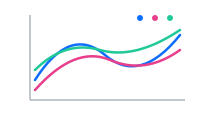

Custom Plotting

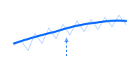

Introduction to Smoothing

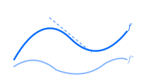

Working with Derivatives

Simulation Toolbox

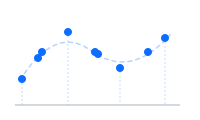

Irregular Sampling

## Represent

Decompose, transform, rank, and measure functional data.

Functional PCA

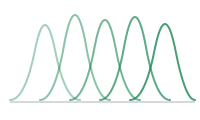

Basis Representation

Andrews Curves

Depth Functions

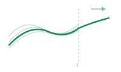

Streaming Depth

Distance Metrics

## Align

Register and align curves to remove phase variability.

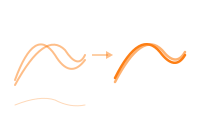

Elastic Alignment

Landmark Registration

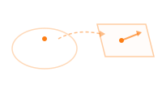

TSRVF (Tangent Space)

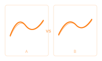

Comparing Methods

## Regression

Regression, classification, and mixed models for functional data.

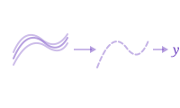

Nonparametric Regression

Functional Regression

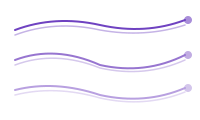

Classification

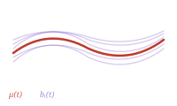

Mixed Models

## Analyze

Infer, cluster, detect outliers, and test functional data.

Tolerance Bands

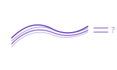

Equivalence Testing

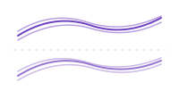

Clustering

GMM Clustering

Outlier Detection

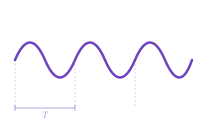

Seasonal Analysis

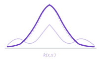

Covariance Functions
