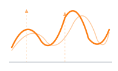

<!-- index.md is the pkgdown home page; README.md remains for GitHub -->

[](https://github.com/sipemu/fdars-r/actions/workflows/r-cmd-check.yml)
[](https://CRAN.R-project.org/package=fdars)
[](https://cran.r-project.org/package=fdars)
[](https://opensource.org/licenses/MIT)
[](https://app.codecov.io/gh/sipemu/fdars-r)

## Functional Data Analysis in Rust

**fdars** is a comprehensive R toolkit for functional data analysis powered by a high-performance Rust backend. Treat entire curves, spectra, and trajectories as single observations — then smooth, align, decompose, and analyze them with a consistent, pipe-friendly API.

<p style="margin-top:0.5rem;">
<a class="btn btn-primary" href="articles/introduction.html" role="button">Get started</a>
<a class="btn btn-outline-secondary" href="reference/index.html" role="button">Reference</a>
</p>

---

<!-- Column of section cards -->

```{=html}
<!-- ===== LEARN ===== -->
<h2 class="fdars-section-heading fdars-learn">Learn</h2>
<p class="text-muted" style="margin-top:-0.5rem;margin-bottom:1rem;">Get started, preprocess, and simulate functional data.</p>
<div class="fdars-card-grid">

  <a class="fdars-card fdars-learn" href="articles/introduction.html">
    <div class="card h-100">
      
      <div class="card-body">
        <h3 class="card-title h6">Introduction to fdars</h3>
        <p class="card-text">Get started with functional data objects and basic operations</p>
      </div>
    </div>
  </a>

  <a class="fdars-card fdars-learn" href="articles/custom-plotting.html">
    <div class="card h-100">
      
      <div class="card-body">
        <h3 class="card-title h6">Custom Plotting</h3>
        <p class="card-text">Customize curve visualizations with ggplot2</p>
      </div>
    </div>
  </a>

  <a class="fdars-card fdars-learn" href="articles/intro-to-smoothing.html">
    <div class="card h-100">
      
      <div class="card-body">
        <h3 class="card-title h6">Introduction to Smoothing</h3>
        <p class="card-text">Smooth noisy curves using kernel and spline methods</p>
      </div>
    </div>
  </a>

  <a class="fdars-card fdars-learn" href="articles/working-with-derivatives.html">
    <div class="card h-100">
      
      <div class="card-body">
        <h3 class="card-title h6">Working with Derivatives</h3>
        <p class="card-text">Compute and analyze functional derivatives</p>
      </div>
    </div>
  </a>

  <a class="fdars-card fdars-learn" href="articles/simulation-toolbox.html">
    <div class="card h-100">
      
      <div class="card-body">
        <h3 class="card-title h6">Simulation Toolbox</h3>
        <p class="card-text">Generate synthetic functional data</p>
      </div>
    </div>
  </a>

  <a class="fdars-card fdars-learn" href="articles/irregular-sampling.html">
    <div class="card h-100">
      
      <div class="card-body">
        <h3 class="card-title h6">Irregular Sampling</h3>
        <p class="card-text">Work with irregularly sampled and sparse data</p>
      </div>
    </div>
  </a>

</div>

<!-- ===== REPRESENT ===== -->
<h2 class="fdars-section-heading fdars-represent">Represent</h2>
<p class="text-muted" style="margin-top:-0.5rem;margin-bottom:1rem;">Decompose, transform, rank, and measure functional data.</p>
<div class="fdars-card-grid">

  <a class="fdars-card fdars-represent" href="articles/fpca.html">
    <div class="card h-100">
      
      <div class="card-body">
        <h3 class="card-title h6">Functional PCA</h3>
        <p class="card-text">Extract dominant modes of variation</p>
      </div>
    </div>
  </a>

  <a class="fdars-card fdars-represent" href="articles/basis-representation.html">
    <div class="card h-100">
      
      <div class="card-body">
        <h3 class="card-title h6">Basis Representation</h3>
        <p class="card-text">Expand curves in B-spline and Fourier bases</p>
      </div>
    </div>
  </a>

  <a class="fdars-card fdars-represent" href="articles/andrews-transformation.html">
    <div class="card h-100">
      
      <div class="card-body">
        <h3 class="card-title h6">Andrews Curves</h3>
        <p class="card-text">Transform multivariate data into functional curves</p>
      </div>
    </div>
  </a>

  <a class="fdars-card fdars-represent" href="articles/depth-functions.html">
    <div class="card h-100">
      
      <div class="card-body">
        <h3 class="card-title h6">Depth Functions</h3>
        <p class="card-text">Rank curves from center outward using statistical depth</p>
      </div>
    </div>
  </a>

  <a class="fdars-card fdars-represent" href="articles/streaming-depth.html">
    <div class="card h-100">
      
      <div class="card-body">
        <h3 class="card-title h6">Streaming Depth</h3>
        <p class="card-text">Monitor depth in real-time as new curves arrive</p>
      </div>
    </div>
  </a>

  <a class="fdars-card fdars-represent" href="articles/distance-metrics.html">
    <div class="card h-100">
      
      <div class="card-body">
        <h3 class="card-title h6">Distance Metrics</h3>
        <p class="card-text">Measure similarity with L<sup>p</sup>, DTW, and elastic distances</p>
      </div>
    </div>
  </a>

</div>

<!-- ===== ALIGN ===== -->
<h2 class="fdars-section-heading fdars-align">Align</h2>
<p class="text-muted" style="margin-top:-0.5rem;margin-bottom:1rem;">Register and align curves to remove phase variability.</p>
<div class="fdars-card-grid">

  <a class="fdars-card fdars-align" href="articles/elastic-alignment.html">
    <div class="card h-100">
      
      <div class="card-body">
        <h3 class="card-title h6">Elastic Alignment</h3>
        <p class="card-text">Remove phase variability via SRSF</p>
      </div>
    </div>
  </a>

  <a class="fdars-card fdars-align" href="articles/landmark-registration.html">
    <div class="card h-100">
      
      <div class="card-body">
        <h3 class="card-title h6">Landmark Registration</h3>
        <p class="card-text">Align curves by matching peaks and valleys</p>
      </div>
    </div>
  </a>

  <a class="fdars-card fdars-align" href="articles/tsrvf.html">
    <div class="card h-100">
      
      <div class="card-body">
        <h3 class="card-title h6">TSRVF (Tangent Space)</h3>
        <p class="card-text">Project aligned curves into a linear tangent space</p>
      </div>
    </div>
  </a>

  <a class="fdars-card fdars-align" href="articles/alignment-comparison.html">
    <div class="card h-100">
      
      <div class="card-body">
        <h3 class="card-title h6">Comparing Methods</h3>
        <p class="card-text">Compare alignment methods side-by-side</p>
      </div>
    </div>
  </a>

</div>

<!-- ===== ANALYZE ===== -->
<h2 class="fdars-section-heading fdars-analyze">Analyze</h2>
<p class="text-muted" style="margin-top:-0.5rem;margin-bottom:1rem;">Infer, classify, predict, and model functional data.</p>
<div class="fdars-card-grid">

  <a class="fdars-card fdars-analyze" href="articles/tolerance-bands.html">
    <div class="card h-100">
      
      <div class="card-body">
        <h3 class="card-title h6">Tolerance Bands</h3>
        <p class="card-text">Construct tolerance and confidence bands</p>
      </div>
    </div>
  </a>

  <a class="fdars-card fdars-analyze" href="articles/equivalence-testing.html">
    <div class="card h-100">
      
      <div class="card-body">
        <h3 class="card-title h6">Equivalence Testing</h3>
        <p class="card-text">Test functional equivalence between groups</p>
      </div>
    </div>
  </a>

  <a class="fdars-card fdars-analyze" href="articles/clustering.html">
    <div class="card h-100">
      
      <div class="card-body">
        <h3 class="card-title h6">Clustering</h3>
        <p class="card-text">Group similar curves with k-means and fuzzy c-means</p>
      </div>
    </div>
  </a>

  <a class="fdars-card fdars-analyze" href="articles/outlier-detection.html">
    <div class="card h-100">
      
      <div class="card-body">
        <h3 class="card-title h6">Outlier Detection</h3>
        <p class="card-text">Identify anomalous curves using depth</p>
      </div>
    </div>
  </a>

  <a class="fdars-card fdars-analyze" href="articles/regression.html">
    <div class="card h-100">
      
      <div class="card-body">
        <h3 class="card-title h6">Regression</h3>
        <p class="card-text">Predict scalar outcomes from functional predictors</p>
      </div>
    </div>
  </a>

  <a class="fdars-card fdars-analyze" href="articles/seasonal-analysis.html">
    <div class="card h-100">
      
      <div class="card-body">
        <h3 class="card-title h6">Seasonal Analysis</h3>
        <p class="card-text">Detect and decompose seasonal patterns</p>
      </div>
    </div>
  </a>

  <a class="fdars-card fdars-analyze" href="articles/covariance-functions.html">
    <div class="card h-100">
      
      <div class="card-body">
        <h3 class="card-title h6">Covariance Functions</h3>
        <p class="card-text">Build GP models with composable kernels</p>
      </div>
    </div>
  </a>

</div>
```
